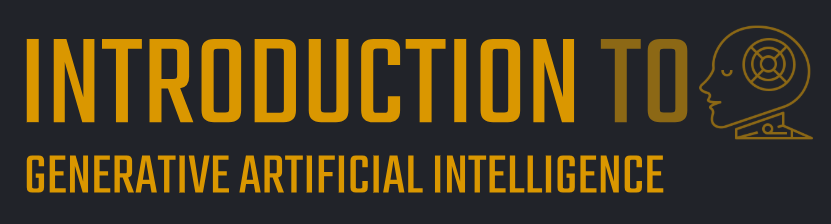

# Introduction to Generative Artificial Intelligence   

### AWS <a href="../../">aws   </a>
### Training Category: <a href="../../aws_educate/">aws_educate</a>
### Software/Subject: aws   
### Course: <a href="./">curso_educ_001 (Introduction to Generative Artificial Intelligence)   </a>

#### <a href="https://github.com/PedroHeeger/main/blob/main/cert_ti/03-conclu/cloud/aws/(23-09-14)_Cert_Descubra...Nuvem_AWS-LocalizaLabs_PH_DIO.pdf">Certificate</a>

---

### Theme:
- Artificial Intelligence (AI)
- Cloud Computing

### Used Tools:
- Operating System (OS): 
  - Windows 11   
- Cloud:
  - Amazon Web Services (AWS)   
- Cloud Services:
  - Amazon Bedrock   
  - Amazon Q Developer   
  - Amazon SageMaker   
  - AWS Inferentia   
  - AWS Trainium   
  - Google Drive   
- Language:
  - HTML   
  - Markdown   
- Integrated Development Environment (IDE) and Text Editor:
  - Visual Studio Code (VS Code)   
- Versioning: 
  - Git   
- Repository:
  - GitHub   

---

<a name="item0"><h3>Course Strcuture:</h3></a>
1 Welcome 
2. <a href="#item02">O novo caminho do aprendizado de máquina</a> 
3. Objetivos do curso 
4. <a href="#item04">O que é IA generativa?</a> 
5. <a href="#item05">Como a IA generativa difere da IA ​​tradicional</a> 
6. <a href="#item06">Modelos de fundação (Foundation models - FMs)</a> 
7. <a href="#item07">Comparações de modelos tradicionais e fundamentais</a> 
8. <a href="#item08">Engenharia de Prompt (Prompt Engineering)</a> 
9. <a href="#item09">Como funciona a Engenharia de Prompt</a> 
10. <a href="#item10">Exemplo de TI de Engenharia de Prompt</a> 
11. <a href="#item11">Tipos de modelos de fundação</a> 
12. <a href="#item12">Casos de uso de IA generativa</a> 
13. <a href="#item13">Casos de uso de IA generativa na indústria</a> 
14. <a href="#item14">Casos de uso de IA generativa na indústria: Assistência médica</a> 
15. <a href="#item15">Casos de uso de IA generativa na indústria: Ciências da vida</a> 
16. <a href="#item16">Casos de uso de IA generativa na indústria: Serviços financeiros</a> 
17. <a href="#item17">Casos de uso de IA generativa na indústria: Manufatura</a> 
18. <a href="#item18">Casos de uso de IA generativa na indústria: Varejo</a> 
19. <a href="#item19">Casos de uso de IA generativa na indústria: Mídia e entretenimento</a> 
20. <a href="#item20">Benefícios de usar a AWS para suas soluções de IA generativa</a> 
21. <a href="#item21">Serviços de IA generativa da AWS</a> 

---

### Objective:
O objetivo deste curso é introduzir o domínio da IA generativa, destacando as diferenças em relação à IA tradicional, apresentando os modelos de fundação (Foundation Models - FMs), explorando casos de uso e demonstrando serviços e recursos da **AWS** voltados à IA generativa, bem como seus benefícios.

### Structure:
A estrutura do curso é formada por:
- Este arquivo de README.
- A pasta `0-aux`, pasta auxiliar com imagens utilizadas na construção desse arquivo de README. 

### Development:
<a name="item02"><h4>O novo caminho do aprendizado de máquina</h4></a>[Back to summary](#item0)

Nos últimos tempos, o uso de machine learning tem transformado o cenário da inteligência artificial, abrindo espaço para novas formas de aplicação. Um dos desdobramentos mais recentes e promissores é a IA generativa, que vem otimizando processos, acelerando entregas e permitindo que equipes dediquem mais esforço à inovação e à estratégia de negócio.

<a name="item04"><h4>O que é IA generativa?</h4></a>[Back to summary](#item0)

A inteligência artificial generativa representa uma vertente da IA projetada para desenvolver conteúdos inéditos, como textos, diálogos, imagens, vídeos e composições musicais. Por trás dessa tecnologia estão modelos avançados de aprendizado de máquina, que analisam grandes volumes de dados e aprendem padrões para criar materiais originais automaticamente. O resultado pode ser ajustado conforme necessário, permitindo personalizações de acordo com objetivos específicos.

<a name="item05"><h4>Como a IA generativa difere da IA ​​tradicional</h4></a>[Back to summary](#item0)

A inteligência artificial generativa se diferencia do aprendizado de máquina tradicional principalmente pela sua capacidade criativa. Enquanto os modelos tradicionais de aprendizado de máquina são desenvolvidos para realizar tarefas específicas como classificar imagens, prever tendências ou identificar sentimentos, com base em dados previamente fornecidos, a IA generativa vai além da simples análise.

Nos métodos tradicionais, o sistema aprende padrões a partir de um conjunto de dados limitado e realiza previsões com base nesses padrões. Cada modelo é geralmente projetado para uma única função e exige treinamento cuidadoso com dados relevantes para que funcione corretamente.

Já a IA generativa opera com modelos mais amplos e versáteis, treinados previamente com imensos volumes de informações de diferentes áreas. Esses modelos não apenas reconhecem padrões, mas também usam esse conhecimento para criar novos conteúdos como textos, imagens ou códigos, a partir de instruções fornecidas pelo usuário, chamadas de prompts. Em vez de apenas prever ou classificar, ela gera algo novo com base no contexto aprendido, oferecendo mais flexibilidade e criatividade no uso da inteligência artificial.

<a name="item06"><h4>Modelos de fundação (Foundation models - FMs)</h4></a>[Back to summary](#item0)

Os chamados modelos de fundação são estruturas centrais por trás da inteligência artificial generativa. Eles representam uma nova geração de modelos de aprendizado de máquina, caracterizados por sua versatilidade e escala. Ao contrário dos modelos tradicionais, que são desenvolvidos para executar uma tarefa específica com base em dados limitados, os modelos de fundação são pré-treinados com grandes volumes de dados variados, abrangendo diferentes domínios e contextos.

Essa base ampla permite que esses modelos sejam aplicados a uma série de tarefas distintas como gerar textos, resumir informações, responder perguntas, extrair dados relevantes e até mesmo sustentar diálogos em chatbots. Sua grande força está na capacidade de adaptação: com apenas pequenos ajustes ou instruções (os prompts), eles conseguem responder de forma contextualizada e criativa, oferecendo soluções para uma variedade de demandas sem a necessidade de um novo treinamento completo para cada uma.

<a name="item07"><h4>Comparações de modelos tradicionais e de fundação</h4></a>[Back to summary](#item0)

Modelos tradicionais de aprendizado de máquina são projetados para resolver problemas específicos. Cada vez que se deseja aplicar esse tipo de modelo a uma nova tarefa como identificar sentimentos em textos, classificar imagens ou prever comportamentos, é necessário começar quase do zero: reunir dados rotulados, treinar um modelo do início e, só então, colocá-lo em produção. Esse processo é repetido para cada novo caso de uso, o que consome tempo e recursos.

Já os modelos de fundação seguem uma lógica diferente. Eles são modelos robustos e pré-treinados com grandes volumes de dados de uso geral, permitindo que sirvam de base para múltiplas aplicações. Em vez de construir um modelo específico para cada tarefa, usa-se um único modelo de fundação como ponto de partida, adaptando-o para diferentes finalidades com muito menos dados e esforço computacional, ou seja, realizando o ajuste fino. Além disso, esses modelos podem ser ajustados para atender demandas específicas de um negócio, mantendo a eficiência e ampliando a aplicabilidade. Em resumo, os modelos tradicionais são especializados e limitados, enquanto os modelos de fundação são amplos, reutilizáveis e altamente adaptáveis.

Abaixo está uma representação da hierarquia de IA, destacando o papel da IA generativa dentro dos modelos de fundação e sua relação com a engenharia de prompt.
- IA:
  - Machine Learning:
    - Modelos de Machine Learning:
      - Modelos Tradicionais
      - Modelos de Fundação (FMs):
        - IA Generativa:
          - Engenharia de Prompt: Prompt = Entrada -> Inferência -> Saída

<a name="item08"><h4>Engenharia de Prompt (Prompt Engineering)</h4></a>[Back to summary](#item0)

A Engenharia de Prompt é a técnica usada para conversar com modelos de inteligência artificial generativa de forma mais eficiente e precisa. Em vez de simplesmente enviar qualquer pergunta ou comando, a ideia é estruturar a entrada (o prompt) de maneira estratégica para que o modelo entenda melhor o que se espera dele e gere exatamente o tipo de resposta desejada. Isso envolve escolher as palavras certas, fornecer um bom contexto, dar instruções claras e até exemplos, quando necessário. É como formular a pergunta certa para obter a melhor resposta possível.

Essa prática é essencial porque, embora os modelos de base sejam poderosos, eles são altamente influenciados pela forma como recebem as instruções. Um prompt bem elaborado pode transformar uma resposta genérica em algo muito mais útil, detalhado e adaptado ao seu objetivo. Em resumo, a engenharia de prompt é uma ponte entre o que se quer e o que a IA pode entregar, e quanto melhor essa ponte for construída, melhor será o resultado gerado.

<a name="item09"><h4>Como funciona a Engenharia de Prompt</h4></a>[Back to summary](#item0)

A engenharia de prompt tem início com a formulação de uma entrada, chamada de prompt. Esse prompt consiste em um texto direcionado ao modelo de inteligência artificial, com o objetivo de solicitar uma resposta. A partir dessa entrada, o modelo realiza um processo conhecido como inferência, no qual interpreta o conteúdo e gera uma resposta correspondente. O resultado gerado é apresentado como saída.

Por exemplo, ao utilizar o prompt "Onde o Japão está localizado?", o modelo pode responder com "O Japão está localizado no noroeste do Oceano Pacífico". No entanto, nem sempre a saída gerada será adequada, clara ou precisa. Em casos assim, torna-se necessário ajustar o prompt, tornando-o mais específico, informativo ou estruturado de forma mais adequada.

Além de reescrever o texto da entrada, também é possível apresentar exemplos do tipo de resposta desejada, o que ajuda o modelo a compreender com maior precisão a tarefa que está sendo solicitada. Dessa forma, a engenharia de prompt envolve um processo contínuo de refinamento, com o objetivo de obter resultados mais relevantes e alinhados à intenção original.

<a name="item10"><h4>Exemplo de TI de Engenharia de Prompt</h4></a>[Back to summary](#item0)

Um exemplo prático de como a engenharia de prompt pode ajudar os profissionais de TI a economizar tempo no desenvolvimento de software envolve o uso do **Amazon Q Developer**. Este serviço de IA generativa facilita a codificação ao permitir que os desenvolvedores interajam com o modelo por meio de prompts em linguagem natural, o que acelera a criação de código e torna o processo mais intuitivo.

Imagine que, durante o desenvolvimento de uma aplicação, é necessário criar uma função para verificar se um endereço de e-mail é válido. Em vez de escrever a função do zero, basta digitar um prompt de linguagem natural no ambiente de desenvolvimento integrado (IDE), por exemplo, "escreva uma função para verificar um endereço de e-mail". O **Amazon Q Developer**, por meio de seu modelo de base, gera várias opções de código relacionadas ao pedido.

No IDE, é possível usar as teclas de seta para navegar pelas sugestões de código geradas pela IA. Depois de revisar as opções, é possível pressionar a tecla Tab para escolher a sugestão mais adequada ao caso de uso. Por exemplo, o modelo pode sugerir uma função com uma instrução de if else para verificar se o e-mail é válido. Após pressionar Enter, o código gerado aparece no editor. A edição do código gerado é totalmente possível, permitindo ajustes conforme as necessidades do projeto. Ao adotar o código gerado, ele se integra ao fluxo de trabalho, economizando tempo ao eliminar a necessidade de escrever a lógica da função manualmente.

Esse exemplo demonstra como a engenharia de prompt, com o uso de IA generativa, pode reduzir significativamente o tempo de desenvolvimento, ajudando desenvolvedores a criar código de forma rápida, eficiente e sem comprometer a qualidade.

<a name="item11"><h4>Tipos de modelos de fundação</h4></a>[Back to summary](#item0)

Existem diferentes tipos de modelos de fundação, cada um projetado para atender a tarefas específicas, com capacidades distintas. Abaixo, estão os principais tipos de modelos de fundação e suas características:
- Text-to-text: Modelos de fundação text-to-text são criados para realizar tarefas de processamento de linguagem natural, onde o modelo recebe um texto como entrada e gera um novo texto como saída. Esses modelos são usados para uma variedade de aplicações, como resumo de textos, extração de informações, respostas a perguntas e geração de conteúdo. Por exemplo, um modelo text-to-text pode ser utilizado para preencher automaticamente uma frase ou para gerar um texto mais conciso a partir de uma explicação longa.
- Text-to-embeddings: Modelos text-to-embeddings funcionam transformando um texto em uma representação numérica, chamada de embedding, que permite comparar diferentes trechos de texto entre si. Esses modelos são particularmente úteis em aplicações como mecanismos de busca, recomendação de produtos e comparação de dados textuais. Um exemplo prático é a busca de produtos na Amazon, onde o texto digitado pelo usuário é comparado com o catálogo de produtos indexado, gerando resultados mais precisos e relevantes com base nas similaridades encontradas.
- Multimodal: Modelos multimodais são capazes de lidar com diferentes tipos de dados simultaneamente, como texto e imagem. Isso significa que eles podem entender uma descrição em texto e gerar imagens a partir dessa entrada, ou vice-versa. Esses modelos são amplamente utilizados em geração de imagens, criação de conteúdo visual e aplicações de design gráfico. Um exemplo popular é o **Stable Diffusion**, que gera imagens a partir de descrições textuais, sendo amplamente utilizado na criação de arte digital e ilustrações.

<a name="item12"><h4>Casos de uso de IA generativa</h4></a>[Back to summary](#item0)

A IA generativa pode ser usada em uma ampla gama de tópicos que são apresentados abaixo:
- Chatbots e assistentes virtuais: A IA generativa pode automatizar as respostas às consultas de atendimento ao cliente, simplificando processos de autoatendimento e reduzindo custos operacionais por meio de chatbots generativos, bots de voz e assistentes virtuais.
- Assistência ao agente e análise de chamadas: A IA pode resumir as conversas com os clientes, economizando tempo de agentes e supervisores ao revisar anotações, além de analisar interações para gerar insights e monitorar o desempenho dos agentes.
- Personalização: Com a IA generativa, é possível oferecer experiências personalizadas para os clientes, aumentando o engajamento por meio de ofertas e comunicações adaptadas aos interesses e comportamentos individuais.
- Busca conversacional: A IA ajuda a melhorar a produtividade, permitindo que funcionários encontrem informações rapidamente e resumam conteúdos por meio de interfaces conversacionais, facilitando a pesquisa e o acesso a dados.
- Geração de código: A IA pode acelerar o desenvolvimento de software ao sugerir trechos de código com base nos comentários do desenvolvedor e no código existente, melhorando a eficiência do processo de programação.
- Geração automatizada de relatórios: A IA generativa pode criar automaticamente relatórios financeiros, resumos e projeções, economizando tempo e minimizando erros ao gerar documentos de forma automatizada.
- Processamento inteligente de documentos: A IA pode extrair, resumir e analisar dados de documentos, proporcionando insights e respostas automáticas com base nas informações contidas, otimizando a análise de grandes volumes de dados.
- Aumento de dados: A IA generativa pode criar dados sintéticos para treinar modelos de aprendizado de máquina, especialmente quando os dados reais são escassos, desequilibrados ou sensíveis, melhorando a qualidade do treinamento.
- Otimização da cadeia de suprimentos: A IA pode ser usada para otimizar a logística da cadeia de suprimentos, analisando e avaliando diferentes cenários para reduzir custos e melhorar a eficiência operacional.
- Conteúdo de marketing gerado por IA: A IA pode criar conteúdos de marketing envolventes, como postagens de blog, atualizações em redes sociais e boletins informativos, economizando tempo e recursos ao automatizar o processo criativo.
- Conteúdo de vendas, orientação e capacitação gerados por IA: A IA pode gerar mensagens e e-mails personalizados com base no comportamento e perfil dos clientes, além de criar roteiros de vendas ajustados a diferentes segmentos e necessidades.
- Desenvolvimento de novos produtos: A IA pode gerar protótipos de design com base em entradas específicas, acelerando o processo de ideação e otimizando designs existentes com base no feedback do usuário e nas restrições fornecidas.

<a name="item13"><h4>Casos de uso de IA generativa na indústria</h4></a>[Back to summary](#item0)

A IA generativa está transformando diversos setores da indústria, oferecendo soluções inovadoras para otimizar processos e impulsionar a produtividade. De forma geral, ela é aplicada em tarefas como automação de produção, design de produtos, análise de dados e previsão de demanda. No setor industrial, a IA generativa pode ser utilizada para criar protótipos de design, simular processos de fabricação, melhorar a manutenção preditiva de equipamentos e otimizar a logística. Além disso, ela auxilia na personalização de produtos e serviços, melhorando a experiência do cliente. Nos próximos tópicos, será explorado como a IA generativa está sendo aplicada de maneira mais específica em diferentes áreas da indústria.

<a name="item14"><h4>Casos de uso de IA generativa na indústria: Assistência médica</h4></a>[Back to summary](#item0)

A IA generativa tem mostrado grande potencial para revolucionar a assistência médica, oferecendo soluções inovadoras que melhoram a eficiência e a precisão nos serviços de saúde. Alguns dos principais casos de uso incluem:
- Escriba Digital: A IA pode criar transcrições automáticas das interações médico-paciente, extrair detalhes importantes e gerar resumos dessas conversas, facilitando o acompanhamento e a documentação do histórico do paciente.
- Interpretação de Imagens Médicas: A IA generativa pode aprimorar, reconstruir ou até gerar novas imagens, como raios-X, ressonâncias magnéticas e tomografias computadorizadas, ajudando os médicos a realizar diagnósticos mais precisos.
- Medicina Personalizada: Com base em dados genéticos, estilo de vida e sintomas do paciente, a IA pode criar planos de tratamento sob medida, oferecendo soluções mais eficazes e personalizadas.
- Assistência de Saúde Inteligente: A IA pode automatizar tarefas como resumo de relatórios de chamadas e avaliar o desempenho dos agentes de atendimento em planos de saúde, melhorando a eficiência operacional.
- Automatização da Codificação Médica: A IA pode automatizar a codificação de solicitações médicas, reduzindo erros, acelerando o processo de faturamento e garantindo o cumprimento das regulamentações e requisitos de conformidade.

<a name="item15"><h4>Casos de uso de IA generativa na indústria: Ciências da vida</h4></a>[Back to summary](#item0)

A IA generativa tem transformado o campo das ciências da vida, acelerando processos e trazendo maior precisão no desenvolvimento de novos tratamentos e medicamentos. Alguns dos principais casos de uso incluem:
- Desenvolvimento Clínico: A IA pode analisar grandes volumes de dados para identificar potenciais reações adversas a medicamentos, tanto em estudos clínicos quanto para medicamentos já comercializados, melhorando a segurança dos tratamentos.
- Descoberta de Medicamentos: Ferramentas de IA generativa ajudam no dobramento de proteínas, design de sequências e moléculas, acelerando a descoberta de novos medicamentos e a otimização do processo de design, reduzindo custos e tempo.
- Aprimoramento dos Ensaios Clínicos: A IA permite a síntese rápida de grandes volumes de dados de ensaios combinatórios, simula populações de pacientes e otimiza o design de protocolos, tornando os ensaios clínicos mais eficientes.
- Relatórios de Pesquisa Automatizados: A IA pode gerar documentos e narrativas a partir de conjuntos de dados de pesquisa, como relatórios científicos, coletando informações de ensaios clínicos e fornecendo resumos detalhados de cada fase do estudo.
- Recrutamento Otimizado para Ensaios Clínicos: A IA generativa pode associar pacientes a ensaios clínicos com base em critérios específicos de inclusão e exclusão, como determinar a elegibilidade com base nas comorbidades, acelerando a alocação de pacientes para testes.

<a name="item16"><h4>Casos de uso de IA generativa na indústria: Serviços financeiros</h4></a>[Back to summary](#item0)

A IA generativa está sendo amplamente aplicada no setor de serviços financeiros, oferecendo soluções para otimizar processos, melhorar a personalização e aumentar a eficiência. Alguns dos principais casos de uso incluem:
- Portfólios Gerenciados por IA: A IA generativa pode criar estratégias de investimento altamente personalizadas, alinhando portfólios a objetivos financeiros e perfis de risco específicos, oferecendo uma gestão mais precisa e adaptada a cada investidor.
- Aumento do Valor Comercial do Conteúdo Não Estruturado: Com IA, é possível transformar grandes volumes de dados não estruturados, como e-mails, repositórios de documentos e registros, em produtos de dados estruturados sob demanda, como mapas de concorrentes, cadeias de suprimentos e catálogos de produtos.
- Inovação de Produtos e Automação de Processos de Negócios: A IA generativa é utilizada para desenvolver novas ferramentas que ajudam na triagem de ações, análise de investimentos institucionais e gestão de patrimônio, automatizando processos e inovando a oferta de serviços financeiros.
- Consultoria Inteligente: Chatbots e assistentes virtuais podem ser usados para traduzir automaticamente perguntas complexas de clientes e usuários internos, analisar o contexto e gerar respostas precisas e conversacionais, facilitando o atendimento e melhorando a experiência do cliente.
- Transformação da Documentação Financeira: A IA permite a criação rápida de documentos financeiros, como pesquisas de investimento, apólices de seguro, solicitações de informações e comunicações regulatórias, otimizando a elaboração de relatórios e reduzindo o tempo necessário para gerar essas informações.

<a name="item17"><h4>Casos de uso de IA generativa na indústria: Manufatura</h4></a>[Back to summary](#item0)

A IA generativa está transformando a indústria manufatureira, otimizando processos e oferecendo soluções inovadoras para melhorar a produção e a eficiência. Alguns casos de uso incluem:
- Otimização do Design do Produto: A IA generativa pode gerar e avaliar diversas opções de design rapidamente, ajudando os fabricantes a encontrar soluções mais otimizadas, eficientes e econômicas, o que acelera o desenvolvimento de novos produtos.
- Eficiência Operacional: A IA pode simular o processo de produção para identificar oportunidades de melhorias, fornecer insights ocultos, validar modelos com dados sintéticos e aumentar a precisão das previsões, tudo sem interromper as operações em andamento.
- Rastreabilidade da Cadeia de Suprimentos: A IA oferece rastreabilidade de ponta a ponta em cadeias de suprimentos multiníveis, permitindo identificar anomalias ou lacunas nos dados, o que melhora a transparência e o controle de qualidade.
- Assistentes de Manutenção com Tecnologia de IA: Agentes de conversação generativos podem ser treinados com manuais de produtos, guias de solução de problemas e notas de manutenção para fornecer suporte técnico rápido aos trabalhadores, reduzindo o tempo de inatividade e aumentando a eficiência da operação.
- Transforme a Documentação Financeira: A IA generativa pode elaborar rapidamente diversos tipos de documentos financeiros, como pesquisas de investimento, documentação de empréstimos, apólices de seguro, comunicações regulatórias, solicitações de informações e correspondências comerciais. Isso agiliza os processos administrativos e reduz o tempo necessário para gerar esses materiais, garantindo também maior precisão e conformidade regulatória.

<a name="item18"><h4>Casos de uso de IA generativa na indústria: Varejo</h4></a>[Back to summary](#item0)

A IA generativa está sendo cada vez mais aplicada no setor de varejo, oferecendo uma gama de soluções para melhorar a eficiência e otimizar operações. Alguns dos principais casos de uso incluem:
- Otimização do design do produto: A IA generativa pode gerar e avaliar rapidamente diversas opções de design, ajudando os fabricantes a encontrar as soluções mais otimizadas, eficientes e econômicas.
- Eficiência operacional: A IA pode simular processos de produção para identificar melhorias, encontrar insights ocultos e aumentar a precisão preditiva, tudo isso sem interromper as operações diárias.
- Rastreabilidade da cadeia de suprimentos: A IA permite rastrear componentes ao longo de toda a cadeia de suprimentos, identificando lacunas ou anomalias em dados e garantindo maior transparência.
- Assistentes de manutenção com tecnologia de IA: Agentes de conversação generativos, treinados em manuais de produtos e guias de solução de problemas, oferecem suporte técnico rápido aos trabalhadores, reduzindo o tempo de inatividade.
- Diagnóstico de equipamentos em tempo real: A IA pode ingerir dados históricos e realizar diagnósticos de falhas em equipamentos, recomendando ações de manutenção, ajustes ou peças de reposição necessárias para garantir a continuidade das operações.

<a name="item19"><h4>Casos de uso de IA generativa na indústria: Mídia e entretenimento</h4></a>[Back to summary](#item0)

A IA generativa está transformando o setor de Mídia e Entretenimento, permitindo a criação de conteúdo de alta qualidade, personalização e otimização da experiência do usuário. Os principais casos de uso incluem:
- Produção de conteúdo de alta qualidade em escala: A IA generativa pode criar personagens, animações e efeitos visuais de maneira automatizada, adaptados a temas, gêneros ou formatos específicos.
- Otimização da experiência dos assinantes: A IA permite a criação de conteúdo personalizado que se adapta em tempo real com base no engajamento e nas preferências dos usuários, proporcionando uma experiência mais envolvente.
- Enriquecimento do conteúdo da transmissão: Durante transmissões ao vivo, a IA generativa pode aprimorar o conteúdo com gráficos automatizados, fala e vídeos adaptados a cada programa.
- Geração automatizada de destaques: Para eventos esportivos, a IA é capaz de detectar momentos importantes e gerar pacotes de destaques e promoções de forma automática, economizando tempo e recursos.
- Marcação automática de conteúdo: A IA pode ser usada para marcar e indexar grandes bibliotecas de mídia, facilitando a pesquisa e recomendação de conteúdos, melhorando a navegação e o acesso a materiais.

<a name="item20"><h4>Benefícios de usar a AWS para suas soluções de IA generativa</h4></a>[Back to summary](#item0)

A AWS oferece uma plataforma robusta e flexível para atender às crescentes necessidades de IA generativa, proporcionando soluções que resolvem os principais desafios enfrentados pelos desenvolvedores. Ao adotar a AWS, as empresas podem aproveitar os seguintes benefícios:
- Flexibilidade: A AWS oferece uma ampla gama de Modelos Fundacionais (FMs) de alto desempenho, desenvolvidos tanto pela Amazon quanto por principais startups de IA, como AI21 Labs, Anthropic e Stability AI. Isso garante que os clientes encontrem a solução mais adequada às suas necessidades de negócios, sem limitações em termos de opções ou desempenho.
- Personalização segura: Com o **Amazon Bedrock**, a AWS permite que os clientes personalizem modelos para tarefas específicas de maneira fácil e segura. A personalização pode ser feita com apenas 20 exemplos de dados, sem a necessidade de grandes volumes de dados anotados. Além disso, os dados dos clientes permanecem totalmente protegidos, criptografados e dentro de uma nuvem privada virtual (VPC), garantindo privacidade e segurança total.
- Infraestrutura econômica: A AWS proporciona uma infraestrutura de alto desempenho a um custo-benefício excepcional, ideal para IA generativa. A plataforma utiliza chips de Machine Learning desenvolvidos pela própria AWS e GPUs da NVIDIA, permitindo que os clientes escalem suas operações de forma econômica, mesmo com FMs de centenas de bilhões de parâmetros.
- Construtor amigável: A AWS facilita a integração e implantação de FMs em aplicativos e cargas de trabalho, permitindo que os clientes tragam os modelos para seus dados, em vez de enviar os dados para os modelos. Com serviços como o **Amazon SageMaker** e o **Amazon S3**, a AWS oferece uma experiência de uso simplificada e familiar para os desenvolvedores, acelerando o processo de implementação.
- Serviços AWS para IA generativa: A AWS integra soluções de IA generativa, como o **Amazon Q Developer**, para melhorar a produtividade dos clientes. Além disso, os serviços da AWS permitem a implementação de soluções como sumarização de chamadas e respostas a perguntas, combinando FMs poderosos com os principais serviços de IA da plataforma para atender às necessidades específicas dos clientes.

<a name="item21"><h4>Serviços de IA generativa da AWS</h4></a>[Back to summary](#item0)

A AWS oferece uma gama de serviços avançados de IA generativa, permitindo que desenvolvedores e empresas aproveitem o poder da inteligência artificial para transformar seus negócios. Abaixo estão alguns dos principais serviços que a AWS oferece para suportar soluções de IA generativa:
- **Amazon Bedrock**: O **Amazon Bedrock** é um serviço totalmente gerenciado que disponibiliza FMs (Modelos Fundacionais) da Amazon e das principais startups de IA por meio de uma API. Ele permite que os desenvolvedores escolham entre uma variedade de FMs para encontrar o mais adequado aos seus casos de uso específicos. Com o **Amazon Bedrock**, é possível criar aplicativos de IA generativa capazes de fornecer respostas atualizadas a partir de fontes de conhecimento proprietárias e executar uma ampla gama de tarefas.
- **Amazon Q Developer**: O **Amazon Q Developer** é um assistente de codificação baseado em IA que gera sugestões de código em tempo real diretamente no IDE. Ao escrever comentários em linguagem natural (como "Carregar um arquivo com criptografia do lado do servidor"), o Q Developer sugere trechos de código que podem ser usados para realizar a tarefa descrita. Isso acelera o processo de desenvolvimento e ajuda os programadores a gerenciar tarefas complexas rapidamente. Além disso, as sugestões podem ser personalizadas, e existe a opção de revisar e editar o código conforme necessário.
- **AWS Inferentia**: O **AWS Inferentia** é um chip de aprendizado de máquina personalizado desenvolvido pela AWS, projetado para executar inferência de deep learning (DL) com alto desempenho e baixo custo. Os clientes podem usar o Inferentia em instâncias do **Amazon EC2** e utilizar o kit de desenvolvimento de software (SDK) **AWS Neuron** para realizar previsões de inferência em modelos de deep learning. O Inferentia é otimizado para oferecer a melhor performance possível com o menor custo, tornando-se uma solução eficiente para tarefas de inferência em IA generativa.
- **AWS Trainium**: O **AWS Trainium** é um acelerador de treinamento para deep learning (DL) que proporciona alto desempenho e economia de custos em tarefas de treinamento de modelos. As instâncias Trn1 do EC2, que utilizam a tecnologia do **AWS Trainium**, oferecem desempenho superior no treinamento de modelos populares de processamento de linguagem natural (PLN), visão computacional e recomendação, com até 50% de economia em comparação com outras instâncias do EC2. Isso é ideal para modelos complexos de IA generativa, como geração de texto, imagens e vídeos, e detecção de fraudes.
- **Amazon SageMaker JumpStart**: O **Amazon SageMaker JumpStart** facilita o início rápido no uso de Machine Learning (ML) com soluções prontas para os casos de uso mais comuns. Ele oferece modelos e arquiteturas de referência que podem ser implantados rapidamente em poucas etapas. Com o SageMaker JumpStart, os desenvolvedores podem acessar e personalizar modelos populares de código aberto para tarefas como transformação de texto, detecção de objetos, classificação de imagens, entre outras, acelerando a jornada em ML e IA generativa.