# Analytics on AWS   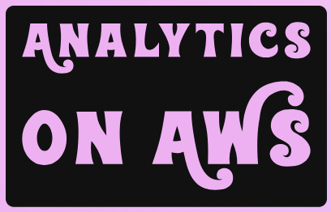

### AWS Skill Builder <a href="../../">aws_skill_builder   </a>
### Training Category: <a href="../../self_paced_lab/">self_paced_lab</a>
### Software/Subject: aws   
### Course: <a href="./">curso_jam_001 (Analytics on AWS)   </a>

---

### Theme:
- Cloud Computing
- Data

### Used Tools:
- Operating System (OS): 
  - Windows 11   
- Cloud:
  - Amazon Web Services (AWS)   
- Cloud Services:
  - Amazon Athena  
  - Amazon Comprehend   
  - Amazon DynamoDB   
  - Amazon Kinesis   
  - Amazon Kinesis Data Streams (KDS)   
  - Amazon Redshift   
  - Amazon Simple Storage Service (S3)   
  - AWS Command Line Interface (CLI)   
  - AWS Glue   
  - AWS Identity and Access Management (IAM)   
  - AWS Lambda   
  - Google Drive   
- Language:
  - HTML   
  - Markdown   
- Integrated Development Environment (IDE) and Text Editor:
  - Visual Studio Code (VS Code)   
- Versioning: 
  - Git   
- Repository:
  - GitHub   

---

<a name="item0"><h3>Course Strcuture:</h3></a>
1. <a href="#item01">Desafio 1: Você consegue entender o sentimento do seu cliente?</a><br>
  1.1 <a href="#item01.1">Tarefa 1: Analise o sentimento para cada avaliação</a><br>
  1.2 <a href="#item01.2">Tarefa 2: Prepare-se para carregar os dados no banco de dados com uma função do IAM</a><br>
  1.3 <a href="#item01.3">Tarefa 3: Copiar a saída da análise de sentimento para o redshift</a><br>
2. <a href="#item02">Desafio 2: Dimensionar corretamente!</a><br>
  2.1 <a href="#item02.1">Tarefa 1: Dividir em escala</a><br>
  2.2 <a href="#item02.2">Tarefa 2: Atualize a contagem de shards para dimensionar</a><br>
  2.3 <a href="#item02.3">Tarefa 3: Dimensionamento sem divisão</a><br>
  2.4 <a href="#item02.4">Tarefa 4: Evite streaming com baixa taxa de transferência</a><br>
3. <a href="#item03">Desafio 3: Ajude-me a encontrar dados de clientes</a><br>
  3.1 <a href="#item03.1">Tarefa 1 : Corrigir formato de arquivo</a><br>
  3.2 <a href="#item03.2">Tarefa 2 : Encontre o esquema</a><br>
  3.3 <a href="#item03.3">Tarefa 3 : O que é nome e contato do cliente?</a><br>

---

### Objective:
Este **AWS Jam** teve como tema principal a análise de dados na **AWS** e foi composto pelos seguintes três desafios:
- `Desafio 1: Você consegue entender o sentimento do seu cliente?`: O objetivo foi realizar uma análise de sentimento em um arquivo de texto contendo avaliações de produtos, utilizando o **Amazon Comprehend**. Após a análise, os resultados foram exportados para um cluster no **Amazon Redshift**.
- `Desafio 2: Dimensionar corretamente!`: O desafio consistiu em configurar diferentes opções de escalabilidade para um fluxo de dados no **Amazon Kinesis Data Streams (KDS)** e para a função **AWS Lambda** consumidora. As ações incluíram: Divisão de um shard; Aumento do número de shards; Elevação do número de invocações simultâneas do Lambda por shard; Ampliação do tamanho do lote processado.
- `Desafio 3: Ajude-me a encontrar dados de clientes`: O objetivo foi criar duas fontes de dados distintas no **Amazon Athena** para realizar consultas relacionando tabelas de ambas.  
  - A primeira fonte foi criada por meio de um trabalho de ETL com **AWS Glue**, que converteu um arquivo CSV armazenado em um bucket do **Amazon S3** para o formato Parquet em outro bucket. Um crawler do Glue foi utilizado para catalogar o esquema dos dados e criar um banco de dados acessado pelo Athena.  
  - A segunda fonte foi integrada via uma função **AWS Lambda**, que atuou como conector entre o Athena e uma tabela no **Amazon DynamoDB**.

### Structure:
A estrutura do curso é formada por:
- Este arquivo de README.
- A pasta `0-aux`, pasta auxiliar com imagens utilizadas na construção desse arquivo de README. 
- A pasta `resource` com os arquivos utilizados.

### Development:
<a name="item01"><h4>Desafio 1: Você consegue entender o sentimento do seu cliente?</h4></a>[Back to summary](#item0)

- Contexto:
> A Awesome Products Inc. é uma empresa de comércio eletrônico que vende uma ampla gama de produtos de consumo. Os clientes que compram produtos da Awesome Products Inc. têm a opção de adicionar avaliações e classificações para os produtos que compraram para ajudar outros clientes a encontrar os produtos de qualidade certos. Como a empresa cresceu exponencialmente nos últimos tempos, cada produto tem um grande número de avaliações que são carregadas em um bucket do Amazon S3.

> A gerência da empresa quer entender como os produtos estão se saindo no mercado e se eles estão atendendo às necessidades do cliente. No entanto, não é possível que eles analisem as avaliações manualmente.

> Você foi recentemente contratado como engenheiro de análise de dados para derivar o sentimento do cliente a partir das análises de produtos que estão disponíveis no bucket do S3. Os dados analisados precisam ser armazenados em uma tabela do Amazon Redshift para ajudar a gerência da empresa a realizar análises e relatórios históricos.

- Visão geral: O participante aprenderá como detectar sentimentos usando o Amazon Comprehend e carregar a saída da análise na tabela do Redshift.
- Introdução: Neste desafio, o participante usará o trabalho de análise do Amazon Comprehend para detectar sentimentos e copiar a saída da análise para a tabela do Redshift.
- Tópicos abordados:
  - Amazon S3;
  - Amazon Comprehend;
  - AWS IAM;
  - Amazon Redshift.
- Habilidades que você ganhará:
  - Processamento de linguagem natural (PNL) para detectar sentimentos de um arquivo de texto disponível no S3 usando o trabalho de análise do Amazon Comprehend.
  - Crie uma função do IAM com uma política para acessar o S3 e anexar a função do IAM ao cluster do Redshift.
  - Carregando a saída da análise de trabalho Comprehend que está no formato json na tabela Redshift.
- Pré-requisitos de conhecimento técnico: Para concluir com êxito as tarefas, você deve ter algum conhecimento básico sobre os serviços da AWS mencionados anteriormente na seção Tópicos abordados.
- Categoria Dificuldade: 100 - Introdutório.
- Pontuação: 80.

<a name="item01.1"><h4>Tarefa 1: Analise o sentimento para cada avaliação</h4></a>[Back to summary](#item0)

**Informações da Tarefa:**
- Cenário: A equipe de análise precisa consolidar as avaliações dos clientes e realizar análises de sentimentos. Como você foi encarregado de obter os insights de sentimento das avaliações do produto você precisa executar um trabalho de análise do Amazon Comprehend que cria uma saída arquivo com os dados da análise.
- Sua tarefa: Um arquivo de texto contendo avaliações de clientes sobre um produto está disponível no nome do bucket do S3 prefixado com `s3productreview`. Use isso como um arquivo de entrada para criar o arquivo de saída com detalhes do sentimento para cada avaliação do produto usando o trabalho de análise do Amazon Comprehend. O arquivo de saída deve ser criado no mesmo bucket do S3. Depois que o arquivo de saída é criado, a tarefa é completa.
- Inventário: Sua conta da AWS é provisionada com o seguinte:
  - Bucket S3 prefixado com: `s3productreview`.
  - Arquivo de avaliação do produto dentro do bucket do S3.
  - Função do IAM (`S3AccessRoleComprehend`).
  - Permissões mínimas necessárias para você concluir esta tarefa.
- Começando: Navegue até o console do S3 e identifique o bucket e o arquivo necessários para essa tarefa. Copie o URI S3 do arquivo e siga em frente ao Amazon Comprehend Console para criar um trabalho de análise de sentimentos com o identificou o arquivo S3 como entrada. Para dados de saída, especifique o mesmo valor de bucket do S3 sem nenhum nome de objeto.
- Serviços envolvidos: 
  - Amazon S3;
  - Amazon Comprehend.
- Validação de tarefas: Quando o trabalho de análise do Amazon Comprehend for concluído com êxito, insira o nome do trabalho de análise no campo localizado no no topo desta página que diz `Enter answer here` e clique em enviar para obter o crédito.
- Pontos possíveis: 32.

**Resolução da Tarefa:**
Dado todo cenário da tarefa, o primeiro passo foi localizar o bucket do **Amazon S3** de nome `s3productreview-us-east-1-255945734473` e verificar o objeto `324526-product-reviews.txt`, que era o arquivo de texto que continha as avaliações dos clientes. A imagem 01 confirma que o objeto existia no bucket S3 provisionado pelo próprio laboratório.

<div align="Center"><figure>
    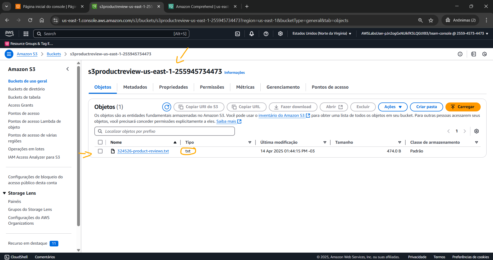<br>
    <figcaption>Imagem 01.</figcaption>
</figure></div><br>

Esse arquivo foi baixado para a máquina física local **Windows** e foi aberto para verificá-lo em qual língua estava escrito, que neste caso, era em inglês. Em seguida, um job de análise foi provisionado no **Amazon Comprehend** da seguinte forma:
- `Job settings` (Configurações de trabalho):
  - `Name` (Nome): `jam001.1-analise-sentimento`.
  - `Analysis type` (Tipo de análise): `Sentiment` (Sentimento).
  - `Language` (Linguagem): `English` (Inglês).
- `Input data` (Dados de entrada):
  - `S3 location` (Localização S3): o caminho para o arquivo no bucket S3 foi selecionado (`s3://s3productreview-us-east-1-255945734473/324526-product-reviews.txt`).
- `Output data` (Dados de saída):
  - `S3 location` (Localização S3): o mesmo bucket onde estava o arquivo de entrada foi selecionado (`s3://s3productreview-us-east-1-255945734473`).
- `Access permissions` (Permissões de acesso):
  - `IAM role` (Função do IAM): `Use an existing IAM role` (Usar uma função IAM existente):
    - `Role name` (Nome da função): `S3AccessRoleComprehend`. Esta role do **AWS IAM** já tinha sido provisionada pelo próprio laboratório ao iniciá-lo.

A imagem 02 exibe o trabalho de análise de sentimento provisionado e executado com sucesso no **Amazon Comprehend**. Já na imagem 03 é evidenciado o arquivo gerado no mesmo bucket do **Amazon S3**. Observe que uma pasta (prefixo) foi criada no bucket com o arquivo `output.tar.gz` e que ao ser descompactado resultou no arquivo JSON [output](./resource/output). Ao abrir o arquivo foi percebido que o Comprehend analisou cada linha do arquivo de texto com as avaliações dos clientes e classificou cada uma em positivo, negativo ou misto.

<div align="Center"><figure>
    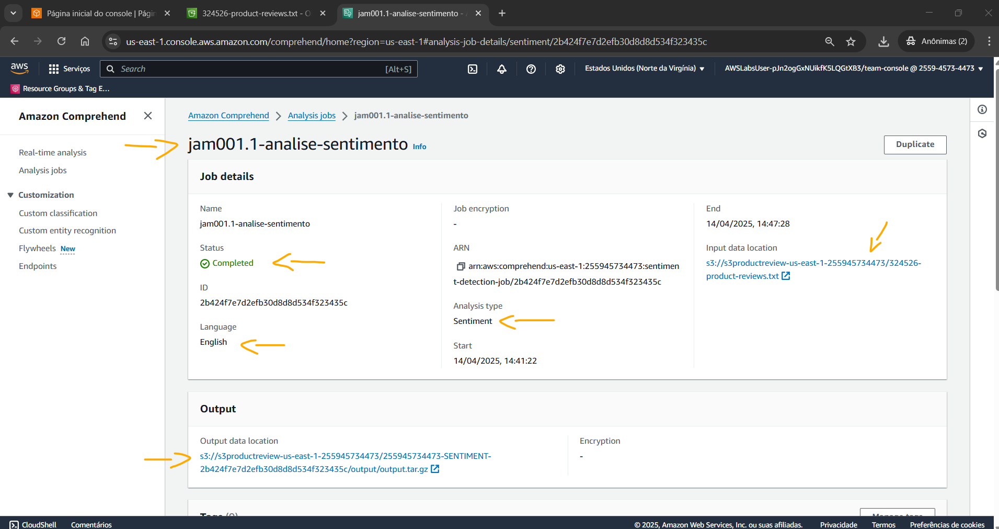<br>
    <figcaption>Imagem 02.</figcaption>
</figure></div><br>

<div align="Center"><figure>
    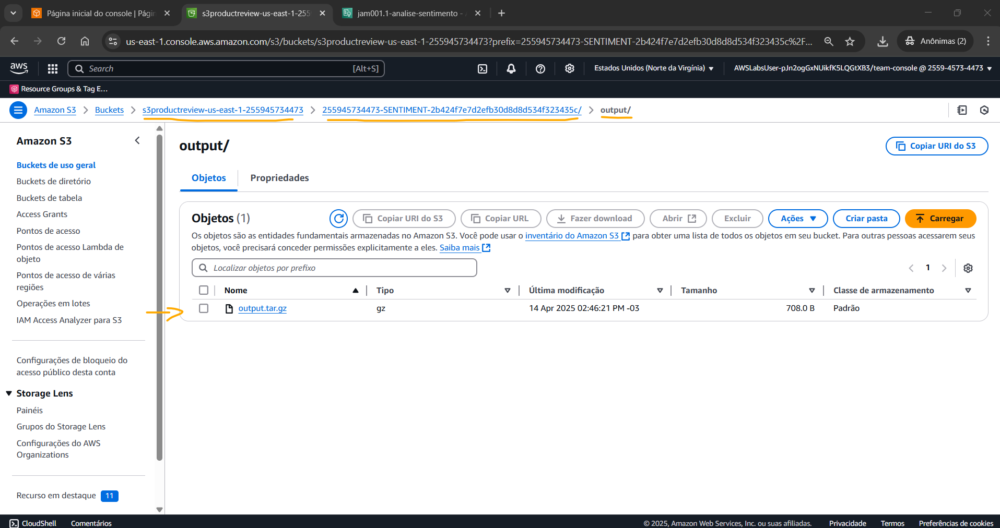<br>
    <figcaption>Imagem 03.</figcaption>
</figure></div><br>

<a name="item01.2"><h4>Tarefa 2 : Prepare-se para carregar os dados no banco de dados com uma função do IAM</h4></a>[Back to summary](#item0)

**Informações da Tarefa:**
- Cenário: Parabéns por criar com sucesso o trabalho de análise de sentimentos. A equipe está feliz porque estamos um passo mais perto de obter os resultados. O trabalho do Amazon Comprehend agora está concluído e a saída está disponível no mesmo bucket do S3. Os dados analisados precisam ser carregados em uma tabela do Amazon Reshift para ajudar a gerência da empresa a realizar análises e relatórios históricos. Antes de carregar os dados de saída no Redshift Cluster, as permissões necessárias para que o cluster acesse os dados no bucket do S3 precisam estar estabelecidas.
- Sua tarefa: Associe a função IAM criada que permitirá o Redshift cluster para acessar objetos do S3. Ignore os erros no console do Amazon Redshift.
- Inventário: Sua conta da AWS é provisionada com o seguinte:
  - Bucket S3 prefixado com: `s3productreview`.
  - Cluster Redshift.
  - Função IAM (`S3AccessRoleRedshift`).
  - Permissões mínimas necessárias para você concluir esta tarefa.
- Começando: Navegue até o console do IAM e crie uma função do IAM para o Redshift Service com os privilégios necessários para acessar seu bucket do S3.
- Serviços envolvidos: 
  - Amazon Redshift;
  - AWS IAM.
- Validação de tarefas: Depois da função do IAM associada ao cluster do Redshift, a tarefa será automaticamente validada para conclusão. Como alternativa, você pode clicar em `Check my Progress` (Verificar meu progresso) para verificar o status.
- Pontos possíveis: 16.

**Resolução da Tarefa:**
Analisando o cluster do **Amazon Redshift** já provisionado pelo laboratório, foi identificado que ele não tinha nenhuma role anexada. Uma das roles sugeridas, ao adicionar ao cluster, foi a `AWSServiceRoleForRedshift`. Esta role tinha apenas a policy `AmazonRedshiftServiceLinkedRolePolicy`, que dava algumas permissões, mas não permitia o cluster acessar os objetos no bucket do **Amazon S3**. Contudo, o lab já tinha criado a role `S3AccessRoleRedshift` que possuía três políticas anexadas (`AmazonRDSReadOnlyAccess`, `AmazonSSMManagedInstanceCore` e `custompolicy`). A policy `custompolicy`, que era customizada, permitia acesso ao bucket em questão, bem como aos seus objetos, conforme mostrada na imagem 04. Sendo assim, a role `S3AccessRoleRedshift` foi anexado ao cluster do **Amazon Redshift**, conforme imagem 05.

<div align="Center"><figure>
    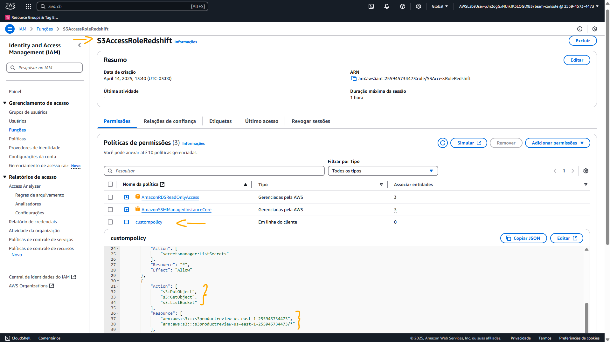<br>
    <figcaption>Imagem 04.</figcaption>
</figure></div><br>

<div align="Center"><figure>
    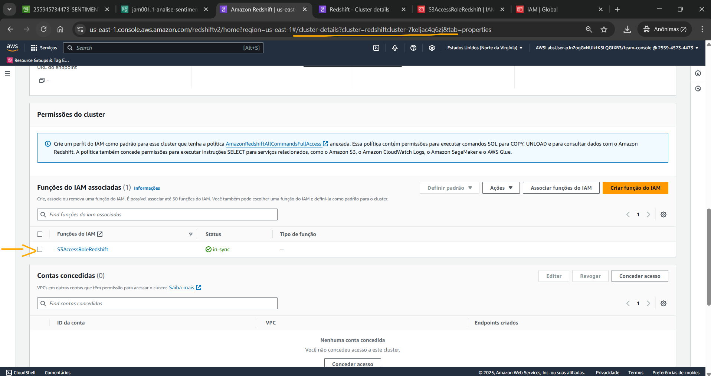<br>
    <figcaption>Imagem 05.</figcaption>
</figure></div><br>

<a name="item01.3"><h4>Tarefa 3: Copiar a saída da análise de sentimento para o redshift</h4></a>[Back to summary](#item0)

**Informações da Tarefa:**
- Cenário: Também é ótimo trabalhar na criação das permissões! Mais um passo mais perto da solução! Agora temos o arquivo de saída da análise de sentimentos do Amazon Comprehend, bem como o necessário para carregar o mesmo na tabela do Redshift. Tudo o que resta é copiar os dados para a tabela do Redshift.
- Sua tarefa: A saída do trabalho de análise de sentimentos é descompactada e disponível como um arquivo json na pasta de saída sob a pasta prefixada com -SENTIMENT-*** no mesmo bucket do S3. Use o comando COPY para carregar a saída json descompactada do arquivo Amazon Comprehend na tabela do Redshift feedback.product_feedback.
- Inventário: Sua conta da AWS é provisionada com o seguinte:
  - Cluster Redshift com a tabela: `feedback.product_feedback`.
  - Arquivo json de saída descompactado dentro do bucket S3 com o prefixo: `s3productreview` (Navegue dentro das pastas do bucket s3 até chegar à pasta `output/`).
  - Permissões mínimas possíveis para você concluir esta tarefa.
- Começando: Navegue até o console Redshift e use o editor de consultas v1 (v1 é indicado apenas como “Editor de consulta”) para se conectar ao banco de dados usando o método Temporary credentials.
- Serviços envolvidos: 
  - Amazon Redshift;
- Validação de tarefas: Depois que o arquivo for carregado com sucesso com o comando COPY, a tarefa será automaticamente validada para conclusão. Como alternativa, você pode clicar em `Check my Progress` (Verificar meu progresso) para verificar o status.
- Pontos possíveis: 32.

**Resolução da Tarefa:**
A primeira ação a ser feita aqui, foi abrir o editor de consultas do **Amazon Redshift** e configurar a conexão para o banco de dados `myjamdb` existente no cluster. A configuração de conexão ficou da seguinte forma:
- `Connection` (Conexão): `Create a new connection` (Crie uma nova conexão).
- `Authentication` (Autenticação): `Temporary credentials` (Credenciais temporárias).
- `Cluster` (Cluster): `redshiftcluster-7keljac4q6zj (Available)`. Esse era o cluster que foi provisionado pelo laboratório.
- `Database name` (Nome do banco de dados): `myjamdb`. Essa informação foi obtida nas instruções dos desafios, em `Output properties` (Propriedades de saída).
- `Database user` (Usuário do banco de dados): `admin`. Essa informação foi obtida nas instruções dos desafios, em `Output properties` (Propriedades de saída).

Após conexão, em `Select schema` (Selecione o esquema), o esquema `feedback` foi selecionado e logo foi exibida informações da tabela `product_feedback`. Assim, a consulta `SELECT * FROM feedback.product_feedback;` foi executada para exibir os dados dessa tabela. Contudo, nada foi retornado. Dessa forma, foi presumido que não haviam dados nessa tabela ainda, portanto executei a consulta `SELECT count(*) FROM feedback.product_feedback;` para informar a quantidade de linhas, que no caso foi `0`, confirmando que não haviam dados nessa tabela, conforme mostrado na imagem 06.

<div align="Center"><figure>
    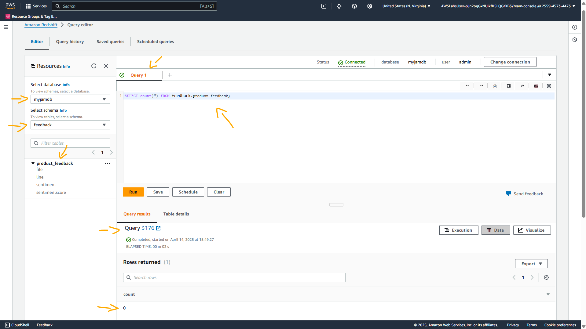<br>
    <figcaption>Imagem 06.</figcaption>
</figure></div><br>

Analisando o arquivo de análise de sentimento gerado pelo **Amazon Comprehend** no bucket do **Amazon S3**, foi observado que após a tarefa 2, o arquivo, que inicialmente era compactado, foi descompactado automaticamente. Acredito que existam etapas no **AWS Jam** que são executadas ao concluir tarefas. O arquivo descompactado, cujo nome era [output](./resource/output) foi chamada em uma query do Redshift para copiar os dados dele e inserir no banco de dados no cluster. O comando **SQL** do Redshift abaixo foi executado:

```sql
COPY feedback.product_feedback
FROM 's3://s3productreview-us-east-1-255945734473/255945734473-SENTIMENT-2b424f7e7d2efb30d8d8d534f323435c/output/output'
IAM_ROLE 'arn:aws:iam::255945734473:role/S3AccessRoleRedshift'
FORMAT AS JSON 'auto';
```

A imagem 07 mostra que o comando foi executado com sucesso.

<div align="Center"><figure>
    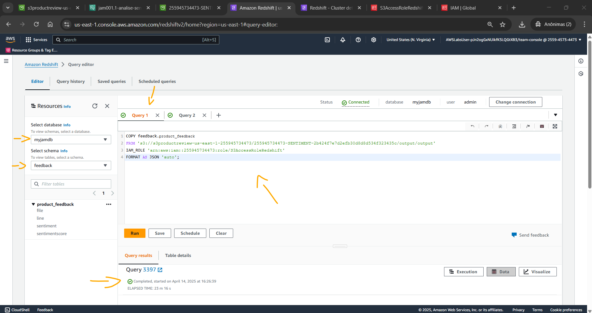<br>
    <figcaption>Imagem 07.</figcaption>
</figure></div><br>

<a name="item02"><h4>Desafio 2: Você consegue entender o sentimento do seu cliente?</h4></a>[Back to summary](#item0)

- Contexto:
> Por exigência do cliente, os aplicativos que produzem dados precisam colocá-los no Amazon Kinesis Data Streams. Os dados do stream são consumidos por uma função do Lambda. O usuário deste desafio precisará verificar os requisitos de scaling e tratamento de falhas do aplicativo e configurar o Kinesis Data Streams e a função Lambda de acordo com eles.

- Visão geral: Enquanto trabalha nesse desafio, você aprende a configurar várias opções de scaling disponíveis para o Kinesis Data Streams e o Lambda do consumidor.
- O que você vai aprender com este desafio:
  - Como usar o Lambda como consumidor para o stream de dados do Kinesis;
  - Como expandir/diminuir o número de shards do Kinesis Data Streams;
  - Como evitar streaming de baixa taxa de transferência.
- Você aprenderá mais sobre estes serviços da AWS:
  - Kinesis Data Streams;
  - Lambda como consumidor de stream.
- Habilidades de computação em nuvem que você ganhará:
  - Dividir shards do Kinesis;
  - Dimensionar o Lambda;
  - Usar a AWS CLI.
- Dificuldade da categoria: 200 – Intermediário.
- Pontuação: 150.

<a name="item02.1"><h4>Tarefa 1: Analise o sentimento para cada avaliação</h4></a>[Back to summary](#item0)

**Informações da Tarefa:**
- Cenário: Um aplicativo administrativo que monitora as métricas de manipulação de dados de shards observou atraso no processamento de dados do último shard, pois há muitos dados direcionados a ele. Para reduzir o redirecionamento de dados para o último shard, é decidido dividi-lo.
- Sua tarefa: Você tem que dividir o último shard do Kinesis Data Streams.
- Inventário: Sua conta da AWS é provisionada com o seguinte:
  - Kinesis Data Streams (`KinesisStreamForJam`).
- Serviço e ferramentas que você deve usar:
  - Amazon Kinesis Data Streams (KDS);
  - AWS CLI.
- Validação de tarefas: A tarefa será validada automaticamente assim que a configuração for concluída, ou você pode executar a função Lambda na parte superior desta página clicando no botão `Check my Progress` (Verificar meu progresso).
- Pontos possíveis: 38.

**Resolução da Tarefa:**
Para esta tarefa, a **AWS CLI** foi utilizada na máquina física **Windows**, sendo necessário configurar três variáveis de ambiente em uma sessão do **Windows PowerShell**, passando o ID e o segredo da chave de acesso, além do token de sessão para a autenticação temporária na **AWS**, conforme mostrado no comando abaixo. A entidade utilizada para acesso foi a IAM role `AWSLabsUser-fsi939KvdJkq95N391cscw`, assumida por meio de uma sessão temporária gerada pelo **AWS Security Token Service**, cujo nome era `team-credentials`. Com o comando `aws sts get-caller-identity` foi confirmada a identidade que estava configurada nesta sessão do PowerShell. Como esse acesso era temporário, ele expirava após um tempo e tinha que ser novamente configurado com novas credenciais informadas na instrução do lab.

```ps1
$Env:AWS_ACCESS_KEY_ID="..."
$Env:AWS_SECRET_ACCESS_KEY="..."    
$Env:AWS_SESSION_TOKEN="..."
```

A CLI da **AWS** foi utilizada, pois para dividir um shard no **Amazon Kinesis Data Stream (KDS)**, só é possível através dela. Primeiro foi utilizado o comando `aws kinesis list-shards --stream-name KinesisStreamForJam`, passando o nome do fluxo de dados (`Data Stream`), para listar todos os três shards existentes e identificar o ID do último shard, que no caso foi `shardId-000000000002`. Em seguida, esse ID foi utilizado para dividir esse shard em dois novos shards executando o comando `aws kinesis split-shard --stream-name KinesisStreamForJam --shard-to-split shardId-000000000002 --new-starting-hash-key 283568639100781000000000000000000000000`. O parâmetro `--new-starting-hash-key` é a chave hash de onde o novo shard deve começar. Isso teve que ser feito manualmente, pegando os valores de início e fim da chave de hash do shard 2 e identificando o meio entre eles (`226854911280625642308916404954512140970` e `340282366920938463463374607431768211455`). As imagens 08 e 09 mostram o antes e o depois de dividir o último shard (`shardId-000000000002`) em outros dois (`shardId-000000000003` e `shardId-000000000004`).

<div align="Center"><figure>
    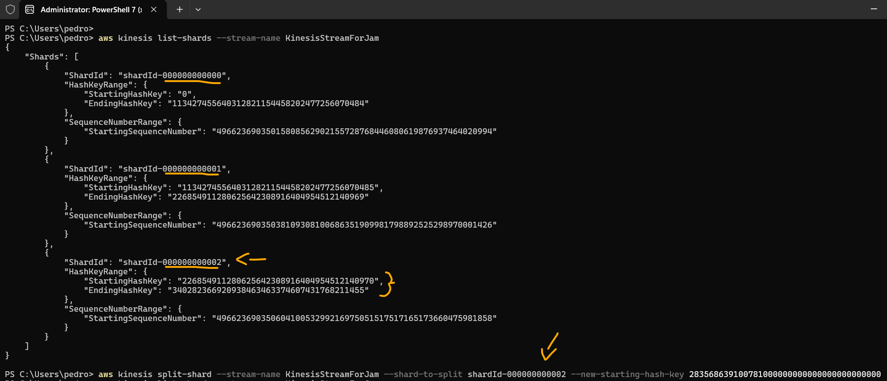<br>
    <figcaption>Imagem 08.</figcaption>
</figure></div><br>

<div align="Center"><figure>
    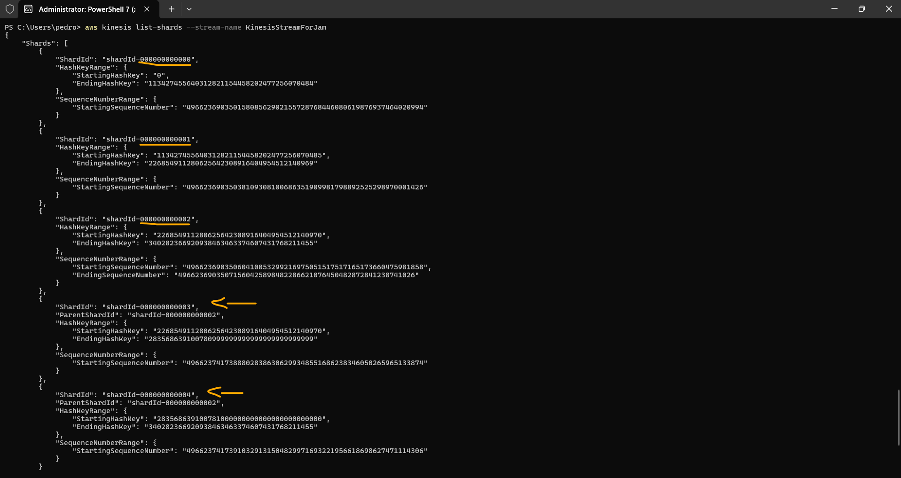<br>
    <figcaption>Imagem 09.</figcaption>
</figure></div><br>

<a name="item02.2"><h4>Tarefa 2: Atualize a contagem de shards para dimensionar</h4></a>[Back to summary](#item0)

**Informações da Tarefa:**
- Cenário: Um aplicativo administrativo que monitora as métricas de manipulação de dados de shards observou atraso no processamento de dados. Para se adaptar às mudanças na taxa de dados do fluxo, é decidido aumentar a contagem de shards.
- Sua tarefa: Você tem que aumentar a contagem de shards do stream de dados para 8.
- Inventário: Sua conta da AWS é provisionada com o seguinte:
  - Kinesis Data Streams (`KinesisStreamForJam`).
- Serviço e ferramentas que você deve usar:
  - AWS Management Console;
  - Amazon Kinesis Data Streams (KDS);
  - AWS CLI.
- Validação de tarefas: A tarefa será validada automaticamente assim que a configuração for concluída, ou você pode executar a função Lambda na parte superior desta página clicando no botão `Check my Progress` (Verificar meu progresso).
- Pontos possíveis: 38.

**Resolução da Tarefa:**
Para aumentar a contagem dos shards, isso foi realizado pelo console, selecionando o data stream `KinesisStreamForJam` e indo na seção `Configuration` (Configuração). Em seguida, a opção `Edit provisioned shards` (Editar fragmentos provisionados) foi selecionada e o número de shards foi alterado de `4` para `8`. A imagem 10 evidencia a alteração feita.

<div align="Center"><figure>
    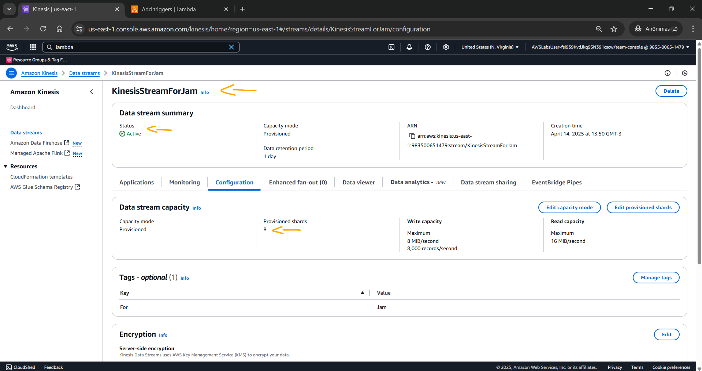<br>
    <figcaption>Imagem 10.</figcaption>
</figure></div><br>

<a name="item02.3"><h4>Tarefa 3: Dimensionamento sem divisão</h4></a>[Back to summary](#item0)

**Informações da Tarefa:**
- Cenário: Um aplicativo administrativo que monitora métricas compartilhadas de tratamento de dados observou que a idade do iterador em cada fragmento é alta. Para se adaptar às mudanças na taxa de dados fluindo pelo riacho, é decidido aumente as invocações do Lambda por fragmento.
- Sua tarefa: Você precisa aumentar o número de invocações simultâneas do Lambda para cada fragmento até 2.
- Inventário: Sua conta da AWS é provisionada com o seguinte:
  - Kinesis Data Streams (`KinesisStreamForJam`).
  - Função Lambda (`LambdaFunctionForJam`).
- Serviço e ferramentas que você deve usar:
  - AWS Management Console;
  - Amazon Kinesis Data Streams (KDS);
  - AWS CLI;
  - AWS Lambda.
- Validação de tarefas: A tarefa será validada automaticamente quando a configuração for concluída, ou você poderá executar a função Lambda na parte superior desta página clicando no botão `Check my Progress` (Verificar meu progresso).
- Pontos possíveis: 38.

**Resolução da Tarefa:**
Para aumentar o número de invocações simultâneas do **AWS Lambda** para cada shard para `2`, foi preciso acessar a função de nome `LambdaFunctionForJam`, ir na seção `Configuration` (Configuração) e criar uma `Trigger` (Gatilho) da seguinte forma:
- `Trigger configuration` (Configuração de gatilho): `Kinesis`.
- `Kinesis stream`: `kinesis/KinesisStreamForJam`. Foi selecionado o data stream do **Amazon Kinesis** utilizado neste lab.
- `Event source mapping configuration` (Configuração de mapeamento de origem de eventos): Foi marcada a caixa `Activate trigger` (Ativar gatilho).
  - `Batch Size` (Tamanho do lote): `100`.
  - `Starting position` (Posição inicial): `Latest` (`Mais recente`).
- `Additional settings` (Configurações adicionais):
  - `Concurrent batches per shard` (Lotes simultâneos por fragmento): `2`.

A imagem 11 mostra a trigger criada na função Lambda, definindo 2 invocações simultâneas da função para cada shard do fluxo de dados do KDS.

<div align="Center"><figure>
    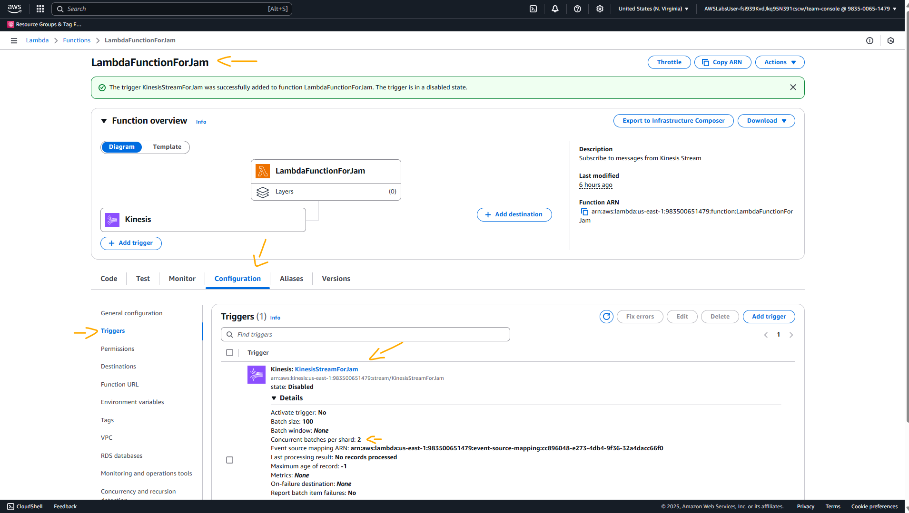<br>
    <figcaption>Imagem 11.</figcaption>
</figure></div><br>

<a name="item02.4"><h4>Tarefa 4: Evite streaming com baixa taxa de transferência</h4></a>[Back to summary](#item0)

**Informações da Tarefa:**
- Cenário: Um aplicativo administrativo que monitora análises compartilhadas de tratamento de dados observados que, fora do horário de pico, existem apenas 100 registros por minuto. Para se adaptar às mudanças fora do horário de pico, é decidir esperar antes de invocar o Lambda.
- Sua tarefa: Você precisa aumentar o tamanho do lote para 180.
- Inventário: Sua conta da AWS é provisionada com o seguinte:
  - Kinesis Data Streams (`KinesisStreamForJam`).
  - Função Lambda (`LambdaFunctionForJam`).
- Serviço e ferramentas que você deve usar:
  - AWS Management Console;
  - Amazon Kinesis Data Streams (KDS);
  - AWS CLI;
  - AWS Lambda.
- Validação de tarefas: A tarefa será validada automaticamente quando a configuração for concluída, ou você poderá executar a função Lambda na parte superior desta página clicando no botão `Check my Progress` (Verificar meu progresso).
- Pontos possíveis: 38.

**Resolução da Tarefa:**
Nesta última tarefa, foi necessário apenas editar esse trigger que acabou de ser criado na função Lambda, modificando o `Batch size` (Tamanho do lote) de `100` para `180`. A imagem 12 comprova essa alteração.

<div align="Center"><figure>
    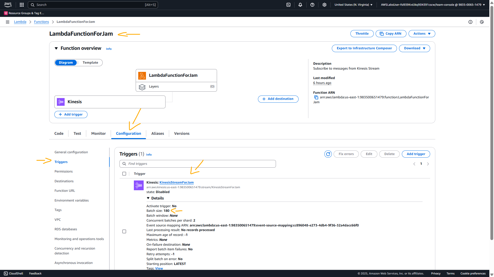<br>
    <figcaption>Imagem 12.</figcaption>
</figure></div><br>

<a name="item03"><h4>Desafio 3: Ajude-me a encontrar dados de clientes</h4></a>[Back to summary](#item0)

- Contexto:
> Uma equipe de marketing de uma seguradora que realiza uma campanha para aumentar as vendas está buscando dados de clientes da equipe de suporte técnico com critérios de filtragem vagos. O pessoal de suporte técnico tem acesso limitado ao ambiente hospedado na AWS, alguns dos pipelines estão quebrados e, portanto, eles estão buscando sua ajuda para corrigir o mesmo.

> As informações devem ser extraídas dos dados do Cliente e dos Veículos. Os dados do cliente são hospedados no Amazon DynamoDB e os veículos no Amazon S3.

> O esquema dos veículos deve ser determinado primeiro, seguido por uma maneira sem servidor de combinar esses dados com os dados do Cliente para encontrar as informações necessárias.

- Visão geral: Ao concluir esse desafio, você aprenderá sobre o AWS Glue Jobs, Crawlers, consultas federadas do Amazon Athena e funções do AWS IAM.
- Introdução: Ao resolver esse desafio, os participantes se familiarizam com a forma sem servidor de persistir dados, análises e consultas.
- Tópicos abordados: Ao superar esse desafio, você se familiarizará com:
  - Criação de trabalhos do AWS Glue;
  - Running Glue Crawlers;
  - Criação de conectores para o Amazon Athena;
  - Executar consultas Adhoc usando o Athena unindo dados de diferentes fontes.
- Pré-requisitos de conhecimento técnico: Para concluir esse desafio, os participantes devem estar familiarizados com o AWS Console, os formatos de arquivos de dados, a compreensão básica dos esquemas e as consultas SQL. Haverá referências a documentações on-line em tarefas que você pode usar para concluir o desafio. Uma explicação completa estará disponível nas pistas finais de cada tarefa.
- Dificuldade da categoria: 200 – Intermediário.
- Pontuação: 150.

<a name="item03.1"><h4>Tarefa 1 : Corrigir formato de arquivo</h4></a>[Back to summary](#item0)

**Informações da Tarefa:**
- Cenário: O formato dos dados da fonte original está em CSV, você precisa converter o formato em Parquet com a compactação Snappy.
- Sua tarefa: A primeira tarefa é converter os dados no formato desejado, use a documentação abaixo para criar e executar um trabalho para converter o arquivo no formato desejado.
- Começando: Crie o trabalho do AWS Glue, os parâmetros estão na guia `Output propeties` (Propriedades de saída) do painel.
- Inventário: Trabalhe com os seguintes recursos -> Crie uma nova tarefa de cola com os recursos abaixo como parâmetros:
  - Nome do bucket de origem do S3 (`S3TargetBucketName`);
  - Nome da função do IAM (`GlueJobrole`).
- Serviços que você deve usar: Esta tarefa é Criar e executar com êxito o trabalho do Glue. Observe que você não poderá listar ou ler os objetos do S3. Além disso, haverá 3 nós por padrão, não estamos fazendo nenhuma transformação. Selecione o nó “aplicar mapeamento” e escolha “remover”.
- Validação de tarefas: Depois que a tarefa do Glue for executada, forneça o nome da tarefa que você criou na caixa de texto para concluir a tarefa.
- Pontos possíveis: 60.

**Resolução da Tarefa:**
Para resolver essa tarefa, um ETL job foi construído no **AWS Glue**, utilizando três visuais configurados da seguinte forma:
- `Visual` (Visual):
  - `Sources` (Fontes): `Amazon S3`.
    - `Data source properties - S3` (Propriedades da fonte de dados - S3):
      - `Name` (Nome): `Amazon S3`.
      - `S3 source type` (Tipo de origem S3): `S3 location` (Localização S3).
      - `S3 URL` (URL S3): `s3://findcustomerdatasource-731181684828/auto_vehicles/autopolicy_vehicles.csv`. Foi selecionado o caminho do arquivo CSV no bucket do **Amazon S3**.
      - `Data format` (Formato de dados): `CSV`.
      - `Delimiter` (Delimitador): `Comma (,)` (Vírgula (,)).
  - `Transforms` (Transformações):
    - `Name` (Nome): `Change Schema` (Alterar esquema).
    - `Node parents` (Nó pai): `Amazon S3`.
  - `Targets` (Alvos): `Amazon S3`.
    - `Data target properties - S3` (Propriedades de destino de dados - S3):
      - `Name` (Nome): `Amazon S3`.
      - `Node parents` (Nó pai): `Change Schema` (Alterar esquema).
      - `Format` (Formato): `Parquet`.
      - `Compression Type` (Tipo de compressão): `Snappy` (Rápida).
      - `S3 Target Location` (Localização de destino S3): `s3://findcustomertarget-731181684828`. Foi escolhido o outro bucket do S3 que já tinha sido provisionado para receber o arquivo com formato convertido.
- `Job details` (Detalhes do trabalho): 
  - `Basic properties` (Propriedades básicas):
  - `Name` (Nome): `jam-001.3.1-etljob`.
  - `IAM Role` (Função do IAM): `GlueJobRole`. Essa role já tinha sido criada pelo laboratório ao iniciá-lo.

Após configuração, o trabalho do **AWS Glue** foi salvo e executado, conforme evidenciado na imagem 13. A imagem 14 mostra o arquivo convertido em Parquet no bucket do **Amazon S3**.

<div align="Center"><figure>
    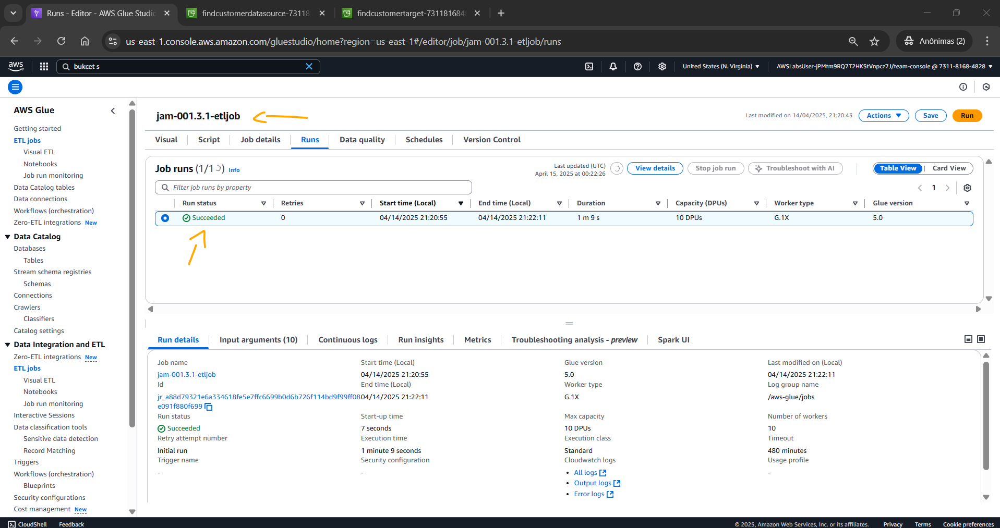<br>
    <figcaption>Imagem 13.</figcaption>
</figure></div><br>

<div align="Center"><figure>
    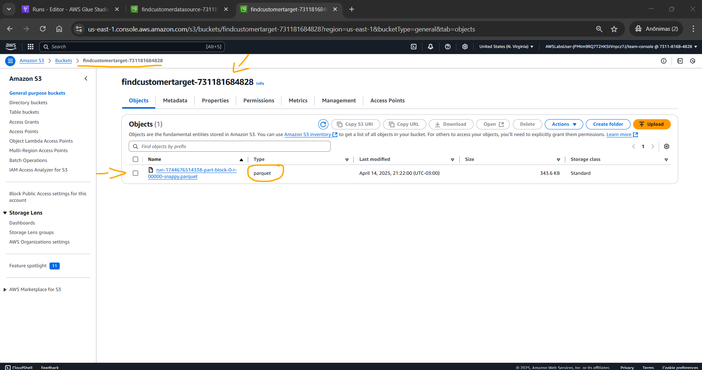<br>
    <figcaption>Imagem 14.</figcaption>
</figure></div><br>

<a name="item03.2"><h4>Tarefa 2 : Encontre o esquema</h4></a>[Back to summary](#item0)

**Informações da Tarefa:**
- Cenário: Ao contrário dos bancos de dados tradicionais, que precisavam que o esquema fosse predefinido, os dados podem ser armazenados no S3 e o esquema determinado dinamicamente.
- Sua tarefa: Agora que você converteu os arquivos para o formato necessário, é hora de descobrir o esquema. Um rastreador já está definido, execute o rastreador para concluir a tarefa.
- Começando: O nome do rastreador é mencionado nas `Output Properties` (Propriedades de saída). A execução bem-sucedida do rastreador criaria uma tabela de cola e a tarefa seria concluída.
- Inventário:
  - AWS Glue Crawler (`GlueCrawler`).
  - IAM Role (`GlueCrawlerRole`).
- Serviços que você deve usar: Função do Glue Crawler e do IAM.
- Validação de tarefas: Depois que o Glue Crawler for executado com sucesso, a tarefa será validada automaticamente ou poderá ser acionada explicitamente usando o botão `Check my Progress` (Verificar meu progresso) no painel.
- Pontos possíveis: 30.

**Resolução da Tarefa:**
Como o crawler do **AWS Glue** já existia e tinha na sua configuração de `Data source` (Fonte de dados) o bucket do **Amazon S3** que continha o arquivo convertido em Parquet, só foi necessário selecioná-lo e alterar a função do IAM anexada a ele da role `GlueCrawlerRoleInsufficientPrevileges`, que não possuía permissões para o bucket S3 em questão, para a role `GlueCrawlerRole`, que possuía essas permissões. Em seguida, foi executado o rastreador para determinar de forma dinâmica o esquema dos dados no bucket S3. A imagem 15 exibe o crawler executado com sucesso.

<div align="Center"><figure>
    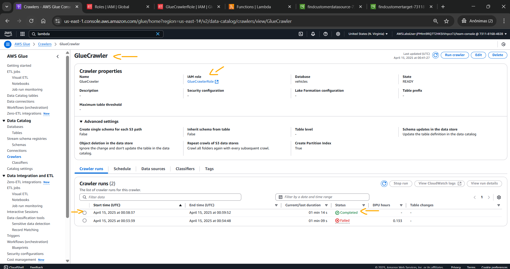<br>
    <figcaption>Imagem 15.</figcaption>
</figure></div><br>

<a name="item03.3"><h4>Tarefa 3 : O que é nome e contato do cliente?</h4></a>[Back to summary](#item0)

**Informações da Tarefa:**
- Cenário: O Amazon Athena é um serviço de consulta interativo que pode ser usado para consultar dados do S3. Você pode usar o recurso de consulta federada para também consultar dados do banco de dados relacional e NoSQL.
- Sua tarefa: Nas Tarefas 1 e 2, você preparou os dados do veículo. Os dados do cliente estão no Amazon DynamoDB. Para consultar dados do DynamoDB, você precisará criar uma fonte de dados usando um conector.
- Começando: Crie a fonte de dados para o DynamoDB, use o AWS Lambda `DynamoDBConnectorLambda`, que é pré-provisionado. A tarefa é descobrir o nome, sobrenome e número de telefone de contato do cliente cujo status do veículo é `clean vehicle`, o ano do modelo é `2007`, a marca é `chrysler` e o estado de `california`.
- Inventário:
  - Crie uma nova fonte de dados;
  - Função Lambda (`DynamoDBConnectorLambda`).
- Serviços que você deve usar: A solução para essa tarefa pode ser derivada dentro do Athena. Use o Athena Workgroup correto, crie uma fonte de dados para o DynamoDB e crie uma consulta para extrair o nome, o sobrenome e o número de telefone do cliente que correspondam às informações do veículo fornecidas com qualquer coluna de dados que vincule as informações do veículo e do cliente.
- Validação de tarefas: Insira o nome, sobrenome e número de contato separados por vírgula na caixa de texto para concluir a tarefa. Abaixo está um exemplo: `João, Doe, 538-163-0994x179`.
- Pontos possíveis: 60.

**Resolução da Tarefa:**
Para resolver essa tarefa foi necessário ir no console do **Amazon Athena** e criar um segundo `Data source` (Fontes de dados) na opção `Data sources and catalogs` (Fontes de dados e catálogos). Já existia uma fonte de dados configurada com o banco de dados `vehicles` que foi gerado pelo rastreador do **AWS Glue** executado na tarefa anterior. A segunda fonte de dados foi configurada da seguinte forma:
- `Choose a data source` (Escolha uma fonte de dados):
  - `Data sources` (Fontes de dados): `Custom or shared connector`.
- `Enter data source details` (Insira os detalhes da fonte de dados):
  - `Data source details` (Detalhes da fonte de dados):
    - `Data source name` (Nome da fonte de dados): `Athena-usvo9z6k`.
  - `Connection details` (Detalhes de conexão):
    - `Lambda function` (Função lambda): `arn:aws:lambda:us-east-1:731181684828:function:DynamoDBConnectorLambda`. Essa função Lambda já tinha sido provisionado pelo próprio laboratório ao iniciá-lo.

Após criar a segunda fonte de dados, conforme comprovado na imagem 16, o editor de consultas do Athena foi selecionado e agora haviam duas fontes de dados. Uma fonte de dados era proveniente do banco de dados do **AWS Glue**, cujo nome da fonte de dados era `AwsDataCatalog`, o banco de dados `vehicles` e o nome da tabela `findcustomertarget_731181684828`, e a outra do conector do **AWS Lambda** que buscava os dados no **Amazon DynamoDB**, cujo nome da fonte de dados era `Athena-usvo9z6k`, o banco de dados `default` e o nome da tabela `autocustomer`. 

<div align="Center"><figure>
    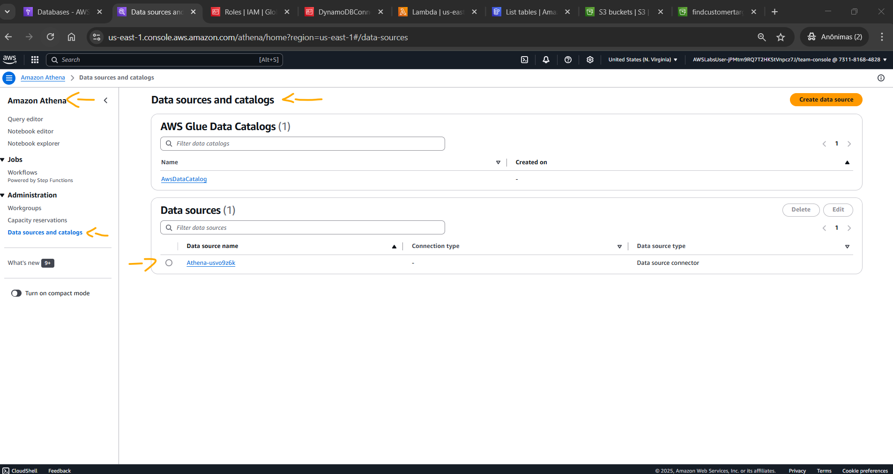<br>
    <figcaption>Imagem 16.</figcaption>
</figure></div><br>

O comando SQL abaixo foi executado para consultar os dados relacionando as duas tabelas e identificar a resposta da solicitação dessa tarefa. A resposta obtida no padrão solicitado foi `Thomas, Reid, 451-873-9874x2074`, conforme mostrado no output do comando exibido na imagem 17.

```sql
SELECT
    ac.FirstName,
    ac.LastName,
    ac.Phone
FROM
    "Athena-usvo9z6k"."default"."autocustomer" ac
JOIN
    "AwsDataCatalog"."vehicles"."findcustomertarget_731181684828" vc
    ON CAST(ac.PolicyId AS DECIMAL(38,9)) = CAST(vc.policyid AS DECIMAL(38,9))
WHERE
    vc.title_status = 'clean vehicle'
    AND vc.year = '2007'
    AND vc.brand = 'chrysler'
    AND vc.state = 'california';
```

<div align="Center"><figure>
    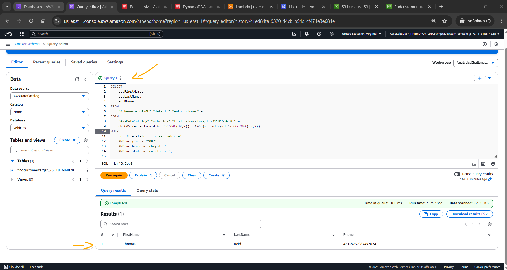<br>
    <figcaption>Imagem 17.</figcaption>
</figure></div><br>

Por fim, a imagem 18 evidencia que os três desafios do Jam foram concluídos com 100% de aproveitamento e obtendo a pontuação máxima de 380 pontos, já que nenhuma pista foi utilizada.

<div align="Center"><figure>
    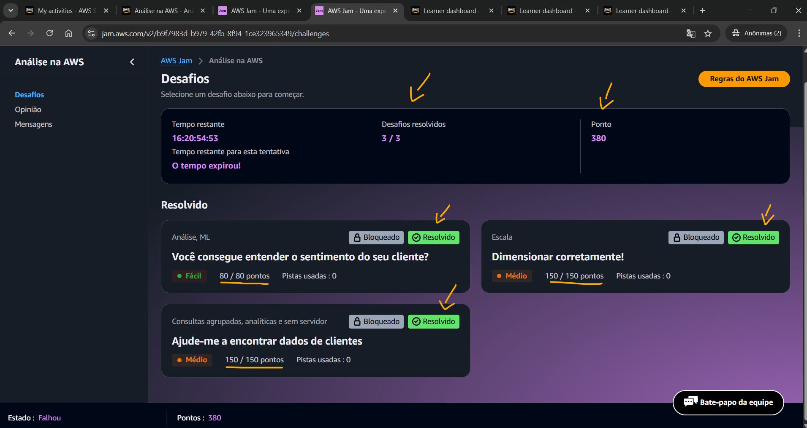<br>
    <figcaption>Imagem 18.</figcaption>
</figure></div><br>