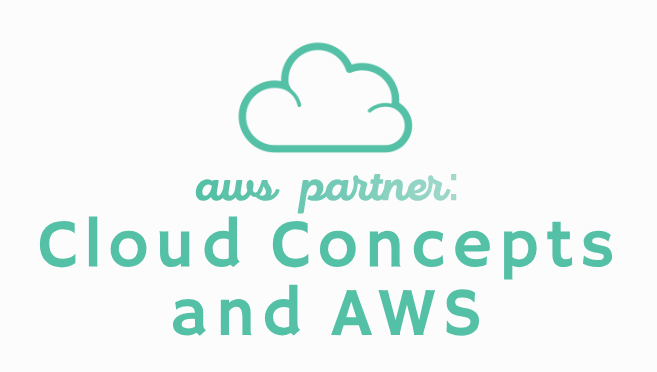
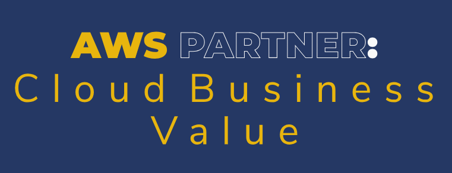
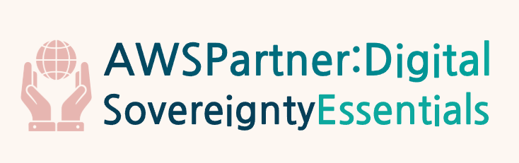

# AWS Partner: <a href="./aws_educate">aws_partner</a>

### AWS <a href="../">aws   </a>

O **AWS Partner** é um programa da AWS voltado para empresas e organizações que se tornam parceiras para oferecer soluções e serviços em nuvem, como consultorias, ISVs (Independent Software Vendors) e integradores de sistemas. Esses parceiros podem ser classificados em dois tipos: **AWS Consulting Partners** e **AWS Technology Partners**. Os **AWS Consulting Partners** são empresas certificadas pela **AWS Partner Network (APN)** que oferecem consultoria, suporte e serviços especializados para ajudar clientes a projetar, migrar e operar cargas de trabalho na AWS. Já os **AWS Technology Partners** são empresas que desenvolvem softwares, ferramentas e soluções que rodam na AWS ou se integram aos seus serviços. A **AWS Partner Network (APN)** é o nome da rede global desses parceiros, enquanto a **AWS Partner Central** é a plataforma online que fornece aos parceiros acesso a recursos, ferramentas e suporte para gerenciar sua parceria.

A AWS disponibiliza conteúdos específicos para os parceiros vinculados à APN, ou seja, apenas contas associadas a uma organização parceira têm acesso a esses materiais. Assim como existe o **AWS Events**, que reúne eventos da AWS abertos ao público, também existe o **AWS Partner Events**, exclusivo para parceiros. O mesmo padrão se aplica a outras iniciativas, como o **AWS Blog**, **AWS Newsletter**, **AWS Webinars** e o **AWS Training and Certification**, que possuem versões exclusivas dentro da APN, como o **AWS Partner Network Blog (APN Blog)**, **AWS Partner Newsletter**, **AWS Partner Webinars** e **AWS Partner Training and Certification**. Além desses, há também outros conteúdos que são oferecidos exclusivamente a parceiros da AWS.

O **AWS Training and Certification** é o programa de capacitação da AWS criado para ajudar profissionais a desenvolverem habilidades e obterem certificações reconhecidas no mercado. Dentro desse programa está o **AWS Skill Builder**, uma plataforma online que oferece cursos interativos, trilhas personalizadas e recursos voltados ao desenvolvimento prático com os serviços da AWS. Quando o login é realizado com uma conta vinculada à APN, o conteúdo apresentado se transforma em **AWS Partner Training and Certification**, disponibilizando uma série de cursos e materiais voltados especificamente aos parceiros. No Skill Builder, por exemplo, surgem cursos digitais cujo nome começa com "AWS Partner", e esses cursos não aparecem para contas comuns.

Alguns desses cursos digitais voltados ao **AWS Partner** oferecem badges digitais (insígnias), que podem ser conquistadas após a conclusão do curso e aprovação em uma avaliação com aproveitamento mínimo de 80%. Essas badges são específicas para os parceiros da AWS e são emitidas pela **Credly**, uma plataforma especializada na gestão de certificações digitais. As badges disponíveis para os parceiros podem ser consultadas neste [link](https://www.credly.com/organizations/amazon-web-services/collections/aws-partner-training/badge_templates).

Os cursos do tipo digital course disponíveis no Skill Builder, incluindo os voltados aos parceiros da AWS, são estruturados em uma plataforma específica, com o conteúdo organizado em módulos e lições. Cada lição pode conter materiais em texto e vídeo, oferecendo uma abordagem prática e interativa.

Dessa forma, com o objetivo de organizar este repositório, esta pasta foi criada para armazenar os cursos específicos do **AWS Partner**, realizados na plataforma **AWS Skill Builder** com o login de uma conta vinculada à **AWS Partner Network (APN)**.

### Activities:

Analytics

    <ul>
    </ul>

Computação em nuvem

    <ul>
        <li>curso_apn_001: <a href="./curso_apn_001/">AWS Partner: Cloud Economics   </a></li>
        <li>curso_apn_002: <a href="./curso_apn_002/">AWS Partner: Accreditation (Technical)   </a></li>
        <li>curso_apn_003: <a href="./curso_apn_003/">AWS Partner: Sales Accreditation (Business)   </a></li>
        <li>curso_apn_004: <a href="./curso_apn_004/">AWS Partner: Cloud Concepts and AWS   </a></li>
        <li>curso_apn_005: <a href="./curso_apn_005/">AWS Partner: Cloud Business Value   </a></li>
        <li>curso_apn_006: <a href="./curso_apn_006/">AWS Partner: Cloud Objection Handling   </a></li>
        <li>curso_apn_008: <a href="./curso_apn_008/">AWS Partner: Digital Sovereignty Essentials   </a></li>
    </ul>

Desenvolvimento

    <ul>
    </ul>

ML/IA

    <ul>
    </ul>

Redes

    <ul>
    </ul>

Habilidades profissionais

    <ul>
    </ul>

Segurança

    <ul>
    </ul>

