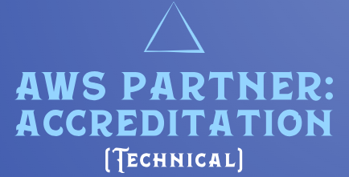

# AWS Partner: Cloud Economics   

### AWS <a href="../../">aws   </a>
### Training Category: <a href="../../aws_partner/">aws_partner</a>
### Software/Subject: aws   
### Course: <a href="./">curso_apn_001 (AWS Partner: Cloud Economics)   </a>

#### <a href="https://www.credly.com/badges/9d6fd8e2-9d1b-4db5-b600-c37bceb8867d/public_url">Badge</a>

---

### Theme:
- Cloud Computing

### Used Tools:
- Operating System (OS): 
  - Windows 11   
- Cloud:
  - Amazon Web Services (AWS)   
- Cloud Services:
  - Google Drive   
- Language:
  - HTML   
  - Markdown   
- Integrated Development Environment (IDE) and Text Editor:
  - Visual Studio Code (VS Code)   
- Versioning: 
  - Git   
- Repository:
  - GitHub   

---

<a name="item0"><h3>Course Strcuture:</h3></a>
1. <a href="#item01">Cloud Economics</a> 
2. <a href="#item02">Economia de Custos</a> 
3. <a href="#item03">Produtividade da Equipe</a> 
4. <a href="#item04">Resiliência Operacional</a> 
5. <a href="#item05">Agilidade Empresarial</a> 
6. <a href="#item06">Sustentabilidade</a> 
7. <a href="#item07">Gestão Financeira em Nuvem</a> 
8. <a href="#item08">Avaliação do Portfólio de Migração</a> 
9. <a href="#item09">Resumo do Curso</a> 

---

### Objective:
O curso Cloud Economics teve como objetivo capacitar profissionais a entenderem e aplicarem os princípios que sustentam a geração de valor por meio da nuvem. A abordagem se divide em duas áreas principais: Valor Comercial e Gestão Financeira em Nuvem (CFM). O Valor Comercial é estruturado em cinco pilares — economia de custos, produtividade empresarial, resiliência operacional, agilidade empresarial e sustentabilidade — que juntos permitem demonstrar como a nuvem contribui para ganhos estratégicos e operacionais. Já a CFM é composta por quatro pilares — medição e responsabilização, otimização de custos, planejamento e previsão e operações financeiras — que orientam o controle eficiente dos investimentos em nuvem ao longo do tempo. O curso também abordou a Avaliação de Portfólio de Migração (MPA), ferramenta que facilita a análise financeira e técnica de ambientes locais, apoiando decisões iniciais de arquitetura e planejamento de migração para a AWS.

### Structure:
A estrutura do curso é formada por:
- Este arquivo de README.
- A pasta `0-aux`, pasta auxiliar com imagens utilizadas na construção desse arquivo de README. 

### Development:
<a name="item01"><h4>Cloud Economics</h4></a>[Back to summary](#item0)

A economia da nuvem aborda duas áreas inter-relacionadas, porém distintas: o valor comercial e a gestão financeira da nuvem. O valor comercial representa os elementos que influenciam diretamente o desempenho organizacional e a experiência do cliente. Essa perspectiva é considerada durante a fase pré-venda, com o objetivo de evidenciar os benefícios estratégicos da adoção da AWS. Embora o custo total de propriedade (TCO) seja um componente relevante, o valor comercial vai além, abrangendo fatores adicionais que geram impactos significativos nos resultados operacionais e no crescimento do negócio.

A gestão financeira da nuvem constitui a segunda dimensão da economia da nuvem, com foco na otimização do uso dos recursos financeiros associados à infraestrutura em nuvem. Essa abordagem envolve o desenvolvimento de competências e a adoção de ferramentas que maximizam os benefícios econômicos ao longo de toda a jornada na AWS — desde o planejamento de migração ou criação de aplicações até a operação completa no ambiente em nuvem. A gestão financeira é relevante em todas as etapas do ciclo, incluindo a fase pré-migração, o processo de transição e o período pós-migração. Durante esse percurso, análises como a Avaliação do Portfólio de Migração contribuem para identificar oportunidades de economia, ao passo que práticas contínuas de governança financeira garantem o uso eficiente e sustentável dos recursos em nuvem.

A área de valor comercial, dentro da economia da nuvem, desempenha um papel fundamental ao promover conversas econômicas voltadas para a construção de business cases. Essas conversas têm início na fase pré-venda, com o objetivo de demonstrar como a adoção da AWS pode impactar positivamente o desempenho operacional e a experiência do cliente. A análise detalhada dos ambientes locais permite identificar ganhos potenciais com a migração, fornecendo uma base concreta para decisões estratégicas. A construção do business case fortalece a confiança nas decisões de aquisição, impulsiona o crescimento no uso dos serviços em nuvem e contribui para a redução do tempo necessário para concluir o ciclo de vendas. Essa abordagem prepara o terreno para uma transição bem-sucedida, que será posteriormente sustentada pelas práticas de gestão financeira da nuvem.

A entrega de valor ao cliente no contexto da economia da nuvem ocorre de forma progressiva dentro da área de valor comercial. Inicialmente, são realizadas conversas econômicas e análises que constroem o business case, demonstrando os benefícios da migração para a AWS. No entanto, o valor completo só se concretiza por meio de etapas práticas subsequentes, como provas de conceito, revisões arquitetônicas e migração de cargas de trabalho. Essas atividades representam a fase prática da área de valor comercial, onde os benefícios previamente discutidos começam a ser experimentados de forma direta. A análise de valor comercial atua como um facilitador para esse avanço, sendo essencial que os engajamentos ocorram com rapidez e eficiência, permitindo a transição para ações que materializam o valor proposto.

O **AWS Cloud Value Framework** foi desenvolvido com base na observação de padrões recorrentes em centenas de casos de negócios de clientes. Essa estrutura serve como referência para compreender e comunicar o valor gerado pela adoção da nuvem. O framework é composto por cinco pilares fundamentais, que devem ser considerados em conjunto para orientar conversas estratégicas sobre valor:
- Economia de Custo: Redução de gastos fixos com infraestrutura local e otimização dos custos variáveis por meio das economias de escala da AWS.
- Produtividade da Equipe: Aumento da eficiência operacional ao eliminar tarefas repetitivas e permitir que equipes produzam mais sem crescimento proporcional do quadro de pessoal.
- Resiliência Operacional: Melhoria na disponibilidade, segurança e redução do tempo de inatividade, promovendo continuidade nos serviços.
- Agilidade Empresarial: Capacidade de lançar novos produtos, expandir para novos mercados e adicionar funcionalidades com maior rapidez.
- Sustentabilidade: Redução do impacto ambiental das operações de TI por meio do uso eficiente de recursos e infraestrutura compartilhada.

<a name="item02"><h4>Economia de Custos</h4></a>[Back to summary](#item0)

<a name="item03"><h4>Produtividade da Equipe</h4></a>[Back to summary](#item0)

<a name="item04"><h4>Resiliência Operacional</h4></a>[Back to summary](#item0)

<a name="item05"><h4>Agilidade Empresarial</h4></a>[Back to summary](#item0)

<a name="item06"><h4>Sustentabilidade</h4></a>[Back to summary](#item0)

<a name="item07"><h4>Gestão Financeira em Nuvem</h4></a>[Back to summary](#item0)

<a name="item08"><h4>Avaliação do Portfólio de Migração</h4></a>[Back to summary](#item0)

<a name="item09"><h4>Resumo do Curso</h4></a>[Back to summary](#item0)

- AWS Cloud Economics:
  - AWS Business Value:
    - Fase Teórica: Conversas Econômicas / Análises -> Business Case
      - AWS Cloud Value Framework:
        - Economia de Custo.
          - Ferramenta: Análise de Economia de Custos.
          - Pilares:
            - Modelo baseado no consumo.
            - Modelos de preços da AWS.
            - Reduções frequentes de preços.
        - Produtividade da Equipe:
          - Categorias Principais de Funções Relacionadas a TI:
            - Gerenciamento da Infraestrutura de Hardware:
              - Servidor.
              - Rede.
              - Armazenamento.
            - Outras:
              - Aplicação.
              - Instalações.
              - Segurança.
        - Resiliência Operacional:
          - Operações.
          - Segurança.
          - Software.
          - Infraestrutura.
        - Agilidade Empresarial.
        - Sustentabilidade.
    - Fase Prática: Provas de conceito / Revisões Arquitetônicas / Migração de Carga de Trabalho
  - AWS Cloud Financial Management:
    - Medição e Responsabilização.
    - Otimização de Custos.
    - Planejamento e Previsão.
    - Operações Financeiras na Nuvem.
