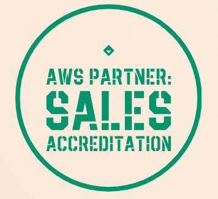

# AWS Partner: Sales Accreditation (Business)   

### AWS <a href="../../">aws   </a>
### Training Category: <a href="../../aws_partner/">aws_partner</a>
### Software/Subject: aws   
### Course: <a href="./">curso_apn_003 (AWS Partner: Sales Accreditation (Business))   </a>

#### <a href="https://www.credly.com/badges/f1721e35-aafe-4f44-b05a-e4017c4a366e/public_url">Badge</a>

---

### Theme:
- Cloud Computing

### Used Tools:
- Operating System (OS): 
  - Windows 11   
- Cloud:
  - Amazon Web Services (AWS)   
- Cloud Services:

  - AWS Management Console   

  - Google Drive   
- Language:
  - HTML   
  - Markdown   
- Integrated Development Environment (IDE) and Text Editor:
  - Visual Studio Code (VS Code)   
- Versioning: 
  - Git   
- Repository:
  - GitHub   

---
EM CONSTRUÇÃO

<a name="item0"><h3>Course Strcuture:</h3></a>
1. <a href="#item01">Cloud Computing</a> 
  1.1 <a href="#item01.1">Cloud Concepts and AWS</a> 
  1.2 <a href="#item01.2">Why Customers Choose AWS</a> 
  1.3 <a href="#item01.3">AWS Services</a> 
  1.4 <a href="#item01.4">Why Customers Choose AWS</a> 
2. <a href="#item02">Cloud Business Value</a> 
3. <a href="#item03">Cloud Objection Handling</a> 
4. <a href="#item04">Co-Selling with AWS</a> 

---

### Objective:
Este curso teve como objetivo proporcionar uma introdução à computação em nuvem, apresentando os princípios básicos, as categorias de serviços da AWS e algumas de suas principais ofertas de produtos, os diferenciais da AWS entre os outros provedores e identificar a importância da modernização para facilitar o valor do negócio. Também foi abordado a proposta de valor oferecida pela AWS aos seus clientes, como lidar com objeções comuns durante o processo de venda e como desenvolver estratégias para iniciar parcerias comerciais e vendas em conjunto com a AWS.

### Structure:
A estrutura do curso é formada por:
- Este arquivo de README.
- A pasta `0-aux`, pasta auxiliar com imagens utilizadas na construção desse arquivo de README. 

### Development:
<a name="item01"><h4>Cloud Concepts and AWS</h4></a>[Back to summary](#item0)

<a name="item01.1"><h4>Cloud Computing</h4></a>[Back to summary](#item0)

Computação em nuvem refere-se à oferta sob demanda de recursos de TI pela internet, com pagamento baseado no uso. Em vez de adquirir e manter infraestrutura própria, serviços como armazenamento e bancos de dados podem ser acessados de provedores como a AWS, de acordo com a necessidade do momento. 

Ao longo do tempo, a computação evoluiu por meio de camadas de abstração que facilitaram o uso dos recursos tecnológicos. Inicialmente, ajustes em hardware eram feitos manualmente. A criação dos sistemas operacionais permitiu maior flexibilidade e usabilidade, abstraindo a complexidade dos dispositivos. Com o surgimento das máquinas virtuais (VMs), foi possível executar múltiplos sistemas operacionais em uma única máquina física. Isso permitiu um uso mais eficiente dos recursos disponíveis. Posteriormente, os contêineres surgiram como solução para empacotar aplicações com suas dependências, promovendo portabilidade e consistência entre diferentes ambientes. O próximo estágio dessa evolução é o modelo serverless, que permite a execução de funções sem gerenciamento direto de servidores. Um exemplo desse modelo é o AWS Lambda, que executa funções em resposta a eventos, cobrando apenas pelo tempo de execução.

Há três modelos principais de implantação na computação em nuvem: nuvem pública, ambientes locais (on-premises) e modelos híbridos, que combinam os dois. A nuvem pública é gerenciada por terceiros e oferece escalabilidade e elasticidade. Ambientes locais mantêm o controle interno dos ativos. O modelo híbrido busca equilibrar as vantagens de ambos.

A adoção da nuvem ocorre em fases. Inicialmente, ocorrem testes ou migrações de cargas de trabalho de baixo risco. Em seguida, vêm as migrações para ambientes de produção, onde políticas de governança passam a ser implementadas. A próxima etapa envolve cargas de trabalho críticas, essenciais ao funcionamento da organização. Por fim, algumas empresas adotam a nuvem de forma ampla, priorizando-a em novos projetos e promovendo a modernização completa de sua infraestrutura tecnológica.

A computação em nuvem também pode ser dividida em três modelos de serviço: Software como Serviço (SaaS), Plataforma como Serviço (PaaS) e Infraestrutura como Serviço (IaaS), cada um com diferentes níveis de controle e responsabilidade compartilhada entre o provedor e o consumidor.

<a name="item01.2"><h4>Why Customers Choose AWS</h4></a>[Back to summary](#item0)

Ser obcecado pelo cliente significa priorizar suas necessidades e proporcionar uma experiência envolvente. Ao compreender seus problemas e entregar soluções eficazes, gera-se valor real para o negócio. A AWS destaca-se por oferecer uma ampla gama de serviços, redução de custos, foco na inovação e alcance global. Empresas com presença internacional encontram suporte escalável para suas operações. Entre os principais benefícios, estão:
- Substituição de grandes investimentos iniciais por um modelo de pagamento conforme o uso.
- Agilidade na obtenção de recursos em minutos, em vez de semanas.
- Facilidade na adoção de infraestruturas híbridas.
- Redução de custos e aumento da receita.
- Escalabilidade global com alta disponibilidade.
- Fortalecimento da segurança.
- Estímulo à inovação com liberdade para testar e errar rapidamente.
- Aceleração do retorno sobre os investimentos.

O diferencial da AWS está na liderança comprovada em infraestrutura como serviço, reconhecida por consultorias independentes como a Gartner. A cultura organizacional mantém foco no sucesso do cliente, com reduções proativas de preços e um portfólio com mais de 200 serviços. Somente em 2021, foram lançados mais de 3.000 novos recursos.

A infraestrutura global abrange dezenas de regiões, zonas de disponibilidade e pontos de presença, distribuídos estrategicamente para garantir resiliência e baixa latência. Zonas de Disponibilidade são isoladas fisicamente para proteger contra desastres locais, enquanto pontos de presença em grandes centros urbanos contribuem para uma entrega de conteúdo mais rápida.

A AWS também conta com a maior comunidade de parceiros e um marketplace com milhares de soluções integradas. Seus recursos híbridos abrangem desde redes privadas até serviços como AWS Outposts e Direct Connect, permitindo flexibilidade e integração entre ambientes locais e em nuvem.

Casos de uso comuns incluem backup, arquivamento, conformidade, data lakes e aplicações modernas e críticas. A combinação entre inovação, segurança, presença global e variedade de serviços posiciona a AWS como líder no setor de computação em nuvem.

<a name="item01.3"><h4>AWS Services</h4></a>[Back to summary](#item0)

A AWS disponibiliza uma ampla gama de serviços em constante expansão, permitindo que clientes e parceiros desenvolvam soluções para praticamente qualquer tipo de carga de trabalho de TI. Aproximadamente 90% dos serviços e funcionalidades da AWS são desenvolvidos com base no feedback direto de clientes e parceiros. Os outros 10% resultam de inovações proativas com foco nas necessidades do cliente.

A amplitude dos serviços refere-se à grande variedade de soluções disponíveis — atualmente, mais de 200 produtos abrangendo computação, armazenamento, machine learning, IoT, análise de dados, entre outros. Já a profundidade diz respeito à evolução constante das funcionalidades dentro desses serviços, que tornam a nuvem da AWS uma plataforma completa e flexível. Essa abordagem permite que os clientes utilizem exatamente os recursos de que precisam, com flexibilidade, elasticidade, agilidade e otimização de custos e desempenho. A arquitetura modular da AWS oferece autonomia para compor soluções específicas de acordo com os requisitos do negócio.

A seguir, algumas das principais categorias e casos de uso:
- Computação: O Amazon EC2 (Elastic Compute Cloud) permite executar instâncias com escolha personalizada de processador, sistema operacional, rede e armazenamento. É ideal para aplicações corporativas, HPC e machine learning.
- Armazenamento: A AWS disponibiliza soluções para objetos, arquivos e blocos, com escalabilidade automática e eliminação da necessidade de planejamento antecipado de capacidade. Casos de uso incluem data lakes, backups, arquivamento e desenvolvimento de aplicações modernas.
- Bancos de Dados: Ofertas que atendem a cargas críticas com alta disponibilidade e segurança. A AWS suporta múltiplos modelos, como relacional, chave-valor, gráfico, séries temporais e colunar.
- Segurança: Serviços para automação de tarefas de segurança, incluindo proteção de dados, controle de acesso, proteção de rede e conformidade.
- Gestão: Conjunto de ferramentas para provisionamento, operação e governança de ambientes AWS, com foco em controle centralizado e conformidade automatizada.
- Rede e Entrega de Conteúdo: Serviços projetados para suportar qualquer carga de trabalho em uma infraestrutura global segura, com foco em baixa latência, escalabilidade e integração híbrida.

A AWS fornece blocos de construção arquitetônicos com flexibilidade suficiente para aplicações web, móveis, armazenamento, processamento de dados e arquivamento. Cada solução é validada por arquitetos da AWS e inclui guias de implantação, arquiteturas de referência e opções para implantação manual ou automatizada.

O AWS Marketplace é um catálogo digital que facilita a aquisição, implantação e governança de software de terceiros. Clientes podem explorar ofertas de software e serviços profissionais prontos para uso, com fácil integração ao ambiente AWS. Além disso, compras realizadas por meio do Marketplace podem ser contabilizadas para o cumprimento de compromissos firmados no Programa de Descontos Empresariais da AWS.

Clientes iniciam sua jornada na nuvem com casos simples, como:
- Backup e Restauração: Integração com ferramentas de mercado para armazenar dados no Amazon S3, sem impacto nas operações existentes.
- Arquivo e Conformidade: Migração de arquivos para reduzir custos com infraestrutura de fitas e garantir retenção de longo prazo.
- Diretórios Pessoais: Migração de dados de usuários para o Amazon FSx, reduzindo custos com NAS e servidores de arquivos, com impacto mínimo nas operações.
- Data Lakes: Repositórios unificados que eliminam silos de dados e permitem análises avançadas com machine learning e processamento em larga escala.
- Aplicações Modernas: Migração por meio de lift-and-shift (rehospedagem) ou refatoração, de acordo com o ritmo desejado pela organização.
- Aplicações Críticas de Negócio: Sistemas ERP, bancos de dados e CMS são frequentemente migrados para a nuvem com foco em continuidade operacional e redução de custos.

<a name="item01.4"><h4>Facilitating Digital Transformation</h4></a>[Back to summary](#item0)

<a name="item02"><h4>Cloud Business Value</h4></a>[Back to summary](#item0)

<a name="item03"><h4>Cloud Objection Handling</h4></a>[Back to summary](#item0)

<a name="item04"><h4>Co-Selling with AWS</h4></a>[Back to summary](#item0)

