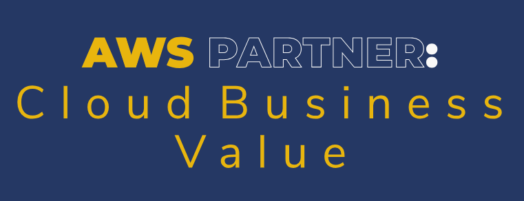

# AWS Partner: Cloud Business Value   

### AWS <a href="../../">aws   </a>
### Training Category: <a href="../../aws_partner/">aws_partner</a>
### Software/Subject: aws   
### Course: <a href="./">curso_apn_005 (AWS Partner: Cloud Business Value)   </a>

#### <a href="https://github.com/PedroHeeger/my_tech_journey/blob/main/credentials/certificates/online_courses/cloud/aws/250626_APN...Cloud_Business_Value_PH_ASB.pdf">Certificate</a>

---

### Theme:
- Cloud Computing

### Used Tools:
- Operating System (OS): 
  - Windows 11   
- Cloud:
  - Amazon Web Services (AWS)   
- Cloud Services:
  - AWS Cloud Value Framework   
  - Google Drive   
- Language:
  - HTML   
  - Markdown   
- Integrated Development Environment (IDE) and Text Editor:
  - Visual Studio Code (VS Code)   
- Versioning: 
  - Git   
- Repository:
  - GitHub   

---

<a name="item0"><h3>Course Strcuture:</h3></a>
1. <a href="#item01">Business Value and Benchmarking</a> 
2. <a href="#item02">AWS Cloud Value Framework: Cost Saving</a> 
3. <a href="#item03">AWS Cloud Value Framework: Staff Productivity</a> 
4. <a href="#item04">AWS Cloud Value Framework: Operational Resilience</a> 
5. <a href="#item05">AWS Cloud Value Framework: Business Agility</a> 

---

### Objective:
Este curso teve como objetivo apresentar o Cloud Value Framework da AWS como uma ferramenta para mensurar e comunicar os benefícios da nuvem, com foco em economia de custos, aumento da produtividade, resiliência operacional e agilidade nos negócios. O curso também explora práticas de benchmarking que auxiliam na avaliação do impacto da migração para a nuvem por meio de dados e indicadores reais, contribuindo para a construção de um caso de negócio sólido e orientado a resultados.

### Structure:
A estrutura do curso é formada por:
- Este arquivo de README, abordando o assunto do curso.
- A pasta `0-aux`, pasta auxiliar com imagens utilizadas na construção desse arquivo de README. 

### Development:
<a name="item01"><h4>1. Business Value and Benchmarking</h4></a>[Back to summary](#item0)

O valor de negócio da nuvem está relacionado aos benefícios concretos obtidos pelas organizações ao adotarem serviços em nuvem, como redução de custos, aumento de produtividade, maior resiliência e agilidade nos negócios. A AWS define esses benefícios por meio do Cloud Value Framework, uma estrutura que organiza os principais resultados percebidos pelos clientes em quatro pilares:
- Economia de custos: Redução de gastos com infraestrutura e diminuição de despesas operacionais após a migração.
- Produtividade da equipe: Redirecionamento de profissionais para atividades estratégicas, com eliminação de tarefas manuais e repetitivas.
- Resiliência operacional: Melhoria na disponibilidade, redução de falhas não planejadas e cumprimento mais eficiente de acordos de nível de serviço.
- Agilidade empresarial: Implantação mais rápida de recursos, resposta eficiente às mudanças de mercado e redução no tempo de lançamento de novos produtos.

Muitas organizações iniciam a migração com foco na economia, mas os maiores benefícios sustentáveis são percebidos nos demais pilares. A análise de valor vai além dos custos e envolve ganhos operacionais e estratégicos.

O benchmarking permite medir os benefícios da nuvem com base em dados reais obtidos de clientes da AWS, por meio de estudos encomendados e entrevistas individuais. Essa prática ajuda a comparar resultados, entender tendências de mercado e avaliar o retorno da migração com base em indicadores-chave de desempenho (KPIs). Embora os dados reflitam resultados concretos, não garantem resultados futuros, mas servem como referência para estimativas mais embasadas.

O conceito de valor comercial ou valor de negócio (Business Value) ajuda a compreender o impacto da nuvem na saúde da organização a longo prazo. O Cloud Value Framework da AWS orienta a construção de um caso de negócio completo e estruturado para adoção da nuvem, mensurando progressos e resultados alcançados com base nos quatro pilares centrais.

<a name="item02"><h4>2. AWS Cloud Value Framework: Cost Saving</h4></a>[Back to summary](#item0)

A redução de custos é um dos principais pilares do Cloud Value Framework. Pode ser alcançada pela eliminação de infraestrutura local com altos custos fixos e pela redução de custos variáveis, aproveitando as economias de escala da AWS.

Estudos de benchmarking indicam que, após a migração para a nuvem, os gastos com TI como percentual da receita caem em média 4%, enquanto os gastos com infraestrutura caem cerca de 20%. Esses indicadores demonstram que é possível ampliar a receita sem aumentar proporcionalmente os custos de TI.

Com o tempo, o uso contínuo da nuvem possibilita ganhos adicionais de eficiência. À medida que a migração avança e mais serviços são adotados, os custos tendem a diminuir, mesmo diante de crescimento na demanda. Essa redução ocorre devido à aplicação de estratégias de otimização, como uso de instâncias reservadas, escalabilidade automática e desligamento de recursos ociosos.

A economia de custos pode seguir dois caminhos: manter ou reduzir os gastos totais na AWS, independentemente do aumento de uso; ou permitir aumento proporcional de custos, acompanhado por crescimento na demanda e geração de valor. Em ambos os casos, observa-se maior controle financeiro e eficiência operacional ao longo da jornada na nuvem.

<a name="item03"><h4>3. AWS Cloud Value Framework: Staff Productivity</h4></a>[Back to summary](#item0)

A produtividade da equipe é ampliada com a redução ou eliminação de tarefas operacionais que deixam de ser necessárias após a migração para a nuvem. A automação de processos e o uso de serviços gerenciados liberam tempo, permitindo foco em iniciativas estratégicas de maior valor. 

A avaliação dos ganhos é feita com base em seis categorias funcionais: servidores, redes, armazenamento, aplicativos, instalações e segurança. Diversas tarefas são otimizadas ou totalmente eliminadas, resultando em melhorias mensuráveis de eficiência. No caso de administradores de servidores, por exemplo, atividades como reparo de hardware e planejamento de capacidade deixam de ser exigidas na AWS. Estudos de benchmarking indicam redução significativa no tempo gasto nessas tarefas, possibilitando redirecionamento de esforços para inovação e planejamento.

Dados de benchmarking revelam os seguintes impactos após a migração para a AWS:
- Aumento de 66% no número de máquinas virtuais gerenciadas por administrador.
- Crescimento de 17% no tempo dedicado a trabalho estratégico pela equipe de infraestrutura.
- Expansão de 29% no tempo voltado à criação de novos recursos por equipes de desenvolvimento.

Essas melhorias fortalecem a capacidade organizacional, permitindo resposta mais ágil às demandas do negócio e aceleração na entrega de valor.

<a name="item04"><h4>4. AWS Cloud Value Framework: Operational Resilience</h4></a>[Back to summary](#item0)

A resiliência operacional representa a capacidade de manter a continuidade dos serviços com alta disponibilidade, segurança reforçada e redução de interrupções não planejadas. Esse pilar do Cloud Value Framework impacta diretamente a estabilidade dos negócios e pode gerar economia significativa, apesar da dificuldade em mensurar esses ganhos de forma imediata.

Falhas em sistemas críticos podem provocar prejuízos financeiros expressivos. Segundo análises do setor, interrupções de aplicativos impactam diretamente o desempenho e a receita das organizações. Além disso, falhas de segurança, como perda ou roubo de dados, representam riscos elevados.

Estudos de benchmarking indicam os seguintes resultados após a migração para a AWS:
- Redução de 69% no tempo de inatividade não planejado.
- Queda de 45% nos incidentes de segurança mensais.
- Diminuição de 39% no tempo necessário para detectar incidentes.
- Aumento de 23% no cumprimento dos acordos de nível de serviço (SLA).

Essas melhorias evidenciam uma operação mais confiável, com menor impacto de falhas, resposta mais ágil a incidentes e reforço nos padrões de segurança e conformidade.

<a name="item05"><h4>5. AWS Cloud Value Framework: Business Agility</h4></a>[Back to summary](#item0)

A agilidade empresarial representa a capacidade de adaptação rápida diante de mudanças nas condições de negócio. Com a AWS, o desenvolvimento se torna mais ágil, permitindo ciclos de experimentação mais curtos, redução de riscos e resposta mais eficiente a demandas do mercado. A nuvem permite testar ideias rapidamente, descartando projetos que não trazem resultados, evitando custos irrecuperáveis. Essa abordagem reduz falhas em fases avançadas e favorece a inovação contínua.

Resultados observados em benchmarking incluem:
- Redução de 60% no tempo para geração de insights;
- Diminuição de 43% no tempo para lançamento de novos recursos;
- Queda de 34% no tempo médio de publicação em produção;
- Aumento de 40% na quantidade de projetos em andamento com uso de DevOps e metodologias ágeis.

Além disso, a AWS facilita o uso de serviços integrados que aceleram o desenvolvimento, otimizam a entrega contínua, reduzem custos de manutenção e eliminam atrasos na implantação. Essa combinação favorece ambientes mais dinâmicos e propícios à inovação.