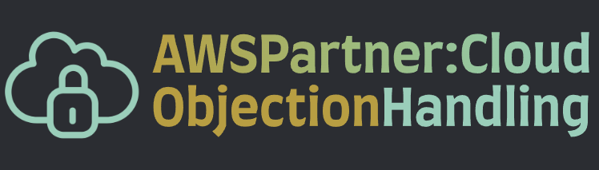

# AWS Partner: Cloud Objection Handling   

### AWS <a href="../../">aws   </a>
### Training Category: <a href="../../aws_partner/">aws_partner</a>
### Software/Subject: aws   
### Course: <a href="./">curso_apn_006 (AWS Partner: Cloud Objection Handling)   </a></a>

#### <a href="https://github.com/PedroHeeger/my_tech_journey/blob/main/credentials/certificates/online_courses/cloud/aws/250809_APN...Cloud_Objection_Handling_PH_ASB.pdf">Certificate</a>

---

### Theme:
- Cloud Computing

### Used Tools:
- Operating System (OS): 
  - Windows 11   </a>
- Cloud:
  - Amazon Web Services (AWS)   </a>
- Cloud Services:
  - Google Drive   </a>
- Language:
  - HTML   </a>
  - Markdown   </a>
- Integrated Development Environment (IDE) and Text Editor:
  - Visual Studio Code (VS Code)   </a>
- Versioning: 
  - Git   </a>
- Repository:
  - GitHub   </a>

---

<a name="item0"><h3>Course Strcuture:</h3></a>
1. <a href="#item01">Cloud Objections</a> 
2. <a href="#item02">Cost</a> 
3. <a href="#item03">Security, Compliance, and Privacy</a> 
4. <a href="#item04">Loss of Control or Visibility</a> 
5. <a href="#item05">Existing Infrastructure</a> 
6. <a href="#item06">Skills Gap</a> 
7. <a href="#item07">Vendor Lock-in</a> 
8. <a href="#item08">Sustainability</a> 

---

### Objective:
Este curso teve como objetivo introduzir as objeções comuns dos clientes em relação à adoção da nuvem — incluindo custo, segurança, privacidade, perda de controle, infraestrutura existente, lacuna de habilidades, dependência de fornecedor e sustentabilidade — e capacitar a resposta a essas objeções por meio do entendimento dos desafios e das soluções oferecidas pela **AWS**.

### Structure:
A estrutura do curso é formada por:
- Este arquivo de README.
- A pasta `0-aux`, pasta auxiliar com imagens utilizadas na construção desse arquivo de README. 

### Development:
<a name="item01"><h4>Cloud Objections</h4></a>[Back to summary](#item0)

As objeções à adoção da nuvem geralmente envolvem preocupações como custo, segurança, conformidade, privacidade, perda de controle e visibilidade, manutenção de infraestrutura já existente, lacunas de habilidades para migração, dependência de fornecedores e sustentabilidade. Compreender esses desafios é essencial para propor soluções adequadas. O processo de lidar com objeções permite identificar necessidades, esclarecer dúvidas, reduzir incertezas e estabelecer confiança, transformando preocupações em oportunidades para adoção de soluções em nuvem.

<a name="item02"><h4>Cost</h4></a>[Back to summary](#item0)

A objeção de custo é uma das mais comuns na adoção da nuvem. Ela pode estar relacionada à percepção de que a nuvem é cara ou ao investimento necessário para a migração. Estudos indicam que, dependendo da carga de trabalho, migrar para a **AWS** pode reduzir significativamente os gastos, como demonstrado por uma pesquisa que apontou redução média de 27,4% no tempo total de uso por usuário após a migração.

Além da economia direta, a nuvem oferece ganhos como aumento de produtividade da equipe, maior resiliência operacional e mais agilidade nos negócios. Para estimar os benefícios, podem ser utilizadas ferramentas e metodologias que combinam dados do cliente com benchmarks de mercado, formando um business case sólido. A otimização de custos na AWS pode ser feita por três principais abordagens:
- Modelos de precificação adequados: inclui pagamento conforme o uso para mais de 200 serviços e planos de economia com compromissos de 1 a 3 anos, além de descontos por volume.
- Ajuste de capacidade à demanda: escalabilidade elástica que evita provisionamento excessivo e permite pagar apenas pelo que for utilizado.
- Identificação de desperdícios: uso de serviços como o **Amazon CloudWatch** para monitorar, testar configurações e ajustar recursos automaticamente, garantindo dimensionamento adequado.

Também é possível reduzir custos iniciais por meio de programas de recompra de hardware, incentivos financeiros e adoção de estratégias híbridas que complementem a infraestrutura local.

<a name="item03"><h4>Security, Compliance, and Privacy</h4></a>[Back to summary](#item0)

A segurança, conformidade e privacidade estão entre as objeções mais comuns à adoção da nuvem, podendo envolver preocupações gerais com a proteção de dados, requisitos regulatórios específicos ou conformidade setorial. A **AWS** foi projetada para ser um dos ambientes de computação em nuvem mais seguros e flexíveis, com infraestrutura desenvolvida para atender aos padrões de militares, bancos globais e outras organizações de alta criticidade. Conta com mais de 500 serviços e recursos voltados a segurança, conformidade e governança, oferece suporte a 98 padrões e certificações (como PCI DSS, HIPAA, FedRAMP, GDPR e FIPS) e permite criptografia em todos os 117 serviços que armazenam dados de clientes.

Os clientes mantêm o controle sobre onde seus dados serão armazenados, quem terá acesso e quando podem ser movimentados, sempre em conformidade com regulamentações como o GDPR. A criptografia pode ser aplicada em repouso e em trânsito, seja com recursos nativos da **AWS** ou soluções de terceiros, tornando os dados ilegíveis sem as chaves adequadas. O modelo de responsabilidade compartilhada define que a **AWS** é responsável pela segurança da nuvem, protegendo a infraestrutura global e configurando a segurança de serviços gerenciados como **Amazon S3**, **Amazon RDS** e **Amazon DynamoDB**. Já os clientes são responsáveis pela segurança na nuvem, incluindo proteção de conteúdo, redes, plataformas e aplicativos.

Setores altamente regulados, como saúde, financeiro, jurídico e farmacêutico, já utilizam a **AWS** para aprimorar sua postura de segurança. Além disso, há recursos como o **AWS Marketplace**, que disponibiliza soluções de segurança de terceiros para reforçar a proteção.

Entre as preocupações frequentes está a Lei CLOUD, que permite solicitações limitadas de dados por autoridades dos EUA, mas inclui salvaguardas para contestar pedidos que entrem em conflito com leis ou interesses nacionais de outros países. A lei não sobrepõe legislações estrangeiras e está documentada em materiais oficiais e perguntas frequentes. Outra referência relevante é o GDPR, lei europeia de privacidade que harmoniza a proteção de dados na União Europeia. Todos os serviços **AWS** que processam dados enviados por clientes podem ser configurados para operar em conformidade com essa legislação.

A preocupação com segurança, longe de ser apenas um obstáculo, é um dos principais fatores que motivam a migração para a nuvem, pois permite alcançar níveis mais elevados de proteção, governança e conformidade do que em muitos ambientes locais.

<a name="item04"><h4>Loss of Control or Visibility</h4></a>[Back to summary](#item0)

A percepção de perda de controle ou visibilidade é uma objeção comum na adoção da nuvem, decorrente do fato de a infraestrutura não estar fisicamente disponível para inspeção direta. Essa preocupação pode abranger desde a proteção de dados confidenciais até a supervisão de custos e operações. Na **AWS**, a visibilidade e o controle são ampliados por ferramentas centralizadas de monitoramento e governança, como **AWS Cost Explorer**, **AWS Security Hub**, **Amazon CloudWatch**, **AWS Config** e **AWS Organizations**. É possível anexar até 50 rótulos a cada servidor, permitindo alimentar painéis de controle que exibem, por exemplo, o impacto de decisões de design sobre os custos.

Para prevenção de erros de configuração e aumento da rastreabilidade, o **AWS CloudTrail** registra, monitora e armazena toda a atividade da conta, facilitando auditorias, análise de segurança e resolução de problemas. O **Amazon Macie**, por sua vez, utiliza aprendizado de máquina para identificar, classificar e proteger automaticamente dados confidenciais, emitindo alertas detalhados em caso de risco de acesso não autorizado ou exposição acidental.

A **AWS** e seus parceiros oferecem um conjunto abrangente de medidas técnicas, operacionais e contratuais para proteção de dados. O controle sobre privacidade inclui definição de quem pode acessar, como as informações são usadas e de que forma são criptografadas, em um ambiente de nuvem seguro e flexível.

<a name="item05"><h4>Existing Infrastructure</h4></a>[Back to summary](#item0)

A objeção relacionada à infraestrutura existente é comum, especialmente quando clientes já investiram significativamente em data centers locais. Migrar para a **AWS** não significa abandonar esses investimentos, mas sim otimizar sua utilização. Na prática, a maioria dos clientes opera em modelos híbridos, mantendo localmente o que faz sentido e levando para a nuvem as cargas de trabalho mais adequadas, evitando desperdícios e melhorando o aproveitamento dos recursos.

A **AWS** oferece diversas soluções para integração híbrida, como **Amazon VPC**, **AWS Direct Connect** e **AWS Storage Gateway**. Para clientes que utilizam **VMware**, o **VMware Cloud on AWS** permite manter as mesmas ferramentas e processos já utilizados on-premises, executando-os de forma integrada na nuvem. Essa solução é fruto de parceria entre **AWS** e **VMware**, sendo totalmente gerenciada e suportada por ambas as empresas.

Um estudo da 451 Research mostra que a taxa média de utilização de servidores locais é de apenas 18%, deixando grande parte da capacidade ociosa. A **AWS**, por sua arquitetura e modelo operacional, consegue elevar significativamente essa taxa de aproveitamento. Além disso, 57% dos servidores **Windows** já rodam na **AWS**, e há programas de incentivo como o **Windows Rapid Migration Program (WRMP)** e avaliações de licenciamento, que facilitam e aceleram a transição.

<a name="item06"><h4>Skills Gap</h4></a>[Back to summary](#item0)

A objeção referente à lacuna de habilidades surge quando a equipe interna não possui conhecimento suficiente em nuvem para suportar um projeto. Essa é uma das principais barreiras para a adoção da nuvem e deve ser reconhecida como legítima. Antes da migração, recomenda-se realizar uma avaliação de prontidão, identificando as deficiências e definindo como superá-las. Há diversas estratégias para mitigar essa lacuna:
- Reduzir: optar por uma estratégia de migração alinhada à zona de conforto e às capacidades atuais da organização, priorizando cargas mais familiares e deixando modernizações complexas para etapas futuras.
- Preencher internamente: investir na requalificação e treinamento da equipe.
- Preencher externamente: contar temporariamente com parceiros da **AWS** para complementar as habilidades enquanto a equipe interna é capacitada.
- Delegar permanentemente: transferir tarefas operacionais para parceiros ou para o **AWS Managed Services (AMS)**, permitindo que a equipe interna se concentre em atividades estratégicas e de maior valor agregado.

O engajamento com o **AWS Partner** pode acelerar significativamente a geração de valor, oferecendo expertise, recursos e suporte especializado para reduzir o impacto da falta de habilidades durante a transição para a nuvem.

<a name="item07"><h4>Vendor Lock-in</h4></a>[Back to summary](#item0)

O chamado aprisionamento de fornecedor ocorre quando a migração para a nuvem leva à dependência de um provedor e de sua plataforma. O termo “aprisionamento” pode ser enganoso, pois o que realmente está em jogo são os custos de mudança (switching costs), presentes em qualquer solução de TI. Mesmo soluções de código aberto, ainda que gratuitas, geram custos caso seja necessário substituí-las, seja pelo tempo investido ou pela adaptação de processos.

A liberdade de migrar para outro provedor é conhecida como reversibilidade, e o custo dessa migração é um equilíbrio entre o investimento inicial e os gastos futuros de transferência. Sob o ponto de vista técnico, a **AWS** oferece diversos serviços baseados em soluções de código aberto, reduzindo a dependência tecnológica e proporcionando maior reversibilidade. O modelo de pagamento conforme o uso da **AWS** diminui o grau de dependência de longo prazo. Além disso, os clientes mantêm liberdade e controle sobre o ritmo de sua migração, sem necessidade de compromissos contratuais extensos.

<a name="item08"><h4>Sustainability</h4></a>[Back to summary](#item0)

A sustentabilidade é uma preocupação crescente entre os clientes. Em 2021, a **Amazon** cofundou o The Climate Pledge, comprometendo-se a alcançar zero emissões líquidas de carbono até 2040 e convidando outras empresas a aderirem. A **AWS** apoia organizações de todos os portes e setores com conhecimento e ferramentas para desenvolver soluções alinhadas às metas de sustentabilidade. A escala e a elasticidade da Nuvem **AWS** reduzem a pegada de carbono: clientes utilizam recursos apenas quando necessário, podem desligar servidores ociosos e compartilham uma infraestrutura otimizada, diminuindo o impacto por unidade de uso.

Um estudo encomendado pela **AWS** em 2019 mostrou que sua infraestrutura é 3,6 vezes mais eficiente energeticamente que a mediana dos data centers corporativos dos EUA e executa as mesmas tarefas com 88% menos emissões de carbono. Essa eficiência decorre de:
- 61%: servidores mais eficientes e melhor utilização;
- 11%: instalações de data center mais eficientes;
- 17%: uso reduzido de eletricidade e adoção de energia renovável.

A **AWS** também permite práticas específicas de sustentabilidade, como:
- Medição e relatórios de carbono: transformar dados da cadeia de suprimentos em métricas comparáveis para monitorar progresso;
- Gestão de edifícios sustentáveis: identificar e reduzir emissões em operações físicas;
- Embalagens sustentáveis: aplicar análise de dados e machine learning para reduzir desperdício e emissões no transporte.

Com controle direto sobre suas regiões e cadeia de suprimentos, a **AWS** consegue aplicar rapidamente melhorias globais de eficiência, ajudando clientes a reduzir custos e impacto ambiental simultaneamente.