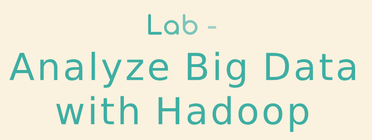
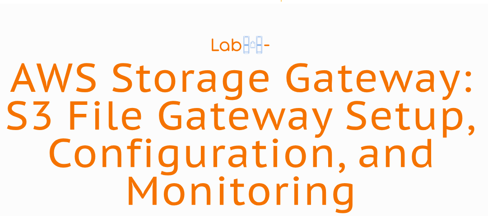
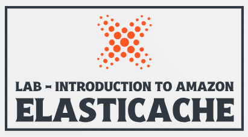
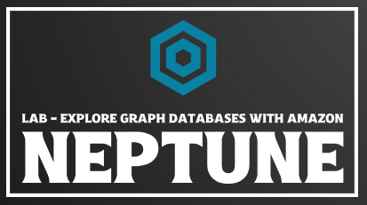
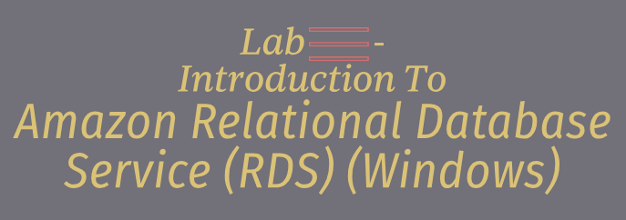
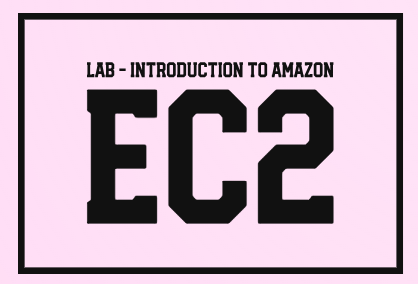
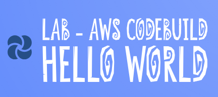

# Training Category: <a href="./self_paced_lab">self_paced_lab</a>

### AWS <a href="../">aws   </a>

Para cada categoria de treinamento do **AWS Skill Builder**, as atividades foram separadas por áreas da **AWS** com base no principal serviço utilizado na atividade.

### Activities:

Analytics

    <ul>
        <li>

Amazon Athena

        <ul>
            <li>curso_spl_042: <a href="./curso_spl_042/">Lab - Query Data with Amazon Athena   </a></li>
        </ul></li>
        <li>

Amazon Elastic MapReduce (EMR)

        <ul>
            <li>curso_spl_009: <a href="./curso_spl_009/">Lab - Analyze Big Data with Hadoop   </a></li>
        </ul></li>
        <li>

Amazon Kinesis

        <ul>
            <li>curso_spl_033: <a href="./curso_spl_033/">Lab - Stream Real-Time Data with Amazon Kinesis   </a></li>
            <li>curso_spl_044: <a href="./curso_spl_044/">Lab - Transform Data with Amazon Data Firehose   </a></li>
        </ul></li>
        <li>

Amazon OpenSearch Service (AOSS)

        <ul>
            <li>curso_spl_040: <a href="./curso_spl_040/">Lab - Configure and Analyze Data with Amazon OpenSearch Service   </a></li>
        </ul></li>
        <li>

Amazon QuickSight

        <ul>
            <li>curso_spl_011: <a href="./curso_spl_011/">Lab - Exploring the Generative Business Intelligence Features in Amazon QuickSight   </a></li>
            <li>curso_spl_025: <a href="./curso_spl_025/">Lab - Building BI Dashboards with Amazon QuickSight   </a></li>
        </ul></li>
        <li>

Amazon Redshift

        <ul>
            <li>curso_spl_010: <a href="./curso_spl_010/">Lab - Introduction to Amazon Redshift   </a></li>
        </ul></li>
        <li>

AWS Glue

        <ul>
            <li>curso_spl_031: <a href="./curso_spl_031/">Lab - A Day in the Life of a Data Engineer   </a></li>
        </ul></li>
    </ul>

AR e VR

    <ul>
    </ul>

Armazenamento

    <ul>
        <li>

AWS Storage Gateway

        <ul>
            <li>curso_spl_008: <a href="./curso_spl_008/">Lab - AWS Storage Gateway: S3 File Gateway Setup, Configuration, and Monitoring   </a></li>
        </ul></li>
    </ul>

AWS Geral

    <ul>
    </ul>

Banco de Dados

    <ul>
        <li>

Amazon Aurora

        <ul>
            <li>curso_spl_020: <a href="./curso_spl_020/">Lab - Introduction to Amazon Aurora   </a></li>
            <li>curso_spl_023: <a href="./curso_spl_023/">Lab - Migrating RDS MySQL to Aurora with Read Replica   </a></li>
        </ul></li>
        <li>

Amazon DocumentDB

        <ul>
            <li>curso_spl_034: <a href="./curso_spl_034/">Lab - Manage NoSQL Databases with Amazon DocumentDB   </a></li>
        </ul></li>
        <li>

Amazon DynamoDB

        <ul>
            <li>curso_spl_022: <a href="./curso_spl_022/">Lab - Introduction to Amazon DynamoDB   </a></li>
            <li>curso_spl_026: <a href="./curso_spl_026/">Lab - Integrating Amazon DynamoDB   </a></li>
            <li>curso_spl_046: <a href="./curso_spl_046/">Lab - Serverless Web Apps using Amazon DynamoDB - Part 1   </a></li>
        </ul></li>
        <li>

Amazon ElastiCache

        <ul>
            <li>curso_spl_021: <a href="./curso_spl_021/">Lab - Introduction to Amazon ElastiCache   </a></li>
            <li>curso_spl_024: <a href="./curso_spl_024/">Lab - Introduction to Amazon ElastiCache with Windows Server   </a></li>
        </ul></li>
        <li>

Amazon MemoryDB

        <ul>
            <li>curso_spl_043: <a href="./curso_spl_043/">Lab - Implement In-Memory Databases with Amazon MemoryDB   </a></li>
        </ul></li>
        <li>

Amazon Neptune

        <ul>
            <li>curso_spl_045: <a href="./curso_spl_045/">Lab - Manage NoSQL Databases with Amazon DocumentDB   </a></li>
        </ul></li>
        <li>

Amazon Relational Database Service (RDS)

        <ul>
            <li>curso_spl_027: <a href="./curso_spl_027/">Lab - Introduction to Amazon Relational Database Service (RDS) (Linux)   </a></li>
            <li>curso_spl_028: <a href="./curso_spl_028/">Lab - Introduction to Amazon Relational Database Service (RDS) (Windows)   </a></li>
            <li>curso_spl_036: <a href="./curso_spl_036/">Lab - Introduction to Amazon Relational Database Service (RDS) - SQL Server   </a></li>
            <li>curso_spl_038: <a href="./curso_spl_038/">Lab - Deploy and Manage Oracle Databases with Amazon RDS for Oracle   </a></li>
        </ul></li>
    </ul>

Blockchain

    <ul>
    </ul>

Computação

    <ul>
        <li>

Amazon Elastic Compute Cloud (EC2)

        <ul>
            <li>curso_spl_019: <a href="./curso_spl_019/">Lab - Introduction to Amazon EC2   </a></li>
            <li>curso_spl_035: <a href="./curso_spl_035/">Lab - Troubleshooting connectivity using EC2 Serial Console   </a></li>
        </ul></li>
        <li>

Amazon EC2 Auto Scaling

        <ul>
            <li>curso_spl_001: <a href="./curso_spl_001/">Lab - Introduction to Amazon EC2 Auto Scaling   </a></li>
        </ul></li>
        <li>

AWS Lambda

        <ul>
            <li>curso_spl_002: <a href="./curso_spl_002/">Lab - Configuring Internet Access from Lambda in a VPC   </a></li>
            <li>curso_spl_047: <a href="./curso_spl_047/">Lab - Serverless Web Apps using Amazon DynamoDB - Part 2   </a></li>
        </ul></li>
    </ul>

Computação de Usuário Final

    <ul>
    </ul>

Contêineres

    <ul>
        <li>

Amazon Elastic Container Service (ECS)

        <ul>
            <li>curso_spl_016: <a href="./curso_spl_016/">Lab - Working with Amazon Elastic Container Service   </a></li>
        </ul></li>
        <li>

Amazon Elastic Kubernetes Service (EKS)

        <ul>
            <li>curso_spl_032: <a href="./curso_spl_032/">Lab - Deploy Applications on Amazon Elastic Kubernetes Service(EKS)   </a></li>
        </ul></li>        
    </ul>

Ferramentas do Desenvolvedor

    <ul>
        <li>

AWS CodeBuild

        <ul>
            <li>curso_spl_029: <a href="./curso_spl_029/">Lab - AWS CodeBuild Hello World   </a></li>
        </ul></li>  
    </ul>

Gerenciamento de Custos

    <ul>
    </ul>

Gerenciamento e Governança

    <ul>
        <li>

AWS Well-Architected Framework (WA Framework)

        <ul>
            <li>curso_spl_013: <a href="./curso_spl_013/">Lab - Walkthrough of the AWS Well-Architected Tool   </a></li>
            <li>curso_spl_030: <a href="./curso_spl_030/">Lab - Custom Lenses using the AWS Well-Architected Tool   </a></li>
        </ul></li>  
    </ul>

Infraestrutura

    <ul>
    </ul>

Integração de Aplicativos

    <ul>
        <li>

Amazon Simple Notification Service (SNS)

        <ul>
            <li>curso_spl_041: <a href="./curso_spl_041/">Lab - Create Topics and Subscriptions using Amazon Simple Notification Service (Amazon SNS)   </a></li>
        </ul></li>  
        <li>

Amazon Simple Queue Service (SQS)

        <ul>
            <li>curso_spl_004: <a href="./curso_spl_004/">Lab - Integrating Amazon Simple Queue Service (Amazon SQS)   </a></li>
        </ul></li>  
        <li>

AWS Step Functions

        <ul>
            <li>curso_spl_018: <a href="./curso_spl_018/">Lab - Capital Guessing Game   </a></li>
        </ul></li>  
    </ul>

Interação com os Clientes

    <ul>
    </ul>

Internet das Coisas (IoT)

    <ul>
    </ul>

Machine Learning

    <ul>
        <li>

Amazon SageMaker

        <ul>
            <li>curso_spl_014: <a href="./curso_spl_014/">Lab - Analyze and Prepare Data with Amazon SageMaker Data Wrangler and Amazon EMR   </a></li>
            <li>curso_spl_017: <a href="./curso_spl_017/">Lab - Train a model with Amazon SageMaker   </a></li>
        </ul></li>  
    </ul>

Migração e Transferência

    <ul>
        <li>

AWS Database Migration Service (DMS)

        <ul>
            <li>curso_spl_037: <a href="./curso_spl_037/">Lab - Introduction to AWS Database Migration Service   </a></li>
        </ul></li>  
    </ul>

Produtividade Empresarial

    <ul>
    </ul>

Redes e Entrega de Conteúdo

    <ul>
        <li>

Amazon API Gateway

        <ul>
            <li>curso_spl_048: <a href="./curso_spl_048/">Lab - Serverless Web Apps using Amazon DynamoDB - Part 3   </a></li>
        </ul></li>  
        <li>

Amazon Elastic Load Balancer (ELB)

        <ul>
            <li>curso_spl_005: <a href="./curso_spl_005/">Lab - Troubleshooting Website Reachability behind a Load Balancer   </a></li>
        </ul></li>  
        <li>

AWS Network Manager

        <ul>
            <li>curso_spl_012: <a href="./curso_spl_012/">Lab - Troubleshooting Network Connectivity in a Peered VPC   </a></li>
        </ul></li>  
        <li>

Amazon Virtual Private Cloud (VPC)

        <ul>
            <li>curso_spl_003: <a href="./curso_spl_003/">Lab - AWS Security Traffic Monitoring and Packet Analysis   </a></li>
            <li>curso_spl_007: <a href="./curso_spl_007/">Lab - Resolve VPC Routing Conflicts   </a></li>
        </ul></li>  
    </ul>

Robótica

    <ul>
    </ul>

Satélite

    <ul>
    </ul>

Segurança, Identidade e Conformidade

    <ul>
        <li>

AWS Identity and Access Management (IAM)

        <ul>
            <li>curso_spl_015: <a href="./curso_spl_015/">Lab - Troubleshooting IAM Access Issues   </a></li>
        </ul></li>  
        <li>

AWS Secrets Manager

        <ul>
            <li>curso_spl_039: <a href="./curso_spl_039/">Lab - Secure and Rotate Secrets with AWS Secrets Manager   </a></li>
        </ul></li>  
        <li>

AWS Web Application Firewall (WAF)

        <ul>
            <li>curso_spl_006: <a href="./curso_spl_006/">Lab - Filtering and blocking web incursions with AWS WAF   </a></li>
        </ul></li>  
    </ul>

Serviços de Mídia

    <ul>
    </ul>

Tecnologia de Jogos

    <ul>
    </ul>

Tecnologias Quânticas

    <ul>
    </ul>

Web e Dispositivos Móveis de Front-End

    <ul>
    </ul>

