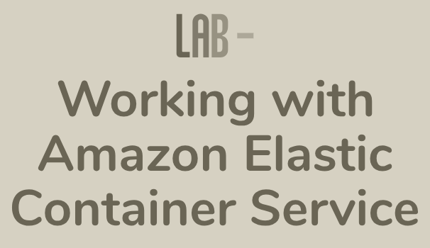

# Training Category: <a href="./self_paced_lab">self_paced_lab</a>

### AWS Skill Builder <a href="../">aws_skill_builder   </a>

### Activities:

Analytics

    <ul>
        <li>curso_spl_009: <a href="./curso_spl_009/">Lab - Analyze Big Data with Hadoop   </a></li>
        <li>curso_spl_010: <a href="./curso_spl_010/">Lab - Introduction to Amazon Redshift   </a></li>
        <li>curso_spl_011: <a href="./curso_spl_011/">Lab - Exploring the Generative Business Intelligence Features in Amazon QuickSight   </a></li>
    </ul>

AR e VR

    <ul>
    </ul>

Armazenamento

    <ul>
        <li>curso_spl_008: <a href="./curso_spl_008/">Lab - AWS Storage Gateway: S3 File Gateway Setup, Configuration, and Monitoring   </a></li>
    </ul>

AWS Geral

    <ul>
    </ul>

Banco de Dados

    <ul>
        <li>curso_spl_020: <a href="./curso_spl_020/">Lab - Introduction to Amazon Aurora   </a></li>
        <li>curso_spl_021: <a href="./curso_spl_021/">Lab - Introduction to Amazon ElastiCache   </a></li>
        <li>curso_spl_022: <a href="./curso_spl_022/">Lab - Introduction to Amazon DynamoDB   </a></li>
    </ul>

Blockchain

    <ul>
    </ul>

Computação

    <ul>
        <li>curso_spl_001: <a href="./curso_spl_001/">Lab - Introduction to Amazon EC2 Auto Scaling   </a></li>
        <li>curso_spl_002: <a href="./curso_spl_002/">Lab - Configuring Internet Access from Lambda in a VPC   </a></li>
        <li>curso_spl_019: <a href="./curso_spl_019/">Lab - Introduction to Amazon EC2   </a></li>
    </ul>

Computação de Usuário Final

    <ul>
    </ul>

Contêineres

    <ul>
        <li>curso_spl_016: <a href="./curso_spl_016/">Lab - Working with Amazon Elastic Container Service   </a></li>
    </ul>

Ferramentas do Desenvolvedor

    <ul>
    </ul>

Gerenciamento de Custos

    <ul>
    </ul>

Gerenciamento e Governança

    <ul>
        <li>curso_spl_013: <a href="./curso_spl_013/">Lab - Walkthrough of the AWS Well-Architected Tool   </a></li>
    </ul>

Infraestrutura

    <ul>
    </ul>

Integração de Aplicativos

    <ul>
        <li>curso_spl_004: <a href="./curso_spl_004/">Lab - Integrating Amazon Simple Queue Service (Amazon SQS)   </a></li>
        <li>curso_spl_018: <a href="./curso_spl_018/">Lab - Capital Guessing Game   </a></li>
    </ul>

Interação com os Clientes

    <ul>
    </ul>

Internet das Coisas (IoT)

    <ul>
    </ul>

Machine Learning

    <ul>
        <li>curso_spl_014: <a href="./curso_spl_014/">Lab - Analyze and Prepare Data with Amazon SageMaker Data Wrangler and Amazon EMR   </a></li>
        <li>curso_spl_017: <a href="./curso_spl_017/">Lab - Train a model with Amazon SageMaker   </a></li>
    </ul>

Migração e Transferência

    <ul>
    </ul>

Produtividade Empresarial

    <ul>
    </ul>

Redes e Entrega de Conteúdo

    <ul>
        <li>curso_spl_003: <a href="./curso_spl_003/">Lab - AWS Security Traffic Monitoring and Packet Analysis   </a></li>
        <li>curso_spl_005: <a href="./curso_spl_005/">Lab - Troubleshooting Website Reachability behind a Load Balancer   </a></li>
        <li>curso_spl_007: <a href="./curso_spl_007/">Lab - Resolve VPC Routing Conflicts   </a></li>
        <li>curso_spl_012: <a href="./curso_spl_012/">Lab - Troubleshooting Network Connectivity in a Peered VPC   </a></li>
    </ul>

Robótica

    <ul>
    </ul>

Satélite

    <ul>
    </ul>

Segurança, Identidade e Conformidade

    <ul>
        <li>curso_spl_006: <a href="./curso_spl_006/">Lab - Filtering and blocking web incursions with AWS WAF   </a></li>
        <li>curso_spl_015: <a href="./curso_spl_015/">Lab - Troubleshooting IAM Access Issues   </a></li>
    </ul>

Serviços de Mídia

    <ul>
    </ul>

Tecnologia de Jogos

    <ul>
    </ul>

Tecnologias Quânticas

    <ul>
    </ul>

Web e Dispositivos Móveis de Front-End

    <ul>
    </ul>

