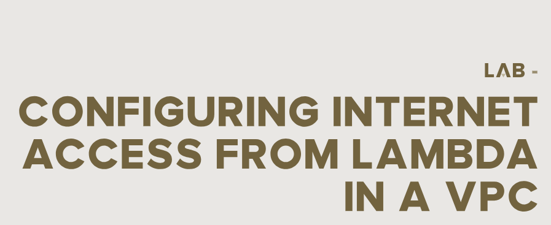
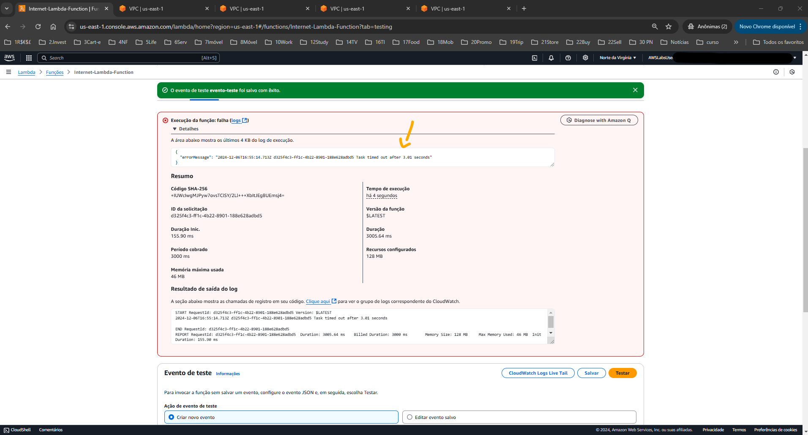
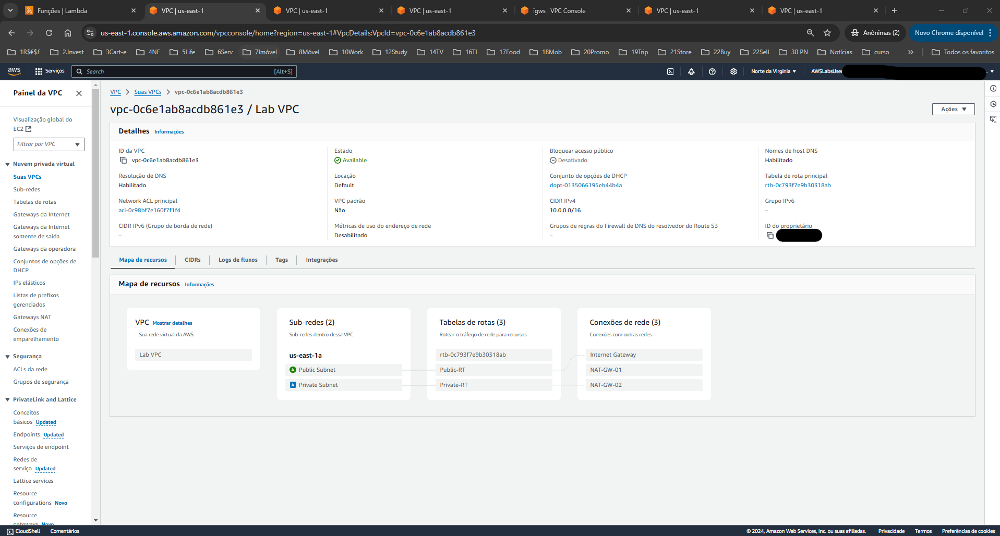
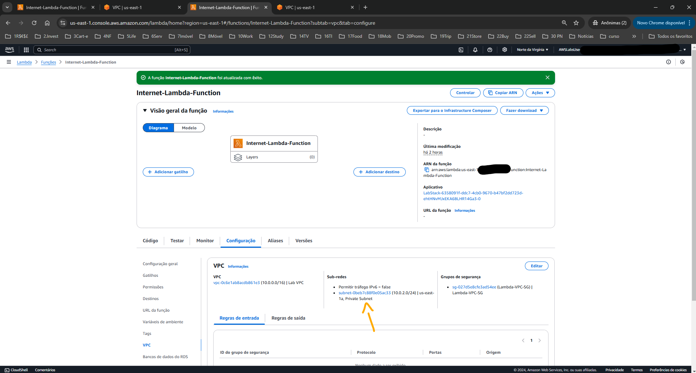
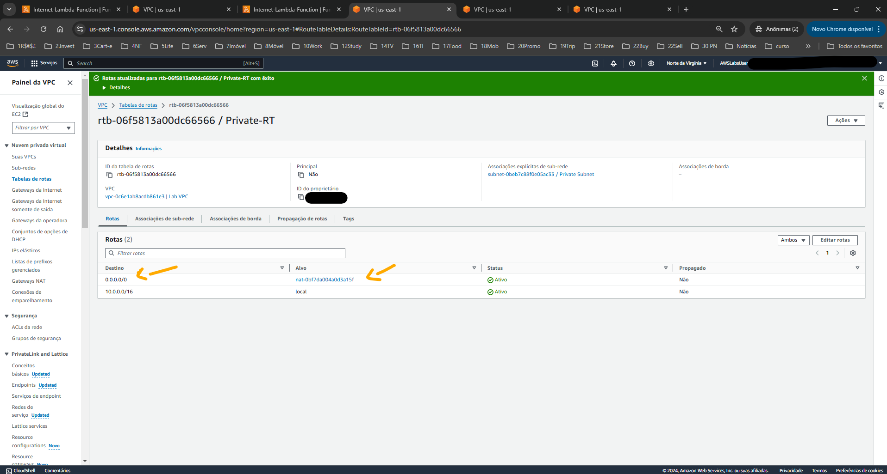
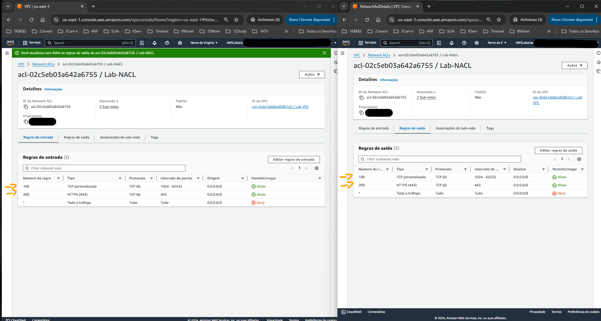
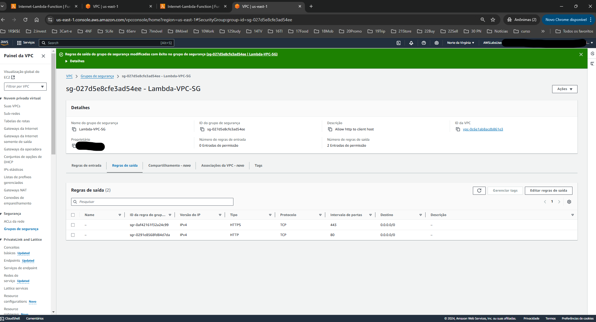
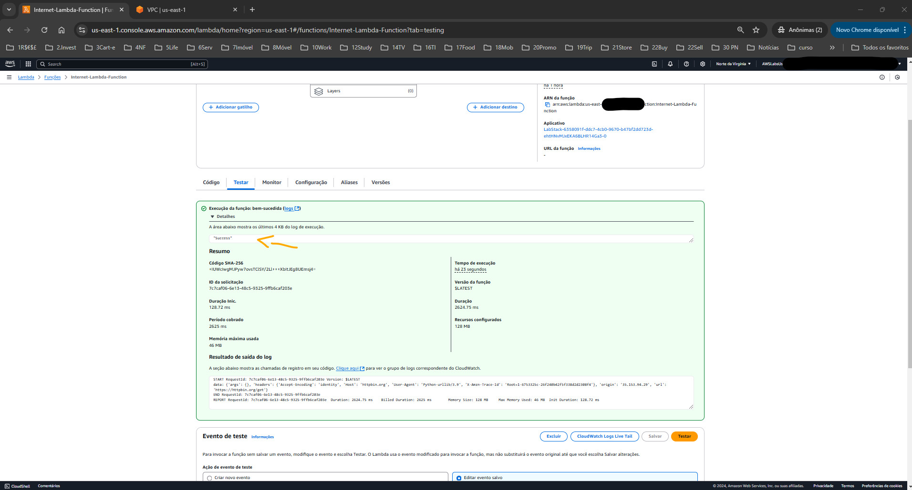

# Lab - Configuring Internet Access from Lambda in a VPC   

### AWS Skill Builder <a href="../../">aws_skill_builder   </a>
### Training Category: <a href="../../self_paced_lab">self_paced_lab</a>
### Software/Subject: aws   
### Course: <a href="./">curso_spl_002 (Lab - Configuring Internet Access from Lambda in a VPC)   </a>

#### Parceria da AWS com a Escola da Nuvem (EDN)   

---

### Theme:
- Cloud Computing

### Used Tools:
- Operating System (OS): 
  - Windows 11   
- Cloud:
  - Amazon Web Services (AWS)   
- Cloud Services:
  - Amazon Virtual Private Cloud (VPC)   
  - AWS Lambda   
  - Google Drive   
- Language:
  - HTML   
  - Markdown   
  - Python   
- Integrated Development Environment (IDE) and Text Editor:
  - Visual Studio Code (VS Code)   
- Versioning: 
  - Git   
- Repository:
  - GitHub   

---

<a name="item0"><h3>Course Strcuture:</h3></a>
1. Introduction to Amazon EC2 Auto Scaling 
1.1 <a href="#item01.1">Tarefa 1: Testando a função Lambda</a> 
1.2 <a href="#item01.2">Tarefa 2: Solução de problemas e correção do problema</a> 

---

### Objective:
O objetivo deste laboratório prático foi demonstrar o conceito de conceder acesso à Internet a uma função do **AWS Lambda** enquanto a função está anexada a uma **Amazon VPC**.

### Structure:
A estrutura do curso é formada por:
- Este arquivo de README.
- A pasta `0-aux`, pasta auxiliar com imagens utilizadas na construção desse arquivo de README. 
- A pasta `resource` com os arquivos de código utilizado.

### Development:
Este curso foi um laboratório prático realizado na plataforma **AWS Skill Builder**, cuja subscrição foi devida a uma parceria entre a **AWS** e a **Escola da Nuvem**. A infraestrutura de cloud utilizada foi fornecida através de um sandbox do **AWS Skill Builder** que possibilitava acesso ao console da **AWS**. Contudo foi necessário seguir estritamente as orientações determinadas no laboratório. Dessa maneira, a forma de interação com os recursos da cloud foram sempre através do console fornecido pelo sandbox, a não ser em casos em que o próprio laboratório instruiu para utilização de outras ferramentas de interação como **AWS CLI** ou **AWS SDK**.

O laboratório do **AWS Skill Builder** tem o foco em executar apenas o que é orientado no escopo, todos os recursos ou serviços que podem ser requisitados adicionalmente já vêm provisionados por padrão pelo laboratório. Ao iniciar o laboratório, o sandbox do **AWS Skill Builder** provisiona diversos recursos e serviços para o funcionamento através de uma ou mais pilhas do **AWS CloudFormation** de forma automática. 

O acesso ao console no sandbox do **AWS Skill Builder** é realizado por meio de uma identidade federada. O Skill Builder funciona como um provedor de identidade (IdP), autenticando o usuário e vinculando-o a uma role do **AWS IAM** provisionada automaticamente por uma das pilhas do CloudFormation. Essa role concede permissões temporárias e mínimas necessárias para a execução do laboratório, garantindo segurança e controle sobre os recursos utilizados. O laboratório, por padrão, determina a região a ser utilizada e ela não deve ser alterada, somente se o próprio laboratório indicar. As configurações não informadas no laboratório devem ser sempre mantidas como padrão que estão.

<a name="item01.1"><h4>Tarefa 1: Testando a função Lambda</h4></a>[Back to summary](#item0)

A primeira tarefa consistiu em testar a função Lambda existente para verificar se ela possuía conectividade com a internet. Essa função Lambda simplesmente fazia uma chamada (solicitação) para uma URL na internet. Se uma resposta fosse recebida, ela retornava uma mensagem `Success` junto com os dados da resposta. Caso contrário, a função expirava após 3 segundos e retorna uma mensagem `Fail`. Para realizar esse teste foi preciso criar um novo evento de teste para a função, salvá-lo, e em seguida executá-lo. O evento de teste pode ser usado para invocar a função e também passar parâmetros na invocação. No entanto, para nesta função, nenhum parâmetro de entrada era necessário, pois a função estava apenas tentando acessar uma URL na internet. O arquivo em **Python** [index.py](./resource/index.py) foi o código da função Lambda utilizado neste laboratório.

Algumas informações da função Lambda existente e o evento de teste a ser criado são listadas abaixo:
- Nome da função Lambda: `Internet-Lambda-Function`.
- Nome do evento: `evento-teste`.

A imagem 01 exibe a saída da invocação da função. Observe que a função atingiu o tempo limite após 3 segundos, que foi o valor de tempo limite configurado para a função. Isso indicava que a função não conseguia acessar a internet.

<figure>
     
    <figcaption>Imagem 01.</figcaption>
</figure>
 

<a name="item01.2"><h4>Tarefa 2: Solução de problemas e correção do problema</h4></a>[Back to summary](#item0)

Conforme visto na mensgem de erro na saída da invocação da função, o problema era devido a falta de conectividade da função com a internet já que ela tentava executar e falhava após os 3 segundos. Isso acontecia porque apesar da função estar vinculada a uma rede (VPC) e grupo de segurança, algumas configurações de recursos de rede impossibilitavam essa comunicação. A VPC mecionada já tinha sido provisionada pela pilha do CloudFormation ao iniciar o laboratório. Essa VPC era composta por duas sub-redes, sendo uma pública e outra privada, ambas na mesma AZ (`us-east-1a`). Cada sub-rede possuía seu Gateway NAT e estava associado a sua respectiva tabela de rotas. 

A tabela de rotas da sub-rede pública possuía uma rota que direcionava o tráfego da sub-rede pública para o Internet Gateway da VPC. A tabela de rotas da sub-rede privada continha uma rota que direcionava o tráfego da sub-rede privada para o NAT Gateway privado. Ambas tabelas de rotas possuía uma rota que permitia que a sub-rede se comunicasse com todo o intervalo CIDR da VPC. As duas sub-redes estavam associadas também a um único ACL para controlar o tráfego em nível de sub-rede. Essa VPC ainda tinha um security group que seria usado para vincular a função Lambda e uma outra tabela de rotas de nome aleatório que não era utilizada. Os nomes dos recursos são apresentados abaixo:
- VPC: `Lab VPC`.
- Public Route Table: `Public-RT`.
  - Rota 1: Destino: `10.0.0.0/16`; Alvo: `local` (Toda VPC).
  - Rota 2: Destino: `0.0.0.0/0`; Alvo: `Internet Gateway` (Acesso a Internet).
- NAT Gateway Público: `NAT-GW-01`.
- Private Route Table: `Private-RT`.
  - Rota 1: Destino: `10.0.0.0/16`; Alvo: `local` (Toda VPC).
  - Rota 2: Destino: `0.0.0.0/32`; Alvo: `NAT-GW-02` (NAT Gateway Privado).
- NAT Gateway Público: `NAT-GW-02`.
- NACL: `Lab-NACL`.
- Security Group: `Lambda-VPC-SG`.
- Internet Gateway: `Internet Gateway`.

A imagem 02 mostra a arquitetura desta rede.

<figure>
     
    <figcaption>Imagem 02.</figcaption>
</figure>
 

Para solucionar o problema de conectividade da função foi necessário realizar algumas ações. Primeiro foi necessário alterar na função Lambda a sub-rede de pública para privada, conforme imagem 03. Acontece que na sub-rede privada a rota 2 possuía dois problemas. O primeiro deles era o destino que estava definido como `0.0.0.0/32`, mas na verdade deveria ser `0.0.0.0/0`, pois ao utlizar o `32` como máscara de rede era indicado que todos os 32 bits do IP eram fixos. Isso significava que apenas um único endereço IP era representado, no caso o IP `0.0.0.0`. Ao consertar para `0.0.0.0/0`, a máscara de rede se torna `0`, o que significa que nenhum bit do endereço IP está fixo. Isso permitia que qualquer endereço IP entre `0.0.0.0` e `255.255.255.255` seja acessível pela rota. O outro problema com relação a rota era o alvo que indicava que o meio utilizado para o tráfego era o NAT Gateway privado, contudo esse NAT Gateway não possuía acesso a Internet. Portanto foi necessário alterá-lo para o `NAT-GW-01` que era o NAT Gateway da sub-rede pública. A imagem 04 evidência essas alterações.

<figure>
     
    <figcaption>Imagem 03.</figcaption>
</figure>
 

<figure>
     
    <figcaption>Imagem 04.</figcaption>
</figure>
 

Para ficar um pouco mais fácil o entendimento seguem algumas observações:
- Em uma rota na tabela de rotas, o destino é para onde o tráfego é direcionado e o alvo é o recurso utilizado para encaminhar o tráfego, ou seja, de onde ele está vindo. Então quando é definido `local` como alvo e o CIDR da VPC como destino significa que qualquer tráfego originado nesta rota se comunica com toda a VPC. Ou quando é definido um NAT Gateway ou Internet Gateway com alvo e destino como `0.0.0.0/0`, que compreende qualquer IP, significa que qualquer comunicação vinda dos Gateways é direcionado para todos os IPs.
- Uma sub-rede pública se torna pública quando existe uma tabela de rotas dessa sub-rede com uma rota que direciona o tráfego do Internet Gateway para qualquer IP (`0.0.0.0/0`). Dessa forma, qualquer recurso provisionado nesta sub-rede vai ser público pois irá utilizar essa rota, por isso que um NAT Gateway nessa sub-rede se torna público.

O próximo passo para garantir a comunicação da função do **AWS Lambda** com a internet foi conferir as Network ACLs (NACLs). Por padrão, elas não são habilitadas quando uma VPC é provisionada, mas como o laboratório que montou o ambiente, ela já tinha sido habilitado e configurada para negar todo o tráfego tanto nas regras de entrada como de saída. Neste laboratório, o caminho de rede do Lambda para a internet era: função Lambda > sub-rede privada > gateway NAT em sub-rede pública > gateway de internet > internet. Dessa forma, o tráfego passava pelas duas sub-redes, tanto a pública como a privada. Como ambas estavam vinculadas ao mesmo NACL, só foi necessário alterar as regras nele.

Tanto nas regras de entrada quanto de saída, a regra de negação implícita foi mantida e duas novas regras de permissão explícita foram criada. As configurações dela são mostradas abaixo:
- Número da regra: `100`.
- Tipo: `TCP personalizado`.
- Intervalo de portas: `1024-65535`.
- Destino: `0.0.0.0/0`.
- Permitir/Negar: `Permitir`.

- Número da regra: `200`.
- Tipo: `TCP personalizado`.
- Intervalo de portas: `443`.
- Destino: `0.0.0.0/0`.
- Permitir/Negar: `Permitir`.

A imagem 05 mostra as novas regras de entrada e saída criadas na NACL da VPC.

<figure>
     
    <figcaption>Imagem 05.</figcaption>
</figure>
 

Por fim, a última ação de correção na configuração da função Lambda para possibilitar o acesso a Internet foi verificar o grupo de segurança que essa função usava. Neste security group não havia nenhuma regra de entrada configurada e apenas uma regra de saída. A regra de saída configurada permitia apenas comunicação na porta `80`, ou seja `HTTP`, no protocolo `TCP` para todos os IPs. Contudo, no código da função Lambda, a requisição que tentava ser feita era para a URL `https://httpbin.org/get`, ou seja o protocolo utilizado era o `HTTPS`. Dessa forma, foi necessário criar uma segunda regra de saída na porta `443`, que é onde funciona o protocolo `HTTPS`, no protocolo `TCP` para todos os IPs (`0.0.0.0/0`). A imagem 06 evidencia a criação dessa segunda regra no grupo de segurança.

<figure>
     
    <figcaption>Imagem 06.</figcaption>
</figure>
 

Após todas as alterações, a função foi novamente invocada através do evento criado na tarefa anterior. A imagem 07 mostra o status de bem-sucedido, ou seja, a função conseguiu fazer a requisição para URL e obter um retorno, logo ela teve acesso a internet. Um ponto importante a observar que a origem da requisição partiu do IP `35.153.94.29` conforme mostrado nos logs. Esse IP é o IP do NAT Gateway público, ou seja, a função Lambda usa o NAT Gateway da sub-rede pública para acessar a internet.

<figure>
     
    <figcaption>Imagem 07.</figcaption>
</figure>
 