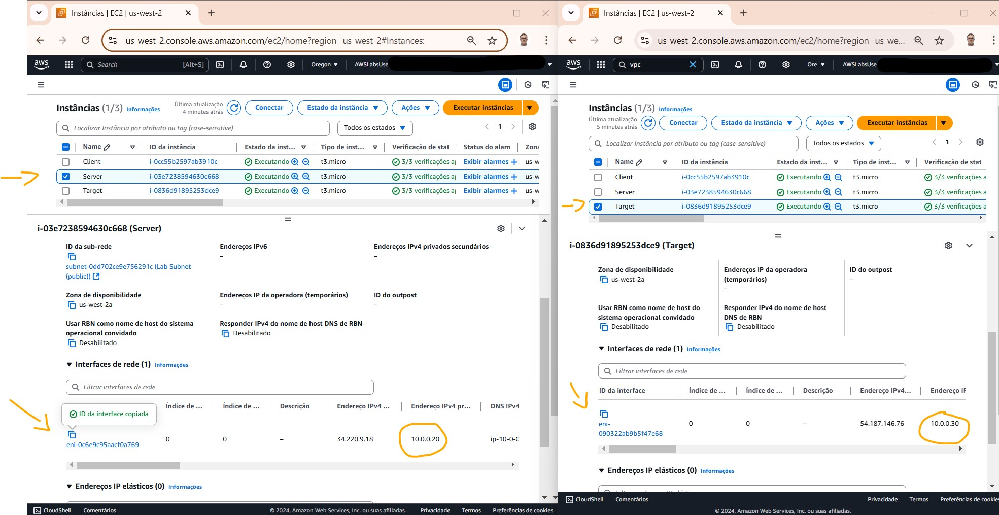
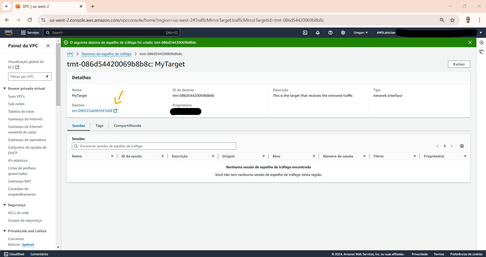

# Lab - AWS Security Traffic Monitoring and Packet Analysis   

### AWS Skill Builder <a href="../../">aws_skill_builder   </a>
### Training Category: <a href="../../self_paced_lab">self_paced_lab</a>
### Software/Subject: aws   
### Course: <a href="./">curso_spl_003 (Lab - AWS Security Traffic Monitoring and Packet Analysis)   </a>

#### Parceria da AWS com a Escola da Nuvem (EDN)   

---

### Theme:
- Cloud Computing

### Used Tools:
- Operating System (OS): 
  - Linux   
  - Windows 11   
- Linux Distribution:
  - Amazon Linux   
- Cloud:
  - Amazon Web Services (AWS)   
- Cloud Services:
  - Amazon Elastic Compute Cloud (EC2)   
  - Amazon Virtual Private Cloud (VPC)   
  - Google Drive   
- Language:
  - HTML   
  - Markdown   
- Integrated Development Environment (IDE) and Text Editor:
  - Visual Studio Code (VS Code)   
- Versioning: 
  - Git   
- Repository:
  - GitHub   

---

<a name="item0"><h3>Course Strcuture:</h3></a>
1. AWS Security Traffic Monitoring and Packet Analysis 
1.1 <a href="#item01.1">Tarefa 1: identificar as interfaces de rede elástica a serem usadas para espelhamento de tráfego</a> 
1.2 <a href="#item01.2">Tarefa 2: configurar um destino de espelhamento de tráfego</a> 
1.2 <a href="#item01.3">Tarefa 3: configurar um filtro de espelhamento de tráfego</a> 
1.2 <a href="#item01.4">Tarefa 4: configurar uma sessão de espelhamento de tráfego</a> 
1.2 <a href="#item01.5">Tarefa 5: capture e verifique o tráfego espelhado no host de destino</a> 
1.2 <a href="#item01.6">Tarefa 6: modificar o filtro de espelhamento de tráfego para capturar tráfego diferente</a> 
1.2 <a href="#item01.7">Tarefa 7: enviar o tráfego capturado para um arquivo</a> 

---

### Objective:
O objetivo deste laboratório prático foi utilizar o espelhamento de tráfego do **Amazon VPC** para capturar o tráfego de interesse entre duas instâncias do **Amazon EC2** (cliente e servidor) para fins de monitoramento. O espelhamento de tráfego é um recurso da VPC que permite espelhar o tráfego, ou seja, capturar e exibir esse mesmo tráfego em outros dispositivos como outras instâncias EC2 para monitorá-lo.

### Structure:
A estrutura do curso é formada por:
- Este arquivo de README.
- A pasta `0-aux`, pasta auxiliar com imagens utilizadas na construção desse arquivo de README. 

### Development:
Este curso foi um laboratório prático realizado na plataforma **AWS Skill Builder**, cuja subscrição foi devida a uma parceria entre a **AWS** e a **Escola da Nuvem**. A infraestrutura de cloud utilizada foi fornecida através de um sandbox do **AWS Skill Builder** que possibilitava acesso ao console da **AWS**. Contudo foi necessário seguir estritamente as orientações determinadas no laboratório. Dessa maneira, a forma de interação com os recursos da cloud foram sempre através do console fornecido pelo sandbox, a não ser em casos em que o próprio laboratório instruiu para utilização de outras ferramentas de interação como **AWS CLI** ou **AWS SDK**.

O laboratório do **AWS Skill Builder** tem o foco em executar apenas o que é orientado no escopo, todos os recursos ou serviços que podem ser requisitados adicionalmente já vêm provisionados por padrão pelo laboratório. Ao iniciar o laboratório, o sandbox do **AWS Skill Builder** provisiona diversos recursos e serviços para o funcionamento através de uma ou mais pilhas do **AWS CloudFormation** de forma automática. 

O acesso ao console no sandbox do **AWS Skill Builder** é realizado por meio de uma identidade federada. O Skill Builder funciona como um provedor de identidade (IdP), autenticando o usuário e vinculando-o a uma role do **AWS IAM** provisionada automaticamente por uma das pilhas do CloudFormation. Essa role concede permissões temporárias e mínimas necessárias para a execução do laboratório, garantindo segurança e controle sobre os recursos utilizados. O laboratório, por padrão, determina a região a ser utilizada e ela não deve ser alterada, somente se o próprio laboratório indicar. As configurações não informadas no laboratório devem ser sempre mantidas como padrão que estão.

<a name="item01.1"><h4>Tarefa 1: identificar as interfaces de rede elástica a serem usadas para espelhamento de tráfego</h4></a>[Back to summary](#item0)

Ao iniciar o laboratório, a arquitetura inicial foi provisionada pelas pilhas do **AWS CloudFormation**. Essa arquitetura era composta pelos seguintes elementos:
- Uma VPC com sub-rede pública.
- Instância 1: Uma instância do **Amazon EC2** atuando como um cliente, ou seja, fazia as requisições no servidor. Essas requisições que seriam filtradas e espelhadas em outra instância, chamada de target (alvo). A instância 1 tinha o endereço IP `10.0.0.10`.
- Instância 2: Uma instância do EC2 atuando como um servidor, ou seja, que recebia o tráfego da instância cliente. Esse tráfego seria filtrado e espelhado na instância target (alvo). A instância 2 tinha o endereço IP `10.0.0.20`.
- Instância 3: Uma instância do EC2 atuando como target (alvo) do espelhamento, ou seja, que recebia o tráfego filtrado. Essa instância tinha um endereço IP `10.0.0.30`.
- Cada instância tinha um grupo de segurança que permitia o tráfego necessário para ela com base no cenário do laboratório.

Com relação ao espelhamento de tráfego, este é um recurso que permite replicar o tráfego de rede de instâncias EC2 para dispositivos de segurança e monitoramento. Isso significa que é possível criar uma cópia exata do tráfego que entra e sai das máquinas virtuais e encaminhá-lo para um destino específico, como uma instância de análise de segurança ou um sistema de monitoramento de rede. Neste laboratório, a instância target era quem iria receber o tráfego espelhado. Qualquer instância do **Amazon EC2** poderia ser provisionada para este fim.

Alguns conceitos importantes sobre espelhamento de tráfego são apresentados abaixo:
- Origem: é a interface de rede elástica (ENI) da instância do Servidor.
- Destino: é a interface de rede elástica (ENI) da instância de Destino.
- Filtro: é possível configurar várias regras de filtro para definir qual tráfego de entrada/saída deseja capturar. Neste laboratório, os tráfegos capturados foram ICMP e HTTP.
- Sessão: é a sessão que descreve uma origem, um destino e um filtro para capturar o tráfego.

Feito essas considerações, a primeira tarefa consistiu em identificar as interfaces de rede elásticas (ENI) a serem usadas para o espelhamento do tráfego. A ENI de origem seria do servidor (instância 2) cujo Id era `eni-0c6e9c95aacf0a769`. Já a ENI de destino era da instância target (alvo), cujo Id era `eni-090322ab9b5f47e68`. A imagem 01 mostra os Ids da ENI dessas duas instâncias.

<figure>
     
    <figcaption>Imagem 01.</figcaption>
</figure>
 

<a name="item01.2"><h4>Tarefa 2: configurar um destino de espelhamento de tráfego</h4></a>[Back to summary](#item0)

Com os Ids das interfaces de rede elástica obtidos, o próximo passo foi configurar o espelhamento de tráfego no console da **Amazon VPC**, pois o espelhamento é um recurso deste serviço. O primeiro item configurado foi o destino, com as seguintes especificações:
- Tag de nome (opcional): `MyTarget`.
- Descrição (opcional): `This is the target that receives the mirrored traffic`.
- Tipo de destino: `Interface de rede`.
- Destino: foi selecionado o ID da interface que corresponde à ENI de destino, no caso da instância target (alvo), `eni-090322ab9b5f47e68`.

A imagem 02 mostra a configuração do Id da ENI da insância target como um destino que seria usado no espelhamento de tráfego.

<figure>
     
    <figcaption>Imagem 02.</figcaption>
</figure>
 

<a name="item01.3"><h4>Tarefa 3: configurar um filtro de espelhamento de tráfego</h4></a>[Back to summary](#item0)

Nesta tarefa, a proposta foi criar um filtro do espelhamento de tráfego para selecionar qual tráfego seria copiado e espelhado no destino do espelhamento. Em um filtro de espelhamento de tráfego, podem ser configuradas regras de Entrada e/ou Saída para definir qual tráfego (protocolo, portas de origem/destino e endereços IP de origem/destino) deve ser capturado ou ignorado na sessão de espelhamento de tráfego. Nesse filtro, foi configurado uma regra para capturar qualquer tráfego **ICMP** de entrada para a instância do Servidor que tinha o IP `10.0.0.20` do intervalo de IP da sub-rede `10.0.0.0/24`. As definições ficaram da seguinte forma:
- Tag de nome (opcional): `MyFilter`.
- Descrição (opcional): `Inbound traffic from subnet to server`.
- Seção Regras de entrada (opcional): uma regra foi adicionada da seguinte forma:
    - Número: `100`.
    - Ação da regra: `Aceitar`.
    - Protocolo: `ICMP(1)`.
    - Bloco CIDR de origem: `10.0.0.0/24`.
    - Bloco CIDR de destino: `10.0.0.20/32` (IP Instância Servidor).
    - Descrição: `Inbound ICMP from subnet to server`.

A imagem 03 ilustra a criação do filtro do espelhamento de tráfego.

<figure>
     
    <figcaption>Imagem 03.</figcaption>
</figure>
 

<a name="item01.4"><h4>Tarefa 4: configurar uma sessão de espelhamento de tráfego</h4></a>[Back to summary](#item0)

O próximo passo foi configurar uma sessão de espelhamento de tráfego. As sessões de espelhamento de tráfego enviam pacotes espelhados da origem para um destino de modo que seja possível monitorar e analisar o tráfego. Neste caso, a sessão foi configurada da seguinte forma:
- Tag de nome (opcional): `ServerTraffic`.
- Descrição (opcional): `Mirroring server traffic`.
- Origem do espelho: foi selecionado o ID que corresponde à Source ENI (ENI de origem) que era da instância servidor, `eni-0c6e9c95aacf0a769`.
- Destino do espelho: foi selecionado `MyTarget`, que era o destino que já tinha sido criado anteriormente.
- Seção Configurações adicionais:
    - Número de sessão: `1`.
    - VNI (opcional): `100`.
    - Filtro: foi selecionado `MyFilter`, que já tinha sido criado anteriormente.

A imagem 04 evidencia a sessão criada para o espelhamento de tráfego, onde foi indicado o destino e o filtro, criado nas tarefas anteriores, além da origem.

<figure>
     
    <figcaption>Imagem 04.</figcaption>
</figure>
 

<a name="item01.5"><h4>Tarefa 5: capture e verifique o tráfego espelhado no host de destino</h4></a>[Back to summary](#item0)

Com a sessão construída, agora foi o momento de verificar o espelhamento do tráfego do servidor na instância target (alvo). Para isso foi necessário acessar remotamente a instância cliente para fazer as requisições para instância servidor, e acessar remotamente também a instância target, onde o tráfego seria espelhado. Para o acesso remoto foi utilizado o recurso *Session Manager* do **AWS System Manager (SSM)** no console, abrindo cada sessão em uma aba diferente do navegador da máquina física **Windows**.

Como as duas instâncias eram sistemas operacionais **Linux**, um shell foi disponibilizado para cada instância. Na instância de destino (target) foi utilizado o utilitário **Tcpdump** para capturar o tráfego. **Tcpdump** é um utilitário de linha de comando que permite capturar e analisar o tráfego de rede que se move por um sistema. O comando `sudo tcpdump -nni eth0 -vvv udp dst port 4789` foi executado nessa instância para capturar o tráfego persistente enviado pela porta `UDP 4789`. Essa é a porta que o Espelhamento de tráfego do VPC usa para encapsular os pacotes capturados, ou seja, o espelhamento de tráfego filtra o tráfego determinado na instância servidor e espelha para instância target utilizando essa porta (`UDP 4789`). Um ponto importante é que o grupo de segurança da instância target deveria ter uma regra de entrada liberado esta porta apenas para o grupo de segurança ou IP da instância servidor.

A imagem 05 mostra o output do comando executado na instância destino (target), ou seja, ela já estava ouvindo tráfego espelhado, porém nenhum tráfego ainda tinha gerado. Quando o tráfego determinado no filtro do espelhamento fosse gerado devido a comunicação da instância cliente com a instância servidor, os pacotes do tráfego seriam encpasulados e enviados para instância de destino (target) utilizando a porta `UDP 4789`. Ao receber os pacotes, o **Tcpdump** se encerregaria de capturar esse tráfego e exibir no shell como output do comando.

<figure>
     
    <figcaption>Imagem 05.</figcaption>
</figure>
 

Sendo assim, era preciso começar a gerar tráfego que correspondia ao filtro de espelhamento que foi configurado anteriormente. Isso foi feito na outra sessão aberta no **AWS SSM** com a instância cliente em outra aba do navegador. Nela, o comando `ping 10.0.0.20 -c 1` foi executado. Esse comando enviava um único pacote ICMP do Cliente para o Servidor, ou seja, gerava o tráfego definido no filtro. O grupo de segurança da instância servidor já possuía uma regra de entrada permitindo comunicação ICMP, que é o protocolo utilizado pelo **Ping**, vinda do grupo de segurança ou IP da instância cliente. A imagem 06 exibe o output desse comando, comprovando que o ping foi realizado.

<figure>
     
    <figcaption>Imagem 06.</figcaption>
</figure>
 

De volta para a outra sessão do SSM na instância target na outra aba do navegador, o **Tcpdump** estava em execução e capturou o tráfego enviado da instância cliente para a instância servidor que foi espelhado para instância target. A imagem 07 evidencia essa captura. As duas primeiras linhas da saída do comando contêm informações sobre o tráfego capturado. Mostra que o tráfego capturado foi enviado da origem do espelhamento de `10.0.0.20` (servidor) para o destino do espelhamento de `10.0.0.30` (destino) usando a porta `4789`. Também mostra o ID de VNI `100` que foi configurado na sessão de espelhamento de tráfego. As duas segundas linhas mostram o pacote ICMP que foi enviado de `10.0.0.10` (Cliente) para `10.0.0.20` (Servidor) usando a solicitação de eco ICMP.

<figure>
     
    <figcaption>Imagem 07.</figcaption>
</figure>
 

<a name="item01.6"><h4>Tarefa 6: modificar o filtro de espelhamento de tráfego para capturar tráfego diferente</h4></a>[Back to summary](#item0)

O próximo passo foi alterar o filtro do espelhamento de tráfego, para filtrar um tráfego diferente. Neste caso, o tráfego a ser filtrado seria referente ao protocolo **HTTP**, que utiliza a porta `80`. Mas antes, foi executado no shell da instância cliente o comando `curl http://10.0.0.20` para gerar uma requisição do cliente para o servidor no protocolo **HTTP** para mostrar no shell da instância target que o tráfego não era espelhado, pois o filtro do espelhamento não possuía uma regra que filtrava tráfego do protocolo **HTTP**. A imagem 08 mostra os dois shells lado a lado, evidenciando que o tráfego foi gerado, porém ele não foi espelhado.

<figure>
     
    <figcaption>Imagem 08.</figcaption>
</figure>
 

Comprovado que esse tráfego ainda não era espelhado, o filtro criado anteriormente cujo nome era `MyFilter` foi modificado, adicionando uma outra regra com as seguintes informações:
- Número: `200`.
- Descrição: `Inbound HTTP from subnet to server`.
- Ação da regra: `Aceitar`.
- Protocolo: `TCP(6)`.
- Intervalo de portas de destino (opcional): `80`.
- Bloco CIDR de origem: `10.0.0.0/24`.
- Bloco CIDR de destino: `10.0.0.20/32`.

A imagem 09 exibe essa segunda regra criada no filtro do espelhamento de tráfego, permitindo espelhamento do tráfego do protocolo **HTTP**.

<figure>
     
    <figcaption>Imagem 09.</figcaption>
</figure>
 

Após isso, foi aberto novamente na aba que possuía a sessão do **AWS SSM** na instância cliente e executado novamente o comando `curl http://10.0.0.20` para gerar uma requisição do cliente para o servidor no protocolo **HTTP**. Em seguida, a outra aba com a sessão SSM na instância de destino (target) foi aberta. Nela, o **Tcpdump** estava em execução e já tinha capturado o tráfego. A imagem 10 mostra os shells das sessões SSM em cada instância comprovando que a requisição foi feita e que agora, devido a regra adicionada no filtro do espelhamento, o tráfego foi espelhado.

<figure>
     
    <figcaption>Imagem 10.</figcaption>
</figure>
 

<a name="item01.7"><h4>Tarefa 7: enviar o tráfego capturado para um arquivo</h4></a>[Back to summary](#item0)

Nesta última tarefa deste laboratório, o objetivo consistiu em ao invés de visualizar no shell o tráfego espelhado na instância target com o utilitário **Tcpdump**, o **Tcpdump** foi utilizado para capturar o tráfego espelhado e enviar para um arquivo. Isso permitia examinar o arquivo posteriormente e fazer uma análise detalhada usando diferentes ferramentas. Os pacotes eram salvos em um arquivo que possuía o formato `pcap`. Esse é um formato padrão usado por ferramentas de monitoramento de rede e sniffers.

Para isso, o **Tcpdump** foi encerrado no shell da instância target com Ctrl + C e então o comando `sudo tcpdump -nni eth0 -vvv udp dst port 4789 -w capture.pcap` foi executado, gravando as informações no arquivo `capture.pcap` dentro do diretório do usuário do SSM (`/home/ssm-user`). A imagem 11 evidencia que o **Tcpdump** já estava escutando as requisições.

<figure>
     
    <figcaption>Imagem 11.</figcaption>
</figure>
 

Agora foi preciso gerar novamente as requisições do cliente para o servidor, executando o comando `ping 10.0.0.20  -c 1` na instância cliente. Perceba que tanto o **Ping** como o **Curl** são sempre executados na instância cliente indicando que a instância que a solicitação que deve ser enviada é para instância servidor, cujo IP era `10.0.0.20`. Ao executar a requisição, todo processo já era realizado, o filtro do espelhamento atuava, o tráfego era espelhado para instância target e o **Tcpdump** capturava o tráfego e armazenava no arquivo, já que ele já estava em execução na instância target.

Para acessar o arquivo e visualizar os dados armazenados, primeiro era preciso encerrar o comando **Tcpdump** que estava em execução, e então executar o comando `tcpdump -r capture.pcap` na instância de destino (target), conforme mostrado na imagem 12.

<figure>
     
    <figcaption>Imagem 12.</figcaption>
</figure>
 

Com o arquivo gerado, era possível utilizar uma ferramenta como o **Wireshark** para realizar uma análise detalhada de pacotes. Para encerrar o **Tcpdump** foi executado o atalho Ctrl + C. As duas sessões do *Session Manager* do **AWS SSM** foram encerradas e o laboratório foi finalizado com sucesso.
