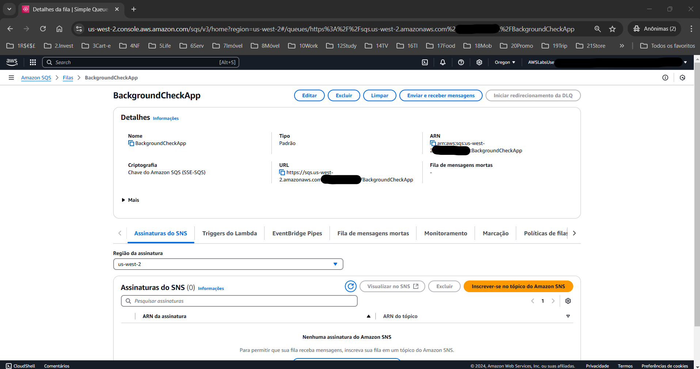
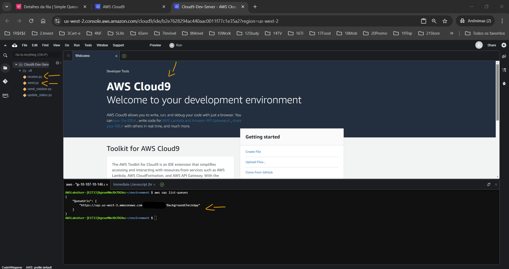
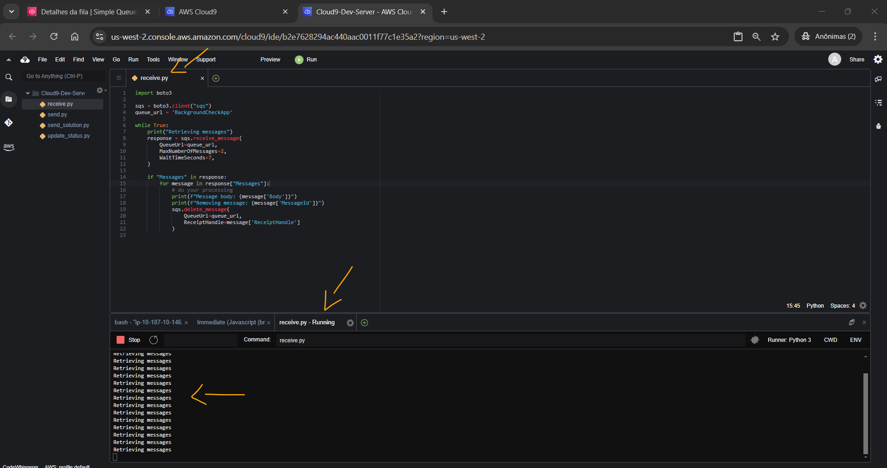
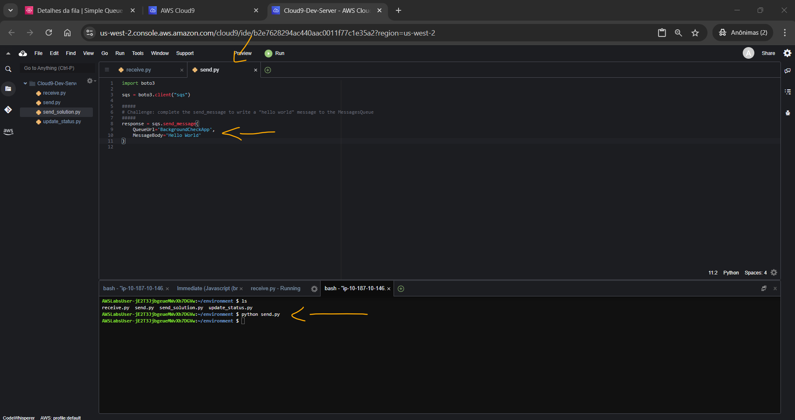
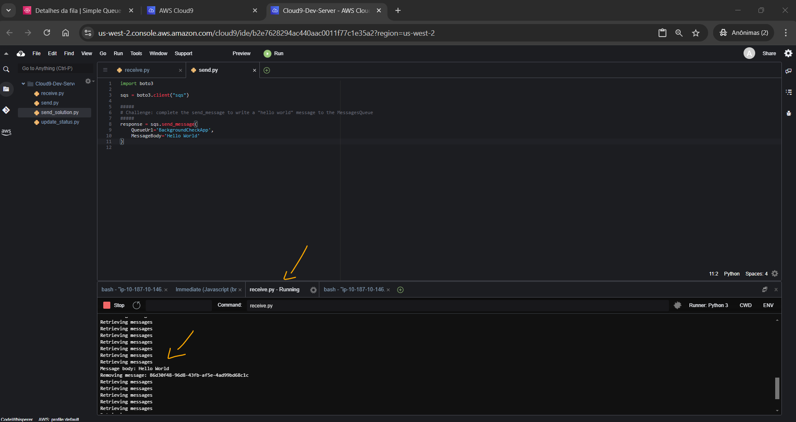
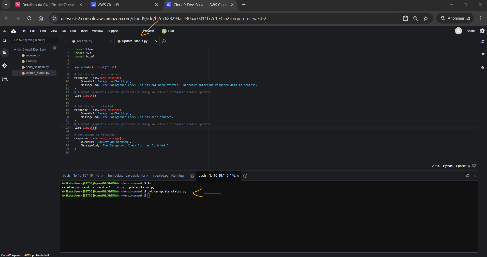
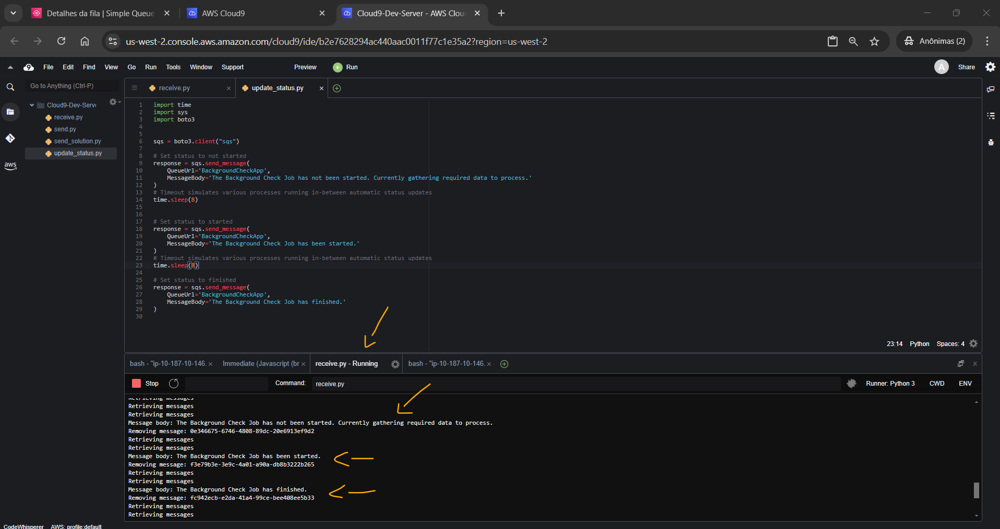

# Lab - Integrating Amazon Simple Queue Service (Amazon SQS)   

### AWS Skill Builder <a href="../../">aws_skill_builder   </a>
### Training Category: <a href="../../self_paced_lab">self_paced_lab</a>
### Software/Subject: aws   
### Course: <a href="./">curso_spl_004 (Lab - Integrating Amazon Simple Queue Service (Amazon SQS))   </a>

#### Parceria da AWS com a Escola da Nuvem (EDN)   

---

### Theme:
- Cloud Computing

### Used Tools:
- Operating System (OS): 
  - Windows 11   
- Cloud:
  - Amazon Web Services (AWS)   
- Cloud Services:
  - Amazon Simple Queue Service (SQS)   
  - AWS Cloud9   
  - AWS Command Line Interface (CLI)   
  - AWS Software Development Kit (SDK) - Boto3   
  - Google Drive   
- Language:
  - HTML   
  - Markdown   
  - Python   
- Integrated Development Environment (IDE) and Text Editor:
  - Visual Studio Code (VS Code)   
- Versioning: 
  - Git   
- Repository:
  - GitHub   

---

<a name="item0"><h3>Course Strcuture:</h3></a>
1. Lab - Integrating Amazon Simple Queue Service (Amazon SQS) 
1.1 <a href="#item01.1">Tarefa 1: Revise a fila SQS e o script receive.py</a> 
1.2 <a href="#item01.2">Tarefa 2: Atualizar o script send.py</a> 
1.3 <a href="#item01.3">Tarefa 3: Teste o script send.py</a> 

---

### Objective:
O objetivo deste laboratório prático foi demonstrar a utilização do **Amazon Simple Queue Service (SQS)** com dois scripts **Python**. O primeiro script **Python** (`receive.py`) era o consumidor e foi projetado para ouvir e receber mensagens continuamente de uma fila SQS. Este script demonstrava o processo de conexão à fila e recuperação de mensagens em tempo real. O segundo script **Python** (`send.py`) era o produtor e como desafio foi necessário realizar algumas correções no código que ele utilizaria para enviar uma mensagem para a fila SQS.

### Structure:
A estrutura do curso é formada por:
- Este arquivo de README.
- A pasta `0-aux`, pasta auxiliar com imagens utilizadas na construção desse arquivo de README. 
- A pasta `resource` com os arquivos de código utilizados.

### Development:
Este curso foi um laboratório prático realizado na plataforma **AWS Skill Builder**, cuja subscrição foi devida a uma parceria entre a **AWS** e a **Escola da Nuvem**. A infraestrutura de cloud utilizada foi fornecida através de um sandbox do **AWS Skill Builder** que possibilitava acesso ao console da **AWS**. Contudo foi necessário seguir estritamente as orientações determinadas no laboratório. Dessa maneira, a forma de interação com os recursos da cloud foram sempre através do console fornecido pelo sandbox, a não ser em casos em que o próprio laboratório instruiu para utilização de outras ferramentas de interação como **AWS CLI** ou **AWS SDK**.

O laboratório do **AWS Skill Builder** tem o foco em executar apenas o que é orientado no escopo, todos os recursos ou serviços que podem ser requisitados adicionalmente já vêm provisionados por padrão pelo laboratório. Ao iniciar o laboratório, o sandbox do **AWS Skill Builder** provisiona diversos recursos e serviços para o funcionamento através de uma ou mais pilhas do **AWS CloudFormation** de forma automática. 

O acesso ao console no sandbox do **AWS Skill Builder** é realizado por meio de uma identidade federada. O Skill Builder funciona como um provedor de identidade (IdP), autenticando o usuário e vinculando-o a uma role do **AWS IAM** provisionada automaticamente por uma das pilhas do CloudFormation. Essa role concede permissões temporárias e mínimas necessárias para a execução do laboratório, garantindo segurança e controle sobre os recursos utilizados. O laboratório, por padrão, determina a região a ser utilizada e ela não deve ser alterada, somente se o próprio laboratório indicar. As configurações não informadas no laboratório devem ser sempre mantidas como padrão que estão.

<a name="item01.1"><h4>Tarefa 1: Revise a fila SQS e o script receive.py</h4></a>[Back to summary](#item0)

O **Amazon SQS** é um serviço de enfileiramento de mensagens totalmente gerenciado que ajuda a desacoplar componentes dentro de um aplicativo de nuvem e foi projetado para fornecer um meio de comunicação confiável e escalável. Ele oferece dois tipos de filas de mensagens: filas padrão e filas primeiro a entrar, primeiro a sair (FIFO). As filas padrão oferecem rendimento máximo, ordenação de melhor esforço e entrega pelo menos uma vez. As filas FIFO são projetadas para garantir que as mensagens sejam processadas exatamente uma vez, na ordem exata em que são enviadas.

O **Amazon SQS** funciona da seguinte maneira:
- Produtor: Um componente de um aplicativo distribuído envia uma mensagem para uma fila no **Amazon SQS** (uma ação conhecida como enqueue). Essa mensagem contém todas as informações necessárias para que o consumidor da mensagem execute uma tarefa.
- Consumidor: A mensagem aguarda na fila até que um consumidor (outro componente do aplicativo distribuído) recupere e processe a mensagem (uma ação conhecida como dequeue). O consumidor processa a mensagem e a exclui da fila para evitar que ela seja recebida e processada novamente.

Esta primeira tarefa foi sub-dividida nas cinco etapas seguintes:
- Tarefa 1.1: Revisar a fila SQS
- Tarefa 1.2: Conectar ao ambiente AWS Cloud9
- Tarefa 1.3: Revise os detalhes da fila SQS usando a AWS CLI
- Tarefa 1.4: Revise o script receive.py
- Tarefa 1.5: Execute o script receive.py

Para revisar a fila SQS foi utilizado dois métodos diferentes. O primeiro foi através do **AWS Management Console** acessando o serviço **Amazon SQS** e selecionando a fila `BackgroundCheckApp`. A imagem 01 exibe a fila existente provisionada pelo CloudFormation ao iniciar o laboratório. Observe que o tipo da fila estava definido como padrão e que a URL da fila estava definido como `https://sqs.us-west-2.amazonaws.com/ACCOUNT-ID/BackgroundCheckApp`.

<figure>
     
    <figcaption>Imagem 01.</figcaption>
</figure>
 

O segundo método utilizado para verificar os detalhes da fila foi através do **AWS Command Line Interface (CLI)**. Para utilizar a **AWS CLI** neste laboratório foi utilizado a Integrated Development Environment (IDE) da **AWS** que é o **AWS Cloud9**. O **AWS Cloud9** é um ambiente de desenvolvimento integrado (IDE) baseado em nuvem que pode ser utilizado para escrever, executar e depurar código com apenas um navegador. Ele inclui um editor de código, depurador e terminal. O **AWS Cloud9** vem pré-empacotado com ferramentas essenciais para linguagens de programação populares, incluindo **JavaScript**, **Python**, **PHP** e muito mais. Não é preciso instalar arquivos ou configurar a máquina de desenvolvimento para iniciar novos projetos. A **AWS CLI** pode ser utilizada no terminal do **AWS Cloud9**. Além disso, o Cloud9 foi utilizado para concluir um dos códigos em **Python**

Ao iniciar o laboratório, o link da URL para o Cloud9 foi exibida para ser copiado e aberto no navegador da máquina física **Windows**. Um ponto importante é que cada espaço de trabalho do **AWS Cloud9** recebe automaticamente credenciais do **AWS Identity and Access Management (IAM)**. Essas credenciais fornecem ao espaço de trabalho acesso limitado (com base na sua função federada) a alguns serviços da **AWS** na conta. Elas são conhecidas como credenciais temporárias gerenciadas pela **AWS**.

Com o Cloud9 acessado, qualquer comando da **AWS CLI** poderia ser utilizado no terminal. A entidade que estaria executado esses comandos era o próprio Cloud9 que possuía credenciais temporárias com permissões específicas. Caso, algum comando não fosse executado com sucesso, provavelmente seria porque as credenciais do Cloud9 não possuía a permissão necessária. No terminal, o comando `aws sqs list-queues` foi executado para visualizar os detalhes da fila SQS, conforme imagem 02. Note que a fila `BackgroundCheckApp` e o URL da fila correspondem ao que foi observado no console do **Amazon SQS**.

<figure>
     
    <figcaption>Imagem 02.</figcaption>
</figure>
 

A próxima etapa foi verificar o script **Python** [receive.py](./resource/) que era o consumidor da fila SQS. Este script é normalmente usado em aplicações worker que precisam processar tarefas ou trabalhos de uma fila. As tarefas ou trabalhos são representados por mensagens em uma fila SQS. Os dois arquivos de scripts já existiam no **AWS Cloud9** e eram utilizados para interagir com o **Amazon SQS** usando o **Boto3**. O **Boto3** é o **AWS SDK** para **Python**. O script consumidor basicamente fazia as seguintes ações:
- Ele estabelecia uma conexão com o **Amazon SQS** usando a função `boto3.client()`.
- Ele definia a URL da fila como `BackgroundCheckApp`.
- Ele entrava em um loop infinito, onde tentava continuamente recuperar mensagens da fila SQS especificada.
- A função `sqs.receive_message()` era chamada para receber até duas mensagens por vez da fila e aguarda até 7 segundos para que uma mensagem ficasse disponível.
- Se a resposta tivesse alguma mensagem, ela iterava sobre cada mensagem.
- Para cada mensagem, ele imprimia o corpo da mensagem e o ID da mensagem.
- Após processar cada mensagem, ele excluía a mensagem da fila usando a função `sqs.delete_message()`. Essa função impedia que a mesma mensagem fosse lida e processada novamente.

Com relação ao valor da URL Queue no script, foi passado apenas o nome da fila do **Amazon SQS** e não a URL inteira, pois o **AWS SDK** para **Python** (**Boto3**) foi projetado para gerenciar automaticamente os detalhes da conexão com os serviços da **AWS**, utilizando as credenciais e as definições de configuração da máquina para determinar o endpoint correto a ser usado. Neste laboratório, a máquina referida seria a utilizada pelo **AWS Cloud9**, cuja região e o Id da conta **AWS** já eram definidos automaticamente. A URL completa é composta das seguintes partes:
- `https://sqs.us-west-2.amazonaws.com/`: é o ponto final do serviço SQS na região `us-west-2` (Ohio).
- `ACCOUNT_ID`: é o ID da conta da AWS.
- `BackgroundCheckApp`: é o nome da fila.

A última etapa desta tarefa foi a execução do script consumidor (`receive.py`). Isso foi realizado na IDE **AWS Cloud9**, onde primeiro foi executado o comando `cd ~/environment` para ir até a pasta dos arquivos, caso tivesse em outra pasta, e depois o script foi executado com o comando `python receive.py`. A imagem 03 mostra o output do script evidenciando que ele estava escutando a fila SQS, porém como nenhuma mensagem havia sido gerada, nenhuma mensagem foi visualizada.

<figure>
     
    <figcaption>Imagem 03.</figcaption>
</figure>
 

<a name="item01.2"><h4>Tarefa 2: Atualizar o script send.py</h4></a>[Back to summary](#item0)

Com o arquivo de script consumidor funcionando, nesta tarefa o objetivo consistiu em concluir o arquivo de script produtor, [send.py](./resource/), e executá-lo para produzir as mensagens para a fila do SQS `BackgroundCheckApp`. Duas alterações foram feitas neste arquivo, a primeira delas foi alterar o parâmetro `QueueUrl` para o nome da fila correta na função `send_message` para que ela tivesse como alvo a fila SQS certa. O parâmetro `MessageBody` também foi modificado na mesma função `send_message` para `Hello World`. Esse parâmetro é a mensagem que é enviada e lida pela fila SQS.

<a name="item01.3"><h4>Tarefa 3: Teste o script send.py</h4></a>[Back to summary](#item0)

Com o script produtor corrigido, chegou o momento de testá-lo e verificar se a mensagem era produzida na fila SQS e lida pelo script consumidor. O script consumidor estava em execução constante no terminal do **AWS Cloud9**, só esperando chegar a mensagem para ser lida. Dessa forma, uma nova janela do terminal foi aberta para executar o script produtor. Antes de executar o arquivo era necessário confirmar se estava no diretório correto do arquivo, caso não estivesse, o diretório era alterado com o comando `cd ~/environment`. Em seguida, o arquivo era executado com o comando `python send.py`. A imagem 04 exibe o comando, comprovando que a mensagem foi produzida. Enquanto a imagem 05 mostra na outra janela do terminal, onde o script consumidor estava em execução, o recebimento da mensagem, leitura e exclusão dela da fila SQS.

<figure>
     
    <figcaption>Imagem 04.</figcaption>
</figure>
 

<figure>
     
    <figcaption>Imagem 05.</figcaption>
</figure>
 

Como parte adicional, um terceiro arquivo de script **Python** ([update_status.py](./resource/)) foi executado. Este arquivo também era um produtor, porém o código era diferente. O intuito era mostrar como o SQS poderia ser usado em outro caso de uso, como verificações de status de um trabalho. O script utilizava o **Amazon SQS** para enviar atualizações de status sobre um trabalho de verificação de antecedentes. Primeiro, ele enviava uma mensagem indicando que o trabalho ainda não foi iniciado e que estava reunindo os dados necessários para processamento. Em seguida, ele aguardava 8 segundos (simulando vários processos em execução entre atualizações automáticas de status) antes de enviar uma mensagem para a fila informando que o trabalho foi iniciado. Após outra pausa de 8 segundos, ele enviava uma mensagem final para a fila indicando que o trabalho foi concluído. Todas as mensagens eram enviadas para a fila chamada `BackgroundCheckApp`. O arquivo foi executado com o comando `cd ~/environment; python update_status.py`, porém antes alterando para a pasta que o arquivo estava armazenada. A imagem 06 mostra o output do comando do arquivo produtor, enquanto a imagem 07 exibe o output do comando consumidor que estava em execução na outra janela. Perceba que as mensagens são recebidas no consumidor, em seguida são lidas e apagadas da fila SQS. 

<figure>
     
    <figcaption>Imagem 06.</figcaption>
</figure>
 

<figure>
     
    <figcaption>Imagem 07.</figcaption>
</figure>
 

Durante as execuções dos arquivos no **AWS Cloud9**, observe que uma janela do terminal foi utilizada com o arquivo consumidor que ficava em constante execução até ser finalizada com um comando. Enquanto uma outra janela do terminal era usada para executar os dois arquivos produtor. Dessa forma, para visualizar o envio e recebimento das mensagens foi necessário alterar as janelas do terminal para ver os outputs de cada arquivo executado.