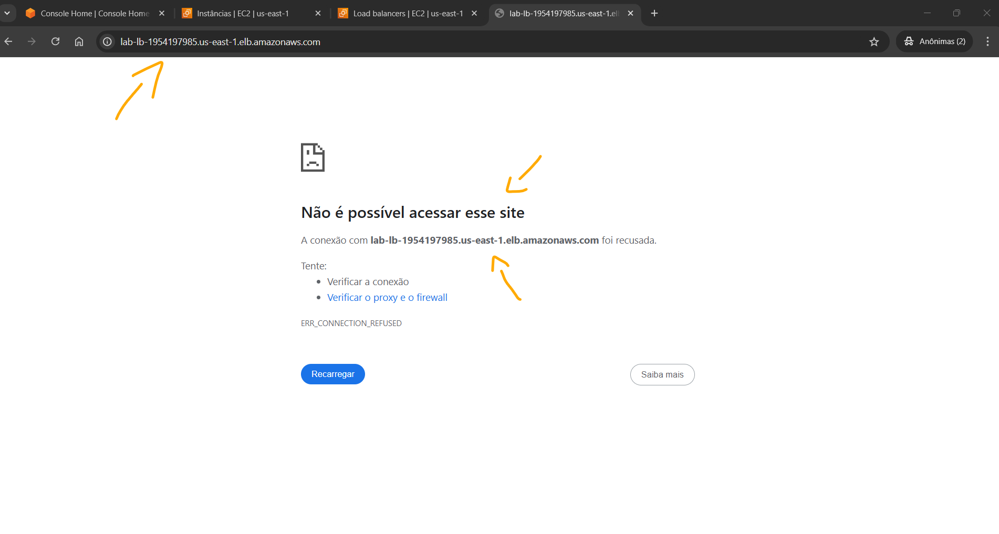
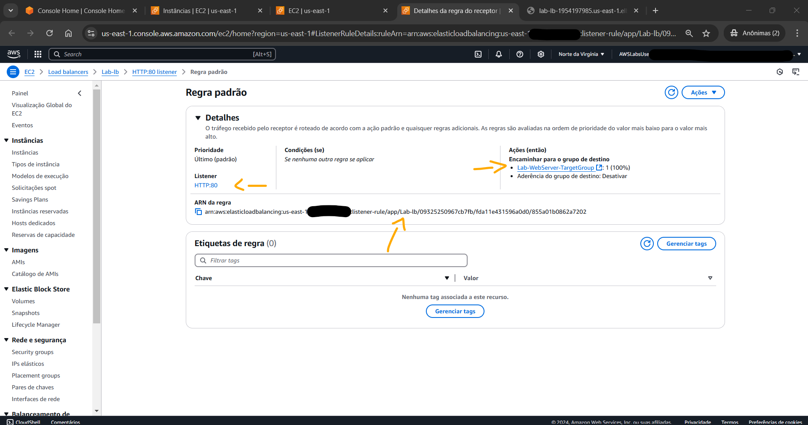
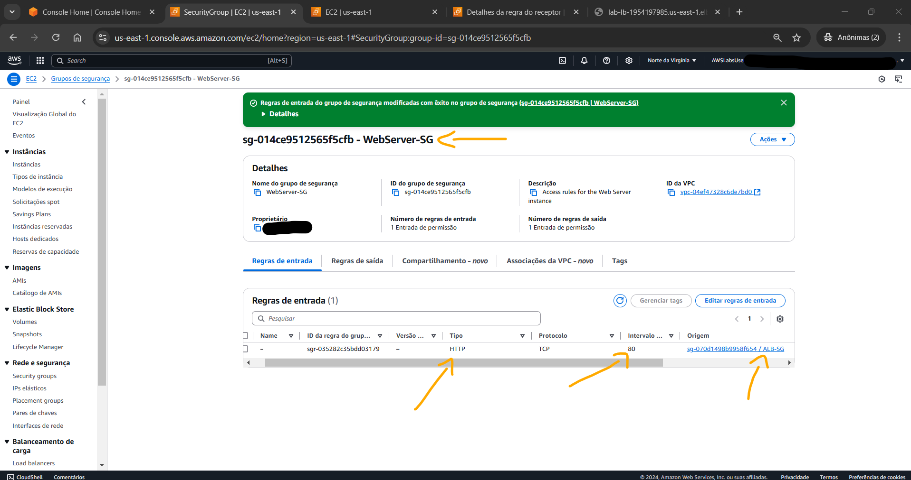
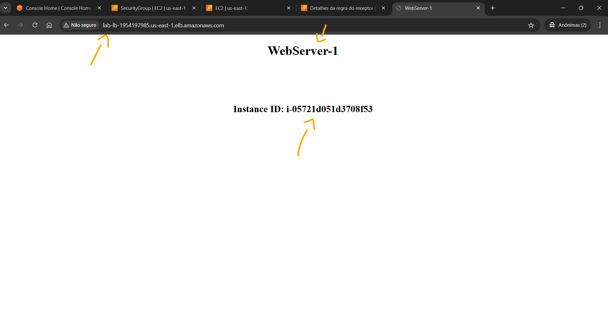
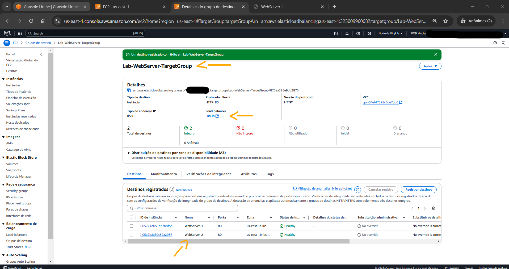
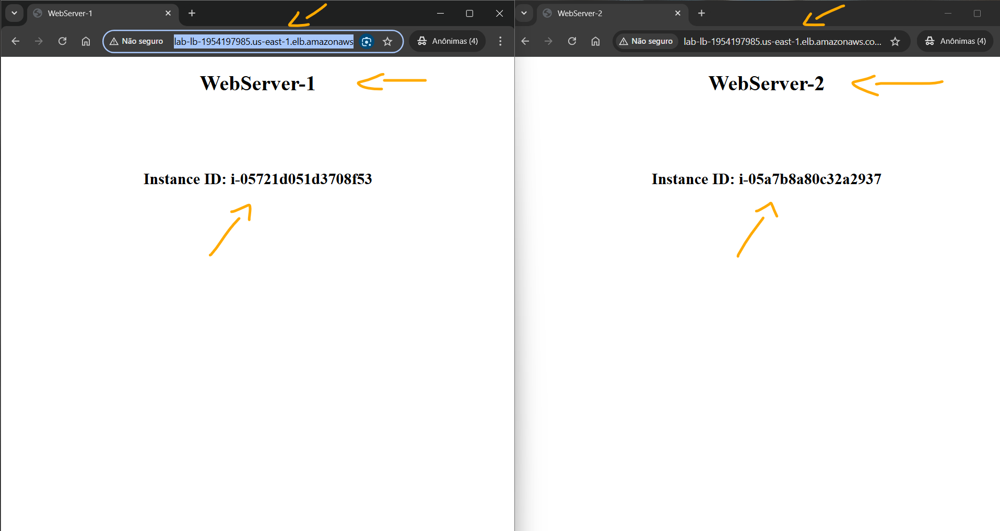

# Lab - Troubleshooting Website Reachability behind a Load Balancer   

### AWS Skill Builder <a href="../../">aws_skill_builder   </a>
### Training Category: <a href="../../self_paced_lab">self_paced_lab</a>
### Software/Subject: aws   
### Course: <a href="./">curso_spl_005 (Lab - Troubleshooting Website Reachability behind a Load Balancer)   </a>

#### Parceria da AWS com a Escola da Nuvem (EDN)   

---

### Theme:
- Cloud Computing

### Used Tools:
- Operating System (OS): 
  - Linux   
  - Windows 11   
- Linux Distribution:
  - Amazon Linux   
- Cloud:
  - Amazon Web Services (AWS)   
- Cloud Services:
  - Amazon Application Load Balancer (ALB)   
  - Amazon Elastic Compute Cloud (EC2)   
  - Amazon Elastic Load Balancing (ELB)   
  - Amazon Virtual Private Cloud (VPC)   
  - Google Drive   
- Language:
  - HTML   
  - Markdown   
- Integrated Development Environment (IDE) and Text Editor:
  - Visual Studio Code (VS Code)   
- Versioning: 
  - Git   
- Repository:
  - GitHub   

---

<a name="item0"><h3>Course Strcuture:</h3></a>
1. Lab - Troubleshooting Website Reachability behind a Load Balancer 
1.1 <a href="#item01.1">Tarefa 1: Testando a acessibilidade do servidor web pela internet</a> 
1.2 <a href="#item01.2">Tarefa 2: Solução de problemas e correção de problemas de acessibilidade do site</a> 
1.3 <a href="#item01.3">Tarefa 3: Garantir que a solução esteja altamente disponível</a> 

---

### Objective:
O objetivo deste laboratório prático foi solucionar e corrigir todos os problemas de configuração incorreta para permitir o acesso à página de um site usando o nome DNS do balanceador de carga, garantindo ao mesmo tempo que a solução ainda possa funcionar se uma das instâncias do servidor web estiver inativa. O site era hospedado em instâncias do **Amazon Elastic Compute Cloud (EC2)** atrás de um load balancer do tipo *Application Load Balancer (ALB)*.

### Structure:
A estrutura do curso é formada por:
- Este arquivo de README.
- A pasta `0-aux`, pasta auxiliar com imagens utilizadas na construção desse arquivo de README. 
- A pasta `resource` com os arquivos de código utilizado.

### Development:
Este curso foi um laboratório prático realizado na plataforma **AWS Skill Builder**, cuja subscrição foi devida a uma parceria entre a **AWS** e a **Escola da Nuvem**. A infraestrutura de cloud utilizada foi fornecida através de um sandbox do **AWS Skill Builder** que possibilitava acesso ao console da **AWS**. Contudo foi necessário seguir estritamente as orientações determinadas no laboratório. Dessa maneira, a forma de interação com os recursos da cloud foram sempre através do console fornecido pelo sandbox, a não ser em casos em que o próprio laboratório instruiu para utilização de outras ferramentas de interação como **AWS CLI** ou **AWS SDK**.

O laboratório do **AWS Skill Builder** tem o foco em executar apenas o que é orientado no escopo, todos os recursos ou serviços que podem ser requisitados adicionalmente já vêm provisionados por padrão pelo laboratório. Ao iniciar o laboratório, o sandbox do **AWS Skill Builder** provisiona diversos recursos e serviços para o funcionamento através de uma ou mais pilhas do **AWS CloudFormation** de forma automática. 

O acesso ao console no sandbox do **AWS Skill Builder** é realizado por meio de uma identidade federada. O Skill Builder funciona como um provedor de identidade (IdP), autenticando o usuário e vinculando-o a uma role do **AWS IAM** provisionada automaticamente por uma das pilhas do CloudFormation. Essa role concede permissões temporárias e mínimas necessárias para a execução do laboratório, garantindo segurança e controle sobre os recursos utilizados. O laboratório, por padrão, determina a região a ser utilizada e ela não deve ser alterada, somente se o próprio laboratório indicar. As configurações não informadas no laboratório devem ser sempre mantidas como padrão que estão.

<a name="item01.1"><h4>Tarefa 1: Testando a acessibilidade do servidor web pela internet</h4></a>[Back to summary](#item0)

Antes de iniciar a primeira tarefa, a arquitetura do laboratório é descrita da seguinte maneira:
- Uma VPC que hospeda todos os recursos do laboratório, nomeada de `Lab-VPC`.
- A VPC tem duas sub-redes públicas (`Public-Subnet-1` e `Public-Subnet-2`) e duas sub-redes privadas (`Private-Subnet-1` e `Private-Subnet-2`) em duas zonas de disponibilidade.
- A VPC tem um gateway de internet que permite acesso público pela internet, chamado de `Internet Gateway`.
- Um gateway NAT em uma das sub-redes públicas para fornecer acesso de saída das sub-redes privadas, cujo nome é `NAT GW`.
- Um Application Load Balancer (ALB), de nome `Lab-lb`, com uma interface de rede elástica (ENI) em cada uma das sub-redes públicas.
- Uma instância EC2 em cada uma das sub-redes privadas para hospedar o site, chamadas de `WebServer-1` e `WebServer-2`.

Para testar a acessibilidade do servidor web e visualizar o problema, foi acessado pelo navegador da máquina física **Windows** o DNS do load balancer (`Lab-lb-1954197985.us-east-1.elb.amazonaws.com`). A imagem 01 mostra o navegador exibindo a mensagem de erro ao tentar acessar o site, indicando que a página não pode ser acessada.

<figure>
     
    <figcaption>Imagem 01.</figcaption>
</figure>
 

<a name="item01.2"><h4>Tarefa 2: Solução de problemas e correção de problemas de acessibilidade do site</h4></a>[Back to summary](#item0)

Nessa tarefa, o objetivo foi identificar os problemas na configuração existente e corrigí-los para que o site pudesse ser acessado pela Internet usando o DNS do balanceador de carga. O primeiro problema identificado foi no listener do load balancer que tinha sido configurado para escutar na porta `8080`, porém o protocolo **HTTP** funciona na porta `80` por padrão. Dessa forma, foi necessário alterar essa porta de `8080` para `80` no listener do balanceador, conforme evidenciado na imagem 02 

<figure>
     
    <figcaption>Imagem 02.</figcaption>
</figure>
 

O segundo problema identificado foi com relação aos grupos de segurança. As duas instâncias vinculadas ao load balancer possuíam o mesmo grupo de segurança, cujo nome era `WebServer-SG`. As regras de saída (`Outbound rules`) estavam corretas, pois permitiam todo tráfego para qualquer endereço de IP (`0.0.0.0/0`). Já nas regras de entrada (`Inbound rules`) não havia nenhuma regra concedendo permissão. Dessa forma, não era possível acessar a aplicação web que rodava nas instâncias. Como era uma aplicação web que rodava na porta `80` cujo protocolo era **HTTP**, foi necessário adicionar uma regra de entrada do tipo `HTTP` para o tráfego vindo do grupo de segurança do load balancer (`ALB-SG`). A imagem 03 exibe essa regra adicionada no security group das instâncias. O grupo de segurança do balanceador de carga já possuía regras de entrada e saída permitindo comunicação na porta `80`, cujo protocolo era `HTTP`, para qualquer IP (`0.0.0.0/0`).

<figure>
     
    <figcaption>Imagem 03.</figcaption>
</figure>
 

Por fim, foi verificado se o site já era acesso pelo navegador da máquina física através do DNS do load balancer, conforme imagem 04. Observe que o navegador retornou a página do site que incluía o nome da instância do servidor web `WebServer-1` onde o site estava hospedado. A página também exibia o ID da instância EC2 para `WebServer-1`. 

<figure>
     
    <figcaption>Imagem 04.</figcaption>
</figure>
 

<a name="item01.3"><h4>Tarefa 3: Garantir que a solução esteja altamente disponível</h4></a>[Back to summary](#item0)

Com a correção dos problemas de acessibilidade do site, a terceira e última tarefa consistiu em aprimorar a resiliência da solução para mitigar qualquer falha potencial na instância que hospedava o site. Ou seja, configurar a solução para que ela tivesse alta disponibilidade para garantir que o site ainda estivesse acessível mesmo se uma instância tornasse inativa.

Neste momento, só quem recebia o tráfego era a instância `WebServer-1`. Isso foi constatado ao interromper a instância e tentar acessar a aplicação pelo DNS do load balancer. O correto era que a instância `WebServer-2` recebesse as requisições. O problema aqui foi no target group (grupo de destino), pois apenas a instância `WebServer-1` estava definida como destino (target). Neste caso, foi preciso adicionar também a instância `WebServer-2` para que o tráfego fosse enviado para as duas instâncias balanceadamente. Caso uma instância tivesse algum erro, a aplicação continuava acessível, pois a outra instância receberia as requisições. A imagem 05 mostra as duas instância adicionadas ao target group `Lab-WebServer-TargetGroup` que era do load balancer `Lab-lb`

<figure>
     
    <figcaption>Imagem 05.</figcaption>
</figure>
 

Observe que como na minha execução a instância `WebServer-1` não foi interrompida de fato. As duas instâncias atendiam as solicitações, onde o load balancer distribuía o tráfego de forma equilibrada entre as instâncias. Ao acessar a aplicação pelo navegador da máquina física através do DNS do load balancer, as informações nome da instância do servidor web e o ID da instância EC2 eram alteradas a medida que uma requisição diferente era enviada e os servidores se alternavam para receber o tráfego. A imagem 06 mostra duas requisições iguais, executadas em momentos diferentes, sendo atendidas por servidores diferentes.

<figure>
     
    <figcaption>Imagem 06.</figcaption>
</figure>
 