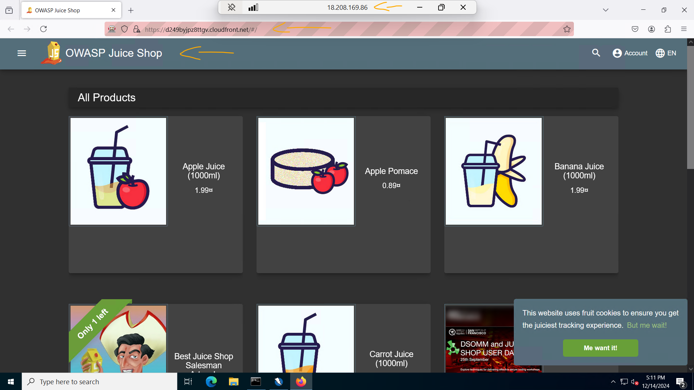
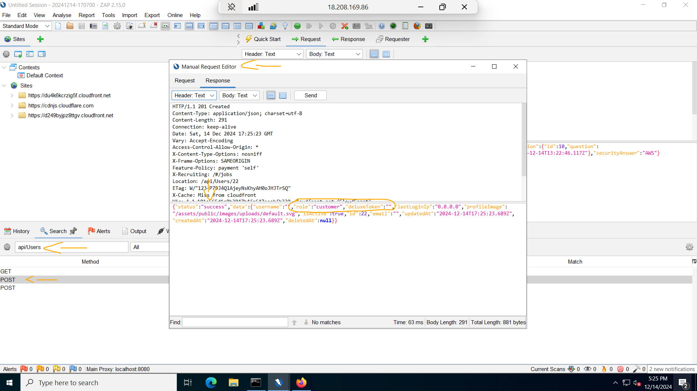

# Lab - Filtering and blocking web incursions with AWS WAF   

### AWS Skill Builder <a href="../../">aws_skill_builder   </a>
### Training Category: <a href="../../self_paced_lab">self_paced_lab</a>
### Software/Subject: aws   
### Course: <a href="./">curso_spl_006 (Lab - Filtering and blocking web incursions with AWS WAF)   </a>

#### Parceria da AWS com a Escola da Nuvem (EDN)   

---

### Theme:
- Cloud Computing

### Used Tools:
- Operating System (OS): 
  - Linux   
  - Windows 11   
  - Windows Server   
- Linux Distribution:
  - Amazon Linux   
- Cloud:
  - Amazon Web Services (AWS)   
- Cloud Services:
  - Amazon Application Load Balancer (ALB)   
  - Amazon CloudFront   
  - Amazon Elastic Compute Cloud (EC2)   
  - Amazon Elastic Load Balancing (ELB)   
  - Amazon Virtual Private Cloud (VPC)   
  - AWS Web Application Firewall (WAF)   
  - Google Drive   
- Language:
  - HTML   
  - Markdown   
- Integrated Development Environment (IDE) and Text Editor:
  - Visual Studio Code (VS Code)   
- Versioning: 
  - Git   
- Repository:
  - GitHub   
- Network:
  - Google Chrome   
  - Mozila Firefox; Firefox   
  - Proton Mail    
- Remote Desktop Software:
  - Remote Desktop Connection (RDC)   
- Software Development Testing:
  - OWASP Zed Attack Proxy (OWASP ZAP)   

---

<a name="item0"><h3>Course Strcuture:</h3></a>
1. Lab - Filtering and blocking web incursions with AWS WAF<br>
1.1 <a href="#item01.1">Tarefa 1: configurar o OWASP Zap e o Firefox</a><br>
1.2 <a href="#item01.2">Tarefa 2: reconhecimento</a><br>
1.3 <a href="#item01.3">Tarefa 3: ataque de XSS persistente</a><br>
1.4 <a href="#item01.4">Tarefa 4: desafio: ignorar a página de início de sessão</a><br>
1.5 <a href="#item01.5">Tarefa 5: Desafio: criar um usuário administrador</a><br>
1.6 <a href="#item01.6">Tarefa 6: criar uma ACL da web no AWS WAF</a><br>
1.7 <a href="#item01.7">Tarefa 7: testar sua ACL da web</a><br>
1.8 <a href="#item01.8">Tarefa 8: trabalhar com o criador de regras do AWS WAF</a><br>
1.9 <a href="#item01.9">Tarefa 9: testar a regra personalizada</a><br>

---

### Objective:
O objetivo deste laboratório prático foi implantar ataques SQL Injection (SQLi) e Cross-Site Scripting (XSS) com o **OWASP ZAP** em uma aplicação web para ver como eles funcionavam, e então aprimorar a solução existente da aplicação para mitigar esses tipos de ataque, utilizando o serviço **AWS Web Application Firewall (WAF)**. O **AWS WAF** é um firewall de aplicativos web que ajuda a proteger os aplicativos web ou APIs contra bots e exploits comuns na web que podem afetar a disponibilidade, comprometer a segurança ou consumir recursos em excesso. Um exploit é uma técnica ou conjunto de instruções (geralmente um software, script ou sequência de comandos) utilizado para explorar vulnerabilidades ou falhas de segurança em sistemas, redes, aplicações ou dispositivos. O objetivo do exploit pode variar, indo desde obter acesso não autorizado, roubar dados, causar interrupções no sistema, ou até mesmo comprometer completamente o controle do alvo.

### Structure:
A estrutura do curso é formada por:
- Este arquivo de README.
- A pasta `0-aux`, pasta auxiliar com imagens utilizadas na construção desse arquivo de README. 
- A pasta `resource` com os arquivos de código utilizado.

### Development:
Este curso foi um laboratório prático realizado na plataforma **AWS Skill Builder**, cuja subscrição foi devida a uma parceria entre a **AWS** e a **Escola da Nuvem**. A infraestrutura de cloud utilizada foi fornecida através de um sandbox do **AWS Skill Builder** que possibilitava acesso ao console da **AWS**. Contudo foi necessário seguir estritamente as orientações determinadas no laboratório. Dessa maneira, a forma de interação com os recursos da cloud foram sempre através do console fornecido pelo sandbox, a não ser em casos em que o próprio laboratório instruiu para utilização de outras ferramentas de interação como **AWS CLI** ou **AWS SDK**.

O laboratório do **AWS Skill Builder** tem o foco em executar apenas o que é orientado no escopo, todos os recursos ou serviços que podem ser requisitados adicionalmente já vêm provisionados por padrão pelo laboratório. Ao iniciar o laboratório, o sandbox do **AWS Skill Builder** provisiona diversos recursos e serviços para o funcionamento através de uma ou mais pilhas do **AWS CloudFormation** de forma automática. 

O acesso ao console no sandbox do **AWS Skill Builder** é realizado por meio de uma identidade federada. O Skill Builder funciona como um provedor de identidade (IdP), autenticando o usuário e vinculando-o a uma role do **AWS IAM** provisionada automaticamente por uma das pilhas do CloudFormation. Essa role concede permissões temporárias e mínimas necessárias para a execução do laboratório, garantindo segurança e controle sobre os recursos utilizados. O laboratório, por padrão, determina a região a ser utilizada e ela não deve ser alterada, somente se o próprio laboratório indicar. As configurações não informadas no laboratório devem ser sempre mantidas como padrão que estão.

<a name="item01.1"><h4>Tarefa 1: configurar o OWASP Zap e o Firefox</h4></a>[Back to summary](#item0)

Antes de iniciar o laboratório, a arquitetura da solução atual foi descrita da seguinte maneira:
- Uma VPC com duas sub-redes privadas (`Private Subnet`) e uma sub-rede pública (`Public-Subnet`) distribuída em duas Zonas de Disponibilidade.
- Um Application Load Balancer interno (`EC2 ALB`) que distribuía o tráfego para o grupo de auto scaling.
- Um grupo do Auto Scaling (`Juice Shop App`) localizado na sub-rede privada (`Private Subnet`) contendo dois nós (instâncias **Amazon EC2**) que executavam a aplicação web `Juice Shop`.
- Uma distribuição do Cloudfront em frente ao Application Load Balancer.
- O tráfego passava pelo **AWS WAF** antes que alcançasse a distribuição do Cloudfront.
- Uma instância do EC2 chamada `PenTestingHost` localizada na sub-rede pública. Essa instância servia para realizar testes de penetração na aplicação web que rodava nas instâncias do auto scaling group na sub-rede privada.

Nesta primeira tarefa, o objetivo foi se conectar remotamente a instância do **Amazon EC2** `PenTestingHost` e configurar os softwares **OWASP Zed Attack Proxy (ZAP)** e o **Firefox**. O **OWASP ZAP** é uma ferramenta de teste de penetração de código aberto mantida pelo **Open Worldwide Application Security Project (OWASP)**. Como um proxy “man-in-the-middle” (MitM), o ZAP intercepta todas as comunicações entre o navegador do testador e um aplicativo web de destino. Isso permite que os testadores de penetração inspecionem, modifiquem e manipulem as solicitações e respostas para descobrir vulnerabilidades. Entre as falhas de segurança que podem ser detectadas estão vulnerabilidades como SQL Injection (SQLi) e Cross-Site Scripting (XSS).

O SQL Injection é um tipo de ataque onde um atacante insere ou manipula comandos SQL maliciosos em uma consulta de banco de dados através de entradas de usuário em uma aplicação. Este ataque pode permitir o acesso não autorizado a dados, a modificação ou exclusão de informações, ou até mesmo o controle completo do banco de dados. O ataque Cross-Site Scripting (XSS) é uma vulnerabilidade de segurança em aplicações web que permite a um atacante injetar scripts maliciosos em páginas visualizadas por outros usuários. Esse tipo de ataque é usado para comprometer interações entre os usuários e a aplicação, geralmente roubando informações sensíveis ou manipulando o comportamento do site.

Neste caso, o ZAP foi utilizado para interceptar a comnicação entre o navegador **Firefox** da instância de teste de penetração, cujo sistema operacional era **Windows Server**, e a aplicação web que era acessada a partir da distribuição do **Amazon CloudFront**, mas que era executada nas instâncias EC2 **Amazon Linux** do grupo de auto scaling. Após interceptar a comunicação, foi possível obter informações relevantes sobre o banco de dados da aplicação web, modificar e manipular as solicitações e respostas, e injetar script maliciosos. Dessa forma, era evidenciado que a aplicação web estava sujeita a vulnerabilidades de SQLi e XSS. Nas tarefas futuras, o **AWS WAF** foi utilizado para mitigar esses tipos de ataques, protegendo a aplicação web.

Todas as três instâncias do laboratório, as duas do grupo de auto scaling (`ProtectedJuiceShop`) e a instância de teste de penetração (`PenetrationTestingHost`) eram gerenciadas pelo **AWS SSM**. Por consequência, elas eram listadas no recurso *Fleet Manager*, conforme imagem 01, e possuíam o agente do SSM instalado nelas, possibilitando utilizar outros recursos como o *Session Manager*. O *Session Manager* é um recurso do **AWS Systems Manager (SSM)** que permite gerenciar e acessar instâncias EC2 ou servidores locais de forma segura, sem a necessidade de abrir portas, configurar bastion hosts ou usar chaves SSH. Ele estabelece sessões interativas de terminal diretamente no console da **AWS** ou via **AWS CLI**, utilizando a comunicação segura do agente SSM, simplificando o gerenciamento e melhorando a segurança.

<div align="Center"><figure>
    <br>
    <figcaption>Imagem 01.</figcaption>
</figure></div><br>

Para conectar remotamente a instância de teste de penetração (`PenetrationTestingHost`), cujo sistema operacional era **Windows Server**, utilizando o recurso *Session Manager*, duas opções eram possíveis. A primeira opção era utilizando uma Command-Line Interface (CLI), onde a interação era apenas por texto e não havia interface gráfica. Enquanto a segunda opção era por uma Graphic User Interface (GUI), no qual existia uma interface gráfica. Em ambos os casos, não era necessário abrir portas no Security Group ou no Firewall porque o *Session Manager* utilizava um método seguro de comunicação que operava de maneira diferente do tráfego tradicional, como `SSH` ou `RDP`. 

No acesso remoto de interface de linha de comando, como não existia nenhuma configuração a ser feita, ou seja, não existia configuração de autenticação (nome de usuário, senha ou arquivo de chave privada), ele usava o contexto de execução padrão do **Windows Server** que era a conta do sistema local, no caso `EC2AMAZ-0SIPBLG$`. Essa conta não era uma conta de usuário padrão, mas uma conta de serviço do sistema operacional usada para executar serviços e tarefas internas. Entretanto, no acesso remoto gráfico era exigido uma autenticação do usuário que estava acessando a instância. Neste caso, duas opções eram possíveis, a primeira delas utilizar o arquivo de chave privada do par de chaves anexado a essa instância. Essa forma simplificava o procedimento, pois autenticava o usuário padrão da máquina, que no caso, como era um **Windows Server**, o usuário padrão era o `Administrator`. A outra forma era utilizar no console do EC2, o mesmo arquivo de chave privada do mesmo par chaves para desencriptar a senha para o usuário padrão, e utilizar ela e o nome do usuário padrão (`Administrator`) para se autenticar na máquina. O arquivo de chave privada do par de chaves da instância foi disponibilizado pelo laboratório, cujo nome era `Ec2KeyPair-PEM`. A imagem 02 exibe as duas formas de acesso remoto utilizando o recurso *Session Manager* do **AWS SSM**. Os acessos remotos gerenciados pelo *Session Manager* tem duração máxima de 60 minutos, quando atingida, a sessão era encerrada, porém era possível renovar a sessão. Observe que o nome do host `EC2AMAZ-0SIPBLG` era o nome do servidor **Windows** e a conta do sistema local é composta por o hostname concatenado com `$`. Para verificar o usuário autenticado foi utilizado o comando `$env:USERNAME` no **Windows PowerShell** tanto na CLI como na GUI.

<div align="Center"><figure>
    <br>
    <figcaption>Imagem 02.</figcaption>
</figure></div><br>

O laboratório facilitou o trabalho ao fornecer a seguinte URL (`https://us-east-1.console.aws.amazon.com/systems-manager/managed-instances/rdp-connect?region=us-east-1&instances=i-02c07abb997f37bf0`). Esta URL por baixo dos panos utilizava o recurso *Fleet Manager* para verificar as instâncias da frota e em seguida utilizava o recurso *Session Manager* para se conectar remotamente de forma gráfica a instância **Windows Server**. O laboratório indicou utilizar como navegador da máquina física o **Google Chrome**, que já é o que utilizo normalmente. O Chrome foi escolhido porque é o único navegador que permite copiar e colar bidirecionalmente entre as sessões do RDP e a máquina local, ou seja, ele permitia copiar e colar da máquina física na instância e vice-versa.

A outra forma de acesso remoto é muito parecido com a utilizada pelo **AWS SSM**. Contudo, ao invés de utilizar o SSM para se comunicar, a conexão era feita via IP ou DNS público da instância, controlando a comunicação com as regras no security group. Portanto, para que a comunicação remota com apenas interface de linha de comando (CLI) fosse efetuada, uma regra de entrada liberando a porta `22` para o IP público da máquina física **Windows** ou todos os IPs (`0.0.0.0/0`) tinha que ser adicionada no securtiy group vinculada a instância de teste de penetração (`PenetrationTestingHost`) para estabelecer comunicação pelo protocolo `SSH`. Já se o acesso remoto fosse utilizando uma interface gráfica (GUI), uma regra de entrada deveria ser adicionada ao grupo de segurança liberando acesso a porta `3389` para o IP público da máquina física ou todos os IPs (`0.0.0.0/0`) para estabelecer comunicação pelo protocolo `RDP`. Diferente do *Session Manager*, aqui, nas duas formas, tanto linha de comando como gráfica, ao executar a conexão era necessário autenticar o usuário que acessaria a máquina e isso era feito passando o caminho do mesmo arquivo de chave privada do mesmo par de chaves vinculado a instância, além do nome de usuário que iria se autenticar a máquina. No caso do acesso remoto gráfico, ainda tinha a possibilidade de desencriptar o arquivo no console do EC2 e passar a senha gerada com o nome do usuário padrão (`Administrator`) ao invés de passar apenas a chave privada e o nome de usuário padrão. 

Utilizando as formas de acesso com IP, portas e protocolos, o acesso remoto pode ser feito direto pela máquina física **Windows** através de softwares específicos como **OpenSSH** para protocolo `SSH` e **Remote Desktop Connection (RDC)** (Área de Trabalho Remota) para o protocolo `RDP`, ao invés de utilizar o console do **AWS SSM** para gerar o acesso em abas diferentes do navegador da máquina física. Neste caso, foi utilizado o software RDC da máquina física **Windows**, o IP ou DNS público da instância `PenetrationTestingHost` foi passado. Para este software era necessário utilizar o nome de usuário e senha para autenticação, não sendo possível passar o arquivo de chave privada. Dessa forma, o arquivo de chave privada foi utilizado no console do EC2 para desencriptar a senha do usuário padrão da máquina **Windows Server**, que era o `Administrator`. O **RDC** é um tipo de **Remote Desktop Protocol Client (RDP Client)** que utilizada o protocolo **RDP**. A imagem 03 exibe essa forma de acesso remoto gráfico da máquina física a instância. No grupo de segurança dessa instância já havia uma regra de entrada liberando a comunicação na porta `3389` para todos os IPs (`0.0.0.0/0`).

<div align="Center"><figure>
    <br>
    <figcaption>Imagem 03.</figcaption>
</figure></div><br>

Após essa explicação sobre acesso remoto, o software **OWASP ZAP** foi iniciado. O processo de configuração foi aguardado e uma janela de pop-up foi exibida perguntando se desejava persistir a sessão do ZAP e foi selecionada a opção `Yes, I want to persist this session with name based on the current timestamp` (Sim, quero persistir esta sessão com o nome baseado no carimbo de data/hora atual). Com o **OWASP ZAP** acessado, a opção `Disable the ZAP HUD` (Desativar a HUD do ZAP) foi clicada. Esta opção é um círculo verde escuro, ela desativava a HUD (Heads-Up Display), que é uma interface gráfica sobreposta ao navegador usada durante os testes de aplicações web. Em seguida foi clicado na opção `Manual Explore` (Explorar manualmente) que direcionou para a página do `Manual Explore`. 

Nesta página, a URL da distribuição do **Amazon CloudFront** (`https://d249byjpz8ttgv.cloudfront.net`), disponibilizada nas instruções do laboratório e também no próprio CloudFront foi inserida na opção `URL to explore` (URL para explorar) no ZAP. A aplicação web que funcionava nas duas instâncias do grupo de auto scaling eram acessadas através dessa distribuição do CloudFront. Lembrando que entre elas, além do auto scaling group, um *Application Load Balancer* também existia para distribuir o tráfego que ele recebia do CloudFront. A caixa de verificação `Enable HUD` (Ativar HUD) foi desmarcada. Esta opção era a mesma desabilitada anteriormente, só que dentro do `Manual Explore`. Em seguida, o menu suspenso próximo da opção `Explore your application` (Explorar seu aplicativo) foi aberto, e selecionado **Firefox**, e então clicado em `Launch Browser` (Iniciar navegador). Assim a aplicação web era acessada pelo navegador **Firefox** da instância de teste de penetração. A imagem 04 ilustra a configuração do **OWASP ZAP** e a imagem 05 evidencia o **Firefox** aberto e conectado ao aplicativo `JuiceShop`. Uma observação é que o ZAP configurava automaticamente o **Firefox** para ele utilizar como proxy (intermediário) o próprio ZAP, sendo neste caso, um proxy de tráfego. Isso eliminava a necessidade de se preocupar com os avisos de validação de certificado para sites usando `HTTPS`, pois o ZAP criava um certificado de autoridade local (CA) que era adicionado ao **Firefox** como confiável. Vale lembrar também que tudo isso estava sendo executado na instância **Windows Server** acessada remotamente pela máquina física **Windows** através do software **Remote Desktop Connection (RDC)**.

<div align="Center"><figure>
    <br>
    <figcaption>Imagem 04.</figcaption>
</figure></div><br>

<div align="Center"><figure>
    <br>
    <figcaption>Imagem 05.</figcaption>
</figure></div><br>

<a name="item01.2"><h4>Tarefa 2: reconhecimento</h4></a>[Back to summary](#item0)

Com o ambiente configurado, o próximo passo foi gerar requisições no site da aplicação web para o **OWASP ZAP**, que estava configurado, começasse a interceptar a comunicação entre a instância de teste de penetração e a distribuição do **Amazon CloudFront**, onde a aplicação web `Juice Shop` era acessada. A instância de teste de penetração acessava a aplicação web pelo navegador **Firefox** aberto pelo **OWASP ZAP**. Dessa forma, toda interação realizada no **Firefox** gerava requisições `HTTP` enviadas para a distribuição do CloudFront. Essas requisições eram interceptadas pelo **OWASP ZAP**, já que ele era um proxy MitM, registradas em log, e posteriormente seriam utilizadas para serem manipuladas, executando assim o teste de penetração.

As interações executadas no site da aplicação web acessado no **Firefox** da instância **Windows Server** foram as três seguintes:
- Usar a barra de pesquisa para pesquisar a palavra `apple juice`.
- Navegar para a página de registro (`https://d249byjpz8ttgv.cloudfront.net/#/register`) e crie um usuário. Neste caso, foi utilizado o email de teste (`phcstudy@proton.me`) do software **Proton**. O password foi definido como `Senha2468#`. A security question foi definida como `Company you first work for as an adult` e a resposta como `AWS`.
- Navegar para a página de início de sessão (`https://d249byjpz8ttgv.cloudfront.net/#/login`) e iniciar a sessão como o novo usuário criado.

A imagem 06 evidencia que as solicitações foram feitas no site.

<div align="Center"><figure>
    <br>
    <figcaption>Imagem 06.</figcaption>
</figure></div><br>

Com as solicitações realizadas, interceptadas e registradas em log pelo **OWASP ZAP**, agora foi o momento de iniciar os ataques de SQLi e XSS. Abaixo é listado um resumo dos ataques que seriam executados e qual eram o próposito deles. Cada um dos ataques foi explicado detalhadamente após o resumo, na sua respectiva tarefa.
- 1º Ataque (Tarefa 2): Alterar o body da solicitação do tipo `GET`, cuja URL continha o endpoint `apple juice`, para executar um ataque booleano (tipo de SQL Injection) na cadeia de consulta, com a finalidade de obter mensagens de erro no body da resposta que fornecessem informações sobre o banco de dados.
- 2º Ataque (Tarefa 3): Alterar o body da solicitação do tipo `POST`, cuja URL continha o endpoint `/api/Users`, para inserir no comando **SQL** um payload de vulnerabilidade XSS (ataque de XSS persistente) em um par de chave-valor no valor do campo email para criar um usuário. Ao enviar a requisição para API do endpoint `Users`, os dados eram adicionados na tabela `Users` do banco de dados. Dessa forma, este usuário foi gravado no banco de dados com um script malicioso e caso alguém visualizasse este perfil de usuário no futuro, o script iniciaria dentro do navegador dela. Nesse ataque também foram obtidas informações de outros campos existentes no banco de dados como `deluxeToken` e `role`.
- 3º Ataque (Tarefa 4): Alterar o body da solicitação do tipo `POST` de um exploit que permitia o início da sessão no site com um usuário autenticado, para executar um ataque booleano (tipo de SQL Injection), com a finalidade de permitir login no site sem informar as credenciais. Neste caso, a manipulação de código **SQL** fazia que o login fosse autenticado no usuário do banco de dados cujo o Id fosse igual a 1. Este ataque foi realizado primeiro no **Firefox** e na tarefa 7 pelo **OWASP ZAP**.
- 4º Ataque (Tarefa 5): Alterar o body da solicitação do tipo `POST`, cuja URL continha o endpoint `/api/Users`, para executar um ataque SQLi, inserindo no comando **SQL** o campo `role` com valor `admin` para autenticar-se no site como usuário administrador. Como foi observado na resposta da solicitação no ataque 2, ao criar um usuário, outros campos existiam nesta tabela no banco de dados, mas eram omitidos no formulário do site da aplicação web. Um desses campos era a `role` que determinava o nível de privilégio do usuário.

Após isso, foi alterado de volta para o console do ZAP. A opção `Search` (Pesquisar) foi clicada e a informação `apple juice` inserida para localizar requisições que tivessem essa informação no endpoint. Entre os resultados da pesquisa, foi localizado e selecionado uma solicitação do tipo `GET` com o seguinte URL: `https://d249byjpz8ttgv.cloudfront.net/rest/products/search?q=`. Em seguida, o menu de contexto foi aberto clicando com o botão direito do mouse e a opção `Open/Resend with Request Editor` (Abrir/Reenviar com o Request Editor) foi selecionada. O `Manual Request Editor` foi exibido e ele possuía duas guias: `Request` (Solicitação) e `Response` (Resposta), cada um dividido em dois painéis. Os cabeçalhos eram exibidos no painel superior e o corpo (body) da mensagem era exibido no painel inferior. Essa janela permitia que fosse modificado e reproduzido solicitações `HTTP`. O objetivo então era enviar uma requisição manipulada para o aplicativo `Juice Shop` para tentar forçar a resposta da solicitação exibir uma mensagem de erro que fornecesse informações sobre o aplicativo e o banco de dados. 

As cadeias de consulta `HTTP` são a parte do URL que vem depois de um ponto de interrogação (`?`) e são usadas para enviar dados adicionais para um servidor web como parte de uma solicitação `HTTP`. Quando foi enviado `apple juice` na barra de pesquisa, `apple%20juice` (o equivalente de suco de maçã criptografado por URL) foi enviado para a API como uma cadeia de consulta. O primeiro teste realizado foi um ataque booleano na cadeia de consulta. Portanto, foi alterado na primeira linha do body, o final da URL de `/search?q=` para `/search?q=' or 1=1 --`, mantendo a parte `HTTP/1.1`, e enviado a consulta clicando em `Send`. Um ataque booleano SQL é um tipo de injeção SQL que manipula as consultas usando condições verdadeiro/falso. Nesse caso, a cadeia `' or 1=1 --` alterava a consulta para que ela sempre retornasse verdadeiro, devido à condição `1=1`. O hífen duplo `--` comentava o restante da consulta, evitando que quaisquer condições adicionais fossem aplicadas. A guia `Response` (Resposta) abriu após execução, exibindo uma exceção não processada. No corpo da mensagem foram exibidas exatamente as informações que eram procuradas, o que destacava a importância de processar erros adequadamente. Com base na resposta, agora era conhecido que o aplicativo usava um banco de dados **SQLite**, conforme evidenciado na imagem 07.

<div align="Center"><figure>
    <br>
    <figcaption>Imagem 07.</figcaption>
</figure></div><br>

<a name="item01.3"><h4>Tarefa 3: ataque de XSS persistente</h4></a>[Back to summary](#item0)

Com a descoberta que o site da aplicação estava usando o **SQLite**, comprovou-se que o site era vulnerável a injeções SQL (SQLi). Nesta terceira tarefa, foi verificado se ele era vulnerável a ataques Cross-Site Scripting (XSS) também. Isso foi realizado através de ataque de XSS persistente para incorporar um script na lista de usuários registrados. Um ataque XSS persistente, também conhecido como um ataque de XSS armazenado, ocorre quando um atacante injeta scripts maliciosos em um banco de dados ou outro armazenamento permanente do aplicativo web. Esse código injetado é utilizado pelos usuários quando eles acessam as páginas da web afetadas, fazendo com que o script malicioso seja executado em seus navegadores. O atacante pode usar esse script para roubar informações confidenciais, manipular o conteúdo da web ou executar ações não autorizadas em nome do usuário.

Dessa forma, uma nova pesquisa foi feita em `Search` para localizar requisições com endpoint `api/Users`. Nos resultados da pesquisa, foi escolhida a solicitação do tipo `POST` em que o URL terminava com `/api/Users`, e então foi aberto o menu de contexto clicando novamente com o botão direito do mouse e selecionando a opção `Open/Resend with Request Editor` (Abrir/Reenviar com o Request Editor). O `Manual Request Editor` era novamente aberto agora em outra requisição. Essa era a solicitação enviada para o servidor quando foi criado um usuário na interface da aplicação. É uma solicitação do tipo `POST` enviada para o endpoint `Users` (Usuário) e incluía uma variedade de cabeçalhos-padrão, incluindo o `User-Agent`, o `Content-Type` e um cookie. Era possível que nem todos os dados inclusos no corpo da mensagem fossem necessários para criar um usuário. Sendo assim, o usuário foi criado usando apenas as chaves email (e-mail), password (senha) e passwordRepeat (repetir senha) e inserido o payload de vulnerabilidade XSS em um par de chave-valor de email (e-mail). O script atual abaixo foi substituída por ```{"email":"<iframe src=\"javascript:alert(`xss`)\">","password":"123456","passwordRepeat":"123456"}```. Os componentes desse novo script são explicados abaixo:
- `iframe`: cria um elemento de iframe.
- `src=`: define o atributo de origem (src) do iframe para um trecho de código **JavaScript**.

```json
{"email":"phcstudy@proton.me","password":"Senha2468#","passwordRepeat":"Senha2468#","securityQuestion":{"id":10,"question":"Company you first work for as an adult?","createdAt":"2024-12-10T22:53:03.695Z","updatedAt":"2024-12-10T22:53:03.695Z"},"securityAnswer":"AWS"}
```

Após enviar a requisição, a guia `Response` (Resposta) foi aberta e exibiu uma mensagem informando que o usuário foi criado, conforme imagem 08. Dessa forma, o script malicioso foi gravado no banco de dados. No futuro, se outra pessoa visualizar esse perfil de usuário, o script iniciará dentro do navegador dela. A resposta JSON incluíu campos adicionais, como `deluxeToken` e `role`, que não foi incluído na solicitação. Isso indicava que a tabela `Users` (Usuários) no banco de dados incluía atributos que não eram visíveis na interface de usuário do site. Isso poderia ser útil nas tarefas subsequentes.

<div align="Center"><figure>
    <br>
    <figcaption>Imagem 08.</figcaption>
</figure></div><br>

<a name="item01.4"><h4>Tarefa 4: desafio: ignorar a página de início de sessão</h4></a>[Back to summary](#item0)

Nesta tarefa, o objetivo foi ignorar a página de início de sessão (login) do `Juice Shop`, ou seja, conseguir fazer o login na aplicação web sem informar credenciais de usuários existentes. Quando alguém tentar realizar um login no site da aplicação, uma consulta SQL é realizada no banco de dados com a seguinte estrutura: `"SELECT * FROM Users WHERE email = 'test@example.com' AND password = '7c6a180b36896a0a8c02787eeafb0e4c' AND deletedAt IS NULL"`. Esse consulta basicamente tentava encontrar o usuário com email e senha igual ao informado e que a condição de exclusão dele fosse vazia, ou seja, que ele ainda existia no banco de dados. 

Dessa forma, a ideia era burlar a página de login da aplicação. Contudo, dessa vez, ao invés de enviar a requisição pelo **OWASP ZAP**, ela foi enviada direto pelo site da aplicação web no **Firefox**. Para isso, foi necessário alterar a página da aplicação para `https://d249byjpz8ttgv.cloudfront.net/#/login`, preencher os campos email e senha do formulário com `' or 1=1 --` e `123456` respectivamente, e então enviar a requisição. Neste caso, a consulta **SQL** que era feita era `"SELECT * FROM Users WHERE email = ''or 1=1 --' AND password = 'e10adc3949ba59abbe56e057f20f883e' AND deletedAt IS NULL"`. Já o payload desse comando em uma requisição ficava da seguinte maneira `{"email":"' or 1=1 --","password":"e10adc3949ba59abbe56e057f20f883e"}`. Isso também poderia ser executado pelo ZAP procurando uma solicitação do tipo `POST` de URL com endpoint `rest/User/login`.

Assim, o login na aplicação web foi realizado no **Firefox** sem passar as credenciais corretas. Isso aconteceu, pois foi ignorado a autenticação de início de sessão através da manipulação da consulta SQL realizada dessa vez na própria aplicação web no **Firefox**. A aplicação deveria encontrar os registros da tabela `Users` (Usuários) correspondentes ao email (e-mail) e à password (senha) que foi fornecido (observe que `123456` foi convertido em um hash MD5) e verificar que a conta não foi excluída (`deletedAt IS NULL`). No entanto, como foi inserido `'or 1=1 –` no campo email (e-mail), a lógica da consulta foi alterada. A consulta começava procurando `''` na coluna email (e-mail) da tabela `Users` (Usuários). Normalmente, isso não retornaria nenhum resultado, porque `''` era interpretado como uma cadeia vazia. Contudo, como foi adicionado o operador lógico `or` (ou) seguido por uma condição que era sempre verdadeiro (`1=1`), a consulta corresponde todas as linhas na tabela `Users` (Usuários). Além disso, já que `--` comentava o restante da consulta, as condições `AND password` e `AND deletedAt IS NULL` eram ignoradas. Basicamente, essa consulta retornava todos os usuários no banco de dados e, em seguida, conectava como o usuário com id=1 que era o usuário `admin@juice-sh.op`, um usuário administrador. A imagem 09 mostra a requisição interceptada no **OWASP ZAP** e a imagem 10 exibe o acesso na página de login da aplicação autenticado com usuário cujo Id era 1 (`admin@juice-sh.op`).

<div align="Center"><figure>
    <br>
    <figcaption>Imagem 09.</figcaption>
</figure></div><br>

<div align="Center"><figure>
    <br>
    <figcaption>Imagem 10.</figcaption>
</figure></div><br>

<a name="item01.5"><h4>Tarefa 5: Desafio: criar um usuário administrador</h4></a>[Back to summary](#item0)

A tarefa 5 consistiu em explorar a página de registro de usuário e criar um usuário com privilégios administrativos. O console do ZAP foi utilizado para encontrar um exploit que permitia a criação de um usuário com privilégios administrativos. Neste caso, foi procurado uma solicitação de API enviada para `/api/Users`, que criava os usuários. Esta solicitação, que era do tipo `POST`, foi aberta na janela do `Manual Request Editor` para verificar os detalhes da solicitação. Ao analisar o corpo da mensagem foi observado que haviam pares de chave-valor adicionais, sendo um deles `“role”:“customer”`. Isso transparecia que se existia uma função (role) de cliente, provavelmente existia outras funções também. `admin` é um nome de função comum para administradores. Sendo assim, foi utilizado `“role”:“admin”` no corpo da mensagem de solicitação, ficando o comando da seguinte forma: `{"email":"admin@example.com","password":"123456","passwordRepeat":"123456","role":"admin"}`. Após enviá-lo, foi exibida a mensagem que o usuário com função de administrador foi criado com sucesso, conforme verificado na imagem 11.

<div align="Center"><figure>
    <br>
    <figcaption>Imagem 11.</figcaption>
</figure></div><br>

<a name="item01.6"><h4>Tarefa 6: criar uma ACL da web no AWS WAF</h4></a>[Back to summary](#item0)

Bom, até aqui foi explorado como funcionam os ataques de SQL Injection (SQLi) e Cross-Site Scripting (XSS), utilizando o software **OWASP ZAP** e o **Firefox** na instância **Windows Server** que foi acessada remotamente de forma gráfica pelo software **Remote Desktop Connection (RDC)** da máquina física **Windows**. A aplicação web utilizada era fornecida pelas duas instâncias do auto scaling group que ficava atrás de um load balancer. Esse load balancer por sua vez ficava atrás de uma distribuição do CloudFront que fornecia o endpoint para acessar a aplicação. Esse endpoint era o utilizado no **OWASP ZAP** e **Firefox** para implantar os ataques SQLi e XSS e verificar como eles funcionavam, confirmando que a aplicação web era vulnerável aos ataques desses tipos.

A partir de agora, o objetivo foi aprimorar a solução já existente para impedir que ataques desse tipo ocorressem com a aplicação. Na solução inicial já existia um firewall fornecido pelo **AWS WAF**, entretanto era necessário realizar algumas configurações. Então nessa tarefa, o propósito foi criar uma lista de controle de acesso da web (ACL da web) no WAF. Uma ACL da web é um firewall de aplicativo web que permite o monitoramento de solicitações `HTTP` e `HTTPS` para recursos da **AWS**. As configurações dessa ACL foram as seguintes:
- Tipo de recurso: foi selecionado `Distribuições do Amazon CloudFront`.
- Nome: `JuiceShopACL`.
- Descrição: `Managed Rule sets and custom rules for JuiceShop`.
- Nome da métrica do CloudWatch: `JuiceShopACL`.
- `Associated AWS resources` (Recursos associados da AWS): `Add AWS resources` (Adicionar recursos da AWS):
  - Foi selecionada a caixa de verificação próxima da Distribuição do CloudFront e escolhida a opção `Add` (Adicionar) para acessar a página `Add rules and rule groups` (Adicionar regras e grupos de regras):
- No painel Regras, foi aberto o menu suspenso `Adicionar regras` e selecionado `Adicionar grupos de regras gerenciadas`. Foi adicionando dois grupos de regras gerenciadas pela ACL. Grupos de regras gerenciadas são coleções de regras predefinidas e prontas para uso que são criadas e mantidas pelos vendedores da **AWS** e do **AWS Marketplace**.
  - No topo da lista de grupos de regras gerenciadas, foi selecionado o menu suspenso `Grupos de regras gerenciadas pela AWS`.
    - A página foi rolada até a opção `Core rule set` (Conjunto de regras principais) e em seguida foi clicado em `Add to web ACL` (Adicionar à ACL da web). O `Core rule set` (Conjunto de regras principais) contém regras que normalmente são aplicadas a aplicativos web. Esse grupo fornece proteção contra exploração de uma ampla variedade de vulnerabilidades, incluindo aquelas descritas nas publicações do **OWASP**.
    - A lista continuou sendo rolada até a opção `SQL database` que foi selecionado. O grupo de regras `SQL database` contém regras para bloquear os padrões de solicitação associados com a exploração de bancos de dados SQL, incluindo ataques de injeção SQL.

Após adicionar os dois grupos de regras gerenciadas pela **AWS** (`Core rule set` e `SQL database`), eles eram exibidos na parte superior da tela. Ao analisar o painel logo abaixo das regras, foi identificado que, atualmente, a ACL estava consumindo 900 de 5 mil unidades de capacidade da ACL da web (WCUs). Aplicar ACLs requer recursos de computação, que são medidos nas WCUs. O **AWS WAF** calcula a capacidade de maneira diferente para cada tipo de regra, para refletir o custo relativo de cada uma. Regras simples que custam pouco para executar usam menos WCUs do que regras mais complexas que usam mais poder de processamento. Por exemplo, uma declaração de regra de restrição de tamanho usa menos WCUs do que uma declaração que inspeciona solicitações usando um conjunto de padrões regex.

Ao confirmar e acessar a página `Definir prioridade da regra`, era possível alterar a ordem em que as regras eram aplicadas. Neste caso, foi mantida a prioridade-padrão inalterada. Nenhuma das configurações das métricas foram alteradas também. Após isso, a ACL da Web do **AWS WAF** foi provisionada com sucesso, conforme evidenciado na imagem 12.

<div align="Center"><figure>
    <br>
    <figcaption>Imagem 12.</figcaption>
</figure></div><br>

<a name="item01.7"><h4>Tarefa 7: testar sua ACL da web</h4></a>[Back to summary](#item0)

Com a ACL da web criada no WAF, nesta tarefa 7 o objetivo foi testá-la reproduzindo novamente os quatro ataques lançados nas tarefas anteriores para verificar se a ACL da web mitigava os ataques. Dessa forma, foi necessário retornar para o **OWASP ZAP** aberto na instância EC2 **Windows Server** conectada remotamente pela máquina física **Windows**. O primeiro ataque testado foi de SQL Injection que explorava a barra de pesquisa com um ataque booleano. No console do ZAP, no campo de pesquisa (`Search`) foi inserido `products/search` para pesquisar requisições com esse endpoint. Uma solicitação do tipo `GET`, cuja URL terminava com `/rest/products/search?q=`, foi aberta no `Manual Request Editor`, selecionando a opção `Open/Resend with Request Editor` (Abrir/Reenviar com o Request Editor). Na guia de `Request` (Solicitação), na primeira linha do body foi alterado o final da URL para `/rest/products/search?q=' or 1=1 --`, mantendo `HTTP/1.1`, para criar o ataque booleano, comentando todas as informações subsequentes do body. Ao enviar a solicitação manipulada, a resposta foi obtida mostrando uma mensagem de erro, conforme exibida na imagem 13 abaixo. A mensagem era uma página de erro gerada pelo **Amazon CloudFront** que indicava que uma solicitação feita para um recurso não pôde ser processada e foi bloqueada, resultando em um erro `403 Forbidden`. Isso aconteceu devido as regras configuradas na ACL da web no **AWS WAF** que bloqueavam certas solicitações.

<div align="Center"><figure>
    <br>
    <figcaption>Imagem 13.</figcaption>
</figure></div><br>

Dando sequência, foi alterado o campo de pesquisa (`Search`) para procurar requisições contendo o endpoint `rest/User/login`. A ideia agora era testar se a ACL impedia os atacantes de explorarem a página de início de sessão (login). Este tinha sido o ataque número 3. Uma das requisições do tipo `POST` retornadas na pesquisa foi aberta na janela do `Manual Request Editor`. Na guia `Request` (Solicitação), o payload foi substituído por esse comando `{"email":"' or 1=1 --","password":"123"}`. Esse também era um ataque booleanocom intuito de fazer login na aplicação web sem possuir um usuário ou credenciais válidas. A imagem 14 exibe uma mensagem na respota da solicitação comprovando que as regras definidas na ACL da web construída no WAF impediram o ataque.

<div align="Center"><figure>
    <br>
    <figcaption>Imagem 14.</figcaption>
</figure></div><br>

Uma nova pesquisa foi feita no campo `Search` para procurar requisições com o seguinte endpoint: `api/Users`. O objetivo agora era testar se a ACL do **AWS WAF** impedia também ataque XSS, que tinha sido o ataque de número 2. A solicitação aberta na janela do `Manual Request Editor` foi do tipo `POST` que criava o usuário `xss@eample.com`. Na guia `Request` (Solicitação), o payload foi substituído por esse comando ```{"email":"<iframe src=\"javascript:alert(`xss`)\">","password":"123456","passwordRepeat":"123456"}```. A imagem 15 evidencia que a ACL impediu novamente o ataque, devido as regras definidas nela.

<div align="Center"><figure>
    <br>
    <figcaption>Imagem 15.</figcaption>
</figure></div><br>

Nessa mesma requisição, o body foi alterado para `{"email":"newadmin@example.com","password":"123456","passwordRepeat":"123456","role":"admin"}` para tentar criar um usuário com privilégios administrativos, o qual tinha sido o ataque número 4. Neste caso, o ataque foi bem-sucedido e um usuário com `“role”:“admin”` foi criado, conforme mostrado na imagem 16. Isso não foi surpreendente, porque o corpo da mensagem não incluiu nada obviamente malicioso e solicitações realizadas por um usuário administrador podem acontecer normalmente, desde que ele de fato fosse o administrador. Contudo, isso tornava-se uma vulnerabilidade crítica, pois atacantes poderiam se passar como um usuário administrador e ter acesso com privilégios administrativos. Para mitigar esse problema foi preciso criar uma regra na ACL do **AWS WAF** personalizada para bloquear essas solicitações.

<div align="Center"><figure>
    <br>
    <figcaption>Imagem 16.</figcaption>
</figure></div><br>

<a name="item01.8"><h4>Tarefa 8: trabalhar com o criador de regras do AWS WAF</h4></a>[Back to summary](#item0)

Os grupos de regras gerenciados aplicados nas tarefas anteriores bloquearam a maioria dos ataques, mas um deles passou. Nesta tarefa, o criador de regras do **AWS WAF** foi utilizado para construir uma regra do WAF personalizada projetada para mitigar os ataques não evitados pelos grupos de regras gerenciados. De volta ao console da **AWS** aberto no serviço WAF, a ACL `JuiceShopACL` criada anteriormente foi acessada. A guia regras foi selecionada e a opção `Add my own rules and rule groups` (Adicionar minhas próprias regras e grupos de regras) foi escolhida no menu suspenso `Adicionar regras`. As regras personalizadas permitem criar a própria lógica para processar solicitações e fornecer um maior grau de flexibilidade e controle. As regras podem inspecionar muitos aspectos de uma solicitação, incluindo seus cabeçalhos, cadeias de consulta, caminho de URI e corpo. Em seguida, as ações são aplicadas à solicitação de acordo com as condições especificadas na regra.

A regra personalizada criada impedia que o endpoint `api/Users` aceitasse solicitações contendo `“role”:“admin”` no corpo da mensagem. É muito importante pensar cuidadosamente nas declarações incluídas nas regras. Regras muito amplas podem resultar em falsos positivos. Por outro lado, as regras granulares, particularmente aquelas que envolvem a análise JSON, consomem significativamente mais WCUs. As configurações da regra personalizada foram as seguintes:
- Tipo de regra: foi selecionado `Criador de regras`.
- Nome: `CustomSQLiRuleForJuiceShop`.
- O menu suspenso `If a request` (Se uma solicitação) foi aberto e selecionada a opção `matches all the statements (AND)` (corresponde a todas as declarações [AND]). Várias declarações podem ser encadeadas usando operadores AND, OR e NOT.
- No painel `Statement 1` (Declaração 1), foram inseridas as configurações abaixo. Essa declaração impediam que a barra de pesquisa fosse explorada, bloqueando todas as solicitações que incluíam uma cadeia de consulta que começasse com um apóstrofo (').
  - `Negate statement results` (Negar resultados de declaração): a caixa de verificação foi mantida desmarcada.
  - `Inspect` (Inspecionar): `URI path` (Caminho de URI).
  - `Match type` (Tipo de correspondência): `Contains string` (contém cadeia).
  - `String to match` (Cadeia para corresponder): `api/Users`.
  - `Text transformation` (Transformação de texto): `Nenhuma`.
- No painel `Statement 2` (Declaração 2), foram inseridas as configurações abaixo. Essa declaração impedia que a página de registro de usuários fosse explorada. Ela bloqueiava todas as solicitações cujo URI incluía a cadeia `api/Users` e cujo corpo da mensagem incluía `“role”:“admin”`. Observe que esta regra é aplicada apenas a solicitações que passam pelo CloudFront. Os administradores do site ainda poderão criar novos usuários administrativos, conectando-se diretamente ao servidor do `Juice Shop`.
  - `Negate statement results` (Negar resultados de declaração): a caixa de verificação foi mantida desmarcada.
  - `Inspect` (Inspecionar): `Body` (Corpo).
  - `Content type` (Tipo de conteúdo): `Plain text` (Texto simples).
  - `Match type` (Tipo de correspondência): `Contains string` (contém cadeia).
  - `String to match` (Cadeia para corresponder): `"role":"admin"`.
  - `Text transformation` (Transformação de texto): `Nenhuma`.
  - `Oversize handling` (Manuseio superdimensionado): `Continue - Inspect the contents that are within the size limitations according to the rule inspection criteria` (Continue: inspecione o conteúdo que está dentro das limitações de tamanho de acordo com os critérios de inspeção de regras)
  - No painel `Ação`: foi selecionado `Bloco`.

A imagem 17 mostra a regra personalizada validada e adicionada na ACL da web do **AWS WAF**, que já possuíam dois grupos de regras gerenciadas pela **AWS** adicionadas em tarefas anteriores. Esta regra possuíam duas declarações (`Statement 1` e `Statement 2`).

<div align="Center"><figure>
    <br>
    <figcaption>Imagem 17.</figcaption>
</figure></div><br>

<a name="item01.9"><h4>Tarefa 9: testar a regra personalizada</h4></a>[Back to summary](#item0)

A última tarefa consistiu em testar se a regra personalizada impedia tanto a pesquisa de solicitações como também a criação de usuários com privilégios administrativos. Portanto foi necessário voltar ao **OWASP ZAP** aberto na instância **Windows Server** acessada remotamente pela máquina física através do software **Remote Desktop Connection (RDC)**. No console do ZAP foi inserido no campo `Search` (Pesquisa) a informação `api/Users`. Uma requisição do tipo `POST` foi aberta na janela do `Manual Request Editor`. Na guia `Request` (Solicitação), o payload foi substituído por `{"email":"newadmin2@example.com","password":"123456","passwordRepeat":"123456","role":"admin"}` para tentar criar o usuário com permissões administrativas. A imagem 18 confirma que a regra personalizada adicionada na ACL impediu que essa solicitação manipulada fosse executada.

<div align="Center"><figure>
    <br>
    <figcaption>Imagem 18.</figcaption>
</figure></div><br>

Obviamente, era possível que o aplicativo permaneça vulnerável a outros ataques e era aconselhável permitir o registro em log para que fosse possível coletar informações adicionais sobre o tráfego que passa pela ACL da web. Esses logs poderiam ser enviados para um grupo de logs no *Amazon CloudWatch Logs*, um bucket do **Amazon Simple Storage Service (S3)** ou um *Amazon Kinesis Data Firehose*.