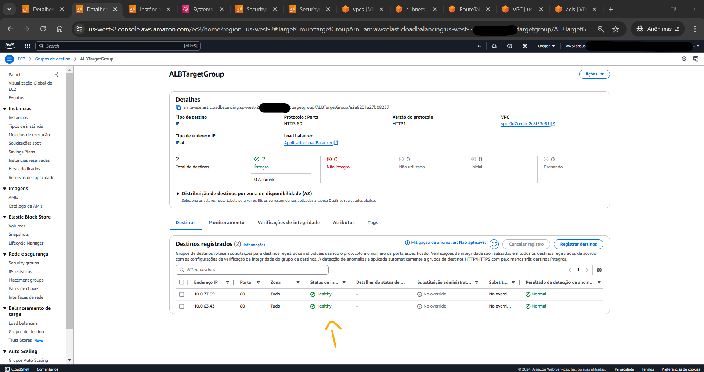

# Lab - Resolve VPC Routing Conflicts   

### AWS Skill Builder <a href="../../">aws_skill_builder   </a>
### Training Category: <a href="../../self_paced_lab">self_paced_lab</a>
### Software/Subject: aws   
### Course: <a href="./">curso_spl_007 (Lab - Resolve VPC Routing Conflicts)   </a>

#### Parceria da AWS com a Escola da Nuvem (EDN)   

---

### Theme:
- Cloud Computing

### Used Tools:
- Operating System (OS): 
  - Linux   
  - Windows 11   
- Linux Distribution:
  - Amazon Linux   
- Cloud:
  - Amazon Web Services (AWS)   
- Cloud Services:
  - Amazon Application Load Balancer (ALB)   
  - Amazon Elastic Compute Cloud (EC2)   
  - Amazon Elastic Load Balancing (ELB)   
  - Amazon Route 53   
  - Amazon Virtual Private Cloud (VPC)   
  - Google Drive   
- Language:
  - HTML   
  - Markdown   
- Integrated Development Environment (IDE) and Text Editor:
  - Visual Studio Code (VS Code)   
- Versioning: 
  - Git   
- Repository:
  - GitHub   

---

<a name="item0"><h3>Course Strcuture:</h3></a>
1. Lab - Resolve VPC Routing Conflicts 
1.1 <a href="#item01.1">Tarefa 1: solucionar problemas de conectividade entre as instâncias no VPC-ALB e no VPC-Target</a> 
1.2 <a href="#item01.2">Tarefa 2: Investigar por que os alvos não estão processando as solicitações recebidas</a> 
1.3 <a href="#item01.3">Tarefa 3: Investigar por que o nome DNS do ALB está falhando intermitentemente</a> 
1.4 <a href="#item01.4">Opcional: Tarefa de Desafio</a> 

---

### Objective:
O objetivo deste laboratório prático foi compreender e solucionar a falta de acessibilidade para um site de uma aplicação web de duas camadas. Ou seja, o aplicativo da web consistia em duas **Amazon Virtual Private Cloud (VPC)** emparelhadas, com os nós do *Application Load Balancer (ALB)* hospedados na `VPC-ALB` e os servidores da web (destinos) hospedados em `VPC-Target`.

### Structure:
A estrutura do curso é formada por:
- Este arquivo de README.
- A pasta `0-aux`, pasta auxiliar com imagens utilizadas na construção desse arquivo de README. 
- A pasta `resource` com os arquivos de código utilizado.

### Development:
Este curso foi um laboratório prático realizado na plataforma **AWS Skill Builder**, cuja subscrição foi devida a uma parceria entre a **AWS** e a **Escola da Nuvem**. A infraestrutura de cloud utilizada foi fornecida através de um sandbox do **AWS Skill Builder** que possibilitava acesso ao console da **AWS**. Contudo foi necessário seguir estritamente as orientações determinadas no laboratório. Dessa maneira, a forma de interação com os recursos da cloud foram sempre através do console fornecido pelo sandbox, a não ser em casos em que o próprio laboratório instruiu para utilização de outras ferramentas de interação como **AWS CLI** ou **AWS SDK**.

O laboratório do **AWS Skill Builder** tem o foco em executar apenas o que é orientado no escopo, todos os recursos ou serviços que podem ser requisitados adicionalmente já vêm provisionados por padrão pelo laboratório. Ao iniciar o laboratório, o sandbox do **AWS Skill Builder** provisiona diversos recursos e serviços para o funcionamento através de uma ou mais pilhas do **AWS CloudFormation** de forma automática. 

O acesso ao console no sandbox do **AWS Skill Builder** é realizado por meio de uma identidade federada. O Skill Builder funciona como um provedor de identidade (IdP), autenticando o usuário e vinculando-o a uma role do **AWS IAM** provisionada automaticamente por uma das pilhas do CloudFormation. Essa role concede permissões temporárias e mínimas necessárias para a execução do laboratório, garantindo segurança e controle sobre os recursos utilizados. O laboratório, por padrão, determina a região a ser utilizada e ela não deve ser alterada, somente se o próprio laboratório indicar. As configurações não informadas no laboratório devem ser sempre mantidas como padrão que estão.

<a name="item01.1"><h4>Tarefa 1: solucionar problemas de conectividade entre as instâncias no VPC-ALB e no VPC-Target</h4></a>[Back to summary](#item0)

A arquitetura inicial é composta pelos seguintes elementos:
- Duas VPCs emparalhedas, nomedas de `VPC-ALB` e `VPC-Target`.
- `VPC-ALB`:
  - Duas sub-redes públicas (`PublicSubnet1_VPC-ALB` e `PublicSubnet2_VPC-ALB`) contendo um nó do load balancer ALB em cada uma delas (`).
  - Um Internet Gateway para comunicação com a Internet.
  - Um *Application Load Balancer* para distribuição do tráfego entre as duas instâncias EC2 da `VPC-Target`.
  - Uma instância do **Amazon EC2** de nome `WorkStation` que possuíam ferramentas já instaladas para resolver problemas de comunicação.
- `VPC-Target`:
  - Duas sub-redes privadas (`PrivateSubnet1_VPC-Target` e `PrivateSubnet2_VPC-Target`) contendo uma instância do **Amazon EC2** em cada uma (`ALBTarget1` e `ALBTarget2`e `Target 1` e `Target 2`), executando a aplicação web.

A primeira tarefa foi garantir que o ALB e os alvos registrados pudessem se comunicar. Para isso foi utilizada a instância `WorkStation` que servia de apoio para solucionar problemas de comunicação, já que ela tinha ferramentas necessárias já instaladas e também era a única em uma sub-rede pública (`PublicSubnet1_VPC-ALB`). O acesso remoto a instância foi realizado pelo recurso *Session Manager* do **AWS SSM**. O *Session Manager* elimina a necessidade de abrir portas no security group, já que ele ???. 

Ao conectar a instância, uma nova aba do navegador da máquina física **Windows** abre com uma sessão **Bash** vinculada ao usuário do **AWS SSM**. Em seguida, o comando `sudo -i` foi executado para mudar para o usuário `root`. Era opcional testar a conectividade como um usuário `root`. Mudar para um usuário `root` ajudava a identificar o endereço IP do host. O primeiro teste executado foi de conectividade com as instâncias da aplicação web (`ALBTarget1` e `ALBTarget2`) utilizando os comandos `ping 10.0.63.43` e `ping 10.0.77.99` passando o IP privado de cada nó (instância). O **Ping** utiliza o protocolo `ICMP` ao invés do `TCP` na camada de transporte, portanto não utiliza portas. A imagem 01 exibe o output dos comandos comprovando que não houve sucesso na conexão.

<figure>
     
    <figcaption>Imagem 01.</figcaption>
</figure>
 

Para identificar a falta de comunicação entre a instância de apoio `WorkStation` e as instâncias da aplicação web na outra VPC, foi necessário verificar as configurações de alguns recursos:
- Foi verificado que o emparelhamento da VPC estava configurado corretamente.
- Foram verificadas as rotas da tabela de rotas `PublicSubnet1-VPC-ALB_RT` que possuíam três rotas, inclusive uma rota do emparalhamento da VPC para o IP (`10.0.0.0/16`) que era o CIDR da VPC `VPC-Target`. Ou seja, o tráfego vindo da `VPC-Target` para a sub-rede pública `PublicSubnet1_VPC-ALB` era permitido.
- Foram verificadas as rotas da tabela de rotas `PublicSubnet2-VPC-ALB_RT` que possuíam duas rotas, inclusive uma rota do emparalhamento da VPC para o IP (`10.0.0.0/16`) que era o CIDR da VPC `VPC-Target`. Ou seja, o tráfego vindo da `VPC-Target` para a sub-rede pública `PublicSubnet2_VPC-ALB` era permitido.
- Foram verificadas as rotas da tabela de rotas `PrivateSubnet-VPC-Target_RT` que possuíam apenas uma rota. Foi necessário adicionar uma segunda rota tendo como alvo o ID do emparalhemento da VPC para o destino `192.168.0.0/16` que era o CIDR da VPC `VPC-ALB`. Dessa forma, era permitido o tráfego vindo da `VPC-ALB` para as duas sub-redes privadas (`PrivateSubnet1_VPC-Target` e `PrivateSubnet2_VPC-Target`).
- Foram verificadas as duas ACLs (`NetworkACL_VPC-ALB` e `NetworkACL_VPC-Target`) para verificar se elas estavam bloqueando a comunicação, mas existiam regras de entrada e saída em ambas liberando a comunicação pelo protocolo `ICMP`.
- Foi verificado também o grupo de segurança utilizado pelas instâncias da aplicação web (`EC2SecurityGroup_VPC-Target`) e ele possuía regras de entrada liberando comunicação no protocolo `ICMP`.

A imagem 02 evidencia o funcionamento dos pings para as duas instâncias da aplicação web com os comandos `ping 10.0.63.43` e `ping 10.0.77.99`.

<figure>
     
    <figcaption>Imagem 02.</figcaption>
</figure>
 

<a name="item01.2"><h4>Tarefa 2: Solução de problemas e correção de problemas de acessibilidade do site</h4></a>[Back to summary](#item0)

Com a confirmação da conectividade entre as VPCs `VPC-ALB` e `VPC-Target`, o próximo passo foi investigar o status dos destinos ALB. Nesse momento, o status estava não saudável (`unhealthy`), conforme mostrado na imagem 03. Para verificar o problema, foi utilizada a mesma sessão remota aberta na instância `WorkStation`. Nela, foram executados os comandos `curl -Iv http://10.0.63.43` e `curl -Iv http://10.0.77.99`, conforme imagem 04. O **Curl** executa uma solicitação no protocolo `HTTP`, que opera na porta `80`. A imagem 04 mostra que não foi possível obter conectividade com solicitações `HTTP`.

<figure>
     
    <figcaption>Imagem 03.</figcaption>
</figure>
 

<figure>
     
    <figcaption>Imagem 04.</figcaption>
</figure>
 

Dessa forma, foi necessário verificar a configuração que estava impedindo o acesso. Algumas configurações foram analisadas:
- Foi verificado o security group (`EC2SecurityGroup_VPC-ALB`) vinculado a instância `WorkStation` e ele possuía uma regra de entrada na porta `80` para todos os IPs (`0.0.0.0/0`) e uma regra de saída liberando todos protocolos para todos os IPs (`0.0.0.0/0`).
- Foram verificados os security groups (`EC2SecurityGroup_VPC-Target`) vinculados as instâncias da aplicação web (`ALBTarget1` e `ALBTarget2`) e ele possuía duas regras de entrada, uma na porta `80` para todos os IPs (`0.0.0.0/0`) e outra no protocolo `ICMP` para todos os IPs (`0.0.0.0/0`), e uma regra de saída liberando todos protocolos para todos os IPs (`0.0.0.0/0`).
- Foi verificado o security group (`ALBSecurityGroup_VPC-ALB`) vinculado a instância `WorkStation` e ele possuía uma regra de entrada na porta `80` para todos os IPs (`0.0.0.0/0`) e uma regra de saída liberando todos protocolos para todos os IPs (`0.0.0.0/0`).
- Foi verificado a ACL (`NetworkACL_VPC-Target`) vinculada as sub-redes privadas (`PrivateSubnet1_VPC-Target` e `PrivateSubnet2_VPC-Target`). Ela possuía regras de entrada liberando a porta `80` para todos os IPs (`0.0.0.0/0`) e possuía regra de saída liberando também a porta `80` para todos os IPs (`0.0.0.0/0`). Aqui foi necessário criar uma regra de saída liberando o intervalo de portas efêmeras `1024 - 65535` para todos os IPs (`0.0.0.0/0`). As portas efêmeras são portas temporárias atribuídas automaticamente pelo sistema operacional para a comunicação de saída de um cliente com um servidor. Essas portas são usadas para estabelecer conexões dinâmicas de rede, como durante a comunicação TCP/IP.
- Foi verificado a ACL (`NetworkACL_VPC-ALB`) vinculada as sub-redes públicas (`PublicSubnet1_VPC-ALB` e `PublicSubnet2_VPC-ALB`). Ela possuía regras de entrada liberando a porta `80` para todos os IPs (`0.0.0.0/0`) e possuía regra de saída liberando todo o tráfego para todos os IPs (`0.0.0.0/0`). Ela ainda possuía uma regra liberando o protocolo `TCP (6)` para o intervalo de portas `1024 - 65535` para todos os IPs (`0.0.0.0/0`). Aqui foi necessário criar uma regra de saída liberando o intervalo de portas efêmeras `1024 - 65535` para todos os IPs (`0.0.0.0/0`).
- Foram verificadas as rotas da tabela de rotas `PrivateSubnet-VPC-Target_RT` para conferir se existia uma rota que tinha como alvo o ID do emparalhemento da VPC para o destino `192.168.0.0/16` que era o CIDR da VPC `VPC-ALB`. Dessa forma, era permitido o tráfego vindo da `VPC-ALB` para as duas sub-redes privadas (`PrivateSubnet1_VPC-Target` e `PrivateSubnet2_VPC-Target`). Isso foi realizado na tarefa anterior e já estava ok.

A imagem 05 evidenciava que agora os comandos `curl -Iv http://10.0.63.43` e `curl -Iv http://10.0.77.99` estavam funcionando e obtendo retorno. Já a imagem 06 mostra que os targets no grupo de destino do balanceador de carga, ou seja as instâncias da aplicação web, estavam saudáveis (healthy).

<figure>
     
    <figcaption>Imagem 05.</figcaption>
</figure>
 

<figure>
     
    <figcaption>Imagem 06.</figcaption>
</figure>
 

<a name="item01.3"><h4>Tarefa 3: Garantir que a solução esteja altamente disponível</h4></a>[Back to summary](#item0)

Na tarefa 3, o objetivo consistiu em acessar a aplicação web, que era executada nas instâncias da `VPC-Target`, através do DNS do load balancer ALB que atuava na frente da aplicação web em outra VPC (`VPC-ALB`) distribuindo o tráfego. Para tentar se comunicar com a aplicação web através do DNS do load balancer foi executado o comando `curl -Iv ApplicationLoadBalancer-1977751156.us-west-2.elb.amazonaws.com` na sessão do *Session Manager* aberta na instância de apoio `WorkStation`. O output do comando exibia uma mensagem indicando que houve falha na conexão devido ao tempo limite ter atingido, conforme visualizado na imagem 07. Pode ser que ao executar esse comando de primeira, nenhum erro seja gerado e a aplicação seja acessada perfeitamente. 

<figure>
     
    <figcaption>Imagem 07.</figcaption>
</figure>
 

Isso acontecia porque como o **Amazon ELB** distribuía as requisições entre as duas instâncias da aplicação e a cada execução do comando uma nova requisição era feita. Contudo, apenas uma instância das duas possuía conexão correta, a outra tinha alguma configuração barrando essa comunicação. Neste caso, não precisou nem de investigação, pois ao realizar as investigações nas outras tarefas anteriores, já tinha sido visualizada o problema. O problema estava na tabela de rotas `PublicSubnet2-VPC-ALB_RT` referente a sub-rede pública (`PublicSubnet2_VPC-ALB`) que não possuía uma rota com o alvo Internet Gateway e o destino todos os IPs (`0.0.0.0/0`), ou seja, era uma sub-rede pública mas estava configurada como privada. Dessa forma, foi incluída a regra faltante e foi possível acessar a aplicação web através do DNS do load balancer, distribuindo o tráfego para as duas instâncias da aplicação, conforme evidenciado na imagem 08. Para isso, o comando `curl -Iv ApplicationLoadBalancer-1977751156.us-west-2.elb.amazonaws.com` na sessão do *Session Manager* aberta na instância de apoio `WorkStation` foi executado novamente duas vezes seguidas. A imagem 09 mostra como ficou a configuração das rotas da tabela de rotas `PublicSubnet2-VPC-ALB_RT`.

<figure>
     
    <figcaption>Imagem 08.</figcaption>
</figure>
 

<figure>
     
    <figcaption>Imagem 09.</figcaption>
</figure>
 

<a name="item01.4"><h4>Opcional: Tarefa de Desafio</h4></a>[Back to summary](#item0)

Na tarefa desafio e última desse laboratório, o objetivo foi criar um nome de domínio em uma hosted zone (zona de hospedagem) privada no **Amazon Route53** e associá-lo ao DNS do load balancer para acessar a aplicação web através desse nome criado. No Route53, a hosted zone de nome `mylab.private.com` já tinha sido provisionada pelas pilhas do **AWS CloudFormation** ao iniciar o laboratório. Sendo assim, um record (registro) do tipo `CNAME` foi criado nessa hosted zone, definindo as seguintes configurações:
- Subdomain: `www`.
- Tipo de registro: `CNAME`.
- Value: `ApplicationLoadBalancer-1977751156.us-west-2.elb.amazonaws.com` (DNS do Load balancer).
- Alias: Não.
- TTL (segundos): `300`.
- Política de roteamento: `Simple`.

A imagem 10 ilustra a criação desse registro na hosted zone privada.

<figure>
     
    <figcaption>Imagem 10.</figcaption>
</figure>
 

Como era uma hosted zone privada, só seria possível acessar pelo nome de domínio criado dentro da **AWS**. Isso foi feito através da sessão remotada aberta pelo *Session Manager* na instância de apoio `WorkStation`. Nela foi executado o comando `curl -Iv www.mylab.private.com` duas vezes seguidas para acessar a aplicação web pelo nome de domínio criado mas com o tráfego sendo distribuído entre duas instâncias. A imagem 11 comprova que acesso pelo nome de domínio criado no Route53 foi efetuado com sucesso.

<figure>
     
    <figcaption>Imagem 11.</figcaption>
</figure>
 