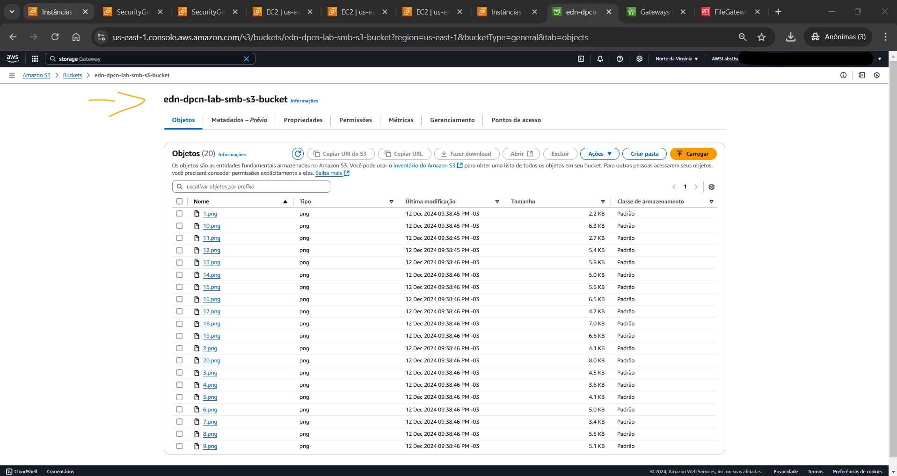

# Lab - AWS Storage Gateway: S3 File Gateway Setup, Configuration, and Monitoring   

### AWS Skill Builder <a href="../../">aws_skill_builder   </a>
### Training Category: <a href="../../self_paced_lab">self_paced_lab</a>
### Software/Subject: aws   
### Course: <a href="./">curso_spl_008 (Lab - AWS Storage Gateway: S3 File Gateway Setup, Configuration, and Monitoring)   </a>

#### Parceria da AWS com a Escola da Nuvem (EDN)   

---

### Theme:
- Cloud Computing

### Used Tools:
- Operating System (OS): 
  - Linux   
  - Windows 11   
  - Windows Server   
- Linux Distribution:
  - Amazon Linux   
- Cloud:
  - Amazon Web Services (AWS)   
- Cloud Services:
  - Amazon CloudWatch   
  - Amazon Elastic Compute Cloud (EC2)   
  - Amazon Simple Storage Service (S3)   
  - Amazon Virtual Private Cloud (VPC)   
  - AWS Storage Gateway   
  - Google Drive   
- Language:
  - HTML   
  - Markdown   
- Integrated Development Environment (IDE) and Text Editor:
  - Visual Studio Code (VS Code)   
- Versioning: 
  - Git   
- Repository:
  - GitHub   
- Command Line Interpreter (CLI):
  - Bash e Sh   
  - Windows PowerShell   
- Remote Desktop Software:
  - Remote Desktop Connection (RDC)   

---

<a name="item0"><h3>Course Strcuture:</h3></a>
1. Lab - AWS Storage Gateway: S3 File Gateway Setup, Configuration, and Monitoring 
1.1 <a href="#item01.1">Tarefa 1: Revise a arquitetura do laboratório</a> 
1.2 <a href="#item01.2">Tarefa 2: Criar buckets S3 para armazenamento de compartilhamento de arquivos</a> 
1.3 <a href="#item01.3">Tarefa 3: Implantar o dispositivo S3 File Gateway</a> 
1.4 <a href="#item01.4">Tarefa 4: Criar um compartilhamento de arquivo NFS</a> 
1.4 <a href="#item01.5">Tarefa 5: Examine o grupo de segurança, monte o compartilhamento de arquivos na instância do Linux e migre os dados</a> 
1.4 <a href="#item01.6">Tarefa 6: Criar um compartilhamento de arquivo SMB</a> 
1.4 <a href="#item01.7">Tarefa 7: Examine o grupo de segurança, monte o compartilhamento de arquivos na instância do Windows e migre os dados</a> 
1.4 <a href="#item01.8">Tarefa 8: Monitoramento do S3 File Gateway com o Amazon CloudWatch</a> 

---

### Objective:
O objetivo deste laboratório prático foi implantar e configurar um dispositivo *S3 File Gateway* do **AWS Storage Gateway** e em seguida criar dois compartilhamentos de arquivos. O primeiro compartilhamento foi `NFS` que copiava os dados locais de diferentes instâncias EC2 **Linux** para um bucket do **Amazon S3**. O segundo compartilhamento foi `SMB`, no qual os dados era compartilhados das instâncias EC2 **Windows Server** para outro bucket do **Amazon S3**. Como parte de monitoramento, as diferentes métricas do **AWS Storage Gateway** foram visualizadas no **Amazon CloudWatch**.

### Structure:
A estrutura do curso é formada por:
- Este arquivo de README.
- A pasta `0-aux`, pasta auxiliar com imagens utilizadas na construção desse arquivo de README. 

### Development:
Este curso foi um laboratório prático realizado na plataforma **AWS Skill Builder**, cuja subscrição foi devida a uma parceria entre a **AWS** e a **Escola da Nuvem**. A infraestrutura de cloud utilizada foi fornecida através de um sandbox do **AWS Skill Builder** que possibilitava acesso ao console da **AWS**. Contudo foi necessário seguir estritamente as orientações determinadas no laboratório. Dessa maneira, a forma de interação com os recursos da cloud foram sempre através do console fornecido pelo sandbox, a não ser em casos em que o próprio laboratório instruiu para utilização de outras ferramentas de interação como **AWS CLI** ou **AWS SDK**.

O laboratório do **AWS Skill Builder** tem o foco em executar apenas o que é orientado no escopo, todos os recursos ou serviços que podem ser requisitados adicionalmente já vêm provisionados por padrão pelo laboratório. Ao iniciar o laboratório, o sandbox do **AWS Skill Builder** provisiona diversos recursos e serviços para o funcionamento através de uma ou mais pilhas do **AWS CloudFormation** de forma automática. 

O acesso ao console no sandbox do **AWS Skill Builder** é realizado por meio de uma identidade federada. O Skill Builder funciona como um provedor de identidade (IdP), autenticando o usuário e vinculando-o a uma role do **AWS IAM** provisionada automaticamente por uma das pilhas do CloudFormation. Essa role concede permissões temporárias e mínimas necessárias para a execução do laboratório, garantindo segurança e controle sobre os recursos utilizados. O laboratório, por padrão, determina a região a ser utilizada e ela não deve ser alterada, somente se o próprio laboratório indicar. As configurações não informadas no laboratório devem ser sempre mantidas como padrão que estão.

<a name="item01.1"><h4>Tarefa 1: Revise a arquitetura do laboratório</h4></a>[Back to summary](#item0)

A arquitetura inicial do laboratório foi detalhada da seguinte maneira:
- Uma VPC de nome `VPC A` e CIDR `10.0.0.0/16`, contendo os seguintes recursos:
  - Um Internet Gateway (`a`).
  - Uma sub-rede pública (`Public Subnet A`) de CIDR `10.0.2.0/24`, contendo os seguintes recursos:
    - Uma instância do **Amazon EC2** **Linux** (`VPC-A Linux Server`) com um grupo de segurança (`VPC-A Linux access`) contendo as seguintes regras:
      - Entrada: porta `22` (`SSH`) permitida para o IP (`18.206.107.24/29`).
      - Saída: porta `111` (`TCP`) permitida para o IP (`10.0.3.0/24`), ou seja, para sub-rede pública (`Public Subnet B`).
      - Saída: porta `2049` (`NFS`) permitida para o IP (`10.0.3.0/24`), ou seja, para sub-rede pública (`Public Subnet B`).
    - Uma instância do **Amazon EC2** **Windows Server** (`VPC-A Windows Server`) com um grupo de segurança (`VPC-A Windows access`) contendo as seguintes regras:
      - Entrada: porta `3389` (`RDP`) permitida para todos os IPs (`0.0.0.0/0`).
      - Saída: porta `445` (`SMB`) permitida para o IP (`10.0.3.0/24`), ou seja, para sub-rede pública (`Public Subnet B`).
  - Uma sub-rede pública (`Public Subnet B`) com CIDR `10.0.3.0/24`, contendo os seguintes recursos:
    - Um grupo de segurança (`S3 File Gateway access`) contendo as seguintes regras:
      - Entrada: porta `80` (`HTTP`) liberada para todos os IPs (`0.0.0.0/0`).
      - Entrada: porta `2049` (`NFS`) liberada para o IP (`192.168.2.0/24`), ou seja, para sub-rede pública (`Public Subnet C`).
      - Entrada: porta `111` (`TCP`) liberada para o IP (`192.168.2.0/24`), ou seja, para sub-rede pública (`Public Subnet C`).
      - Entrada: porta `445` (`SMB`) liberada para o IP (`192.168.2.0/24`), ou seja, para sub-rede pública (`Public Subnet C`).
      - Saída: porta `443` (`HTTPS`) liberada para todos os IPs (`0.0.0.0/0`).
- Uma VPC de nome `VPC B` e CIDR `192.168.0.0/16`, contendo os seguintes recursos:
  - Um Internet Gateway (`a`).
  - Uma sub-rede pública (`Public Subnet C`) com CIDR `192.168.2.0/24`, contendo os seguintes recursos:
    - Uma instância do **Amazon EC2** **Linux** (`VPC-B Linux Server`) com um grupo de segurança (`VPC-B Linux access`) contendo as seguintes regras:
      - Entrada: porta `22` (`SSH`) permitida para o IP (`18.206.107.24/29`).
      - Saída: porta `2049` (`NFS`) permitida para o IP (`10.0.3.0/24`), ou seja, para sub-rede pública (`Public Subnet B`).
      - Saída: porta `111` (`NFS`) permitida para o IP (`10.0.3.0/24`), ou seja, para sub-rede pública (`Public Subnet B`).
    - Uma instância do **Amazon EC2** **Windows Server** (`VPC-B Windows Server`) com um grupo de segurança (`VPC-B Windows access`) contendo as seguintes regras:
      - Entrada: porta `3389` (`RDP`) permitida para o IP (`10.0.3.0/24`), ou seja, para sub-rede pública (`Public Subnet B`).
      - Saída: porta `445` (`SMB`) permitida para o IP (`10.0.3.0/24`), ou seja, para sub-rede pública (`Public Subnet B`).
- A VPC `VPC A` estava emparelhada com a VPC `VPC B`.

A primeira tarefa teve como objetivo apenas entender como estava arquitetura inicial e como ficaria a arquitetura final. As únicas mudanças na arquitetura inicial foram:
- Adição de uma instância do **AWS Storage Gateway** na sub-rede pública (`Public Subnet B`) que já possuía um grupo de segurança (`S3 File Gateway access`) com a porta `80` (`HTTP`) liberada.
- Adição de mais quatro regras de entrada nesse grupo de segurança vinculado a instância do Storage Gateway, liberando as portas: `22` (`SSH`), `111` (`TCP`), `2049` (`NFS`) e `445` (`SMB`).
- Adição de uma regra de entrada no grupo de segurança vinculado a instância **Linux** da VPC `VPC A` liberando a porta `2049` (`NFS`).
- Adição de uma regra de entrada no grupo de segurança vinculado a instância **Windows Server** da VPC `VPC A` liberando a porta `445` (`SMB`).
- Criação de dois buckets (`SMB S3 Bucket` e `NFS S3 Bucket`) no **Amazon S3** para armazenamento de compartilhamento de arquivos.

As imagens 01 e 02 ilustram a arquitetura inicial e final respectivamente.

<figure>
     
    <figcaption>Imagem 01.</figcaption>
</figure>
 

<figure>
     
    <figcaption>Imagem 02.</figcaption>
</figure>
 

<a name="item01.2"><h4>Tarefa 2: Criar buckets S3 para armazenamento de compartilhamento de arquivos</h4></a>[Back to summary](#item0)

Quando um *S3 File Gateway* é configurado com um compartilhamento de arquivos `NFS` ou `SMB`, é solicitado indicar o nome de um bucket do S3 para servir como local de armazenamento para esse compartilhamento de arquivos. Portanto, nesta tarefa dois buckets foram provisionados, cada um para uso com seu respectivo compartilhamento de arquivos (`NFS` e `SMB`). Os buckets foram criados com as configurações padrões e foram definidos os seguintes nomes: `edn-dpcn-lab-nfs-s3-bucket` e `edn-dpcn-lab-smb-s3-bucket`. A imagem 03 evidencia os dois buckets provisionados com sucesso.

<figure>
     
    <figcaption>Imagem 03.</figcaption>
</figure>
 

<a name="item01.3"><h4>Tarefa 3: Implantar o dispositivo S3 File Gateway</h4></a>[Back to summary](#item0)

Na tarefa 3, o objetivo foi implantar e configurar o appliance do *S3 File Gateway* como uma instância do **Amazon EC2**. Em um ambiente de produção, existe a possibilidade de implantar o appliance virtual em sistemas baseados em **VMware** ou **Hyper-V**, ou como um appliance físico. Um appliance é um dispositivo ou software dedicado a realizar uma função ou conjunto específico de funções. No caso do *S3 File Gateway*, o appliance refere-se a uma solução de software ou hardware que atua como uma ponte entre sistemas locais e o armazenamento na nuvem da **AWS**. Dessa forma, o appliance seria a instância do **Amazon EC2** que seria provisionada dentro do console do **AWS Storage Gateway**. As definições de criação do gateway ficaram da seguinte forma:
- Configurações do gateway
  - Nome do gateway: `Gateway de arquivo S3`.
  - Fuso horário do gateway: Foi selecionado `GMT -5:00 Horário do Leste (EUA e Canadá), Bogotá, Lima`. Optei por `GMT -3:00 Brasil, Buenos Aires, Georgetown`.
- Opções de gateway: foi selecionado `Amazon S3 File Gateway` como o `tipo de gateway`.
- Opções de plataforma:
  - Plataforma Host: `Amazon EC2`.
  - Iniciar a instância EC2: `Personalize suas configurações`.
- Configurar gateway no Amazon EC2: `Iniciar instâncias`. Uma nova aba foi aberta para o assistente de inicialização da instância EC2. Este link selecionava automaticamente a Amazon Machine Image (AMI) correta que deveria ser usada para o dispositivo de gateway de arquivo (`ami-0af49f660916c944f` (aws-storage-gateway-FILE_S3-1.26.7)).
  - Na página Iniciar uma instância as seguintes seleções foram feitas:
    - `Nomes e tags`: `Name:Dispositivo de gateway de arquivo S3`.
    - O menu suspenso `Resource types` foi localizado e selecionado `Volumes` e `Network interfaces`. Se ainda não estivesse sido selecionado, foi selecionado a opção `Instances`.
    - `Application and OS Images`: foi mantida AMI pré-selecionada para o **AWS Storage Gateway**.
    - `Tipo de instância`: `t2.xlarge`. Observe que `t2.xlarge` era o único tipo de instância que podia ser selecionada neste ambiente de laboratório. Selecionar qualquer outro tipo de instância resultava em uma mensagem de erro no final do assistente. O tipo de instância `t2.xlarge` foi usado apenas como um exemplo neste laboratório. Ao implantar um dispositivo Storage Gateway, sempre consulte os Requisitos de hardware e armazenamento na seção Recursos adicionais para o dimensionamento correto do dispositivo.
    - `Par de chaves (login)`: `AWSLabsKeyPair-byhj5i2of3777UnbaQhZ85`, que já tinha sido criado para este laboratório.
    - `Configurações de rede`: foi escolhido Editar e feito as seguintes seleções:
      - VPC: `VPC-A`.
      - Sub-rede: `VPC-A-Sub-rede-B`.
      - Atribuir IP público automaticamente: `Habilitar`.
      - Security Group: `S3 File Gateway access`. Este grupo possuía as seguintes regras:
        - Entrada: porta `80` (`HTTP`) para ativação do gateway.
        - Entrada: porta `111` e `2049` para comunicações `NFSv4.1` da `VPC-B Subnet-A`.
        - Entrada: porta `445` para comunicações `SMBv3` da `VPC-B Subnet-A`.
        - Saída: porta `443` para comunicação com o serviço **AWS Storage Gateway**.
    - `Configurar armazenamento`: foi adicionado um novo volume com as seguintes configurações:
      - Nome do dispositivo: `/dev/sdb`.
      - Tamanho (GiB): `150`.
      - Tipo de volume: `SSD de uso geral (gp2)`.
      - Excluir no encerramento: `Sim`.
    - Os valores das propriedades restantes foram mantidas padrão e a instância foi iniciada. Pode levar alguns minutos para que a instância do `S3 File Gateway Appliance` conclua suas verificações de status. Isso pode ser confirmado verificando a coluna Verificação de status, onde mostra Inicializando e, eventualmente, move para 2/2 verificações aprovadas. 
- Após a instância concluir as verificações de status ela pôde ser selecionada na configuração do gateway no **AWS Storage Gateway**. O IP público dessa instância foi copiado para ser utilizado mais adiante.
- `Platform options`: foi verificado se a instância estava selecionada e em `Confirmar configuração do gateway` foi escolhida a opção `Concluí todas as etapas acima e iniciei a instância do EC2`.
- Na tela `Conectar à AWS`, foram feitas as seguintes seleções:
  - `Opções de conexão do Gateway`: foi selecionado `Endereço IP` como opção de conexão.
  - `Endereço IP`: foi colado o endereço de IP público da instância copiado anteriormente.
  - `Opções de endpoint`: foi selecionado `Acessível publicamente` como ponto de extremidade do serviço.
- Na tela `Revisar e ativar`: foram verificadas as configurações e escolhido a opção `Ativar gateway`. Se ativado corretamente, a página `Configurar gateway` retornará `Gateway ativado com sucesso Arquivo Gateway`. Se a página de ativação expirar, a instância do gateway de arquivo ainda pode estar ficando online. Aguarde mais um ou dois minutos e então atualize a página.
- Na seção `Configurar armazenamento em cache`: será exibida a seguinte mensagem: `Status do disco: Preparando discos locais`.
- Após a conclusão do processamento, na seção `Configurar armazenamento em cache`, foi verificado e configurado as seguintes definições:
  - ID do disco: `/dev/sdb`.
  - Capacidade: `150 GiB`.
  - Alocado para: foi selecionado `Cache` no menu suspenso.
- Na seção do `grupo de logs do CloudWatch`: foi selecionado `Desativar registro`.
- Na seção de `alarmes do CloudWatch`: foi selecionado `Sem alarme`.
- Por fim, foi selecionado `configurar`.

A imagem 04 evidencia a criação do *S3 File Gateway* com sucesso. O próximo passo foi criar os compartilhamentos de arquivos para anexar aos hosts.

<figure>
     
    <figcaption>Imagem 04.</figcaption>
</figure>
 

<a name="item01.4"><h4>Tarefa 4: Criar um compartilhamento de arquivo NFS</h4></a>[Back to summary](#item0)

O primeiro compartilhamento de arquivo construído no gateway foi o `NFS`. Este foi configurado para usar o seu respectivo bucket do **Amazon S3** (`edn-dpcn-lab-nfs-s3-bucket`). As definições desse compartilhamento de arquivo são listadas abaixo:
- Na seção `Noções básicas`, foram realizadas as seguintes seleções:
  - Gateway: foi selecionado o *S3 File Gateway* de nome `Gateway de arquivo S3` cujo o ID era `sgw-B80C8DD1`. O *S3 File Gateway* pode ser diferente se um outro nome for utilizado para o gateway na Tarefa 3.
  - Protocolo de compartilhamento de arquivos: foi selecionado `NFS`.
  - Bucket S3: foi selecionado o nome do bucket S3 que foi criado na Tarefa 2 para uso com o NFS (`edn-dpcn-lab-nfs-s3-bucket`).
- `Personalizar configuração`:
  - Na página `Escolher gateway`: foi escolhida a opção `Avançar`.
  - Na página de `armazenamento do Connected S3`: foram feitas as seguintes seleções:
    - Foi localizado o menu suspenso `Classe de armazenamento para novos objetos` e escolhida a opção `Padrão` (`Standard`).
    - Foi localizado o menu suspenso da `função IAM` e selecionada a ARN da função `FileGatewayRole` (`arn:aws:iam::325009960082:role/FileGatewayRole`).
- Na página `Controlar acesso`: foi mantida as configurações padrão e selecionado `Avançar`.
- Na página `Revisar e iniciar`: foi selecionada a opção `Criar`. O compartilhamento de arquivo levava alguns minutos para ser criado. Foi monitorado a criação revisando a coluna `Status` e aguarde até que ela mudasse de `Updating` para `Available`. Caso não alterasse, foi necessário atualizar as informações da página.
- Em `Compartilhamentos de arquivos`, no menu suspenso `Ações`, foi escolhida a opção `Editar configurações de acesso ao compartilhamento de arquivos`.
  - Para `clientes permitidos`: foi adicionado `10.0.2.0/24` para conceder acesso ao compartilhamento do host na `VPC-A Subnet-A` (`VPC-A Linux Server`).
  - Para `clientes permitidos`: foi adicionado `192.168.2.0/24` para conceder acesso ao compartilhamento do host na `VPC-B Subnet-C` (`VPC-B Linux Server`).

A imagem 05 evidencia a criação do compartilhamento de arquivo `NFS` configurado para seu respectivo bucket e com acesso permitido para as duas instâncias EC2 **Linux**, cada uma localizada em uma VPC diferente (`VPC-A Subnet-A` e `VPC-B Subnet-C`).

<figure>
     
    <figcaption>Imagem 05.</figcaption>
</figure>
 

<a name="item01.5"><h4>Tarefa 5: Examine o grupo de segurança, monte o compartilhamento de arquivos na instância do Linux e migre os dados</h4></a>[Back to summary](#item0)

Com o primeiro compartilhamento de arquivo criado, nesta tarefa o objetivo foi permitir a conexão `NFS` da instância **Linux** (`VPC-A Linux Server`) da sub-rede pública `VPC-A Subnet-A` com a instância `Dispositivo de gateway de arquivo S3` e então executar a montagem do compartilhamento dentro das duas instâncias **Linux** (`VPC-A Linux Server` e `VPC-B Linux Server`). Dessa forma foi necessário adicionar uma regra de entrada na grupo de segurança vinculado a instância gateway, liberando comunicação na porta `2049` (`NFS`) para a sub-rede pública (`VPC-A Subnet-A`), cujo CIDR era `10.0.2.0/24`. Nesse mesmo grupo, outra regra foi necessária para permitir a comunicação na porta `111` para a mesma sub-rede pública (`VPC-A Subnet-A`), cujo CIDR era `10.0.2.0/24`. Essa regra também estava relacionada ao compartilhamento de arquivos `NFS`. Essas duas regras já vieram adicionadas neste grupo de segurança para sub-rede pública `VPC-B Subnet-C`, cujo CIDR era `192.168.2.0/24`. Caso fosse utilizado o `NFS` na versão v3 ao invés de v4.1, a porta a ser liberada seria `2048` e não `2049`.

A imagem 06 mostra a adição dessas regras nos respectivos security groups. Um ponto importante foi que a regra no grupo de segurança da instância gateway que liberava a porta `80` (`HTTP`) só era necessária para ativação do dispositivo *S3 File Gateway* e poderia ser excluída quando a ativação fosse concluída. Como a ativação já tinha sido feita, a regra foi excluída. Outras regras foram necessárias nesse security group para diferentes comunicações, mas foi optado por adicionar a regra no momento exato. Sendo assim, nesse momento, esse grupo ficou com cinco regras de entrada.

<figure>
     
    <figcaption>Imagem 06.</figcaption>
</figure>
 

Após isso, essa primeira instância foi acessada remotamente utilizando o IP público da instância e o usuário padrão de instâncias **Amazon Linux**, `ec2-user`, através do console do **Amazon EC2** (`EC2 Instance Connect`). No terminal que foi disponibilizado em outra aba do navegador da máquina física **Windows**, onde a sessão **Bash** era aberta com a instância, alguns comandos foram executados para montar o compartilhamento dentro dessa instância. O primeiro comando foi `ls /media/data` para verificar os dados de amostra que existiam neste host, que no caso eram 20 arquivos de imagem no formato .png. O segundo comando executado foi `sudo mkdir -p /mnt/nfs/s3` para criar o diretório que seria sincronizado com o bucket do S3. Em seguida, com o comando `sudo mount -t nfs -o nolock,hard 10.0.3.141:/edn-dpcn-lab-nfs-s3-bucket /mnt/nfs/s3`, passando o IP privado da instância do gateway (`10.0.3.141`), o nome do bucket S3 (`edn-dpcn-lab-nfs-s3-bucket`) e o diretório criado como ponto de montagem na instância `VPC-A Linux Server`, o compartilhamento de arquivo `NFS` foi montado. Caso os security groups das duas instâncias (`VPC-A Linux Server` e `VPC-B Linux Server`) não tivessem configurados para comunicação `NFS`, o tempo limite iria ser atingido após cinco minutos aproximadamente. Com o comando `df -h` foram listados todos sistemas de arquivos montados nessa instância, conforme imagem 07.

<figure>
     
    <figcaption>Imagem 07.</figcaption>
</figure>
 

Com o ponto de montagem configurado na instância, o comando `cp -v /media/data/*.png /mnt/nfs/s3` foi executado para copiar os 20 arquivos do diretório `/media/data` para o diretório `/mnt/nfs/s3`, que tinha sido definido como ponto de montagem. Ao adicionar qualquer arquivo a esse diretório, eles eram imediatamente enviados pela rede para instância de gateway. O *File Gateway*, por sua vez, fazia o upload desses arquivos para o respectivo bucket do S3 configurado, no caso o `nfs`, gerenciando a comunicação com a **AWS** automaticamente. Os arquivos não ficam armazenados na instância de gateway, ela funciona como um intermediário para transferir os arquivos para o bucket. Essa comunicação entre a instância gateway e as outras duas instâncias (`VPC-A Linux Server` e `VPC-B Linux Server`) já tinha sido configurada ao criar o *File Gateway* no **AWS Storage Gateway**. A imagem 08 evidencia os 20 arquivos dentro do bucket armazenados como objetos.

<figure>
     
    <figcaption>Imagem 08.</figcaption>
</figure>
 

Na sequência, um novo acesso remoto foi realizado pelo recurso *EC2 Instance Connect*, mas agora na instância `VPC-B Linux Server`. O usuário padrão `ec2-user` foi o utilizado para acessar a máquina. No terminal dela que era disponibilizado na outra aba do navegador da máquina física **Windows**, os mesmos comandos para a montagem do compartilhamento de arquivos `NFS` foi executado. Primeiro o comando `sudo mkdir -p /mnt/nfs/s3` criou o diretório que serviria como ponto de montagem. Em seguida, a montagem foi executada com o comando `sudo mount -t nfs -o nolock,hard 10.0.3.141:/edn-dpcn-lab-nfs-s3-bucket /mnt/nfs/s3`, passando o IP privado da instância de gateway (`10.0.3.141`), o nome do bucket criado (`edn-dpcn-lab-nfs-s3-bucket`) e o diretório definido como ponto de montagem. Com o comando `df -h` todos sistemas de arquivos montados nessa máquina eram listados. Por fim, ao executar o comando `ls /mnt/nfs/s3`, os 20 arquivos enviados da instância `VPC-A Linux Server` para o bucket do S3 (`edn-dpcn-lab-nfs-s3-bucket`) eram listados nesse diretório da instância `VPC-B Linux Server`, conforme mostrado na imagem 09.

<figure>
     
    <figcaption>Imagem 09.</figcaption>
</figure>
 

<a name="item01.6"><h4>Tarefa 6: Criar um compartilhamento de arquivo SMB</h4></a>[Back to summary](#item0)

A sexta e sétima tarefa eram uma repetição das tarefas 4 e 5, mas agora o compartilhamento de arquivo trabalhado era o `SMB`, logo, as instâncias utilizadas eram **Windows Server**. Para criar esse segundo compartilhamento de arquivo, o *File Gateway* provisionado de nome `Gateway de arquivo S3` no **AWS Storage Gateway** foi acessado. Neste laboratório foi necessário criar uma senha para o usuário convidado para acessar o compartilhamento de arquivo. Em um ambiente de produção, é muito mais provável que seja utilizado o **Active Directory (AD)** como uma fonte de autenticação. Ao usar o **Active Directory (AD)**, é necessário garantir que as seguintes portas sejam abertas, além das que foram configuradas nesta tarefa:
- UDP 137: Serviço de nomes.
- UDP 138: Serviço de datagrama.
- TCP 389: Agente do Sistema de Diretório; conexão do cliente.
- TCP 636: LDAPS (Lightweight Directory Access Protocol (LDAP) sobre Secure Socket Layer (SSL)).

As configurações realizadas nesse segundo compartilhamento de arquivos foram as seguintes:
- No gateway foi selecionado o gateway de nome `Gateway de arquivo S3` e em `Ações` menu suspenso, foi escolhido `Editar configurações SMB` e, em seguida, selecionada a opção `Configurações de acesso de convidado`.
- Na tela `Editar configurações de acesso de convidado`, no campo `Senha de convidado`, foi digitado `AWSlabs1342!@`. Em um ambiente de produção, se estivesse unindo o *S3 File Gateway* a um domínio do **Active Directory (AD)**, isso seria feito nesta tela. É necessário unir o *S3 File Gateway* a um domínio ou definir uma senha de convidado antes de poder criar um compartilhamento de arquivo `SMB`.
- No menu de navegação à esquerda, foi escolhido `Compartilhamentos de arquivos`, e então iniciada a criação.
- Na tela `Criar compartilhamento de arquivo`, na seção `Noções básicas`, foram feitas as seguintes seleções:
  - Gateway: foi selecionado o gateway de nome `Gateway de arquivo S3`, cujo Id era `sgw-B80C8DD1`.
  - Protocolo de compartilhamento de arquivos: foi selecionado `SMB`.
  - Bucket S3: foi selecionado o nome do bucket S3 que foi criado na Tarefa 2 para uso com o `SMB`, `edn-dpcn-lab-smb-s3-bucket`.
  - Autenticação do usuário: foi selecionado `Acesso de convidado` no menu suspenso.
  - `Personalizar configuração`:
    - Na página `Escolher gateway`, foi escolhida a opção `Avançar`.
    - Na página de `armazenamento do Connected S3`, foram feitas as seguintes seleções:
      - Foi localizado o menu suspenso `Classe de armazenamento para novos objetos` e selecionado `Padrão` (`Standard`).
      - Foi localizado o menu suspenso da `função IAM` e selecionada a ARN da função `FileGatewayRole` (`arn:aws:iam::325009960082:role/FileGatewayRole`).
    - Na página `Controlar acesso`, foram mantidas as configurações padrão e escolhido `Avançar`. Contudo, não dava para avançar. Foi preciso ir em `Autenticação de usuários` que estava selecionado `Acesso do convidado` e alterar para informar a senha cadastra anteriormente nesta mesma tarefa (`AWSlabs1342!@`).
    - Na página `Revisar e iniciar`, foi selecionado a opção `Criar`. O compartilhamento de arquivo levava alguns minutos para ser criado. Dessa forma, foi monitorado a criação revisando a coluna `Status` e aguardado até que ela mudasse de `Updating` para `Available`. Pode ser necessário clicar em atualização para atualizar as informações neste console.

A imagem 10 exibe esse segundo compartilhamento de arquivos criado.

<figure>
     
    <figcaption>Imagem 10.</figcaption>
</figure>
 

<a name="item01.7"><h4>Tarefa 7: Examine o grupo de segurança, monte o compartilhamento de arquivos na instância do Windows e migre os dados</h4></a>[Back to summary](#item0)

Nesta tarefa, antes de fazer a montagem do compartilhamento de arquivo `SMB` nas instâncias, foi preciso adicionar as regras que estavam faltando nos grupos de segurança da instância gateway, cujo nome era `S3 File Gateway access`. Nesse grupo, já haviam cinco regras de entrada, sendo quatro para compartilhamento de arquivos `NFS` que já tinha sido feito nas tarefas anteriores. A outra era para o compartilhamento de arquivo `SMB`, que liberava a porta `445` (`SMB`) para o CIDR `192.168.2.0/24` que era para a sub-rede pública `VPC-A Subnet-A`. Uma outra regra de entrada exatamente igual a essa anterior foi adicionada, apenas mudando o CIDR para `10.0.2.0/24` que era para a sub-rede pública `VPC-B Subnet-C`. Caso a versão do `SMB` fosse v2 ao invés de v3, a porta que deveria ser aberta era `139` e não `445`. A imagem 11 mostra como ficou a configuração das regras no grupo de segurança.

A primeira regra a ser adicionada foi no security group da instância **Windows Server** da sub-rede pública (`VPC-A Subnet-A`) que foi uma regra de entrada liberando a porta `445` (`SMB`) para CIDR da sub-rede pública (`VPC-A Subnet-B`), onde estava a instância gateway. 

<figure>
     
    <figcaption>Imagem 11.</figcaption>
</figure>
 

Após isso, o primeiro acesso remoto foi executado na instância `VPC-A Windows Server` utilizando o software **Remote Desktop Connection (RDC)** da máquina física **Windows**. Neste software foi passado o IP ou DNS público da instância em questão e também o nome de usuário que desejava-se conectar, no caso era o usuário padrão (`Administrator`). A senha utilizada foi a criada (`AWSlabs1342!@`) para autenticação de usuário convidado. Dentro da interface gráfica gerada, foi aberto o **Windows PowerShell** para executar os comandos necessários para montar o compartilhamento de arquivo na instância. O comando executado foi o `net use S: \\10.0.3.141\edn-dpcn-lab-smb-s3-bucket /user:sgw-B80C8DD1\smbguest` passando o IP privado da instância de gateway criada (`10.0.3.141`), o nome do bucket provisionado (`edn-dpcn-lab-smb-s3-bucket`) e path da pasta que funcionaria como ponto de montagem. Nesse path, o nome de usuário era o Id do gateway criado no **AWS Storage Gateway** (`sgw-B80C8DD1`). Assim como na montagem do compartilhamento de arquivo `NFS`, caso as regras necessárias não fossem adicionadas nos grupos de segurança, o comando atingiria o tempo limite após aproximadamente cinco minutos. Em seguida para confirmação que o compartilhamento foi montado, foi aberto o explorador de arquivos do **Windows Server** e escolhida a opção `Este PC` e visualizada a unidade `S:` que foi montada com sucesso, ou então utilizado o comando `explorer.exe "S:\"` conforme imagem 12.

<!-- Para descobrir a senha foi preciso baixar o arquivo de chave privada do par de chaves vinculado a essa instância no formato .pem e utilizar no console do EC2 para desencriptar e gerar a senha. -->

<figure>
     
    <figcaption>Imagem 12.</figcaption>
</figure>
 

Com o comando `Copy-Item -Path "C:\media\data\*" -Destination "S:\" -Recurse`, os 20 arquivos da pasta `C:\media\data\` foram copiados para a pasta definida como ponto de montagem. Com o comando `Get-ChildItem -Path  "S:\"` foram listados os arquivos copiados no ponto de montagem, conforme imagem 13. Imediatamente, o *File Gateway* configurado utilizava a instância gateway para fazer upload desses 20 arquivos no bucket S3 determinado (`edn-dpcn-lab-smb-s3-bucket`) armazenando-os como objetos. A imagem 14 evidencia os 20 arquivos dentro do bucket do **Amazon S3**.

<figure>
     
    <figcaption>Imagem 13.</figcaption>
</figure>
 

<figure>
     
    <figcaption>Imagem 14.</figcaption>
</figure>
 

Agora, um novo acesso remoto gráfico foi executado com o software **RDC** da máquina física **Windows** para acessar a instância `VPC-B Windows Server`. Para autenticação foi utilizado o usuário padrão dessa máquina (`Administrator`) com a senha criada no compartilhamento de arquivo `SMB` criado no gateway do **AWS Storage Gateway** (`AWSlabs1342!@`). Na interface gráfica foi aberto novamente o **Windows PowerShell** para fazer a montagem do compartilhamento `SMB` nessa instância. O comando executado foi `net use S: \\10.0.3.141\edn-dpcn-lab-smb-s3-bucket /user:sgw-B80C8DD1\smbguest`, passando o IP privado da instância de *File Gateway* criada (`10.0.3.141`), o nome do bucket provisionado (`edn-dpcn-lab-smb-s3-bucket`) e path da pasta que funcionaria como ponto de montagem, cujo usuário era o Id do gateway criado no **AWS Storage Gateway** (`sgw-B80C8DD1`). Em seguida, com o comando `explorer.exe "S:\"` essa pasta foi aberta no explorador de arquivos, confirmando na imagem 15, os 20 arquivos enviados da outra instância para o bucket do S3.

<figure>
     
    <figcaption>Imagem 15.</figcaption>
</figure>
 

A última ação realizada foi excluir cinco dos 20 arquivos pela instância `VPC-B Windows Server` e verificar se esses mesmos arquivos tinham sido excluídos do bucket S3 e não era mais visualizados também pela instância `VPC-A Windows Server`. A imagem 16 mostra o comando `Get-ChildItem -Path "S:\"` executado no **Windows PowerShell** da instância `VPC-A Windows Server` evidenciado apenas 15 arquivos. Já a imagem 17 exibe essa mesma comprovação no bucket do S3.

<figure>
     
    <figcaption>Imagem 16.</figcaption>
</figure>
 

<figure>
     
    <figcaption>Imagem 17.</figcaption>
</figure>
 

<a name="item01.8"><h4>Tarefa 8: Monitoramento do S3 File Gateway com o Amazon CloudWatch</h4></a>[Back to summary](#item0)

O **AWS Storage Gateway** é integrado ao **Amazon CloudWatch**, que monitora os recursos da **AWS** em tempo real. O CloudWatch pode ser utilizado para coletar e rastrear métricas, que são variáveis ​​que pode ser medidas para os recursos e aplicativos. Algumas das métricas importantes a serem observadas para monitorar o throughput entre o *S3 File Gateway* e a **AWS** são `ReadBytes` e `WriteBytes`. Da mesma forma, para monitorar o desempenho do cache, pode ser utilizadas métricas como `CacheHitPercent`, `CachePercentDirty` e `CachePercentUsed`. Além disso, pode ser usado `CloudBytesUploaded` e `CloudBytesDownloaded` para detectar possíveis falhas de conexão entre o *S3 File Gateway* e a **AWS**.

Na última tarefa deste laboratório, o **Amazon CloudWatch** foi utilizado para monitorar os recursos do *S3 File Gateway* e as métricas apresentadas acima. Para isso, foi necessário acessar o gateway que foi provisionado. Na opção `Métricas` foi escolhida a opção `Métricas do CloudWatch` e uma nova aba foi aberta no console do **Amazon CloudWatch**. Este link selecionava automaticamente as métricas gráficas padrão para o recurso *S3 File Gateway*. A opção filtro `Número` foi selecionada e o intervalo de tempo foi ajustado para `30 minutos` para obter melhores resultados nas métricas, conforme visualizado na imagem 18.

<figure>
     
    <figcaption>Imagem 18.</figcaption>
</figure>
 

No gráfico numérico, foram analisadas as seguintes métricas importantes:
- `CloudBytesBaixado`: 2,34kB (0kb no meu). `CloudBytesBaixado` é o número total de bytes que o gateway baixou da **AWS** durante o período do relatório.
- `CloudBytesCarregado`: 51,7 kB (0kb no meu). `CloudBytesCarregado` é o número total de bytes que o gateway carregou na **AWS** durante o período do relatório.
- `Percentual de CacheHit`: 100%. `Porcentagem de CacheHit` é a porcentagem de operações de leitura de aplicativos dos compartilhamentos de arquivos que são servidos pelo cache. Idealmente, `Porcentagem de CacheHit` deve estar próximo de 100% e isso significa que o aplicativo está lendo dados do cache.
- `CachePercentUsado`: 0,14%. `CachePercentualUsado` é a contribuição do compartilhamento de arquivo para o uso percentual geral do armazenamento em cache do gateway. Um alto `CachePercentualUsado` é bom, mas quando essa métrica chega a 100%, o `Porcentagem de CacheHit` é impactado. 100% `CachePercentualUsado` pode indicar que o cache é muito pequeno para o conjunto de trabalho. Nesse caso,` CachePercentualUsado` estava em `0,14%`, o que indicava que o gateway tinha cache suficiente e não era preciso aumentar o tamanho do cache do gateway.
- `CachePercentDirty`: 0%. O `CachePorcentagemSuja` é a contribuição do compartilhamento de arquivo para a porcentagem geral do cache do gateway que não foi persistido na **AWS**. Um baixo `CachePorcentagemSuja` indica que o recurso Storage Gateway está funcionando conforme o esperado.