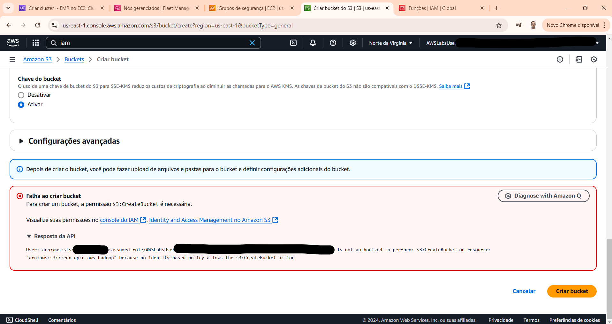
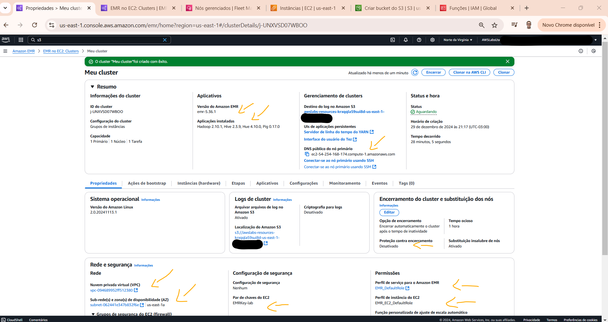
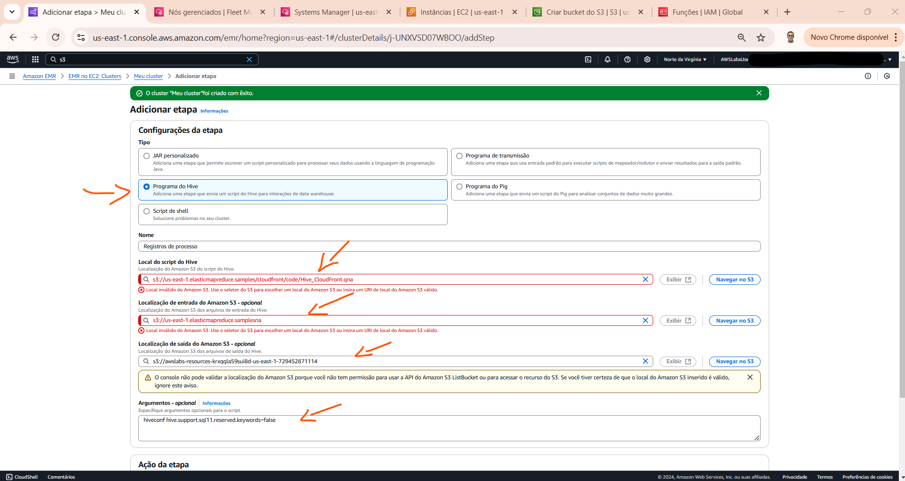
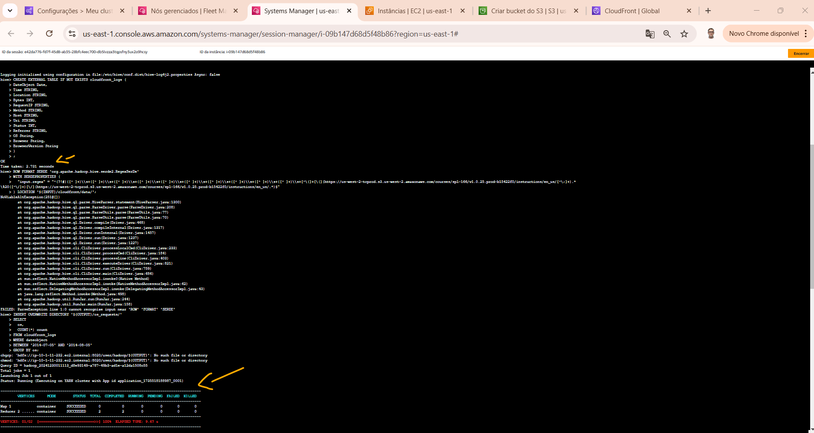
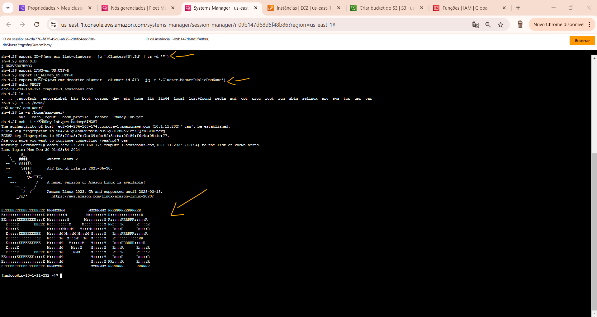
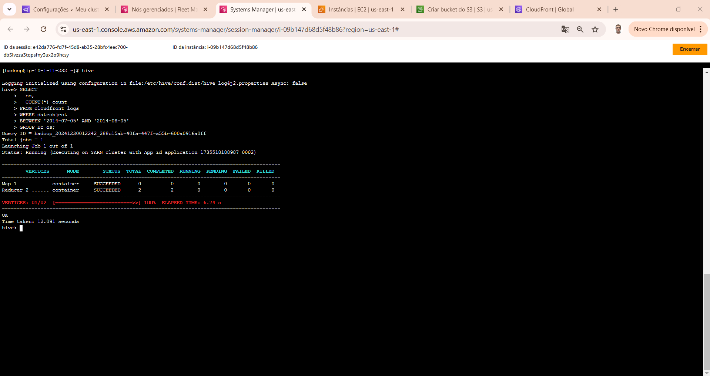
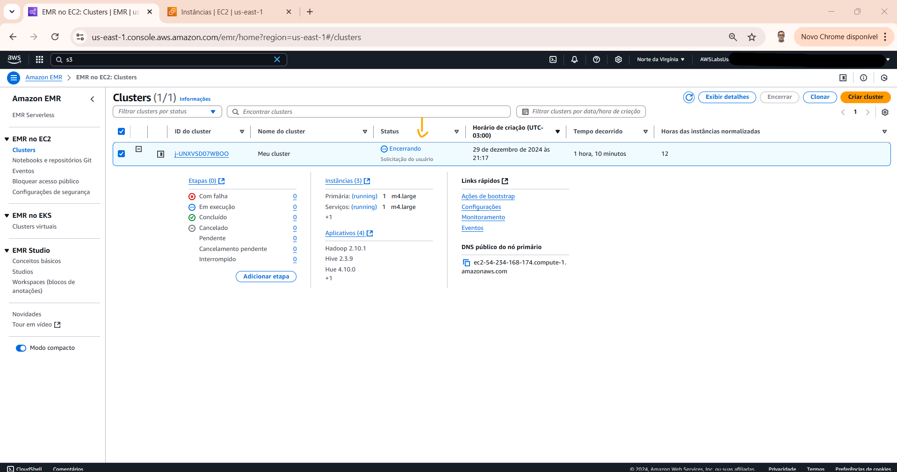

# Lab - Analyze Big Data with Hadoop   

### AWS Skill Builder <a href="../../">aws_skill_builder   </a>
### Training Category: <a href="../../self_paced_lab">self_paced_lab</a>
### Software/Subject: aws   
### Course: <a href="./">curso_spl_009 (Lab - Analyze Big Data with Hadoop)   </a>

#### Parceria da AWS com a Escola da Nuvem (EDN)   

---

### Theme:
- Cloud Computing

### Used Tools:
- Operating System (OS): 
  - Linux   
  - Windows 11   
- Linux Distribution:
  - Amazon Linux   
- Cloud:
  - Amazon Web Services (AWS)   
- Cloud Services:
  - Amazon Elastic Compute Cloud (EC2)   
  - Amazon Elastic MapReduce (EMR)   
  - Amazon Simple Storage Service (S3)   
  - Amazon Virtual Private Cloud (VPC)   
  - Google Drive   
- Language:
  - Apache Hive Query Language (Apache HiveQL)   
  - HTML   
  - Markdown   
- Integrated Development Environment (IDE) and Text Editor:
  - Visual Studio Code (VS Code)   
- Versioning: 
  - Git   
- Repository:
  - GitHub   
- Big Data:
  - Apache Hadoop   
  - Apache Hive   

---

<a name="item0"><h3>Course Strcuture:</h3></a>
1. Lab - Analyze Big Data with Hadoop 
1.1 <a href="#item01.1">Tarefa 1: Criar um bucket do Amazon S3</a> 
1.2 <a href="#item01.2">Tarefa 2: iniciar um cluster do Amazon EMR</a> 
1.3 <a href="#item01.3">Tarefa 3: Processe seus dados de amostra executando um script Hive</a> 
1.4 <a href="#item01.4">Tarefa 4: Visualizar os resultados</a> 
1.5 <a href="#item01.5">Tarefa 5: conectar-se à CLI do cluster EMR e executar a consulta usando HiveQL</a> 
1.6 <a href="#item01.6">Tarefa 6: Encerre seu cluster Amazon EMR</a> 

---

### Objective:
O objetivo deste laboratório prático foi implantar um cluster **Hadoop** totalmente funcional no serviço **Amazon EMR** e com um script **HiveQL** processar os dados de log de amostra armazenados em um bucket do **Amazon Simple Storage Service (S3)**. **HiveQL** é uma linguagem de script semelhante a SQL para armazenamento e análise de dados. O **Amazon EMR** é um serviço gerenciado que torna rápido, fácil e econômico executar o **Apache Hadoop** e o **Apache Spark** para processar grandes quantidades de dados. O **Amazon EMR** também oferece suporte a ferramentas Hadoop poderosas e comprovadas, como **Presto**, **Hive**, **Pig**, **HBase** e muito mais.

### Structure:
A estrutura do curso é formada por:
- Este arquivo de README.
- A pasta `0-aux`, pasta auxiliar com imagens utilizadas na construção desse arquivo de README. 

### Development:
Este curso foi um laboratório prático realizado na plataforma **AWS Skill Builder**, cuja subscrição foi devida a uma parceria entre a **AWS** e a **Escola da Nuvem**. A infraestrutura de cloud utilizada foi fornecida através de um sandbox do **AWS Skill Builder** que possibilitava acesso ao console da **AWS**. Contudo foi necessário seguir estritamente as orientações determinadas no laboratório. Dessa maneira, a forma de interação com os recursos da cloud foram sempre através do console fornecido pelo sandbox, a não ser em casos em que o próprio laboratório instruiu para utilização de outras ferramentas de interação como **AWS CLI** ou **AWS SDK**.

O laboratório do **AWS Skill Builder** tem o foco em executar apenas o que é orientado no escopo, todos os recursos ou serviços que podem ser requisitados adicionalmente já vêm provisionados por padrão pelo laboratório. Ao iniciar o laboratório, o sandbox do **AWS Skill Builder** provisiona diversos recursos e serviços para o funcionamento através de uma ou mais pilhas do **AWS CloudFormation** de forma automática. 

O acesso ao console no sandbox do **AWS Skill Builder** é realizado por meio de uma identidade federada. O Skill Builder funciona como um provedor de identidade (IdP), autenticando o usuário e vinculando-o a uma role do **AWS IAM** provisionada automaticamente por uma das pilhas do CloudFormation. Essa role concede permissões temporárias e mínimas necessárias para a execução do laboratório, garantindo segurança e controle sobre os recursos utilizados. O laboratório, por padrão, determina a região a ser utilizada e ela não deve ser alterada, somente se o próprio laboratório indicar. As configurações não informadas no laboratório devem ser sempre mantidas como padrão que estão.

<a name="item01.1"><h4>Tarefa 1: Criar um bucket do Amazon S3</h4></a>[Back to summary](#item0)

Na primeira tarefa, o objetivo foi provisionar o bucket do **Amazon S3** para armazenar os arquivos de log e dados de saída. Na configuração desse bucket apenas o seguinte nome foi definido: `edn-dpcn-aws-hadoop`. A imagem 01 exibe o bucket criado.

<figure>
     
    <figcaption>Imagem 01.</figcaption>
</figure>
 

<a name="item01.2"><h4>Tarefa 2: iniciar um cluster do Amazon EMR</h4></a>[Back to summary](#item0)

A tarefa seguinte foi iniciar o cluster **Apache Hadoop** no serviço **Amazon Elastic MapReduce (EMR)** para processar os dados. Antes de iniciar a criação, foi necessário garantir que a região selecionada no console era igual a indicada nas informações do lab (`us-east-1`). O cluster foi definido com as seguintes configurações:
- Nome: `Meu cluster`.
- Versão Amazon EMR: `emr-5.36.1`.
- Pacote de aplicativos: foi escolha `Personalizado` e selecionados os seguintes aplicativos, caso ainda não tenham sido selecionados:
  - **Hue**
  - **Hadoop**
  - **Hive**
  - **Pig**
- Na seção `Configuração do cluster - necessária`; foi configurado o seguinte:
  - Foi escolhido `Grupos de instâncias uniformes`.
  - Para `Primary`, `Core` e `Task 1 de 1`: foi selecionado `m4.large` no menu suspenso `Escolher tipo de instância EC2`.
- Na seção `Rede - necessária`, foi configurado o seguinte:
  - Para `Nuvem privada virtual (VPC)`: foi escolhida a opção `Procurar`.
  - Na janela pop-up `Escolher VPC`: foi selecionado a VPC `Lab VPC` e escolhida a o
  - A seção `Grupos de segurança do EC2 (firewall)` foi expandida e, para o `grupo de segurança gerenciado pelo EMR`, foi selecionado o grupo de segurança que continha o nome `xxxx-EmrSecurityGroup-xxxx` para o nó `Primary` e os nós `Core` e de `Task`.
- Na seção `Encerramento do cluster e substituição do nó`, foi desmarcado `Use proteção de terminação`.
- Foi expandida a seção `Logs do cluster` e configure o seguinte:
  - Foi selecionado `Publique logs específicos do cluster no Amazon S3`.
  - Para localização do Amazon S3: foi escolhida `Procurar S3`.
  - Na janela pop-up `Escolher local do Amazon S3`: foi selecionado o bucket do Hadoop que foi criado anteriormente (`edn-dpcn-aws-hadoop`).
- Na seção `Configuração de segurança e par de chaves EC2`: foi configurado o seguinte:
  - Para o par de chaves Amazon EC2 para SSH no cluster: foi escolhido `Procurar`.
  - Na janela pop-up Escolher par de chaves do Amazon EC2 para SSH no cluster: foi selecionado o par de chaves chamado `EMRKey-lab` que já veio criado pelas pilhas do CloudFormation.
-  Na seção `Funções de gerenciamento de identidade e acesso (IAM) - obrigatórias`, foi configurado o seguinte:
  - Para a função de serviço do Amazon EMR: foi selecionada a role `EMR_DefaultRole` que também já tinha sido criada.
  - Para o perfil de instância do EC2 para Amazon EMR: foi selecionado o perfil de instância `EMR_EC2_DefaultRole` que também já tinha sido construído.

A imagem 02 evidencia o cluster provisionado com sucesso. Pode ser que o cluster levasse aproximadamente cinco minutos para ser iniciado.

<figure>
     
    <figcaption>Imagem 02.</figcaption>
</figure>
 

A configuração padrão instalou automaticamente vários aplicativos padrões no cluster:
- **Apache Hadoop**: é um projeto de software de código aberto que pode ser usado para processar grandes conjuntos de dados de forma eficiente. Em vez de usar um computador grande para processar e armazenar os dados, o Hadoop usa clusters de hardware de commodity para analisar conjuntos de dados massivos em paralelo (MPP).
- **Ganglia**: O projeto de código aberto **Ganglia** é um sistema escalável e distribuído, projetado para monitorar clusters e grades, minimizando o impacto em seu desempenho. O **Ganglia** pode gerar relatórios e visualizar o desempenho do cluster como um todo, bem como inspecionar o desempenho de nós individuais.
- **Apache Tez**: é uma estrutura para criar um grafo acíclico direcionado (DAG) complexo de tarefas para processamento de dados. Em alguns casos, ele é usado como uma alternativa ao **Apache Hadoop MapReduce**. Por exemplo, os fluxos de trabalho Pig e Hive podem ser executados usando o Hadoop MapReduce ou podem usar o Tez como um mecanismo de execução.
- **Apache Hive**: é um data warehouse de código aberto e um pacote analítico que roda em cima de um cluster Hadoop. Os scripts do Hive usam uma linguagem semelhante a SQL chamada **Hive Query Language (HiveQL)** que abstrai modelos de programação e suporta interações típicas de data warehouse. O Hive permite que sejam evitadas as complexidades de escrever trabalhos Tez com base em gráficos acíclicos direcionados (DAGs) ou programas MapReduce em uma linguagem de computador de nível inferior, como **Java**.
- **Hadoop User Experience (Hue)**: é uma interface gráfica de usuário de código aberto, baseada na web, para uso com **Amazon EMR** e **Apache Hadoop**. Hue agrupa vários projetos diferentes do ecossistema Hadoop em uma interface configurável para o cluster **Amazon EMR**.
- **Apache Pig**: é uma biblioteca Apache de código aberto que roda em cima do Hadoop. A biblioteca pega comandos do tipo SQL escritos em uma linguagem chamada **Pig Latin** e converte esses comandos em trabalhos Tez baseados em gráficos acíclicos direcionados (DAGs) ou programas MapReduce. Não é preciso escrever código complexo usando uma linguagem de computador de nível inferior, como **Java**.

Resumidamente:
- **Apache Hadoop**: é um projeto de software de código aberto que pode ser usado para processar grandes conjuntos de dados de forma eficiente. Em vez de usar um computador grande para processar e armazenar os dados, o Hadoop usa clusters de hardware de commodity para analisar conjuntos de dados massivos em paralelo (MPP).
- **Ganglia**: Monitoramento.
- **Apache Tez**: processamento com DAGs.
- **Apache Hive**: Data Warehouse e processamento com linguagem HiveQL.
- **Hadoop User Experience (Hue)**: Interface Gráfica de Usuário (GUI) para MapReduce.
- **Apache Pig**: biblioteca que converte comandos escritos em linguagem **Pig Latin** em trabalhos do Tez, ou seja, DAGs, ou em programas MapReduce.

<a name="item01.3"><h4>Tarefa 3: Processe seus dados de amostra executando um script Hive</h4></a>[Back to summary](#item0)

<figure>
     
    <figcaption>Imagem 03.</figcaption>
</figure>
 

<figure>
     
    <figcaption>Imagem 04.</figcaption>
</figure>
 

<a name="item01.4"><h4>Tarefa 4: Visualizar os resultados</h4></a>[Back to summary](#item0)

<figure>
     
    <figcaption>Imagem 05.</figcaption>
</figure>
 

<a name="item01.5"><h4>Tarefa 5: conectar-se à CLI do cluster EMR e executar a consulta usando HiveQL</h4></a>[Back to summary](#item0)

<figure>
     
    <figcaption>Imagem 06.</figcaption>
</figure>
 

<a name="item01.6"><h4>Tarefa 6: Encerre seu cluster Amazon EMR</h4></a>[Back to summary](#item0)

<figure>
     
    <figcaption>Imagem 07.</figcaption>
</figure>
 

<figure>
     
    <figcaption>Imagem 08.</figcaption>
</figure>
 

<figure>
     
    <figcaption>Imagem 09.</figcaption>
</figure>
 

<figure>
     
    <figcaption>Imagem 10.</figcaption>
</figure>
 