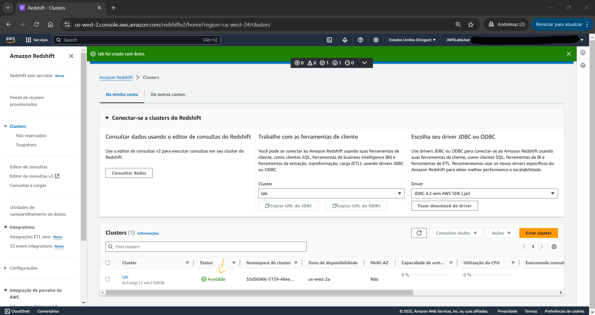
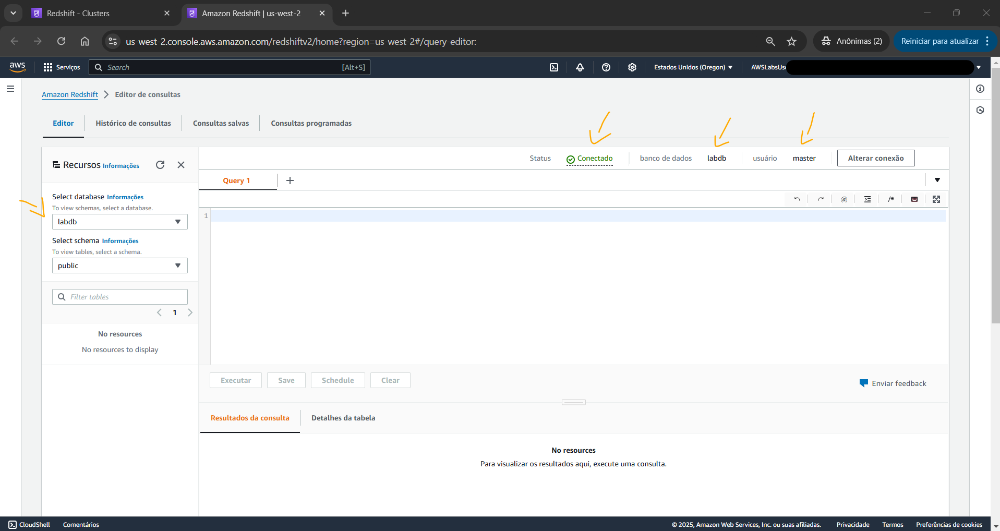

# Lab - Analyze Big Data with Hadoop   

### AWS Skill Builder <a href="../../">aws_skill_builder   </a>
### Training Category: <a href="../../self_paced_lab">self_paced_lab</a>
### Software/Subject: aws   
### Course: <a href="./">curso_spl_009 (Lab - Analyze Big Data with Hadoop)   </a>

#### Parceria da AWS com a Escola da Nuvem (EDN)   

---

### Theme:
- Big Data
- Cloud Computing

### Used Tools:
- Operating System (OS): 
  - Linux   
  - Windows 11   
- Linux Distribution:
  - Amazon Linux   
- Cloud:
  - Amazon Web Services (AWS)   
- Cloud Services:
  - Amazon CloudFront   
  - Amazon Elastic Compute Cloud (EC2)   
  - Amazon Elastic MapReduce (EMR)   
  - Amazon Simple Storage Service (S3)   
  - Google Drive   
- Language:
  - Apache Hive Query Language (Apache HiveQL)   
  - HTML   
  - Markdown   
- Integrated Development Environment (IDE) and Text Editor:
  - Visual Studio Code (VS Code)   
- Versioning: 
  - Git   
- Repository:
  - GitHub   
- Big Data:
  - Apache Hadoop   
  - Apache Hadoop MapReduce   
  - Apache Hive   
  - Hadoop Distributed File System (HDFS)   

---

<a name="item0"><h3>Course Strcuture:</h3></a>
1. Lab - Analyze Big Data with Hadoop 
1.1 <a href="#item01.1">Tarefa 1: Criar um bucket do Amazon S3</a> 
1.2 <a href="#item01.2">Tarefa 2: iniciar um cluster do Amazon EMR</a> 
1.3 <a href="#item01.3">Tarefa 3: Processe seus dados de amostra executando um script Hive</a> 
1.4 <a href="#item01.4">Tarefa 4: Visualizar os resultados</a> 
1.5 <a href="#item01.5">Tarefa 5: conectar-se à CLI do cluster EMR e executar a consulta usando HiveQL</a> 
1.6 <a href="#item01.6">Tarefa 6: Encerre seu cluster Amazon EMR</a> 

---

### Objective:
O objetivo deste laboratório prático foi implantar um cluster **Hadoop** totalmente funcional no serviço **Amazon EMR** e com um script **HiveQL** processar os dados de log de uma distribuição do **Amazon CloudFront** armazenados em um bucket do **Amazon Simple Storage Service (S3)**. **HiveQL** é uma linguagem de script semelhante a SQL para armazenamento e análise de dados. O **Amazon EMR** é um serviço gerenciado que torna rápido, fácil e econômico executar o **Apache Hadoop** e o **Apache Spark** para processar grandes quantidades de dados. O **Amazon EMR** também oferece suporte a ferramentas Hadoop poderosas e comprovadas, como **Presto**, **Hive**, **Pig**, **HBase** e muito mais.

### Structure:
A estrutura do curso é formada por:
- Este arquivo de README.
- A pasta `0-aux`, pasta auxiliar com imagens utilizadas na construção desse arquivo de README. 

### Development:
Este curso foi um laboratório prático realizado na plataforma **AWS Skill Builder**, cuja subscrição foi devida a uma parceria entre a **AWS** e a **Escola da Nuvem**. A infraestrutura de cloud utilizada foi fornecida através de um sandbox do **AWS Skill Builder** que possibilitava acesso ao console da **AWS**. Contudo foi necessário seguir estritamente as orientações determinadas no laboratório. Dessa maneira, a forma de interação com os recursos da cloud foram sempre através do console fornecido pelo sandbox, a não ser em casos em que o próprio laboratório instruiu para utilização de outras ferramentas de interação como **AWS CLI** ou **AWS SDK**.

O laboratório do **AWS Skill Builder** tem o foco em executar apenas o que é orientado no escopo, todos os recursos ou serviços que podem ser requisitados adicionalmente já vêm provisionados por padrão pelo laboratório. Ao iniciar o laboratório, o sandbox do **AWS Skill Builder** provisiona diversos recursos e serviços para o funcionamento através de uma ou mais pilhas do **AWS CloudFormation** de forma automática. 

O acesso ao console no sandbox do **AWS Skill Builder** é realizado por meio de uma identidade federada. O Skill Builder funciona como um provedor de identidade (IdP), autenticando o usuário e vinculando-o a uma role do **AWS IAM** provisionada automaticamente por uma das pilhas do CloudFormation. Essa role concede permissões temporárias e mínimas necessárias para a execução do laboratório, garantindo segurança e controle sobre os recursos utilizados. O laboratório, por padrão, determina a região a ser utilizada e ela não deve ser alterada, somente se o próprio laboratório indicar. As configurações não informadas no laboratório devem ser sempre mantidas como padrão que estão.

<a name="item01.1"><h4>Tarefa 1: Criar um bucket do Amazon S3</h4></a>[Back to summary](#item0)

<figure>
     
    <figcaption>Imagem 01.</figcaption>
</figure>
 

<a name="item01.2"><h4>Tarefa 2: iniciar um cluster do Amazon EMR</h4></a>[Back to summary](#item0)

<figure>
     
    <figcaption>Imagem 02.</figcaption>
</figure>
 

<a name="item01.3"><h4>Tarefa 3: Processe seus dados de amostra executando um script Hive</h4></a>[Back to summary](#item0)

<a name="item01.4"><h4>Tarefa 4: Visualizar os resultados</h4></a>[Back to summary](#item0)

<a name="item01.5"><h4>Tarefa 5: conectar-se à CLI do cluster EMR e executar a consulta usando HiveQL</h4></a>[Back to summary](#item0)

<a name="item01.6"><h4>Tarefa 6: Encerre seu cluster Amazon EMR</h4></a>[Back to summary](#item0)

