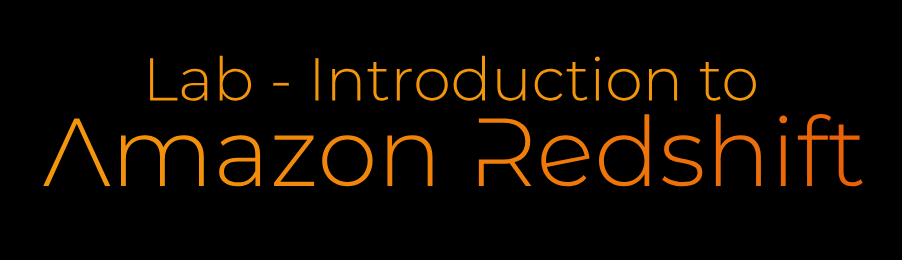

# Lab - Introduction to Amazon Redshift   

### AWS Skill Builder <a href="../../">aws_skill_builder   </a>
### Training Category: <a href="../../self_paced_lab">self_paced_lab</a>
### Software/Subject: aws   
### Course: <a href="./">curso_spl_010 (Lab - Introduction to Amazon Redshift)   </a>

#### Parceria da AWS com a Escola da Nuvem (EDN)   

---

### Theme:
- Big Data
- Cloud Computing

### Used Tools:
- Operating System (OS): 
  - Windows 11   
- Cloud:
  - Amazon Web Services (AWS)   
- Cloud Services:
  - Amazon Redshift   
  - Amazon Simple Storage Service (S3)   
  - Google Drive   
- Language:
  - HTML   
  - Markdown   
- Integrated Development Environment (IDE) and Text Editor:
  - Visual Studio Code (VS Code)   
- Versioning: 
  - Git   
- Repository:
  - GitHub   

---

<a name="item0"><h3>Course Strcuture:</h3></a>
1. Lab - Introduction to Amazon Redshift<br>
1.1 <a href="#item01.1">Tarefa 1: iniciar um cluster do Amazon Redshift</a><br>
1.2 <a href="#item01.2">Tarefa 2: Use o Redshift Query Editor para se comunicar com seu Redshift Cluster</a><br>
1.3 <a href="#item01.3">Tarefa 3: Criar uma tabela</a><br>
1.4 <a href="#item01.4">Tarefa 4: Carregar dados de amostra do Amazon S3</a><br>
1.5 <a href="#item01.5">Tarefa 5: Consultar dados</a><br>

---

### Objective:
O objetivo deste laboratório prático foi implementar um cluster do **Amazon Redshift**, carregar os dados de um bucket do **Amazon S3** no cluster, e então efetuar consultas nos dados armazenados no cluster.

### Structure:
A estrutura do curso é formada por:
- Este arquivo de README.
- A pasta `0-aux`, pasta auxiliar com imagens utilizadas na construção desse arquivo de README. 

### Development:
Este curso foi um laboratório prático realizado na plataforma **AWS Skill Builder**, cuja subscrição foi devida a uma parceria entre a **AWS** e a **Escola da Nuvem**. A infraestrutura de cloud utilizada foi fornecida através de um sandbox do **AWS Skill Builder** que possibilitava acesso ao console da **AWS**. Contudo foi necessário seguir estritamente as orientações determinadas no laboratório. Dessa maneira, a forma de interação com os recursos da cloud foram sempre através do console fornecido pelo sandbox, a não ser em casos em que o próprio laboratório instruiu para utilização de outras ferramentas de interação como **AWS CLI** ou **AWS SDK**.

O laboratório do **AWS Skill Builder** tem o foco em executar apenas o que é orientado no escopo, todos os recursos ou serviços que podem ser requisitados adicionalmente já vêm provisionados por padrão pelo laboratório. Ao iniciar o laboratório, o sandbox do **AWS Skill Builder** provisiona diversos recursos e serviços para o funcionamento através de uma ou mais pilhas do **AWS CloudFormation** de forma automática. 

O acesso ao console no sandbox do **AWS Skill Builder** é realizado por meio de uma identidade federada. O Skill Builder funciona como um provedor de identidade (IdP), autenticando o usuário e vinculando-o a uma role do **AWS IAM** provisionada automaticamente por uma das pilhas do CloudFormation. Essa role concede permissões temporárias e mínimas necessárias para a execução do laboratório, garantindo segurança e controle sobre os recursos utilizados. O laboratório, por padrão, determina a região a ser utilizada e ela não deve ser alterada, somente se o próprio laboratório indicar. As configurações não informadas no laboratório devem ser sempre mantidas como padrão que estão.

<a name="item01.1"><h4>Tarefa 1: iniciar um cluster do Amazon Redshift</h4></a>[Back to summary](#item0)

O **Amazon Redshift** é um serviço de data warehouse da cloud **AWS**. Ele é rápido e totalmente gerenciado que torna simples e econômico analisar todos os dados usando SQL padrão e ferramentas de Business Intelligence (BI) existentes. Nesta primeira tarefa do laboratório, foi provisionado um cluster que consiste em um conjunto de nós de computação, que juntos executavam um mecanismo do Redshift e continham um banco de dados. Ao iniciar um cluster, uma das opções que era especificada era o tipo de nó. O tipo de nó determina a CPU, a RAM, a capacidade de armazenamento e o tipo de unidade de armazenamento para cada nó. Os tipos de nó estão disponíveis em tamanhos diferentes. O tamanho do nó e o número de nós determinam o armazenamento total para um cluster. O cluster do Redshift provisionado ficou com a seguinte configuração:
- Identificador de cluster: `lab`.
- Tipo de nó: `dc2.large`.
- Número de nós: `2`.
- Na seção Configurações do banco de dados, foi configurado:
- Nome de usuário do administrador: `master`
- Para Senha do administrador, foi selecionado `Adicionar manualmente a senha do administrador e configurar a senha do usuário administrador`: nele foi colado o valor do item `DBPassword`, fornecido pelo próprio laboratório, sendo neste caso `SZ51Hmo4jYNm`.
- Foi selecionado `Desativar criptografia de cluster`.
- Para funções IAM associadas, foi escolhida a IAM Role `Redshift-Role`, que já tinha sido provisionada pela pilha do **AWS CloudFormation** ao iniciar o laboratório. Essa função concedia permissões para o **Amazon Redshift** ler dados do **Amazon S3** já que ele precisaria importar dados do bucket.
- Na seção Configurações adicionais foi desmarcado a opção `Usar padrões`.
  - Em Rede e segurança, foi configurado:
    - Virtual private cloud: `Lab VPC`.
    - Em `VPC security groups` foi deselecionado o default e escolhido o grupo de segurança `Redshift Security Group`.
  - Em `Configurações do banco de dados` foi configurado:
    - Nome do banco de dados: `labdb`.

A imagem 01 ilustra o cluster do Redshift criado com sucesso e com status de disponível. Esse provisionamento poderia levar alguns minutos para ser concluído.

<div align="Center"><figure>
    <br>
    <figcaption>Imagem 01.</figcaption>
</figure></div><br>

<a name="item01.2"><h4>Tarefa 2: Use o Redshift Query Editor para se comunicar com seu Redshift Cluster</h4></a>[Back to summary](#item0)

O **Amazon Redshift** pode ser usado via SQL padrão do setor. Para usar o Redshift, é necessário ter um SQL Client que forneça uma interface de usuário para digitar SQL. Qualquer cliente SQL que suporte JDBC ou ODBC pode ser usado com o Redshift, sendo necessário configurar o acesso de rede através do grupo de segurança liberando a porta `5439`. Contudo, como neste laboratório não era possível adicionar uma regra ao grupo de segurança do Redshift para liberar a comunicação de um SQL Client da máquina física, foi utilizado o editor de consultas do próprio Redshift. Para utilizá-lo foi necessário selecionar o editor de consultas e conectá-lo ao banco de dados informando as credenciais configuradas:
- Conjunto: `lab (Available)`.
- Nome do banco de dados: `labdb`.
- Usuário do banco de dados: `master`.

A imagem 02 evidencia a conexão estabelecida do editor de consultas com o cluster do Redshift. Perceba que não foi necessário informar a senha do banco de dados, pois a conexão era realizada dentro da **AWS**.

<div align="Center"><figure>
    <br>
    <figcaption>Imagem 02.</figcaption>
</figure></div><br>

<a name="item01.3"><h4>Tarefa 3: Criar uma tabela</h4></a>[Back to summary](#item0)

O próximo passo foi criar uma tabela no Redshift executando comandos SQL no editor de consultas. O arquivo [create_table.sql](./resource/create_table.sql) foi utilizado para criar a tabela `users` com diversos atributos. Em seguida, foi executado o comando `Select * from users;` para selecionar todas as linhas da tabela criada, que neste momento era zero. A imagem 03 mostra a consulta que criou a tabela.

<div align="Center"><figure>
    <br>
    <figcaption>Imagem 03.</figcaption>
</figure></div><br>

<a name="item01.4"><h4>Tarefa 4: Carregar dados de amostra do Amazon S3</h4></a>[Back to summary](#item0)

O **Amazon Redshift** pode importar dados do **Amazon S3**. Vários formatos de arquivo são suportados, campos de comprimento fixo, valores separados por vírgula (CSV) e delimitadores personalizados. Os dados para este laboratório eram separados por barras verticais (|). Sendo assim, uma nova consulta foi criada e foi executado o comando SQL abaixo. Esse comando copiava os dados do bucket do S3 do path determinado para a tabela `users`, informando como credencial a ARN de uma role do **AWS IAM**, que no caso era a role configurada no cluster cujo nome era `Redshift-Role`. Também foi passado a barra vertical como delimitador.

```sql
COPY users FROM 's3://awssampledbuswest2/tickit/allusers_pipe.txt'
CREDENTIALS 'aws_iam_role=arn:aws:iam::035003144066:role/Redshift-Role'
DELIMITER '|';
```

O comando levou aproximadamente 10 segundos para carregar 49.990 linhas de dados. A imagem 04 exibe a inserção dos dados no Redshift. 

<div align="Center"><figure>
    <br>
    <figcaption>Imagem 04.</figcaption>
</figure></div><br>

<a name="item01.5"><h4>Tarefa 5: Consultar dados</h4></a>[Back to summary](#item0)

Com os dados armazenados no banco de dados do **Amazon Redshift**, a última tarefa foi realizar consultas SQL Select na tabela `users` desse banco de dados. A primeira consulta realizada foi `SELECT COUNT(*) FROM users;`, que contabilizou quantas linhas a tabela tinha. Outras duas consultas foram realizadas conforme comandos abaixo. A primeira exibia os usuários em Ohio (OH) que gostavam de esportes, mas não gostavam de ópera, classificando a lista pelo primeiro nome. A segunda consulta mostrava as 10 principais cidades onde vivem usuários amantes do jazz. As imagens 05, 06 e 07 exibem o resultado dessas três consultas.

```sql
SELECT userid, firstname, lastname, city, state
FROM users
WHERE likesports AND NOT likeopera AND state = 'OH'
ORDER BY firstname;
```

```sql
SELECT
  city,
  COUNT(*) AS count
FROM users
WHERE likejazz
GROUP BY city
ORDER BY count DESC
LIMIT 10;
```

<div align="Center"><figure>
    <br>
    <figcaption>Imagem 05.</figcaption>
</figure></div><br>

<div align="Center"><figure>
    <br>
    <figcaption>Imagem 06.</figcaption>
</figure></div><br>

<div align="Center"><figure>
    <br>
    <figcaption>Imagem 07.</figcaption>
</figure></div><br>

Por fim, houve um desafio que foi escrever uma consulta que exibisse apenas o nome e sobrenome dos usuários que gostavam tanto de teatro quanto de Música Clássica cujo sobrenome era Smith. O comando executado foi o abaixo e a imagem 08 evidencia a execução da consulta.

```sql
SELECT firstname, lastname
FROM users
WHERE lastname = 'Smith' and liketheatre and likeclassical;
```

<div align="Center"><figure>
    <br>
    <figcaption>Imagem 08.</figcaption>
</figure></div><br>