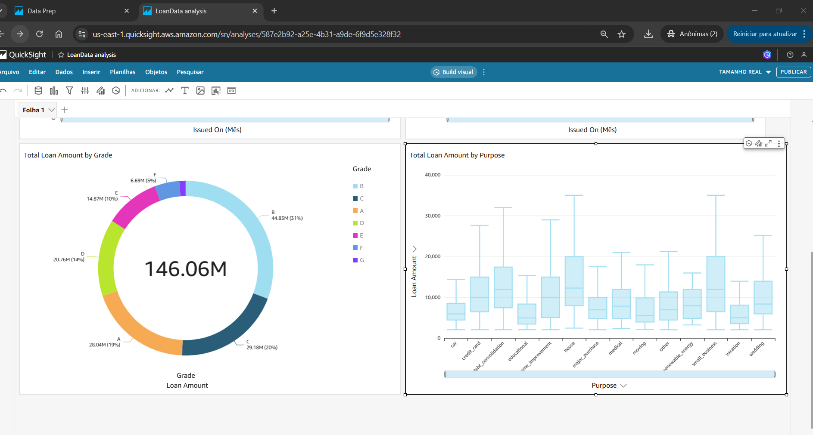
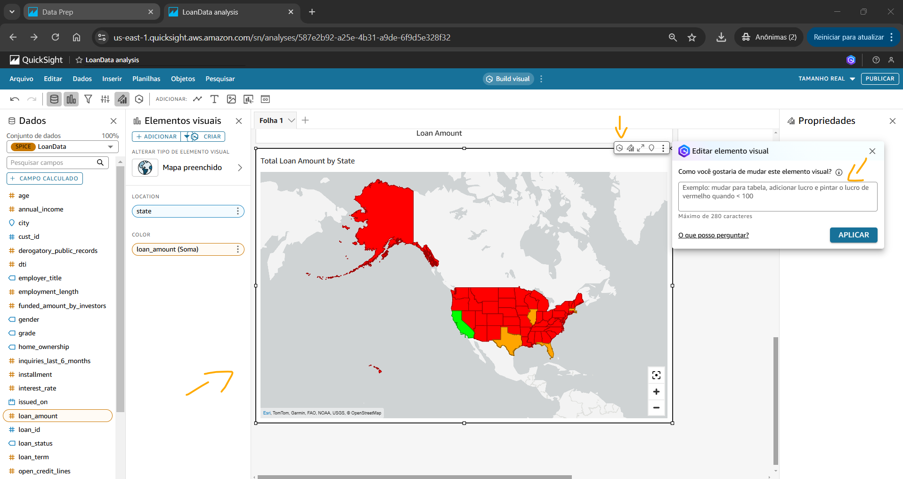
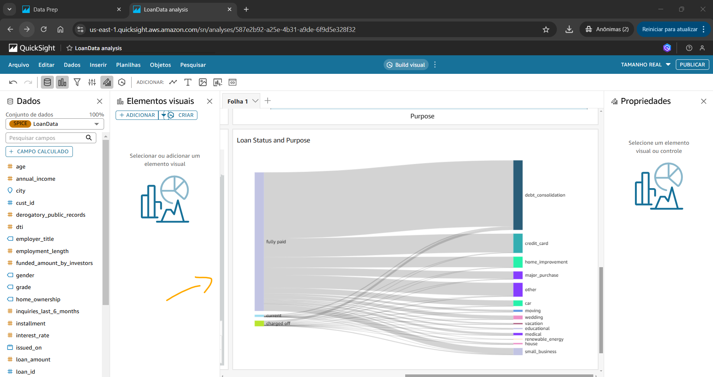
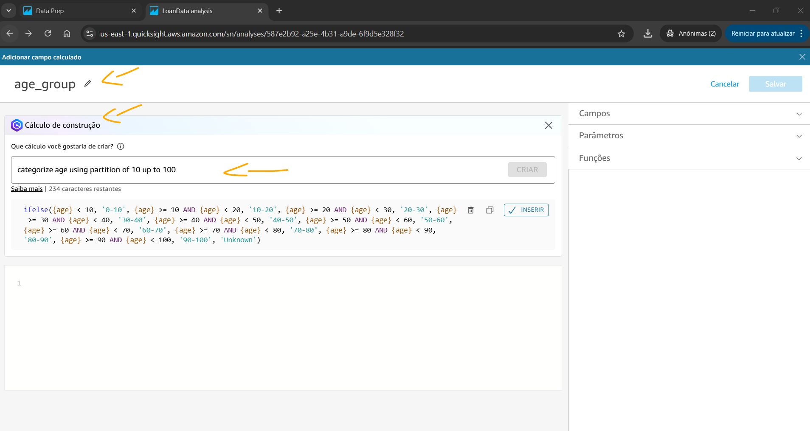
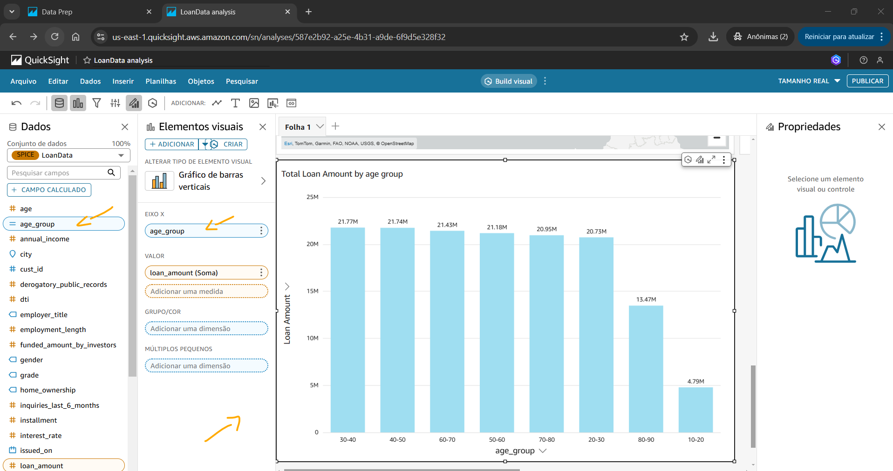
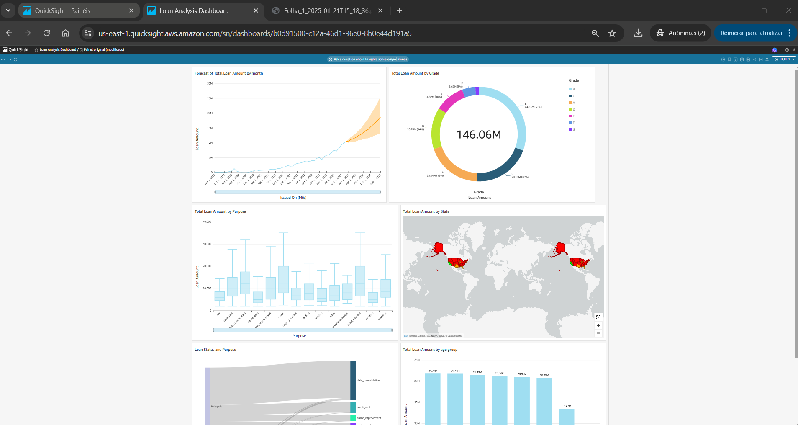
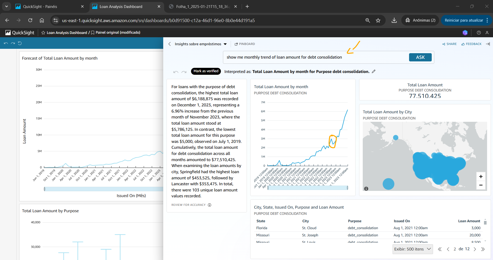
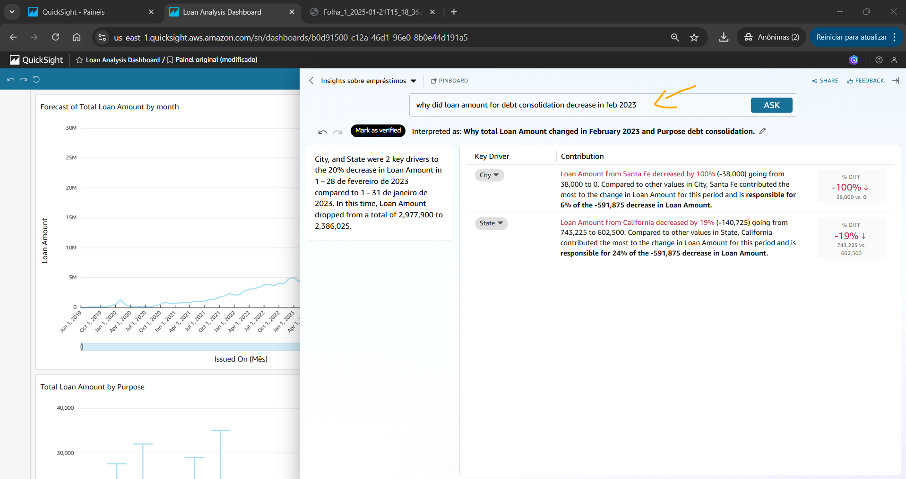

# Lab - Exploring the Generative Business Intelligence Features in Amazon QuickSight   

### AWS Skill Builder <a href="../../">aws_skill_builder   </a>
### Training Category: <a href="../../self_paced_lab">self_paced_lab</a>
### Software/Subject: aws   
### Course: <a href="./">curso_spl_011 (Lab - Exploring the Generative Business Intelligence Features in Amazon QuickSight)   </a>

#### Parceria da AWS com a Escola da Nuvem (EDN)   

---

### Theme:
- Big Data
- Cloud Computing

### Used Tools:
- Operating System (OS): 
  - Windows 11   
- Cloud:
  - Amazon Web Services (AWS)   
- Cloud Services:
  - Amazon QuickSight   
  - Amazon Redshift   
  - Amazon Simple Storage Service (S3)   
  - Google Drive   
- Language:
  - HTML   
  - Markdown   
- Integrated Development Environment (IDE) and Text Editor:
  - Visual Studio Code (VS Code)   
- Versioning: 
  - Git   
- Repository:
  - GitHub   

---

<a name="item0"><h3>Course Strcuture:</h3></a>
1. Lab - Exploring the Generative Business Intelligence Features in Amazon QuickSight 
1.1 <a href="#item01.1">Tarefa 1: Ingerir dados e criar um tópico Q</a> 
1.2 <a href="#item01.2">Tarefa 2: Criar visualizações</a> 
1.3 <a href="#item01.3">Tarefa 3: Publicar um painel</a> 
1.4 <a href="#item01.4">Tarefa 4: Crie um resumo executivo dos seus dados</a> 
1.5 <a href="#item01.5">Tarefa 5: Criar história de dados</a> 

---

### Objective:
O objetivo deste laboratório prático foi utilizar o **Amazon QuickSight** para ingestão de dados e construção de um painel com visualizações e recursos de BI generativo para fornecer insights relevantes a respeito desses dados. O conjunto de dados utilizado para análise foi fornecido pelo laboratório e tratava-se de um portfólio de empréstimos de uma grande instituição financeira.

### Structure:
A estrutura do curso é formada por:
- Este arquivo de README.
- A pasta `0-aux`, pasta auxiliar com imagens utilizadas na construção desse arquivo de README. 

### Development:
Este curso foi um laboratório prático realizado na plataforma **AWS Skill Builder**, cuja subscrição foi devida a uma parceria entre a **AWS** e a **Escola da Nuvem**. A infraestrutura de cloud utilizada foi fornecida através de um sandbox do **AWS Skill Builder** que possibilitava acesso ao console da **AWS**. Contudo foi necessário seguir estritamente as orientações determinadas no laboratório. Dessa maneira, a forma de interação com os recursos da cloud foram sempre através do console fornecido pelo sandbox, a não ser em casos em que o próprio laboratório instruiu para utilização de outras ferramentas de interação como **AWS CLI** ou **AWS SDK**.

O laboratório do **AWS Skill Builder** tem o foco em executar apenas o que é orientado no escopo, todos os recursos ou serviços que podem ser requisitados adicionalmente já vêm provisionados por padrão pelo laboratório. Ao iniciar o laboratório, o sandbox do **AWS Skill Builder** provisiona diversos recursos e serviços para o funcionamento através de uma ou mais pilhas do **AWS CloudFormation** de forma automática. 

O acesso ao console no sandbox do **AWS Skill Builder** é realizado por meio de uma identidade federada. O Skill Builder funciona como um provedor de identidade (IdP), autenticando o usuário e vinculando-o a uma role do **AWS IAM** provisionada automaticamente por uma das pilhas do CloudFormation. Essa role concede permissões temporárias e mínimas necessárias para a execução do laboratório, garantindo segurança e controle sobre os recursos utilizados. O laboratório, por padrão, determina a região a ser utilizada e ela não deve ser alterada, somente se o próprio laboratório indicar. As configurações não informadas no laboratório devem ser sempre mantidas como padrão que estão.

<a name="item01.1"><h4>Tarefa 1: Ingerir dados e criar um tópico Q</h4></a>[Back to summary](#item0)

A primeira tarefa consistiu no carregamento e preparação do conjunto de dados no **Amazon QuickSight** a partir de um arquivo de **Excel** em formato **CSV**. Dessa forma, o arquivo de nome `LoanData.csv` foi baixado para máquina física local **Windows**. No console do QuickSight, foi carregado um novo conjunto de dados fornecendo o caminho do arquivo baixado. Em seguida, foi selecionada a opção `Editar/Visualizar dados` para executar a preparação. Na preparação, uma pré-visualização do Dataset era exibida, alterando então o tipo de dado do campo `estado` de `String` para `State`. Após finalizar a preparação foi só salvar e publicar os dados. A imagem 01 mostra os dados carregados.

<figure>
     
    <figcaption>Imagem 01.</figcaption>
</figure>
 

Ainda na tarefa 1, foi criado também um tópico Q para utilizar o recurso de BI generativo. O **Amazon QuickSight Q** é uma ferramenta de análise de dados que permite aos usuários fazer perguntas em linguagem natural e obter respostas instantâneas com base nos dados armazenados no **Amazon QuickSight**. Ele utiliza inteligência artificial para interpretar as consultas e gerar insights de forma automática. O tópico foi configurado da seguinte forma:
- Nome do tópico: `Insights sobre empréstimos`.
- Descrição: `BI generativo para visuais de painel, campos calculados e insights aprimorados`.
- Foi selecionada a opção `Usar nova experiência generativa de perguntas e respostas`.
- Selecionar um conjunto de dados: foi escolhido o conjunto de dados já preparado e carregado cujo nome era `LoanData`.

A imagem 02 ilustra o tópico Q do **Amazon QuickSight** provisionado.

<figure>
     
    <figcaption>Imagem 02.</figcaption>
</figure>
 

<a name="item01.2"><h4>Tarefa 2: Criar visualizações</h4></a>[Back to summary](#item0)

Nesta tarefa foi construido um dashboard com as seguintes visualizações abaixo:
- Um gráfico de linhas que mostra a tendência de originação de empréstimos ao longo do tempo, com uma previsão que estima os volumes futuros de originação de empréstimos.
- Um gráfico de rosca que mostra a distribuição dos valores dos empréstimos por grau.
- Um gráfico de caixa que mostra a distribuição dos valores dos empréstimos entre diferentes finalidades.
- Um gráfico de mapa geoespacial que mostra a distribuição do valor do empréstimo por estado.
- Formatação condicional aplicada ao gráfico do mapa geoespacial para destacar diferentes faixas de valores de empréstimo.
- Um diagrama de Sankey que mostra a relação entre a finalidade do empréstimo e o status do empréstimo.
- Um campo calculado para faixa etária criado usando recursos de BI generativo.
- Um gráfico de barras virtual que mostra a relação entre faixas etárias e valores de empréstimos.

Antes de construir as primeiras visualizações foi necessário criar uma análise e vincular ao tópico Q provisionado anteriormente. Dessa forma, uma nova análise foi criada, selecionando o conjunto de dados `LoanData` e ativando a opção `tópico Vincular para Criar visual e Perguntas e respostas`. Na lista de tópicos foi selecionado `Informações sobre empréstimos` e então aplicada as configurações.

A primeira visualização elaborada foi o gráfico de linhas para analisar a tendência mensal dos valores de empréstimo no conjunto de dados, aprimorando ele para permitir a previsão de possíveis tendências futuras nos dados. No painel criar um visual foi inserido no prompt `loan amount monthly trend` (`valor do empréstimo tendência mensal`) e escolhida a opção de construir. Em seguida, o ícone de insights/previsão no visual recém-gerado foi selecionada para ativá-la e adicionar à análise. A imagem 03 mostra esse visual criado. Observe que toda construção ou edição era feita través do processamento de linguagem natural (NPL) fornecendo um prompt com o que era desejado e o próprio QuickSight tratava de executar. Essa funcionalidade era devido ao **Amazon QuickSight Q** que permitia a integração das tecnologias de BI com IA generativa.

<figure>
     
    <figcaption>Imagem 03.</figcaption>
</figure>
 

O segundo visual foi um gráfico de donut (rosca) para analisar a distribuição dos valores dos empréstimos entre diferentes níveis de empréstimo. Um novo visual foi criado inserindo no prompt `loan amount by grade in donut chart` (`valor do empréstimo por grau no gráfico de donut`) e adicionando à análise. O terceiro visual foi um gráfico de caixa para analisar a distribuição e o intervalo de valores de empréstimos entre diferentes finalidades. O processo era o mesmo dos anteriores, inserindo no painel de criar visual o texto `create a loan amount by purpose box plot` (`criar um gráfico de caixa de valor de empréstimo por finalidade`), sempre adicionando à análise. A imagem 04 evidencia a construção dos visuais 2 e 3.

<figure>
     
    <figcaption>Imagem 04.</figcaption>
</figure>
 

O próximo visual foi um mapa preenchido para analisar a distribuição dos valores dos empréstimos entre diferentes estados ou regiões, cujo texto inserido no prompt foi `Show loan amount by State in a filled map` (`Mostrar valor do empréstimo por estado em um mapa preenchido`) e adicionando à análise. Após criar esse visual, ele foi selecionado e duas alterações foram feitas: o ângulo foi escolhido como reto e a imagem global precisou de um campo geoespacial em Localização que podia ser Estado, País ou CEP. Neste caso foi optado por Estado. Ainda neste visual, uma formatação condicional foi utilizada na cor de fundo do visual com base em intervalos de valores de empréstimo para cada estado. Isso permitia distinguir estados com base em suas categorias de valores de empréstimo, facilitando a identificação de padrões e tendências. Para isso, o visual foi selecionado e editdo no ícone Q passando os dois seguintes prompts `change color to green when loan amount is greater than 15000000` (`mudar de cor para verde quando o valor do empréstimo for maior que 15000000`) e `change color to red when loan amount is less than 5000000 and change color to orange when loan amount is between 5000000 and 15000000` (`mudar de cor para vermelho quando o valor do empréstimo for menor que 5000000 e mudar de cor para laranja quando o valor do empréstimo estiver entre 5000000 e 15000000`). A imagem 05 exibe a visualização de mapa preenchido elaborada com a formatação de condicional.

<figure>
     
    <figcaption>Imagem 05.</figcaption>
</figure>
 

A visualização 6 foi um diagrama de Sankey que permitia visualizar o fluxo e a conexão entre o status do empréstimo e os propósitos do empréstimo. Um diagrama de Sankey é uma maneira eficaz de representar o fluxo de dados entre diferentes categorias ou grupos. O prompt utilizado para este caso foi `show loan status and loan purpose in a sankey diagram` (`mostrar o status do empréstimo e a finalidade do empréstimo em um diagrama de Sankey`). A imagem 06 mostra o diagrama de Sankey construído.

<figure>
     
    <figcaption>Imagem 06.</figcaption>
</figure>
 

O item 7 foi um campo calculado chamado `age_group` para categorizar os dados de idade em grupos ou buckets com um intervalo de 10 anos até 100 anos. Este campo calculado podia ser útil para analisar valores de empréstimos ou outras métricas com base em faixas etárias em vez de idades individuais. Para este caso foi necessário adicionar um campo calculado ao invés de criar um visual, configurando ele da seguinte forma:
- Adicionar nome: `faixa etária`.
- Foi selecionada a opção `Construir cálculo` e inserido o prompt `categorize age using partition of 10 up to 100` (`categorizar a idade usando partição de 10 a 100`).

Após a criação do campo calculado, foi necessário aguardar sua conclusão e então adicioná-lo para fazer parte da análise. Note que o campo calculado foi criado usando as funções integradas do QuickSight. Este campo calculado foi utilizado para elaborar o último visual que foi um gráfico de barras verticais para visualizar valores de empréstimos em diferentes faixas etárias. O prompt informado foi `loan amount by age group vertical bar chart` (`valor do empréstimo por faixa etária gráfico de barras verticais`). A imagem 07 evidencia o campo calculado sendo utilizado no gráfico elaborado.

<figure>
     
    <figcaption>Imagem 07.</figcaption>
</figure>
 

<a name="item01.3"><h4>Tarefa 3: Publicar um painel</h4></a>[Back to summary](#item0)

Com o dashboard finalizado, esta tarefa consistiu em publicá-lo para que fosse possível um terceiro, no caso um cliente fictício, visualizá-lo. Dessa forma foi selecionada a opção `Publicar` e definido o nome como `Loan Analysis Dashboard` (`Painel de Análise de Empréstimos`). Automaticamente o QuickSight redirecionava para o dashboard construído fornecendo uma URL que podia ser compartilhada. A imagem 08 ilustra o dashboard construído com todos os visuais.

<figure>
     
    <figcaption>Imagem 08.</figcaption>
</figure>
 

<a name="item01.4"><h4>Tarefa 4: Crie um resumo executivo dos seus dados</h4></a>[Back to summary](#item0)

Na tarefa 4, o objetivo foi interagir com o dashboard construído, executando perguntas ad-hoc sobre os dados para construir um resumo executivo de maneira bem simples. Este também é um recurso muito útil de BI generativo fornecido pelo **Amazon QuickSight Q**. Sendo assim, o dashboard `Painel de Análise de Empréstimos` foi selecionado para construir um resumo executivo realizando perguntas contextuais. As três seguintes perguntas foram feitas na respectiva ordem:
- `show me monthly trend of loan amount for debt consolidation` (`mostre-me a tendência mensal do valor do empréstimo para consolidação de dívidas`). Conforme foi observado, o QuickSight forneceu vários visuais apresentando dados relacionados, trazendo contexto adicional para construir confiança e compreensão nos dados. Ele destacava como era a tendência mensal para o valor do empréstimo, facilitando a observação de um declínio repentino em fevereiro de 2023, como mostrado na imagem 09.
- `why did loan amount for debt consolidation decrease in feb 2023` (`por que o valor do empréstimo para consolidação de dívidas diminuiu em fevereiro de 2023`). Esta pergunta acionou uma análise de contribuição instantânea. O QuickSight identificava automaticamente os principais drivers de mudança para o valor do empréstimo que foi perguntado e quantificava qual valor de cada driver contribuiu mais para essa mudança. Esta análise dava uma ideia da influência relativa que cada valor teve no empréstimo, identificando assim a causa do declínio em fevereiro de 2023, conforme imagem 10.
- `top debt consolidation` (`consolidação de dívidas de topo`). Observe na imagem 11 como o **Amazon QuickSight** trouxe de volta os dados que ele pôde encontrar relacionados à pergunta, incluindo sugestões alternativas se várias partes dos dados correspondessem à solicitação.

<figure>
     
    <figcaption>Imagem 09.</figcaption>
</figure>
 

<figure>
     
    <figcaption>Imagem 10.</figcaption>
</figure>
 

<figure>
     
    <figcaption>Imagem 11.</figcaption>
</figure>
 

<a name="item01.5"><h4>Tarefa 5: Criar história de dados</h4></a>[Back to summary](#item0)

Na última tarefa, o objetivo foi criar uma história de dados passando o seguinte prompt: `Analyze loan amount and income across different states and provide recommendations on better debt consolidation and lower loan amount` (`Analisar o valor do empréstimo e a renda em diferentes estados e fornecer recomendações sobre melhor consolidação de dívidas e valores de empréstimo mais baixos`). Em seguida, todos os visuais exibidos no `Loan Analysis Dashboard` foram selecionados e então foi escolhida a opção construir. Foi necessário aguardar um tempo para que a história fosse construída. A imagem 12 evidencia a história de dados elaborada no QuickSight.

<figure>
     
    <figcaption>Imagem 12.</figcaption>
</figure>
 