# Lab - Troubleshooting Network Connectivity in a Peered VPC   

### AWS Skill Builder <a href="../../">aws_skill_builder   </a>
### Training Category: <a href="../../self_paced_lab">self_paced_lab</a>
### Software/Subject: aws   
### Course: <a href="./">curso_spl_012 (Lab - Troubleshooting Network Connectivity in a Peered VPC)   </a>

#### Parceria da AWS com a Escola da Nuvem (EDN)   

---

### Theme:
- Cloud Computing

### Used Tools:
- Operating System (OS): 
  - Linux   
  - Windows 11   
- Linux Distribution:
  - Amazon Linux   
- Cloud:
  - Amazon Web Services (AWS)   
- Cloud Services:
  - Amazon Elastic Compute Cloud (EC2)   
  - Amazon Virtual Private Cloud (VPC)   
  - AWS Network Manager   
  - Google Drive   
- Language:
  - HTML   
  - Markdown   
- Integrated Development Environment (IDE) and Text Editor:
  - Visual Studio Code (VS Code)   
- Versioning: 
  - Git   
- Repository:
  - GitHub   

---

<a name="item0"><h3>Course Strcuture:</h3></a>
1. Lab - Troubleshooting Network Connectivity in a Peered VPC 
1.1 <a href="#item01.1">Tarefa 1: Testando a conectividade cliente-servidor HTTP</a> 
1.2 <a href="#item01.2">Tarefa 2: Solução de problemas e correção do problema</a> 

---

### Objective:
O objetivo deste laboratório prático foi identificar e corrigir um problema de conectividade HTTP entre dois hosts, cliente e servidor, cada um em uma rede do Amazon VPC diferente contectadas por um emparelhamento de VPC (*VPC Peering*). Ambas as VPCs residiam na mesma conta da AWS. Para identificar o problema de conectividade foi utilizado o recurso *Reachability Analyzer* do serviço **AWS Network Manager**.

### Structure:
A estrutura do curso é formada por:
- Este arquivo de README.
- A pasta `0-aux`, pasta auxiliar com imagens utilizadas na construção desse arquivo de README.

### Development:
Este curso foi um laboratório prático realizado na plataforma **AWS Skill Builder**, cuja subscrição foi devida a uma parceria entre a **AWS** e a **Escola da Nuvem**. A infraestrutura de cloud utilizada foi fornecida através de um sandbox do **AWS Skill Builder** que possibilitava acesso ao console da **AWS**. Contudo foi necessário seguir estritamente as orientações determinadas no laboratório. Dessa maneira, a forma de interação com os recursos da cloud foram sempre através do console fornecido pelo sandbox, a não ser em casos em que o próprio laboratório instruiu para utilização de outras ferramentas de interação como **AWS CLI** ou **AWS SDK**.

O laboratório do **AWS Skill Builder** tem o foco em executar apenas o que é orientado no escopo, todos os recursos ou serviços que podem ser requisitados adicionalmente já vêm provisionados por padrão pelo laboratório. Ao iniciar o laboratório, o sandbox do **AWS Skill Builder** provisiona diversos recursos e serviços para o funcionamento através de uma ou mais pilhas do **AWS CloudFormation** de forma automática. 

O acesso ao console no sandbox do **AWS Skill Builder** é realizado por meio de uma identidade federada. O Skill Builder funciona como um provedor de identidade (IdP), autenticando o usuário e vinculando-o a uma role do **AWS IAM** provisionada automaticamente por uma das pilhas do CloudFormation. Essa role concede permissões temporárias e mínimas necessárias para a execução do laboratório, garantindo segurança e controle sobre os recursos utilizados. O laboratório, por padrão, determina a região a ser utilizada e ela não deve ser alterada, somente se o próprio laboratório indicar. As configurações não informadas no laboratório devem ser sempre mantidas como padrão que estão.

<a name="item01.1"><h4>Tarefa 1: Testando a conectividade cliente-servidor HTTP</h4></a>[Back to summary](#item0)

A arquitetura atual era composta dos seguintes recursos, mostrados no diagrama na imagem 01:
- Uma VPC nomeada como VPC de origem (`Source VPC`) cujo IP era `10.1.0.0/16`, com seguintes recursos:
    - A `Source-VPC` tinha uma sub-rede privada chamada `Source-Private-Subnet` cujo IP era `10.1.1.0/24`.
    - A `Source-Private-Subnet` tinha uma tabela de rotas associada a ela chamada `Source-Private-RT`.
    - A `Source-Private-Subnet` tinha uma lista de controle de acesso à rede (ACL) associada a ela, chamada `Source-Private-Subnet-NACL`.
    - A instância do cliente HTTP era denominada `HTTP-Client` e residia em `Source-Private-Subnet`.
    - A instância do cliente HTTP tinha um grupo de segurança chamado `Source-Instance-SG` aplicado a ela.
- Uma VPC de nome VPC de destino (`Target VPC`) cujo IP era `10.2.0.0/16`, com seguintes recursos:
    - A `Target VPC` tinha uma sub-rede privada chamada `Target-Private-Subnet` cujo IP era `10.2.2.0/24`. 
    - A `Target-Private-Subnet` tinha uma tabela de rotas associada a ela chamada `Target-Private-RT`.
    - A `Target-Private-Subnet` tinha uma ACL de rede associada a ela chamada `Target-Private-Subnet-NACL`.
    - A instância do servidor HTTP era denominada `HTTP-Server` e residia na sub-rede `Target-Private-Subnet`.
    - A instância do servidor HTTP tinha um grupo de segurança chamado `Target-Instance-SG` aplicado a ela.
- O peering de VPC que conecta as duas VPCs era chamado de `Lab-Peering`.

<figure>
    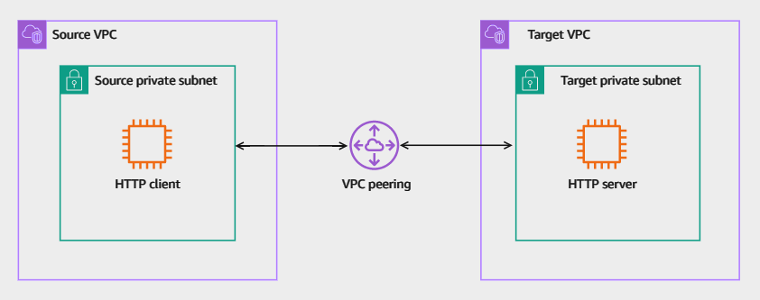 
    <figcaption>Imagem 01.</figcaption>
</figure>
 

Nesta primeira tarefa, a conectividade HTTP entre as instâncias cliente e servidor foi testada, acessando primeiro a instância cliente remotamente e executando o comando `wget http://10.2.2.43` passando o IP privado da instância servidor. A instância foi acessada remotamente utilizando o recurso *Session Manager* do **AWS Systems Manager (SSM)**, pois essa instância estava adicionada no recurso *Fleet Manager* também do SSM. A imagem 02 exibe o output do comando, onde foi possível notar que o cliente tentava iniciar uma conexão HTTP, mas falhava após alguns minutos, comprovando o problema de conectividade.

<figure>
    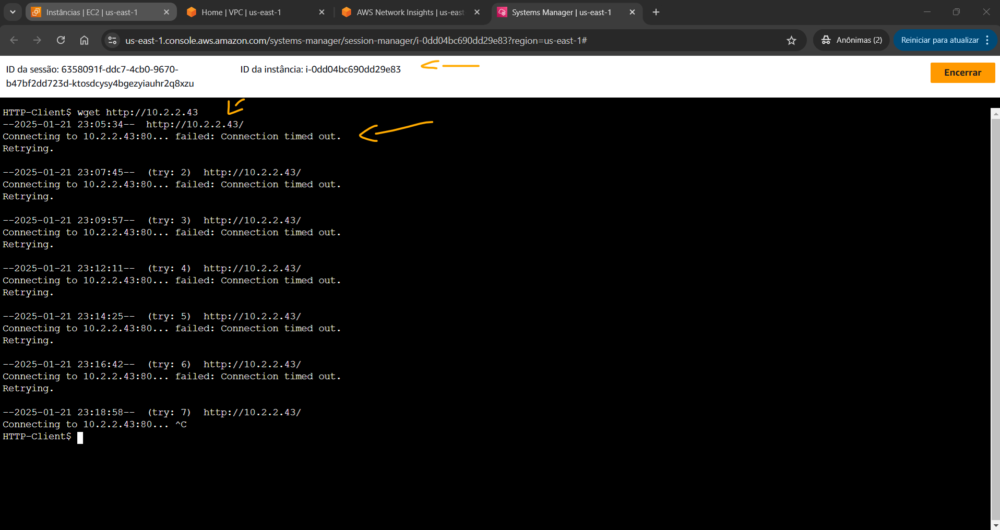 
    <figcaption>Imagem 02.</figcaption>
</figure>
 

<a name="item01.2"><h4>Tarefa 2: Solução de problemas e correção do problema</h4></a>[Back to summary](#item0)

A tarefa seguinte teve como objetivo identificar e corrigir os problemas na configuração existente para permitir o tráfego HTTP entre as instâncias cliente e servidor. Algumas considerações importantes foram fornecidades pelo laboratório, eram elas:
- Havia permissão para usar o *Reachability Analyzer* para solução de problemas.
- O serviço httpd estava ativo e em execução na instância do servidor HTTP, então não era preciso solucionar problemas.
- O serviço HTTP estava sendo executado na porta HTTP padrão (porta TCP 80).
- Não era necessário criar novos recursos para resolver o problema. No entanto, era possível modificar os recursos existentes.
- Havia as permissões necessárias do **AWS Identity and Access Management (IAM)** para corrigir os problemas.
- O laboratório também tinha endpoints VPC e outros recursos que eram fornecidos, além de outros recursos a conectividade necessária. Contudo, não era preciso verificar ou modificar a configuração desses recursos.

Antes de começar a solucionar problemas, algumas considerações sobre como conectar um recurso em uma VPC a partir de um recurso em uma VPC par foram apresentadas:
- Para cada recurso em cada VPC, verifique se a tabela de rotas para sua sub-rede continha uma rota que enviava tráfego destinado à VPC peer por meio da conexão de peering da VPC.
- Para instâncias do EC2, verifique se os grupos de segurança das instâncias do EC2 permitiam tráfego da VPC par.
- Para cada recurso em cada VPC, verifique se a ACL de rede para sua sub-rede permitia tráfego da VPC par.

O *Reachability Analyzer* (analisador de acessibilidade), recurso do serviço **AWS Network Manager**, é uma ferramenta de análise de configuração que permite que seja executado testes de conectividade entre um recurso de origem e um recurso de destino em nuvens privadas virtuais (VPCs). Quando o destino é acessível, o *Reachability Analyzer* produz detalhes hop-by-hop do caminho da rede virtual entre a origem e o destino. Quando o destino não é acessível, o *Reachability Analyzer* identifica o componente de bloqueio. Dessa forma, o *Reachability Analyzer* foi aberto e criado um caminho para ele analisar com as seguintes configurações:
- Tag de nome: foi inserido `Teste de peering VPC`.
- Na seção Origem do Caminho: foi configurado o seguinte:
    - Para Tipo de origem, foi selecionado `Instâncias`.
    - Para Origem: foi selecionado a instância `HTTP-Client`.
    - A seção Configurações adicionais de cabeçalho de pacote na origem - opcional foi expandido e configurado:
        - Para porta de origem: `50000`.
        - Para Porta de destino: `80`.
- Na seção Destino do caminho, foi configurado o seguinte:
    - Para Tipo de destino: foi selecinado `Instâncias`.
    - Para Destino: foi selecionado a instância `HTTP-Server`.
- Na seção Protocolo, para Protocolo: foi selecionado `TCP`.

A imagem 03 evidencia o caminho construído no *Reachability Analyzer* da instância `HTTP-Client` para a instância `HTTP-Server`. A conexão era tentada usando a porta `TCP 50000` como a porta de origem e a porta `TCP 80` como a porta de destino.

<figure>
    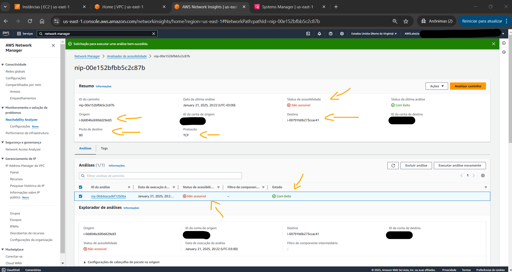 
    <figcaption>Imagem 03.</figcaption>
</figure>
 

Na seção Análise, foi atualizado o status de acessibilidade. O status Reachability devia exibir `Not reachable`. O analisador fornecia detalhes de onde a conexão falhou. A seção Analysis explorer fornecia um resumo do caminho tentado entre as instâncias de origem e destino. Era possível verificar os IDs das instâncias de origem e destino, que eram respectivamente `i-0dd04bc690dd29e83` e `i-00791b0b273ccac41`. Na seção Explorador de análise, a Configurações de cabeçalho de pacote na origem foi expandida para verificar as portas de origem e destino usadas na análise. Rolando para para baixo até a seção Explicações foi encontrado o motivo da falha de acessibilidade. A mensagem dizia `Nenhuma das regras de ingress nos seguintes grupos de segurança é aplicável: sg-0a13e263a93b7e8a6. Consulte sg-0a13e263a93b7e8a6.`, conforme mostrado na imagem 04 a seguir.

<figure>
    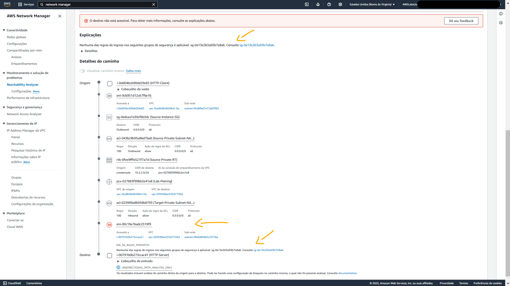 
    <figcaption>Imagem 04.</figcaption>
</figure>
 

Agora foi preciso determinar qual grupo de segurança estava bloqueando o tráfego. Dessa forma, foi verificado a análise visual na seção Detalhes do caminho. A análise visual fornecia uma análise detalhada salto a salto do caminho do tráfego. Se rastrear cada salto no caminho começando da fonte, era possível rastrear o caminho exato do tráfego. Também era possível visualizar que o grupo de segurança que era aplicado à instância do `HTTP-Server` não tinha nenhuma regra de entrada para permitir o tráfego necessário, conforme evidenciado na imagem 05. Algumas considerações para melhor compreensão da análise visual dos detalhes do caminho foram fornecidas abaixo:
- Era possível expandir o cabeçalho Output no `HTTP-Client` para verificar os endereços IP de origem/destino e os números de porta usados ​​na análise.
- O tráfego HTTP do cliente passou com sucesso pelo grupo de segurança da instância de origem, ACL da rede da sub-rede de origem, tabela de rotas da sub-rede privada, conexão de peering de VPC e ACL da rede da sub-rede de destino antes de ser bloqueado pelo grupo de segurança da instância de destino.
- Era possível escolher o nome sublinhado e tracejado de cada salto na análise para exibir mais informações sobre cada salto.
- Cada salto fornecia links para os recursos relacionados para que fosse possível navegar facilmente até eles.
- O ícone do salto bloqueando o tráfego aparece na cor vermelha, enquanto todos os outros ícones aparecem na cor cinza.

<figure>
    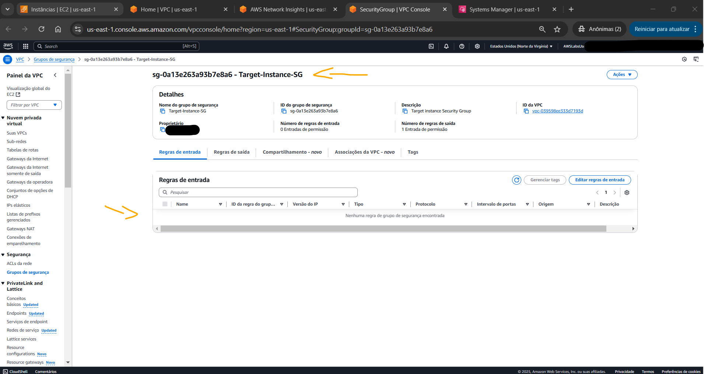 
    <figcaption>Imagem 05.</figcaption>
</figure>
 

Na análise visual em `Path details`, foi localizado o hop onde o tráfego estava bloqueado. Esta era a interface de rede elástica (ENI) da instância do `HTTP-Server` onde o security group era aplicado. Dessa forma, o grupo de segurança dessa instância foi selecionado (`Target-Instance-SG`) e a primeira e única regra de entrada foi criada com a seguinte configuração:
- Tipo: `TCP personalizado`.
- Intervalo de portas: `80`.
- Fonte: `10.1.1.0/24`.

A imagem 06 exibe a regra de entrada criada neste grupo de segurança, permitindo o tráfego HTTP entre as instâncias.

<figure>
    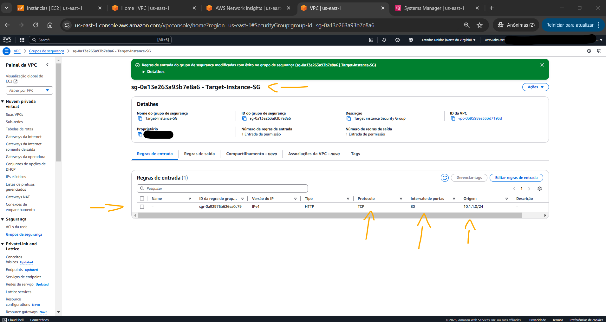 
    <figcaption>Imagem 06.</figcaption>
</figure>
 

Uma nova análise foi executada pelo *Reachability Analyzer* utilizando o mesmo caminho já construído. Após análise concluída, o status dela foi atualizado. O status de Acessibilidade para a última execução devia exibir ainda `Não acessível`. Rolando para baixo até as seções Explicações e Detalhes do caminho foi possível descobrir por que o status ainda era esse. Observe na imagem 07 que a análise visual dos detalhes do caminho não mostrava nenhum ícone de salto em uma cor vermelha. Isso indicava que o tráfego chegou até o destino. No entanto, o problema poderia estar no tráfego de retorno. Para examinar a análise do caminho reverso, foi escolhida a opção `Exibir caminho reverso` na seção `Detalhes do caminho`. A análise do caminho reverso foi exibida, mostrando que o Destino agora estava no topo da análise enquanto a Origem estava na parte inferior do caminho, conforme imagem 08.

<figure>
    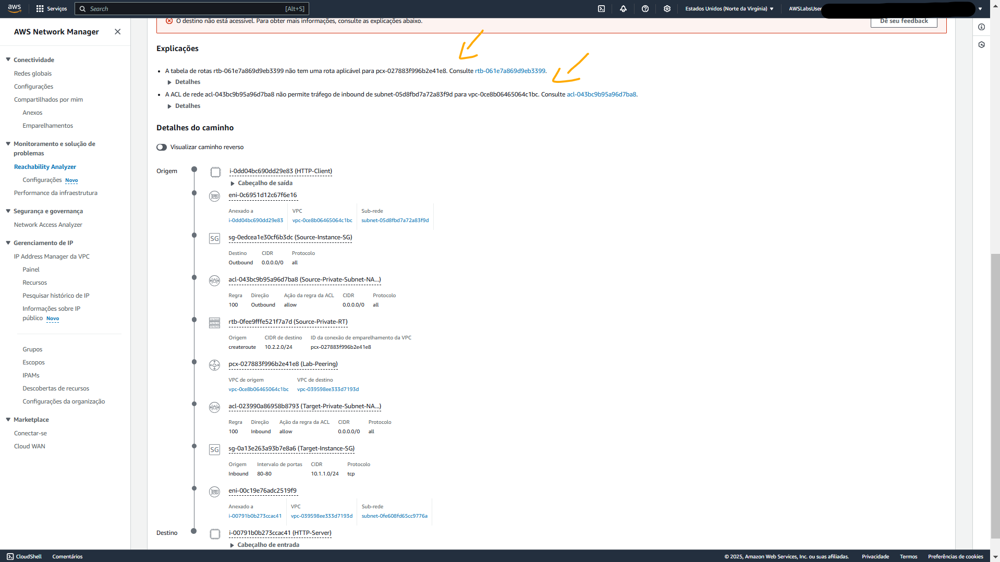 
    <figcaption>Imagem 07.</figcaption>
</figure>
 

<figure>
    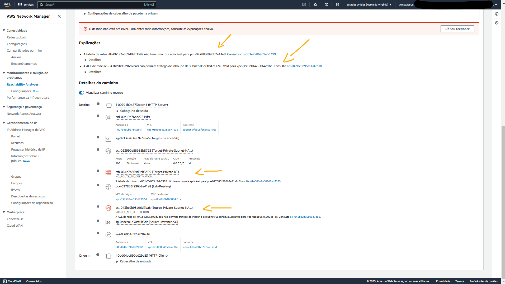 
    <figcaption>Imagem 08.</figcaption>
</figure>
 

Os saltos que estavam bloqueando o tráfego foram examinados, onde foi observado o seguinte:
- A tabela de rotas `Target-Private-RT` não tinha uma rota aplicável para `Source-Private-Subnet` via peering de VPC.
- O `Source-Private-Subnet-NACL` não permitia tráfego de entrada do `Target-Private-Subnet`.

Para correção da tabela de rotas, a `Target-Private-RT` foi selecionada e uma rota foi criada com a seguinte definição:
- Para Destino: `10.1.1.0/24`, que era o IP da sub-rede privada da VPC `Source` (`Source-Private-Subnet`).
- Para Fonte: foi selecionado `Conexão de Peering` e escolhida `Lab-Peering`.

A imagem 09 mostra a adição dessa nova rota na tabela de rotas da sub-rede privada da VPC `Target`.

<figure>
    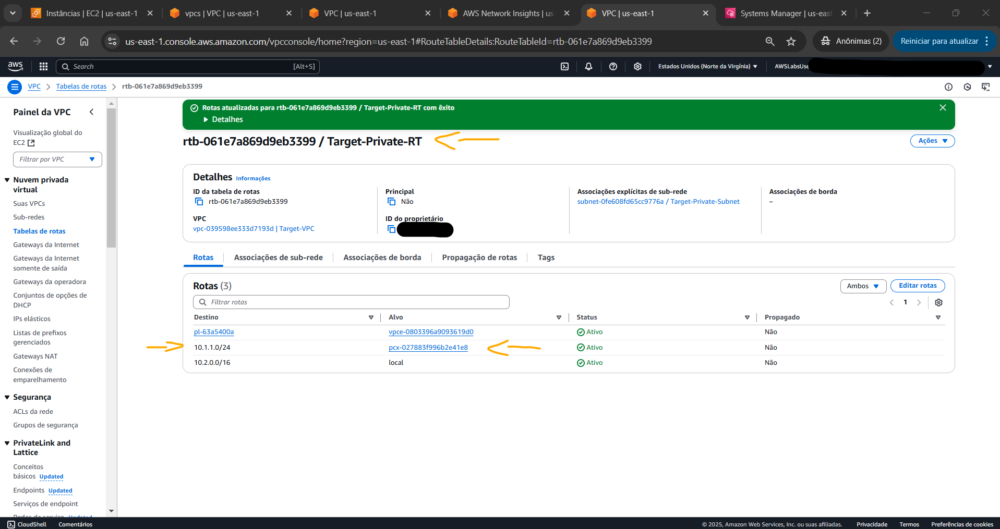 
    <figcaption>Imagem 09.</figcaption>
</figure>
 

Para correção da ACL da sub-rede privada da VPC `Source`, foi selecionado `Source-Private-Subnet-NACL` e uma regra de entrada foi construída com a seguinte definição:
- Para o número da regra: `110`.
- Para Tipo: foi selecionado `TCP personalizado`.
- Para intervalo de portas: `1024-65535`.
- Para Fonte: `10.2.2.0/24`, que era o IP da sub-rede privada da VPC `Target` (`Target-Private-Subnet`).

A imagem 10 exibe a regra de entrada adicionada na ACL. Esta ACL já possuía uma regra de entrada que permitia tráfego HTTPS de qualquer lugar (`0.0.0.0/0`).

<figure>
    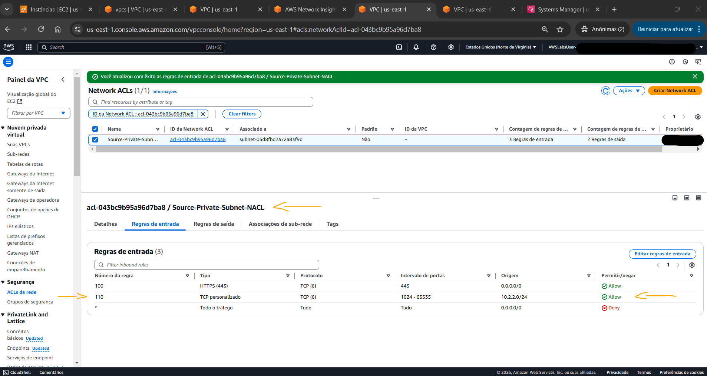 
    <figcaption>Imagem 10.</figcaption>
</figure>
 

Após corrigir os problemas, a análise no *Reachability Analyzer* foi executada novamente utilizando o mesmo caminho já criado. Após atualizar o status, o status Reachability para a última execução devia exibir `Reachable`. Rolando para baixo até as seções `Explanations e Path details` foi possível visualizar a análise detalhada, conforme imagem 11. Também foi verificado o caminho reverso.

<figure>
    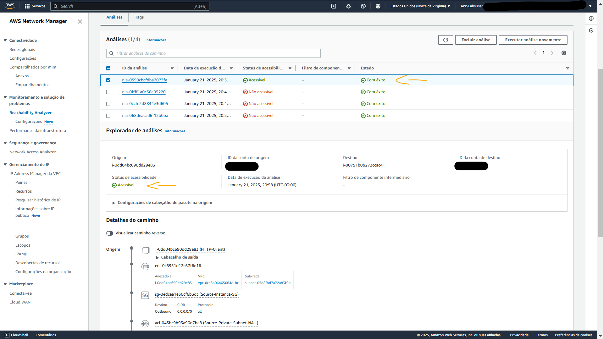 
    <figcaption>Imagem 11.</figcaption>
</figure>
 

Por fim, uma nova sessão remota com a instância cliente foi aberta, ou a mesma sessão já aberta foi utilizada, e o comando `wget http://10.2.2.43` novamente foi executado, passando o endereço de IP privado da instância do servidor. A imagem 12 abaixo mostra que uma resposta 200 foi retornada indicando que a conexão foi bem-sucedida.

<figure>
    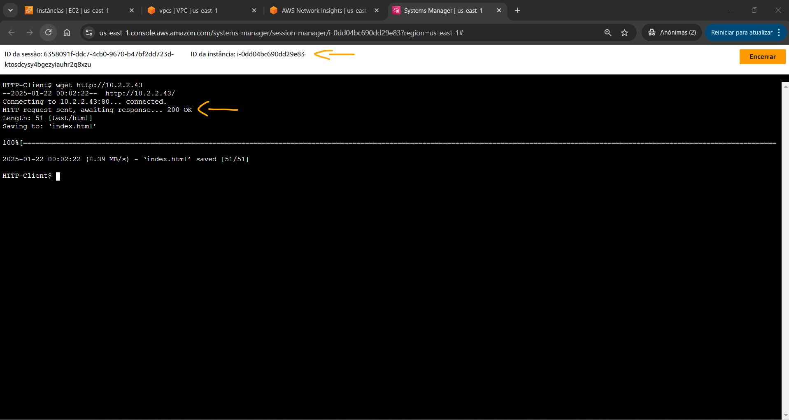 
    <figcaption>Imagem 12.</figcaption>
</figure>
 