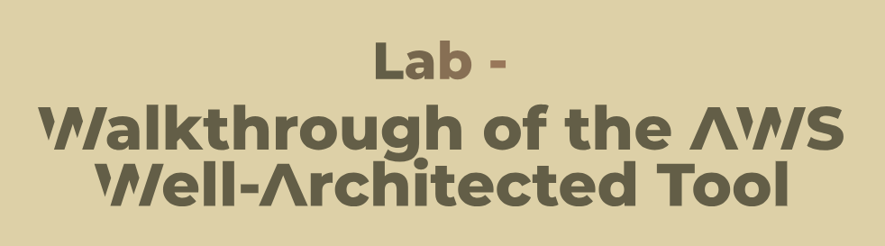
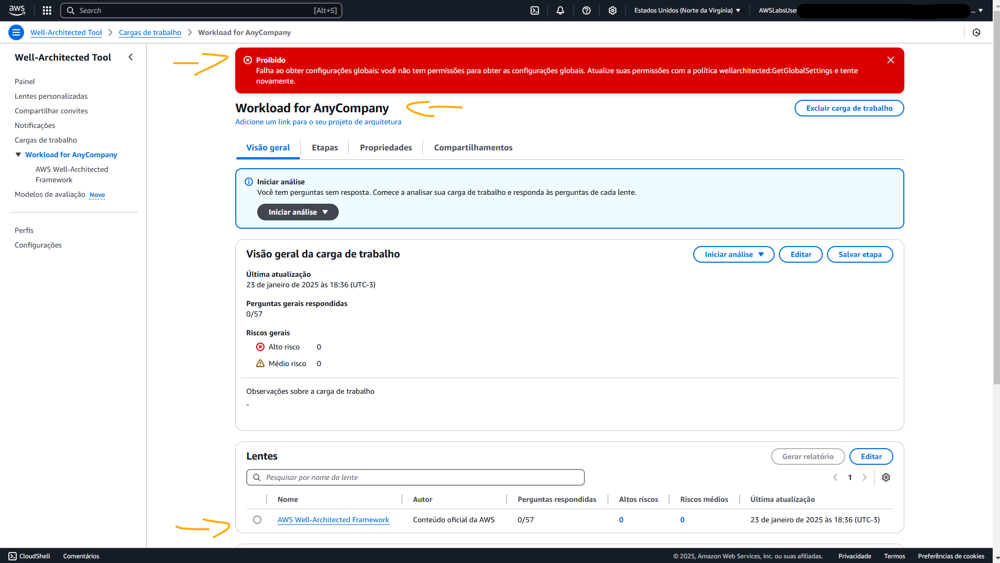
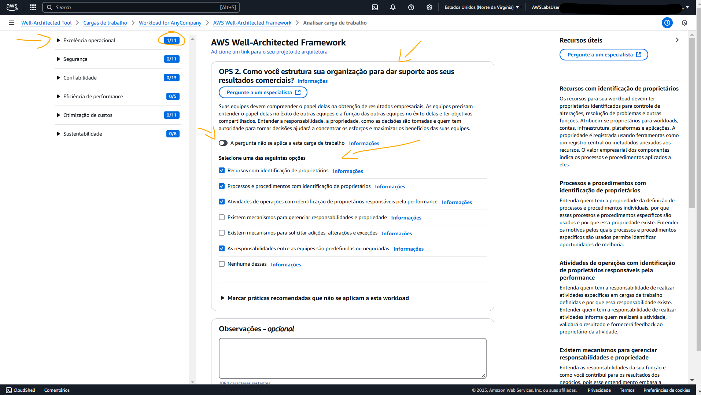
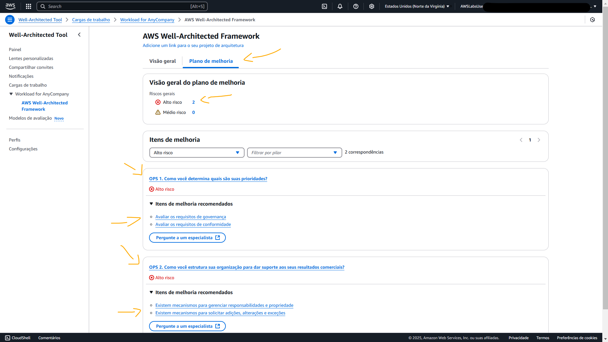
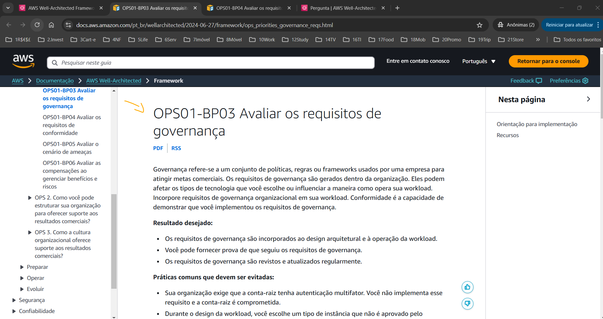
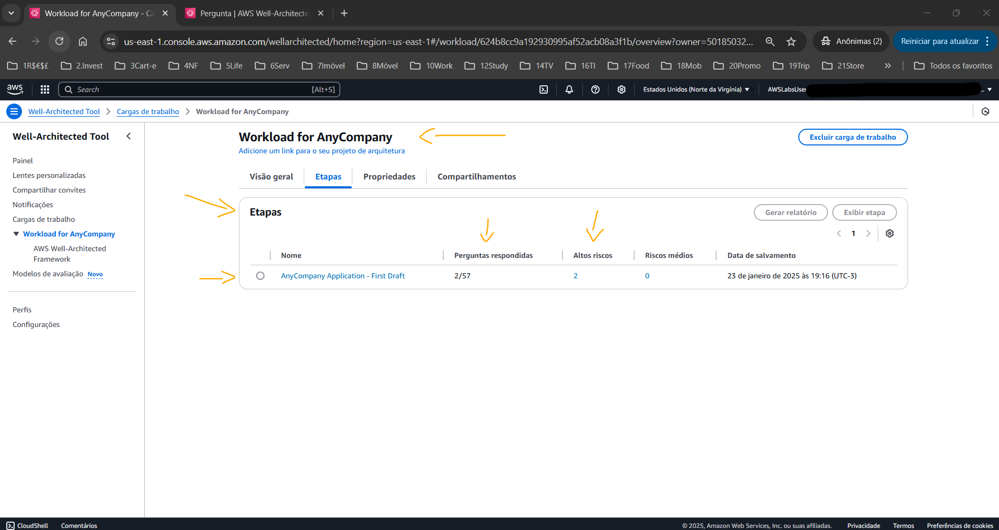
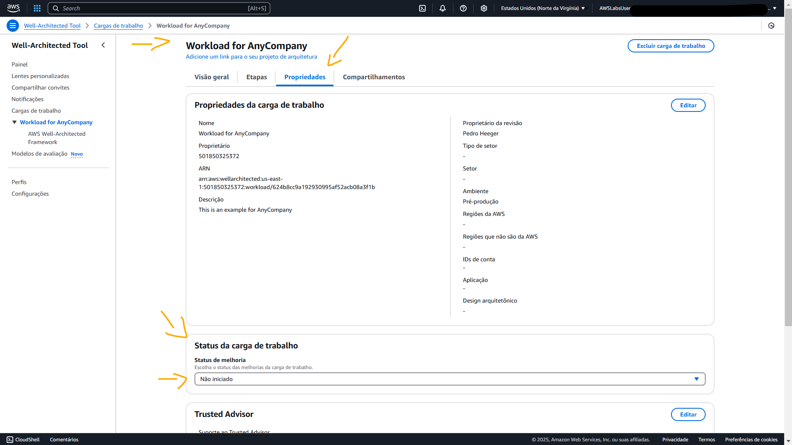
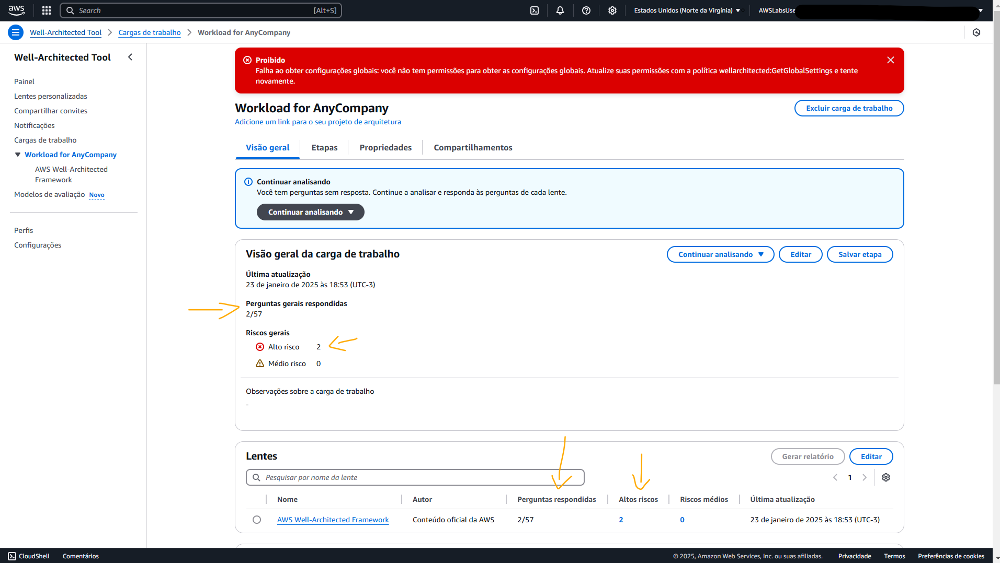

# Lab - Walkthrough of the AWS Well-Architected Tool   

### AWS Skill Builder <a href="../../">aws_skill_builder   </a>
### Training Category: <a href="../../self_paced_lab">self_paced_lab</a>
### Software/Subject: aws   
### Course: <a href="./">curso_spl_013 (Lab - Walkthrough of the AWS Well-Architected Tool)   </a>

#### Parceria da AWS com a Escola da Nuvem (EDN)   

---

### Theme:
- Cloud Computing

### Used Tools:
- Operating System (OS): 
  - Windows 11   
- Cloud:
  - Amazon Web Services (AWS)   
- Cloud Services:
  - Amazon QuickSight   
  - Amazon QuickSight Q   
  - Google Drive   
- Language:
  - HTML   
  - Markdown   
- Integrated Development Environment (IDE) and Text Editor:
  - Visual Studio Code (VS Code)   
- Versioning: 
  - Git   
- Repository:
  - GitHub   

---

<a name="item0"><h3>Course Strcuture:</h3></a>
1. Lab - Walkthrough of the AWS Well-Architected Tool 
1.1 <a href="#item01.1">Tarefa 1: criar uma carga de trabalho</a> 
1.2 <a href="#item01.2">Tarefa 2: realizar uma análise</a> 
1.3 <a href="#item01.3">Tarefa 3: salvar uma etapa</a> 
1.4 <a href="#item01.4">Tarefa 4: visualizar um relatório de etapa</a> 

---

### Objective:
O objetivo deste laboratório prático foi utilizar o **AWS Well Architected Framework** para criar uma carga de trabalho, realizar uma análise da arquitetura, salvar uma etapa e visualizar um relatório da etapa salva.

### Structure:
A estrutura do curso é formada por:
- Este arquivo de README.
- A pasta `0-aux`, pasta auxiliar com imagens utilizadas na construção desse arquivo de README.
- A pasta `resource` com os arquivos utilizados.

### Development:
Este curso foi um laboratório prático realizado na plataforma **AWS Skill Builder**, cuja subscrição foi devida a uma parceria entre a **AWS** e a **Escola da Nuvem**. A infraestrutura de cloud utilizada foi fornecida através de um sandbox do **AWS Skill Builder** que possibilitava acesso ao console da **AWS**. Contudo foi necessário seguir estritamente as orientações determinadas no laboratório. Dessa maneira, a forma de interação com os recursos da cloud foram sempre através do console fornecido pelo sandbox, a não ser em casos em que o próprio laboratório instruiu para utilização de outras ferramentas de interação como **AWS CLI** ou **AWS SDK**.

O laboratório do **AWS Skill Builder** tem o foco em executar apenas o que é orientado no escopo, todos os recursos ou serviços que podem ser requisitados adicionalmente já vêm provisionados por padrão pelo laboratório. Ao iniciar o laboratório, o sandbox do **AWS Skill Builder** provisiona diversos recursos e serviços para o funcionamento através de uma ou mais pilhas do **AWS CloudFormation** de forma automática. 

O acesso ao console no sandbox do **AWS Skill Builder** é realizado por meio de uma identidade federada. O Skill Builder funciona como um provedor de identidade (IdP), autenticando o usuário e vinculando-o a uma role do **AWS IAM** provisionada automaticamente por uma das pilhas do CloudFormation. Essa role concede permissões temporárias e mínimas necessárias para a execução do laboratório, garantindo segurança e controle sobre os recursos utilizados. O laboratório, por padrão, determina a região a ser utilizada e ela não deve ser alterada, somente se o próprio laboratório indicar. As configurações não informadas no laboratório devem ser sempre mantidas como padrão que estão.

<a name="item01.1"><h4>Tarefa 1: criar uma carga de trabalho</h4></a>[Back to summary](#item0)

O **AWS Well Architected Framework** é um serviço na nuvem que fornece um processo consistente para medir a arquitetura usando as práticas recomendadas da **AWS**. A ferramenta do AWS Well-Architected contribui durante todo o ciclo de vida do produto, desempenhando os seguintes papeis:
- Ajudando a documentar as decisões que é tomada.
- Fornecendo recomendações para melhorar a carga de trabalho com base em práticas recomendadas.
- Orientando sobre como tornar as cargas de trabalho mais confiáveis, seguras, eficientes e econômicas.

Nesta primeira tarefa, o objetivo consistiu em criar uma carga de trabalho dentro do **AWS Well Architected Framework**, configurando da seguinte forma:
- Na página Especificar propriedades, na seção Propriedades da carga de trabalho, foram feitas as definições abaixo:
  - Nome: `Workload for AnyCompany`.
  - Descrição: `This is an example for AnyCompany`.
  - Proprietário da revisão: foi inserido meu nome (`Pedro Heeger`).
  - Ambiente: foi escolhido `Pré-produção`.
  - Regiões: foi escolhido `Regiões da AWS`.
  - Escolher regiões: foi selecionada a Região AWS que correspondia ao valor `AWSRegion` listado à esquerda nas instruções do laboratório, sendo a região `us-east-1` (Norte).
- Foi escolhida a lente do AWS Well-Architected Framework se ela ainda não estivesse selecionada. As lentes fornecem uma maneira de medir de modo consistente as arquiteturas em relação às práticas recomendadas e identificar áreas para melhorias. A lente do AWS Well-Architected Framework é aplicada automaticamente quando uma carga de trabalho é definida.

A imagem 01 mostra a carga de trabalho criada no Well Architected.

<figure>
     
    <figcaption>Imagem 01.</figcaption>
</figure>
 

<a name="item01.2"><h4>Tarefa 2: realizar uma análise</h4></a>[Back to summary](#item0)

Com a carga de trabalho definida, agora foi possível realizar uma análise sobre a arquitetura dela. A ferramenta do AWS Well-Architected usa os seis pilares descritos no **AWS Well-Architected Framework** para garantir, são eles:
- Excelência operacional
- Segurança
- Confiabilidade
- Eficiência de desempenho
- Otimização de custos
- Sustentabilidade

Ao realizar uma análise, perguntas era feitas que ajudavam a determinar se a aplicação estava seguindo as práticas recomendadas. Dessa forma, a análise foi iniciada escolhendo o **AWS Well-Architected Framework**. A ferramenta do AWS Well-Architected começava com o primeiro pilar: excelência operacional. Cada pilar tinha um conjunto de perguntas. Para excelência operacional, a primeira pergunta foi `OPS 1. Como determinar quais são suas prioridades?`. Quando aparecia uma pergunta, havia um conjunto de respostas que podiam ser selecionadas com base no que no entendimento sobre a arquitetura da aplicação. Se a pergunta não fosse aplicável, era possível escolher a opção `A pergunta não se aplica a esta carga de trabalho` e ir para a próxima pergunta.

A aplicação avaliada atendia aos seguintes critérios:
- Avaliar as necessidades do cliente
- Avaliar as necessidades dos clientes internos
- Avaliar o cenário de ameaças
- Avaliar as concessões enquanto gerencia benefícios e riscos

Contudo, a mesma não atendia ao critérios:
- Avaliar os requisitos de governança
- Avaliar os requisitos de conformidade

Na página do **AWS Well-Architected Framework**, na seção `OPS 1. Como determinar quais são suas prioridades?` foram selecionadas para avaliação as seguintes opções:
- Avaliar as necessidades do cliente.
- Avaliar as necessidades dos clientes internos.
- Avaliar o cenário de ameaças.
- Avaliar as concessões enquanto gerencia benefícios e riscos.

Durante a análise era possível escolher o texto Informações próximo a qualquer resposta para saber mais sobre os critérios. A análise podia ser salva e retornada posteriormente. A segunda pergunta realizada foi `OPS 2. How do you structure your organization to support your business outcomes?` (`OPS 2. Como estruturar a organização para dar suporte aos seus resultados de negócios?`), onde as seguintes alternativas foram selecionadas, conforme exibido na imagem 02:
- `Resources have identified owners` (`Recursos têm proprietários identificados`).
- `Processes and procedures have identified owners` (`Processos e procedimentos têm proprietários identificados`).
- `Operations activities have identified owners responsible for their performance` (`Atividades de operações têm proprietários identificados responsáveis pelo desempenho`).
- `Responsibilities between teams are predefined or negotiated` (`As responsabilidades entre as equipes estão predefinidas ou negociadas`).

<figure>
     
    <figcaption>Imagem 02.</figcaption>
</figure>
 

Na seção de Lentes, dois itens de alto risco estavam identificados. Esses itens foram abertos e visualizados, verificando seu `Improvement plan overview` (`Visão geral do plano de melhoria`). A ferramenta do AWS Well-Architected identificou os quatro itens que foram omitidos nas respostas como alto risco e recomendou maneiras de melhorar a aplicação. Dessa forma, a recomendação foi expandida na seção `OPS 1. How do you determine what your priorities are?` (`OPS 1. Como determinar quais são suas prioridades?`), os itens de melhoria recomendados foram escolhidos e a opção `Evaluate governance requirements` (`Avaliar os requisitos de governança`) foi selecionada, conforme imagem 03. A documentação do AWS Well-Architected Framework era exibida, descrevendo os requisitos de governança e as recomendações para a aplicação. Ao analisar uma aplicação usando a ferramenta do AWS Well-Architected, era possível acompanhar problemas, ver recomendações, ler as práticas recomendadas e aplicar as mudanças na aplicação antes de finalizar a análise da arquitetura da aplicação.

<figure>
     
    <figcaption>Imagem 03.</figcaption>
</figure>
 

<figure>
     
    <figcaption>Imagem 05.</figcaption>
</figure>
 

<figure>
     
    <figcaption>Imagem 06.</figcaption>
</figure>
 

<figure>
     
    <figcaption>Imagem 07.</figcaption>
</figure>
 

<figure>
     
    <figcaption>Imagem 08.</figcaption>
</figure>
 

<figure>
     
    <figcaption>Imagem 09.</figcaption>
</figure>
 

<a name="item01.3"><h4>Tarefa 3: salvar uma etapa</h4></a>[Back to summary](#item0)

A análise inicial foi concluída e poderia ser continuada de onde parou a qualquer momento. Portanto, na tarefa 3 foi necessário salvá-la como uma etapa. 

<figure>
     
    <figcaption>Imagem 04.</figcaption>
</figure>
 

<a name="item01.4"><h4>Tarefa 4: visualizar um relatório de etapa</h4></a>[Back to summary](#item0)

