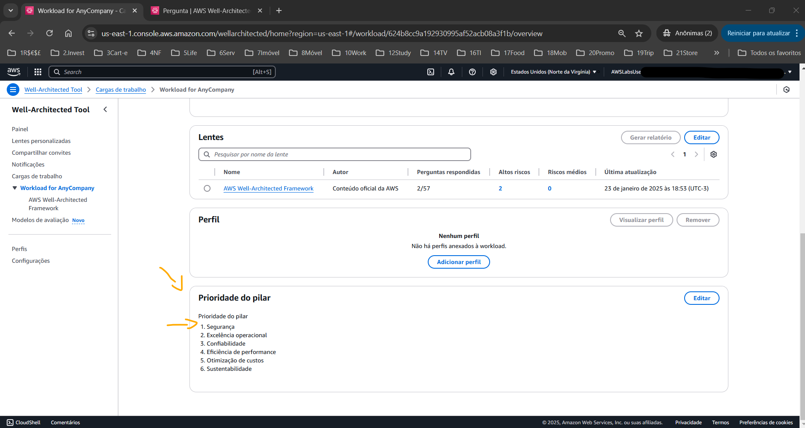

# Lab - Walkthrough of the AWS Well-Architected Tool   

### AWS Skill Builder <a href="../../">aws_skill_builder   </a>
### Training Category: <a href="../../self_paced_lab">self_paced_lab</a>
### Software/Subject: aws   
### Course: <a href="./">curso_spl_013 (Lab - Walkthrough of the AWS Well-Architected Tool)   </a>

#### Parceria da AWS com a Escola da Nuvem (EDN)   

---

### Theme:
- Cloud Computing

### Used Tools:
- Operating System (OS): 
  - Windows 11   
- Cloud:
  - Amazon Web Services (AWS)   
- Cloud Services:
  - AWS Well-Architected Framework   
  - AWS Well-Architected Tool   
  - Google Drive   
- Language:
  - HTML   
  - Markdown   
- Integrated Development Environment (IDE) and Text Editor:
  - Visual Studio Code (VS Code)   
- Versioning: 
  - Git   
- Repository:
  - GitHub   

---

<a name="item0"><h3>Course Strcuture:</h3></a>
1. Lab - Walkthrough of the AWS Well-Architected Tool 
1.1 <a href="#item01.1">Tarefa 1: criar uma carga de trabalho</a> 
1.2 <a href="#item01.2">Tarefa 2: realizar uma análise</a> 
1.3 <a href="#item01.3">Tarefa 3: salvar uma etapa</a> 
1.4 <a href="#item01.4">Tarefa 4: visualizar um relatório de etapa</a> 

---

### Objective:
O objetivo deste laboratório prático foi utilizar o **AWS Well Architected Framework** para criar uma carga de trabalho, realizar uma análise da arquitetura, salvar uma etapa e visualizar um relatório da etapa salva.

### Structure:
A estrutura do curso é formada por:
- Este arquivo de README.
- A pasta `0-aux`, pasta auxiliar com imagens utilizadas na construção desse arquivo de README.
- A pasta `resource` com os arquivos utilizados.

### Development:
Este curso foi um laboratório prático realizado na plataforma **AWS Skill Builder**, cuja subscrição foi devida a uma parceria entre a **AWS** e a **Escola da Nuvem**. A infraestrutura de cloud utilizada foi fornecida através de um sandbox do **AWS Skill Builder** que possibilitava acesso ao console da **AWS**. Contudo foi necessário seguir estritamente as orientações determinadas no laboratório. Dessa maneira, a forma de interação com os recursos da cloud foram sempre através do console fornecido pelo sandbox, a não ser em casos em que o próprio laboratório instruiu para utilização de outras ferramentas de interação como **AWS CLI** ou **AWS SDK**.

O laboratório do **AWS Skill Builder** tem o foco em executar apenas o que é orientado no escopo, todos os recursos ou serviços que podem ser requisitados adicionalmente já vêm provisionados por padrão pelo laboratório. Ao iniciar o laboratório, o sandbox do **AWS Skill Builder** provisiona diversos recursos e serviços para o funcionamento através de uma ou mais pilhas do **AWS CloudFormation** de forma automática. 

O acesso ao console no sandbox do **AWS Skill Builder** é realizado por meio de uma identidade federada. O Skill Builder funciona como um provedor de identidade (IdP), autenticando o usuário e vinculando-o a uma role do **AWS IAM** provisionada automaticamente por uma das pilhas do CloudFormation. Essa role concede permissões temporárias e mínimas necessárias para a execução do laboratório, garantindo segurança e controle sobre os recursos utilizados. O laboratório, por padrão, determina a região a ser utilizada e ela não deve ser alterada, somente se o próprio laboratório indicar. As configurações não informadas no laboratório devem ser sempre mantidas como padrão que estão.

<a name="item01.1"><h4>Tarefa 1: criar uma carga de trabalho</h4></a>[Back to summary](#item0)

O **AWS Well Architected Framework** é um serviço na nuvem que fornece um processo consistente para medir a arquitetura usando as práticas recomendadas da **AWS**. A ferramenta do AWS Well-Architected contribui durante todo o ciclo de vida do produto, desempenhando os seguintes papeis:
- Ajudando a documentar as decisões que são tomadas.
- Fornecendo recomendações para melhorar a carga de trabalho com base em práticas recomendadas.
- Orientando sobre como tornar as cargas de trabalho mais confiáveis, seguras, eficientes e econômicas.

Nesta primeira tarefa, o objetivo consistiu em criar uma carga de trabalho dentro do **AWS Well Architected Framework** de uma empresa fictícia de nome `AnyCompany`, configurando da seguinte forma:
- Na página Especificar propriedades, na seção Propriedades da carga de trabalho, foram feitas as definições abaixo:
  - Nome: `Workload for AnyCompany`.
  - Descrição: `This is an example for AnyCompany`.
  - Proprietário da revisão: foi inserido meu nome (`Pedro Heeger`).
  - Ambiente: foi escolhido `Pré-produção`.
  - Regiões: foi escolhido `Regiões da AWS`.
  - Escolher regiões: foi selecionada a Região AWS que correspondia ao valor `AWSRegion` listado à esquerda nas instruções do laboratório, sendo a região `us-east-1` (Norte Virginia).
- Foi escolhida *AWS Well-Architected Framework Lens* se ela ainda não estivesse selecionada. As lentes fornecem uma maneira de medir de modo consistente as arquiteturas em relação às práticas recomendadas e identificar áreas para melhorias. A lente do AWS Well-Architected Framework é aplicada automaticamente quando uma carga de trabalho é definida. Entretanto, também é possível utilizar outros tipos de lentes presentes no catálogo de lentes ou criar lentes personalizadas.

A imagem 01 mostra a carga de trabalho criada no Well Architected. Um alerta também era exibindo informando que a role utilizada neste laboratório não havia permissões para configurações globais, mas isso não impedia a execução do laboratório.

<figure>
     
    <figcaption>Imagem 01.</figcaption>
</figure>
 

<a name="item01.2"><h4>Tarefa 2: realizar uma análise</h4></a>[Back to summary](#item0)

Com a carga de trabalho definida, agora foi possível realizar uma análise sobre a arquitetura dela. A ferramenta do AWS Well-Architected usa os seis pilares descritos no **AWS Well-Architected Framework**, que são eles:
- Excelência operacional
- Segurança
- Confiabilidade
- Eficiência de desempenho
- Otimização de custos
- Sustentabilidade

Ao realizar uma análise, perguntas eram feitas que ajudavam a determinar se a aplicação estava seguindo as práticas recomendadas. Dessa forma, a análise foi iniciada ou continuada, pois muitas vezes ao definir uma carga de trabalho já é indicado que a análise iniciou, mesmo ainda não tendo respondido nenhuma pergunta. A ferramenta do AWS Well-Architected começava com o primeiro pilar: excelência operacional. Cada pilar tinha um conjunto de perguntas. Para excelência operacional, a primeira pergunta foi `OPS 1. Como determinar quais são suas prioridades?`. Quando aparecia uma pergunta, havia um conjunto de respostas que podiam ser selecionadas com base no entendimento sobre a arquitetura da aplicação. Se a pergunta não fosse aplicável, era possível escolher a opção `A pergunta não se aplica a esta carga de trabalho` e ir para a próxima pergunta.

A aplicação avaliada atendia aos seguintes critérios:
- Avaliar as necessidades do cliente
- Avaliar as necessidades dos clientes internos
- Avaliar o cenário de ameaças
- Avaliar as concessões enquanto gerencia benefícios e riscos (Avalie as vantagens e desvantagens enquanto gerencia benefícios e riscos)

Contudo, a mesma não atendia ao critérios:
- Avaliar os requisitos de governança
- Avaliar os requisitos de conformidade

Na página do **AWS Well-Architected Framework**, nesta primeira pergunta `OPS 1. Como determinar quais são suas prioridades?` foram selecionadas para avaliação as respostas que eram atendidas pela aplicação, conforme mostrado na imagem 02.
- Avaliar as necessidades do cliente
- Avaliar as necessidades dos clientes internos
- Avaliar o cenário de ameaças
- Avaliar as concessões enquanto gerencia benefícios e riscos (Avalie as vantagens e desvantagens enquanto gerencia benefícios e riscos)

<figure>
     
    <figcaption>Imagem 02.</figcaption>
</figure>
 

Durante a análise era possível escolher a opção `Informações` próximo a qualquer uma das respostas para saber mais sobre os critérios da resposta. A análise também podia ser salva e retornada posteriormente. Entretanto mais uma pergunta foi respondida antes de salvar a análise como uma etapa. A segunda pergunta realizada foi `OPS 2. How do you structure your organization to support your business outcomes?` (`OPS 2. Como você estrutura sua organização para dar suporte aos seus resultados comerciais?`), onde as seguintes alternativas foram selecionadas, conforme exibido na imagem 03:
- `Resources have identified owners` (`Recursos com identificação de proprietários`).
- `Processes and procedures have identified owners` (`Processos e procedimentos com identificação de proprietários`).
- `Operations activities have identified owners responsible for their performance` (`Atividades de operações com identificação de proprietários responsáveis pela performance`).
- `Responsibilities between teams are predefined or negotiated` (`As responsabilidades entre as equipes são predefinidas ou negociadas`).

<figure>
     
    <figcaption>Imagem 03.</figcaption>
</figure>
 

Após salvar essa análise, na seção de Lentes, dois itens de alto risco estavam identificados, conforme imagem 04. Esses itens foram abertos e visualizados, verificando seu `Improvement plan` (`Plano de melhoria`). A ferramenta do AWS Well-Architected identificou os quatro itens que foram omitidos (não marcados) nas respostas das perguntas 1 e 2 do pilar de excelência operacional e marcou como alto risco, recomendado maneiras de melhorar a aplicação. Esses itens, evidenciados pela imagem 05, eram respectivamente:
- `Avaliar os requisitos de governança`
- `Avaliar os requisitos de conformidade`
- `Existem mecanismos para gerenciar responsabilidades e propriedade`
- `Existem mecanismos para solicitar adições, alterações e exceções`

<figure>
     
    <figcaption>Imagem 04.</figcaption>
</figure>
 

<figure>
     
    <figcaption>Imagem 05.</figcaption>
</figure>
 

Dessa forma, as recomendações das duas perguntas foram expandidas e podiam ser selecionadas. Prontamente, a documentação do AWS Well-Architected Framework para essa resposta era exibida, descrevendo os requisitos de governança e as recomendações para a aplicação. A imagem 06 mostra a documentação para o item o item de melhoria recomendado `Evaluate governance requirements` (`Avaliar os requisitos de governança`) da pergunta 1, `OPS 1. How do you determine what your priorities are?` (`OPS 1. Como determinar quais são suas prioridades?`).

<figure>
     
    <figcaption>Imagem 06.</figcaption>
</figure>
 

Ao analisar uma aplicação usando a ferramenta do AWS Well-Architected, era possível acompanhar problemas, ver recomendações, ler as práticas recomendadas e aplicar as mudanças na aplicação antes de finalizar a análise completa da arquitetura da aplicação.

<a name="item01.3"><h4>Tarefa 3: salvar uma etapa</h4></a>[Back to summary](#item0)

Apesar de ter 57 perguntas totais e 55 para responder, a análise neste laboratório foi concluída. A análise podia ser interrompida e retomada sempre que necessário, desde que fosse salvo as alterações realizadas. A análise também podia ser salva em uma etapa. Uma etapa registra o estado da carga de trabalho em um momento específico. Em um ambiente de produção, a primeira etapa geralmente é criada após fornecer respostas a todas as perguntas iniciais nos seis pilares, ou seja, as 57. Após a criação da etapa inicial, sempre que for feito aprimoramentos em uma carga de trabalho, ou seja, alterações nas respostas, ela deve ser salva como outra etapa para documentação do progresso. Isto funciona como uma forma de versionamento da análise. 

No caso deste laboratório a análise inicial contemplou apenas as primeiras duas perguntas e a etapa foi salva selecionando a carga de trabalho em questão e definindo o seguinte nome para a etapa: `AnyCompany Application - First Draft`. Na imagem 07, a etapa salva era exibida mostrando: o número de perguntas que foi respondido, o número de altos riscos, o número de riscos médios e a data em que a etapa foi salva.

<figure>
     
    <figcaption>Imagem 07.</figcaption>
</figure>
 

<a name="item01.4"><h4>Tarefa 4: visualizar um relatório de etapa</h4></a>[Back to summary](#item0)

O **AWS Well-Architected Framework** possui vários recursos adicionais, incluindo o ajuste de prioridades do pilar para a arquitetura da aplicação, o registro do status das análises da aplicação e a geração de relatórios de etapa. É possível gerar um relatório de etapa contendo as respostas para as perguntas da carga de trabalho, as anotações e quaisquer riscos altos e médios que estavam presentes quando a etapa foi salva.

Nesta última tarefa, o objetivo foi ajustar as prioridades do pilar, definir o status da melhoria e visualizar o relatório da etapa. Dessa forma, a carga de trabalho de nome `Workload for AnyCompany` foi selecionada para primeiro ajustar a prioridade do pilar. Um pilar pode ter maior importância dependendo do tipo de aplicação que está sendo criado. Na carga de trabalho desse laboratório, aplicação desenvolvida precisava da implementação de várias camadas de segurança. Sendo assim, o pilar de segurança foi ajustado definindo ele com a maior prioridade. Para fazer isso, foi só mover o pilar para o topo da lista de prioridade do pilar no plano de melhoria, conforme evidenciado na imagem 08.

<figure>
     
    <figcaption>Imagem 08.</figcaption>
</figure>
 

Também foi definido o status de melhoria como `Não Iniciado` na seção Status da carga de trabalho na guia Propriedades dessa mesma carga de trabalho. A imagem 09 mostra essa configuração.

<figure>
     
    <figcaption>Imagem 09.</figcaption>
</figure>
 

Por fim, o relatório da etapa criada foi gerado para visualização. Um relatório permite compartilhar detalhes sobre a etapa com outros membros da equipe que possam não ter acesso à ferramenta do AWS Well-Architected. Dessa forma, a carga de trabalho construída no Well-Architected foi selecionada e na guia Visão geral, na seção lente foi escolhida a opção `Gerar relatório` selecionado o Well-Architected. Em seguida, o relatório foi exibido em uma nova guia do navegador da máquina física **Windows**. Um ponto de observação era que dependendo do navegador utilizado, em vez de uma nova guia com o relatório fosse aberta, era exibida uma janela de mensagem com o nome `Save As` (`Salvar como`), onde era possível salvar e analisar o relatório localmente. O relatório era salvo em formato PDF e o arquivo foi nomeado de [relatorio_well_architected.pdf](./resource/relatorio_well_architected.pdf)

<figure>
     
    <figcaption>Imagem 10.</figcaption>
</figure>
 