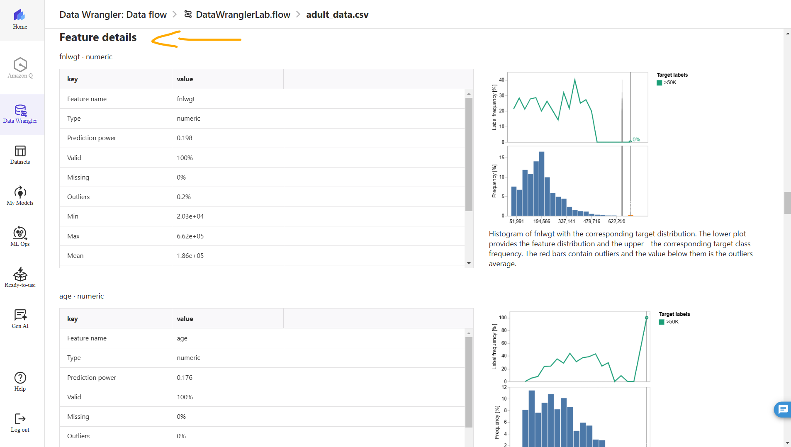

# Lab - Analyze and Prepare Data with Amazon SageMaker Data Wrangler and Amazon EMR   

### AWS Skill Builder <a href="../../">aws_skill_builder   </a>
### Training Category: <a href="../../self_paced_lab">self_paced_lab</a>
### Software/Subject: aws   
### Course: <a href="./">curso_spl_014 (Lab - Analyze and Prepare Data with Amazon SageMaker Data Wrangler and Amazon EMR)   </a>

#### Parceria da AWS com a Escola da Nuvem (EDN)   

---

### Theme:
- Cloud Computing

### Used Tools:
- Operating System (OS): 
  - Windows 11   
- Cloud:
  - Amazon Web Services (AWS)   
- Cloud Services:
  - Amazon Elastic MapReduce (EMR)   
  - Amazon SageMaker   
  - Amazon SageMaker Canvas   
  - Amazon SageMaker Studio; Amazon SageMaker Studio Lab   
  - Google Drive   
- Language:
  - Python   
  - HTML   
  - Markdown   
- Integrated Development Environment (IDE) and Text Editor:
  - Visual Studio Code (VS Code)   
- Notebook Interface:
  - Jupyter Notebook   
- Versioning: 
  - Git   
- Repository:
  - GitHub   
- Big Data:
  - Apache Hadoop   
  - Apache Hive   
  - Apache Spark   

---

<a name="item0"><h3>Course Strcuture:</h3></a>
1. Lab - Analyze and Prepare Data with Amazon SageMaker Data Wrangler and Amazon EMR 
1.1 <a href="#item01.1">Tarefa 1: Importar, visualizar e executar uma análise preliminar dos dados com o SageMaker Data Wrangler</a> 
1.2 <a href="#item01.2">Tarefa 2: Analisar e visualizar os dados</a> 
1.3 <a href="#item01.3">Tarefa 3: Executar transformações de dados e exportar os conjuntos de dados</a> 
1.4 <a href="#item01.4">Tarefa 4: Configurar o ambiente</a> 
1.4 <a href="#item01.5">Tarefa 5: Conectar a um cluster EMR</a> 
1.4 <a href="#item01.6">Tarefa 6: Explorar e consultar dados do kernel SparkMagic PySpark</a> 

---

### Objective:
O objetivo deste laboratório prático foi importar dados de duas fontes diferentes para o **Amazon SageMaker Wrangler**, visualizar, analisar e transformar esses dados para obter insights necessário para resolução de um cenário hipotético proposto pelo laboratório. A primeira importação foi do ... e após realizar toda análise ela foi exportada para o **Amazon S3**. A segunda importação foi de dados trazidos de uma tabela do **Apache Hive** em um cluster do **Amazon Elastic MapReduce (EMR)** utilizando o **Apache Spark** para consultar esses dados. O cenário proposto em questão foi de uma empresa de nome AnyCompany Consulting que para atender seu cliente precisva fornecer uma solução de machine learning (ML) que pudesse prever se um indivíduo ganharia menos de 50.000 USD com base em dados demográficos, tendo como objetivo indentificar se esse indivíduo estaria apto a receber um serviço de assistência governamental.

### Structure:
A estrutura do curso é formada por:
- Este arquivo de README.
- A pasta `0-aux`, pasta auxiliar com imagens utilizadas na construção desse arquivo de README.
- A pasta `resource` com os arquivos utilizados.

### Development:
Este curso foi um laboratório prático realizado na plataforma **AWS Skill Builder**, cuja subscrição foi devida a uma parceria entre a **AWS** e a **Escola da Nuvem**. A infraestrutura de cloud utilizada foi fornecida através de um sandbox do **AWS Skill Builder** que possibilitava acesso ao console da **AWS**. Contudo foi necessário seguir estritamente as orientações determinadas no laboratório. Dessa maneira, a forma de interação com os recursos da cloud foram sempre através do console fornecido pelo sandbox, a não ser em casos em que o próprio laboratório instruiu para utilização de outras ferramentas de interação como **AWS CLI** ou **AWS SDK**.

O laboratório do **AWS Skill Builder** tem o foco em executar apenas o que é orientado no escopo, todos os recursos ou serviços que podem ser requisitados adicionalmente já vêm provisionados por padrão pelo laboratório. Ao iniciar o laboratório, o sandbox do **AWS Skill Builder** provisiona diversos recursos e serviços para o funcionamento através de uma ou mais pilhas do **AWS CloudFormation** de forma automática. 

O acesso ao console no sandbox do **AWS Skill Builder** é realizado por meio de uma identidade federada. O Skill Builder funciona como um provedor de identidade (IdP), autenticando o usuário e vinculando-o a uma role do **AWS IAM** provisionada automaticamente por uma das pilhas do CloudFormation. Essa role concede permissões temporárias e mínimas necessárias para a execução do laboratório, garantindo segurança e controle sobre os recursos utilizados. O laboratório, por padrão, determina a região a ser utilizada e ela não deve ser alterada, somente se o próprio laboratório indicar. As configurações não informadas no laboratório devem ser sempre mantidas como padrão que estão.

<a name="item01.1"><h4>Tarefa 1: Importar, visualizar e executar uma análise preliminar dos dados com o SageMaker Data Wrangler</h4></a>[Back to summary](#item0)

Na primeira tarefa do laboratório, o objetivo consistiu em importar um conjunto de dados de um bucket do **Amazon S3** para o recurso *Amazon SageMaker Data Wrangler*. O SageMaker Data Wrangler é um recurso do **Amazon SageMaker Studio** do serviço **Amazon SageMaker** para exploração e transformação de dados de imagem e dados tabulares para casos de uso de machine learning (ML) sem codificação. Ele inclui recursos de análise de dados integrados para gráficos e recursos de análise de modelo que economizam tempo, como importância do recurso, vazamento de destino e explicabilidade do modelo. Além da importação, os dados foram visualizados e uma primeira análise foi realizada para obter insights sobre a estrutura e qualidade dos dados.

No *SageMaker Data Wrangler*, um fluxo de dados (`Data flow`) é uma série de etapas de preparação de dados que é executada nos dados. Cada transformação é feita usando uma etapa de transformação. O fluxo tem uma série de nós que representam a importação dos dados, a análise dos dados e a transformação dos dados. O **Amazon SageMaker Canvas** é uma ferramenta de aprendizado de máquina da **AWS** que permite que usuários não técnicos criem e implementem modelos de machine learning sem necessidade de codificação. Ela oferece uma interface visual intuitiva para preparar dados, treinar modelos e fazer previsões, facilitando a democratização do acesso à inteligência artificial nas organizações. Apesar do Data Wrangler não ser nativamente do Canvas, ele consegue integrar-se com o Canvas, fornecendo algumas transformações básicas sem precisar sair do ambiente do Canvas. O ambiente do Canvas é visualizado na imagem 01.

<figure>
     
    <figcaption>Imagem 01.</figcaption>
</figure>
 
Portanto, um novo data flow do *SageMaker Data Wrangler* foi provisionado no *SageMaker Canvas*.

O parâmetro `SageMakerCanvasUrl` fornecido pelo laboratório possuía em seu valor uma URL direcionada para o **Amazon SageMaker Canvas** já com o perfil de usuário `SageMakerStudioUser` configurado (`https://us-west-2.console.aws.amazon.com/sagemaker/home?region=us-west-2#/studio/canvas/open/d-9fcbnvo7556z/SageMakerStudioUser`). Ao abrir o SageMaker Canvas, o recurso Data Wrangler foi selecionado para criar um novo data flow. Portanto, foi clicado em `Import and prepare`, a opção `Tabular` foi escolhida, a fonte de dados (`Data Source`) foi determinada como **Amazon S3** e o bucket de nome defino no valor do parâmetro `LabDataBucket` das instruções do lab foi escolhido (`labstack-5df51f9e-117e-44db-8f21-dd9-labdatabucket-rgm32dv6iweu`). Dentro do bucket, as pastas (prefixos) de `scripts` e em seguida `dados` foram escolhidos e o arquivo (objeto) **CSV** `adult_data.csv` foi selecionado. Imediatamente esse arquivo era aberto em uma visualização prévia e então ele foi confirmado como dataset. Assim foi concluída com sucesso a importação do conjunto de dados do bucket do S3 para o Data Wrangler. No Data Wrangler, o data flow criado era mostrado visualmente na aba `Data flow`, mas ela podia ser alterada para `Data` ou  `Analyses`, conforme imagem 02.

<figure>
     
    <figcaption>Imagem 02.</figcaption>
</figure>
 

Observe que o nome do data flow construído tinha um carimbo de data e hora. Para alterar isso para o nome `DataWranglerLab` foi preciso sair desse data flow e voltar na página principal do SageMaker Data Wrangler, onde a lista de data flows era visualizada contendo apenas esse fluxo de dados criado. Ao passar o cursor em cima da linha dele, um ícone de reticências vertical aparecia e nele tinha a opção renomear. A imagem 03 exibe a alteração de nome do data flow.

<figure>
     
    <figcaption>Imagem 03.</figcaption>
</figure>
 

Após importar os dados, foi executado a primeira análise de três, sendo as outras duas na tarefa 2. O SageMaker Data Wrangler pode fornecer insights e relatórios detalhados para analisar rapidamente os conjuntos de dados. Este relatório ajuda a saber as melhores maneiras de limpar e processar os dados. Sendo assim, o fluxo `DataWranglerLab` foi selecionado e a guia `Análises` foi aberta. Nesta guia era possível criar análises de tipos diferentes sobre o conjunto de dados. A primeira análise foi construída da seguinte forma:
- `Analysis type` (Tipo de análise): `Data Quality And Insights Report` (Relatório de qualidade de dados e insights).
- `Analysis name` (Nome da análise): `Data-Quality-Insights` (Insights sobre qualidade de dados).
- `Target column` (Coluna Destino): foi selecionada a coluna de `income` (renda).
- `Problem type` (Tipo de problema): foi escolhida a opção `Classification` (Classificação).
- `Data size` (Tamanho dos dados): foi selecionada a opção `Sampled dataset` (Conjunto de dados amostrado).

Após um tempo, o resultado da primeira análise dos dados foi exibido. Outros tipos de análises poderiam ser feitas no Data Wrangler, tem cerca de 12 tipos de análises diferentes. O Relatório de Qualidade de Dados e Insights possuía as seguintes seções:
- `Summary` (Resumo): Esta seção mostra estatísticas importantes do conjunto de dados, incluindo o número de recursos (colunas), a porcentagem de dados ausentes, o número de linhas duplicadas e os diferentes tipos de dados identificados para cada recurso. Imagem 04.
- `Duplicate rows` (Linhas duplicadas): Esta seção mostra muitos dos registros que provavelmente são dados duplicados. Se linhas aparecerem aqui, é possível adicionar uma transformação que remova dados duplicados. Imagem 05.
- `Anomalous samples` (Amostras anômalas): Esta seção mostra registros que são anomalias no conjunto de dados. O SageMaker Data Wrangler modela os dados e mostra registros que têm uma grande chance de serem outliers (valores discrepantes). Imagem 06.
- `Target column` (Coluna de destino): Esta seção mostra a distribuição da coluna de destino. Se uma coluna de destino não for igualmente distribuída, é necessário prestar mais atenção aos registros em cada valor para garantir que não esteja introduzindo viés no modelo. Se a coluna de destino estiver muito desbalanceada, é possível adicionar uma transformação para balancear a coluna de destino. Para este laboratório, a coluna de destino é balanceada o suficiente para fazer um modelo eficaz. Imagem 07.
- `Quick model` (Modelo rápido): Esta seção mostra métricas que são retornadas de um modelo rápido dos dados. É viável usar modelos rápidos para mostrar o quão efetivas as transformações são em melhorar o desempenho do modelo. Imagem 08.
- `Feature summary` (Resumo do recurso): Esta seção mostra o poder de previsão de cada recurso. Observe que `fnlwgt` e `native_country` têm o menor poder de previsão. Uma transformação para remover essas colunas pode ser adicionada. Isso ajuda o modelo a focar nos recursos que têm um poder de previsão maior. Imagem 09.
  - Observação: Não constatei que a coluna `fnlwgt` tinha o menor poder de previsão, pelo contrário, ela tinha o maior poder. A coluna que tinha o menor poder de previsão era `sex` seguido por `native_country`.
- `Feature details` (Detalhes do recurso): Esta seção mostra tabelas de métricas e gráficos de cada recurso. Observe que essas métricas e histogramas são semelhantes aos gráficos que são visualizado em uma interface de notebook. Imagem 10.
- `Definitions` (Definições): Esta seção inclui definições da maioria dos termos de ML usados ​​no Relatório de Insights e Qualidade de Dados. Imagem 11.

    <figure style="display: inline-block; margin-right: 5px;">
        
        <figcaption>Imagem 04.</figcaption>
    </figure>
    <figure style="display: inline-block; margin-left: 5px;">
        
        <figcaption>Imagem 05.</figcaption>
    </figure>

    <figure style="display: inline-block; margin-right: 5px;">
        
        <figcaption>Imagem 06.</figcaption>
    </figure>
    <figure style="display: inline-block; margin-left: 5px;">
        
        <figcaption>Imagem 07.</figcaption>
    </figure>

    <figure style="display: inline-block; margin-right: 5px;">
        
        <figcaption>Imagem 08.</figcaption>
    </figure>
    <figure style="display: inline-block; margin-left: 5px;">
        
        <figcaption>Imagem 09.</figcaption>
    </figure>

    <figure style="display: inline-block; margin-right: 5px;">
        
        <figcaption>Imagem 10.</figcaption>
    </figure>
    <figure style="display: inline-block; margin-left: 5px;">
        
        <figcaption>Imagem 11.</figcaption>
    </figure>

<a name="item01.2"><h4>Tarefa 2: Analisar e visualizar os dados</h4></a>[Back to summary](#item0)

Na tarefa anterior os dados foram importados e uma primeira análise sobre eles foi executada. Nesta tarefa 2 a proposta foi analisar mais detalhadamente os dados para verificar se havia algum problema adicional como vazamento de destino, e analisar como a coluna de destino era distribuída entre diferentes colunas no conjunto de dados. Para entender um pouco melhor sobre essa parte de machine learning, algumas considerações:
- Coluna de Destino (`Target Column`): é o alvo da predição, ou seja, a coluna que o modelo de ML tentará prever com base nas outras colunas quando ele for treinado. Neste caso, o modelo tentará prever a renda com base nas colunas idade, profissão, localização, etc.
- Vazamento de destino: O vazamento ocorre quando o modelo usa dados que já contêm informações sobre a resposta final (a renda, nesse caso), mas que não estariam disponíveis em uma situação real. Por exemplo, se uma coluna de `imposto pago` estivesse presente nos dados de treino, o modelo poderia aprender um atalho: pessoas que pagam mais impostos provavelmente têm renda mais alta. Isso poderia funcionar no treino, mas na vida real, o imposto pago não estaria disponível antes de prever a renda. Para evitar o vazamento de destino é necessário:
  - Verificar se as features (colunas) utilizadas estão disponíveis antes da predição.
  - Remover colunas que contenham dados gerados depois do evento que está sendo previsto.
  - Dividir os dados de treino e teste corretamente para garantir que nenhuma informação futura esteja vazando para o modelo.
- Distribuição da coluna de destino: Refere-se à maneira como os valores da coluna que esta sendo prevista (a coluna de destino, como a renda, no caso) estão distribuídos nos dados. Se a coluna de destino não está equilibrada ou uniformemente distribuída, isso pode significar que há muitos registros de um valor e poucos de outros, o que é chamado de desequilíbrio de classes (no caso de problemas de classificação) ou desequilíbrio contínuo (em problemas de regressão, como previsão de renda). Quando a coluna de destino não é igualmente distribuída, isso pode introduzir viés no modelo, o que pode afetar a qualidade da previsão.

Dessa forma, os tipos de análise `Target Leakage` (Vazamento de Alvo) e `Histogram` (Histograma) foram executados no data flow construído no SageMaker Data Wrangler, antes de realizar qualquer transformação. O vazamento de destino ocorre quando há dados em um conjunto de dados de treinamento de ML que são fortemente correlacionados com o rótulo de destino, mas não estão disponíveis em dados do mundo real. Por exemplo, é possível ter uma coluna no conjunto de dados que serve como um proxy para a coluna que deseja prever com o modelo. O SageMaker Data Wrangler calcula a métrica preditiva da característica operacional do receptor, ou Receiver Operating Characteristic (ROC), que é computada individualmente para cada coluna por meio de validação cruzada para gerar o relatório de vazamento de destino. Uma nova análise foi provisionada com a seguinte configuração:
- `Analysis type` (Tipo de análise): `Target Leakage` (Vazamento de alvo).
- `Analysis name` (Nome da análise): `Income-Target-Leakage` (Vazamento de meta de renda).
- `Max features` (Recursos máximos): `15`.
- `Problem type` (Tipo de problema): foi escolhida a opção `Classification` (Classificação).
- `Target` (Alvo): foi certificado que a opção `income` (renda) estava selecionada.

A imagem 12 exibe um relatório da segunda análise criada sendo esta do tipo vazamento de alvo. O relatório mostrava que não havia indicação de vazamento de alvo no conjunto de dados de entrada. No entanto, as colunas `native_country` e `fnlwgt` tinham capacidade preditiva de AUC de 0,5. Esse AUC indicava que esses recursos não fornecem informações úteis de forma independente para prever o destino. A remoção de colunas não informativas do conjunto de dados pode aumentar a eficiência do treinamento do modelo. Antes de tomar a decisão de remover esses recursos, era necessário considerar se eles podiam agregar valor quando usados ​​em conjunto com outros recursos. Se quisesse criar uma nova combinação de recursos, era possível criar uma fórmula personalizada ou uma transformação personalizada no SageMaker Data Wrangler. As colunas `fnlwgt` e `native_country` não são úteis para treinar o modelo. Portanto, elas poderia ser removidas do conjunto de dados ao adicionar as transformações.

<figure>
     
    <figcaption>Imagem 12.</figcaption>
</figure>
 

O Receiver Operating Characteristic (ROC) é uma curva que ajuda a avaliar o desempenho de um modelo de classificação, principalmente em problemas binários. A métrica ROC representa a taxa de verdadeiro positivo (True Positive Rate - TPR) em função da taxa de falso positivo (False Positive Rate - FPR), variando o limiar de decisão do modelo. O AUC (Area Under the Curve) é uma métrica de avaliação usada em modelos de classificação binária que mede a área sob a curva ROC (Receiver Operating Characteristic). A AUC mede a capacidade de discriminação do modelo, ou seja, o quão bem o modelo consegue distinguir entre as classes positiva e negativa:
- AUC de 1 (100%): O modelo tem uma discriminação perfeita. Ele consegue classificar corretamente todos os exemplos positivos e negativos.
- AUC de 0,5 (50%): O modelo não tem capacidade de discriminação melhor que adivinhar aleatoriamente. Ele não consegue distinguir entre as classes.
- AUC abaixo de 0,5: O modelo está fazendo a classificação errada, basicamente, ele está fazendo o oposto do que deveria.

A terceira análise foi do tipo histograma que teve como propósito obter insights sobre padrões de rótulos de destino dentro do conjunto de dados de entrada. A configuração foi elaborada da seguinte maneira:
- `Analysis type` (Tipo de análise): `Histogram` (Histograma).
- `Analysis name` (Nome da análise): `Target-Label-Classification` (Classificação-Rótulo-Alvo).
- `X axis` (Eixo X): foi selecionada a coluna `income` (renda).
- `Color by` (Cor por): foi selecionada a coluna `race` (raça).
- `Facet by` (Facetado por): foi selecionada a coluna `sex` (sexo).

O histograma foi plotado por renda com fator raça refletido por uma legenda colorida e também facetado por sexo, conforme evidenciado na imagem 13.

<figure>
     
    <figcaption>Imagem 13.</figcaption>
</figure>
 

<a name="item01.3"><h4>Tarefa 3: Executar transformações de dados e exportar os conjuntos de dados</h4></a>[Back to summary](#item0)

Com as descobertas realizadas nas três análises de tipos diferentes realizadas (Relatório de Qualidade de Dados e Insights, Vazamento de Alvo e Histograma), nesta tarefa o objetivo foi executar as transformações necessárias do data flow e exporta-las para o data pipeline, indicando um outro bucket do **Amazon S3** como destino. As transformações necessárias observadas foram:
- Na análise de vazamento de alvo, foi verificado que as colunas `fnlwgt` e `native_country` não tinham forte poder preditivo, então elas poderiam ser descartadas.
- Na análise de histograma foi notado que as colunas `occupation` e `workclass` eram valores ausentes. Não notei isso, mas segui o laboratório.
- A análise de `Data Insights and Quality Report` mostrou que havia registros duplicados no conjunto de dados.
- Além disso, haviam valores de string que poderiam ter espaços à esquerda ou à direita dos valores, sendo necessário remové-los.

Portanto, a primeira parte dessa tarefa foi remover as colunas desnecessárias `fnlwgt` e `native_country`, remover linhas com valores ausentes, remover registros duplicados e limpar quaisquer valores de string que possam conter espaços à direita ou à esquerda dos valores. O conjunto de dados `adult_data.csv`, importado para o data flow, era o selecionado na aba `Dados`. No painel de `Steps` (Etapas) foi selecionado para adicionar a primeira transformação, escolhendo a opção `Manage columns` (Gerenciar colunas):
- `Transform` (Transformar): foi selecionado `Drop column` (Eliminar coluna).
- `Columns to drop` (Colunas para exclusão): `fnlwgt` e `native_country`.

A imagem 14 exibe essa primeira transformação. Cada transformação realizada era salva no arquivo de fluxo de dados do *Amazon SageMaker Data Wrangler* como uma etapa. Uma visualização da etapa selecionada no momento era sempre exibida conforma a situação dos dados naquela etapa.

<figure>
     
    <figcaption>Imagem 14.</figcaption>
</figure>
 

A segunda transformação foi remover todos os registros que tivessem valores ausentes, escolhendo a opção `Handle missing` ao adicionar a transformação:
- `Transform` (Transformar): foi selecionado `Drop missing` (Descartar ausente).
- `Input columns` (Colunas de entrada): `occupation` e `workclass`.

A transformação 3 foi o descarte das informações duplicadas, escolhendo a opção `Manage rows` (Gerenciar linhas) ao adicionar uma nova transformação:
- `Transform` (Transformar): foi selecionado `Drop duplicates` (Descartar duplicatas).

Por fim, a última transformação dessa parte da tarefa foi corrigir quaisquer erros de valor de string, removendo os espaços iniciais e finais dos valores em colunas categóricas. No painel de Etapas, mais uma transformação foi adicionada, escolhendo a opção `Format string` (Formatar string):
- `Transform` (Transformar): foi selecionado `Strip left and right` (Tirar à esquerda e à direita).
- `Input columns` (Colunas de entrada): `education`, `income`, `marital_status`, `occupation`, `race`, `relationship`, `sex` e `workclass`. Todas as colunas cujo tipo de dados era string.
- `Characters to remove` (Caractere para remoção): foi selecionado o campo e pressionado a tecla de barra de espaço uma vez. Isso removeu os espaços tanto do lado esquerdo quanto do lado direito da string.
- `Output column` (Coluna de saída): mantida em branco.

A imagem 15 mostra todas as quatro transformações realizadas.

<figure>
     
    <figcaption>Imagem 15.</figcaption>
</figure>
 

Na segunda parte da tarefa, o objetivo foi realizar uma transformação na coluna de destino, que era de `income` (renda), para converter o tipo de dados que era string para valor binário para que os algoritmos de treinamento do modelo pudessem processá-la corretamente. Dessa forma, os valores iguais a `<=50k` foram substituídos por `1`, ou seja, verdadeiro, e os valores iguais a `>50K` foram substituídos por `0`, ou seja, falso. Duas novas transformações foram adicionadas, escolhendo o tipo `Search and edit` (Pesquisar e editar):
- Transformação 1:
  - `Transform` (Transformar): foi selecionado `Find and replace substring` (Localizar e substituir substring).
  - `Input columns` (Colunas de entrada): `income`.
  - `Pattern` (Padrão): foi inserido `<=50K`.
  - `Replacement string` (Sequência de substituição): foi inserido `1`.
- Transformação 2:
  - `Transform` (Transformar): foi selecionado `Find and replace substring` (Localizar e substituir substring).
  - `Input columns` (Colunas de entrada): `income`.
  - `Pattern` (Padrão): foi inserido `>50K`.
  - `Replacement string` (Sequência de substituição): foi inserido `0`.

Na análise de histograma foi identificado a existência de outliers para coluna `capital_gain`. Logo, foi necessário remover os valores maiores que `80000` e quaisquer valores menores que `0`. Apenas uma transformação foi necessária aqui, sendo ela do tipo `Handle outliers` (Lidar com valores discrepantes):
- `Transform` (Transformar): foi selecionado `Min-max numeric outliers` (Valores discrepantes numéricos mínimo e máximo).
- `Input columns` (Colunas de entrada): `capital_gain`.
- A seção Avançado foi expandida e configurado o seguinte:
  - `Output column` (Coluna de saída): mantida em branco.
  - `Fix method` (Método de correção): foi selecionado `Remove` (Remover).
  - `Upper threshold` (Limite superior): foi definido `80000`.
  - `Lower threshold` (Limite inferior): foi definido `0`.

A coluna `education_num` possuía valores que variam de 9 a 13 que representavam categorias definidas na coluna `education`. A coluna `education` tinha valores de string o que difcultava seu processamento, exatamente por isso que existia essa coluna `education_num` para quantificar as categorias. Uma transformação foi adicionada do tipo `Encode categorical` (`Codificar categórico`) para redefinir valores dessa coluna para um intervalo começando em 0, estabelecendo um padrão de ordem. A configuração ficou da seguinte forma:
- `Transform` (Transformar): foi selecionado `Ordinal encode` (Codificação ordinal).
- `Input columns` (Colunas de entrada): `education_num`, `education` e `occupation`.
- A seção Avançado foi expandida e configurado o seguinte:
  - `Output column` (Coluna de saída): mantida em branco.
  - `Invalid handling strategy` (Estratégia de tratamento inválida): foi selecionado `Skip` (Ignorar).

A codificação ordinal pode introduzir viés em um modelo se usada incorretamente. Se uma coluna contiver rótulos que tenham valor igual, como sexo, use a codificação one-hot em vez disso, para transformar os rótulos de uma coluna em colunas com rótulos de 0 para falso e 1 para verdadeiro. Sendo assim, foi transformado a coluna sexo em duas colunas, uma para `masculino` e uma para `feminino`, usando a codificação `one-hot`. A transformação adicionada foi do tipo `Encode categorical` (`Codificar categórico`) com a seguinte configuração:
- `Transform` (Transformar): foi selecionado `One-hot encode` (Codificação One-hot).
- `Input columns` (Colunas de entrada): `marital_status`, `race`, `relationship`, `sex` e `workclass`.
- A seção Avançado foi expandida e configurado o seguinte:
  - `Invalid handling strategy` (Estratégia de tratamento inválida): foi selecionado `Skip` (Ignorar).
  - `Output style` (Estratégia de tratamento inválida): foi selecionado `Columns` (Colunas).
  - `Output column` (Coluna de saída): mantida em branco.

Alguns algoritmos, como o **XGBoost**, exigem que a coluna de destino seja a primeira coluna. Portanto, foi preciso mover a coluna de `income` (renda) para a primeira coluna. Um nova transformação foi realizada do tipo `Manage columns` (`Gerenciar colunas`) com a seguinte configuração:
- `Transform` (Transformar): foi selecionado `Move column` (Mover coluna).
- `Move type` (Tipo de movimento): foi selecionado `Move to start` (Mover para o início).
- `Input columns` (Colunas de entrada): `income`.

A imagem 16 mostra as seis transformações realizadas nessa segunda parte da tarefa, bem como a visualização dos dados nessa última etapa 12.

<figure>
     
    <figcaption>Imagem 16.</figcaption>
</figure>
 

Cada transformação realizada até agora era apenas uma etapa adicionada ao data flow do SageMaker Data Wrangler `DataWranglerLab.flow`. Para que essas etapas fossem executadas e as transformações fossem realizadas de fato era preciso exportá-las ou exportar todo o fluxo para os pipelines de processamento de dados, determinando o local onde os dados processados seriam armazenados. É no pipeline que o processamento dos dados realmente ocorre. O SageMaker Data Wrangler oferece a capacidade de exportar os dados para um local dentro de um bucket do **Amazon S3** ou especificar o destino usando um dos seguintes métodos:
- `Destination node` (Nó de destino): Onde o SageMaker Data Wrangler armazena os dados depois de processá-los.
- Exportar para: Exporta os dados resultantes de uma transformação para o **Amazon S3**.
- Exportar dados: Para pequenos conjuntos de dados, exporte rapidamente os dados que foi transformado.

A forma como os dados poderiam ser exportados eram três:
- `Add destination` (Adicionar destino): Adiciona um local fixo onde os dados processados são salvos automaticamente, como: **Amazon S3** ou **Amazon SageMaker Feature Store**.
- `Export via Jupyter Notebook`: Os dados transformados são salvos diretamente no **Amazon S3**, **Amazon SageMaker Pipelines**, **Amazon SageMaker Feature Store** ou **Amazon SageMaker Inference Pipeline** usando código gerado automaticamente no **Jupyter Notebook**.
- `Export via Jupyter Notebook` com `Python Code`: Em vez de exportar os dados já processados, essa opção gera um script **Python** que contém todas as transformações que foram configuradas no Data Wrangler. Esse código pode ser usado para processar os dados posteriormente em outro ambiente.
- `Export data to Canvas dataset`: 
- `Export data to Amazon S3`: 

No caso deste laboratório, foi utilizado o `Destination node` para especificar o local. Um nó de destino informa ao SageMaker Data Wrangler onde armazenar os dados depois de processá-los. Depois de criar um nó de destino, um trabalho de processamento do **Amazon SageMaker** foi construído para gerar os dados. Quando um nó de destino é utilizado, ele executa os recursos computacionais necessários para gerar os dados a partir de algumas ou todas as transformações adicionadas no data flow para o **Amazon S3**. É possível utilizar vários nós de destino para exportar diferentes transformações ou conjuntos de transformações.

Entretanto, antes de utilizar o nó de destino foi preciso criar uma transformação `Split data` para dividir conjuntos de dados dentro do SageMaker Data Wrangler. Essa transformação dividia o conjunto de dados em conjuntos de dados de treinamento, teste e, opcionalmente, validação sem que fosse necessário escrever nenhum código. Abaixo é explicado essas três divisões dos dados:
- Treinamento: Usado para treinar um algoritmo ou modelo de ML. O modelo usa iterativamente os dados e aprende a fornecer o resultado desejado.
- Validação: Introduz novos dados ao modelo treinado. É possível usar um conjunto de validação para medir periodicamente o desempenho do modelo enquanto o treinamento está acontecendo, e também ajustar quaisquer hiperparâmetros do modelo. Conjuntos de dados de validação são opcionais.
- Teste: Usado no modelo final treinado para avaliar seu desempenho em dados não vistos. Isso ajuda a determinar o quão bem o modelo generaliza.

Na página do fluxo de dado provisionado `DataWranglerLab.flow`, a guia Dados foi aberta e no painel de Etapas, uma nova transformação foi adicionada, sendo ela do tipo `Split data` (`Dividir dados`) e contendo as seguintes configurações:
- `Transform` (Transformar): foi selecionado `Randomized split` (Divisão aleatória). A divisão aleatória particiona os dados aleatoriamente em conjuntos de dados de treinamento, teste e, opcionalmente, validação usando a porcentagem especificada para cada conjunto de dados. Ela garante que a distribuição dos dados seja semelhante em todos os conjuntos de dados. Escolha esta opção quando não precisar preservar a ordem dos seus dados de entrada. Por exemplo, considere um conjunto de dados de filmes em que o conjunto de dados é classificado por gênero e está sendo previsto o gênero do filme. Uma divisão aleatória neste conjunto de dados garante que a distribuição dos dados inclua todos os gêneros em todos os três conjuntos de dados.
- Na seção `Splits`(Divisões) foram definidas as seguintes configurações:
  - `Split name` (Nome da divisão): `Train` (Treinamento).
  - `Split percentage` (Porcentagem da divisão): `0.7`.
  - `Split name` (Nome da divisão): `Test` (Teste).
  - `Split percentage` (Porcentagem da divisão): `0.2`.
  - `Split name` (Nome da divisão): `Validation` (Validação).
  - `Split percentage` (Porcentagem da divisão): `0.1`.
  - Observação: A porcentagem de divisão pode ser qualquer valor que seja desejado, desde que todas as três divisões somem 1 (100%). Também é possível especificar campos opcionais como `Error threshold` (Limite de erro) e `Random seed` (Semente aleatória). É possível obter uma divisão exata definindo o limite de erro como 0. Um limite de erro menor pode levar a mais tempo de processamento para dividir os dados. Isso permite que seja controlada a compensação entre tempo e precisão na operação. A opção `Semente aleatória` é para reprodutibilidade. Se isso não for especificado, o SageMaker Data Wrangler usará um valor de semente aleatória padrão. Para o propósito desta tarefa este valor foi deixado em branco e o `Error threshold` foi mantido `0.0005`.

Após isso, foi necessário executar o `Preview` para visualizar a divisão de dados, alterar entre as três divisões (Treinamento, Teste e Validação) para revisar os detalhes de cada divisão, e por fim adicionar essa transformação no arquivo de fluxo de dados. A página fluxo de dados mostrava agora um novo nó de divisão aleatória com três conjuntos de dados, conforme exibido na imagem 17.

<figure>
     
    <figcaption>Imagem 17.</figcaption>
</figure>
 

Em seguida, o ícone de reticências verticais ao lado do primeiro conjunto de dados (`adult_data.csv (Train)`) foi escolhido, selecionando na sequência `Export` e a opção de `Add destination` e configurando o seguinte:
- Para localização do **Amazon S3** foi navegado pelos buckets:
  - Na lista de buckets, foi aberto o bucket do **Amazon S3** que correspondia ao valor do parâmetro `LabDataBucket` informado pelas instruções desse laboratório, que no caso era `labstack-5df51f9e-117e-44db-8f21-dd9-labdatabucket-rgm32dv6iweu`.
    - Foi navegado até a subpasta `scripts/data` e selecionada a subpasta `train`.
- `Dataset Name` (Nome do conjunto de dados): `adult data train` (treinamento de dados adulto).
- `Number of partitions` (Número de partições): `1`.
- Foi selecionado `Add and export` (Adicionar e exportar).
- Em `Export job settings` (Configurações de trabalho de exportação): foi desativada opção `Auto job configuration` (Configuração automática de trabalho).
- Nas configurações do trabalho de processamento do SageMaker:
  - `Job Name` (Nome do trabalho): `adult-data-train-job` (trabalho-de-treinamento-de-dados-adultos).
  - `Instance type` (Tipo de instância): `ml.m5.4xlarge`.
  - `Instance count` (Quantidade de instância): `1`.
  - `IAM Role` (Função do IAM): `arn:aws:iam::955671483477:role/LabVPC-notebook-role`.
  - `Volume Size` (Tamanho do Volume): `30`.
- Na página `Export to Amazon S3` (Exportar para Amazon S3): foi selecionado `Exportar`. Um novo nó de destino foi anexado ao nó selecionado no diagrama de fluxo de dados, conforme imagem 18. Uma caixa de diálogo de confirmação foi exibida para informar que o trabalho foi criado com sucesso com o trabalho de processamento chamado `canvas-data-prep-adult-data-train-job`.

<figure>
     
    <figcaption>Imagem 18.</figcaption>
</figure>
 

A URL de monitoramento de tarefa (`https://us-west-2.console.aws.amazon.com/sagemaker/home?region=us-west-2#/processing-jobs/canvas-data-prep-adult-data-train-job`) foi copiada e aberta em outra aba do navegador da máquina física **Windows** para monitorar o progresso da criação da tarefa. Essa URL direcionava para o trabalho de processamento criado no **Amazon SageMaker**, conforme imagem 19. Perceba que o status mudou de `InProgress` para `Completed`, indicando que a criação do trabalho foi concluída. Poderia levar até 10 minutos para que o processamento fosse concluído.

<figure>
     
    <figcaption>Imagem 19.</figcaption>
</figure>
 

De volta ao console do SageMaker Canvas, o mesmo processo foi realizado agora para exportar o dataset de Teste, cujo arquivo era o `Dataset: adult_data.csv (Test)`. A configuração ficou da seguinte maneira:
- Para localização do **Amazon S3** foi escolhido Procurar:
  - Na lista de buckets, foi aberto o bucket do **Amazon S3** que correspondia ao valor do parâmetro `LabDataBucket` informado pelas instruções desse laboratório, que no caso era `labstack-5df51f9e-117e-44db-8f21-dd9-labdatabucket-rgm32dv6iweu`
    - Foi navegado até a subpasta `scripts/data` e selecionado a subpasta `test`.
- `Dataset Name` (Nome do conjunto de dados): `adult data test` (teste de dados para adultos).
- `Number of partitions` (Número de partições): `1`.
- Foi selecionado `Add and export` (Adicionar e exportar).
- Em `Export job settings` (Configurações de trabalho de exportação): foi desativada opção `Auto job configuration` (Configuração automática de trabalho).
- Nas configurações do trabalho de processamento do SageMaker:
  - `Job Name` (Nome do trabalho): `adult-data-test-job` (trabalho-de-teste-de-dados-adultos).
  - `Instance type` (Tipo de instância): `ml.m5.4xlarge`.
  - `Instance count` (Quantidade de instância): `1`.
  - `IAM Role` (Função do IAM): `arn:aws:iam::955671483477:role/LabVPC-notebook-role`.
  - `Volume Size` (Tamanho do Volume): `30`.
- Na página `Export to Amazon S3` (Exportar para Amazon S3): foi selecionado `Exportar`. Um novo nó de destino foi anexado ao nó selecionado no diagrama de fluxo de dados, conforme imagem 20. Uma caixa de diálogo de confirmação foi exibida para informar que o trabalho foi criado com sucesso com o trabalho de processamento chamado `canvas-data-prep-adult-data-test-job`.

<figure>
     
    <figcaption>Imagem 20.</figcaption>
</figure>
 

A URL de monitoramento de tarefa (`https://us-west-2.console.aws.amazon.com/sagemaker/home?region=us-west-2#/processing-jobs/canvas-data-prep-adult-data-test-job`) foi informada para monitorar o progresso da criação da tarefa. Perceba que o status também mudou de `InProgress` para `Completed`, indicando que a criação do trabalho foi concluída. Poderia levar até 10 minutos para que o processamento fosse concluído.

Para executar a última exportação, que era o dataset de validação, foi preciso aguardar a conclusão de pelo menos um trabalho de processamento. O processo foi exatamente o mesmo, apenas as configurações que foram as seguintes:
- Para localização do **Amazon S3** foi escolhido Procurar:
  - Na lista de buckets, foi aberto o bucket do **Amazon S3** que correspondia ao valor do parâmetro `LabDataBucket` informado pelas instruções desse laboratório, que no caso era `labstack-5df51f9e-117e-44db-8f21-dd9-labdatabucket-rgm32dv6iweu`
    - Foi navegado até a subpasta `scripts/data` e selecionado a subpasta `validation`.
- `Dataset Name` (Nome do conjunto de dados): `adult data validation` (validação de dados adultos).
- `Number of partitions` (Número de partições): `1`.
- Foi selecionado `Add and export` (Adicionar e exportar).
- Em `Export job settings` (Configurações de trabalho de exportação): foi desativada opção `Auto job configuration` (Configuração automática de trabalho).
- Nas configurações do trabalho de processamento do SageMaker:
  - `Job Name` (Nome do trabalho): `adult-data-validation-job` (trabalho-de-validação-de-dados-adultos).
  - `Instance type` (Tipo de instância): `ml.m5.4xlarge`.
  - `Instance count` (Quantidade de instância): `1`.
  - `IAM Role` (Função do IAM): `arn:aws:iam::955671483477:role/LabVPC-notebook-role`.
  - `Volume Size` (Tamanho do Volume): `30`.
- Na página `Export to Amazon S3` (Exportar para Amazon S3): foi selecionado `Exportar`. Um novo nó de destino foi anexado ao nó selecionado no diagrama de fluxo de dados. Uma caixa de diálogo de confirmação foi exibida para informar que o trabalho foi criado com sucesso com o trabalho de processamento chamado `canvas-data-prep-adult-data-train-job`. 

A URL de monitoramento de tarefa (`https://us-west-2.console.aws.amazon.com/sagemaker/home?region=us-west-2#/processing-jobs/canvas-data-prep-adult-data-validation-job`) foi fornecida para monitorar o progresso da criação da tarefa. Perceba que o status também mudou de `InProgress` para `Completed`, indicando que a criação do trabalho foi concluída. Poderia levar até 10 minutos para que o processamento fosse concluído.

A imagem 21 evidencia os três trabalhos de processamento no **Amazon SageMaker Canvas** completados com sucesso. Para cada trabalho desse, uma instância com especificações definidas era provisionada por baixo dos panos para processar os dados.

<figure>
     
    <figcaption>Imagem 21.</figcaption>
</figure>
 

<a name="item01.4"><h4>Tarefa 4: Configurar o ambiente</h4></a>[Back to summary](#item0)

Nesta tarefa de número 4, o **Amazon SageMaker Studio** foi iniciado para acessar os recursos do laboratório, conforme imagem 22. Para isso, o valor do parâmetro `SageMakerStudioUrl` nas instruções desse lab foi copiado e utilizado para abrir direto no SageMaker Studio já no perfil do usuário `SageMakerStudioUser` em uma nova aba do navegador da máquina física (`https://us-west-2.console.aws.amazon.com/sagemaker/home?region=us-west-2#/studio/open/d-9fcbnvo7556z/SageMakerStudioUser/LabSpace/JupyterLab`). Ao acessar, uma aplicação do **JupyterLab** já estava disponível para uso, bastava só selecioná-la. Podia ser que levesse de 1 a 2 minutos para que a interface dos espaços de trabalho do **JupyterLab** fosse carregada pela primeira vez.

<figure>
     
    <figcaption>Imagem 22.</figcaption>
</figure>
 

Com o **JupyterLab** aberto, um repositório **Git** foi clonado utilizando o valor do parâmetro `CloneUrlForRepo` nas instruções do laboratório (`https://git-codecommit.us-west-2.amazonaws.com/v1/repos/labxrepo`). Este era uma URL para um repositório do **AWS CodeCommit**. Ao concluir a clonagem, o **JupyterLab** abriu a pasta `labxrepo` desse repositório, conforme imagem 23.

<figure>
     
    <figcaption>Imagem 23.</figcaption>
</figure>
 

<a name="item01.5"><h4>Tarefa 5: Conectar a um cluster EMR</h4></a>[Back to summary](#item0)

O objetivo desta tarefa consistiu em utilizar o **JupyterLab** do SageMaker Studio para descobrir visualmente, autenticar e conectar-se a um cluster do serviço **Amazon Elastic MapReduce (EMR)**. Em seguida, interagir com os dados em uma tabela do **Apache Hive** utilizando **Apache Spark** para consultas. Dessa forma, dentro da pasta do repositório `labxrepo` existiam cinco arquivos iguais, o que mudava era apenas a linguagem natural. O arquivo de nome `labnotebook.ipynb`, cuja língua era inglês, foi aberto. Nele, a linguagem de programação utilizada pelo kernel foi alterada de `Python 3 (ipykernel)` para `SparkMagic PySpark` para poder utilizar o **PySpark**. 

Para abrir a janela `Conectar ao cluster` foi selecionado a opção `Cluster` e então escolhida a guia `EMR CLUSTERS`. O cluster de nome `EMR-Cluster-LabX` foi selecionado e o tipo de credencial foi selecionada a opção `No credential` (`Sem credencial`). Levou cerca de 1 a 2 minutos para conectar-se ao cluster. Caso um erro de conexão aconteça, é porque o tempo esperado não foi o suficiente, sendo necessário executar novamente. Um bloco de código à célula ativa no notebook foi adicionado e executado para estabelecer a conexão, conforme mostrado na imagem 24. Após o aplicativo Spark ser iniciado, uma mensagem SparkSession disponível como 'spark' foi exibida no notebook.

<figure>
     
    <figcaption>Imagem 24.</figcaption>
</figure>
 

<a name="item01.6"><h4>Tarefa 6: Explorar e consultar dados do kernel SparkMagic PySpark</h4></a>[Back to summary](#item0)

Na última tarefa deste laboratório foi executada uma análise exploratória de dados usando o **PySpark**. Cada célula do arquivo de notebook `labnotebook.ipynb` foi executada exibindo sua respectiva saída. Para executar uma célula era só selecionar dentro da célula e pressione Shift + Enter ou, no topo da página, escolher o botão `Run`. A imagem 25 mostra alguns outputs das células executadas. Basicamente o código fazia várias consultas a uma tabela do **Apache Hive** no EMR usando o **PySpark**.

<figure>
     
    <figcaption>Imagem 25.</figcaption>
</figure>
 