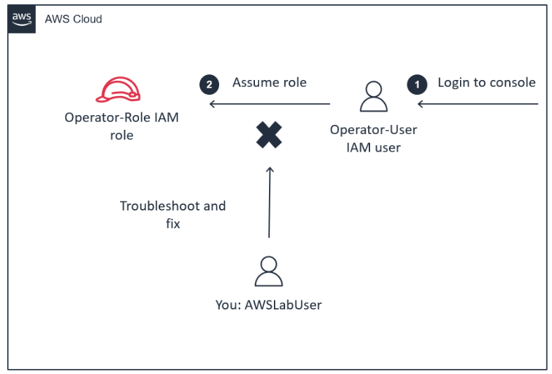
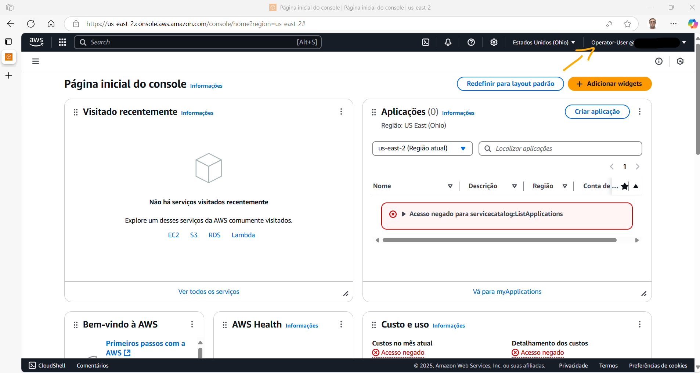
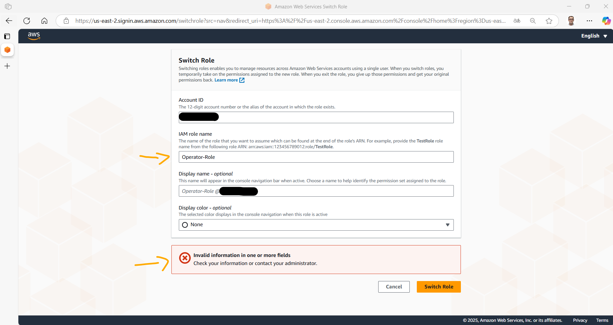
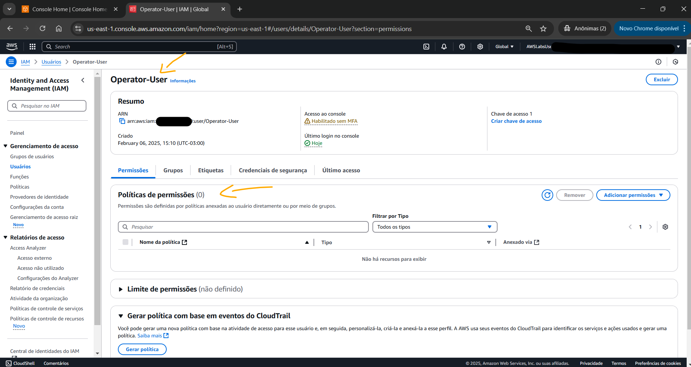
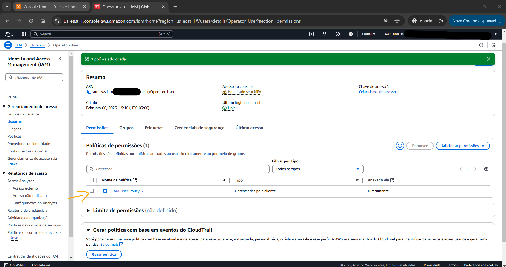
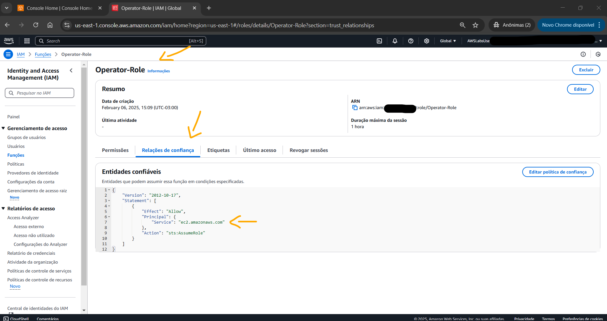
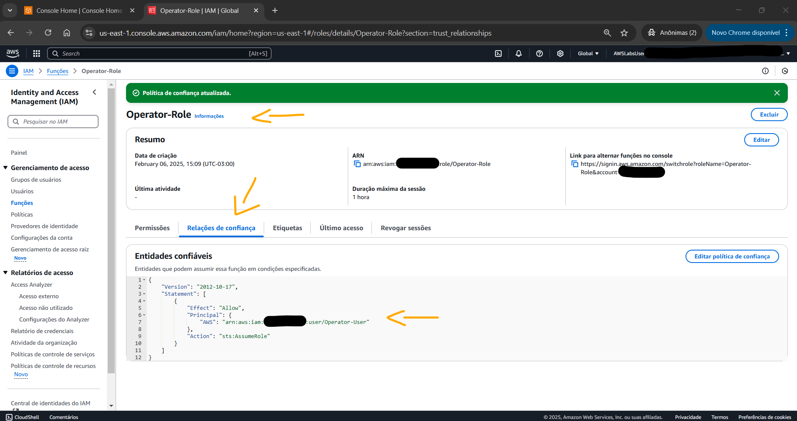
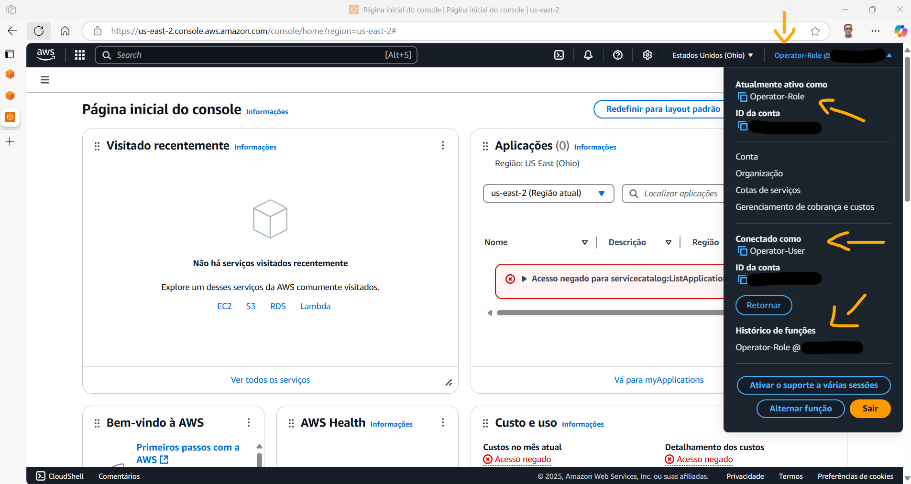

# Lab - Troubleshooting IAM Access Issues   

### AWS Skill Builder <a href="../../">aws_skill_builder   </a>
### Training Category: <a href="../../self_paced_lab">self_paced_lab</a>
### Software/Subject: aws   
### Course: <a href="./">curso_spl_015 (Lab - Troubleshooting IAM Access Issues)   </a>

#### Parceria da AWS com a Escola da Nuvem (EDN)   

---

### Theme:
- Cloud Computing

### Used Tools:
- Operating System (OS): 
  - Windows 11   
- Cloud:
  - Amazon Web Services (AWS)   
- Cloud Services:
  - AWS Identity and Access Management (IAM)   
  - Google Drive   
- Language:
  - HTML   
  - Markdown   
- Integrated Development Environment (IDE) and Text Editor:
  - Visual Studio Code (VS Code)   
- Versioning: 
  - Git   
- Repository:
  - GitHub   
- Network:
  - Google Chrome   
  - Microsoft Edge   

---

<a name="item0"><h3>Course Strcuture:</h3></a>
1. Lab - Troubleshooting IAM Access Issues<br>
1.1 <a href="#item01.1">Tarefa 1: Acessando o laboratório</a><br>
1.2 <a href="#item01.2">Tarefa 2: Solução de problemas e correção do problema e verificação da solução</a><br>

---

### Objective:
O objetivo deste laboratório prático foi visualizar e atualizar as permissões do **AWS Identity and Access Management (IAM)** de uma política baseada em identidade e de uma política de confiança para que um usuário do IAM conseguisse assumir uma função do IAM, respeitando o conceito de privilégio mínimo.

### Structure:
A estrutura do curso é formada por:
- Este arquivo de README.
- A pasta `0-aux`, pasta auxiliar com imagens utilizadas na construção desse arquivo de README.

### Development:
Este curso foi um laboratório prático realizado na plataforma **AWS Skill Builder**, cuja subscrição foi devida a uma parceria entre a **AWS** e a **Escola da Nuvem**. A infraestrutura de cloud utilizada foi fornecida através de um sandbox do **AWS Skill Builder** que possibilitava acesso ao console da **AWS**. Contudo foi necessário seguir estritamente as orientações determinadas no laboratório. Dessa maneira, a forma de interação com os recursos da cloud foram sempre através do console fornecido pelo sandbox, a não ser em casos em que o próprio laboratório instruiu para utilização de outras ferramentas de interação como **AWS CLI** ou **AWS SDK**.

O laboratório do **AWS Skill Builder** tem o foco em executar apenas o que é orientado no escopo, todos os recursos ou serviços que podem ser requisitados adicionalmente já vêm provisionados por padrão pelo laboratório. Ao iniciar o laboratório, o sandbox do **AWS Skill Builder** provisiona diversos recursos e serviços para o funcionamento através de uma ou mais pilhas do **AWS CloudFormation** de forma automática. 

O acesso ao console no sandbox do **AWS Skill Builder** é realizado por meio de uma identidade federada. O Skill Builder funciona como um provedor de identidade (IdP), autenticando o usuário e vinculando-o a uma role do **AWS IAM** provisionada automaticamente por uma das pilhas do CloudFormation. Essa role concede permissões temporárias e mínimas necessárias para a execução do laboratório, garantindo segurança e controle sobre os recursos utilizados. O laboratório, por padrão, determina a região a ser utilizada e ela não deve ser alterada, somente se o próprio laboratório indicar. As configurações não informadas no laboratório devem ser sempre mantidas como padrão que estão.

<a name="item01.1"><h4>Tarefa 1: Acessando o laboratório</h4></a>[Back to summary](#item0)

Para ilustrar o cenário desse laboratório, a imagem 01 mostra o diagrama onde um usuário do IAM deveria assumir uma função chamada `Operator-Role` ao logar no **AWS Management Console** com suas credenciais fornecidas pelo lab. Contudo, o usuário conseguia apenas logar na **AWS** e ter acesso ao console, mas não conseguia assumir a função do IAM atribuída, sendo impedido de executar suas tarefas. A lista a seguir descreve cada parte do diagrama:
- Um usuário do IAM chamado `Operator-User`.
- Uma função do IAM chamada `Operator-Role` que precisava ser assumida pelo usuário `Operator-User`.
- Um usuário do IAM `AWSLabsUser`, utilizado para solucionar e corrigir o problema.

<div align="Center"><figure>
    <br>
    <figcaption>Imagem 01.</figcaption>
</figure></div><br>

Na primeira tarefa, o objetivo foi acessar o laboratório utilizando o usuário do IAM `Operator-User` e tentar alterar para a função para verificar se o usuário conseguia assumir a IAM role `Operator-Role`. Ao iniciar o laboratório clicando na opção `Iniciar laboratório` o console da **AWS** era aberto já logado no usuário `AWSLabUser`. Esse usuário representava um membro da equipe de nuvem que solucionaria e corrigiria o problema. Neste caso, era preciso acessar o **AWS Management Console** com o usuário que precisva assumir a função. Para isso, uma nova janela privada foi aberta no navegador da máquina física **Windows**, se já tivesse utilizando uma janela anônima, a solução era abrir em um outro tipo de navegador. No meu caso, estava utilizando o **Google Chrome** com a janela anônima e abri o **Microsoft Edge**. Em seguida, o site da **AWS** na página de login foi acessado e inserido o ID da conta raíz da **AWS**, que podia ser visualizada no console conectado com o outro usuário no outro navegador. Neste caso, o login estava sendo realizado com um usuário do IAM. Para facilitar, o laboratório forneceu em seu parâmetro `ConsoleAccessURL` nas instruções uma URL que já direciona para o site de login com a conta do usuário raíz identificada e indicando que o login era com usuário do IAM. Em ambos os casos, o nome do usuário foi preenchido com `Operator-User` e o password (senha) também tinha sido fornecido nos parâmetros da instrução desse lab, cujo parâmetro era `OperatorUserPassword` e seu valor `@&xKQ%Igg!NreMUH`. A imagem 02 comprova que o login no console da **AWS** foi realizado com o usuário do IAM `Operator-User`.

<div align="Center"><figure>
    <br>
    <figcaption>Imagem 02.</figcaption>
</figure></div><br>

Após login bem sucedido, a conexão no console foi alternada para a função do IAM `Operator-Role` no canto superior direito da tela onde as informações de login e conta eram mostradas. Caso uma página de função do Switch fosse exibida com uma seção `Comece em 3 etapas simples`, a opção `Trocar função` seria selecionada. Na página `Trocar função`, as seguintes configurações foram feitas:
- `Account ID`: foi copiado e colado o valor do parâmetro `AWSAccountID` listado à esquerda das instruções do lab. Este era o ID da conta raiz da **AWS** desse laboratório. Ela podia ser visualizada também no outro navegador onde o console estava conectado com o usuário `AWSLabsUser`.
- `IAM Role Name`: `Operator-Role`.
- `Nome de exibição - opcional`: foi mantido em branco, pois este era apenas um nome descritivo.
 
Ao tentar concluir a troca, uma mensagem era exibida com a seguinte informação: "Informações inválidas em um ou mais campos. Verifique suas informações ou entre em contato com seu administrador", conforme imagem 03. Isso indicava que a troca de função não estava funcionando e confirmava o problema relatado no cenário do laboratório.

<div align="Center"><figure>
    <br>
    <figcaption>Imagem 03.</figcaption>
</figure></div><br>

<a name="item01.2"><h4>Tarefa 2: Solução de problemas e correção do problema e verificação da solução</h4></a>[Back to summary](#item0)

Na tarefa 2 e última, o próposito foi identificar e corrigir os problemas que estavam impedindo o usuário `Operator-User` de assumir a função `Operator-Role`. Para esta tarefa foi necessário retornar ao console da **AWS** logado com o usuário `AWSLabsUser` que era no navegador Chrome. Este usuário tinha as permissões necessárias para resolver o problema. A solução devia permitir que o `Operator-User` assumisse a `Operator-Role` com sucesso, aderindo rigorosamente às seguintes diretrizes de privilégios mínimos:
- O `Operator-User` tinha permissão para assumir apenas a `Operator-Role`.
- A `Operator-Role` só podia ser assumida pelo `Operator-User`.

Algumas considerações importantes:
- O usuário `AWSLabsUser` não tinha permissão para criar novas políticas baseadas em identidade. No entanto, ele podia utilizar algumas políticas gerenciadas pelo cliente pré-configuradas. Os nomes das políticas pré-configuradas que ele tinha permissão para usar começava com `IAM-User-Policy`.
- Se o acesso fosse negado ao tentar resolver o problema, isso significava que o usuário `AWSLabsUser` não tinha permissões suficientes e precisava resolver o problema de outra maneira.
- Ao navegar pelas páginas do console do IAM com o usuário `AWSLabsUser`, era possível receber uma mensagem na parte inferior de algumas páginas do console do IAM indicando que "You need permissions for some access-analyzers actions". Esse erro poderia ser ignorado com segurança, pois ele não era necessário para concluir o laboratório.

Existem duas coisas envolvidas ao assumir uma função do IAM que precisvam ser verificadas e corrigidas:
- A entidade IAM (`Operator-User` neste exemplo) devia ter permissões para assumir a função em sua política baseada em identidade (`Identity-based Policies`).
- A política de confiança (`Trust Policy`) da função do IAM (`Operator-Role` neste exemplo) deveia permitir que o `Operator-User` assumisse a função.

Dessa forma, o console do IAM foi aberto no recurso de usuários. Na página de usuários, o usuário `Operator-User` foi escolhido. Neste usuário, a aba `Permissions` foi aberta para verificar as políticas de permissões disponíveis. Como mostrado na imagem 04 abaixo, não haviam políticas anexadas ao usuário `Operator-User`. Para corrigir esse primeiro problema uma das três seguintes políticas pré-configuradas baseadas em identidade podiam ser adicionadas ao usuário:
- `IAM-User-Policy-1`: Esta política não permitia que o usuário assumisse a `Operator-Role`, pois o recurso estava configurado incorretamente (o nome da função não diferenciava maiúsculas de minúsculas, considerando o nome da função como `operator-role`).
- `IAM-User-Policy-2`: Esta política permitia que o usuário assumisse a `Operator-Role`. No entanto, ele permitia que o usuário assumisse qualquer função porque ele usava um curinga na seção de recursos da política. Isso não estava em conformidade com os conceitos de privilégio mínimo.
- `IAM-User-Policy-3`: Esta política permitia que o usuário assumisse a `Operator-Role` e era a única função permitida. Isso estava em conformidade com os conceitos de privilégio mínimo.

<div align="Center"><figure>
    <br>
    <figcaption>Imagem 04.</figcaption>
</figure></div><br>

Com base nas explicações de cada política, ficou óbvio que a política necessária para que o usuário assumisse a função seguindo os conceitos de menor privilégio era a `IAM-User-Policy-3`. A imagem 05 mostra essa política anexada ao usuário.

<div align="Center"><figure>
    <br>
    <figcaption>Imagem 05.</figcaption>
</figure></div><br>

O segundo problema era na política de confiança (`Trust Policy`) da função do IAM `Operator-Role` que definia quem podia assumir a função. Dessa forma, o recurso de roles foi aberto no console do IAM e a role mencionada foi selecionada. Na página da role `Operator-Role`, a guia de relações de confiança foi aberta. Em uma política de confiança (`Trust Policy`), as entidades confiáveis (`Trust entities`) são quem define quem pode assumir a função, sendo essas entidades especificadas através do campo `Principal`. Na imagem 06, note que o `Principal` definido na política de confiança era `ec2.amazonaws.com`, que era o serviço **Amazon EC2**. Isso funcionava bem se fosse necessário permitir que uma instância EC2 assumisse a função. No entanto, esse era claramente outro fator que causava o problema que estava sendo solucionado.

<div align="Center"><figure>
    <br>
    <figcaption>Imagem 06.</figcaption>
</figure></div><br>

Para corrigir o problema, a política de confiança (`Trust Policy`) foi editada alterando o JSON antigo para o abaixo, conforme evidenciado na imagem 07. No JSON atual, o ID da conta raiz da **AWS** teve que ser inserido. Perceba que o `Princpal`, ou seja a entidade, era o usuário do IAM `Operator-User` da conta da **AWS** especificada e a ação que ele executava era `AssumeRole`, ou seja, assumiria a role `Operator-Role`. O efeito era `Allow`, ou seja, de permissão.

```json
{
    "Version": "2012-10-17",
    "Statement": [
        {
            "Effect": "Allow",
            "Principal": {
            "AWS": "arn:aws:iam::INSERT_ACCOUNT_ID:user/Operator-User"},
            "Action": "sts:AssumeRole"
        }
    ]
}
```

<div align="Center"><figure>
    <br>
    <figcaption>Imagem 07.</figcaption>
</figure></div><br>

Por fim, a última etapa foi conferir novamente se o usuário `Operator-User` podia assumir a função `Operator-Role`. Portanto, foi necessário voltar para o navegador do **Microsoft Edge**, pois era ele que tinha o acesso a **AWS** conectada no usuário `Operator-User`. O processo foi o mesmo realizado no início do laboratório para alterar o usuário já conectado para a role `Operator-Role`. Caso tivesse fechado a janela, teria que repetir todo processo de login com o usuário. A imagem 08 mostra que foi alternado com sucesso do usuário para role determinada.

<div align="Center"><figure>
    <br>
    <figcaption>Imagem 08.</figcaption>
</figure></div><br>

Nessa última etapa foi identificado um erro. Ao tentar alternar para a função pelo próprio console, ele abria a página para preencher as informações de alternação. Entretanto, essa página possuia um cabeçalho na URL muito estranho (`https://us-east-2.signin.aws.amazon.com/switchrole?src=nav&redirect_uri=https%3A%2F%2Fus-east-2.console.aws.amazon.com%2Fconsole%2Fhome%3Fregion%3Dus-east-2%23`). Nas instruções do laboratório, ao invés de clicar na opção de alternação, ele informava que era para copiar e utilizar a URL fornecida na role `Operator-Role` visualizada no navegador conectado no outro usuário, cujo link era bem diferente (`https://signin.aws.amazon.com/switchrole?roleName=Operator-Role&account=123456789012`). Ou seja, no próprio cabeçalho da requisição os campos para alternação para a função já vinham preenchidos e funcionava perfeitamente a alteração.

Pesquisando, identiifique que o problema poderia ser causado pelo endpoint onde a solicitação estava sendo feita. Na primeira situação, o endpoint utilizado foi regional, onde a região `us-east-2` foi passada, enquanto na segunda opção o ednpoint foi global, não informando nenhuma região. Provavelmente, a autenticação regional pode ter algum cache ou regra diferente ao processar os campos preenchidos manualmente. Dessa forma, testei apagar apenas a região da URL estranha, mantendo (`https://signin.aws.amazon.com/switchrole?src=nav&redirect_uri=https%3A%2F%2Fus-east-2.console.aws.amazon.com%2Fconsole%2Fhome%3Fregion%3Dus-east-2%23`) e preenchendo as informações e funcionou.