# Lab - Working with Amazon Elastic Container Service   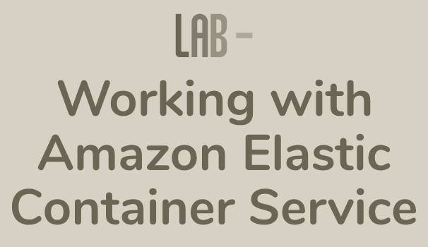

### AWS Skill Builder <a href="../../">aws_skill_builder   </a>
### Training Category: <a href="../../self_paced_lab">self_paced_lab</a>
### Software/Subject: aws   
### Course: <a href="./">curso_spl_016 (Lab - Working with Amazon Elastic Container Service)   </a>

#### Parceria da AWS com a Escola da Nuvem (EDN)   

---

### Theme:
- Cloud Computing

### Used Tools:
- Operating System (OS): 
  - Linux   
  - Windows 11   
- Linux Distribution:
  - Amazon Linux   
- Cloud:
  - Amazon Web Services (AWS)   
- Cloud Services:
  - Amazon Elastic Compute Cloud (EC2)   
  - Amazon Elastic Container Registry (ECR)   
  - Amazon Elastic Container Service (ECS)   
  - Google Drive   
- Containerization: 
  - Docker   
- Language:
  - HTML   
  - Markdown   
- Integrated Development Environment (IDE) and Text Editor:
  - Visual Studio Code (VS Code)   
- Versioning: 
  - Git   
- Repository:
  - GitHub   
- Command Line Interpreter (CLI):
  - Bash e Sh   
- Server and Databases:
  - Apache HTTP Server (httpd)   

---

<a name="item0"><h3>Course Strcuture:</h3></a>
1. Lab - Working with Amazon Elastic Container Service<br>
1.1 <a href="#item01.1">Tarefa 1: Registre uma definição de tarefa com a imagem amazon-ecs-sample</a><br>
1.2 <a href="#item01.2">Tarefa 2: Criar um serviço</a><br>
1.3 <a href="#item01.3">Tarefa 3: Implantar uma nova versão do aplicativo no serviço</a><br>
1.4 <a href="#item01.4">Tarefa 4: Atualizar um serviço em execução</a><br>
1.5 <a href="#item01.5">Tarefa 4: Atualizar um serviço em execução</a><br>

---

### Objective:
Este laboratório prático teve como objetivo implantar uma aplicação web em contêineres **Docker** em um cluster do **Amazon Elastic Container Service (ECS)**, utilizando instâncias do **Amazon Elastic Compute Cloud (EC2)** configuradas para o ECS como infraestrutura. 

Para a implantação, foi criada uma definição de tarefa que especificava a aplicação, os contêineres e suas configurações. Essa definição foi utilizada em um serviço dentro do cluster, responsável por gerenciar a quantidade de tarefas em execução simultaneamente. Posteriormente, o serviço foi atualizado duas vezes: primeiro, com uma nova versão da definição de tarefa construída, e depois, ajustando o número de tarefas em execução.

Como etapa opcional, o **AWS CloudFormation** foi acessado para visualizar a pilha responsável por criar a infraestrutura base do laboratório, incluindo recursos como Load Balancer e EC2, que eram provisionados automaticamente ao iniciar o lab.

### Structure:
A estrutura do curso é formada por:
- Este arquivo de README.
- A pasta `0-aux`, pasta auxiliar com imagens utilizadas na construção desse arquivo de README.
- A pasta `resource` com os arquivos utilizados.

### Development:
Este curso foi um laboratório prático realizado na plataforma **AWS Skill Builder**, cuja subscrição foi devida a uma parceria entre a **AWS** e a **Escola da Nuvem**. A infraestrutura de cloud utilizada foi fornecida através de um sandbox do **AWS Skill Builder** que possibilitava acesso ao console da **AWS**. Contudo foi necessário seguir estritamente as orientações determinadas no laboratório. Dessa maneira, a forma de interação com os recursos da cloud foram sempre através do console fornecido pelo sandbox, a não ser em casos em que o próprio laboratório instruiu para utilização de outras ferramentas de interação como **AWS CLI** ou **AWS SDK**.

O laboratório do **AWS Skill Builder** tem o foco em executar apenas o que é orientado no escopo, todos os recursos ou serviços que podem ser requisitados adicionalmente já vêm provisionados por padrão pelo laboratório. Ao iniciar o laboratório, o sandbox do **AWS Skill Builder** provisiona diversos recursos e serviços para o funcionamento através de uma ou mais pilhas do **AWS CloudFormation** de forma automática. 

O acesso ao console no sandbox do **AWS Skill Builder** é realizado por meio de uma identidade federada. O Skill Builder funciona como um provedor de identidade (IdP), autenticando o usuário e vinculando-o a uma role do **AWS IAM** provisionada automaticamente por uma das pilhas do CloudFormation. Essa role concede permissões temporárias e mínimas necessárias para a execução do laboratório, garantindo segurança e controle sobre os recursos utilizados. O laboratório, por padrão, determina a região a ser utilizada e ela não deve ser alterada, somente se o próprio laboratório indicar. As configurações não informadas no laboratório devem ser sempre mantidas como padrão que estão.

<a name="item01.1"><h4>Tarefa 1: Registre uma definição de tarefa com a imagem amazon-ecs-sample</h4></a>[Back to summary](#item0)

A arquitetura atual já possuía os seguintes recursos provisionados:
- Uma **Amazon Virtual Private Cloud (VPC)**, com duas sub-redes públicas em Zonas de Disponibilidade separadas.
- Um **Amazon Network Load Balancer (NLB)** com dois nós, um em cada sub-rede pública.
- Um grupo do EC2 Auto scaling usado como o tipo de execução para o **Amazon ECS**.
- Um cluster do **Amazon ECS** que estava parcialmente configurado e era necessário concluir a configuração.

O fluxo de dados de um usuário externo que acessava a aplicação web iniciava no *Internet Gateway (IGW)* da VPC e por meio do Network Load Balancer nas sub-redes públicas eram encaminhados para o cluster do **Amazon ECS**, equilibrando o tráfego entre as instâncias EC2 que executavam o serviço com os contêineres **Docker** com a aplicação.

O **Amazon Elastic Container Service (ECS)** é um serviço de gerenciamento de contêiner altamente dimensionável e rápido que facilita a execução, a parada e o gerenciamento de contêineres do **Docker** em um cluster de instâncias do **Amazon EC2**. O **Amazon ECS** permite iniciar e parar aplicações baseadas em contêiner com simples chamadas à API, permite que seja obtido o estado do cluster em um serviço centralizado e fornece acesso a muitos dos recursos do **Amazon EC2**. No ECS há três camadas: capacidade, controlador e provisionamento. A camada de capacidade representa a infraestrutura na qual os contêineres são implantados. A camada do controlador se refere à implantação e ao gerenciamento das aplicações executadas nos contêineres. A camada de provisionamento se refere às ferramentas que são utilizadas para fazer interface com o programador de tarefas para implantar e gerenciar as aplicações e contêineres.

A definição de tarefa (*Task Definition*) é o esquema de uma aplicação. É um arquivo de texto em formato JSON que descreve os parâmetros de um ou mais contêineres que formam a aplicação. Há vários parâmetros configuráveis em uma definição de tarefa que incluem: qual imagem do **Docker** usar e qual volume de CPU e memória alocar a cada tarefa ou a cada contêiner em uma tarefa. Sendo assim, nesta primeira tarefa, o objetivo foi criar a definição de tarefa que seria utilizada no cluster ECS. Para isso, o console do **Amazon ECS** foi acessado e a *Task Definition* foi elaborada copiando as informações do arquivo [task_definition.json](./resource/task_definition.json). Este arquivo era um modelo de amostra fornecido pelo laboratório para exibir uma página da web simples. Era possível modificar os parâmetros na definição de tarefa (por exemplo, para fornecer mais recursos de CPU ou alterar os mapeamentos de porta) para atender as aplicações específicas. O `image` era o parâmetro onde era especificado a imagem **Docker** que seria utilizada nos contêineres. Essa imagem era passada diretamente para o daemon do **Docker**.

Outros parâmetros importantes da definição de tarefa são listados abaixo:
- `family`: indicava o nome da família da definição de tarefa, que no caso era `yourApp-demo`, agrupando várias revisões.
- `containerDefinitions`: uma matriz que continha as definições de contêiner da tarefa. Neste caso, dois blocos de definições iniciados por `volumesFrom` indicavam que se tratava de dois contêineres:
    - A definição do primeiro contêiner associava a porta `80` do contêiner à porta `80` do host, montava o volume `my-vol` no caminho `/usr/local/apache2/htdocs` (diretório raiz de documento do servidor web Apache), especificava limites de memória e CPU e definia a imagem do **Docker** `httpd:2.4` como a utilizada. Essa imagem era de um servidor web **Apache Http (Httpd)** e estava armazenada no **Amazon Elastic Contêiner Registry (ECR)**.
    - A definição do segundo contêiner montava o mesmo volume do primeiro contêiner, incluía um comando em shell script que gerava um arquivo HTML e o gravava no volume montado (veiculado pelo servidor web Apache no primeiro contêiner), especificava qual interpretador usar para executar o comando e definia qual imagem do **Docker** `busybox` como a utilizada. O comando shell é mostrado logo abaixo.
- `volumes`: definia o volume `my-vol`, que era montado pelos contêineres para compartilhamento de arquivos.

```sh
/bin/sh -c \"while true; do echo '<html> <head> <title>Amazon ECS Sample App</title> <style>body {margin-top: 40px; background-color: #333;} </style> </head><body> <div style=color:white;text-align:center> <h1>Amazon ECS Sample App</h1> <h2>Congratulations!</h2> <p>Your application is now running on a container in Amazon ECS.</p>' > top; /bin/date > date ; echo '</div></body></html>' > bottom; cat top date bottom > /usr/local/apache2/htdocs/index.html ; sleep 1; done\"
```

A imagem 01 evidencia a definição da tarefa construída com sucesso.

<div align="Center"><figure>
    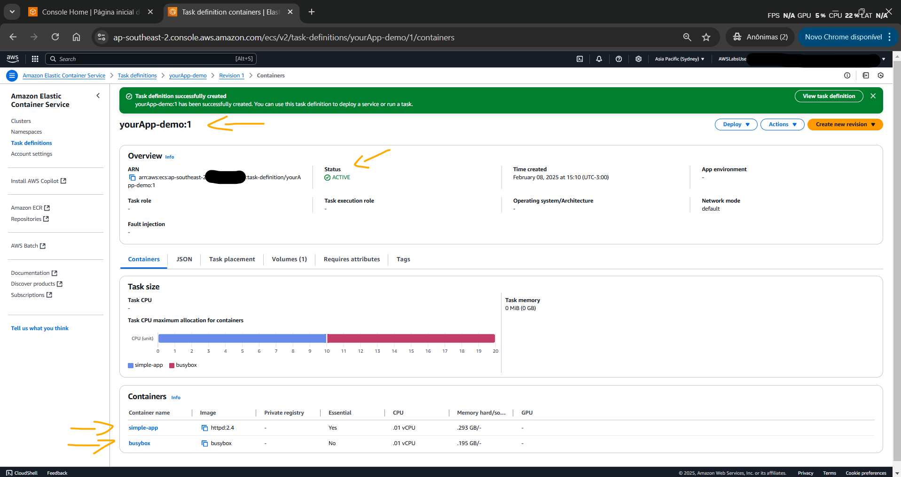<br>
    <figcaption>Imagem 01.</figcaption>
</figure></div><br>

<a name="item01.2"><h4>Tarefa 2: Criar um serviço</h4></a>[Back to summary](#item0)

Com a *task definition* elaborada, ela foi implantada como tarefa (*task*) em um serviço (*service*) provisionado no cluster do **Amazon ECS**. Os serviços mantêm determinado número de instâncias simultâneas de uma definição de tarefa em um cluster do **Amazon ECS**. Se uma das tarefas falhar ou parar, o programador de tarefas de serviço do ECS iniciará outra instância da definição de tarefa para substituí-la. Isso ajuda a manter o número desejado de tarefas no serviço. 

Dessa forma, na página de definição de tarefa, a *task definition* criada, cujo nome era `yourApp-demo`, foi selecionada para criar o serviço. Algumas das seguintes configurações foram realizadas no provisionamento do *service*:
- `Existing cluster` (Cluster existente): o cluster de nome `ECSCluster` que já tinha sido provisionado pela pilha do CloudFormation foi escolhido. Esse cluster já possuía como infraestrutura quatro instâncias do **Amazon EC2** provinientes do auto scaling group do **Amazon EC2 Auto Scaling** configuradas como instâncias de contêineres. Esse grupo de auto scaling possuía o seguinte nome `MyAutoScalingGroup`.
- `Launch Type` (Tipo de inicialização): foi selecionado `EC2` na lista suspensa. A configuração Tipo de inicialização indicava onde a tarefa da definição estava sendo executada. Há dois tipos principais de inicialização no **Amazon ECS**:
    - Tipo de inicialização do EC2: com este tipo, as tarefas são executadas nas instâncias do **Amazon EC2** que foram registradas no cluster do ECS. É necessário provisionar e gerenciar essas instâncias do EC2 por conta própria, manualmente ou com grupos do Auto Scaling.
    - Tipo de inicialização do Fargate: o **AWS Fargate** é um mecanismo de computação sem servidor para o ECS, o que significa que é a **AWS** quem gerencia a infraestrutura. Com o Fargate, as tarefas são executadas na infraestrutura gerada pela **AWS**, e não é necessário provisionar nem gerenciar instâncias do EC2.
- Na seção `Deployment configuration` (Configuração de implantação):
    - `Service Name` (Nome do serviço): `myFirstService`.
    - `Service Type` (Tipo de serviço): `Replica`. A opção Tipo de serviço determina como o programador de tarefas do **Amazon ECS** vai gerenciar as tarefas do serviço. O programador de tarefas do serviço mantém o número desejado de tarefas em execução, substituindo automaticamente aquelas que são encerradas ou encontram falhas. Com o tipo de serviço Réplica, pode ser especificado o número de instâncias de tarefa (réplicas) que serão executadas no serviço. O programador de tarefas do ECS mantém esse exato número de tarefas no cluster. Por padrão, ele distribui essas tarefas em várias Zonas de Disponibilidade (AZ) da região para garantir alta disponibilidade. Se houver falha ou interrupção de uma tarefa em uma AZ, o programador de tarefas vai iniciar automaticamente uma nova instância de tarefa em outra AZ para manter o número desejado de réplicas. Esse tipo é ideal para serviços de longa duração que exigem a execução constante de determinado número de tarefas, como servidores web ou workers em segundo plano.
    - Tarefas desejadas: `1`.
    - A seção Balanceamento de carga – opcional foi expandida e configurado o seguinte:
        - Tipo de balanceador de carga: **Network Load Balancer**.
        - `Load Balancing` (Balanceador de carga): foi selecionado o balanceador já existete, cujo nome era `MyLoadBalancer`. Esse balanceador, que era do tipo Network Load Balancer, foi provisionado pela pilha do **AWS CloudFormation** automaticamente ao iniciar o laboratório.
        - `Listener`: foi selecionado `Usar um listener existente`:
            - Foi selecionado `80:TCP` no menu suspenso, que era um listener também já criado.
        - `Target Group` (Grupo de destino): foi selecionado a opção `Usar um grupo de destino existente`.
            - No menu suspenso foi selecionado a opção `myTargetGroup`. Esta tg também tinha sido criado previamente pelo lab.
        - `Container`: automaticamente o nome do container que rodava na porta `80` era selecionado fazendo um mapeamento de porta do host para o container (`simple-app 80:80`).

Ao selecionar `create`, uma página de `Status de execução` era exibida informando que a implantação estava em andamento. Foi necessário atualizar para visualizar o status mais recente da criação do serviço. Com a implantação concluída, o recurso de *service* dentro do cluster foi aberto e o serviço `myFirstService` provisionado foi selecionado, conforme imagem 02.

<div align="Center"><figure>
    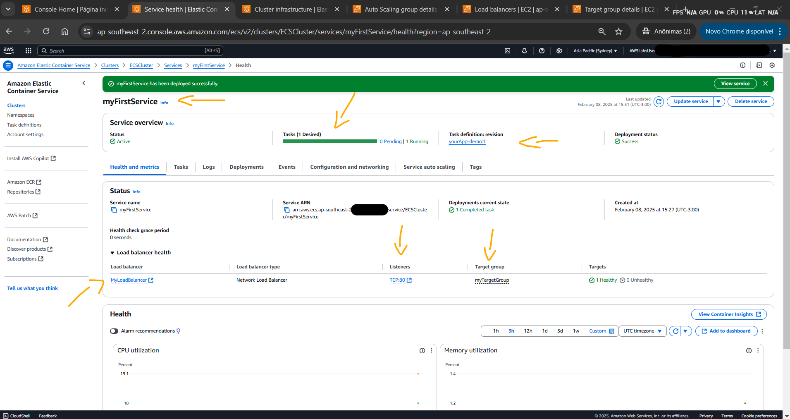<br>
    <figcaption>Imagem 02.</figcaption>
</figure></div><br>

Em seguida, o serviço de load balancer foi selecionada e o nome do DNS (`MyLoadBalancer-63a136d22076686e.elb.ap-southeast-2.amazonaws.com`) foi copiado e utilizado em uma outra aba do navegador da máquina física **Windows** para acessar a aplicação web conteinerizada em **Docker** no **Amazon ECS**. Foi preciso forçar a solicitação na porta `80`, porque por padrão os navegadores tentam acessar na porta `443` que é do protocolo `HTTPS`, mas para isso é necessário de um certificado de autorização. A imagem 03 exibe a aplicação acessada. A medida que uma instância do grupo de auto scaling era utilizada para implantar o contêiner com a aplicação, essa instância era adicionada ao target group do load balancer, como mostrado na imagem 04.

<div align="Center"><figure>
    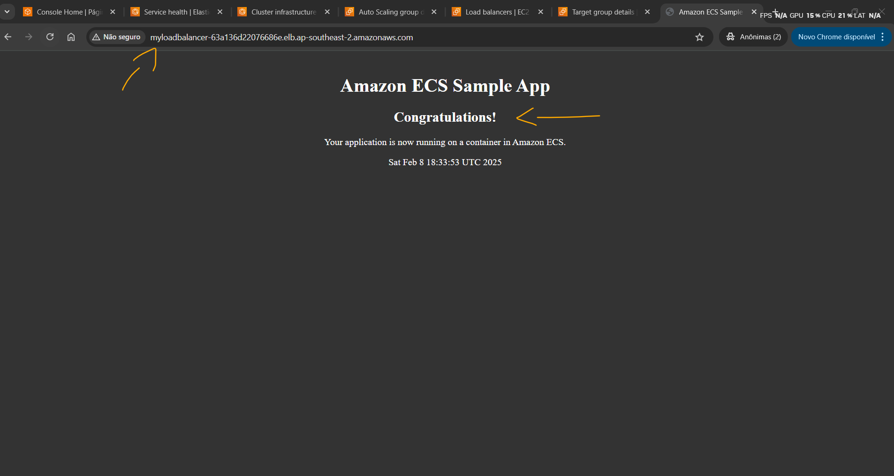<br>
    <figcaption>Imagem 03.</figcaption>
</figure></div><br>

<div align="Center"><figure>
    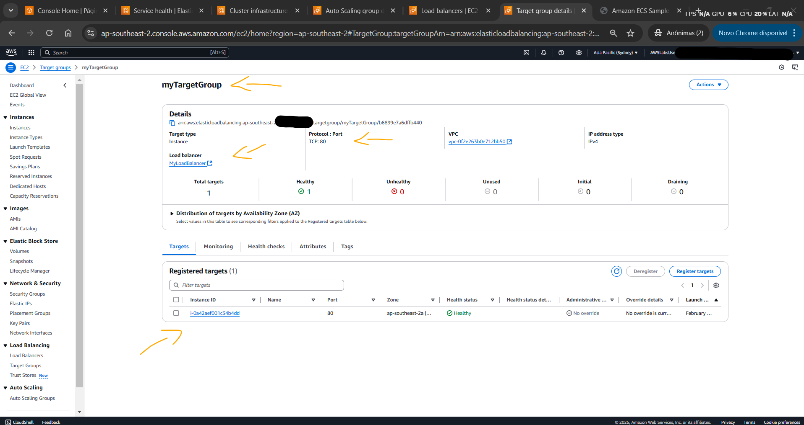<br>
    <figcaption>Imagem 04.</figcaption>
</figure></div><br>

<a name="item01.3"><h4>Tarefa 3: Implantar uma nova versão do aplicativo no serviço</h4></a>[Back to summary](#item0)

A aba do navegador com a aplicação aberta foi mantida, pois agora, nesta terceira tarefa, o objetivo foi elaborar uma nova versão da aplicação web, implantá-la no cluster e visualizar a alteração no navegador. Para isso, uma nova versão da definição de tarefa precisou ser criada e posteriormente indicada no serviço em execução para que ele subisse a nova instância que utilizaria a nova versão da *task definition* e removesse a instância com a aplicação web na versão antiga. Com o **Amazon ECS**, é possível implantar a nova definição de tarefa no serviço sem causar interrupções. O processo funciona da seguinte forma:
- Crie uma definição de tarefa com a imagem do **Docker** atualizada e as demais mudanças necessárias.
- Instrua o serviço ECS a implantar a nova definição de tarefa.
- O programador de tarefas do serviço ECS inicia uma tarefa usando a nova definição, garantindo que haja uma instância de contêiner disponível para executá-la (no EC2 ou no Fargate).
- Quando a nova tarefa alcança o estado `EM EXECUÇÃO`, o programador de tarefas do serviço interrompe uma das tarefas com a definição antiga em execução.
- O processo continua até que todas as tarefas desejadas do serviço estejam usando a nova definição, substituindo a versão antiga da aplicação por uma nova.

Nesse processo de implantação contínua, o serviço continua funcionando, e o programador de tarefas mantém sempre o número de tarefas especificado na configuração do serviço. Isso minimiza o tempo de inatividade e evita problemas na transição entre as versões da aplicação. Portanto, uma nova versão da definição de tarefa `yourApp-demo` foi criada copiando o arquivo [task_definition_new.json](./resource/task_definition_new.json). Essa versão 2 basicamente fazia a mesma coisa e possuía as mesmas configurações, a única diferença era uma alteração na mensagem exibida na aplicação web de exemplo, modificando a palavra `Congratulations!` para `Thank you!`. Em um ambiente de produção, provavelmente seriam alterados outros aspectos da definição da tarefa. A imagem 05 evidencia a criação da nova versão da *task definition*.

<div align="Center"><figure>
    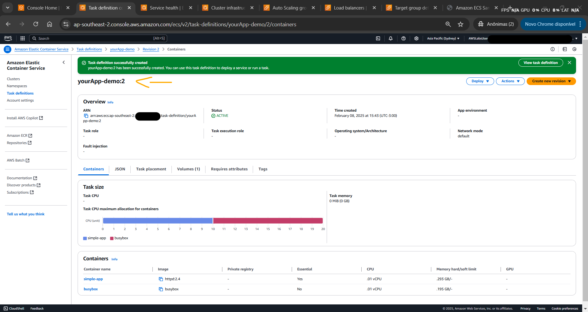<br>
    <figcaption>Imagem 05.</figcaption>
</figure></div><br>

Com a nova versão elaborada, a etapa seguinte foi ir no serviço criado, cujo nome era `myFirstService` e ainda estava em execução, e atualizar o número da revisão da definição de tarefa que ele usava de `1` para `LATEST` (Mais Recente). A versão `LATEST` é sempre a versão mais recente da tarefa criada e disponível, ou seja, que não tenha sido excluída, que neste caso era a `2`. A imagem 06 mostra o *service* já com a nova versão da *task definition*. Na guia `Deploymentes` (Implantações) era exibido o status das implantações e atualizações do serviço na seção `Deployment Configuration` (Configuração de implantação) e em `Events` (Eventos) era visualizados as mensagens de log relacionadas ao processo de implantação, conforme apresentado na imagem 07. Note que em cada novo deploy, a instância EC2 onde o serviço rodava era adicionada ao target group do load balancer e a instância com o serviço da aplicação antiga era removido do mesmo grupo de destino.

<div align="Center"><figure>
    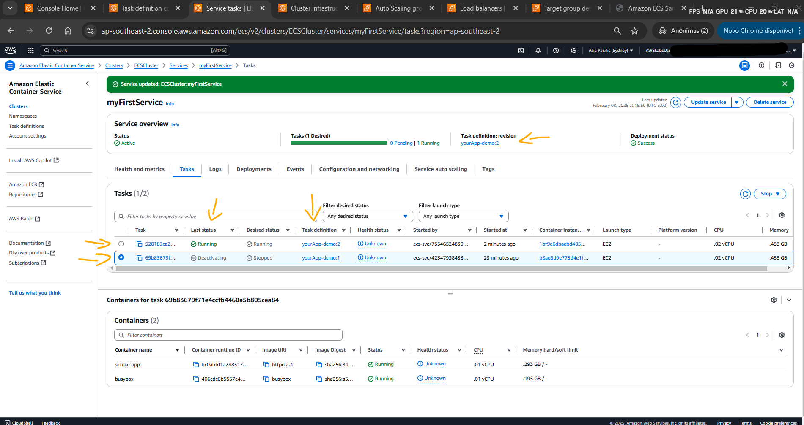<br>
    <figcaption>Imagem 06.</figcaption>
</figure></div><br>

<div align="Center"><figure>
    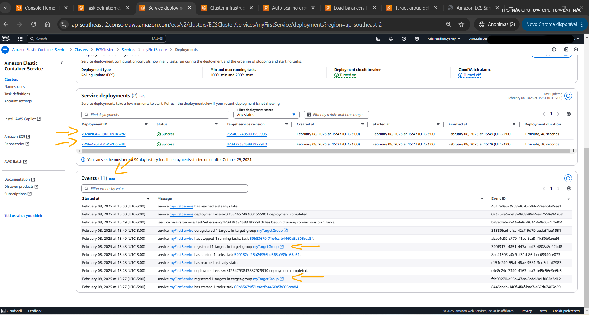<br>
    <figcaption>Imagem 07.</figcaption>
</figure></div><br>

Durante a implantação, o **Amazon ECS** substituía gradualmente as tarefas que estavam em execução na versão antiga da aplicação pelas tarefas que executavam a versão atualizada, mantendo sempre o número desejado de tarefas operacionais. Essa estratégia de implantação contínua minimizava o tempo de inatividade e evitava problemas na transição entre as versões da aplicação.

Após o término completo da implantação, a alteração da aplicação web conteinerizada foi visualizada no navegador da máquina física **Windows** que acessava a aplicação ao atualizar a página, conforme evidenciado na imagem 08. Um ponto importante, a aplicação era acessada pelo DNS do load balancer `MyLoadBalancer` na porta `80`. O grupo de segurança desse load balancer permitia acesso externo de qualquer endereço de IP na porta `80`. O listener desse balanceador, por sua vez, direcionava o tráfego para o target group `myTargetGroup`, também na porta `80`. Esse grupo de destino tinha como alvo as instâncias do **Amazon EC2** que faziam parte do cluster o **Amazon ECS**. Essas instâncias também possuía um security group, só que com uma regra de entrada liberando o tráfego `TCP` na porta `80` apenas para origem do load balancer. Como nas definições de tarefas tinha uma configuração de mapeamento de portas nas definições de conteiner do primeiro container, que era o servidor web, um mapeando de portas eram executado da porta `80` do host, ou seja, a instância EC2, para a porta `80` do container **Docker**, onde a aplicação web de fato era executava. Portanto, era esse trajeto que as requisições faziam para chegar na aplicação.

<div align="Center"><figure>
    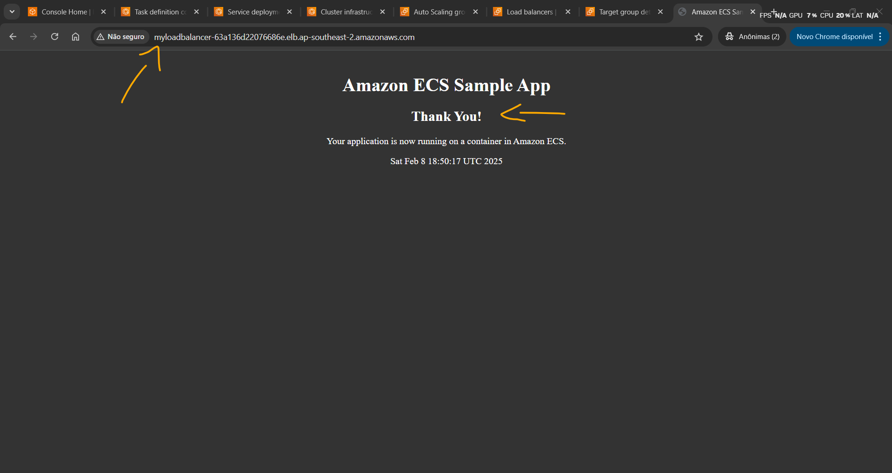<br>
    <figcaption>Imagem 08.</figcaption>
</figure></div><br>

<a name="item01.4"><h4>Tarefa 4: Atualizar um serviço em execução</h4></a>[Back to summary](#item0)

A quarta tarefa teve como objetivo atualizar o serviço em execução para ajustar o número de tarefas dimensionadas. Com o **Amazon ECS**, é possível alterar dinamicamente a configuração de um serviço em execução, incluindo a definição e número das tarefas. O scaling da capacidade do serviço é essencial para lidar com flutuações na demanda pela aplicação ou para otimizar o uso de recursos. Há duas situações em que geralmente a capacidade do serviço é alterada:
- Aumento vertical da capacidade: se o workload da aplicação aumentar ou se ela precisar de mais capacidade, amplie o número desejado de tarefas para fazer o aumento vertical do serviço. Com isso, o **Amazon ECS** vai iniciar mais instâncias de tarefa para responder ao aumento da demanda. Mas é preciso ter recursos suficientes (instâncias do EC2 ou capacidade do Fargate) para acomodar as tarefas adicionais.
- Redução vertical da capacidade: se a aplicação tiver excesso de capacidade ou recursos subutilizados, diminua o número desejado de tarefas para fazer a redução vertical do serviço. Assim as instâncias de tarefa desnecessárias vão ser interrompidas, liberando recursos para uso em outros fins ou para reduzir o custo.

Dessa forma, o número desejado de tarefas em execução no serviço foi alterado para aumentar sua capacidade. Quando é feito o aumento vertical de um serviço, o **Amazon ECS** tenta distribuir as novas tarefas entre as instâncias de contêiner ou a capacidade do Fargate disponíveis, garantindo alta disponibilidade e tolerância a falhas. Por outro lado, quando é feita a redução vertical, as tarefas são interrompidas sem deixar de manter o número de tarefas especificado na configuração do serviço.

Para isso, o recurso *service* foi acessado no cluster do ECS e o serviço `myFirstService` foi selecionado. Dentro dele, a guia `Integridade e métricas` foi acessada e na seção `Status`, o número atual de tarefas em execução era `1`. A opção `Desired tasks` (Tarefas desejadas) foi modificada para `2` e o serviço foi atualizado. A imagem 09 mostra a guia de `Deployments` (Implantações), onde na seção `Events` (Eventos) evidencia uma mensagem de log informando que uma nova tarefa foi iniciada. Já na imagem 10 é exibido as duas tarefas em execução no serviço. Por último, a imagem 11 evidencia que essas duas instâncias estão no grupo de destino do load balancer.

<div align="Center"><figure>
    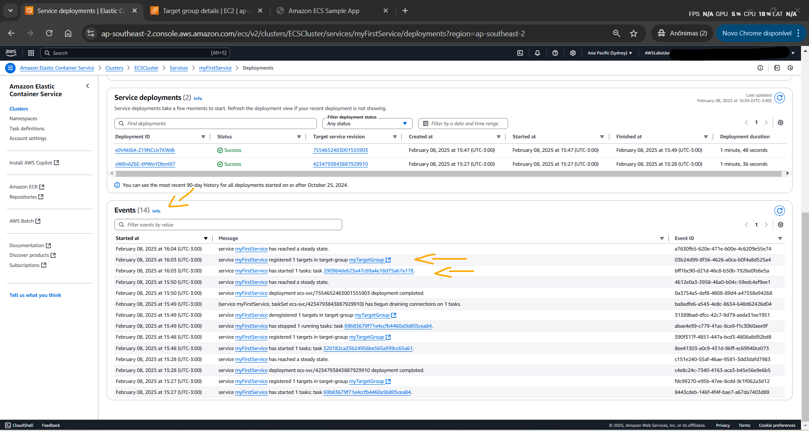<br>
    <figcaption>Imagem 09.</figcaption>
</figure></div><br>

<div align="Center"><figure>
    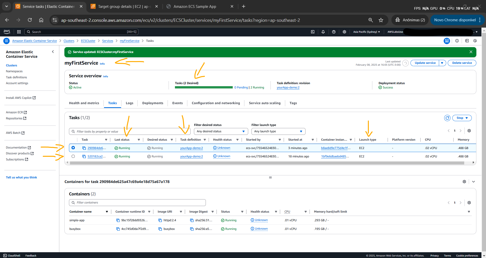<br>
    <figcaption>Imagem 10.</figcaption>
</figure></div><br>

<div align="Center"><figure>
    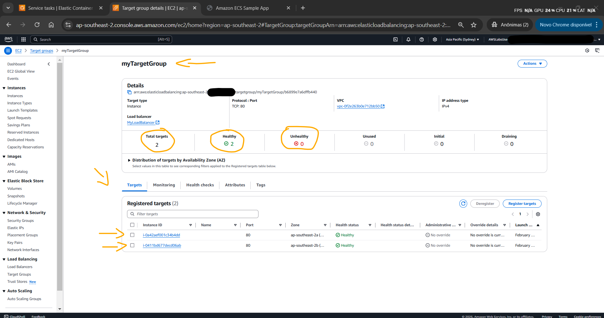<br>
    <figcaption>Imagem 11.</figcaption>
</figure></div><br>

<a name="item01.5"><h4>Tarefa 5: Analisar o modelo do AWS Cloudformation (opcional)</h4></a>[Back to summary](#item0)

A tarefa cinco foi a última e opcional, contudo o objetivo dela não foi exatamente haver com o tema dessa laboratório. A proposta dela foi analisar como os recursos e serviços que já vinham provisionados no laboratório eram construídos de fato. Como foi dito no início desse lab, os laboratórios, ao serem iniciados, utilizavam modelos do **AWS CloudFormation** para provisionar os recursos e serviços necessárias para execução do mesmo, criandos pilhas. O `Template` (modelo) é um arquivo em YAML ou JSON que define a infraestrutura desejada, incluindo recursos, parâmetros e configurações. Enquanto a `Stack` (Pilha) é a instância desse modelo quando ele é implantado na **AWS**, criando e gerenciando os recursos especificados.

Neste lab, por exemplo, o CloudFormation criou um cluster do **Amazon ECS**, as instâncias do **Amazon EC2** já configuradas como instâncias de contêineres, o balanceador de carga, entre outros. Sendo assim, o console do **AWS CloudFormation** foi aberto e a stack de nome `ECS-Console-V2-Service-myFirstService-ECSCluster-534b556b` foi acessada. A guia `Template` foi selecionada para analisar o código do CloudFormation que foi usado para preparar o cluster do ECS para o laboratório. A imagem 12 mostra a visualização desse modelo. Observe que na primeira parte eram declarados os parâmetros utilizados como nome do cluster ECS, nome do *service*, nome do load balancer, entre outros. Já na segunda parte o serviço `myFirstService` era implantado no cluster. Essa stack, na realidade, não era de provisionamento dos recursos de base o laboratório e sim uma stack gerada, por baixo dos panos, ao implantar o serviço. Entretanto, as stacks que originaram os recursos de base do lab também estavam disponíveis para análise, mas a IAM role utilizada para logar no console da **AWS** não possuía permissões suficientes para verificar os templates dessas stacks.

<div align="Center"><figure>
    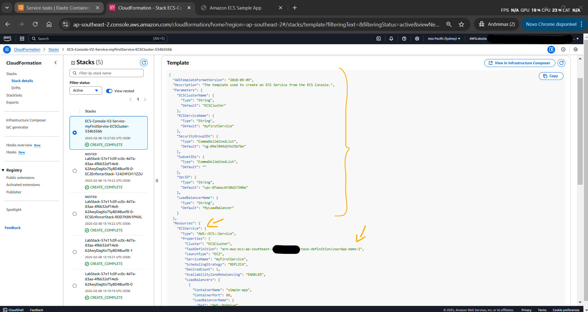<br>
    <figcaption>Imagem 12.</figcaption>
</figure></div><br>