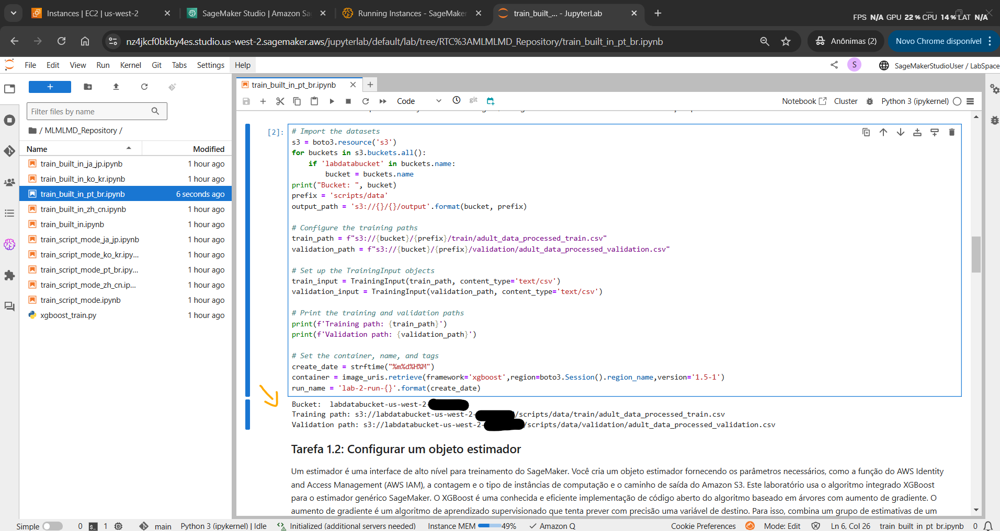
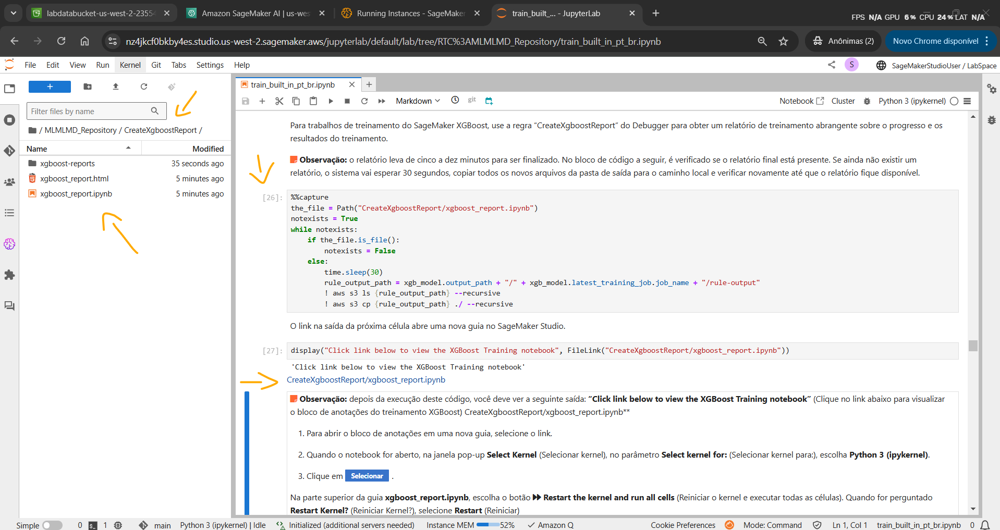

# Lab - Train a model with Amazon SageMaker   

### AWS Skill Builder <a href="../../">aws_skill_builder   </a>
### Training Category: <a href="../../self_paced_lab">self_paced_lab</a>
### Software/Subject: aws   
### Course: <a href="./">curso_spl_017 (Lab - Train a model with Amazon SageMaker)   </a>

#### Parceria da AWS com a Escola da Nuvem (EDN)   

---

### Theme:
- Cloud Computing
- Machine Learning

### Used Tools:
- Operating System (OS): 
  - Linux   
  - Windows 11   
- Linux Distribution:
  - Amazon Linux   
- Cloud:
  - Amazon Web Services (AWS)   
- Cloud Services:
  - Amazon Elastic MapReduce (EMR)   
  - Amazon SageMaker   
  - Amazon SageMaker AI   
  - Amazon SageMaker Canvas   
  - Amazon SageMaker Studio; Amazon SageMaker Studio Lab   
  - Amazon Simple Storage Service (S3)   
  - AWS CodeCommit  

  - Amazon Elastic Compute Cloud (EC2)   
  - Google Drive   
- Language:
  - Python   
  - HTML   
  - Markdown   
- Integrated Development Environment (IDE) and Text Editor:
  - Visual Studio Code (VS Code)   
- Notebook Interface:
  - JupyterLab   
  - Jupyter Notebook   
- Versioning: 
  - Git   
- Repository:
  - GitHub   

---

<a name="item0"><h3>Course Strcuture:</h3></a>
1. Lab - Train a model with Amazon SageMaker<br>
1.1 <a href="#item01.1">Tarefa 1: Treinar um modelo usando um algoritmo integrado</a><br>
1.2 <a href="#item01.2">Tarefa 2: Treinar um modelo usando um script personalizado no modo script</a><br>

---

### Objective:
Neste laboratório prático, o **JupyterLab** do **Amazon SageMaker Studio** foi utilizado para treinar dois modelos de machine learning (ML) a partir de um conjunto de dados armazenado em um bucket do **Amazon S3**. O objetivo era realizar uma classificação binária, prevendo se os valores de uma coluna específica seriam maiores ou menores que US$ 50.000.

Para o primeiro modelo, foi utilizado o algoritmo **Extreme Gradient Boosting (XGBoost)** integrado ao SageMaker, conhecido por sua eficiência no aprendizado baseado em árvores de decisão. No segundo modelo, foi explorado um cenário mais avançado, onde o XGBoost foi executado como uma estrutura personalizada, permitindo maior flexibilidade na customização dos scripts de treinamento e inferência, além da implementação de técnicas como validação cruzada k-fold.

O treinamento do modelo foi realizado a partir de arquivos em **Python** no **JupyterLab**, que utilizaram uma imagem de contêiner armazenada no **Amazon Elastic Container Registry (ECR)**, dentro de um repositório gerenciado pelo SageMaker. Após o treinamento, o modelo final foi salvo em outro bucket do **Amazon S3**, possibilitando seu uso em futuras inferências.


Neste laboratório prático, arquivos em **Python** no **JupyterLab** do **Amazon SageMaker Studio** foram utilizados para treinar dois modelos de machine learning (ML) de um conjunto de dados armazenado em um bucket o **Amazon S3**. A intenção dos modelos era executar uma classificação binária em uma coluna de um conjunto de dados, prevendo se os valores dessa coluna seriam maiores ou menores que US$ 50.000. Para o primeiro modelo foi aplicado o algoritmo **Extreme Gradient Boosting (XGBoost)** integrado ao SageMaker. Este algoritmo é conhecido por sua eficiência no aprendizado baseado em árvores de decisão. Já no segundo modelo foi explorado um cenário mais avançado, no qual o XGBoost foi executado como uma estrutura personalizada, permitindo maior flexibilidade e possibilitando a implementação de técnicas como validação cruzada k-fold e a customização dos scripts de treinamento e inferência. 


Por fim, foi configurado um trabalho de ajuste de hiperparâmetros no SageMaker, otimizando o desempenho do modelo ao testar diferentes combinações de parâmetros automaticamente.

### Structure:
A estrutura do curso é formada por:
- Este arquivo de README.
- A pasta `0-aux`, pasta auxiliar com imagens utilizadas na construção desse arquivo de README.
- A pasta `resource` com os arquivos utilizados.

### Development:
Este curso foi um laboratório prático realizado na plataforma **AWS Skill Builder**, cuja subscrição foi devida a uma parceria entre a **AWS** e a **Escola da Nuvem**. A infraestrutura de cloud utilizada foi fornecida através de um sandbox do **AWS Skill Builder** que possibilitava acesso ao console da **AWS**. Contudo foi necessário seguir estritamente as orientações determinadas no laboratório. Dessa maneira, a forma de interação com os recursos da cloud foram sempre através do console fornecido pelo sandbox, a não ser em casos em que o próprio laboratório instruiu para utilização de outras ferramentas de interação como **AWS CLI** ou **AWS SDK**.

O laboratório do **AWS Skill Builder** tem o foco em executar apenas o que é orientado no escopo, todos os recursos ou serviços que podem ser requisitados adicionalmente já vêm provisionados por padrão pelo laboratório. Ao iniciar o laboratório, o sandbox do **AWS Skill Builder** provisiona diversos recursos e serviços para o funcionamento através de uma ou mais pilhas do **AWS CloudFormation** de forma automática. 

O acesso ao console no sandbox do **AWS Skill Builder** é realizado por meio de uma identidade federada. O Skill Builder funciona como um provedor de identidade (IdP), autenticando o usuário e vinculando-o a uma role do **AWS IAM** provisionada automaticamente por uma das pilhas do CloudFormation. Essa role concede permissões temporárias e mínimas necessárias para a execução do laboratório, garantindo segurança e controle sobre os recursos utilizados. O laboratório, por padrão, determina a região a ser utilizada e ela não deve ser alterada, somente se o próprio laboratório indicar. As configurações não informadas no laboratório devem ser sempre mantidas como padrão que estão.

<a name="item01.1"><h4>Tarefa 1: Treinar um modelo usando um algoritmo integrado</h4></a>[Back to summary](#item0)

A arquitetura inicial, conforme apresentada na imagem 01, mostra um bucket do **Amazon Simple Storage Service (S3)** contendo os dados de treinamento, que seriam importados para o **JupyterLab** no **Amazon SageMaker Studio**. No **JupyterLab**, uma pasta de um repositório do **AWS CodeCommit** foi clonada e acessada, e arquivos notebook em **Python** foram utilizados. O código desses arquivos utilizava uma imagem de contêiner de um repositório do SageMaker no **Amazon Elastic Container Registry (ECR)** para executar os containers de treinamento dos dois modelos de machine learning construídos. Os modelos treinados, bem como os relatórios dos resultados, foram armazenados em outro bucket do **Amazon S3**.

<div align="Center"><figure>
    <br>
    <figcaption>Imagem 01.</figcaption>
</figure></div><br>

Nesta primeira tarefa, um aplicativo de notebook, ou seja o **JupyterLab**, foi iniciado no **Amazon SageMaker Studio** e o repositório do **AWS CodeCommit** contendo os arquivos de código em **Python** para implantação dos dois modelos de machine learning foi clonado. O primeiro modelo foi executado nesta tarefa e ele utilizava o algoritmo **eXtreme Gradient Boosting (XGBoost)** integrado do SageMaker. 

O **JupyterLab** é um ambiente interativo baseado em navegador para criar e executar notebooks, utilizado principalmente em ciência de dados e aprendizado de máquina. Notebooks são documentos interativos que combinam código executável, resultados (como gráficos e tabelas), e anotações (em formato Markdown), permitindo uma abordagem prática e visual para análise de dados e desenvolvimento de modelos de machine learning. Tanto o SageMaker Studio quanto os aplicativos **JupyterLab** quando iniciados, rodam sobre um container **Docker** gerenciado pela **AWS** em uma mesma instância do **Amazon EC2**, entretanto isso ocorre por debaixo dos panos. Cada notebook aberto no **JupyterLab** inicia um novo contêiner dentro da mesma instância, carregando o ambiente do kernel escolhido. Se a capacidade de uma única instância EC2 não for suficiente para suprir uma quantidade de containers em execução, a própria **AWS** escala automaticamente o número de instâncias para atender a demanda.

O laboratório facilitou o processo ao fornecer nas instruções, o parâmetro `SageMakerStudioUrl` que continha a URL completa para abrir no navegador um aplicativo do **JupyterLab** no SageMaker Studio já conectado no perfil de usuário `SageMakerStudioUser` (`https://us-west-2.console.aws.amazon.com/sagemaker/home?region=us-west-2#/studio/open/d-3otoahdphphe/SageMakerStudioUser/LabSpace/JupyterLab`). O aplicativo do **JupyterLab** poderia levar cerca de 1 a 2 minutos para carregar na primeira vez. Dentro do aplicativo, um repositório **Git** foi clonado do **AWS CodeCommit** e a pasta `MLMLMD_Repository` do repositório foi acessada. Caso fosse necessário, o parâmetro `CloneUrlForRepo` nas instruções desse lab tinha a URL correta para acessar o repositório (`https://git-codecommit.us-west-2.amazonaws.com/v1/repos/MLMLMD_Repository`). Na imagem 02 é visualizado o **JupyterLab** aberto já com o repositório clonado e a pasta acessada.

<div align="Center"><figure>
    <br>
    <figcaption>Imagem 02.</figcaption>
</figure></div><br>

Observe que na pasta existiam vários arquivos notebook, sendo cinco iguais ao arquivo [train_built_in.ipynb](./resource/train_built_in.ipynb) e outros cinco iguais ao arquivo [train_script_mode.ipynb](./resource/train_script_mode.ipynb). Em cada grupo de arquivos o que mudava era a linguagem natural utilizada, por padrão a língua era inglês, mas existiam as versões em português desses arquivos, que foram as utilizadas para implantação dos dois modelos: [train_built_in_pt_br.ipynb](./resource/train_built_in_pt_br.ipynb) e [train_script_mode_pt_br.ipynb](./resource/train_script_mode_pt_br.ipynb). 

Ao abrir o arquivo de notebook (`train_built_in_pt_br.ipynb`) no aplicativo do **JupyterLab**, um novo container era iniciado, no qual o kernel utilizado era definido como `Python 3 (ipykernel)`, já que o arquivo continha código em linguagem **Python**. Cada célula do arquivo foi executada na ordem, utilizando o atalho `Shift + Enter` em cada uma. Um asterisco aparecia ao lado do bloco de código enquanto ele era executado. A partir desse momento, foram executados os código para iniciar o processo de treinamento do primeiro modelo. O arquivo dividia o processo nas seis seguintes partes:
- `Tarefa 1.1: Configurar o ambiente`: Preparação do ambiente de execução, incluindo a configuração do bucket do **Amazon S3** e a definição de variáveis necessárias.
- `Tarefa 1.2: Configurar um objeto estimador`: Criação de um objeto estimador do SageMaker que define o modelo e o algoritmo a ser utilizado no treinamento.
- `Tarefa 1.3: Configurar hiperparâmetros`: Definição dos parâmetros do modelo que influenciam a performance do treinamento, como taxa de aprendizado e número de estimadores.
- `Tarefa 1.4: Executar um trabalho de treinamento do SageMaker`: Início do treinamento do modelo no SageMaker utilizando os dados processados e a configuração dos hiperparâmetros definidos.
- `Tarefa 1.5: Avaliar um modelo`: Avaliação do modelo treinado com base em métricas de performance, como precisão, recall e f1-score, para verificar sua eficiência.
- `Tarefa 1.6: Visualizar os artefatos do modelo`: Exibição dos artefatos gerados pelo treinamento, como o modelo final, métricas e gráficos de desempenho, para análise dos resultados.

O desenvolvimento de um modelo de machine learning (ML) inicia-se com o processamento dos dados. Depois dessa etapa, um algoritmo de ML é selecionado para o treinamento do modelo. O objetivo do treinamento é produzir um modelo capaz de realizar previsões sobre novos dados. Durante esse processo, os dados processados devem incluir uma variável de referência (destino), enquanto os dados futuros não possuem essa informação disponível, ou seja, eles não estão rotulados. O algoritmo identifica padrões que relacionam os atributos dos dados de entrada a essa variável-alvo e, com base nesses padrões, gera um modelo. Uma vez que o modelo esteja pronto, ele pode ser utilizado para prever valores-alvo desconhecidos em novos conjuntos de dados.

O destino (rótulo ou label ou variável-alvo ou variável dependente ou variável de referência ou valor-alvo) refere-se ao valor que se deseja prever. Nos dados de treinamento, essa variável está presente e é utilizada para ensinar o modelo a identificar padrões. Já nos dados futuros (na inferência), essa variável não está disponível, e o modelo deve ser capaz de inferi-la com base nos padrões aprendidos. Quando se diz que os dados não estão "rotulados", significa que não possuem um valor de destino conhecido. No contexto de aprendizado supervisionado, os dados rotulados incluem tanto as características (features ou variáveis independentes ou preditores ou atributos de entrada ou fatores explicativos) quanto o valor-alvo. Por outro lado, os dados não rotulados possuem apenas as características e precisam ser classificados ou previstos pelo modelo.

Por exemplo, ao treinar um modelo de machine learning para classificar e-mails como spam ou não, é necessário fornecer dados de treinamento contendo mensagens cujo destino já é conhecido (ou seja, um rótulo informando se o e-mail é spam ou legítimo). Com base nesses dados, o algoritmo constrói um modelo capaz de identificar padrões e prever a classificação dos e-mails. Depois disso, esse modelo pode ser utilizado para analisar novas mensagens e determinar se elas são spam ou não. Esse tipo de machine learning é chamado de aprendizado supervisionado (supervised learning).

Neste laboratório, o objetivo foi prever se uma pessoa possuía uma renda inferior a USD 50 mil. O modelo estava sendo treinado para maximizar a precisão nessa previsão. O processo de treinamento exigia algumas configurações, incluindo a escolha do algoritmo, que, neste caso, foi o **eXtreme Gradient Boosting (XGBoost)**. Além disso, foi necessário definir os hiperparâmetros, que são variáveis que controlam o funcionamento do treinamento. Esses hiperparâmetros podem ser ajustados para influenciar diferentes aspectos do processo. A seleção adequada desses valores foi essencial para garantir um bom desempenho e alta precisão do modelo. Após o treinamento, o modelo foi avaliado, e seus artefatos poderam ser analisados.

##### Configurar o ambiente

Antes de iniciar o treinamento do modelo, todas as dependências necessárias precisaram ser instaladas. Primeiro foi instaladas as bibliotecas do **Python**, *Matplotlib* e *Bokeh*, e reiniciado o kernel desse arquivo do **JupyterLab** (container). Em seguida, diversas bibliotecas como **Boto3**, *Math*, *Matplotlib*, *os*, *Pandas*, *SageMaker*, foram importadas, além de métodos específicos dessas biliotecas. Após importação, os comandos em python abaixo foram executados:
- `sagemaker_session = sagemaker.Session()`: Criava uma sessão do SageMaker.
- `role = sagemaker.get_execution_role()`: Obtinha a role de execução do SageMaker associada à instância atual do SageMaker.
- `region = boto3.Session().region_name`: Obtinha a região da **AWS** onde a instância do SageMaker estava sendo executada.
- `sess = boto3.Session()`: Criava uma sessão do **Boto3** para interagir com os serviços da **AWS**.
- `sm = sess.client('sagemaker')`: Criava um cliente do SageMaker para interagir com o serviço SageMaker usando a sessão do **Boto3**.

Caso um erro de dependência fosse exibido ao executar essa primeira célula, este podia ser ignorado, não prejudicando o resto do código. A imagem 03 mostra as importações realizadas assim como os comandos **Python** necessários.

<div align="Center"><figure>
    <br>
    <figcaption>Imagem 03.</figcaption>
</figure></div><br>

Além de importar as dependências, o conjunto de dados também precisva ser importado. O conjunto de dados utilizado foi o mesmo do laboratório [curso_spl_014](a), onde nesse lab os dados foram processados e preparados para etapa de treinamento e inferência que estava sendo executado agora. Não foi necessário salvar os datasets do laboratório anterior, pois o lab atual fornecia os mesmos datasets já processados em um bucket do **Amazon S3** divididos em dados de treinamento ([adult_data_processed_train.csv](./resource/adult_data_processed_train.csv)), dados de validação ([adult_data_processed_validation.csv](./resource/adult_data_processed_validation.csv)) e dados de teste ([adult_data_processed_test.csv](./resource/adult_data_processed_test.csv)). Todos os três estavam separados no bucket em seu respectivo prefixo: `https://labdatabucket-us-west-2-497232574.s3.us-west-2.amazonaws.com/scripts/data/train/adult_data_processed_train.csv`, `https://labdatabucket-us-west-2-497232574.s3.us-west-2.amazonaws.com/scripts/data/validation/adult_data_processed_validation.csv` e `https://labdatabucket-us-west-2-497232574.s3.us-west-2.amazonaws.com/scripts/data/test/adult_data_processed_test.csv`. Os dados foram divididos na seguinte proporação: 70% para treinamento, 20% para validação e 10% para teste.

No código, para importar os dados foi utilizado o **Boto3** para conectar ao bucket do **Amazon S3**, os caminhos para os datasets de treinamento e validação foram passados e os objetos de entrada do treinamento foram construídos. Os conjuntos de dados de treinamento e validação eram usados durante o treinamento, enquanto o conjunto de dados de teste era usado na avaliação do modelo após a implantação. O caminho de saída do modelo foi definido com os comandos `prefix = 'scripts/data'` e `output_path = 's3://{}/{}/output'.format(bucket, prefix)`.

Por fim, ainda nesse bloco de código, um container **Docker** para o treinamento foi configurado com os comandos abaixo:
- `create_date = strftime("%m%d%H%M")`: Criava uma string com a data e hora no formato mês, dia, hora e minuto.
- `container = image_uris.retrieve(framework='xgboost',region=boto3.Session().region_name,version='1.5-1')`: Recuperava a URI da imagem do contêiner do SageMaker para o framework XGBoost, na região atual e na versão especificada.
- `run_name = 'lab-2-run-{}'.format(create_date)`: Criava um nome único para o experimento, concatenando "lab-2-run-" com a data e hora geradas.

A imagem 04 exibe as importações dos datasets do bucket do S3, a definição do caminho de saída do modelo, a criação dos objetos de treinamento e a configuração do container que seria utilizado.

<div align="Center"><figure>
    <br>
    <figcaption>Imagem 04.</figcaption>
</figure></div><br>

##### Configurar um objeto estimador

Um estimador é uma interface de alto nível para o treinamento no SageMaker. Ele é criado fornecendo os parâmetros necessários, como a função do **AWS Identity and Access Management (IAM)**, a contagem e o tipo de instâncias de computação, além do caminho de saída no **Amazon S3**. Este laboratório utilizava o algoritmo integrado XGBoost para o estimador genérico do SageMaker. O XGBoost é uma implementação de código aberto eficiente do algoritmo baseado em árvores com aumento de gradiente. O aumento de gradiente é um algoritmo de aprendizado supervisionado que visa prever com precisão uma variável de destino, combinando estimativas de modelos mais simples e fracos. O XGBoost tem bom desempenho ao lidar com diferentes tipos de dados, relacionamentos, distribuições e permite o ajuste de vários hiperparâmetros. Esse algoritmo pode ser aplicado a problemas de regressão, classificação (binária e multiclasse) e ranking. Neste caso, o XGBoost estava sendo utilizado para resolver um problema de classificação (determinar se alguém ganha menos de USD 50 mil ou não). Dessa forma, o comando abaixo foi executado:

```python
xgb_model = sagemaker.estimator.Estimator(
    image_uri = container,
    role = role, 
    instance_count = 1, 
    instance_type ='ml.m5.xlarge',
    output_path = output_path,
    sagemaker_session = sagemaker_session,
    rules=[
        Rule.sagemaker(rule_configs.create_xgboost_report())
    ]
)
```

Nesse comando, um estimador XGBoost era criado usando a classe `sagemaker.estimator.Estimator` e definindo os seguintes parâmetros:
- `image_uri`: o URI da imagem do contêiner de treinamento. Neste exemplo, o URI do contêiner de treinamento de XGBoost do SageMaker era especificado usando `image_uris.retrieve`.
- `função`: o perfil do IAM que o SageMaker usava para executar tarefas em seu nome (por exemplo, ler resultados de treinamento, chamar artefatos de modelo do **Amazon S3** e gravar resultados de treinamento no **Amazon S3**).
- `instance_count` e `instance_type`: o tipo e o número de instâncias de computação de ML do o **Amazon EC2** a serem usadas para treinamento de modelo. Neste laboratório, foi utilizado uma única instância `ml.m5.xlarge`, que tinha `4` CPUs, `16` GB de memória, armazenamento **Amazon Elastic Block Store (EBS)** e alto desempenho de rede.
- `output_path`: o caminho para o bucket do S3 onde o SageMaker armazenava o artefato do modelo e os resultados do treinamento.
- `sagemaker_session`: o objeto de sessão que gerenciava interações com operações de API do SageMaker e outros serviços da **AWS** usados pelo trabalho de treinamento.
- `regras`: uma lista de regras integradas do *Amazon SageMaker Debugger*. Neste exemplo, a regra `create_xgboost_report()` criava um relatório XGBoost que fornecia informações sobre o progresso e os resultados do treinamento.

A imagem 05 evidencia a configuração do objeto estimador utilizando o algoritmo integrado XGBoost no SageMaker.

<div align="Center"><figure>
    <br>
    <figcaption>Imagem 05.</figcaption>
</figure></div><br>

##### Configurar hiperparâmetros

Os hiperparâmetros controlam diretamente a estrutura, a função e o desempenho do modelo. O ajuste de hiperparâmetros permite que os data scientists ajustem o desempenho do modelo para obter resultados ideais. Esse processo é uma parte essencial do machine learning, e a escolha de valores de hiperparâmetros apropriados é crucial para o sucesso. Para definir hiperparâmetros para o algoritmo XGBoost foi utilizado o método `set_hyperparameters` do estimador, conforme código abaixo:

```python
xgb_model.set_hyperparameters(
    max_depth = 5,
    eta = 0.2,
    gamma = 4,
    min_child_weight = 6,
    subsample = 0.7,
    verbosity = 0,
    objective = 'binary:logistic',
    num_round = 800
)
```
A explicação de cada parâmetro utilizado é apresentada a seguir:
- `max_depth`: Define a profundidade máxima das árvores, controlando a complexidade do modelo.
- `eta`: Taxa de aprendizado que controla a contribuição de cada árvore para o modelo final.
- `gamma`: Determina a quantidade mínima de redução da perda para dividir um nó, controlando a complexidade da árvore.
- `min_child_weight`: Define o peso mínimo das amostras em um nó filho para garantir que a divisão seja válida.
- `subsample`: Percentual de dados usados para treinar cada árvore, ajudando a evitar overfitting.
- `verbosity`: Controla o nível de mensagens de saída durante o treinamento (0 = sem mensagens).
- `objective`: Define o tipo de problema a ser resolvido (no caso, classificação binária usando a função logística).
- `num_round`: Número de iterações (ou árvores) que o modelo irá treinar.

A imagem 06 exibe a configuração dos hiperparâmetros do algoritmo XGBoost.

<div align="Center"><figure>
    <br>
    <figcaption>Imagem 06.</figcaption>
</figure></div><br>

##### Executar um trabalho de treinamento do SageMaker

Com o objeto estimador e os hiperparâmetros configurados, o treinamento do modelo foi iniciado. Para iniciar o treinamento do modelo, foi utilizado o método `fit()` do estimador com os conjuntos de dados de treinamento e de validação, conforme código abaixo. Como foi definido `wait=True`, o método `fit()` exibia logs de progresso e aguardava até que o treinamento fosse concluído. A imagem 07 mostra a execução dessa célula de código. O treinamento levou entre 3 a 4 minutos para ser concluído. A imagem 08 exibe o trabalho de treinamento provisionado pelo SageMaker.

```python
xgb_model.fit(
    {
        "train": train_input,
        "validation": validation_input
    },
    wait=True
)
```

<div align="Center"><figure>
    <br>
    <figcaption>Imagem 07.</figcaption>
</figure></div><br>

<div align="Center"><figure>
    <br>
    <figcaption>Imagem 08.</figcaption>
</figure></div><br>

##### Avaliar um modelo

Após a conclusão do trabalho de treinamento, foi possível baixar um relatório de treinamento XGBoost gerado pelo SageMaker Debugger. Esse relatório fornece informações detalhadas sobre o progresso e os resultados do treinamento, como a função de perda em relação à iteração, a importância dos recursos, a matriz de confusão, as curvas de acurácia e outros dados estatísticos. Para os trabalhos de treinamento XGBoost no SageMaker, utiliza-se a regra `CreateXgboostReport` do Debugger para gerar um relatório completo sobre o progresso e os resultados. O processo de geração do relatório pode levar de cinco a dez minutos. No bloco de código a seguir, foi verificado se o relatório final estava disponível. Caso ainda não tivesse sido gerado, o sistema aguardava 30 segundos, copiava os novos arquivos da pasta de saída para o caminho local e fazia uma nova verificação até que o relatório estivesse disponível.

```python
%%capture
the_file = Path("CreateXgboostReport/xgboost_report.ipynb")
notexists = True
while notexists:
    if the_file.is_file():
        notexists = False
    else:
        time.sleep(30)
        rule_output_path = xgb_model.output_path + "/" + xgb_model.latest_training_job.job_name + "/rule-output"
        ! aws s3 ls {rule_output_path} --recursive
        ! aws s3 cp {rule_output_path} ./ --recursive
```

Infelizmente o comando acima não funcionou, devido a um erro identificado no código da criação do estimador, que ao criar a regra com o comando `rules=[Rule.sagemaker(rule_configs.create_xgboost_report())]`, não especificava o local de output, ou seja a saída dos logs dessa regra. Portanto, o estimador foi recriado com o código abaixo. Note que caminho de saída foi passado para a regra `CreateXgboostReport` que era criada. A imagem 09 comprova a ausência do output entre a primeira execução do estimador e a segunda.

```python
xgb_model = sagemaker.estimator.Estimator(
    image_uri = container,
    role = role, 
    instance_count = 1, 
    instance_type ='ml.m5.xlarge',
    output_path = output_path,
    sagemaker_session = sagemaker_session,
    rules=[
        Rule.sagemaker(
            rule_configs.create_xgboost_report(),
            s3_output_path=output_path  # Garante que o output vá para o S3
        )
    ]
)
```

<div align="Center"><figure>
    <br>
    <figcaption>Imagem 09.</figcaption>
</figure></div><br>

Após essa correção, todos os comando seguintes foram executados novamente até chegar neste último. Contudo o caminho que o código do relatório utilizava era o `rule_output_path = xgb_model.output_path + "/" + xgb_model.latest_training_job.job_name + "/rule-output"`, logo o prefixo `/rule-output` tinha que estar dentro do job de treinamento que só seria criado depois do estimador. Isso gerava um problema para que os relatórios de treinamento existissem dentro do job criado. Portanto, antes de tentar visualizar os relatórios, foi preciso criar uma nova célular com o comando **AWS CLI** abaixo, passando o nome do job correto (`sagemaker-xgboost-2025-02-09-17-18-02-351`) para que a pasta `/rule-output` fosse para dentro da pasta do job de treinamento.

```aws cli
!aws s3 mv s3://labdatabucket-us-west-2-497232574/scripts/data/output/rule-output/ s3://labdatabucket-us-west-2-497232574/scripts/data/output/sagemaker-xgboost-2025-02-09-17-18-02-351/rule-output/ --recursive
```

A imagem 10 exibe o output do bloco de código executado do reltório de treinamento que agora estava funcionado. A seguinte mensagem era exibida no output `Click link below to view the XGBoost Training notebook` (Clique no link abaixo para visualizar o bloco de anotações do treinamento XGBoost) CreateXgboostReport/xgboost_report.ipynb**.

<div align="Center"><figure>
    <br>
    <figcaption>Imagem 10.</figcaption>
</figure></div><br>


Para abrir o bloco de anotações em uma nova guia, o link foi selecionado e uma nova guia com um novo notebook foi aberto no **JupyterLab**. O arquivo de relotório também tinha sido copiado para pasta corrente do **JupyterLab** (`MLMLMD_Repository`). Ao abrir o arquivo, imediatamente o kernel foi definido como `Python 3 (ipykernel)`. Na parte superior da guia xgboost_report.ipynb, escolha o botão  Restart the kernel and run all cells (Reiniciar o kernel e executar todas as células). Quando for perguntado Restart Kernel? (Reiniciar Kernel?), selecione Restart (Reiniciar)


Em seguida, com o comando `display("Click link below to view the XGBoost Training notebook", FileLink("CreateXgboostReport/xgboost_report.ipynb"))` uma nova guia do **Amazon SageMaker Studio** era aberta.


<a name="item01.2"><h4>Tarefa 2: Treinar um modelo usando um script personalizado no modo script</h4></a>[Back to summary](#item0)

Na tarefa anterior, foi utilizado no modelo de machine learning o algoritmo integrado do SageMaker XGBoost. Este modo de algoritmo integrado do XGBoost não incorporava seu próprio script de treinamento do XGBoost e era executado diretamente nos conjuntos de dados de entrada. Nesta última tarefa, o XGBoost foi utilizado como framework para obter maior flexibilidade e acesso a cenários mais avançados, como validação cruzada k-fold, já que era possível personalizar seus próprios scripts de treinamento. Portanto, um segundo modelo foi treinado utilizando os mesmos conjuntos de dados. 

As etapas foram praticamente as mesmas do primeiro modelo, o arquivo de notebook para o segundo modelo ([train_script_mode.ipynb](./resource/)) foi aberto e definido como kernel `Python 3 (ipykernel)`, já que ele também usava a linguagem de programação **Python**. Em seguida, o ambiente foi configurado realizando as importações e os comandos inicias mostrados abaixo:
- `sess = sagemaker.Session()`: Criava uma sessão do SageMaker que gerencia a interação com os serviços do SageMaker.
- `region = sess.boto_region_name`: Obtinha a região da **AWS** associada à sessão do SageMaker.
- `s3_client = boto3.client("s3", region_name=region)`: Criava um cliente do S3 usando a região obtida anteriormente.
- `sagemaker_role = sagemaker.get_execution_role()`: Obtinha a role de execução do SageMaker para a instância atual.
- `sagemaker_client = boto3.client("sagemaker")`: Criava um cliente do SageMaker para interagir com o serviço SageMaker usando a sessão do **Boto3**.

A imagem 12 mostra o primeiro bloco de código executado.

<div align="Center"><figure>
    <br>
    <figcaption>Imagem 12.</figcaption>
</figure></div><br>

Na segunda célula de código, foram configurados os caminhos de treinamento e validação que o trabalho de treinamento usava como entrada e definidos os caminhos de saída usados para armazenar os resultados e artefatos gerados durante o treinamento e análise do modelo. Os caminhos de saída são explicados abaixo:
- `model_uri`: Caminho onde o modelo treinado seria salvo no S3.
- `output_uri`: Caminho onde outros resultados ou saídas do treinamento (como métricas ou logs) seriam armazenados.
- `estimator_output_uri`: Caminho onde os artefatos de treinamento, como o modelo final, seriam armazenados após a execução do treinamento.
- `bias_report_output_uri`: Caminho onde o relatório de viés gerado pelo SageMaker Clarify seria salvo.
- `explainability_report_output_uri`: Caminho onde o relatório de explicabilidade, também do SageMaker Clarify, seria armazenado.

A imgem 13 exibe as definições dos caminhos do **Amazon S3** tanto de entrada como saída estabelecidos.

<div align="Center"><figure>
    <br>
    <figcaption>Imagem 13.</figcaption>
</figure></div><br>

Com o comando seguinte foram definidas as configurações do trabalho de ajuste.

```python
training_job_name_prefix = "xgbtrain"
tuning_job_name_prefix = "xgbtune" 
xgb_model_name = "xgb-script-mode-model"
train_instance_count = 1
train_instance_type = "ml.m5.xlarge"
```

Diferentemente da tarefa 1, nesta tarefa em modo de script foi definido um arquivo de script personalizado para o trabalho de treinamento cujo nome era [xgboost_train.py](./resource/xgboost_train.py). Esse era um script **Python** personalizado que foi utilizado como ponto de entrada ao definir o estimador do SageMaker. No arquivo personalizado, era exibida uma seção com a execução de uma técnica de validação cruzada. Isso não era possível com o algoritmo de treinamento XGBoost integrado do SageMaker. Além disso, perceba que os intervalos de hiperparâmetros que foram definidos eram os mesmos hiperparâmetros estáticos que foram utilizados no treinamento integrado do XGBoost no primeiro modelo, mas, desta vez, foram definidos intervalos para o sintonizador testar valores diferentes desses hiperparâmetros para encontrar a combinação com a melhor métrica de objetivo final. Os três blocos de código abaixo mostram na ordem: os hiperparâmetros estáticos que não seriam ajustados; intervalos de hiperparâmetros que seriam ajustados; criação do objeto estimador XGBoost. Já a imagem 14 evidencia a construção do estimador.

```python
static_hyperparams = {  
                        "eval_metric" : "auc",
                        "objective": "binary:logistic",
                        "num_round": "5"
                      }
```

```python
hyperparameter_ranges = {
    "max_depth": IntegerParameter(6, 9),
    "eta": ContinuousParameter(0.01, 0.03),
    "gamma": ContinuousParameter(0.5, 0.9),
    "min_child_weight": ContinuousParameter(0.5, 0.9),
    "subsample": ContinuousParameter(0.2, 0.5)
}
```

```python
xgb_estimator = XGBoost(
                        entry_point="xgboost_train.py",
                        output_path=estimator_output_uri,
                        code_location=estimator_output_uri,
                        hyperparameters=static_hyperparams,
                        role=sagemaker_role,
                        instance_count=train_instance_count,
                        instance_type=train_instance_type,
                        framework_version="1.7-1",
                        base_job_name=training_job_name_prefix
                    )
```

<div align="Center"><figure>
    <br>
    <figcaption>Imagem 14.</figcaption>
</figure></div><br>

Na sequência, com o comando abaixo, o objeto de sintonizador que utilizava o estimador XGBoost, bem como os intervalos de hiperparâmetros que definimos, foi criado. Logo após, outro comando foi utilizado para configurar os canais de entrada para o trabalho de ajuste e executar o trabalho do sintonizador, passando os dados de treinamento e validação. A imagem 15 mostra o output dessas duas células executadas. O treinamento levava de três a quatro minutos para ser executado.

```python
objective_metric_name = "validation:auc"

tuner_config_dict = {
                     "estimator" : xgb_estimator,
                     "max_jobs" : 6,
                     "max_parallel_jobs" : 3,    
                     "objective_metric_name" : objective_metric_name,
                     "hyperparameter_ranges" : hyperparameter_ranges,
                     "base_tuning_job_name" : tuning_job_name_prefix,
                     "strategy" : "Random"
                    }
tuner = HyperparameterTuner(**tuner_config_dict)
```

```python
s3_input_train = TrainingInput(s3_data="s3://{}/{}".format(read_bucket, train_data_key), content_type="csv", s3_data_type="S3Prefix")
s3_input_validation = (TrainingInput(s3_data="s3://{}/{}".format(read_bucket, validation_data_key), content_type="csv", s3_data_type="S3Prefix"))

tuner.fit(inputs={"train": s3_input_train, "validation": s3_input_validation}, include_cls_metadata=False)
tuner.wait()
```

<div align="Center"><figure>
    <br>
    <figcaption>Imagem 15.</figcaption>
</figure></div><br>


Por fim, um resumo dos resultados de ajuste ordenados em ordem decrescente de desempenho, onde o maior valor objetivo estava na parte superior, foi executado com o comando abaixo, conforme mostrado na imagem 16.

```python
df_tuner = sagemaker.HyperparameterTuningJobAnalytics(tuner.latest_tuning_job.job_name).dataframe()
df_tuner = df_tuner[df_tuner["FinalObjectiveValue"]>-float('inf')].sort_values("FinalObjectiveValue", ascending=False)
df_tuner
```

<div align="Center"><figure>
    <br>
    <figcaption>Imagem 16.</figcaption>
</figure></div><br>