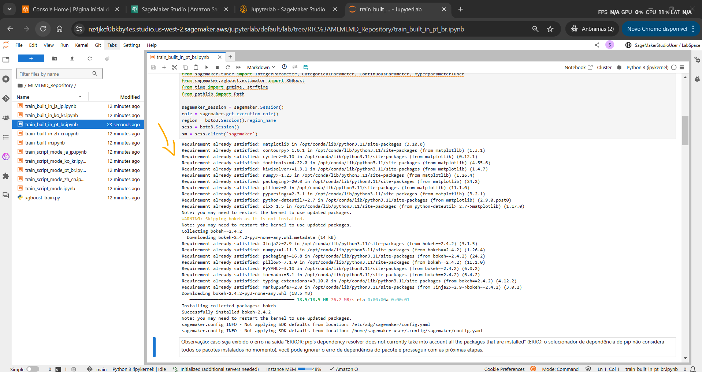
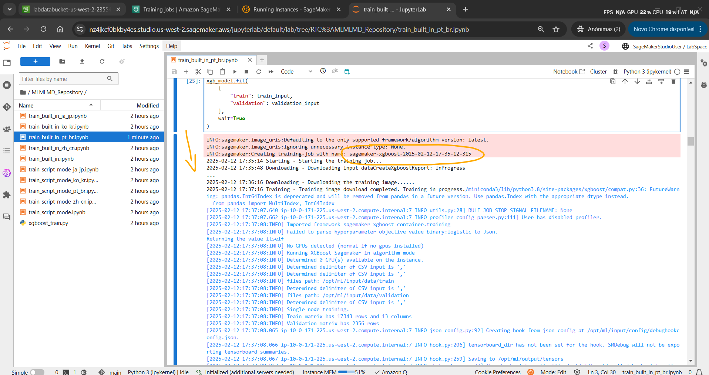
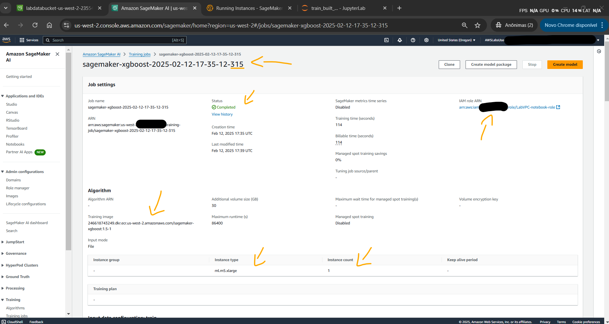
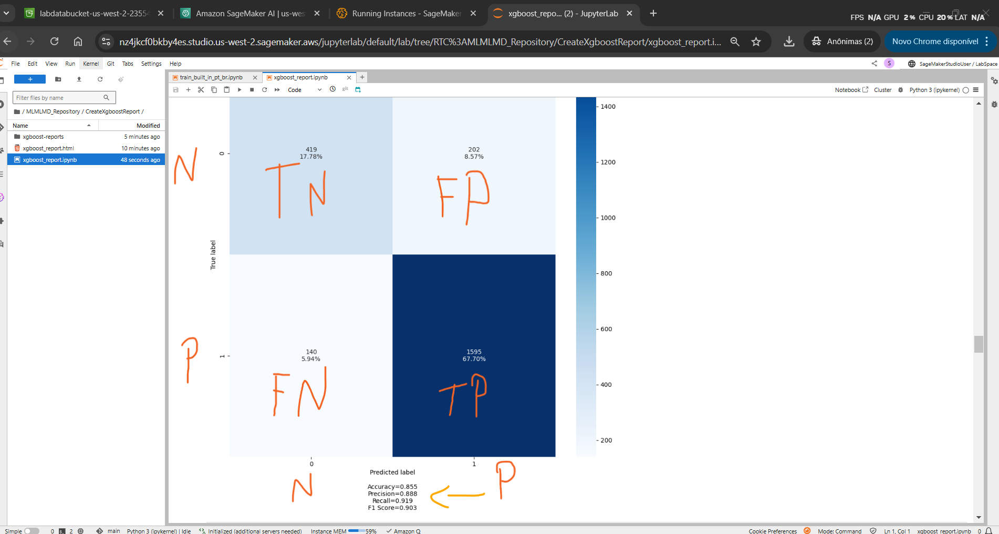

# Lab - Train a model with Amazon SageMaker   

### AWS Skill Builder <a href="../../">aws_skill_builder   </a>
### Training Category: <a href="../../self_paced_lab">self_paced_lab</a>
### Software/Subject: aws   
### Course: <a href="./">curso_spl_017 (Lab - Train a model with Amazon SageMaker)   </a>

#### Parceria da AWS com a Escola da Nuvem (EDN)   

---

### Theme:
- Cloud Computing
- Machine Learning

### Used Tools:
- Operating System (OS): 
  - Linux   
  - Windows 11   
- Linux Distribution:
  - Amazon Linux   
- Cloud:
  - Amazon Web Services (AWS)   
- Cloud Services:
  - Amazon Elastic Compute Cloud (EC2)   
  - Amazon SageMaker   
  - Amazon SageMaker AI   
  - Amazon SageMaker Studio; Amazon SageMaker Studio Lab   
  - Amazon Simple Storage Service (S3)   
  - AWS CodeCommit  
  - Google Drive   
- Containerization: 
  - Docker   
- Language:
  - Python   
  - HTML   
  - Markdown   
- Integrated Development Environment (IDE) and Text Editor:
  - Visual Studio Code (VS Code)   
- Notebook Interface:
  - JupyterLab   
  - Jupyter Notebook   
- Versioning: 
  - Git   
- Repository:
  - GitHub   
- Artificial Intelligence:
  - eXtreme Gradient Boosting (XGBoost)   

---

<a name="item0"><h3>Course Strcuture:</h3></a>
1. Lab - Train a model with Amazon SageMaker<br>
1.1 <a href="#item01.1">Tarefa 1: Treinar um modelo usando um algoritmo integrado</a><br>
1.2 <a href="#item01.2">Tarefa 2: Treinar um modelo usando um script personalizado no modo script</a><br>

---

### Objective:
Neste laboratório prático, o **JupyterLab** do **Amazon SageMaker Studio** foi utilizado para treinar dois modelos de machine learning (ML) a partir de um conjunto de dados armazenado em um bucket do **Amazon S3**. Esse conjunto de dados foi o mesmo utilizado no laboratório [curso_spl_014](https://github.com/PedroHeeger/aws_skb/tree/main/self_paced_lab/curso_spl_014) na etapa de preparação. O objetivo aqui foi realizar uma classificação binária, prevendo se os valores da coluna de renda (`income`) seriam maiores ou menores que US$ 50.000, com o intuito de determinar se a pessoa teria direito a um programa de assistência governamental.

Para o primeiro modelo, foi utilizado o algoritmo **Extreme Gradient Boosting (XGBoost)** integrado ao SageMaker, com o código de treinamento do **XGBoost** já predefinido. No segundo modelo, explorou-se um cenário mais avançado, no qual o **XGBoost** foi executado em uma estrutura personalizada, oferecendo maior flexibilidade para customizar os scripts de treinamento e inferência. Nesse cenário, técnicas como validação cruzada k-fold foram implementadas. Além disso, o ajuste dos hiperparâmetros foi realizado por meio de intervalos, com o objetivo de alcançar um alto valor de AUC. Isso contrastou com o primeiro modelo, onde os parâmetros foram fixos. O **XGBoost** é amplamente reconhecido pela sua eficiência no aprendizado baseado em árvores de decisão.

O treinamento dos modelos foi realizado com arquivos **Python** no **JupyterLab**, utilizando imagens de container **Docker** com o **XGBoost** já instalado, armazenadas no **Amazon Elastic Container Registry (ECR)**, dentro de um repositório gerenciado pelo SageMaker. Após o treinamento, os modelos finais foram salvos em outro bucket do **Amazon S3**, possibilitando seu uso em futuras inferências. Os relatórios de treinamento do **XGBoost** do primeiro modelo também foram salvos nesse bucket e analisados para avaliar as métricas Precision, Recall e F1-score da matriz de confusão, que, assim como a AUC, indicam que o modelo é bom em prever os resultados quando apresentam valores altos.

### Structure:
A estrutura do curso é formada por:
- Este arquivo de README.
- A pasta `0-aux`, pasta auxiliar com imagens utilizadas na construção desse arquivo de README.
- A pasta `resource/code` com os arquivos de código utilizados.
- A pasta `resource/dataset` com os datasets utilizados.

### Development:
Este curso foi um laboratório prático realizado na plataforma **AWS Skill Builder**, cuja subscrição foi devida a uma parceria entre a **AWS** e a **Escola da Nuvem**. A infraestrutura de cloud utilizada foi fornecida através de um sandbox do **AWS Skill Builder** que possibilitava acesso ao console da **AWS**. Contudo foi necessário seguir estritamente as orientações determinadas no laboratório. Dessa maneira, a forma de interação com os recursos da cloud foram sempre através do console fornecido pelo sandbox, a não ser em casos em que o próprio laboratório instruiu para utilização de outras ferramentas de interação como **AWS CLI** ou **AWS SDK**.

O laboratório do **AWS Skill Builder** tem o foco em executar apenas o que é orientado no escopo, todos os recursos ou serviços que podem ser requisitados adicionalmente já vêm provisionados por padrão pelo laboratório. Ao iniciar o laboratório, o sandbox do **AWS Skill Builder** provisiona diversos recursos e serviços para o funcionamento através de uma ou mais pilhas do **AWS CloudFormation** de forma automática. 

O acesso ao console no sandbox do **AWS Skill Builder** é realizado por meio de uma identidade federada. O Skill Builder funciona como um provedor de identidade (IdP), autenticando o usuário e vinculando-o a uma role do **AWS IAM** provisionada automaticamente por uma das pilhas do CloudFormation. Essa role concede permissões temporárias e mínimas necessárias para a execução do laboratório, garantindo segurança e controle sobre os recursos utilizados. O laboratório, por padrão, determina a região a ser utilizada e ela não deve ser alterada, somente se o próprio laboratório indicar. As configurações não informadas no laboratório devem ser sempre mantidas como padrão que estão.

<a name="item01.1"><h4>Tarefa 1: Treinar um modelo usando um algoritmo integrado</h4></a>[Back to summary](#item0)

A arquitetura inicial, conforme apresentada na imagem 01, mostra um bucket do **Amazon Simple Storage Service (S3)** contendo os dados de treinamento que seriam importados para o **JupyterLab** no **Amazon SageMaker Studio**. No **JupyterLab**, um repositório do **AWS CodeCommit** foi clonado e acessado, e arquivos notebook em **Python** foram utilizados. O código desses arquivos utilizava imagens de container **Docker** de um repositório do SageMaker no **Amazon Elastic Container Registry (ECR)** com o algoritmo **XGBoost** instalado para executar os containers de treinamento dos dois modelos de machine learning construídos. Os modelos treinados, bem como os relatórios dos resultados de treinamento, foram armazenados em outro bucket do **Amazon S3**.

<div align="Center"><figure>
    <br>
    <figcaption>Imagem 01.</figcaption>
</figure></div><br>

Nesta primeira tarefa, um aplicativo de notebook, ou seja o **JupyterLab**, foi iniciado no **Amazon SageMaker Studio** e o repositório do **AWS CodeCommit** contendo os arquivos de código em **Python** para implantação dos dois modelos de machine learning foi clonado. O primeiro modelo foi executado nesta tarefa e ele utilizava o algoritmo **eXtreme Gradient Boosting (XGBoost)** integrado do SageMaker, ou seja, o código utilizado para o treinamento já era pré-definido, não sendo possível a personalização. 

O **Amazon SageMaker Studio** e o **Amazon SageMaker Canvas** são serviços da **AWS** que fazem parte do **Amazon SageMaker**, uma plataforma voltada para machine learning (ML). O **JupyterLab** é um ambiente interativo baseado em navegador para criar e executar notebooks, utilizado principalmente em ciência de dados e aprendizado de máquina. Notebooks são documentos interativos que combinam código executável, resultados (como gráficos e tabelas), e anotações (em formato Markdown), permitindo uma abordagem prática e visual para análise de dados e desenvolvimento de modelos de machine learning.

Tanto o SageMaker Studio quanto os aplicativos **JupyterLab**, ao serem iniciados, rodam sobre um único container **Docker** gerenciado pela **AWS** em uma instância do **Amazon EC2**, funcionando de forma integrada. Essa infraestrutura subjacente permite que o SageMaker Studio forneça uma interface unificada, onde os aplicativos, como o **JupyterLab**, são executados dentro do mesmo container. Cada notebook aberto no **JupyterLab** dentro do SageMaker Studio carrega um kernel específico (como `Python 3` ou `PySpark`) dentro do mesmo container, mantendo o ambiente de execução compartilhado. O kernel é um processo dentro do container **Docker** responsável por executar o código do notebook e gerenciar as operações dentro do ambiente, como a execução de células de código, manipulação de dados e comunicação com os recursos de armazenamento e computação da **AWS**. Esse processo assegura que o notebook funcione de forma eficiente, isolada e integrada ao restante da infraestrutura, aproveitando o ambiente compartilhado no container.

Embora o SageMaker Studio utilize um único container e uma instância EC2 para cada perfil de usuário, a **AWS** gerencia a escalabilidade automaticamente para garantir que a infraestrutura seja capaz de atender às necessidades da carga de trabalho. Caso o número de notebooks abertos ou a complexidade dos processos exijam mais recursos de computação, o SageMaker Studio pode distribuir a carga de trabalho entre várias instâncias EC2 ou containers, sem intervenção manual do usuário. Esse processo de escalabilidade ocorre de forma transparente, permitindo que o usuário continue trabalhando sem precisar se preocupar com o gerenciamento de recursos.

O laboratório facilitou o processo ao fornecer nas instruções o parâmetro `SageMakerStudioUrl` que continha a URL completa para abrir no navegador um aplicativo do **JupyterLab** no SageMaker Studio já conectado no perfil de usuário `SageMakerStudioUser` (`https://us-west-2.console.aws.amazon.com/sagemaker/home?region=us-west-2#/studio/open/d-fqpk62nlwtbv/SageMakerStudioUser/LabSpace/JupyterLab`). O aplicativo do **JupyterLab** poderia levar cerca de 1 a 2 minutos para carregar na primeira vez. Dentro do aplicativo, um repositório **Git** foi clonado do **AWS CodeCommit** e a pasta raiz do repositório (`MLMLMD_Repository`) foi acessada. Caso fosse necessário, o parâmetro `CloneUrlForRepo` nas instruções desse lab tinha a URL correta para acessar o repositório (`https://git-codecommit.us-west-2.amazonaws.com/v1/repos/MLMLMD_Repository`). Na imagem 02 é visualizado o **JupyterLab** aberto já com o repositório clonado e a pasta acessada.

<div align="Center"><figure>
    <br>
    <figcaption>Imagem 02.</figcaption>
</figure></div><br>

Observe que na pasta existiam vários arquivos notebook, sendo cinco iguais ao arquivo [train_built_in.ipynb](./resource/code/train_built_in.ipynb), usado para construção do primeiro modelo nesta tarefa, e outros cinco iguais ao arquivo [train_script_mode.ipynb](./resource/code/train_script_mode.ipynb), usados para implantação do segundo modelo na tarefa 2. Em cada grupo de arquivos o que mudava era a linguagem natural utilizada, por padrão a língua era inglês, mas existiam as versões em português desses arquivos, que foram as utilizadas para implantação dos dois modelos: [train_built_in_pt_br.ipynb](./resource/code/train_built_in_pt_br.ipynb) e [train_script_mode_pt_br.ipynb](./resource/code/train_script_mode_pt_br.ipynb). Além desses, um terceiro tipo de arquivo, cujo nome era [xgboost_train.py](./resource/code/xgboost_train.py) também existia na pasta. Esse arquivo era o de script personalizado utilizado pelo arquivo que implementava o segundo modelo, onde a configuração do algoritmo **XGBoost** era customizada.

Ao abrir o arquivo de notebook `train_built_in_pt_br.ipynb` no aplicativo do **JupyterLab**, um novo processo foi iniciado no container, no qual o kernel utilizado era definido como `Python 3 (ipykernel)`, já que o arquivo continha código em linguagem **Python**. Cada célula do arquivo foi executada na ordem, utilizando o atalho `Shift + Enter` em cada uma. Um asterisco aparecia ao lado do bloco de código enquanto ele era executado. A partir desse momento, foram executados os código para iniciar o processo de treinamento do primeiro modelo. O arquivo dividia o processo nas seis seguintes partes:
- `Tarefa 1.1: Configurar o ambiente`: Preparação do ambiente de execução, incluindo a configuração dos caminhos de origem dos dados e destino dos modelos no **Amazon S3**, e a definição de variáveis necessárias.
- `Tarefa 1.2: Configurar um objeto estimador`: Criação de um objeto estimador do SageMaker que definia o modelo e o algoritmo a ser utilizado no treinamento.
- `Tarefa 1.3: Configurar hiperparâmetros`: Definição dos parâmetros do modelo que influenciavam a performance do treinamento, como taxa de aprendizado e número de estimadores.
- `Tarefa 1.4: Executar um trabalho de treinamento do SageMaker`: Início do treinamento do modelo no SageMaker utilizando os dados processados e a configuração dos hiperparâmetros definidos.
- `Tarefa 1.5: Avaliar um modelo`: Avaliação do modelo treinado com base em métricas de performance, como Precision, Recall e F1-score, para verificar sua eficiência.
- `Tarefa 1.6: Visualizar os artefatos do modelo`: Exibição dos artefatos gerados pelo treinamento, como o modelo final, métricas e gráficos de desempenho, para análise dos resultados.

O desenvolvimento de um modelo de machine learning (ML) inicia-se com o processamento dos dados. Depois dessa etapa, um algoritmo de ML é selecionado para o treinamento do modelo. O objetivo do treinamento é produzir um modelo capaz de realizar previsões sobre novos dados. Durante esse processo, os dados processados devem incluir uma variável de referência (destino), enquanto os dados futuros não possuem essa informação disponível, ou seja, eles não estão rotulados. O algoritmo identifica padrões que relacionam os atributos dos dados de entrada a essa variável-alvo e, com base nesses padrões, gera um modelo. Uma vez que o modelo esteja pronto, ele pode ser utilizado para prever valores-alvo desconhecidos em novos conjuntos de dados.

O destino (rótulo ou label ou variável-alvo ou variável dependente ou variável de referência ou valor-alvo) refere-se ao valor que se deseja prever. Nos dados de treinamento, essa variável está presente e é utilizada para ensinar o modelo a identificar padrões. Já nos dados futuros (na inferência), essa variável não está disponível, e o modelo deve ser capaz de inferi-la com base nos padrões aprendidos. Quando se diz que os dados não estão "rotulados", significa que não possuem um valor de destino conhecido. No contexto de aprendizado supervisionado, os dados rotulados incluem tanto as características (features ou variáveis independentes ou preditores ou atributos de entrada ou fatores explicativos) quanto o valor-alvo. Por outro lado, os dados não rotulados possuem apenas as características e precisam ser classificados ou previstos pelo modelo.

Por exemplo, ao treinar um modelo de machine learning para classificar e-mails como spam ou não, é necessário fornecer dados de treinamento contendo mensagens cujo destino já é conhecido (ou seja, um rótulo informando se o e-mail é spam ou legítimo). Com base nesses dados, o algoritmo constrói um modelo capaz de identificar padrões e prever a classificação dos e-mails. Depois disso, esse modelo pode ser utilizado para analisar novas mensagens e determinar se elas são spam ou não. Esse tipo de machine learning é chamado de aprendizado supervisionado (supervised learning).

Neste laboratório, o objetivo foi prever se uma pessoa possuía uma renda inferior a USD 50 mil. O modelo estava sendo treinado para maximizar a precisão nessa previsão. O processo de treinamento exigia algumas configurações, incluindo a escolha do algoritmo, que, nas duas tarefas do lab foi o **eXtreme Gradient Boosting (XGBoost)**. Além disso, foi necessário definir os hiperparâmetros, que são variáveis que controlam o funcionamento do treinamento. Esses hiperparâmetros podem ser ajustados para influenciar diferentes aspectos do processo. A seleção adequada desses valores foi essencial para garantir um bom desempenho e alta precisão do modelo. Após o treinamento, o modelo foi avaliado, e seus artefatos poderam ser analisados.

##### Configurar o ambiente

Antes de iniciar o treinamento do modelo, todas as dependências necessárias precisaram ser instaladas. Primeiro foi instaladas as bibliotecas do **Python**, *Matplotlib* e *Bokeh*, e reiniciado o kernel desse arquivo do **JupyterLab** (container). Em seguida, diversas bibliotecas como **Boto3**, *Math*, *Matplotlib*, *os*, *Pandas*, *SageMaker*, foram importadas, além de classes e métodos específicos dessas biliotecas. Após importação, os comandos em python abaixo foram executados:
- `sagemaker_session = sagemaker.Session()`: Criava uma sessão do SageMaker.
- `role = sagemaker.get_execution_role()`: Obtinha a role de execução do SageMaker associada à instância atual do SageMaker.
- `region = boto3.Session().region_name`: Obtinha a região da **AWS** onde a instância do SageMaker estava sendo executada.
- `sess = boto3.Session()`: Criava uma sessão do **Boto3** para interagir com os serviços da **AWS**.
- `sm = sess.client('sagemaker')`: Criava um cliente do SageMaker para interagir com o serviço SageMaker usando a sessão do **Boto3**.

Caso um erro de dependência fosse exibido ao executar essa primeira célula, este podia ser ignorado, pois não prejudicava o resto do código. A imagem 03 mostra as importações realizadas assim como os comandos **Python** necessários.

<div align="Center"><figure>
    <br>
    <figcaption>Imagem 03.</figcaption>
</figure></div><br>

Além de importar as dependências, o conjunto de dados também precisva ser importado. O conjunto de dados utilizado foi o mesmo do laboratório [curso_spl_014](https://github.com/PedroHeeger/aws_skb/tree/main/self_paced_lab/curso_spl_014), onde no lab 14 os dados foram processados e preparados para etapa de treinamento e inferência que estava sendo executado agora. Não foi necessário salvar os datasets do laboratório anterior, pois o lab atual fornecia os mesmos datasets já processados em um bucket do **Amazon S3** divididos em dados de treinamento ([adult_data_processed_train.csv](./resource/dataset/adult_data_processed_train.csv)), dados de validação ([adult_data_processed_validation.csv](./resource/dataset/adult_data_processed_validation.csv)) e dados de teste ([adult_data_processed_test.csv](./resource/dataset/adult_data_processed_test.csv)). Todos os três estavam separados no bucket em seu respectivo prefixo: `https://labdatabucket-us-west-2-497232574.s3.us-west-2.amazonaws.com/scripts/data/train/adult_data_processed_train.csv`, `https://labdatabucket-us-west-2-497232574.s3.us-west-2.amazonaws.com/scripts/data/validation/adult_data_processed_validation.csv` e `https://labdatabucket-us-west-2-497232574.s3.us-west-2.amazonaws.com/scripts/data/test/adult_data_processed_test.csv`. Os dados foram divididos na seguinte proporação: 70% para treinamento, 20% para validação e 10% para teste.

No código, para importar os dados foi utilizado o **Boto3** para conectar ao bucket do **Amazon S3**, os caminhos para os datasets de treinamento e validação foram passados e os objetos de entrada do treinamento foram construídos. Os conjuntos de dados de treinamento e validação eram usados durante o treinamento, enquanto o conjunto de dados de teste era usado na avaliação do modelo após a implantação. O caminho de saída do modelo foi definido com os comandos `prefix = 'scripts/data'` e `output_path = 's3://{}/{}/output'.format(bucket, prefix)`.

Por fim, ainda nesse bloco de código, um container **Docker** para o treinamento foi configurado com os comandos abaixo:
- `create_date = strftime("%m%d%H%M")`: Criava uma string com a data e hora no formato mês, dia, hora e minuto.
- `container = image_uris.retrieve(framework='xgboost',region=boto3.Session().region_name,version='1.5-1')`: Recuperava a URI da imagem **Docker** do SageMaker armazenada no **Amazon ECR** na região atual que já vinha com o framework **XGBoost** instalado na versão especificada. Por exemplo, o nome da imagem seria algo como `895741380848.dkr.ecr.us-west-2.amazonaws.com/sagemaker-xgboost:1.5-1`
- `run_name = 'lab-2-run-{}'.format(create_date)`: Criava um nome único para o experimento, concatenando "lab-2-run-" com a data e hora geradas.

A imagem 04 exibe as importações dos datasets do bucket do S3, a definição do caminho de saída do modelo, a criação dos objetos de treinamento e a configuração do container que seria utilizado.

<div align="Center"><figure>
    <br>
    <figcaption>Imagem 04.</figcaption>
</figure></div><br>

##### Configurar um objeto estimador

Um estimador é uma interface de alto nível para o treinamento no **Amazon SageMaker**. Ele é criado fornecendo parâmetros como a função do AWS Identity and Access Management (IAM), a quantidade e o tipo de instâncias de computação, além do caminho de saída no **Amazon S3**. Na Tarefa 1, foi utilizada uma imagem **Docker** do repositório do SageMaker no **Amazon ECR** que já vinha com o código de treinamento do **XGBoost** predefinido. O laboratório se referia a essa abordagem como a "integração do **XGBoost** com o SageMaker", o que poderia causar certa confusão. Na prática, o que ocorria era que, ao invés de utilizar um script personalizado com o código de treinamento do **XGBoost** para configurar manualmente o **XGBoost**, a imagem **Docker** escolhida do **XGBoost** já possuía um código de treinamento específico, não sendo possível personalizar o código. Em contraste, na Tarefa 2, foi utilizado o arquivo de script **Python** personalizado ([xgboost_train.py](./resource/code/xgboost_train.py)), no qual o código de treinamento do **XGBoost** foi definido. Isso permitia maior flexbilidade, pois era possível configurar recursos avançados como a validação cruzada k-fold. Em ambos os casos, o SageMaker gerenciava automaticamente os containers para o treinamento do modelo.

O **XGBoost** é uma implementação de código aberto eficiente do algoritmo baseado em árvores com aumento de gradiente. O aumento de gradiente é um algoritmo de aprendizado supervisionado que visa prever com precisão uma variável de destino, combinando estimativas de modelos mais simples e fracos. O **XGBoost** tem bom desempenho ao lidar com diferentes tipos de dados, relacionamentos, distribuições e permite o ajuste de vários hiperparâmetros. Esse algoritmo pode ser aplicado a problemas de regressão, classificação (binária e multiclasse) e ranking. Neste caso, o **XGBoost** estava sendo utilizado para resolver um problema de classificação (determinar se alguém ganhava menos de USD 50 mil ou não). Dessa forma, o comando abaixo foi executado:

```python
xgb_model = sagemaker.estimator.Estimator(
    image_uri = container,
    role = role, 
    instance_count = 1, 
    instance_type ='ml.m5.xlarge',
    output_path = output_path,
    sagemaker_session = sagemaker_session,
    rules=[
        Rule.sagemaker(
        rule_configs.create_xgboost_report(),
        s3_output_path=output_path
        )
    ]
)
```

Nesse comando, um estimador **XGBoost** era criado usando a classe `sagemaker.estimator.Estimator` e definindo os seguintes parâmetros:
- `image_uri`: o URI da imagem do container de treinamento. Este URI da imagem já tinha sido especificada anteriormente, onde a variável `container` armazenou essa informação.
- `função`: o perfil do IAM que o SageMaker usava para executar tarefas em seu nome (por exemplo, ler resultados de treinamento, chamar artefatos de modelo do **Amazon S3** e gravar resultados de treinamento no **Amazon S3**). A variável `role` também já tinha armazenada essa informação.
- `instance_type` e `instance_count`: o tipo e o número de instâncias de computação de ML do **Amazon EC2** a serem usadas para treinamento de modelo. Neste laboratório, foi utilizado uma única instância `ml.m5.xlarge`, que tinha `4` CPUs, `16` GB de memória, armazenamento **Amazon Elastic Block Store (EBS)** e alto desempenho de rede.
- `output_path`: o caminho para o bucket do S3 onde o SageMaker armazenava o artefato do modelo e os resultados do treinamento. A variável `output_path` já tinha armazenada essa informação.
- `sagemaker_session`: o objeto de sessão que gerenciava interações com operações de API do SageMaker e outros serviços da **AWS** usados pelo trabalho de treinamento. A variável `sagemaker_session` já tinha essa informação armazenada.
- `regras`: uma lista de regras integradas do *Amazon SageMaker Debugger*. Neste exemplo, a regra `create_xgboost_report()` criava um relatório **XGBoost** que fornecia informações sobre o progresso e os resultados do treinamento. Os arquivos deste relatório eram armazenados na pasta `/rule-output` dentro da pasta do job de treinamento executado no **Amazon S3**. Poderia ser que ao final desta tarefa, ao executar o código que procurava esse relatório no S3, nenhum arquivo fosse encontrado, pois a geração do relatório poderia ver entre 5 a 10 minutos.

A imagem 05 evidencia a configuração do objeto estimador utilizando o algoritmo **XGBoost** integrado ao SageMaker.

<div align="Center"><figure>
    <br>
    <figcaption>Imagem 05.</figcaption>
</figure></div><br>

##### Configurar hiperparâmetros

Os hiperparâmetros desempenham um papel crucial na definição da estrutura, função e desempenho de um modelo. A escolha adequada desses valores é essencial para alcançar bons resultados. O processo de ajuste de hiperparâmetros (ou tuning de hiperparâmetros) é responsável por otimizar o desempenho do modelo, buscando a configuração ideal. Em um tuning automatizado, o sistema explora diversas combinações de hiperparâmetros de forma sistemática, criando múltiplos trabalhos de treinamento para encontrar a melhor configuração. Já no ajuste manual, os hiperparâmetros são definidos diretamente pelo usuário com base em seu conhecimento prévio ou experimentação. Nesse caso, o trabalho de tuning é mais abstrato, pois não envolve a exploração automatizada de combinações. Em vez disso, o usuário ajusta os parâmetros manualmente, realizando um trabalho de treinamento para cada nova combinação. Cada execução do modelo, portanto, corresponde a um único trabalho de treinamento, e o processo de otimização ocorre por meio de tentativas sucessivas, com o objetivo de encontrar a melhor configuração. 

Nsta tarefa 1 não houve job de tuning, pois os hiperparâmetros foram definidos de forma fixa e apenas um job de treinamento foi executado, não havendo teste de combinações de hiperparâmetros. Na tarefa seguinte, foram utilizados intervalos de hiperparâmetros para que o modelo buscasse a melhore combinação possível, ou seja, um trabalho de tuning foi executado no qual vários jobs de treinamento aconteciam dentro dele testando a melhor combinação de hiperparâmetros. Para definir os hiperparâmetros estáticos para o algoritmo **XGBoost** foi utilizado o método `set_hyperparameters` do estimador, conforme código abaixo:

```python
xgb_model.set_hyperparameters(
    max_depth = 5,
    eta = 0.2,
    gamma = 4,
    min_child_weight = 6,
    subsample = 0.7,
    verbosity = 0,
    objective = 'binary:logistic',
    num_round = 800
)
```
A explicação de cada parâmetro utilizado é apresentada a seguir:
- `max_depth`: Define a profundidade máxima das árvores, controlando a complexidade do modelo.
- `eta`: Taxa de aprendizado que controla a contribuição de cada árvore para o modelo final.
- `gamma`: Determina a quantidade mínima de redução da perda para dividir um nó, controlando a complexidade da árvore.
- `min_child_weight`: Define o peso mínimo das amostras em um nó filho para garantir que a divisão seja válida.
- `subsample`: Percentual de dados usados para treinar cada árvore, ajudando a evitar overfitting.
- `verbosity`: Controla o nível de mensagens de saída durante o treinamento (0 = sem mensagens).
- `objective`: Define o tipo de problema a ser resolvido (no caso, classificação binária usando a função logística).
- `num_round`: Número de iterações (ou árvores) que o modelo irá treinar.

A imagem 06 exibe a configuração dos hiperparâmetros do algoritmo **XGBoost**.

<div align="Center"><figure>
    <br>
    <figcaption>Imagem 06.</figcaption>
</figure></div><br>

##### Executar um trabalho de treinamento do SageMaker

Com o objeto estimador e o tuning de hiperparâmetros configurados, o treinamento do modelo foi iniciado. Para iniciar o treinamento do modelo, foi utilizado o método `fit()` do estimador com os conjuntos de dados de treinamento e de validação, conforme código abaixo. Como foi definido `wait=True`, o método `fit()` exibia logs de progresso e aguardava até que o treinamento fosse concluído. A imagem 07 mostra a execução dessa célula de código. O treinamento levou entre 3 a 4 minutos para ser concluído. A imagem 08 exibe o trabalho de treinamento provisionado pelo SageMaker.

```python
xgb_model.fit(
    {
        "train": train_input,
        "validation": validation_input
    },
    wait=True
)
```

<div align="Center"><figure>
    <br>
    <figcaption>Imagem 07.</figcaption>
</figure></div><br>

<div align="Center"><figure>
    <br>
    <figcaption>Imagem 08.</figcaption>
</figure></div><br>

##### Avaliar um modelo

Após a conclusão do trabalho de treinamento, foi possível baixar o relatório de treinamento **XGBoost** gerado pelo SageMaker Debugger. Esse relatório fornecia informações detalhadas sobre o progresso e os resultados do treinamento, como a função de perda em relação à iteração, a importância dos recursos, a matriz de confusão, as curvas de acurácia e outros dados estatísticos. Para o trabalho de treinamento **XGBoost** no SageMaker foi utilizada a regra `CreateXgboostReport` do Debugger para gerar um relatório completo sobre o progresso e os resultados. O processo de geração do relatório poderia levar de cinco a dez minutos. 

No bloco de código a seguir, foi verificado se o relatório final estava disponível no local de destino do S3 que era formado por `bucket/scripts/data/output/job-name/rule-output`, conforme comando `rule_output_path = xgb_model.output_path + "/" + xgb_model.latest_training_job.job_name + "/rule-output"`. Dentro `/rule-output`, a pasta `CreateXgboostReport/`, que foi a da regra definida no objeto estimador, tinha sido criada. Portanto, o código verificava se essa pasta já existia no repositório clonado no **JupyterLab** (`MLMLMD_Repository`). Caso não existisse, ele consultava essa pasta na pasta `/rule-output` na pasta do job executado no S3, e se ela tivesse sido criada lá, ela e todos seus arquivos eram copiados para o **JupyterLab**. Esse processo demorava um pouco, pois o local no S3 era consultado a cada 30 segundos para verificar se os arquivos existiam, para então copiá-los para o **JupyterLab**.  

```python
%%capture
the_file = Path("CreateXgboostReport/xgboost_report.ipynb")
notexists = True
while notexists:
    if the_file.is_file():
        notexists = False
    else:
        time.sleep(30)
        rule_output_path = xgb_model.output_path + "/" + xgb_model.latest_training_job.job_name + "/rule-output"
        ! aws s3 ls {rule_output_path} --recursive
        ! aws s3 cp {rule_output_path} ./ --recursive
```

Após a conclusão, os arquivos foram armzenados na pasta `CreateXgboostReport`, conforme mostrado na imagem 09, e o último comando executado foi o `display("Click link below to view the XGBoost Training notebook", FileLink("CreateXgboostReport/xgboost_report.ipynb"))`. Este, apenas criava um link com nome do arquivo que seria acessado, que foi o arquivo [xgboost_report.ipynb](./resource/code/)

<div align="Center"><figure>
    <br>
    <figcaption>Imagem 09.</figcaption>
</figure></div><br>

Esse arquivo, que também era de notebook com código **Python**, foi aberto em outra guia do **JupyterLab**, conforme imagem 10. Deviso a isso, um novo processo no container era provisionado, definindo o seu kernel como `Python 3 (ipykernel)`. Em seguida, a opção que reiniciava o kernel e executava todas as células do arquivo foi selecionada. A execução do código desse arquivo levava aproximadamente de dois a três minutos. Após a execução, o arquivo foi rolado para baixo até a matriz de confusão (`Confusion Matriz`). A matriz de confusão ilustrava em uma tabela o número de previsões corretas e incorretas para cada classe, comparando a classe prevista de uma observação e sua classe verdadeira. Ao rolar até o diagrama, conforme imagem 11, foram visualizados os seguintes valores:
- `Verdadeiro positivo (TP)`: se a classificação real for positiva e a classificação prevista for positiva (1,1), isso é chamado de resultado verdadeiro positivo, porque a amostra positiva foi identificada corretamente pelo classificador. 
- `Falso negativo (FN)`: se a classificação real for positiva e a classificação prevista for negativa (1,0), isso é chamado de resultado de falso negativo, porque a amostra positiva é identificada incorretamente pelo classificador como sendo negativa. 
- `Falso positivo (FP)`: se a classificação real for negativa e a classificação prevista for positiva (0,1), isso é chamado de resultado de falso positivo, porque a amostra negativa é identificada incorretamente pelo classificador como sendo positiva. 
- `Verdadeiro negativo (TN)`: se a classificação real for negativa e a classificação prevista for negativa (0,0), isso é chamado de resultado verdadeiro negativo, porque a amostra negativa é identificada corretamente pelo classificador.

Um bom modelo tem altos valores de TP e TN, e baixos valores de FP e FN. Neste caso, o TP era 1595 (67.70%), o FN era 140 (5.94%), o FP era 202 (8.57%) e o TN era 419 (17.78%).

<div align="Center"><figure>
    <br>
    <figcaption>Imagem 10.</figcaption>
</figure></div><br>

<div align="Center"><figure>
    <br>
    <figcaption>Imagem 11.</figcaption>
</figure></div><br>

Na sequência, a barra de rolagem foi rolada para baixo até `Avaliação da matriz de confusão` e foi analisado o `Relatório de classificação` para entender o resumo da precisão, o recall e a pontuação F1 de cada classe.
- `Precision` (Precisão Positiva ou Valor Preditivo Positivo (VPP/TPP)): mede a fração de positivos reais que foram previstos como positivos entre todos os previstos como positivos. O intervalo é de 0 a 1 e um valor maior indica melhor acurácia, ou seja, poucos falsos positivos. 
    - Fórmula: `TP / (TP + FP)`.
    - Alto TPP = menor FP = Alta Especificidade (Alta TNR)
- `Precision` (Precisão Negativa ou Valor Preditivo Negativo (VPN/TPN)): mede a fração de negativos reais que foram previstos como negativos entre todos os previstos como negativos. O intervalo é de 0 a 1 e um valor maior indica melhor acurácia, ou seja, poucos falsos negativos.
    - Fórmula: `TN / (TN + FN)`.
    - Alto TPN = menor FN = Alta Sensibilidade (Alta TPR).
- `Recall` (Especificidade/taxa de verdadeiro negativo (TNR)): mede a fração de negativos reais que foram previstos como negativos do todo (TN + FP). O intervalo também é de 0 a 1, e um valor maior indica uma melhor acurácia preditiva, ou seja, poucos falsos positivos.
    - Fórmula: `TN / (TN + FP)`.
    - Alta Especificidade (Alta TNR) = menor FP = Alto TPP.
- `Recall` (Sensibilidade/taxa de verdadeiro positivo (TPR)): mede a fração de positivos reais que foram previstos como positivos do todo (TP + FN). O intervalo também é de 0 a 1, e um valor maior indica uma melhor acurácia preditiva, ou seja, poucos falsos negativos.
    - Fórmula: `TP / (TP + FN)`.
    - Alta Sensibilidade (Alta TPR) = menor FN = Alto TPN.
- `F1-score` (Pontuação F1): demonstra sua métrica-alvo, que é a média harmônica de precisão e recall. A F1 leva em consideração os FP e os FN para dar o mesmo peso à precisão e ao recall. Fórmula: `F1 = 2 x ((Precision * Recall) / (Precision + Recall))`. A F1-score dá um equilíbrio entre Precisão e Recall e é útil quando nenhum dos dois pode ser ignorado (ex.: classificação de fraudes bancárias). Se a F1-score for alta, significa que o modelo está equilibrado entre evitar FP e FN.

No cenário do lab, estava sendo previsto se as pessoas ganhavam menos de USD 50 mil para poder promover serviços de assistência governamental a esses cidadãos qualificados. A imagem 12 mostra o relatório de classificação. Perceba que na primeira coluna tinham os valores (`0.0` e `1.0`) que representavam a classificação binária, ou seja, as duas opções disponíveis como resposta no valor-alvo (se ganhava mais que USD 50.000 ou menos). No lab 14, onde a etapa de preparação foi realizada, uma transformação tinha sido feita para substituir os valores iguais a `<=50k` por `1`, ou seja, verdadeiro, e os valores iguais a `>50K` por `0`, ou seja, falso. Logo `1.0` era a classe que representava quem ganhava menos de USD 50 mil (sendo a positiva da análise) e a classe `0.0` quem ganhava mais de USD 50 mil (sendo a negativa da análise).

<div align="Center"><figure>
    <br>
    <figcaption>Imagem 12.</figcaption>
</figure></div><br>

Analisando os dados mais detalhadamente, as seguintes considerações foram feitas:
- Classe `1.0` (<=50k, positivo):
    - Precision de 0.89: Quando o modelo classificava algo como positivo, ele está correto 89% das vezes. Isso significa que há um número relativamente baixo de falsos positivos (casos em que o modelo classificou algo como positivo (1.0), mas era na verdade da classe 0.0 (negativo)).
    - Recall de 0.92: O modelo estava identificando corretamente 92% de todos os casos reais que pertenciam à classe 1.0 (positivo). Ou seja, ele conseguia pegar quase todos os positivos, com poucos falsos negativos (casos em que ele deixou de identificar algo como positivo, mesmo sendo positivo).
    - F1-Score de 0.90: Esse valor é uma média harmônica entre precisão e o recall, e indicava um bom equilíbrio entre os dois. Um F1-score de 0.90 significava que o modelo tinha um bom desempenho na detecção de casos positivos, equilibrando bem a precisão (evitando falsos positivos) e o recall (evitando falsos negativos).
- Classe `0.0` (>50k, negativo):
    - Precision de 0.75: Quando o modelo classificava algo como 0.0 (negativo), ele estava correto 75% das vezes. Isso significava que há uma quantidade razoável de falsos negativos (casos em que o modelo classificou algo como positvo, mas era na verdade negativo), já que a precisão não era tão alta quanto para a classe 1.0 (onde a precisão era 0.89).
    - Recall de 0.67: O modelo conseguia identificar corretamente 67% de todos os casos reais da classe 0.0 (negativo). Ou seja, ele não estava identificando todos os casos negativos e estava deixando de capturar uma parte dos casos negativos, gerando falsos positivos (casos onde ele classificou erroneamente algo como positivo, quando na verdade era negativo).
    - F1-Score de 0.71: Com um valor de 0.71, o desempenho do modelo para a classe 0.0 (negativo) estava abaixo do desempenho para a classe 1.0 (que tinha um F1-Score de 0.90), indicando que o modelo era menos eficiente ao identificar casos negativos, equilibrando pior entre precisão e recall.

Nesse caso, a pontuação F1 era uma boa medida a ser usada, porque levava em consideração os FP (pessoas que ganhavam mais de USD 50 mil e que foram rotuladas como ganhando menos de USD 50 mil) e os FN (pessoas que ganhavam menos de USD 50 mil e que foram rotuladas como ganhando mais de USD 50 mil) em conta. Para que o modelo tivesse poucos falsos positivos e falsos negativos era necessário que os valores de precisão e recall fossem altos respectivamente. Como a pontuação F1 era uma média harmônica entre precisão e recall, se F1 for alta, isso significava que ambas as métricas também estavam altas, garantindo um bom equilíbrio no desempenho do modelo. A imagem 13 mostra o arquivo do modelo de machine learning construído neste tarefa e que tinha sido armazenado no bucket do **Amazon S3**

<div align="Center"><figure>
    <br>
    <figcaption>Imagem 13.</figcaption>
</figure></div><br>

<a name="item01.2"><h4>Tarefa 2: Treinar um modelo usando um script personalizado no modo script</h4></a>[Back to summary](#item0)

Na tarefa anterior, o modelo de machine learning foi construído utilizando o algoritmo **XGBoost** "integrado" ao SageMaker. Ou seja, a imagem **Docker** do repositório do SageMaker no **Amazon ECR**, que já vinha com o **XGBoost** instalado, configurado e com o código de treinamento embutido, foi utilizada para treinar o modelo. Essa abordagem, embora prática, era menos flexível e não permitia configurações avançadas, como validação cruzada k-fold. A validação cruzada k-fold é uma técnica de avaliação de modelos em que os dados são divididos em k partes (folds). O modelo é treinado k vezes, usando k-1 partes para treino e a parte restante para teste, garantindo uma avaliação mais robusta e reduzindo o risco de overfitting (sobreajuste). 

Enquanto no modelo um foi utilizado hiperparâmetros estáticos na sua construção e as métricas da matriz de confusão na sua avaliação, neste segundo, foi executado um trabalho de tuning de hiperparâmetros com base em intervalos determinados, com o objetivo de que fosse escolhido a melhor combinação de hiperparâmetros para obter um bom resultado de AUC (Área Sob a Curva ROC). De forma geral, tanto as métricas da matriz de confusão como a AUC quando altos, indicam que um bom modelo com poucos erros de classificação.

Para criar um modelo mais flexível, foi necessário utilizar uma imagem **Docker** gerenciada pelo SageMaker, porém otimizada, que permitia o fornecimento de código de treinamento **XGBoost** personalizado por meio de um arquivo de script. Com essa abordagem, foi possível ter maior controle sobre o processo, realizando customizações e garantindo que o algoritmo **XGBoost** fosse configurado de acordo com as necessidades específicas, com a possibilidade de implementar recursos avançados no treinamento. Portanto, um segundo modelo foi treinado utilizando os mesmos conjuntos de dados, porém fazendo uso de arquivo de script **Python** para configuração do **XGBoost**. As etapas foram praticamente as mesmas do primeiro modelo, o arquivo de notebook para o segundo modelo ([train_script_mode_pt_br.ipynb](./resource/code/train_script_mode_pt_br.ipynb)) foi aberto e definido `Python 3 (ipykernel)` como kernel, já que ele também usava a linguagem de programação **Python**. Em seguida, o ambiente foi configurado realizando as importações e os comandos inicias mostrados abaixo:
- `sess = sagemaker.Session()`: Criava uma sessão do SageMaker que gerencia a interação com os serviços do SageMaker.
- `region = sess.boto_region_name`: Obtinha a região da **AWS** associada à sessão do SageMaker.
- `s3_client = boto3.client("s3", region_name=region)`: Criava um cliente do S3 usando a região obtida anteriormente.
- `sagemaker_role = sagemaker.get_execution_role()`: Obtinha a role de execução do SageMaker para a instância atual.
- `sagemaker_client = boto3.client("sagemaker")`: Criava um cliente do SageMaker para interagir com o serviço SageMaker usando a sessão do **Boto3**.

A imagem 14 mostra o primeiro bloco de código executado.

<div align="Center"><figure>
    <br>
    <figcaption>Imagem 14.</figcaption>
</figure></div><br>

Na segunda célula de código, foram configurados os caminhos de treinamento e validação que o trabalho de treinamento usava como entrada e definidos os caminhos de saída usados para armazenar os resultados e artefatos gerados durante o treinamento e análise do modelo. Os caminhos de saída são explicados abaixo:
- `model_uri`: Caminho onde o modelo treinado seria salvo no S3.
- `output_uri`: Caminho onde outros resultados ou saídas do treinamento (como métricas ou logs) seriam armazenados.
- `estimator_output_uri`: Caminho onde os artefatos de treinamento, como o modelo final, seriam armazenados após a execução do treinamento.
- `bias_report_output_uri`: Caminho onde o relatório de viés gerado pelo SageMaker Clarify seria salvo.
- `explainability_report_output_uri`: Caminho onde o relatório de explicabilidade, também do SageMaker Clarify, seria armazenado.

A imgem 15 exibe as definições dos caminhos do **Amazon S3** tanto de entrada como saída estabelecidos.

<div align="Center"><figure>
    <br>
    <figcaption>Imagem 15.</figcaption>
</figure></div><br>

Com o comando seguinte foram definidas as configurações do trabalho de ajuste (tuning) de hiperparâmetros: prefixo do nome do trabalho de treinamento, prefixo do nome do trabalho de tuning, nome do modelo construído com **XGBoost**, quantidade e tipo de instância do **Amazon EC2** utilizada para executar o treinamento. Neste caso, vários trabalhos de treinamento seriam iniciados, onde cada um testava a melhor combinação de hiperparâmetros.

```python
training_job_name_prefix = "xgbtrain"
tuning_job_name_prefix = "xgbtune" 
xgb_model_name = "xgb-script-mode-model"
train_instance_count = 1
train_instance_type = "ml.m5.xlarge"
```

Em seguida, foram configurados os hiperparâmetros estáticos (`static_hyperparams`), os intervalos de hiperparâmetros (`hyperparameter_ranges`) e o objeto estimador (`xgb_estimator = XGBoost`). Os hiperparâmetros estáticos correspondiam aos valores fixos que não seriam ajustados durante o tuning. Já os intervalos de hiperparâmetros definiam as faixas de valores a serem exploradas pelo job de ajuste de hiperparâmetros (tuning job). O objetivo era encontrar a melhor combinação de valores dentro desses intervalos.

A configuração do objeto estimador foi diferente da tarefa 1 e abaixo é explicada detalhadamente as diferenças:
- Tareafa 1:
    - Foi utilizado o comando `import sagemaker` para exportar o SDK do SageMaker para linguegem **Python** e o comando `xgb_model = sagemaker.estimator.Estimator` para construir o objeto estimador.
    - O `Estimator` é uma classe genérica dentro do SDK do SageMaker para criar objetos estimadores com qualquer framework ou algoritmo suportado, como: **XGBoost**, **TensorFlow**, **PyTorch**, etc.
    - O `Estimator` faz parte do módulo `sagemaker.estimator` dentro do SageMaker SDK para **Python**.
    - Quando usado com **XGBoost**, `Estimator` permite especificar manualmente a imagem **Docker** que será usada para o treinamento, e o SageMaker gerencia essa execução internamente.
- Tarefa 2:
    - Foi utilizado o comando `from sagemaker.xgboost.estimator import XGBoost` para importar a classe especializada do **XGBoost**, que que herdava da classe genérica `Estimator`.
    - Como essa classe já era específica para **XGBoost**, não era necessário definir a imagem do container manualmente, pois o SageMaker já sabia qual imagem utilizar.
    - O **XGBoost** faz parte do módulo `sagemaker.xgboost.estimator` dentro do SageMaker SDK para **Python**.
    - Em vez de precisar configurar manualmente um container com a classe `Estimator`, a classe **XGBoost** já lidava com essa parte automaticamente.
    - Essa abordagem permitiu passar um script personalizado (`entry_point="xgboost_train.py"`), garantindo maior controle sobre o processo de treinamento. O arquivo de script utilizado foi o [xgboost_train.py](./resource/code/xgboost_train.py).

Os três blocos de código abaixo mostram na ordem: os hiperparâmetros estáticos; os intervalos de hiperparâmetros; a criação do objeto estimador **XGBoost**. Já a imagem 16 evidencia a construção do estimador. Observe que os hiperparâmetros estáticos são passados dentro do objeto estimador que é o responsável pelo trabalho de treinamento, assim, todos os jobs de treinamento utilizariam esses mesmos hiperparâmetros estáticos. O intervalo de hiperparâmetros é passado no objeto de ajuste (objeto de sintonizador), pois esses seriam alterados entre os jobs de treinamento que o trabalho de tuning executasse.

```python
static_hyperparams = {  
                        "eval_metric" : "auc",
                        "objective": "binary:logistic",
                        "num_round": "5"
                      }
```

```python
hyperparameter_ranges = {
    "max_depth": IntegerParameter(6, 9),
    "eta": ContinuousParameter(0.01, 0.03),
    "gamma": ContinuousParameter(0.5, 0.9),
    "min_child_weight": ContinuousParameter(0.5, 0.9),
    "subsample": ContinuousParameter(0.2, 0.5)
}
```

```python
xgb_estimator = XGBoost(
                        entry_point="xgboost_train.py",
                        output_path=estimator_output_uri,
                        code_location=estimator_output_uri,
                        hyperparameters=static_hyperparams,
                        role=sagemaker_role,
                        instance_count=train_instance_count,
                        instance_type=train_instance_type,
                        framework_version="1.7-1",
                        base_job_name=training_job_name_prefix
                    )
```

<div align="Center"><figure>
    <br>
    <figcaption>Imagem 16.</figcaption>
</figure></div><br>

Na sequência, com o comando abaixo, o objeto de sintonizador (`tuner`) que utilizava o objeto estimador **XGBoost**, bem como os intervalos de hiperparâmetros definidos, foi criado. O objeto de sintonizador é a configuração de job de tuning que vai ser executada. Nesse job, a métrica que seria otimizada foi definida como `validation:auc`, que significava que o AUC (Área Sob a Curva ROC) da validação seria usado como objetivo. O dicionário `turner_config_dict` possuía todas configurações para o ajuste de hiperparâmetros:
- `estimator`: O objeto xgb_estimator (modelo **XGBoost** já configurado).
- `max_jobs`: Número máximo de experimentos que seriam executados para encontrar a melhor configuração. Aqui, foram 6 jobs.
- `max_parallel_jobs`: Número máximo de experimentos que podiam rodar simultaneamente. Aqui, foram 3 jobs rodando em paralelo.
- `objective_metric_name`: A métrica-alvo que seria otimizada (`validation:auc`).
- `hyperparameter_ranges`: Intervalos dos hiperparâmetros que seriam testados (já configurados anteriormente).
- `base_tuning_job_name`: Prefixo do nome dos jobs de tuning (`tuning_job_name_prefix`).
- `strategy`: Estratégia de busca dos hiperparâmetros. Aqui estava definido como `Random`, ou seja, os valores seriam escolhidos aleatoriamente dentro dos intervalos definidos.

```python
objective_metric_name = "validation:auc"

tuner_config_dict = {
                     "estimator" : xgb_estimator,
                     "max_jobs" : 6,
                     "max_parallel_jobs" : 3,    
                     "objective_metric_name" : objective_metric_name,
                     "hyperparameter_ranges" : hyperparameter_ranges,
                     "base_tuning_job_name" : tuning_job_name_prefix,
                     "strategy" : "Random"
                    }
tuner = HyperparameterTuner(**tuner_config_dict)
```

A curva ROC (Receiver Operating Characteristic) é um gráfico que mostra a capacidade do modelo de classificar corretamente as classes positivas e negativas em diferentes limiares de decisão. Já a AUC (Área Sob a Curva ROC) é a área sob essa curva e é uma medida da capacidade do modelo em distinguir entre as classes. Quanto mais alto for o AUC (quanto mais próximo de 1), melhor o modelo é capaz de separar as classes positivas das negativas.

O comando `tuner = HyperparameterTuner(**tuner_config_dict)` criava o objeto de tuning de hiperparâmetros, utilizando o dicionário configurado. A classe `HyperparameterTuner` pertence ao SageMaker SDK para **Python** e gerencia a busca pela melhor combinação de hiperparâmetros. A imagem 17

<div align="Center"><figure>
    <br>
    <figcaption>Imagem 17.</figcaption>
</figure></div><br>

Logo após, outro comando foi utilizado para configurar os canais de entrada para o trabalho de tuning e executar o trabalho do sintonizador, passando os dados de treinamento e validação. A imagem 18 mostra o output dessa célula executada. O treinamento levava de três a quatro minutos para ser executado. O job de treinamento era executado dentro do job de tuning, pois o trabalho de tuning executava vários trabalhos de treinamento com diferentes combinações de hiperparâmetros.

```python
s3_input_train = TrainingInput(s3_data="s3://{}/{}".format(read_bucket, train_data_key), content_type="csv", s3_data_type="S3Prefix")
s3_input_validation = (TrainingInput(s3_data="s3://{}/{}".format(read_bucket, validation_data_key), content_type="csv", s3_data_type="S3Prefix"))

tuner.fit(inputs={"train": s3_input_train, "validation": s3_input_validation}, include_cls_metadata=False)
tuner.wait()
```

<div align="Center"><figure>
    <br>
    <figcaption>Imagem 18.</figcaption>
</figure></div><br>

Por fim, o último comando criava um objeto `HyperparameterTuningJobAnalytics` para acessar os resultados do trabalho de tuning mais recente. Em seguida, ele convertia esses resultados em um DataFrame, filtrava as linhas com valores válidos para a métrica objetivo (eliminando valores infinitos), e ordenava os resultados com base no valor da métrica objetivo em ordem decrescente. O objetivo era mostrar as combinações de hiperparâmetros que resultaram nos melhores desempenhos do modelo. A imagem 19 mostra esse dataframe.

```python
df_tuner = sagemaker.HyperparameterTuningJobAnalytics(tuner.latest_tuning_job.job_name).dataframe()
df_tuner = df_tuner[df_tuner["FinalObjectiveValue"]>-float('inf')].sort_values("FinalObjectiveValue", ascending=False)
df_tuner
```

<div align="Center"><figure>
    <br>
    <figcaption>Imagem 19.</figcaption>
</figure></div><br>

A imagem 20 mostra seis jobs de treinamentos que iniciaram praticamente no mesmo momento. Todos esses seis tinham sido gerados por causa do trabalho de tuning, buscando a melhor combinação de hiperparâmetros.

<div align="Center"><figure>
    <br>
    <figcaption>Imagem 20.</figcaption>
</figure></div><br>