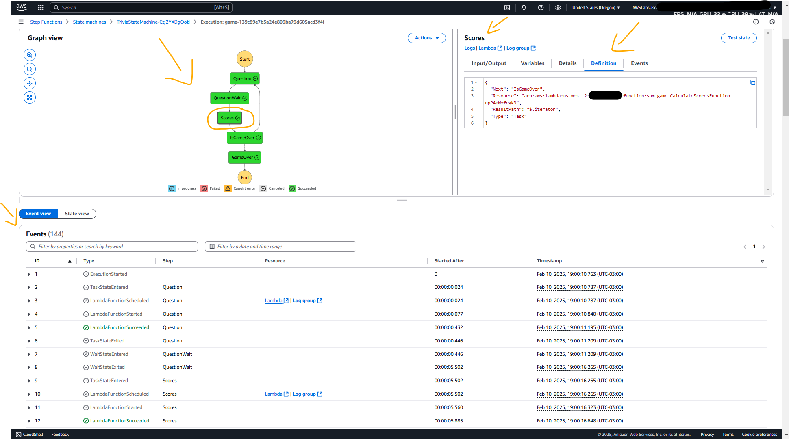

# Lab - Capital Guessing Game   

### AWS Skill Builder <a href="../../">aws_skill_builder   </a>
### Training Category: <a href="../../self_paced_lab">self_paced_lab</a>
### Software/Subject: aws   
### Course: <a href="./">curso_spl_018 (Lab - Capital Guessing Game)   </a>

#### Parceria da AWS com a Escola da Nuvem (EDN)   

---

### Theme:
- Cloud Computing

### Used Tools:
- Operating System (OS): 
  - Linux   
  - Windows 11   
- Linux Distribution:
  - Amazon Linux   
- Cloud:
  - Amazon Web Services (AWS)   
- Cloud Services:
  - AWS Command Line Interface (CLI)   
  - AWS Cloud9   
  - AWS Serverless Application Model (SAM)   
  - AWS Step Functions   
  - Google Drive   
- Language:
  - HTML   
  - Markdown   
- Integrated Development Environment (IDE) and Text Editor:
  - Visual Studio Code (VS Code)   
- Versioning: 
  - Git   
- Repository:
  - GitHub   
- Command Line Interpreter (CLI):
  - Bash e Sh   

---

<a name="item0"><h3>Course Strcuture:</h3></a>
1. Lab - Capital Guessing Game<br>
1.1 <a href="#item01.1">Tarefa 1: Teste a funcionalidade do jogo de adivinhação de capital</a><br>
1.2 <a href="#item01.2">Desafio A: Atualizar a máquina de estados do Capital Guessing Game</a><br>
1.3 <a href="#item01.3">Tarefa 2: Implantar o aplicativo com as atualizações mais recentes</a><br>
1.4 <a href="#item01.4">Tarefa 3: Inicie o jogo e revise o fluxo de trabalho da máquina de estado</a><br>

---

### Objective:
Este laboratório teve como objetivo demonstrar a execução de um "Capital Guessing Game" (Jogo de adivinhação de capital) utilizando **AWS Step Functions** para gerenciar estados do jogo, desde a inicialização até o acompanhamento de pontuações, através de uma máquina de estado. Durante o processo, foi feita a atualização do código responsável por iniciar o jogo, seguida da reimplantação do aplicativo com o **AWS Serverless Application Model (SAM)**. Ao final, foi possível testar a funcionalidade do jogo, visualizar o fluxo de trabalho da máquina de estado e compreender sua integração com outros serviços da **AWS**.

### Structure:
A estrutura do curso é formada por:
- Este arquivo de README.
- A pasta `0-aux`, pasta auxiliar com imagens utilizadas na construção desse arquivo de README.

### Development:
Este curso foi um laboratório prático realizado na plataforma **AWS Skill Builder**, cuja subscrição foi devida a uma parceria entre a **AWS** e a **Escola da Nuvem**. A infraestrutura de cloud utilizada foi fornecida através de um sandbox do **AWS Skill Builder** que possibilitava acesso ao console da **AWS**. Contudo foi necessário seguir estritamente as orientações determinadas no laboratório. Dessa maneira, a forma de interação com os recursos da cloud foram sempre através do console fornecido pelo sandbox, a não ser em casos em que o próprio laboratório instruiu para utilização de outras ferramentas de interação como **AWS CLI** ou **AWS SDK**.

O laboratório do **AWS Skill Builder** tem o foco em executar apenas o que é orientado no escopo, todos os recursos ou serviços que podem ser requisitados adicionalmente já vêm provisionados por padrão pelo laboratório. Ao iniciar o laboratório, o sandbox do **AWS Skill Builder** provisiona diversos recursos e serviços para o funcionamento através de uma ou mais pilhas do **AWS CloudFormation** de forma automática. 

O acesso ao console no sandbox do **AWS Skill Builder** é realizado por meio de uma identidade federada. O Skill Builder funciona como um provedor de identidade (IdP), autenticando o usuário e vinculando-o a uma role do **AWS IAM** provisionada automaticamente por uma das pilhas do CloudFormation. Essa role concede permissões temporárias e mínimas necessárias para a execução do laboratório, garantindo segurança e controle sobre os recursos utilizados. O laboratório, por padrão, determina a região a ser utilizada e ela não deve ser alterada, somente se o próprio laboratório indicar. As configurações não informadas no laboratório devem ser sempre mantidas como padrão que estão.

<a name="item01.1"><h4>Tarefa 1: Teste a funcionalidade do jogo de adivinhação de capital</h4></a>[Back to summary](#item0)

A primeira tarefa consistiu em testar o jogo de adivinhação de capital para ver se ele estava funcionando. Para isso foi utilizado o valor do parâmetro WebsiteURL nas instruções desse laboratório que continha a URL completa para acessar a aplicação web do jogo (`https://trivia-game-website-us-west-2-599293407.s3.amazonaws.com/index.html`). Ao abrir a aplicação em uma outra aba do navegador da máquina física **Windows**, era visualizada a aplicação web na página de início do jogo, conforme mostrado na imagem 01. Ao clicar no botão `Create a New Game`, a página era redirecionada para página de configuração do jogo, conforme imagem 02. Observe que havia um link para compartilhar o a mesma partida do jogo com outros jogadores para que eles pudessem entrar. Um campo com nome `Players` mostrava todos os jogadores que iriam jogar o game com seu respectivo nome que era gerado aleatoriamente. O jogo podia ser jogado com apenas uma pessoa. O botão `Start Game` iniciava o jogo.

<div align="Center"><figure>
    <br>
    <figcaption>Imagem 01.</figcaption>
</figure></div><br>

<div align="Center"><figure>
    <br>
    <figcaption>Imagem 02.</figcaption>
</figure></div><br>

<a name="item01.2"><h4>Desafio A: Atualizar a máquina de estados do Capital Guessing Game</h4></a>[Back to summary](#item0)

Ao tentar iniciar o jogo, o mesmo não era iniciado e não saía da página inicial, comprovando a existência de um problema no código do aplicativo. Nessa tarefa de desafio, o objetivo foi justamente resolver o problema de inicilização do jogo. Para isso, um trecho do código da função `trivia_startgame`, que era responsável por iniciar o jogo, precisava ser atualizada, especificamente entre os comentários `CHALLENGE-A START` e `CHALLENGE-A END`. Em seguida, o aplicativo tinha que ser reimplementado, utilizando o **AWS SAM**.

Dessa forma, o ambiente do **AWS Cloud9** de nome `Cloud9-Dev-Server`, que já tinha sido criado previamente por este lab, foi aberto. O laboratório facilitava ao disponibilizar a URL completa para abrir esse ambiente em outra aba do navegador, através do valor do parâmetro `Cloud9Environment` nas instruções (`https://us-west-2.console.aws.amazon.com/cloud9/ide/b965c77dd9bc4e0fa1bb6937247b7875`). Algumas informações necessárias e dicas para resolver o desafio foram listadas abaixo:
- O arquivo do aplicativo que precisa ser atualizado era `back-end-python/gameactions/app.py`. Um arquivo de soluções completo, chamado `app-solution.py`, também estava no mesmo diretório que o arquivo `app.py`.
- Era necessário adicionar três parâmetros.
- O código que precisva ser completado era precedido por `CHALLENGE-A START`. Ele era uma função chamada `STEPFUNCTIONS.start_execution` e servia para iniciar uma execução de máquina de estado do Step Functions passando essa máquina com a entrada.
- Dicas:
    - O parâmetro `stateMachineArn` devia ser definido com a Amazon Resource Name (ARN) da máquina de estado que desejava-se iniciar. Neste caso, era uma variável chamada `state_machine` que armazenava o ARN da máquina de estado de novo `a`. Essa máquina de estado já tinha sido provisionada pela pilha do CloudFormation ao iniciar o laboratório.
    - O parâmetro name era definido como a variável `game_id`. Este gerava um nome para cada execução da máquina de estado, iniciando com `game-`. Uma execução da máquina de estado correspondia a uma partida jogado no game.
    - O parâmetro de entrada devia ser definido como uma string codificada em JSON dos dados de entrada para a máquina de estado. Era uma variável chamada `machine_input`.

Com a resolução o código ficou da seguinte forma:

```python
# Student implements the start execution function
STEPFUNCTIONS.start_execution(
    # CHALLENGE-A START
    stateMachineArn=state_machine,
    name=f"game-{game_id}",
    input=json.dumps(machine_input)
    # CHALLENGE-A END
)
```

A imagem 03 mostra o ambiente do Cloud9 aberto com o arquivo de código que foi alterado.

<div align="Center"><figure>
    <br>
    <figcaption>Imagem 03.</figcaption>
</figure></div><br>


<a name="item01.3"><h4>Tarefa 2: Implantar o aplicativo com as atualizações mais recentes</h4></a>[Back to summary](#item0)

Nesta tarefa, o objetivo foi reimplantar o aplicativo usando o **AWS Serverless Application Model (SAM)**. Isso foi realizado dentro do **AWS Cloud9** no terminal utilizando comandos **AWS Command Line Interface (CLI)**. O comando `cd ~/environment; sam build; sam deploy` foi executado. Este, alternava para o diretório `~/environment`, criava os arquivos de implantação e reimplantava o aplicativo atualizado. A imagem 04 mostra o output do comando comprovando a reimplantação do aplicativo de jogo.

<div align="Center"><figure>
    <br>
    <figcaption>Imagem 04.</figcaption>
</figure></div><br>

<a name="item01.4"><h4>Tarefa 3: Inicie o jogo e revise o fluxo de trabalho da máquina de estado</h4></a>[Back to summary](#item0)

A última tarefa consistiu em iniciar o jogo e verificar o fluxo de trabalho da máquina de estado do **AWS Step Functions**. Uma máquina de estado é um modelo computacional que representa um sistema como um conjunto finito de estados, transições entre esses estados e ações associadas. Ela muda de estado com base em eventos ou condições predefinidas. Os estados são as diferentes condições em que a máquina pode se encontrar em um determinado momento. Cada estado define um comportamento específico do sistema até que uma transição o leve a outro estado.
 
Portanto, o console do Step Functions foi aberto e a máquina de estado já provisionada, referente ao jogo cujo nome era `TriviaStateMachine`, foi escolhida. Dentro dela era possível visualizar as execuções da máquina de estado que correspondia a cada partida iniciada. Cada vez que um jogo era iniciado, uma nova execução dessa máquina de estado era criada e aparecia na lista. Nessa lista, que nesse momento não havia nenhuma execução, conforme mostrado na imagem 05, era possível filtrar as execuções pelos seguintes status: `Total`, `Running`, `Succeeded`, `Failed`, `Timeout` e `Aborted`. Cada o nome de cada execução iniciva com `game-`, que foi o definido no código atualizado.

<div align="Center"><figure>
    <br>
    <figcaption>Imagem 05.</figcaption>
</figure></div><br>

Agora, chegou o momento de iniciar o jogo e ver a máquina de estado funcionando. Para isso, as abas do console do Step Functions e da aplicação web do jogo foram posicionadas lado a lado para visualizar melhor as alterações em tempo real. Para que um segundo jogador entrasse no jogo, o link do game foi utilizado em um outro navegador diferente. A imagem 06 evidencia que um segundo jogador iria participar do jogo.

<div align="Center"><figure>
    <br>
    <figcaption>Imagem 06.</figcaption>
</figure></div><br>

Em seguida, um jogo com dois jogadores foi iniciado. O game realizava perguntas de qual era a capital de cada país. Quando as perguntas eram respondidas corretamente, o jogo somava pontos para o usuário que acertou. No outro navegador, onde o console do Step Functions estava aberto, um link na lista de execuções foi inserido devido ao início do jogo, conforme exibido na imagem 07. Ao escolher esse link (`game-139c89e7b5a24e809ba79d605acd3f4f`), a página de execução desse jogo específico era aberta, conforme imagem 08. Nesta página, era possível ver uma visualização gráfica dos vários passos que ocorreram conforme o game foi jogado. Cada etapa podia ser escolhida para visualizar, em uma aba à direita da tela, os seguintes detalhes: `Input`, `Output`, `Details`, `Definition` e `Events`. A imagem 09 exibe uma das etapas escolhidas. Perceba também que existia uma seção `Events` com todos os eventos que aconteciam quando o jogo era executado, ou seja, quando essa máquina de estado era executada.

<div align="Center"><figure>
    <br>
    <figcaption>Imagem 07.</figcaption>
</figure></div><br>

<div align="Center"><figure>
    <br>
    <figcaption>Imagem 08.</figcaption>
</figure></div><br>

<div align="Center"><figure>
    <br>
    <figcaption>Imagem 09.</figcaption>
</figure></div><br>

As etapas da máquina de estados desse jogo eram as seguintes:
- `Start`: Começava com uma função que iniciava o jogo.
- `Question`: Função que fazia uma pergunta.
- `Scores`: Função que adicionava uma pontuação.
- `IsGameOver`: Função que verificava se o jogo acabou. Se não, ele retornava às funções para fazer uma outra pergunta e adicionar uma pontuação.
- `GameOver`: Função que finalizava o jogo.