# Lab - Introduction to Amazon EC2   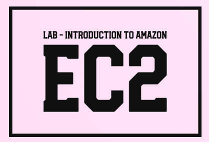

### AWS Skill Builder <a href="../../">aws_skill_builder   </a>
### Training Category: <a href="../../self_paced_lab">self_paced_lab</a>
### Software/Subject: aws   
### Course: <a href="./">curso_spl_019 (Lab - Introduction to Amazon EC2)   </a>

#### Parceria da AWS com a Escola da Nuvem (EDN)   

---

### Theme:
- Cloud Computing

### Used Tools:
- Operating System (OS): 
  - Linux   
  - Windows 11   
- Linux Distribution:
  - Amazon Linux   
- Cloud:
  - Amazon Web Services (AWS)   
- Cloud Services:
  - Amazon Elastic Block Store (EBS)   
  - Amazon Elastic Compute Cloud (EC2)   
  - Amazon Virtual Private Cloud (VPC)   
  - Google Drive   
- Language:
  - HTML   
  - Markdown   
- Integrated Development Environment (IDE) and Text Editor:
  - Visual Studio Code (VS Code)   
- Versioning: 
  - Git   
- Repository:
  - GitHub   
- Command Line Interpreter (CLI):
  - Bash e Sh   
- Server and Databases:
  - Apache HTTP Server (httpd)   

---

<a name="item0"><h3>Course Strcuture:</h3></a>
1. Lab - Introduction to Amazon EC2<br>
1.1 <a href="#item01.1">Tarefa 1: Inicie sua instância do Amazon EC2</a><br>
1.2 <a href="#item01.2">Tarefa 2: Monitore sua instância</a><br>
1.3 <a href="#item01.3">Tarefa 3: Atualize seu grupo de segurança e acesse o servidor da Web</a><br>
1.4 <a href="#item01.4">Tarefa 4: Redimensione sua instância: Tipo de instância e volume EBS</a><br>
1.5 <a href="#item01.5">Tarefa 5: Proteção de Término de Teste</a><br>

---

### Objective:
Este laboratório teve como objetivo proporcionar uma visão geral do serviço **Amazon EC2**. Durante a prática, foi provisionada uma instância EC2 com o servidor web **Apache HTTP (Httpd)** e a proteção contra encerramento ativada. Foram realizadas ações de monitoramento na instância, além da configuração de uma regra de entrada no grupo de segurança para permitir o acesso HTTP. A instância foi redimensionada verticalmente para ajuste de capacidade. Por fim, a proteção contra encerramento foi testada e desativada, permitindo o encerramento bem-sucedido da instância.

### Structure:
A estrutura do curso é formada por:
- Este arquivo de README.
- A pasta `0-aux`, pasta auxiliar com imagens utilizadas na construção desse arquivo de README.

### Development:
Este curso foi um laboratório prático realizado na plataforma **AWS Skill Builder**, cuja subscrição foi devida a uma parceria entre a **AWS** e a **Escola da Nuvem**. A infraestrutura de cloud utilizada foi fornecida através de um sandbox do **AWS Skill Builder** que possibilitava acesso ao console da **AWS**. Contudo foi necessário seguir estritamente as orientações determinadas no laboratório. Dessa maneira, a forma de interação com os recursos da cloud foram sempre através do console fornecido pelo sandbox, a não ser em casos em que o próprio laboratório instruiu para utilização de outras ferramentas de interação como **AWS CLI** ou **AWS SDK**.

O laboratório do **AWS Skill Builder** tem o foco em executar apenas o que é orientado no escopo, todos os recursos ou serviços que podem ser requisitados adicionalmente já vêm provisionados por padrão pelo laboratório. Ao iniciar o laboratório, o sandbox do **AWS Skill Builder** provisiona diversos recursos e serviços para o funcionamento através de uma ou mais pilhas do **AWS CloudFormation** de forma automática. 

O acesso ao console no sandbox do **AWS Skill Builder** é realizado por meio de uma identidade federada. O Skill Builder funciona como um provedor de identidade (IdP), autenticando o usuário e vinculando-o a uma role do **AWS IAM** provisionada automaticamente por uma das pilhas do CloudFormation. Essa role concede permissões temporárias e mínimas necessárias para a execução do laboratório, garantindo segurança e controle sobre os recursos utilizados. O laboratório, por padrão, determina a região a ser utilizada e ela não deve ser alterada, somente se o próprio laboratório indicar. As configurações não informadas no laboratório devem ser sempre mantidas como padrão que estão.

<a name="item01.1"><h4>Tarefa 1: Inicie sua instância do Amazon EC2</h4></a>[Back to summary](#item0)

A primeira tarefa deste laboratório consistiu em provisionar uma instância com proteção contra encerramento ativada e utilização de um script no user data (dados do usuário) para instalação de um servidor web. A configuração da instância foi definida da seguinte forma:
- Tag de Nome: `Web Server`.
- Amazon Machine Image (AMI): `Amazon Linux 2 AMI` (`ami-09245d5773578a1d6`). Este laboratório só funcionava com uma AMI do Amazon Linux 2. Uma Amazon Machine Image (AMI) fornece as informações necessárias para iniciar uma instância, que é um servidor virtual na nuvem. Uma AMI inclui:
    - Um modelo para o volume raiz da instância (por exemplo, um sistema operacional ou um servidor de aplicativos com aplicativos).
    - Permissões de inicialização que controlam quais contas da AWS podem usar a AMI para iniciar instâncias. 
    - Um mapeamento de dispositivo de bloco que especifica os volumes a serem anexados à instância quando ela é iniciada
- Tipo de instância: `t3.micro`. O **Amazon EC2** fornece uma ampla seleção de tipos de instância otimizados para atender a diferentes casos de uso. Os tipos de instância compreendem combinações variadas de CPU, memória, armazenamento e capacidade de rede e oferecem a flexibilidade de escolher a combinação apropriada de recursos para os aplicativos. Cada tipo de instância inclui um ou mais tamanhos de instância, permitindo que os recursos sejam dimensionados para os requisitos da carga de trabalho de destino. Um tipo de instância t3.micro tem 2 CPUs virtuais e 1 GiB de memória.
- Par de chaves (login): foi selecionada a opção `Proceed without a key pair (Not recommended)` (Continuar sem um par de chaves (não recomendado)). O **Amazon EC2** usa criptografia de chave pública para criptografar e descriptografar informações de login. Para fazer login na instância, é necessário criar um par de chaves, especificar o nome do par de chaves ao iniciar a instância e fornecer a chave privada ao se conectar à instância. Neste laboratório, não foi realizado login na instância, portanto não precisou de um par de chaves.
- Na seção `Network settings` foram definidas as seguintes configurações:
    - VPC - obrigatório: `Lab VPC`. A Rede indicava em qual Virtual Private Cloud (VPC) desejava-se iniciar a instância. É possível ter várias redes diferentes para os ambientes de desenvolvimento, teste e produção. A VPC `Lab VPC` foi criado usando um modelo do CloudFormation durante o processo de configuração do laboratório. Esta VPC incluía duas sub-redes públicas em duas Availability Zones (AZ) diferentes.
    - Sub-rede: `Public Subnet 1`.
    - Na seção Firewall (grupos de segurança) foi configurado o seguinte:
        - Nome do grupo de segurança - obrigatório: `Web Server security group`. Um grupo de segurança atua como um firewall virtual que controla o tráfego para uma ou mais instâncias. Ao iniciar uma instância, um ou mais grupos de segurança são associados à instância. Regras são adicionadas a cada grupo de segurança que permitem tráfego de ou para as instâncias associadas. É possível modificar as regras para um grupo de segurança a qualquer momento. As novas regras são aplicadas automaticamente a todas as instâncias associadas ao grupo de segurança.
        - Descrição - obrigatório: `Security group for my web server`.
        - A regra de entrada no security group que permitia conexão SSH foi removida, já que a instância não seria acessada.
- A configuração de armazenamento foi mantido o padrão que era um volume do **Amazon Elastic Block Store (EBS)** com 8 GB de tamanho e tipo `gp3`. Este era o volume raiz (também conhecido como volume 'boot'). O **Amazon EC2** armazena dados em um disco virtual conectado à rede chamado Elastic Block Store.
- A  seção Detalhes avançados foi expandida e a `Termination protection` (Proteção de término) foi habilitada. Quando uma instância do **Amazon EC2** não é mais necessária, ela pode ser encerrada, o que significa que a instância é interrompida e seus recursos são liberados. Uma instância encerrada não pode ser iniciada novamente. Se quiser evitar que a instância seja encerrada acidentalmente, é possível habilitar a proteção de encerramento para a instância, o que impede que ela seja encerrada.
- No campo Dados do usuário - opcional foi passado o script **Bash** abaixo. Ao iniciar uma instância, é possível passar dados do usuário para ela, que podem ser usados ​​para executar tarefas comuns de configuração automatizada e até mesmo executar scripts após a inicialização da instância. Como a instância estava executando o **Amazon Linux**, foi fornecido um script de shell que era executado quando a instância era iniciada.

```bash
#!/bin/bash
yum -y install httpd
systemctl enable httpd
systemctl start httpd
echo '<html><h1>Hello From Your Web Server!</h1></html>' > /var/www/html/index.html
```

O script fazia as seguintes ações: instalava um servidor web **Apache HTTP (Httpd)**; configurava o servidor web para iniciar automaticamente na inicialização; ativava o servidor web; e por fim, criava uma página web simples substituíndo o arquivo `index.html` padrão do Apache por um outro arquivo HTML com apenas a seguinte frase `Hello From Your Web Server!`.

Ao executar a instância, ela podia aparecer em um estado pendente, o que significava que estava sendo iniciada. Em seguida, ela mudava para running, o que indicava que a instância começou a ser inicializada. A imagem 01 exibe a instância provisionada com sucesso, enquanto a imagem 02 mostra a tentativa de acesso ao servidor web Apache acessado pelo navegador da máquina física **Windows**. Para acessar o servidor era necessário copiar o IP ou DNS público da instância e utilizá-lo no navegador. Como nenhuma porta era definida, o navegador usava a porta padrão que é a `80`, onde roda o protocolo HTTP. Entretanto, isso não funcionou pois não havia regras no grupo de segurança vinculado a está instância que permitia acesso na porta `80`.

<div align="Center"><figure>
    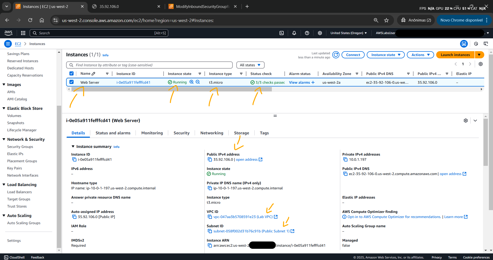<br>
    <figcaption>Imagem 01.</figcaption>
</figure></div><br>

<div align="Center"><figure>
    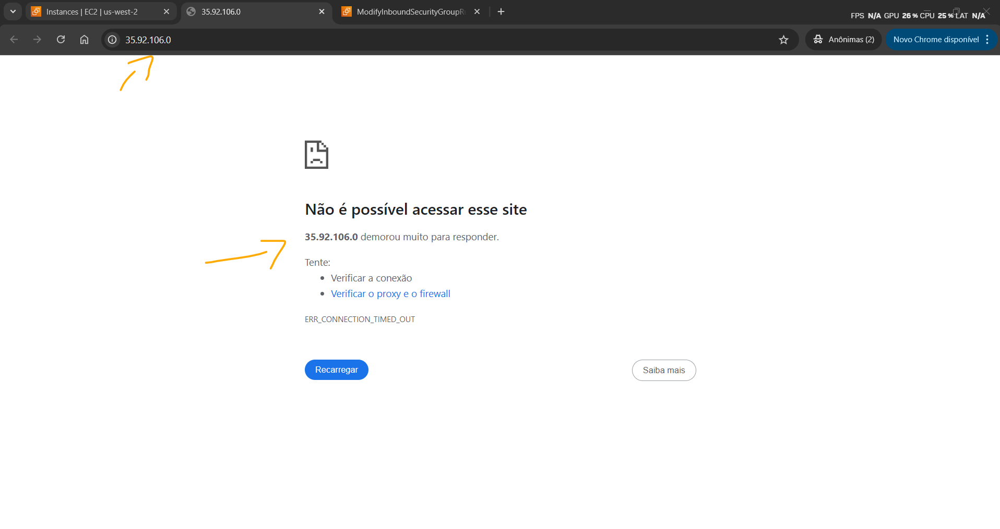<br>
    <figcaption>Imagem 02.</figcaption>
</figure></div><br>

<a name="item01.2"><h4>Tarefa 2: Monitore sua instância</h4></a>[Back to summary](#item0)

O monitoramento é uma parte importante para manter a confiabilidade, a disponibilidade e o desempenho das instâncias do **Amazon EC2** e das soluções na **AWS**. Dessa forma, alguns recursos de monitoramento dessa instância foram utilizados. Primeiro, a instância foi selecionada e a aba `Status e alarmes` foi acessada. Com o monitoramento de status de instância, era possível determinar rapidamente se o **Amazon EC2** detectou algum problema que pudesse impedir que as instâncias executassem aplicativos. O **Amazon EC2** realizava verificações automatizadas em cada instância do EC2 em execução para identificar problemas de hardware e software. Na imagem 03 é visualizado que as verificações de `System status checks` (Acessibilidade do sistema), `Instance status checks` (Acessibilidade da instância) e `Attached EBS status checks` (Acessibilidade do EBS anexado) foram aprovadas.

<div align="Center"><figure>
    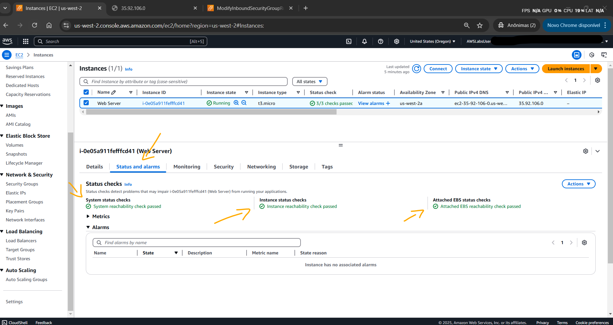<br>
    <figcaption>Imagem 03.</figcaption>
</figure></div><br>

Na aba monitoramento, as métricas do **Amazon CloudWatch** da instância eram exibidas, conforme imagem 04. Atualmente, não haviam muitas métricas para exibir porque a instância tinha sido lançada recentemente. É possível escolher um gráfico para ver uma visualização expandida. O **Amazon EC2** envia métricas para o **Amazon CloudWatch** para suas instâncias do EC2. O monitoramento básico (cinco minutos) é habilitado por padrão, mas pode ser habilitado o monitoramento detalhado (um minuto).

<div align="Center"><figure>
    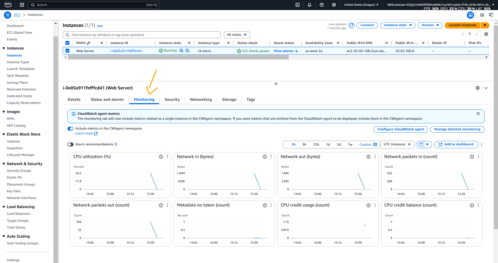<br>
    <figcaption>Imagem 04.</figcaption>
</figure></div><br>

A opção `Ações` no menu (canto superior direito do console) foi selecionada e as opções `Monitor and troubleshoot` (Monitorar e solucionar problemas) e `Get system log` (Obter log do sistema)` foram escolhidas. O resultado é apresentado na imagem 05 abaixo e descrevia a saída do console de log do sistema para a instância do **Amazon EC2**. Se não for visualizado um log do sistema, é necessário aguardar alguns minutos e atualizar a tela de log até que ele apareça. O Log do Sistema exibe a saída do console da instância, que é uma ferramenta valiosa para diagnóstico de problemas. É especialmente útil para solucionar problemas de kernel e problemas de configuração de serviço que podem fazer com que uma instância seja encerrada ou se torne inacessível antes que seu daemon SSH possa ser iniciado.

<div align="Center"><figure>
    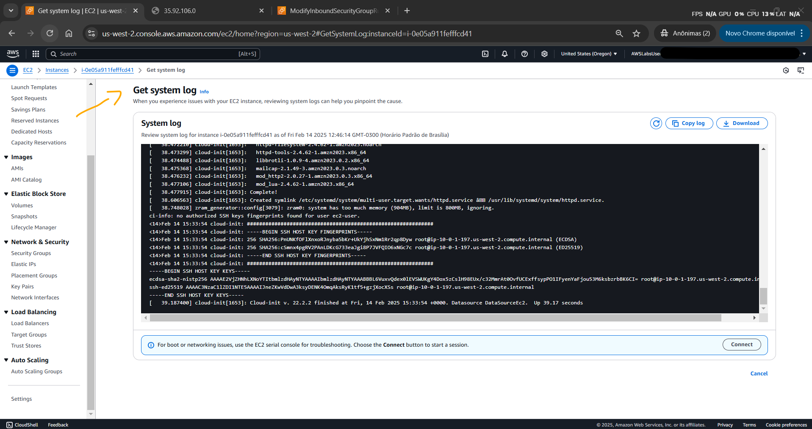<br>
    <figcaption>Imagem 05.</figcaption>
</figure></div><br>

Ao percorrer a saída até o final foi observado, na imagem 06, que o pacote httpd foi instalado a partir dos dados do usuário que tinha sido adicionado quando a instância foi provisionada.

<div align="Center"><figure>
    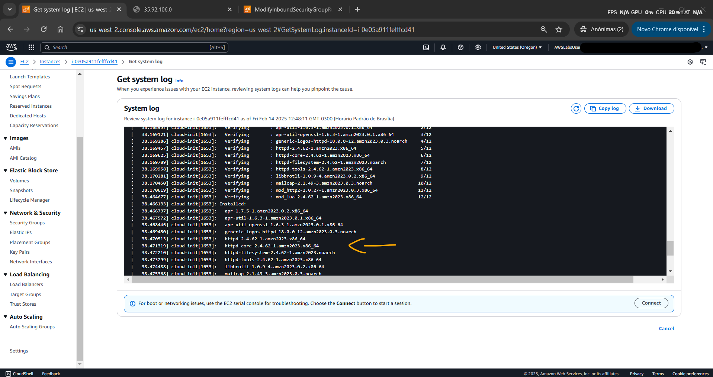<br>
    <figcaption>Imagem 06.</figcaption>
</figure></div><br>

A opção selecionada foi cancelada e uma outra opção foi aberta, selecionando agora `Monitor and troubleshoot` (Monitorar e solucionar problemas) e `Get instance screenshot` (Obter captura de tela da instância). O resultado obtido, conforme imagem 07, mostrava como ficaria o console da instância do **Amazon EC2** se uma tela fosse anexada a ele. Quando não for possível acessar a instância via SSH ou RDP, pode ser utilizado uma captura de tela da instância para visualizá-la como uma imagem. Isso fornece visibilidade quanto ao status da instância e permite uma solução de problemas mais rápida.

<div align="Center"><figure>
    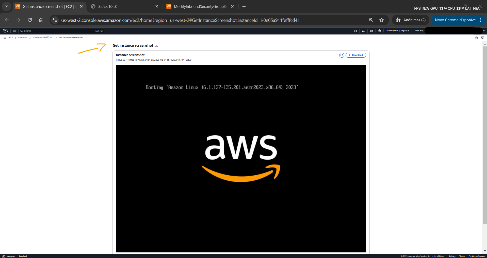<br>
    <figcaption>Imagem 07.</figcaption>
</figure></div><br>

<a name="item01.3"><h4>Tarefa 3: Atualize seu grupo de segurança e acesse o servidor da Web</h4></a>[Back to summary](#item0)

Como visto na tarefa 1, não foi possível acessar a página web do servidor Apache porque uma regra de entrada permitindo a conexão `SSH`, ou seja, na porta `80`, não tinha sido criada. Portanto, foi necessário construir essa regra no security group vinculado a instância, liberando o tráfego na porta `80` de qualquer IP (`0.0.0.0/0`). Entretanto, liberar o acesso a qualquer faixa de IP não é um prática recomendada para cargas de trabalho de produção. A imagem 08 mostra o grupo de segurança com a regra adicionada e a imagem 09 evidencia que agora foi possível acessar a página web do servidor **Apache HTTP (Httpd)**.

<div align="Center"><figure>
    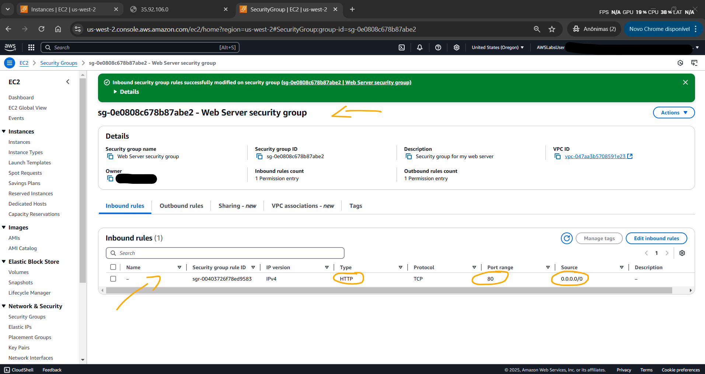<br>
    <figcaption>Imagem 08.</figcaption>
</figure></div><br>

<div align="Center"><figure>
    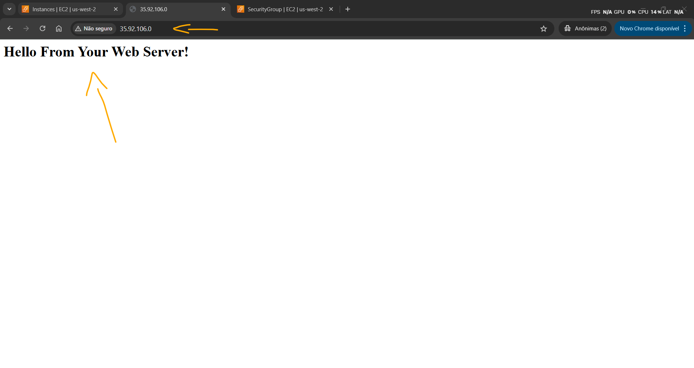<br>
    <figcaption>Imagem 09.</figcaption>
</figure></div><br>

<a name="item01.4"><h4>Tarefa 4: Redimensione sua instância: Tipo de instância e volume EBS</h4></a>[Back to summary](#item0)

Conforme as necessidades mudam, a instância pode estar sendo superutilizada (muito pequena) ou subutilizada (muito grande). Se for o caso, é possível alterar o tipo de instância ou o tamanho de um disco. Nesta tarefa, para que as duas alterações fossem feitas era preciso primeiro parar a instância. Quando uma instância é parada, ela é desligada e não há cobranças por ela, porém a cobrança de armazenamento para volumes **Amazon EBS** anexados permanece. Sendo assim, a instância `Web Server` foi interrompida, o tipo de instância foi modificado de `t3.micro` para `t3.small` e o tamanho do volume EBS foi alterado de `8 GiB` para `10 GiB`. Em seguida, a instância foi iniciada. A imagem 10 mostra o dimensionamento vertical feito na instância.

<div align="Center"><figure>
    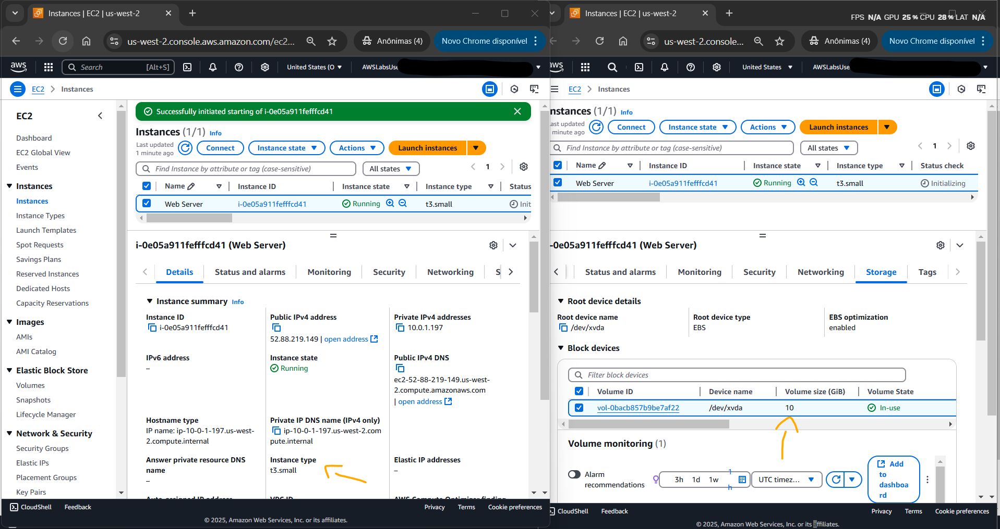<br>
    <figcaption>Imagem 10.</figcaption>
</figure></div><br>

<a name="item01.5"><h4>Tarefa 5: Proteção de Término de Teste</h4></a>[Back to summary](#item0)

Uma instância pode ser excluída quando não for mais necessária, não sendo possível se conectar ou reiniciá-la após ter sido encerrada. Isso é conhecido como encerramento da instância. Nesta última tarefa, o objetivo foi encerrar a instância e verificar o funcionamento da proteção contra encerramento definida na configuração da instância. A imagem 11 mostra que ao tentar encerrar a instância foi obtido um erro. Isso aconteceu porque a proteção contra encerramento tinha sido habilitada. Para que fosse possível de fato encerrar a instância era preciso primeiro desabilitar essa proteção. Após desabilitá-la a instância foi encerrada com sucesso, conforme imagem 12.

<div align="Center"><figure>
    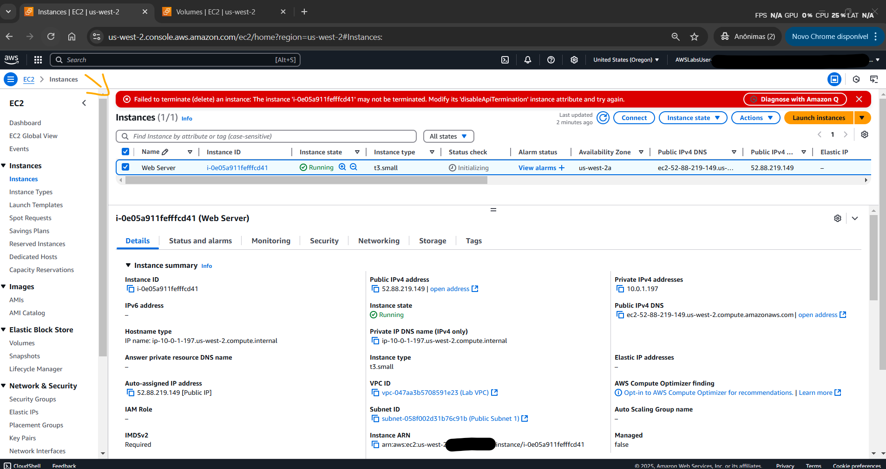<br>
    <figcaption>Imagem 11.</figcaption>
</figure></div><br>

<div align="Center"><figure>
    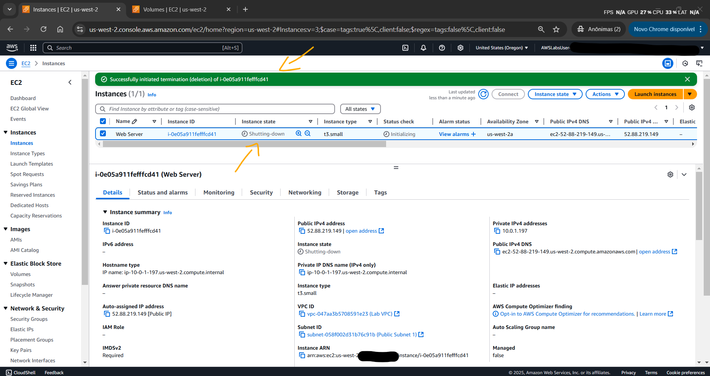<br>
    <figcaption>Imagem 12.</figcaption>
</figure></div><br>