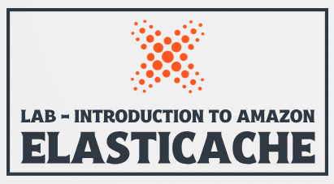
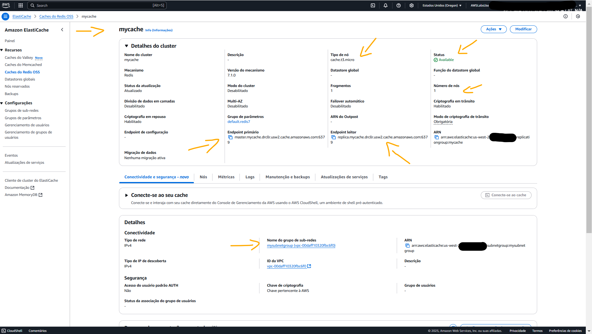
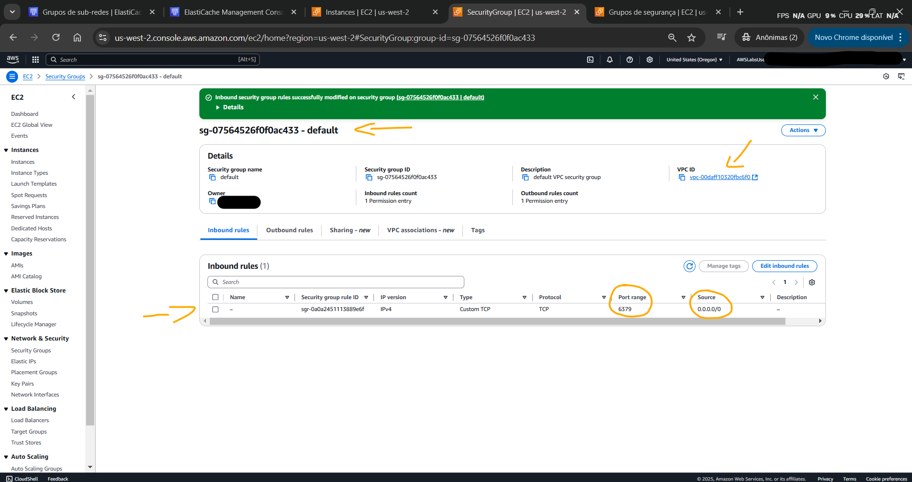
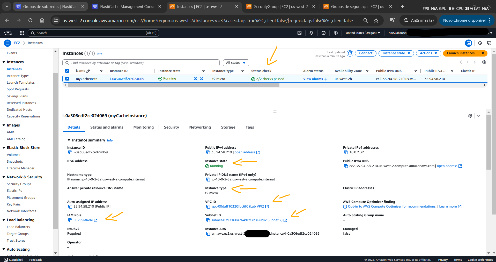
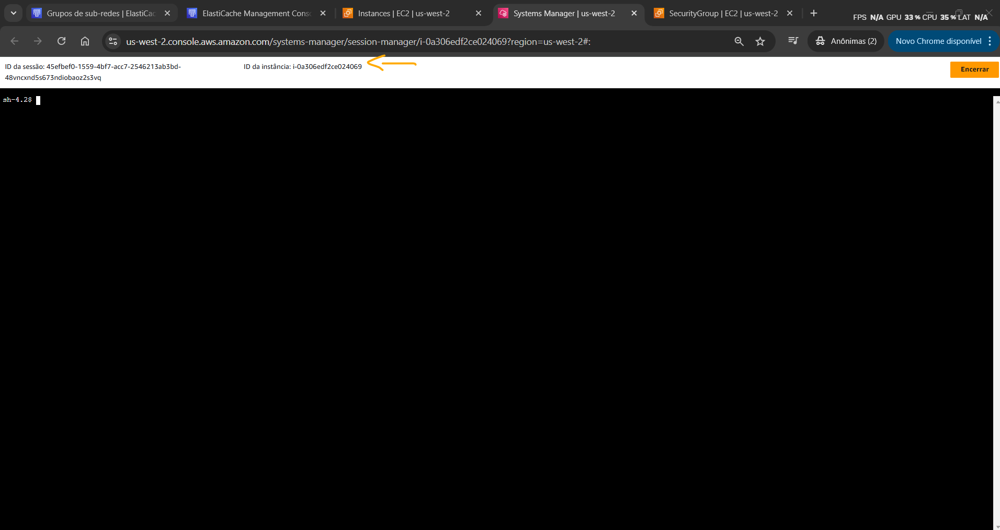
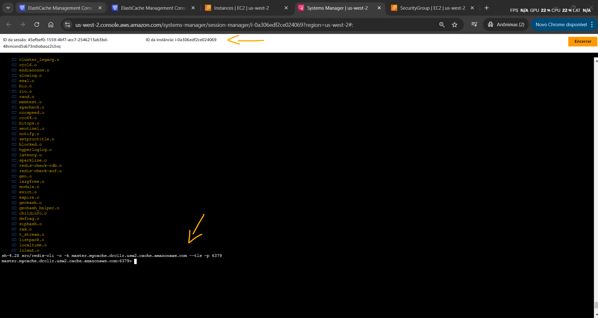
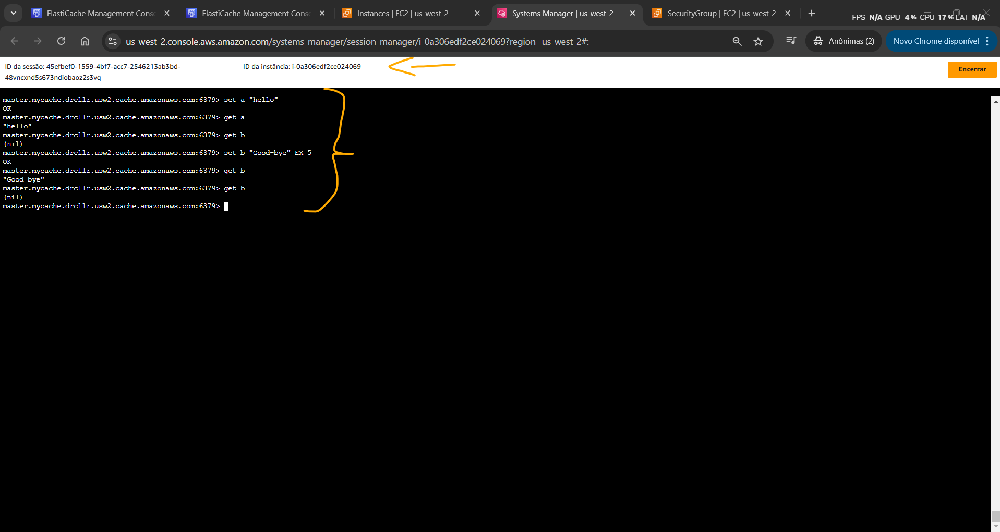
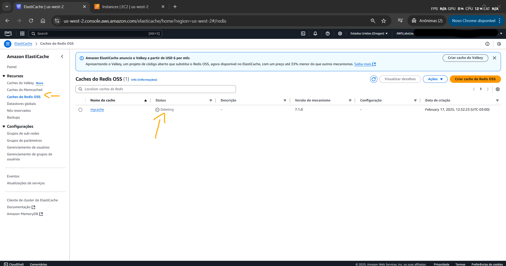

# Lab - Introduction to Amazon ElastiCache   

### AWS Skill Builder <a href="../../">aws_skill_builder   </a>
### Training Category: <a href="../../self_paced_lab">self_paced_lab</a>
### Software/Subject: aws   
### Course: <a href="./">curso_spl_021 (Lab - Introduction to Amazon ElastiCache)   </a>

#### Parceria da AWS com a Escola da Nuvem (EDN)   

---

### Theme:
- Cloud Computing
- Data

### Used Tools:
- Operating System (OS): 
  - Linux   
  - Windows 11   
- Linux Distribution:
  - Amazon Linux   
- Cloud:
  - Amazon Web Services (AWS)   
- Cloud Services:
  - Amazon ElastiCache   
  - Amazon Elastic Compute Cloud (EC2)   
  - Google Drive   
- Language:
  - HTML   
  - Markdown   
- Integrated Development Environment (IDE) and Text Editor:
  - Visual Studio Code (VS Code)   
- Compiler:
  - GNU Compiler Collection (GCC)   
- Versioning: 
  - Git   
- Repository:
  - GitHub   
- Command Line Interpreter (CLI):
  - Bash e Sh   
  - Remote Dictionary Server Command Line Interface (Redis CLI)   
- Server and Databases:
  - Remote Dictionary Server (Redis)   
- Network:
  - OpenSSL   

---

<a name="item0"><h3>Course Strcuture:</h3></a>
1. Lab - Introduction to Amazon ElastiCache<br>
1.1 <a href="#item01.1">Tarefa 1: Criar um cluster do Amazon ElastiCache</a><br>
1.2 <a href="#item01.2">Tarefa 2: Autorizar acesso ao seu cluster Amazon ElastiCache</a><br>
1.3 <a href="#item01.3">Tarefa 3: Obtenha seu ponto de extremidade ElastiCache</a><br>
1.4 <a href="#item01.4">Tarefa 4: Inicie uma instância do Amazon EC2 para acessar seu cluster do ElastiCache</a><br>
1.5 <a href="#item01.5">Tarefa 5: Conecte-se à sua instância EC2</a><br>
1.6 <a href="#item01.6">Tarefa 6: Conecte-se ao seu cluster ElastiCache</a><br>
1.7 <a href="#item01.7">Tarefa 7: Teste seu cluster ElastiCache</a><br>
1.8 <a href="#item01.8">Tarefa 8: Excluir seu cluster do Amazon ElastiCache</a><br>

---

### Objective:
O objetivo deste laboratório foi provisionar um cluster do **Amazon ElastiCache** para **Remote Dictionary Server (Redis)** e se conectar a ele a partir de uma instância do **Amazon Elastic Compute Cloud (EC2)** para executar comandos. Por fim, remover o cluster criado.

### Structure:
A estrutura do curso é formada por:
- Este arquivo de README.
- A pasta `0-aux`, pasta auxiliar com imagens utilizadas na construção desse arquivo de README.

### Development:
Este curso foi um laboratório prático realizado na plataforma **AWS Skill Builder**, cuja subscrição foi devida a uma parceria entre a **AWS** e a **Escola da Nuvem**. A infraestrutura de cloud utilizada foi fornecida através de um sandbox do **AWS Skill Builder** que possibilitava acesso ao console da **AWS**. Contudo foi necessário seguir estritamente as orientações determinadas no laboratório. Dessa maneira, a forma de interação com os recursos da cloud foram sempre através do console fornecido pelo sandbox, a não ser em casos em que o próprio laboratório instruiu para utilização de outras ferramentas de interação como **AWS CLI** ou **AWS SDK**.

O laboratório do **AWS Skill Builder** tem o foco em executar apenas o que é orientado no escopo, todos os recursos ou serviços que podem ser requisitados adicionalmente já vêm provisionados por padrão pelo laboratório. Ao iniciar o laboratório, o sandbox do **AWS Skill Builder** provisiona diversos recursos e serviços para o funcionamento através de uma ou mais pilhas do **AWS CloudFormation** de forma automática. 

O acesso ao console no sandbox do **AWS Skill Builder** é realizado por meio de uma identidade federada. O Skill Builder funciona como um provedor de identidade (IdP), autenticando o usuário e vinculando-o a uma role do **AWS IAM** provisionada automaticamente por uma das pilhas do CloudFormation. Essa role concede permissões temporárias e mínimas necessárias para a execução do laboratório, garantindo segurança e controle sobre os recursos utilizados. O laboratório, por padrão, determina a região a ser utilizada e ela não deve ser alterada, somente se o próprio laboratório indicar. As configurações não informadas no laboratório devem ser sempre mantidas como padrão que estão.

<a name="item01.1"><h4>Tarefa 1: Criar um cluster do Amazon ElastiCache</h4></a>[Back to summary](#item0)

A tarefa inicial foi provisionar um cluster do **Amazon ElastiCache** para **Remote Dictionary Server (Redis)** na **AWS**. No ElastiCache para Redis, existem dois principais tipos de implementação:
- Redis OSS: Baseado na versão de código aberto do **Redis**, sem otimizações adicionais da **AWS**.
- Redis com memória gerenciada: Uma versão aprimorada pela **AWS**, com melhor desempenho e resiliência.

Neste caso foi optado pelo tipo de implementação `Redis OSS` com as seguintes configurações:
- Na seção `Configuration` (Configuração):
    - `Deployment option` (Opção Implantação): `Design your own cache` (Projetar seu próprio cache).
    - `Creation method` (Método de criação): `Cluster cache` (Cache de cluster).
- Na seção de `Cluster Informations` (informações do Cluster):
    - `Name` (Nome): `mycache`.
- Na seção `Cluster settings` (Configurações do cluster):
    - `Node type` (Tipo de nó): `cache.t2.micro` ou `cache.t3.micro`.
    - `Number of replicas` (Número de réplicas): `0`.
- Na seção `Connectivity` (Conectividade):
    - `Subnet groups` (Grupos de sub-rede): `Create a new subnet group` (Criar um novo grupo de sub-rede).
        - `Name` (Nome): `mysubnetgroup1`.
        - `VPC ID`: foi passada o ID da VPC `LabVPC`, que era `vpc-00daff10320fbc6f0 (Lab VPC)`. Esse ID também estava nos parâmetros das instruções desse laboratório.

Com todas as outras configurações padrões, o cluster foi provisionado. A informação `Status` mostrava o estado do cluster que iniciou como `Creating` até ficar `Available`, conforme imagem 01. O tempo de criação do cluster é um pouco alto, então pode ser que demore.

<div align="Center"><figure>
    <br>
    <figcaption>Imagem 01.</figcaption>
</figure></div><br>

<a name="item01.2"><h4>Tarefa 2: Autorizar acesso ao seu cluster Amazon ElastiCache</h4></a>[Back to summary](#item0)

Para conectar-se ao cluster do **Amazon ElastiCache** a partir de uma instância do **Amazon EC2** que esteja em execução no mesmo **Amazon VPC**, é necessário conceder acesso de entrada de rede ao cluster. Nesta tarefa, o objetivo foi conceder acesso de entrada de rede ao cluster. Para isso uma regra de entrada liberando a porta `6379` (porta padrão do **Redis**) para todos os intervalos de IP (`0.0.0.0/0`) foi adicionada ao único grupo de segurança do `LabVPC`, cujo ID era `sg-07564526f0f0ac433`. Todas as demais regras de entrada foram excluídas. A imagem 02 exibe como ficou esse security group.

<div align="Center"><figure>
    <br>
    <figcaption>Imagem 02.</figcaption>
</figure></div><br>

<a name="item01.3"><h4>Tarefa 3: Obtenha seu ponto de extremidade ElastiCache</h4></a>[Back to summary](#item0)

Para conectar-se ao cluster ElastiCache, é necessário saber qual é o endpoint do ElastiCache. Portanto, o cluster do ElastiCache provisionada do nome `mycache` foi selecionado para copiar o endpoint, que era `master.mycache.drcllr.usw2.cache.amazonaws.com:6379` para o primário e `replica.mycache.drcllr.usw2.cache.amazonaws.com:6379` para o leitor. Contudo, o endpoint do único nó desse cluster era `mycache-001.mycache.drcllr.usw2.cache.amazonaws.com:6379`

<a name="item01.4"><h4>Tarefa 4: Inicie uma instância do Amazon EC2 para acessar seu cluster do ElastiCache</h4></a>[Back to summary](#item0)

Na quarta tarefa, o objetivo foi provisionar uma instância do **Amazon EC2** que seria utilizada para acessar o cluster do ElastiCache. Essa instância foi configurada da seguinte forma:
- Tag de Nome: `myCacheInstance`.
- `Amazon Machine Image` (Imagem de máquina da Amazon): foi escolhida a versão mais recente da AMI *Amazon Linux 2* (`ami-000089c8d02060104`).
- `Instance Type` (Tipo de instância): `t2.micro`.
- `Key Pair` (Par de chaves (login)): `Proceed without a key pair` (Prosseguir sem um par de chaves (não recomendado)).
- `Network settings` (Configurações de rede):
    - `VPC`: `LabVPC`.
    - `Subnets`: qualquer uma das duas sub-redes públicas existentes nessa VPC.
    - `Firewall (security group)` (Firewall (grupos de segurança)): o único grupo de segurança existente no `LabVPC` foi selecionado (`sg-07564526f0f0ac433`).
- Na seção `Storage Management` (Configurar armazenamento): foi mantida a configuração padrão, que era um volume do **Amazon Elastic Block Store (EBS)** com `8` GiB do tipo `gp2` (General Purpose SSD).
- A seção `Advanced Details` (Detalhes avançados) foi expandida e configurado:  
    - `IAM Instance Profile` (Perfil da instância do IAM): o perfil de instância de nome `EC2InstProfile` foi escolhido. Esse perfil utilizava uma role de mesmo nome, e ambos tinham sido criados pelas pilhas do CloudFormation ao iniciar o laboratório. Essa role tinha políticas que permitia a instância do EC2 interagir com o ElastiCache.

A imagem 03 evidencia a instância do **Amazon EC2** provisionada com sucesso.

<div align="Center"><figure>
    <br>
    <figcaption>Imagem 03.</figcaption>
</figure></div><br>

<a name="item01.5"><h4>Tarefa 5: Conecte-se à sua instância EC2</h4></a>[Back to summary](#item0)

Nesta tarefa, o objetivo foi se conectar à instância do **Amazon EC2** utilizando o recurso *Session Manager* do **AWS Systems Manager (SSM)**. O *Session Manager* é um recurso totalmente gerenciado do **AWS Systems Manager** que é utilizado para gerenciar as instâncias do **Amazon EC2** por meio de um shell interativo baseado em navegador de um clique ou por meio da **AWS Command Line Interface (CLI)**. É possível usar o *Session Manager* para iniciar uma sessão com uma instância do **Amazon EC2** em sua conta. Após iniciar a sessão, é possível executar comandos **Bash** como seria feito por meio de qualquer outro tipo de conexão. Com o **Session Manager**, é possível se conectar a instâncias do **Amazon EC2** sem precisar expor a porta SSH no firewall ou no grupo de segurança do **Amazon VPC**. Sendo assim, não foi preciso adicionar uma regra no grupo de segurança vinculado a instância liberando a porta `22`, onde o protocolo `SSH` opera. Também não foi preciso de arquivos pares de chaves, pois a autenticação é feita pela **AWS**. A imagem 04 mostra a instância acessada remotamente pelo console da **AWS**.

<div align="Center"><figure>
    <br>
    <figcaption>Imagem 04.</figcaption>
</figure></div><br>

<a name="item01.6"><h4>Tarefa 6: Conecte-se ao seu cluster ElastiCache</h4></a>[Back to summary](#item0)

De dentro da instância, o objetivo agora foi se conectar ao cluster do **Amazon ElastiCache** provisionado. Para isso foi necessário baixar e instalar o **Redis-CLI**, que é a interface de linha de comando do **Redis**. Contudo, um pré-requisito do **Redis-CLI** é o GCC, que também foi instalado. O **GNU Compiler Collection (GCC)** é um conjunto de compiladores de código aberto para diversas linguagens de programação, como **C**, **C++**, **Fortran** e **Golang**. Além disso, o software **OpenSSL** também foi instalado. Os comandos abaixo instalaram esses softwares na instância.

```bash
sudo yum install -y gcc
sudo yum install -y openssl-devel
```

Para instalação do **Redis-CLI** foi utilizado o comando a seguir:

```bash
cd ~
wget http://download.redis.io/redis-stable.tar.gz
tar xvzf redis-stable.tar.gz
cd redis-stable
make BUILD_TLS=yes
```

Com a CLI do **Redis** instalada, o comando `src/redis-cli -c -h master.mycache.drcllr.usw2.cache.amazonaws.com --tls -p 6379` foi executado, passando o endpoint primário do cluster do **Amazon ElastiCache** provisionado. A imagem 05 evidencia a conexão da instância do **Amazon EC2** ao nó do cluster do ElastiCache.

<div align="Center"><figure>
    <br>
    <figcaption>Imagem 05.</figcaption>
</figure></div><br>

<a name="item01.7"><h4>Tarefa 7: Teste seu cluster ElastiCache</h4></a>[Back to summary](#item0)

A sétima tarefa consistiu em executar comandos para interagir com o cluster o ElastiCache. Os comandos listado abaixo foram os executados e ilustrados na imagem 06:
- `set a "hello"`: Este comando definia a chave `a` com um valor de string e sem expiração.
- `get a`: Este comando obtinha o valor de `a`.
- `get b`: Este comando tentava obter o valor de `b`, mas como não estava no cache, ele retorna `nil`.
- `set b "Good-bye" EX 5`: Este comando definia o valor de `b` para “Good-bye” por 5 segundos. Após 5 segundos, `b` não teria mais valor.
- `quit`: Este comando fechava a conexão com o cluster **Redis**.

<div align="Center"><figure>
    <br>
    <figcaption>Imagem 06.</figcaption>
</figure></div><br>

<a name="item01.8"><h4>Tarefa 8: Excluir seu cluster do Amazon ElastiCache</h4></a>[Back to summary](#item0)

A última tarefa teve como objetivo a exclusão do cluster provisionado no **Amazon ElastiCache**. Ao abrir a janela de exclusão foi definido que nenhum backup seria criado e passado o nome do cluster `mycache`. O `Status` modificou para `Deleting` até ser removido por completo, conforme mostrado na imagem 07.

<div align="Center"><figure>
    <br>
    <figcaption>Imagem 07.</figcaption>
</figure></div><br>