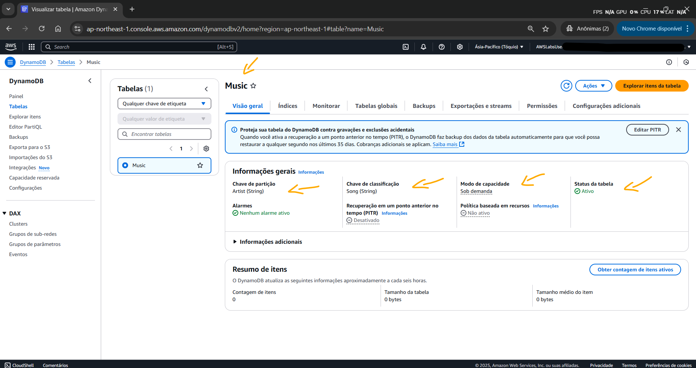
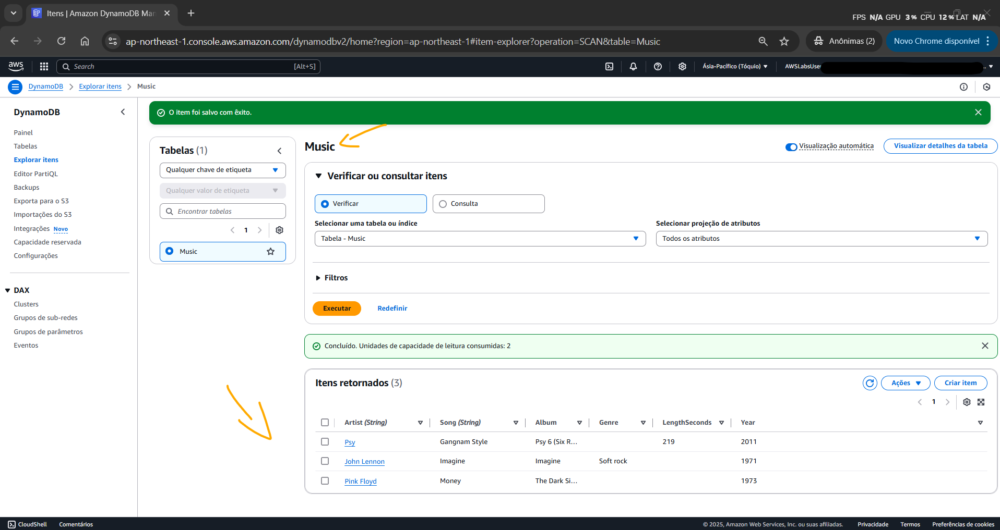
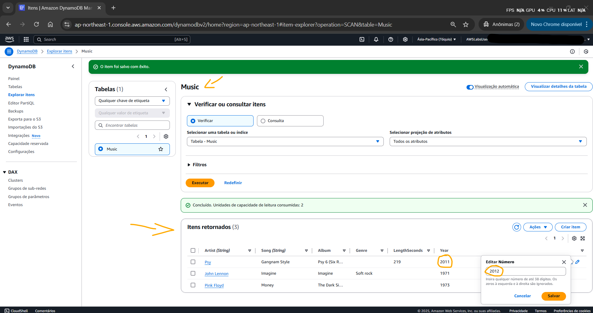
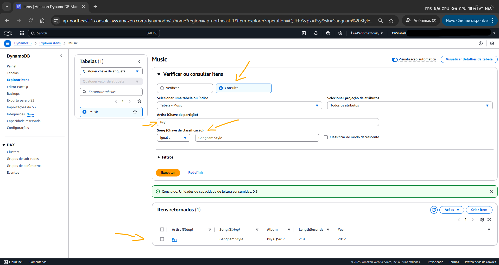
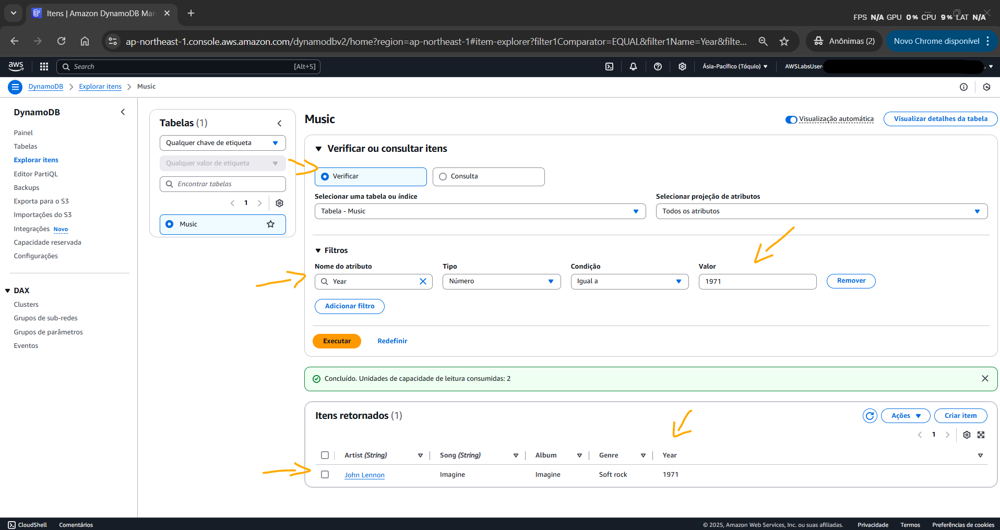
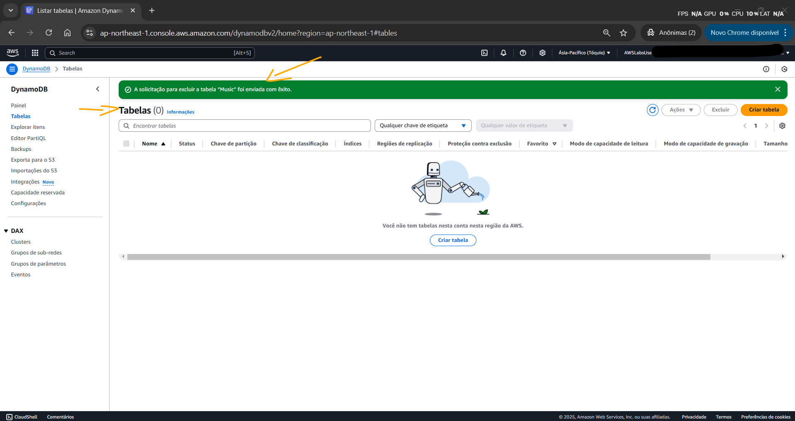

# Lab - Introduction to Amazon DynamoDB   

### AWS Skill Builder <a href="../../">aws_skill_builder   </a>
### Training Category: <a href="../../self_paced_lab">self_paced_lab</a>
### Software/Subject: aws   
### Course: <a href="./">curso_spl_022 (Lab - Introduction to Amazon DynamoDB)   </a>

#### Parceria da AWS com a Escola da Nuvem (EDN)   

---

### Theme:
- Cloud Computing
- Data

### Used Tools:
- Operating System (OS): 
  - Windows 11   
- Cloud:
  - Amazon Web Services (AWS)   
- Cloud Services:
  - Amazon DynamoDB   
  - Google Drive   
- Language:
  - HTML   
  - Markdown   
- Integrated Development Environment (IDE) and Text Editor:
  - Visual Studio Code (VS Code)   
- Versioning: 
  - Git   
- Repository:
  - GitHub   

---

<a name="item0"><h3>Course Strcuture:</h3></a>
1. Lab - Introduction to Amazon DynamoDB 
1.1 <a href="#item01.1">Tarefa 1: Criar uma nova tabela</a> 
1.2 <a href="#item01.2">Tarefa 2: Adicionar dados</a> 
1.3 <a href="#item01.3">Tarefa 3: Modificar um item existente</a> 
1.4 <a href="#item01.4">Tarefa 4: Consultar a tabela</a> 
1.5 <a href="#item01.5">Tarefa 5: Excluir a tabela</a> 

---

### Objective:
O objetivo deste laboratório foi provisionar uma tabela do **Amazon DynamoDB** para armazenar informações sobre uma biblioteca de música, consultar os dados nesta tabela e, finalmente, excluí-la.

### Structure:
A estrutura do curso é formada por:
- Este arquivo de README.
- A pasta `0-aux`, pasta auxiliar com imagens utilizadas na construção desse arquivo de README.

### Development:
Este curso foi um laboratório prático realizado na plataforma **AWS Skill Builder**, cuja subscrição foi devida a uma parceria entre a **AWS** e a **Escola da Nuvem**. A infraestrutura de cloud utilizada foi fornecida através de um sandbox do **AWS Skill Builder** que possibilitava acesso ao console da **AWS**. Contudo foi necessário seguir estritamente as orientações determinadas no laboratório. Dessa maneira, a forma de interação com os recursos da cloud foram sempre através do console fornecido pelo sandbox, a não ser em casos em que o próprio laboratório instruiu para utilização de outras ferramentas de interação como **AWS CLI** ou **AWS SDK**.

O laboratório do **AWS Skill Builder** tem o foco em executar apenas o que é orientado no escopo, todos os recursos ou serviços que podem ser requisitados adicionalmente já vêm provisionados por padrão pelo laboratório. Ao iniciar o laboratório, o sandbox do **AWS Skill Builder** provisiona diversos recursos e serviços para o funcionamento através de uma ou mais pilhas do **AWS CloudFormation** de forma automática. 

O acesso ao console no sandbox do **AWS Skill Builder** é realizado por meio de uma identidade federada. O Skill Builder funciona como um provedor de identidade (IdP), autenticando o usuário e vinculando-o a uma role do **AWS IAM** provisionada automaticamente por uma das pilhas do CloudFormation. Essa role concede permissões temporárias e mínimas necessárias para a execução do laboratório, garantindo segurança e controle sobre os recursos utilizados. O laboratório, por padrão, determina a região a ser utilizada e ela não deve ser alterada, somente se o próprio laboratório indicar. As configurações não informadas no laboratório devem ser sempre mantidas como padrão que estão.

<a name="item01.1"><h4>Tarefa 1: Criar uma nova tabela</h4></a>[Back to summary](#item0)

Na primeira tarefa deste laboratório, foi criada uma tabela do **Amazon DynamoDB** chamada `Music`. No DynamoDB, cada tabela requer uma Chave Primária que é usada para particionar dados entre servidores DynamoDB. Uma tabela também pode ter uma Chave de Classificação. A combinação de Chave Primária e Chave de Classificação identifica exclusivamente cada item em uma tabela do DynamoDB. As configurações da tabela foram as seguintes:
- `Table Name` (Nome da tabela): `Music`.
- `Partition Key` (Chave de partição): `Artist`, cujo tipo de dado era `String`.
- `Chave de classificação - opcional`: `Song`, cujo tipo de dado também era `String`.

A imagem 01 mostra esta tabela provisionada no DynamoDB. Poderia levar um tempo para que a tabela fosse provisionada com sucesso.

<figure>
     
    <figcaption>Imagem 01.</figcaption>
</figure>
 

<a name="item01.2"><h4>Tarefa 2: Adicionar dados</h4></a>[Back to summary](#item0)

Com a tabela criada, o objetivo desta tarefa foi adicionar dados à tabela. Uma tabela é uma coleção de dados sobre um tópico específico, no qual cada tabela contém vários itens. Um item é um grupo de atributos que é exclusivamente identificável entre todos os outros itens. Os itens no DynamoDB são semelhantes em muitas maneiras às linhas em outros sistemas de banco de dados. No DynamoDB, não há limite para o número de itens que pode ser armazenado em uma tabela. Cada item é composto de um ou mais atributos. Um atributo é um elemento de dados fundamental, algo que não precisa ser mais decomposto. Por exemplo, um item em uma tabela `Music` contém atributos como `Song` e `Artist`. Atributos no DynamoDB são colunas semelhantes em outros sistemas de banco de dados, mas cada item (linha) pode ter atributos (colunas) diferentes. Quando é gravado um item em uma tabela do DynamoDB, somente a Chave Primária e a Chave de Classificação (se usadas) são necessárias. Além desses campos, a tabela não requer um esquema. Isso significa que é possível adicionar atributos a um item que podem ser diferentes dos atributos em outros itens.

Dessa forma, a tabela `Music` provisionada foi selecionada e os três seguintes itens foram adicionados com seus respectivos atributos (Nome do atributo; `Data type` (Tipo de dados); `Value` (Valor)):
- Item 1:
    - `Artist`; `String`; `Pink Floyd`.
    - `Song`; `String`; `Money`.
    - `Album`; `String`; `The Dark Side of the Moon`.
    - `Year`; `Number`; `1973`.
- Item 2:
    - `Album`; `String`; `Imagine`.
    - `Year`; `Number`; `1971`.
    - `Artist`; `String`; `John Lennon`.
    - `Song`; `String`; `Imagine`.
    - `Genre`; `String`; `Soft rock`.
- Item 3:
    - `Album`; `String`; `Psy 6 (Six Rules), Part 1`.
    - `Year`; `Number`; `2011`.
    - `Artist`; `String`; `Psy`.
    - `Song`; `String`; `Gangnam Style`.
    - `LengthSeconds`; `Number`; `219`.

A imagem 02 exibe a tabela com os três itens adicionados. Note que cada item teve atributos diferentes ou em quantidades diferentes. Cada item foi adicionado manualmente, entretanto há maneiras mais rápidas de carregar dados no DynamoDB, como usar o **AWS Data Pipeline**, carregar dados programaticamente ou usar uma das ferramentas gratuitas disponíveis na Internet.

<figure>
     
    <figcaption>Imagem 02.</figcaption>
</figure>
 

<a name="item01.3"><h4>Tarefa 3: Modificar um item existente</h4></a>[Back to summary](#item0)

Nesta terceira tarefa, o objetivo foi modificar um dos itens existentes alterando os valores de um dos seus atributos. O item alterado foi o 3, no qual o ano foi modificado de `2011` para `2012`, conforme imagem 03.

<figure>
     
    <figcaption>Imagem 03.</figcaption>
</figure>
 

<a name="item01.4"><h4>Tarefa 4: Consultar a tabela</h4></a>[Back to summary](#item0)

No **Amazon DynamoDB**, existem duas maneiras de consultar uma tabela, uma utilizando o recurso Query e a outra o recurso Scan. Uma operação de consulta (Query) encontra itens com base na Chave Primária e, opcionalmente, na Chave de Classificação. Ela é totalmente indexada, então é executada muito rápido. A Partition Key da tabela `Music` era o atributo `Artist`, enquanto a Classification Key era `Music`. Logo, foi consultado do artista `Psy` a música `Gangnam Style`. Então, a música apareceu rapidamente na lista, conforme mostrado na imagem 04. Uma consulta é a maneira mais eficiente de recuperar dados de uma tabela do DynamoDB.
 
 
<figure>
     
    <figcaption>Imagem 04.</figcaption>
</figure>
 

Alternativamente, é possível escanear (Scan) um item. Isso envolve olhar por todos os itens em uma tabela, sendo menos eficiente e podendo levar um tempo significativo para tabelas maiores. Dessa forma, o Scan foi utilizado para procurar o item que tinha o atributo de ano (`year`) do tipo `Number` igual a `1971`. A imagem 05 mostra a única música listada.

<figure>
     
    <figcaption>Imagem 05.</figcaption>
</figure>
 

<a name="item01.5"><h4>Tarefa 5: Excluir a tabela</h4></a>[Back to summary](#item0)

Por fim, para encerrar o laboratório, a última tarefa teve como objetivo excluir a tabela provisionada. A imagem 06 confirma que a exclusão da tabela `Music` do **Amazon DynamoDB** foi realizada com sucesso

<figure>
     
    <figcaption>Imagem 06.</figcaption>
</figure>
 