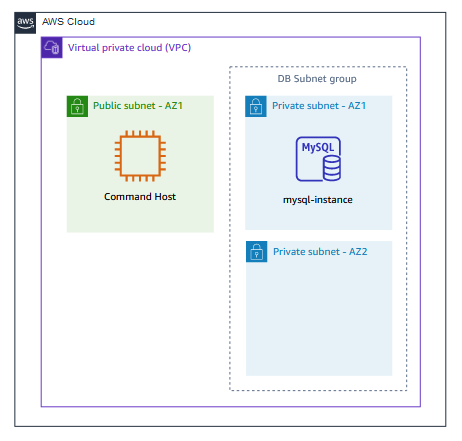
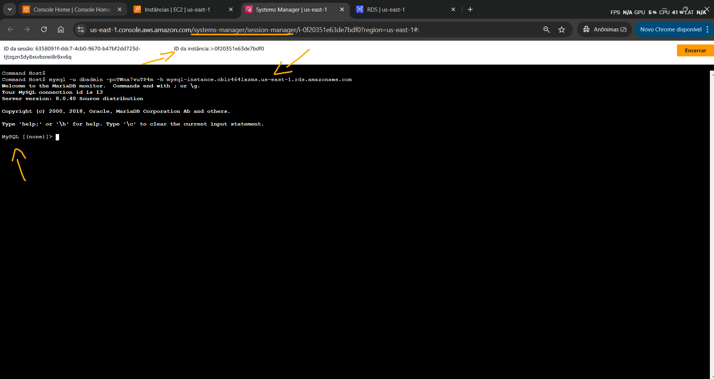
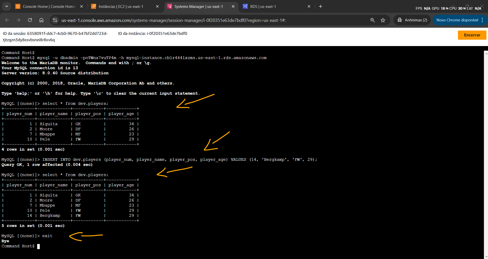

# Lab - Migrating RDS MySQL to Aurora with Read Replica   

### AWS Skill Builder <a href="../../">aws_skill_builder   </a>
### Training Category: <a href="../../self_paced_lab">self_paced_lab</a>
### Software/Subject: aws   
### Course: <a href="./">curso_spl_023 (Lab - Migrating RDS MySQL to Aurora with Read Replica)   </a>

#### Parceria da AWS com a Escola da Nuvem (EDN)   

---

### Theme:
- Cloud Computing
- Data

### Used Tools:
- Operating System (OS): 
  - Windows 11   
- Cloud:
  - Amazon Web Services (AWS)   
- Cloud Services:
  - Amazon Aurora   
  - Amazon Elastic Compute Cloud (EC2)   
  - Amazon Relational Database Service (RDS)   
  - Google Drive   
- Language:
  - HTML   
  - Markdown   
- Integrated Development Environment (IDE) and Text Editor:
  - Visual Studio Code (VS Code)   
- Versioning: 
  - Git   
- Repository:
  - GitHub   

---

<a name="item0"><h3>Course Strcuture:</h3></a>
1. Lab - Migrating RDS MySQL to Aurora with Read Replica<br>
1.1 <a href="#item01.1">Tarefa 1: Explorar o ambiente de laboratório e conectar-se ao banco de dados</a><br>
1.2 <a href="#item01.2">Tarefa 2: Criar um cluster de réplica de leitura do Aurora</a><br>
1.3 <a href="#item01.3">Tarefa 3 Promover o cluster de réplica de leitura do Aurora para um cluster de banco de dados independente</a><br>
1.4 <a href="#item01.4">Tarefa 4 Adicionar uma instância de leitor adicional ao cluster Aurora com a maior prioridade de failover</a><br>
1.5 <a href="#item01.5">Tarefa 5 Executar um "failover" no cluster</a><br>

---

### Objective:
O objetivo deste laboratório foi migrar um banco de dados **MySQL** do **Amazon Relational Database Service (RDS)** para o **Amazon Aurora**, também com **MySQL**. Para isso, foi provisionado um cluster de réplicas de leitura do Aurora a partir da instância de banco de dados RDS existente. Em seguida, o cluster foi desassociado do RDS, tornando-se independente. Por fim, uma segunda instância foi adicionada ao cluster para testar o failover automático do **Amazon Aurora**. Além disso, uma instância do **Amazon EC2** foi sempre utilizada para se conectar ao banco de dados em todas as etapas e executar comandos SQL.

### Structure:
A estrutura do curso é formada por:
- Este arquivo de README.
- A pasta `0-aux`, pasta auxiliar com imagens utilizadas na construção desse arquivo de README.

### Development:
Este curso foi um laboratório prático realizado na plataforma **AWS Skill Builder**, cuja subscrição foi devida a uma parceria entre a **AWS** e a **Escola da Nuvem**. A infraestrutura de cloud utilizada foi fornecida através de um sandbox do **AWS Skill Builder** que possibilitava acesso ao console da **AWS**. Contudo foi necessário seguir estritamente as orientações determinadas no laboratório. Dessa maneira, a forma de interação com os recursos da cloud foram sempre através do console fornecido pelo sandbox, a não ser em casos em que o próprio laboratório instruiu para utilização de outras ferramentas de interação como **AWS CLI** ou **AWS SDK**.

O laboratório do **AWS Skill Builder** tem o foco em executar apenas o que é orientado no escopo, todos os recursos ou serviços que podem ser requisitados adicionalmente já vêm provisionados por padrão pelo laboratório. Ao iniciar o laboratório, o sandbox do **AWS Skill Builder** provisiona diversos recursos e serviços para o funcionamento através de uma ou mais pilhas do **AWS CloudFormation** de forma automática. 

O acesso ao console no sandbox do **AWS Skill Builder** é realizado por meio de uma identidade federada. O Skill Builder funciona como um provedor de identidade (IdP), autenticando o usuário e vinculando-o a uma role do **AWS IAM** provisionada automaticamente por uma das pilhas do CloudFormation. Essa role concede permissões temporárias e mínimas necessárias para a execução do laboratório, garantindo segurança e controle sobre os recursos utilizados. O laboratório, por padrão, determina a região a ser utilizada e ela não deve ser alterada, somente se o próprio laboratório indicar. As configurações não informadas no laboratório devem ser sempre mantidas como padrão que estão.

<a name="item01.1"><h4>Tarefa 1: Explorar o ambiente de laboratório e conectar-se ao banco de dados</h4></a>[Back to summary](#item0)

Como apresentado na imagem 01, a arquitetura inicial era composta pelos seguintes recursos:
- Uma **Amazon VPC** com uma sub-rede pública (`Public subnet - AZ1`) e duas sub-redes privadas (`Private subnet - AZ1` e `Private subnet - AZ2`). Cada sub-rede privada estava em uma zona de disponibilidade diferente.
- Um grupo de sub-redes de banco de dados que continham ambas as sub-redes privadas, cujo nome era `a`.
- Uma instância do **Amazon Elastic Compute Cloud (EC2)** hospedada na sub-rede pública, cuja tag de nome era `Command Host`.
- Um banco de dados **MySQL** no **Amazon RDS** com uma única instância chamada `mysql-instance`. Este banco de dados estava executando o **MySQL** na versão `8.0.35`.
    - A instância era hospedada em uma das sub-redes privadas do grupo de sub-redes.
    - A instância estava usando um grupo de segurança que continha a string `DBsecuritygroup` em seu nome.
    - A instância continha um banco de dados `dev` com uma tabela chamada `players`. Esta tabela tinha o seguinte esquema:

```sql
(
    player_num integer,
    player_name text,
    player_pos text,
    player_age integer,
    PRIMARY KEY (player_num)
)
```

<div align="Center"><figure>
    <br>
    <figcaption>Imagem 01.</figcaption>
</figure></div><br>

Na primeira tarefa deste laboratório, o objetivo foi conectar-se ao banco de dados **MySQL** existente no **Amazon RDS** e efetuar consultas SQL para verificar os dados e inserir novos dados no banco. Para isso foi utilizado a instância EC2 `Command Host` acessando ela remotamente através do recurso *Session Manager* do **AWS Systems Manager (SSM)**. 

No terminal da instância foi executado o seguinte comando `mysql -u dbadmin -poTWna7vuTP4m -h mysql-instance.cblr464lxzms.us-east-1.rds.amazonaws.com`, passando os seguintes parâmetros: nome de usuário e senha do usuário que acessava o banco de dados e o endpoint do RDS. Todos esses três parâmetros foram disponibilizados nas instruções deste lab. Note que no parâmetro de senha, logo após o comando `-p` não haviam espaços e a senha era informada imediatamente. Isso efetuava login no banco de dados **MySQL** provisionado no RDS que continha apenas uma instância, e disponibilizava o **MySQL CLI** para interagir com o banco, conforme mostrado na imagem 02. Esse banco de dados tinha sido provisionado pelas pilhas do CloudFormation ao iniciar o laboratório. 

<div align="Center"><figure>
    <br>
    <figcaption>Imagem 02.</figcaption>
</figure></div><br>

A partir daí, os seguintes comandos SQL foram executados na CLI do **MySQL** para interagir com o banco de dados:
- `select * from dev.players;`: Comando para consultar todos os dados na tabela `players` do banco `dev`.
- `INSERT INTO dev.players (player_num, player_name, player_pos, player_age) VALUES (14, 'Bergkamp', 'FW', 29);`: Comando para inserir um novo item na tabela `players` do banco `dev`.
- `select * from dev.players;`: Comando para consultar todos os dados na tabela `players` do banco `dev`, verificando se o novo item foi adicionado corretamente.
- `exit`: Comando para fechar a conexão com o banco de dados e encerrar a CLI do **MySQL**.

A imagem 03 mostra as execuções desses comandos.

<div align="Center"><figure>
    <br>
    <figcaption>Imagem 03.</figcaption>
</figure></div><br>

<a name="item01.2"><h4>Tarefa 2: Criar um cluster de réplica de leitura do Aurora</h4></a>[Back to summary](#item0)

Com o **Amazon Aurora** é possível provisionar um cluster de réplicas de leitura (Aurora Read Replicas) à partir de uma instância de banco de dados do **Amazon RDS**. A **AWS** inicia um processo de cópia dos dados da instância do RDS para o Aurora. O cluster do Aurora permanece sincronizado com o **Amazon RDS** usando binlogs, garantindo que as alterações na instância principal sejam refletidas no cluster do **Amazon Aurora**. Caso necessário, o cluster pode ser promovido a um cluster Aurora independente, onde a primeira réplica funciona como escritora e as demais como leitoras. *Binary Logs (Binlogs)* são arquivos de log binário usados pelo **MySQL** e **MariaDB** para registrar todas as alterações realizadas no banco de dados, como inserções (INSERT), atualizações (UPDATE) e exclusões (DELETE). Portanto, essa migração só poderia ser realizada dessa forma se tanto o RDS quanto o Aurora utilizassem como sistema de banco de dados o **MySQL**. Para o **PostgreSQL**, não é possível criar uma réplica de leitura do Aurora a partir de uma instância RDS **PostgreSQL**. Isso acontece porque o **PostgreSQL** usa um mecanismo de replicação diferente do **MySQL**, chamado *WAL (Write-Ahead Logging)*, enquanto o Aurora Read Replica depende dos binlogs do **MySQL**.

Esse processo de migração do banco de dados **MySQL** do RDS para o Aurora foi exatamente o proposto por esse laboratório. Entretanto, nesta tarefa 2, o objetivo foi apenas provisionar o cluster de replicas de leitura do **Amazon Aurora**, contendo apenas uma réplica que funcionaria como escritora e leitora ao mesmo tempo, conectando-se a ela para testar os comandos SQL. As configurações foram definidas da seguinte forma:
- Seção `Instance specifications` (Especificações da instância):
    - `Database engine version` (Versão do mecanismo de banco de dados): `Aurora MySQL 3.08.0 (compatible with MySQL 8.0.39)` (Aurora MySQL 3.08.0 (compatível com MySQL 8.0.39)).
    - `DB instance class` (Classe de instância do BD): `db.t3.medium`.
    - `Multi-AZ deployment` (Implantação Multi-AZ): `Create Replica in Different Zone` (Criar réplica em zona diferente).
- Seção `Settings` (Configurações):
    - `DB instance identifier` (Identificador da instância do BD): `dbaraa`.
- Seção `Network & Security` (Rede e Segurança):
    - `Virtual Private Cloud (VPC)` (Nuvem Privada Virtual (VPC)): `LabVPC`.
    - `Subnet group` (Grupo de sub-redes): o mesmo grupo de sub-rede da instância RDS foi utilizado.
    - `Security Group` (Grupos de segurança de VPC): `Choose existing VPC security groups` (Escolher grupos de segurança de VPC existentes):
        - Remover o security group `default(VPC)`
        - Selecionar o security group que tem `DBSecurityGroup` em seu nome. Este deve ser o único security group selecionado.
- Seção `Database options` (Opções do banco de dados):
    - `Database port` (Porta do banco de dados): `3306`.
- Seção `Enhanced Monitoring` (Monitoramento Aprimorado):
    - `Enhanced Monitoring` (Monitoramento Aprimorado): `Disable enhanced Monitoring` (Desativar monitoramento Aprimorado).

Após provisionar o cluster Aurora Read Replicas a partir do **Amazon RDS** foi necessário aguardar cerca de 45 minutos para conclusão. Pode ser necessário atualizar a página do navegador para recuperar o status mais recente das instâncias. A imagem 04 evidencia a criação desse cluster. 

Infelizmente, nesta tarefa ocorreu um erro que comprometeu todo o laboratório. Para que o cluster Aurora Read Replicas fosse criado a partir do RDS, as versões do **MySQL** que ambos usavam deveriam ser iguais. O lab dizia que o RDS usava o **MySQL** na versão `8.0.35`, porém ele usava na verdade na versão `8.0.40`, no qual não existia essa versão para o Aurora, sendo a última versão disponível no Aurora a `8.0.39`. Todas as imagens seguintes não puderam ser capturadas devido a esse erro. Dessa forma, aguardo a correção da **AWS** para concluir os labs.

<div align="Center"><figure>
    <br>
    <figcaption>Imagem 04.</figcaption>
</figure></div><br>

Agora, os endpoints de escrita (Writer) e leitura (Reader) foram copiados e utilizados na instância do **Amazon EC2** `Command Host` para abrir uma conexão com elas e executar comandos SQL. O comando executado de conexão foi o mesmo, `mysql -u DBUserName -pDBUserPasswd -h RDSEndpoint`, onde os parâmetros de nome de usuário e senha do usuário foi o mesmo do **Amazon RDS**, cujos valores estavam disponíveis nas instruções desse lab. Esses parâmetros foram os mesmo porque o cluster de réplicas do **Amazon Aurora** fazia parte do RDS, ele ainda não era um banco de dados independente. No parâmetro de endpoint foi utilizado o endpoint da ação que desejava-se executar, se fosse gravação era utilizado o endpoint do writer, se fosse apenas consulta era utilizado o endpoint de reader. Acontece que por não ser um cluster independente e se tratar de uma extensão do RDS, o endpoint de escrita (Writer) era o mesmo endpoint do RDS. Abaixo foi mostrado qual comando foi executado em cada endpoint:
- Writer:
    - `INSERT INTO dev.players (player_num, player_name, player_pos, player_age) VALUES (12, 'Cafu', 'DF', 25);`
    - `exit`
- Reader:
    - `select * from dev.players;`
    - `exit`

A imagem 05 ilustra as conexões aos dois endpoints diferentes, bem como a execução de seus respectivos comandos SQL.

<div align="Center"><figure>
    <br>
    <figcaption>Imagem 05.</figcaption>
</figure></div><br>

<a name="item01.3"><h4>Tarefa 3 Promover o cluster de réplica de leitura do Aurora para um cluster de banco de dados independente</h4></a>[Back to summary](#item0)

Na tarefa 3, o objetivo foi justamente promover o cluster de réplica de leitura do **Amazon Aurora** para um cluster independente, desassociando ele do **Amazon RDS**. Em seguida, verificar se era possível se conectar nele, adicionar itens e visualizar os dados da tabela, sem ter nenhuma perda de dados. Dessa forma, o cluster Read Replicas do Aurora (`dbaraa-cluster`) dentro da instância **MySQL** do RDS, cujo nome era `mysql-instance`, foi acessado e promovido a um cluster independente. Assim que executado, o cluster saía de dentro da instância do RDS e era listado como um outro banco de dados independente, conforme imagem 06.

<div align="Center"><figure>
    <br>
    <figcaption>Imagem 06.</figcaption>
</figure></div><br>

Quando um cluster de réplicas de leitura possuí uma única réplica (instância), o endpoint de escrita acaba sendo o mesmo que o endpoint de leitura. Dessa forma, bastou acessar o endpoint de escrita (Writer) e executar os comandos. Novamente a instância do **Amazon EC2** `Command Host` foi utilizada e o comando `mysql -u DBUserName -pDBUserPasswd -h RDSEndpoint`. Os parâmetros de nome e senha de usuário foram os mesmos da instância RDS, pois foram copiado quando o cluster fazia parte do RDS. Os comandos SQL executados foram:
- `INSERT INTO dev.players (player_num, player_name, player_pos, player_age) VALUES (13, 'Matthaus', 'MF', 30);`
- `select * from dev.players;`
- `exit`

A imagem 07 mostra a conexão com o banco de dados **MySQL** no cluster Read Replicas do **Amazon Aurora**, assim como as execuções dos comandos.

<div align="Center"><figure>
    <br>
    <figcaption>Imagem 07.</figcaption>
</figure></div><br>

<a name="item01.4"><h4>Tarefa 4 Adicionar uma instância de leitor adicional ao cluster Aurora com a maior prioridade de failover</h4></a>[Back to summary](#item0)

Nesta tarefa, a proposta foi adicionar uma segunda instância leitora ao cluster do **Amazon Aurora** indicando ela como maior prioridade de failover, ou seja, se a instância primária caísse, ela assumiria. Dessa forma, o cluster `dbaraa-cluster` foi acessado e uma instância leitora foi adicionada com as seguintes configurações:
- Seção `Configurations` (Configurações): 
    - `DB instance identifier` (Identificador da instância do BD): `aurora-reader-instance` (aurora-reader-instância).
    - Seção `Instance settings` (Configuração de instância):
        - `Database instance class` (Classe de instância de banco de dados): `a` (Classes com capacidade de burst (inclui classes t)) -> `db.t3.medium`.
    - Seção `Additional configuration` (Configurações adicionais):
        - `Failover priority` (Prioridade de failover): `tier-0`. Isso garantia que essa instância teria prioridade mais alta para qualquer failover de cluster.

A adição dessa nova instância poderia levar entre 5 a 10 minutos para ser concluída. A imagem 08 exibe a instância leitora adicional no cluster do Aurora.

<div align="Center"><figure>
    <br>
    <figcaption>Imagem 08.</figcaption>
</figure></div><br>

Quando uma segunda instância é adicionada, o endpoint de escrita (Writer) direciona o tráfego para instância definida como principal, ou seja, a primeira neste caso. Já o endpoint de leitura (Reader) direciona o tráfego apenas para a segunda instância, já que a primeira é a principal. Caso houvesse mais instâncias, todas elas seriam utilizadas pelo endpoint de leitura, onde ele efetuaria o balanceamento do tráfego entre as instâncias. Além disso, cada instância também possuía seu próprio endpoint que poderia ser utilizado para algum cenário específico. Neste caso, como a ideia era acessar a instância de leitura e só haviam duas instâncias, sendo uma delas a principal (endpoint de escrita), logo, tanto fazia utilizar o endpoint de leitura ou o endpoint dessa segunda instância, pois somente ela recebia o tráfego de leitura. Para o endpoint de escrita, essa situação sempre daria no mesmo, pois sempre haveria uma única instância e ela seria a principal, logo, o endpoint de escrita seria o mesmo do endpoint dessa instância, a não ser que essa instância fosse removida e substituída por uma outra como principal.

Sendo assim, o mesmo comando de conexão com o banco de dados foi executado na instância `Command Host` (`mysql -u DBUserName -pDBUserPasswd -h RDSEndpoint`), passando como endpoint o de leitura e executado apenas os comandos `select * from dev.players;` e `exit`. A imagem 09 confirma essa execução.

<div align="Center"><figure>
    <br>
    <figcaption>Imagem 09.</figcaption>
</figure></div><br>

<a name="item01.5"><h4>Tarefa 5 Executar um "failover" no cluster</h4></a>[Back to summary](#item0)

Para finalizar o laboratório, na última tarefa foi executado um "failover" no cluster, forçando a substituição da instância principal, utilizada pelo endpoint writer, pela segunda instância (`aurora-reader-instance`), transformando ela em principal. Para o cluster do **Amazon Aurora** foi acessado e a instância writer, cujo nome era `dbaraa`, foi selecionada para ação de Failover. Logo ao executar isso, a instância secundária (`aurora-reader-instance`) reivindicou a função da instância Writer, pois ela tinha a prioridade mais alta. A imagem 10 exibe a execução do failover.

<div align="Center"><figure>
    <br>
    <figcaption>Imagem 10.</figcaption>
</figure></div><br>

Por fim, a instância foi acessada pelo endpoint Writer, que agora pertencia a ela. A imagem 11 mostra os comandos `INSERT INTO dev.players (player_num, player_name, player_pos, player_age) VALUES (10, 'Cauly', 'MF', 28);` e  `select * from dev.players;` executados na conexão aberta pela instância do **Amazon EC2** `Command Host`.

<div align="Center"><figure>
    <br>
    <figcaption>Imagem 11.</figcaption>
</figure></div><br>