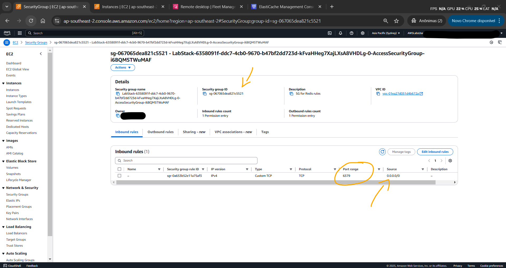

# Lab - Introduction to Amazon ElastiCache with Windows Server   

### AWS Skill Builder <a href="../../">aws_skill_builder   </a>
### Training Category: <a href="../../self_paced_lab">self_paced_lab</a>
### Software/Subject: aws   
### Course: <a href="./">curso_spl_024 (Lab - Introduction to Amazon ElastiCache with Windows Server)   </a>

#### Parceria da AWS com a Escola da Nuvem (EDN)   

---

### Theme:
- Cloud Computing
- Data

### Used Tools:
- Operating System (OS): 
  - Windows 11   
  - Windows Server   
- Cloud:
  - Amazon Web Services (AWS)   
- Cloud Services:
  - Amazon ElastiCache   
  - Amazon Elastic Compute Cloud (EC2)   
  - Google Drive   
- Language:
  - HTML   
  - Markdown   
- Integrated Development Environment (IDE) and Text Editor:
  - Visual Studio Code (VS Code)   
- Compiler:
  - GNU Compiler Collection (GCC)   
- Versioning: 
  - Git   
- Repository:
  - GitHub   
- Command Line Interpreter (CLI):
  - Bash e Sh   
  - Remote Dictionary Server Command Line Interface (Redis CLI)   
- Server and Databases:
  - Remote Dictionary Server (Redis)   
- Database Administration Tool:
  - Redis Desktop Manager (RDM)   
- Network:
  - OpenSSL   

---

<a name="item0"><h3>Course Strcuture:</h3></a>
1. Lab - Introduction to Amazon ElastiCache with Windows Server 
1.1 <a href="#item01.1">Tarefa 1: Criar um cluster do Amazon ElastiCache</a> 
1.2 <a href="#item01.2">Tarefa 2: Autorizar acesso ao seu cluster Amazon ElastiCache</a> 
1.3 <a href="#item01.3">Tarefa 3: Obtenha seu ponto de extremidade ElastiCache</a> 
1.4 <a href="#item01.4">Tarefa 4: Conecte-se à sua instância EC2</a> 
1.5 <a href="#item01.5">Tarefa 5: instalar o cliente Redis e interagir com seu cluster de cache</a> 
1.6 <a href="#item01.6">Tarefa 6: Excluir seu cluster do Amazon ElastiCache</a> 

---

### Objective:
O objetivo deste laboratório foi provisionar um cluster do **Amazon ElastiCache** para **Redis** e conectar-se a ele a partir de uma instância do **Amazon EC2** para executar comandos. Por fim, o cluster foi removido. Este laboratório seguiu a mesma estrutura do lab [curso_spl_021](https://github.com/PedroHeeger/aws_skb/tree/main/self_paced_lab/curso_spl_021), com a diferença de que a instância do **Amazon EC2** já estava provisionada e utilizava **Windows Server**, em vez de **Amazon Linux**. Além disso, o software utilizado para interação com o cluster foi o **Redis Desktop Manager (RDM)**, substituindo o **Redis CLI**, que havia sido utilizado na instância **Amazon Linux**.

### Structure:
A estrutura do curso é formada por:
- Este arquivo de README.
- A pasta `0-aux`, pasta auxiliar com imagens utilizadas na construção desse arquivo de README.

### Development:
Este curso foi um laboratório prático realizado na plataforma **AWS Skill Builder**, cuja subscrição foi devida a uma parceria entre a **AWS** e a **Escola da Nuvem**. A infraestrutura de cloud utilizada foi fornecida através de um sandbox do **AWS Skill Builder** que possibilitava acesso ao console da **AWS**. Contudo foi necessário seguir estritamente as orientações determinadas no laboratório. Dessa maneira, a forma de interação com os recursos da cloud foram sempre através do console fornecido pelo sandbox, a não ser em casos em que o próprio laboratório instruiu para utilização de outras ferramentas de interação como **AWS CLI** ou **AWS SDK**.

O laboratório do **AWS Skill Builder** tem o foco em executar apenas o que é orientado no escopo, todos os recursos ou serviços que podem ser requisitados adicionalmente já vêm provisionados por padrão pelo laboratório. Ao iniciar o laboratório, o sandbox do **AWS Skill Builder** provisiona diversos recursos e serviços para o funcionamento através de uma ou mais pilhas do **AWS CloudFormation** de forma automática. 

O acesso ao console no sandbox do **AWS Skill Builder** é realizado por meio de uma identidade federada. O Skill Builder funciona como um provedor de identidade (IdP), autenticando o usuário e vinculando-o a uma role do **AWS IAM** provisionada automaticamente por uma das pilhas do CloudFormation. Essa role concede permissões temporárias e mínimas necessárias para a execução do laboratório, garantindo segurança e controle sobre os recursos utilizados. O laboratório, por padrão, determina a região a ser utilizada e ela não deve ser alterada, somente se o próprio laboratório indicar. As configurações não informadas no laboratório devem ser sempre mantidas como padrão que estão.

<a name="item01.1"><h4>Tarefa 1: Criar um cluster do Amazon ElastiCache</h4></a>[Back to summary](#item0)

A tarefa inicial foi provisionar um cluster do **Amazon ElastiCache** para **Remote Dictionary Server (Redis)** na **AWS**. O **Redis** é um banco de dados em memória, de código aberto, usado como cache, message broker e armazenamento de estrutura de dados chave-valor, oferecendo alta performance e baixa latência. Ele suporta diversos tipos de dados, persistência opcional e replicação para escalabilidade. No ElastiCache para Redis, existem dois principais tipos de implementação:
- Redis OSS: Baseado na versão de código aberto do **Redis**, sem otimizações adicionais da **AWS**.
- Redis com memória gerenciada: Uma versão aprimorada pela **AWS**, com melhor desempenho e resiliência.

Neste caso foi optado pelo tipo de implementação `Redis OSS` com as seguintes configurações:
- Na seção `Configuration` (Configuração):
    - `Deployment option` (Opção Implantação): `Design your own cache` (Projetar seu próprio cache).
    - `Creation method` (Método de criação): `Cluster cache` (Cache de cluster).
- Na seção de `Cluster Informations` (informações do Cluster):
    - `Name` (Nome): `mycache`.
- Na seção `Cluster settings` (Configurações do cluster):
    - `Node type` (Tipo de nó): `cache.t2.micro`.
    - `Number of replicas` (Número de réplicas): `0`.
- Na seção `Connectivity` (Conectividade):
    - `Subnet groups` (Grupos de sub-rede): `Choose a existing subnet group` (Escolher grupo de sub-rede existente). Esse grupo possuía três sub-redes, cada uma em diferentes AZs.
        - `Name` (Nome): `cachesubnet`.

Com todas as outras configurações padrões, o cluster foi provisionado. A informação `Status` mostrava o estado do cluster que iniciou como `Creating` até ficar `Available`, conforme imagem 01. O tempo de criação do cluster é um pouco alto, então pode ser que demore.

<figure>
     
    <figcaption>Imagem 01.</figcaption>
</figure>
 

<a name="item01.2"><h4>Tarefa 2: Autorizar acesso ao seu cluster Amazon ElastiCache</h4></a>[Back to summary](#item0)

Para conectar-se ao cluster do **Amazon ElastiCache** a partir de uma instância do **Amazon EC2** que esteja em execução no mesmo **Amazon VPC**, é necessário conceder acesso de entrada de rede ao cluster. Nesta tarefa, o objetivo foi conceder acesso de entrada de rede ao cluster. Para isso uma regra de entrada liberando a porta `6379` (porta padrão do **Redis**) para todos os intervalos de IP (`0.0.0.0/0`) foi adicionada ao grupo de segurança de nome `Access-SG`, cujo ID era `sg-067065dea821c5521`. Contudo, caso há conexão não seja estabelecida lá na frente, considere também adicionar essa mesma regra no grupo de segurança padrão da VPC que o **Amazon ElastiCache** utiliza. De acordo com pesquisas feitas, quando um security group não é informado ao cluster do ElastiCache, ele utiliza o security group padrão da VPC.

A imagem 02 exibe como ficou esse security group.

<figure>
     
    <figcaption>Imagem 02.</figcaption>
</figure>
 

<a name="item01.3"><h4>Tarefa 3: Obtenha seu ponto de extremidade ElastiCache</h4></a>[Back to summary](#item0)

Para conectar-se ao cluster ElastiCache, é necessário saber qual é o endpoint do ElastiCache. Portanto, o cluster do ElastiCache provisionada do nome `mycache` foi selecionado para copiar o endpoint, que era `master.mycache.vv4win.apse2.cache.amazonaws.com:6379` para o primário (escritor) e `replica.mycache.vv4win.apse2.cache.amazonaws.com:6379` para o leitor. Contudo, o endpoint do único nó desse cluster era `mycache-001.mycache.vv4win.apse2.cache.amazonaws.com:6379`, logo, ele atendia tanto para escritor (Writer) como para leitor (Reader).

<figure>
     
    <figcaption>Imagem 03.</figcaption>
</figure>
 

Uma sessão remota com a instância do **Amazon EC2** **Windows Server** foi aberta utilizando o recurso *Session Manager* do **AWS Systems Manager (SSM)** para executar os comandos `cd C:\Users\Administrator\Desktop\` e `echo "master.mycache.vv4win.apse2.cache.amazonaws.com" > mycache.txt` dentro do terminal da instância, passando o ednpoint primário do cluster para que ele fosse copiado em um arquivo de texto dentro da instância. O valor do parâmetro `Ec2InstanceSessionCLI` nas instruções deste lab facilitava ao abrir a conexão do *Session Manager* com a instância.

<a name="item01.4"><h4>Tarefa 4: Conecte-se à sua instância EC2</h4></a>[Back to summary](#item0)

Nesta tarefa, o objetivo foi se conectar à instância do **Amazon EC2** utilizando o recurso *Fleet Manager* do **AWS Systems Manager (SSM)**, já que precisava ser um acesso remoto gráfico. Para a autenticação do usuário que estava se conectando na instância foi preciso baixar o arquivo de chave privada, fornecido pelas instruções desse lab, do par de chaves vinculado a instância. Também foi preciso informar o nome do usuário que esta conectando, que era o usuário padrão do **Windows Server**, `Administrator`. A imagem 04 mostra a instância acessada remotamente de forma gráfica pelo console da **AWS**. Tanto o *Session Manager* quanto o *Fleet Manager* são formas de acesso seguras, gerenciadas pelo SSM, não sendo necessário abrir as portas `22` (`SSH`) e `3389` (`RDP`) no grupo de segurança vinculado a instância.

<figure>
     
    <figcaption>Imagem 04.</figcaption>
</figure>
 

<a name="item01.5"><h4>Tarefa 5: instalar o cliente Redis e interagir com seu cluster de cache</h4></a>[Back to summary](#item0)

De dentro da instância, o objetivo agora foi se conectar ao cluster do **Amazon ElastiCache** provisionado. Para isso foi necessário instalar o software **Redis Desktop Manager (RDM)** cujo instalador já estava disponível na instância. O **Redis Desktop Manager (RDM)** é uma ferramenta gráfica de código aberto para gerenciar bancos de dados **Redis**, permitindo visualizar, editar e monitorar dados armazenados no **Redis** de forma intuitiva. Durante a execução do instalador, caso fosse sugerido baixar a versão mais nova, seria confirmado. 

No RDM, uma conexão com o cluster do ElastiCache foi criada informando o nome do cluster `mycache` e o endpoint da instância primária (escritora), que tinha sido armazenada no arquivo de texto `mycache.txt`. Todavia, foi necessário marcar a opção `SSL` em `Security`, pois o endpoint do ElastiCache tem suporte `TLS`. Com a conexão estabelecida, conforme imagem 05, um terminal foi aberto e os mesmos comandos do lab 021 foram executados:
- `set a "hello"`: Este comando definia a chave `a` com um valor de string e sem expiração.
- `get a`: Este comando obtinha o valor de `a`.
- `get b`: Este comando tentava obter o valor de `b`, mas como não estava no cache, ele retorna `nil`.
- `set b "Good-bye" EX 5`: Este comando definia o valor de `b` para “Good-bye” por 5 segundos. Após 5 segundos, `b` não teria mais valor.
- `quit`: Este comando fechava a conexão com o cluster **Redis**.

<figure>
     
    <figcaption>Imagem 05.</figcaption>
</figure>
 

A imagem 06 evidencia a execução dos comandos no cluster **Redis**.

<figure>
     
    <figcaption>Imagem 06.</figcaption>
</figure>
 

<a name="item01.6"><h4>Tarefa 6: Excluir seu cluster do Amazon ElastiCache</h4></a>[Back to summary](#item0)

A última tarefa teve como objetivo a exclusão do cluster provisionado no **Amazon ElastiCache**. Ao abrir a janela de exclusão foi definido que nenhum backup seria criado e passado o nome do cluster `mycache`. O `Status` modificou para `Deleting` até ser removido por completo, conforme mostrado na imagem 07.

<figure>
     
    <figcaption>Imagem 07.</figcaption>
</figure>
 