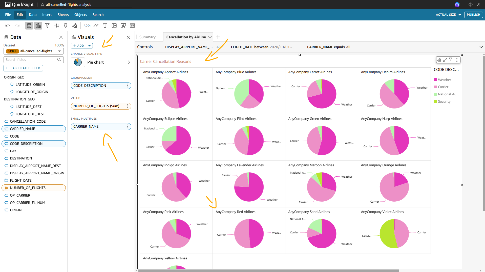

# Lab - Building BI Dashboards with Amazon QuickSight   

### AWS Skill Builder <a href="../../">aws_skill_builder   </a>
### Training Category: <a href="../../self_paced_lab">self_paced_lab</a>
### Software/Subject: aws   
### Course: <a href="./">curso_spl_025 (Lab - Building BI Dashboards with Amazon QuickSight)   </a>

#### Parceria da AWS com a Escola da Nuvem (EDN)   

---

### Theme:
- Business Intelligence (BI)
- Cloud Computing

### Used Tools:
- Operating System (OS): 
  - Windows 11   
- Cloud:
  - Amazon Web Services (AWS)   
- Cloud Services:
  - Amazon QuickSight   
  - Google Drive   
- Language:
  - HTML   
  - Markdown   
- Integrated Development Environment (IDE) and Text Editor:
  - Visual Studio Code (VS Code)   
- Versioning: 
  - Git   
- Repository:
  - GitHub   

---

<a name="item0"><h3>Course Strcuture:</h3></a>
1. Lab - Building BI Dashboards with Amazon QuickSight 
1.1 <a href="#item01.1">Tarefa 1: Ingerir dados no SPICE</a> 
1.2 <a href="#item01.2">Tarefa 2: Preparar dados</a> 
1.3 <a href="#item01.3">Tarefa 3: Criar visualizações</a> 
1.4 <a href="#item01.4">Tarefa 4: Publicar um painel</a> 
1.5 <a href="#item01.5">Tarefas de desafio (opcional)</a> 

---

### Objective:
Este laboratório teve como objetivo utilizar o **Amazon QuickSight** para ingerir dados de dois arquivos do **Excel**, preparar e explorar essas informações, criar visualizações interativas com drill down e filtros, e, por fim, construir e compartilhar um dashboard. A análise se baseou em um cenário onde um cliente da empresa fictícia AnyCompany Consulting buscava identificar as causas do cancelamento de voos que tiveram origem ou destino em aeroportos dos Estados Unidos (EUA).
 
### Structure:
A estrutura do curso é formada por:
- Este arquivo de README.
- A pasta `0-aux`, pasta auxiliar com imagens utilizadas na construção desse arquivo de README.
- A pasta `resource` com os arquivos utilizados.

### Development:
Este curso foi um laboratório prático realizado na plataforma **AWS Skill Builder**, cuja subscrição foi devida a uma parceria entre a **AWS** e a **Escola da Nuvem**. A infraestrutura de cloud utilizada foi fornecida através de um sandbox do **AWS Skill Builder** que possibilitava acesso ao console da **AWS**. Contudo foi necessário seguir estritamente as orientações determinadas no laboratório. Dessa maneira, a forma de interação com os recursos da cloud foram sempre através do console fornecido pelo sandbox, a não ser em casos em que o próprio laboratório instruiu para utilização de outras ferramentas de interação como **AWS CLI** ou **AWS SDK**.

O laboratório do **AWS Skill Builder** tem o foco em executar apenas o que é orientado no escopo, todos os recursos ou serviços que podem ser requisitados adicionalmente já vêm provisionados por padrão pelo laboratório. Ao iniciar o laboratório, o sandbox do **AWS Skill Builder** provisiona diversos recursos e serviços para o funcionamento através de uma ou mais pilhas do **AWS CloudFormation** de forma automática. 

O acesso ao console no sandbox do **AWS Skill Builder** é realizado por meio de uma identidade federada. O Skill Builder funciona como um provedor de identidade (IdP), autenticando o usuário e vinculando-o a uma role do **AWS IAM** provisionada automaticamente por uma das pilhas do CloudFormation. Essa role concede permissões temporárias e mínimas necessárias para a execução do laboratório, garantindo segurança e controle sobre os recursos utilizados. O laboratório, por padrão, determina a região a ser utilizada e ela não deve ser alterada, somente se o próprio laboratório indicar. As configurações não informadas no laboratório devem ser sempre mantidas como padrão que estão.

<a name="item01.1"><h4>Tarefa 1: Ingerir dados no SPICE</h4></a>[Back to summary](#item0)

Antes de analisar os dados é necessário carregá-los e prepará-los primeiro. Dessa forma, nesta primeira tarefa foi ingerido os dados no **Amazon QuickSight** do arquivo de **Excel**. O QuickSight fornece dois modos de ingestão de fontes de dados: consulta direta e cache de dados no SPICE. Quando os dados são carregados baseados em arquivo, o QuickSight usa o SPICE como padrão. Caso seja conectado a um banco de dados, poderá escolher entre consulta direta e SPICE. O *SPICE (Super-fast, Parallel, In-memory Calculation Engine)* é o robusto mecanismo de cache in-memory que o **Amazon QuickSight** usa. Ele foi projetado para executar cálculos avançados e servir dados rapidamente.

O arquivo de **Excel**, cujo nome era [all-cancelled-flights.csv](./resource/all-cancelled-flights.csv), precisou ser baixado do laboratório. Este conjunto de dados continha quase 250.000 registros e poderia levar de 1 a 3 minutos para ser baixado, dependendo da velocidade da conexão de internet. No console do QuickSight, um novo conjunto de dados foi criado a partir desse arquivo de **Excel**. Se um erro SPICE informando que não havia capacidade SPICE disponível aparecesse, era feito o seguinte:
- O ícone de pessoa no canto superior direito da tela era selecionado.
- A opção `Manage QuickSight` (Gerenciar QuickSight) era escolhida.
- A opção `SPICE Capacity` (Capacidade SPICE) era escolhida.
- A opção `Puchase Capacity` (Comprar mais capacidade) era selecionada.
- Era digitado `1` em `Additional SPICE capacity` (Capacidade adicional SPICE) e confirmado para adquirir a capacidade SPICE.
- O arquivo de base de dados era carregado novamente.

Após carregar, uma pré-visualização dos dados era apresentada, conforme imagem 01, e a opção `Edit settings and prepare data` (Editar/Visualizar dados) era selecionada.

<figure>
     
    <figcaption>Imagem 01.</figcaption>
</figure>
 

<a name="item01.2"><h4>Tarefa 2: Preparar dados</h4></a>[Back to summary](#item0)

Para visualizar os dados de forma eficaz, era necessário a preparação do conjunto de dados. Este conjunto de dados tinha alguns nomes de colunas que estavam incompletos, campos que podiam ser removidos, tipos de dados que estavam incorretos, campos personalizados que ainda não tinham sido adicionados e outro conjunto de dados para unir. Além do arquivo `all-cancelled-flights.csv`, o cliente forneceu uma tabela que incluía a descrição de cada um dos códigos de cancelamento. Portanto, nesta tarefa, as seguintes transformações dos dados foram realizadas:
- Editar nomes de colunas: No conjunto de dados, o campo `DEST` significava `Destination`, portanto o nome da coluna foi alterado de `DEST` para `DESTINATION`.
- Alterar tipos de dados: O campo `OP_CARRIER_FL_NUM` estava definido como uma medida e precisou ser alterado para o tipo `String` para que fosse automaticamente uma dimensão em vez de medida.
- Adicionar campos às coordenadas: Para simplificar as localizações dos aeroportos, foi adicionado `LATITUDE_ORIGIN` e `LONGITUDE_ORIGIN` às coordenadas chamadas `ORIGIN_GEO`. Em seguida, foi adicionado `LATITUDE_DEST` e `LONGITUDE_DEST` às coordenadas chamadas `DESTINATION_GEO`. Os campos de coordenadas geoespaciais `ORIGIN_GEO` e `DESTINATION_GEO` foram campos criados a partir de uma dos seus campos base, enquanto o outro campo base era selecionado ao criar essas coordenadas geoespaciais, sendo sempre necessário passar a latitude e longitude.
- Excluir campos: O campo `DISTANCE_LEGEND` incluía dados que não era mais necessário porque a distância podia ser calculada de forma mais granular a partir das coordenadas que acabaram de serem criadas. Sendo assim, esse campo foi removido do conjunto de dados.
- Unir tabelas: Os valores do campo `CANCELLATION_CODE` eram A, B, C e D. Esses valores não continham significado que pudesse traduzir claramente em uma visualização. Para isso, um segundo arquivo **Excel**, cujo nome era [cancellation-codes.csv](./resource/cancellation-codes.csv), foi carregado para uní-lo com a base dados construída no QuickSight. Esse arquivo continha as descrições dos códigos de cancelamento. Uma junção à esquerda foi realizada, determinando as colunas em comum entre as duas tabelas (`CANCELLATION_CODE` e `Code`). Em seguida, a coluna `CANCELLATION_CODE` foi removida, enquanto a coluna `Code` foi renomeada para `CODE` e a coluna `Description` para `CODE_DESCRIPTION`.

Após a preparação, o dataset foi salva e publicada para que pudesse ser utilizada para construção do report com as visualizações. A imagem 02 mostra essas cinco transformações.

<figure>
     
    <figcaption>Imagem 02.</figcaption>
</figure>
 

<a name="item01.3"><h4>Tarefa 3: Criar visualizações</h4></a>[Back to summary](#item0)

Finalizado a etapa de preparação dos dados, as visualizações puderam ser construídas. O cliente solicitou que fosse criado um dashboard que incluísse as seguintes visualizações:
- Um gráfico de barras que mostra o número de voos por companhia aérea.
- Um gráfico geoespacial que mostra o motivo dos cancelamentos de voos por destino.
- Um diagrama de Sankey que mostra o fluxo dos aeroportos de origem até o motivo do cancelamento.
- Um gráfico de linhas que mostra o número de voos por mês com uma previsão que estima voos futuros por mês.
- Um filtro que pode filtrar todas as visualizações por origem.
- Uma nova planilha para gráficos adicionais.
- Um gráfico de pizza que mostra o motivo do cancelamento por companhia aérea.
- Uma ação de filtro que filtra todas as outras visualizações selecionando um componente de outra visualização.
- Um insight de ML que descobre se há alguma anomalia de cancelamento no conjunto de dados.

Para criar as visualizações um análise precisou ser criada a partir do conjunto de dados preparado no QuickSight.

##### Criar um gráfico de barras

A primeira visualização elaborada foi um gráfico de barras que mostrava o número de voos por companhia aérea. Neste gráfico foi utilizado os campos `NUMBER_OF_FLIGHTS` e `CARRIER_NAME` para criar este gráfico de barras. O nome da visualização foi definida como `Cancelled Flights by Carrier`. A imagem 03 exibe esse gráfico e responde a pergunta abaixo:

> Qual companhia aérea tem mais voos? Qual companhia aérea tem menos voos?
> A AnyCompany Yellow Airlines realizou quase 49.000 voos nos últimos dois anos, enquanto a AnyCompany Violet Airlines teve menos de 1.500 voos.

<figure>
     
    <figcaption>Imagem 03.</figcaption>
</figure>
 

##### Criar um gráfico geoespacial

O segundo gráfico elaborado foi geoespacial, que mostrava o motivo dos cancelamentos de voos por destino. Neste, os campos utilizados foram `DESTINATION_GEO`, `CODE` e `NUMBER_OF_FLIGHTS`. Um zoom no mapa foi dado até que os Estados Unidos estivessem centralizados na visualização e a maioria dos pontos fossem exibidos. O título desse gráfico foi definido como `Cancellation Reason by Destination Airport`. Códigos de cancelamento são úteis se o usuário já sabe o que os códigos significam, mas para leitores que não estão familiarizados com os códigos, é útil fornecer uma descrição mais significativa. Para melhorar a legibilidade da visualização, foi substituído o campo `CODE` pelo campo `CODE_DESCRIPTION`. A imagem 04 mostra a visualização que respondia a pergunta abaixo:

> Qual destino tem o maior número de voos para um tipo de código?
> O Aeroporto Internacional de Dallas/Fort Worth (DFW) tem o maior número de cancelamentos para o código B. O código B significa Weather, então o aeroporto DFW tem o maior número de cancelamentos devido ao clima.

<figure>
     
    <figcaption>Imagem 04.</figcaption>
</figure>
 

##### Criar um diagrama de Sankey

A terceira visualização foi um diagrama de Sankey que mostrava o fluxo dos aeroportos de origem até o motivo do cancelamento. Os campos utilizados para esse diagrama foram: `DISPLAY_AIRPORT_NAME_ORIGIN`, `CODE_DESCRIPTION` e `NUMBER_OF_FLIGHTS`. Todas caixas foram expandidas para exibir todos os nomes dos aeroportos de origem. O nome dessa visualização foi definida como `Origin Airport Cancellation Reasons` e a imagem 05 evidencia a elaboração do diagrama. 

<figure>
     
    <figcaption>Imagem 05.</figcaption>
</figure>
 

##### Adicionar uma previsão com tecnologia de ML a uma visualização

O **Amazon QuickSight** usa machine learning (ML) para ajudar a descobrir insights e tendências ocultos nos dados, identificar os principais impulsionadores e prever métricas de negócios. Também pode ser consumido esses insights em narrativas de linguagem natural incorporadas em painéis. O QuickSight tem insights com tecnologia ML que podem fornecer previsões ou identificar anomalias no conjunto de dados rapidamente. Dessa forma, um gráfico de linhas, que mostrava o número de voos por mês com uma previsão baseada em ML que estimava voos futuros por mês, foi construído. Os campos utilizados foram `FLIGHT_DATE` e `NUMBER_OF_FLIGHTS`, e a opção de agregação foi modificado de dia para mês. Em seguida, uma previsão foi adicionada ao gráfico prevendo os próximos 14 meses de voos. Como nunca poderia haver menos de 0 voos, foi definido o mínimo da previsão para `0`. O título do gráfico foi definido como `Cancelled Flights per Month`. A imagem 06 exibe esta visualização criada.

<figure>
     
    <figcaption>Imagem 06.</figcaption>
</figure>
 

##### Adicionar um filtro

O quinto elemento não foi uma visualização e sim um filtro que atuava nas visualizações construídas. Um filtro só pode ser criado selecionando um visual, portanto, o visual de diagrama de Sankey foi utilizado e o filtro foi criado para o campo `DISPLAY_AIRPORT_NAME_ORIGIN`. Em seguida, esse filtro foi editado para que ele refletisse em todos os visuais. A imagem 07 mostra o filtro elaborado e com a utilização dele foi possível responder a pergunta abaixo filtrando o nome do aeroporto de origem correspondente:

> Qual companhia aérea teve mais voos partindo de Washington Dulles International (IAD)? Qual foi o motivo mais comum para cancelamentos de voos partindo de IAD?
> AnyCompany Apricot Airlines teve a maioria dos voos de IAD. O motivo mais comum para cancelamentos de voos de IAD é o clima.

<figure>
     
    <figcaption>Imagem 07.</figcaption>
</figure>
 

Ainda nessa etapa, mais dois filtros foram criados. Um para o campo `FLIGHT_DATE`, determinando a data de início e término como `2020/10/01` e `2022/10/31`, e incluíndo a data de término na filtragem. O terceiro filtro foi para o campo `CARRIER_NAME`. Esses dois filtros também foram aplicados a todas as visualizações do dashboard. Na imagem anterior, esses filtros já estavam presentes.

##### Adicionar uma segunda planilha

Apesar de ser chamado de dashboard, quando uma análise possuí mais de uma página, ela é na verdade um report (relatório), no qual cada página é uma planilha. Uma planilha é um conjunto de visuais que são visualizados juntos em uma única página. Ao criar uma análise, é possível colocar visuais no espaço de trabalho em uma planilha, sendo também possível adicionar mais planilhas e fazê-las funcionar separadamente ou juntas na análise. Nesta etapa da tarefa 3, apenas uma planilha tinha sido criada. Como esta planilha já possuía quatro visuais, uma segunda planilha foi criada para receber as novas visualizações que seriam construídas. A planilha 1 foi renomeada para `Summary` e a planilha 2 foi nomeada de `Cancellation by Airline`.

##### Criar um gráfico de pizza

Nessa segunda planilha (`Cancellation by Airline`), um gráfico de pizza foi elaborado para mostrar os motivos de cancelamento para cada aeroporto. Os campos utilizados neste gráfico foram: `CODE_DESCRIPTION`, `NUMBER_OF_FLIGHTS` e `CARRIER_NAME`. Neste gráfico de pizza para cada companhia aérea, o `CARRIER_NAME` foi passado em `SMALL MULTIPLES` (Múltiplos pequenos) gerando um gráfico de pizza para cada companhia área. O título dessa visualização foi definido como `Carrier Cancellation Reasons`. A imagem 08 mostra esse conjunto de gráficos na segunda planilha, respondendo a pergunta abaixo:

> Qual companhia aérea nunca cancelou um voo para o National Air System and Security? Quantas viagens essa companhia aérea cancelou?
> A AnyCompany Red Airlines nunca cancelou um voo para o National Air System and Security. Eles cancelaram aproximadamente 5.430 voos para Weather and Carrier.

<figure>
     
    <figcaption>Imagem 08.</figcaption>
</figure>
 

##### Adicionar uma ação de filtro

Um penúltimo elemento foi uma ação de filtro. Uma ação de filtro permite que ao selecionar itens no painel outras visualizações na planilha fossem filtradas automaticamente com base na seleção deles. Essa ação de filtro foi criada na planilha `Summary` escolhendo o gráfico de barras para abrir suas propriedades. Em `Interactions` (Interações), a opção `Actions` (Ações) foi selecionada e uma ação, cujo nome foi `Filter same-sheet visuals`, foi criada. A imagem 09 mostra exatamente o que foi perguntado abaixo:

> O que acontece quando você seleciona uma companhia aérea no gráfico de barras com a ação de filtro adicionada na planilha?
> Todas as visualizações são filtradas para a companhia aérea selecionada no gráfico de barras.

<figure>
     
    <figcaption>Imagem 09.</figcaption>
</figure>
 

##### Adicionar um insight de ML ao painel

O último elemento desse report em construção foi a adição de um insight de machine learning. O cliente queria saber se havia alguma anomalia para cancelamentos climáticos no conjunto de dados. Para isso, dentro dessa análise foi escolhido o ícone de `Insights` no canto superior. Contudo, as sugestões só apareciam se algum visual fosse selecionado. Então, qualquer um dos gráficos foram selecionados e após aparecer as sugestões foi clicado na opção `ADD` (Adicionar) para criar um insight. Em seguida, foi definido o `Compute options` (Tipo de computação) como `Anomaly detection` (Detecção de anomalias). Imediatamente um novo visual era configurado, cujo tipo era `Insights`. Neste, foram informados os campos `FLIGHT_DATE`, `CODE_DESCRIPTION` e `NUMBER_OF_FLIGHTS` e clicado na opção `Get started` para iniciar a construção do insight. O insight poderia levar de 2 a 3 minutos para relatar quaisquer anomalias no conjunto de dados. Foi necessário aguardar até que o insight terminasse para que fosse possível visualizar os resultados. Esse visual foi nomeado de `Cancellation Anomalies`. A imagem 10 evidencia o insights gerado

<figure>
     
    <figcaption>Imagem 10.</figcaption>
</figure>
 

Ainda nesta etapa, os visuais elaborados nas duas páginas do report, assim como os demais elementos, foram organizados movendo e redimensionando os visuais de modo que o layout ficasse atraente. As duas imagens (11 e 12) a seguir ilustram como ficou a organização do report.

<figure>
     
    <figcaption>Imagem 11.</figcaption>
</figure>
 

<figure>
     
    <figcaption>Imagem 12.</figcaption>
</figure>
 

<a name="item01.4"><h4>Tarefa 4: Publicar um painel</h4></a>[Back to summary](#item0)

Na quarta tarefa o objetivo foi publicar o painel (dashboard), que neste caso era um report (relatório), já que havia mais de uma página. Na barra de menu superior, a opção `Publish` (Publicar) foi escolhida e o nome para o report foi definido como `Cancelled Flights`. Após publicar, o QuickSight automaticamente redireciona para o report construído, conforme mostrado na imagem 13. Este report estava agora registrado na aba de `Dashboard` do QuickSight.

<figure>
     
    <figcaption>Imagem 13.</figcaption>
</figure>
 

<a name="item01.5"><h4>Tarefas de desafio (opcional)</h4></a>[Back to summary](#item0)

A última tarefa foi de desafio, no qual o cliente hipotético solicitou as seguintes alterações no report:
- Analise detalhadamente um gráfico de pizza (opcional);
- Crie uma visualização de tabela (opcional);
- Adicionar um novo insight ao painel (opcional);
- Atualizar um painel (opcional).

##### Analise detalhadamente um gráfico de pizza (opcional)

No conjunto de gráficos de pizza na página 2, o campo de detalhamento chamado `SMALL MULTIPLES` (Múltiplos pequenos) foi utilizado adicionando as duas seguintes colunas na ordem: `CARRIER_NAME` e `DISPLAY_AIRPORT_NAME_ORIGIN`. Agora, ao selecionar qualquer fatia de um dos gráficos aparecia uma opção para detalhar com base nas colunas adicionadas. Esse recurso é o chamado de `Drill down`. A imagem 14 mostra como ficou esse visual.

<figure>
     
    <figcaption>Imagem 14.</figcaption>
</figure>
 

##### Crie uma visualização de tabela (opcional)

Para construção do visual de tabela foi necessário adicionar uma terceira página, cujo nome foi `Details`. O visual de tabela foi escolhido e os seguintes campos foram utilizados por ela: `FLIGHT_DATE`, `DAY`, `OP_CARRIER`, `CARRIER_NAME`, `OP_CARRIER_FL_NUM`, `ORIGIN`, `DISPLAY_AIRPORT_NAME_ORIGIN`, `DESTINATION`, `DISPLAY_AIRPORT_NAME_DEST`, `CODE` e `CODE_DESCRIPTION`. Nenhum desses campos foram colados em medidas, pois todos eles eram dimensões. Esse visual de tabela foi nomeado de `Details Table`. A imagem 15 evidencia essa construção.

<figure>
     
    <figcaption>Imagem 15.</figcaption>
</figure>
 

##### Adicionar um novo insight ao painel (opcional)

O cliente queria ver os três principais motivos de cancelamento na folha `Summary`. Portanto um novo insight foi elaborado, definido o `Computation type` (Tipo de computação) para `Top ranked` (Mais bem classificado) e escolhendo o campo `CODE_DESCRIPTION`. O título foi definido como `Top Cancellation Reasons` e a imagem 16 mostra esse novo insight construído.

<figure>
     
    <figcaption>Imagem 16.</figcaption>
</figure>
 

##### Atualizar um painel (opcional)

A última solicitação foi apenas atualizar o report com essas três solicitações do cliente. Dessa forma, foi só publicar novamente o report substituindo o existente, mantendo o mesmo nome e selecionado as três planilhas.

<figure>
     
    <figcaption>Imagem 17.</figcaption>
</figure>
 