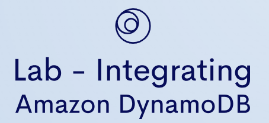

# Lab - Integrating Amazon DynamoDB   

### AWS Skill Builder <a href="../../">aws_skill_builder   </a>
### Training Category: <a href="../../self_paced_lab">self_paced_lab</a>
### Software/Subject: aws   
### Course: <a href="./">curso_spl_026 (Lab - Integrating Amazon DynamoDB)   </a>

#### Parceria da AWS com a Escola da Nuvem (EDN)   

---

### Theme:
- Cloud Computing
- Data

### Used Tools:
- Operating System (OS): 
  - Windows 11   
- Cloud:
  - Amazon Web Services (AWS)   
- Cloud Services:
  - Amazon CloudFront   
  - Amazon DynamoDB   
  - Amazon Elastic Compute Cloud (EC2)   
  - AWS Command Line Interface (CLI)   
  - AWS Software Development Kit (SDK) - Boto3   
  - Google Drive   
- Language:
  - HTML   
  - Markdown   
  - Python   
- Integrated Development Environment (IDE) and Text Editor:
  - Visual Studio Code (VS Code)   
- Versioning: 
  - Git   
- Repository:
  - GitHub   
- Command Line Interpreter (CLI):
  - Bash e Sh   

---

<a name="item0"><h3>Course Strcuture:</h3></a>
1. Lab - Integrating Amazon DynamoDB<br>
1.1 <a href="#item01.1">Tarefa 1: Revise o script Python e a LanguagesTable</a><br>
1.2 <a href="#item01.2">Desafio 1: Atualizar o script Python para inserir um item na tabela do DynamoDB</a><br>
1.3 <a href="#item01.3">Desafio 2: Modifique o script Python para ler um item da tabela do DynamoDB</a><br>
1.4 <a href="#item01.4">Tarefa 2: Teste o script Python</a><br>

---

### Objective:
Este laboratório teve como objetivo recuperar e inserir dados em uma tabela do **Amazon DynamoDB** utilizando scripts em **Python** com o **Boto3** (**AWS Software Development Kit (SDK)** para **Python**). O ambiente de desenvolvimento foi o **Code-Server** (uma versão do **VS Code** para servidores), executado em uma instância do **Amazon EC2** e acessado por meio de uma distribuição do **Amazon CloudFront**. O **AWS Command Line Interface (CLI)** também foi utilizado para consultar os dados da tabela.

### Structure:
A estrutura do curso é formada por:
- Este arquivo de README.
- A pasta `0-aux`, pasta auxiliar com imagens utilizadas na construção desse arquivo de README.
- A pasta `resource` com os arquivos utilizados.

### Development:
Este curso foi um laboratório prático realizado na plataforma **AWS Skill Builder**, cuja subscrição foi devida a uma parceria entre a **AWS** e a **Escola da Nuvem**. A infraestrutura de cloud utilizada foi fornecida através de um sandbox do **AWS Skill Builder** que possibilitava acesso ao console da **AWS**. Contudo foi necessário seguir estritamente as orientações determinadas no laboratório. Dessa maneira, a forma de interação com os recursos da cloud foram sempre através do console fornecido pelo sandbox, a não ser em casos em que o próprio laboratório instruiu para utilização de outras ferramentas de interação como **AWS CLI** ou **AWS SDK**.

O laboratório do **AWS Skill Builder** tem o foco em executar apenas o que é orientado no escopo, todos os recursos ou serviços que podem ser requisitados adicionalmente já vêm provisionados por padrão pelo laboratório. Ao iniciar o laboratório, o sandbox do **AWS Skill Builder** provisiona diversos recursos e serviços para o funcionamento através de uma ou mais pilhas do **AWS CloudFormation** de forma automática. 

O acesso ao console no sandbox do **AWS Skill Builder** é realizado por meio de uma identidade federada. O Skill Builder funciona como um provedor de identidade (IdP), autenticando o usuário e vinculando-o a uma role do **AWS IAM** provisionada automaticamente por uma das pilhas do CloudFormation. Essa role concede permissões temporárias e mínimas necessárias para a execução do laboratório, garantindo segurança e controle sobre os recursos utilizados. O laboratório, por padrão, determina a região a ser utilizada e ela não deve ser alterada, somente se o próprio laboratório indicar. As configurações não informadas no laboratório devem ser sempre mantidas como padrão que estão.

<a name="item01.1"><h4>Tarefa 1: Revise o script Python e a LanguagesTable</h4></a>[Back to summary](#item0)

Nesta primeira tarefa, o objetivo foi consultar a tabela `LanguagesTable` no **Amazon DynamoDB** e revisar o script **Python** aberto no **Visual Studio Code (VS Code)** de uma instância do **Amazon EC2**. Essa instância já estava configurada com os seguintes softwares: **Python**, **VS Code**, **AWS Command Line Interface (CLI)** e **AWS Software Development Kit (SDK)** para **Python**, que é o **Boto3**. A instância era acessada por uma distribuição do **Amaozon CloudFront** que trabalhava na frente dela. Todas as requisições feitas ao CloudFront eram distribuídas para a instância EC2 que executava o **Code-Server** e forçava a página de login do **Code-Server** como padrão. O **Code-Server** é uma versão do **VS Code** que roda em um servidor e pode ser acessada pelo navegador.

A URL (`https://d1467ux9z0yybd.cloudfront.net/?folder=/home/ec2-user/environment`) fornecida pelo parâmetro `LabWorkspaceURL` nas instruções desse laboratório, abria no navegador da máquina física **Windows**, o **Code-Server** executado na instância EC2 intermediada pela distribuição do CloudFront. Perceba que a URL era formada pela distribuição do CloudFront (`https://d1467ux9z0yybd.cloudfront.net/`) e no parâmetro de consulta (`Query String`) já era indicado qual pasta da instância EC2 o **Code-Server** tinha que abrir (`?folder=/home/ec2-user/environment`). Dessa forma, ao abrir o **Code-Server** com a URL completa, a pasta que precisva ser acessada já era aberta nele com todos os arquivos necessários. Contudo, para logar no **Code-Server** foi preciso uma senha que também foi fornecida pelo laboratório através do parâmetro `LabWorkspacePassword` (`N4STDvGz1NhM`). Dentro desse **VS Code**, todas as notificações foram limpadas ao clicar no ícone de sino no canto inferior direito. Em seguida, um terminal **Bash** foi aberto, conforme mostrado na imagem 01.

<div align="Center"><figure>
    <br>
    <figcaption>Imagem 01.</figcaption>
</figure></div><br>

O arquivo de script **Python** utilizado foi o [dynamodb.py](./resource/dynamodb.py) que utilizava a biblioteca **Boto3**, que é o **AWS SDK** para **Python**, para interagir com um banco de dados DynamoDB. O **Amazon DynamoDB** é um serviço de banco de dados NoSQL que a **AWS** fornece, e é conhecido por sua baixa latência e escalabilidade. A primeira parte do código (Desafio 1) colocava um item em uma tabela do DynamoDB. O item representava um idioma, com `Code` como `da` e `Language` como `Danish`. No entanto, o nome da tabela e os detalhes específicos do item eram deixados como pontos de interrogação (???), e o desafio era completar os detalhes. A segunda parte do código (Desafio 2) recuperava o item que representava o idioma dinamarquês da tabela do DynamoDB, que era o item adicionado no desafio anterior. Novamente, o nome da tabela e os detalhes da chave eram deixados como pontos de interrogação (???), e tinham que ser completados. Por fim, o código imprimia o item recuperado. A resposta da operação `get_item` era um dicionário, e `Item` era a chave nesse dicionário que continha o item recuperado. A imagem 02 exibe esse código aberto no **VS Code**. Observe que existia alguns outros arquivos na pasta que não foram utilizados no lab, dois deles eram interessantes. O arquivo [.populate_table.py](./resource/populate_table.py) foi, provavelmente, o arquivo que populou a tabela do DynamoDB ao iniciar o laboratório, no qual ele utilizou o arquivo [.languages.csv](./resource/languages.csv) para inserir os dados desse arquivo CSV na tabela.

<div align="Center"><figure>
    <br>
    <figcaption>Imagem 02.</figcaption>
</figure></div><br>

A `LanguagesTable` já tinha sido provisionada e pré-preenchida para uso neste laboratório. Ela foi carregada com códigos ISO 639-1 para idiomas pelos dois arquivos mencionados anteriormente. Em resumo, ISO 639 é um conjunto de padrões internacionais que lista códigos curtos para nomes de idiomas. Como desenvolvedor, é importante revisar a LanguagesTable para garantir que ela exista e esteja preenchida. Portanto, o console do DynamoDB foi aberto e a tabela foi verificada conforme mostrado na imagem 03. Ao verificar os itens da tabela foi observado que ela possuía 23 itens e duas colunas (`Code` e `Language`).

<div align="Center"><figure>
    <br>
    <figcaption>Imagem 03.</figcaption>
</figure></div><br>

Usar o console era certamente uma maneira de verificar se a `LanguagesTable` existia e estava preenchida. No entanto, a maioria dos desenvolvedores prefere executar um comando a partir do seu ambiente de desenvolvimento (neste caso, o **VS Code**). Ao executar um comando, os desenvolvedores podem mostrar esses dados rapidamente em vez de navegar por várias etapas para ver os dados em uma interface gráfica do usuário (GUI). Dessa forma, no terminal aberto do **VS Code** foi executado o comando **Bash** abaixo que continha comandos **AWS CLI** para consultar os dados na tabela do DynamoDB. A imagem 04 exibe o output desse comando, mostrando os 23 itens da tabela.

```bash
echo -e "Language\tCode" && echo -e "--------\t----" && aws dynamodb scan --table-name LanguagesTable --query "Items[*].[Language.S, Code.S]" --output text | awk '{printf "%-15s %-5s\n", $1, $2}'
```

<div align="Center"><figure>
    <br>
    <figcaption>Imagem 04.</figcaption>
</figure></div><br>

O comando anterior era usado para recuperar e formatar dados da tabela do DynamoDB chamada `LanguagesTable`. Era uma combinação de vários comandos e opções diferentes, que são explicados na lista a seguir:
- `echo -e "Language\tCode"`: `echo` é um comando que produz as strings que estão sendo passadas como argumentos. `-e` é uma opção que torna possível interpretar escapes de barra invertida, como `\t`, que representa um espaço de tabulação. Então, este comando imprimia os cabeçalhos `Language` e `Code` separados por um espaço de tabulação.
- `echo -e "--------\t----"`: Este comando era similar ao comando anterior. Ele imprimia uma linha que servia como separador entre os cabeçalhos e os dados.
- `aws dynamodb scan --table-name LanguagesTable --query "Items[*].[Language.S, Code.S]" --output text`: Este comando recuperava dados de uma tabela do DynamoDB. `–table-name LanguagesTable` especificava a tabela da qual recuperar dados. `–query "Items[ ].[Language.S, Code.S]"*` era uma opção que filtrava a saída para incluir apenas os elementos JSON especificados. Neste caso, ele recuperava os elementos `Language` e `Code` de cada item na tabela. `–output text` formatava a saída do comando como texto simples.
- `| awk '{printf "%-15s %-5s\n", $1, $2}'`: Este comando formatava a saída. `|` é um pipe que passava a saída do comando anterior como entrada para o próximo comando. `awk` é uma linguagem de programação usada para processamento de texto. `'{printf "%-15s %-5s\n", $1, $2}'` é um comando awk que imprimia o primeiro (`$1`) e o segundo (`$2`) campos de cada linha, formatados como strings (`%s`) com uma largura especificada (`-15` e `-5`), seguidos por uma nova linha (`\n`).

Como desenvolvedor, entender o **awk** é crucial porque é uma ferramenta poderosa de processamento de texto. Ele pode manipular dados, gerar relatórios e executar correspondências complexas de padrões. O **awk** é particularmente útil quando é necessário trabalhar com grandes quantidades de dados, e é frequentemente usado em scripts de extração e relatórios de dados. Ele também pode lidar com tarefas complexas que, de outra forma, exigiriam scripts substanciais em uma linguagem de propósito mais geral. Algumas considerações:
- A opção `–query` no **AWS CLI** é uma string de consulta JMESPath que especificava os elementos JSON a serem incluídos na saída. Ela é particularmente útil quando deseja-se filtrar a saída de um comando para incluir apenas os elementos nos quais é interessado, o que pode simplificar o processamento da saída.
- A opção `–output text` formatava a saída do comando como texto simples. Pode ser mais fácil trabalhar com texto simples em scripts e outras ferramentas de linha de comando do que a saída JSON padrão. É especialmente útil quando combinado com a opção `–query` porque é possível formatar os elementos JSON consultados como uma lista de texto simples.

<a name="item01.2"><h4>Desafio 1: Atualizar o script Python para inserir um item na tabela do DynamoDB</h4></a>[Back to summary](#item0)

Este foi o primeiro desafio proposto pelo lab, cujo objetivo era atualizar o código **Python** para que ele inserisse um item na tabela do **Amazon DynamoDB**. Esta é uma das operações de criação, leitura, atualização e exclusão (CRUD) que podem ser executadas em um banco de dados. Esse trecho do código foi atualizado para o abaixo:

```python
#####
# Challenge 1: Put the entry for Danish into the Languages
#   "Code": "da"
#   "Language": "Danish"
#####
dynamo.put_item(
    TableName="LanguagesTable",
    Item={
        "Language": {"S": "Danish"},
        "Code": {"S": "da"}
    })
```

Observe que agora, a função `put_item` inseria um item na tabela de nome `LanguagesTable`, informando os valores (`Danish` e `da`) para os dois atributos na tabela (`Language` e `Code`).

<a name="item01.3"><h4>Desafio 2: Modifique o script Python para ler um item da tabela do DynamoDB</h4></a>[Back to summary](#item0)

O segundo desafio foi atualizar a segunda parte do script **Python** para que ele lesse um item da tabela do **Amazon DynamoDB**, ou seja, uma operação de leitura. Sendo assim, o trecho do código foi alterado para o abaixo:

```python
#####
# Challenge 2: Retrieve the entry for Danish
#####
response = dynamo.get_item(
    TableName="LanguagesTable",
    Key={"Code": {"S": "da"}})

print("")  # adds a blank line to format output
print(response['Item'])
print("")  # adds a blank line to format output
```

Note que a função `get_item` recuperava na tabela `LanguagesTable` o item onde o atributo `Code` era `da`.

<a name="item01.4"><h4>Tarefa 2: Teste o script Python</h4></a>[Back to summary](#item0)

Por fim, a última tarefa consistiu em testar o script **Python** para verificar se as operações de inserção e leitura funcionavam. Pela ordem do código, primeiro seria inserido um novo item na tabela, totalizando agora 24 itens, com os atributos `Language` e `Code` como `Danish` e `da`. Em seguida, o segundo código iria consultar na tabela esse item pelo atributo `Code`. Para executar todo o script foi inserido o comando `cd ~/environment; python3 dynamodb.py` no terminal. Se a leitura funcionasse, indicava que a inserção também funcionou. A imagem 05 evidencia o output do script, comprovando que o novo item foi inserido na tabela e consultado corretamente.

<div align="Center"><figure>
    <br>
    <figcaption>Imagem 05.</figcaption>
</figure></div><br>