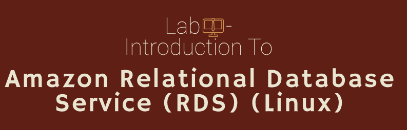
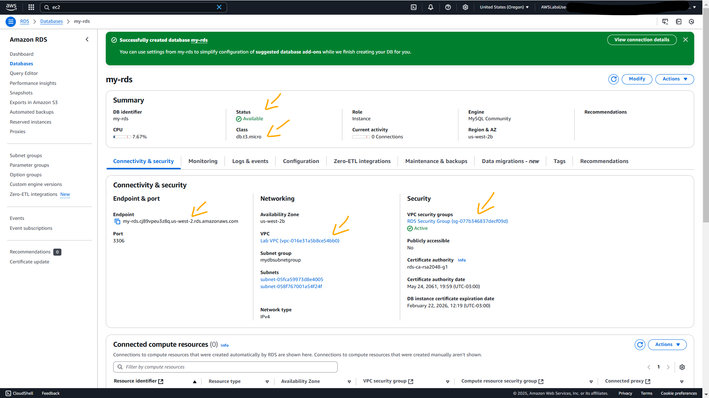
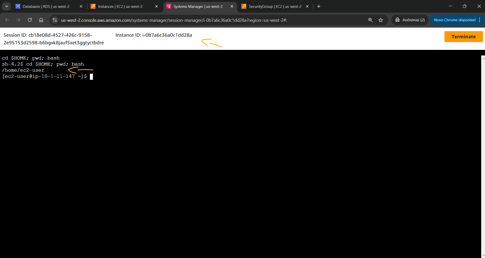
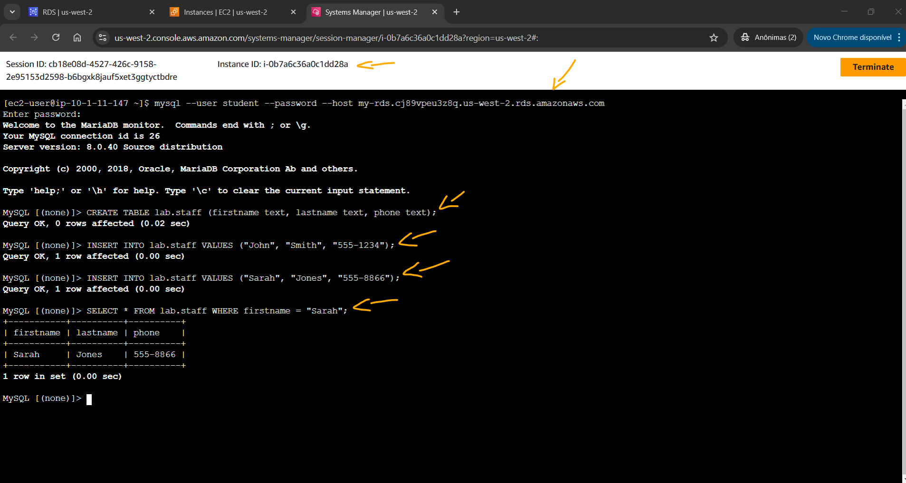

# Lab - Introduction to Amazon Relational Database Service (RDS) (Linux)   

### AWS Skill Builder <a href="../../">aws_skill_builder   </a>
### Training Category: <a href="../../self_paced_lab">self_paced_lab</a>
### Software/Subject: aws   
### Course: <a href="./">curso_spl_027 (Lab - Introduction to Amazon Relational Database Service (RDS) (Linux))   </a>

#### Parceria da AWS com a Escola da Nuvem (EDN)   

---

### Theme:
- Cloud Computing
- Data

### Used Tools:
- Operating System (OS): 
  - Linux   
  - Windows 11   
- Linux Distribution:
  - Amazon Linux   
- Cloud:
  - Amazon Web Services (AWS)   
- Cloud Services:
  - Amazon Elastic Compute Cloud (EC2)   
  - Amazon Relational Database Service (RDS)   
  - Amazon Virtual Private Cloud (VPC)   
  - AWS Systems Manager (SSM)   
  - Google Drive   
- Language:
  - HTML   
  - Markdown   
- Integrated Development Environment (IDE) and Text Editor:
  - Visual Studio Code (VS Code)   
- Versioning: 
  - Git   
- Repository:
  - GitHub   
- Command Line Interpreter (CLI):
  - Bash e Sh   

---

<a name="item0"><h3>Course Strcuture:</h3></a>
1. Lab - Introduction to Amazon Relational Database Service (RDS) (Linux) 
1.1 <a href="#item01.1">Tarefa 1: Criar uma instância RDS</a> 
1.2 <a href="#item01.2">Tarefa 2: conectar-se ao banco de dados usando a sessão do AWS Systems Manager</a> 

---

### Objective:
Este laboratório teve como objetivo provisionar uma instância de banco de dados **MySQL** no **Amazon Relational Database Service (RDS)** e acessar remotamente uma instância do **Amazon Elastic Compute Cloud (EC2)**, com sistema operacional **Amazon Linux**, por meio do *Session Manager* do **AWS Systems Manager (SSM)**. A partir dessa instância, foi possível se conectar ao banco de dados e interagir com ele. Este laboratório foi parecido com o [curso_spl_028](https://github.com/PedroHeeger/aws_skb/tree/main/self_paced_lab/curso_spl_028), sendo diferenciado na forma de acesso ao banco de dados **MySQL**, onde neste foi utilizado um software CLI e o outro uma GUI.

### Structure:
A estrutura do curso é formada por:
- Este arquivo de README.
- A pasta `0-aux`, pasta auxiliar com imagens utilizadas na construção desse arquivo de README.

### Development:
Este curso foi um laboratório prático realizado na plataforma **AWS Skill Builder**, cuja subscrição foi devida a uma parceria entre a **AWS** e a **Escola da Nuvem**. A infraestrutura de cloud utilizada foi fornecida através de um sandbox do **AWS Skill Builder** que possibilitava acesso ao console da **AWS**. Contudo foi necessário seguir estritamente as orientações determinadas no laboratório. Dessa maneira, a forma de interação com os recursos da cloud foram sempre através do console fornecido pelo sandbox, a não ser em casos em que o próprio laboratório instruiu para utilização de outras ferramentas de interação como **AWS CLI** ou **AWS SDK**.

O laboratório do **AWS Skill Builder** tem o foco em executar apenas o que é orientado no escopo, todos os recursos ou serviços que podem ser requisitados adicionalmente já vêm provisionados por padrão pelo laboratório. Ao iniciar o laboratório, o sandbox do **AWS Skill Builder** provisiona diversos recursos e serviços para o funcionamento através de uma ou mais pilhas do **AWS CloudFormation** de forma automática. 

O acesso ao console no sandbox do **AWS Skill Builder** é realizado por meio de uma identidade federada. O Skill Builder funciona como um provedor de identidade (IdP), autenticando o usuário e vinculando-o a uma role do **AWS IAM** provisionada automaticamente por uma das pilhas do CloudFormation. Essa role concede permissões temporárias e mínimas necessárias para a execução do laboratório, garantindo segurança e controle sobre os recursos utilizados. O laboratório, por padrão, determina a região a ser utilizada e ela não deve ser alterada, somente se o próprio laboratório indicar. As configurações não informadas no laboratório devem ser sempre mantidas como padrão que estão.

<a name="item01.1"><h4>Tarefa 1: Criar uma instância RDS</h4></a>[Back to summary](#item0)

O **Amazon Relational Database Service (RDS)** é um serviço web que facilita a configuração, operação e dimensionamento de bancos de dados relacionais na nuvem. Ele permite que seja criado e utilizado bancos de dados **MySQL**, **PostgreSQL**, **Oracle** ou **Microsoft SQL Server**. Isso significa que o código, os aplicativos e as ferramentas que já são utilizadas hoje com os bancos de dados existentes podem ser usados ​​com o **Amazon RDS**. Portanto, nesta primeira tarefa, o objetivo foi provisionar um banco de dados **MySQL** no **Amazon RDS**, configurando da seguinte forma:
- `Engine type` (Tipo de mecanismo): `MySQL`.
- `Templates` (Modelos): `Dev/Test` (Dev/Teste).
- Na seção `Availability and durability` (Disponibilidade e durabilidade), foi configurado o seguinte:
    - `Deployment options` (Opções de implantação): `Single DB instance` (Instância de banco de dados única).
- Na seção `Settings` (Configurações) foi configurado o seguinte:
    - `DB instance identifier` (Identificador da instância do BD): `my-rds`.
    - `Master username` (Nome de usuário mestre): `student`.
    - `Credentials management` (Gerenciamento de credenciais): `Self managed` (Autogerenciado).
        - `Master password` (Senha mestra): o valor do parâmetro `DBPassword` nas instruções desse laboratório foi utilizado (`qUKr7iuz5PLb`).
        - `Confirm master password` (Confirmar senha mestra): o valor do parâmetro `DBPassword` nas instruções desse laboratório foi utilizado (`qUKr7iuz5PLb`).
- Na seção `Instance configuration` (Configuração da instância) foi configurado o seguinte:
    - `DB instance class` Classe de instância de BD: `Burstable classes (includes t classes)` (classes Burstable (inclui classes t)).
    - No menu suspenso, foi escolhido o `Instance type` (tipo de instância): `db.t3.micro`.
- Na seção `Connectivity` (Conectividade) foi configurado o seguinte:
    - `Virtual private cloud (VPC)` Nuvem privada virtual (VPC): `Lab VPC`.
    - `DB subnet group` (Grupo de sub-redes do BD): foi escolhido o grupo de sub-redes já provisionado pelo lab, cujo nome era `mydbsubnetgroup`.
    - `Public access` (Acesso público): `No` (Não).
    - `VPC security group (firewall)` (Grupo de segurança VPC (firewall)): `Choose existing` (Escolher existente).
    - `Existing security group VPC` (Grupos de segurança VPC existentes): Apenas o grupo de segurança do banco dados, cujo nome era `RDS Security Group`, foi mantido, todos os demais foram removidos.
- Na seção `Monitoring` (Monitoramento): foi desmarcado `Enable Enhanced monitoring` (Habilitar mMnitoramento aprimorado).
- A seção de `Additional configuration` (Configuração adicional) foi expandida:
    - Na seção `Database options` (Opções do banco de dados) foi configurado o seguinte:
        - `Initial database name` (Nome inicial do banco de dados): `lab`.
    - Na seção `Backup`: foi desmarcado `Enable automated backups` (Habilitar backups automatizados).
    - Na seção `Maintenance` (Manutenção): foi desmarcada `Enable auto minor version update` (Habilitar atualização automática de versão secundária).
- A janela pop-up `my-rds suggestions complements` (Complementos sugeridos para my-rds) foi fechada.

A instância levou alguns minutos até ficar disponível. A imagem 01 evidencia a instância do **Amazon RDS** com banco de dados **MySQL** provisionada com sucesso.

<figure>
     
    <figcaption>Imagem 01.</figcaption>
</figure>
 

<a name="item01.2"><h4>Tarefa 2: conectar-se ao banco de dados usando a sessão do AWS Systems Manager</h4></a>[Back to summary](#item0)

Na segunda e última tarefa, o objetivo foi conectar-se a uma instância do **Amazon Elastic Compute Cloud (EC2)**, de sistema operacional **Amazon Linux**, usando o recurso *Session Manager* do **AWS Systems Manager**, para então conectar-se a instância de banco de dados do RDS. A instância EC2, que tinha sido provisionada pela pilha do **AWS CloudFormation**, funcionava como um Bastion Host. Todas as instâncias do **Amazon EC2** recebem dois endereços IP no lançamento: um endereço IP privado (RFC 1918) e um endereço IP público que são mapeados diretamente um para o outro por meio da Network Address Translation (NAT). Endereços IP privados só podem ser acessados ​​de dentro da rede do **Amazon EC2**. Endereços públicos podem ser acessados ​​da Internet. Com base nessa explicação, ficou evidente que tanto a instância do EC2 como a instância do RDS tinham que estar na mesma rede (**Amazon VPC**).

O laboratório facilitou o processo ao fornecer no parâmetro `CommandHostSessionUrl` das instruções, a URL completa (`https://us-west-2.console.aws.amazon.com/systems-manager/session-manager/i-0b7a6c36a0c1dd28a`) para a conexão por *Session Manager* a instância do EC2, cujo nome era `Command Host`. Essa é uma forma de acesso segura onde não é preciso liberar portas no security group e nem utilizar par de chaves para autenticação. A imagem 02 comprova que acesso remoto foi realizado corretamente.

<figure>
     
    <figcaption>Imagem 02.</figcaption>
</figure>
 

No terminal dessa instância, o comando para abrir uma conexão com o banco de dados foi executado, passando o endpoint dessa instância que estava disponível no RDS: `mysql --user student --password --host my-rds.cj89vpeu3z8q.us-west-2.rds.amazonaws.com`. Logo em seguida, era solicitado a senha do banco de dados para usuário que estava acessando, que neste caso era o usuário criado de nome `student` e a senha tinha sido configurada com o valor do parâmetro `DBPassword` (`qUKr7iuz5PLb`). Um ponto de observação era que o grupo de segurança vinculado a instância de banco de dados já possuía uma regra de entrada liberando comunicação na porta `3306` (porta padrão do **MySQL**) para o security group da instância do EC2. Após conectado ao banco de dados, os seguintes comandos SQL foram executados:
- `CREATE TABLE lab.staff (firstname text, lastname text, phone text);`: Criava uma tabela de nome `staff` no banco de dados de nome `lab`.
- `INSERT INTO lab.staff VALUES ("John", "Smith", "555-1234");`: Inseria uma linha de dados nesta tabela.
- `INSERT INTO lab.staff VALUES ("Sarah", "Jones", "555-8866");` Inseria uma segunda linha de dados nesta tabela.
- `SELECT * FROM lab.staff WHERE firstname = "Sarah";`: Selecionava todos os atributos da tabela `staff` que tivesse o valor `Sarah` no atributo `firstname`.

A imagem 03 exibe esses comandos executados no banco de dados da instância RDS.

<figure>
     
    <figcaption>Imagem 03.</figcaption>
</figure>
 