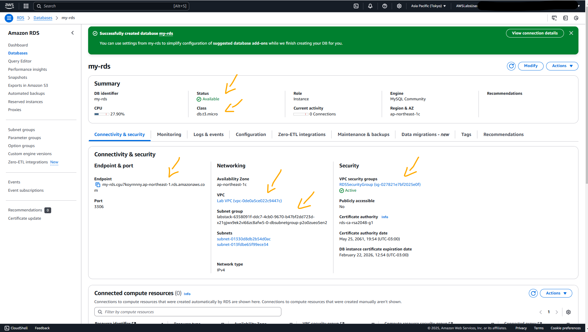
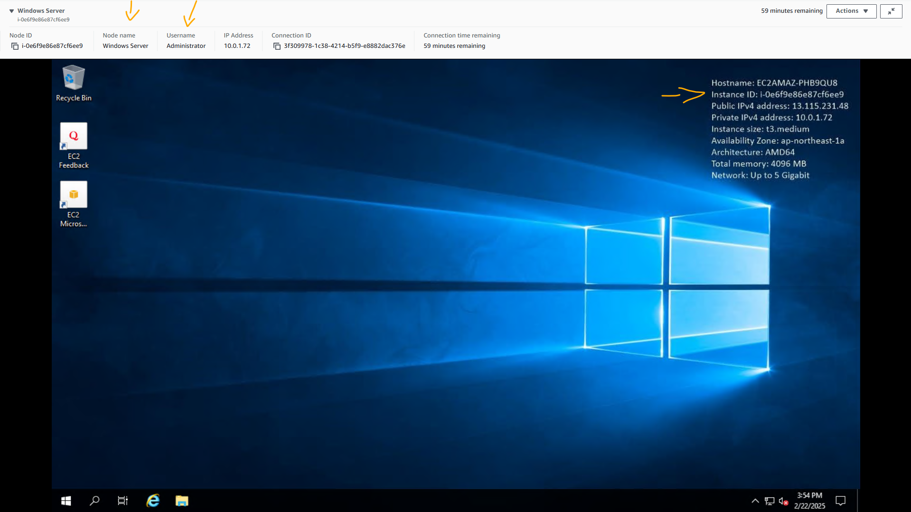
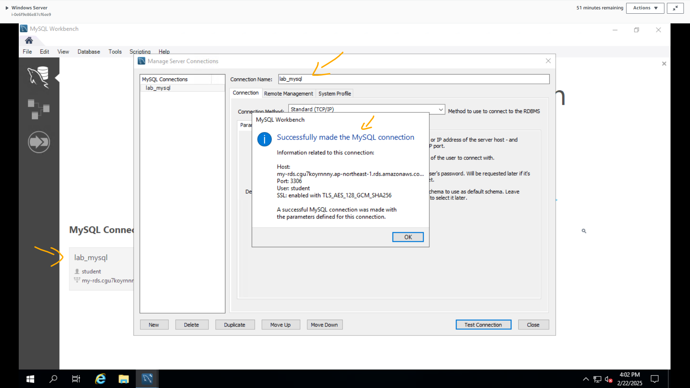
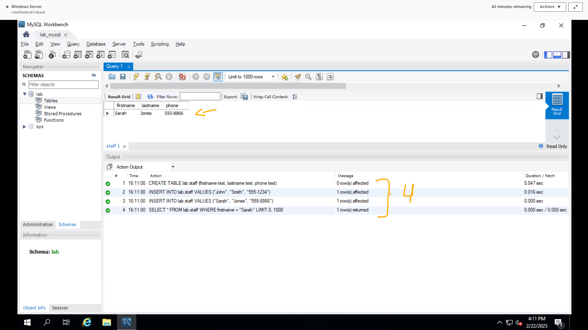

# Lab - Introduction to Amazon Relational Database Service (RDS) (Windows)   

### AWS Skill Builder <a href="../../">aws_skill_builder   </a>
### Training Category: <a href="../../self_paced_lab">self_paced_lab</a>
### Software/Subject: aws   
### Course: <a href="./">curso_spl_028 (Lab - Introduction to Amazon Relational Database Service (RDS) (Windows))   </a>

#### Parceria da AWS com a Escola da Nuvem (EDN)   

---

### Theme:
- Cloud Computing
- Data

### Used Tools:
- Operating System (OS): 
  - Windows 11   
  - Windows Server   
- Cloud:
  - Amazon Web Services (AWS)   
- Cloud Services:
  - Amazon Elastic Compute Cloud (EC2)   
  - Amazon Relational Database Service (RDS)   
  - Amazon Virtual Private Cloud (VPC)   
  - AWS Systems Manager (SSM)   
  - Google Drive   
- Language:
  - HTML   
  - Markdown   
- Integrated Development Environment (IDE) and Text Editor:
  - Visual Studio Code (VS Code)   
- Versioning: 
  - Git   
- Repository:
  - GitHub   
- Command Line Interpreter (CLI):
  - Bash e Sh   

---

<a name="item0"><h3>Course Strcuture:</h3></a>
1. Lab - Introduction to Amazon Relational Database Service (RDS) (Windows) 
1.1 <a href="#item01.1">Tarefa 1: Criar uma instância do Serviço de Banco de Dados Relacional (RDS)</a> 
1.2 <a href="#item01.2">Tarefa 2: Efetue login na sua instância EC2</a> 
1.3 <a href="#item01.3">Tarefa 3: Acesse seu banco de dados</a> 

---

### Objective:
Este laboratório teve como objetivo provisionar uma instância de banco de dados **MySQL** no **Amazon Relational Database Service (RDS)** e acessar remotamente de forma gráfica uma instância do **Amazon Elastic Compute Cloud (EC2)**, com sistema operacional **Windows Server**, por meio do *Fleet Manager* do **AWS Systems Manager (SSM)**. A partir dessa instância, foi utilizado o software **MySQL Workbench**, que já estava instalado, para conectar-se ao banco de dados e interagir com ele. Este laboratório foi parecido com o [curso_spl_028](https://github.com/PedroHeeger/aws_skb/tree/main/self_paced_lab/curso_spl_028), sendo diferenciado na forma de acesso ao banco de dados **MySQL**, onde neste foi utilizado um software GUI e o outro uma CLI.

### Structure:
A estrutura do curso é formada por:
- Este arquivo de README.
- A pasta `0-aux`, pasta auxiliar com imagens utilizadas na construção desse arquivo de README.

### Development:
Este curso foi um laboratório prático realizado na plataforma **AWS Skill Builder**, cuja subscrição foi devida a uma parceria entre a **AWS** e a **Escola da Nuvem**. A infraestrutura de cloud utilizada foi fornecida através de um sandbox do **AWS Skill Builder** que possibilitava acesso ao console da **AWS**. Contudo foi necessário seguir estritamente as orientações determinadas no laboratório. Dessa maneira, a forma de interação com os recursos da cloud foram sempre através do console fornecido pelo sandbox, a não ser em casos em que o próprio laboratório instruiu para utilização de outras ferramentas de interação como **AWS CLI** ou **AWS SDK**.

O laboratório do **AWS Skill Builder** tem o foco em executar apenas o que é orientado no escopo, todos os recursos ou serviços que podem ser requisitados adicionalmente já vêm provisionados por padrão pelo laboratório. Ao iniciar o laboratório, o sandbox do **AWS Skill Builder** provisiona diversos recursos e serviços para o funcionamento através de uma ou mais pilhas do **AWS CloudFormation** de forma automática. 

O acesso ao console no sandbox do **AWS Skill Builder** é realizado por meio de uma identidade federada. O Skill Builder funciona como um provedor de identidade (IdP), autenticando o usuário e vinculando-o a uma role do **AWS IAM** provisionada automaticamente por uma das pilhas do CloudFormation. Essa role concede permissões temporárias e mínimas necessárias para a execução do laboratório, garantindo segurança e controle sobre os recursos utilizados. O laboratório, por padrão, determina a região a ser utilizada e ela não deve ser alterada, somente se o próprio laboratório indicar. As configurações não informadas no laboratório devem ser sempre mantidas como padrão que estão.

<a name="item01.1"><h4>Tarefa 1: Criar uma instância do Serviço de Banco de Dados Relacional (RDS)</h4></a>[Back to summary](#item0)

O **Amazon Relational Database Service (RDS)** é um serviço web que facilita a configuração, operação e dimensionamento de bancos de dados relacionais na nuvem. Ele permite que seja criado e utilizado bancos de dados **MySQL**, **PostgreSQL**, **Oracle** ou **Microsoft SQL Server**. Isso significa que o código, os aplicativos e as ferramentas que já são utilizadas hoje com os bancos de dados existentes podem ser usados ​​com o **Amazon RDS**. Portanto, nesta primeira tarefa, o objetivo foi provisionar um banco de dados **MySQL** no **Amazon RDS**, configurando da seguinte forma:
- `Engine type` (Tipo de mecanismo): `MySQL`.
- `Templates` (Modelos): `Dev/Test` (Dev/Teste).
- Na seção `Availability and durability` (Disponibilidade e durabilidade), foi configurado o seguinte:
    - `Deployment options` (Opções de implantação): `Single DB instance` (Instância de banco de dados única).
- Na seção `Settings` (Configurações) foi configurado o seguinte:
    - `DB instance identifier` (Identificador da instância do BD): `my-rds`.
    - `Master username` (Nome de usuário mestre): `student`.
    - `Credentials management` (Gerenciamento de credenciais): `Self managed` (Autogerenciado).
        - `Master password` (Senha mestra): o valor do parâmetro `DBPassword` nas instruções desse laboratório foi utilizado (`oSFY69loETGG`).
        - `Confirm master password` (Confirmar senha mestra): o valor do parâmetro `DBPassword` nas instruções desse laboratório foi utilizado (`oSFY69loETGG`).
- Na seção `Instance configuration` (Configuração da instância) foi configurado o seguinte:
    - `DB instance class` Classe de instância de BD: `Burstable classes (includes t classes)` (classes Burstable (inclui classes t)).
    - No menu suspenso, foi escolhido o `Instance type` (tipo de instância): `db.t3.micro`.
- Na seção `Connectivity` (Conectividade) foi configurado o seguinte:
    - `Virtual private cloud (VPC)` Nuvem privada virtual (VPC): `Lab VPC`.
    - `DB subnet group` (Grupo de sub-redes do BD): foi escolhido o grupo de sub-redes já provisionado pelo lab, cujo nome era `labstack-6358091f-ddc7-4cb0-9670-b47bf2dd723d-x21gjwx9ek2vi66zc8afw5-0-dbsubnetgroup-p2o0zueo5en2`.
    - `Public access` (Acesso público): `No` (Não).
    - `VPC security group (firewall)` (Grupo de segurança VPC (firewall)): `Choose existing` (Escolher existente).
    - `Existing security group VPC` (Grupos de segurança VPC existentes): Apenas o grupo de segurança do banco dados, cujo nome era `RDSSecurityGroup`, foi mantido, todos os demais foram removidos.
- Na seção `Monitoring` (Monitoramento): foi desmarcado `Enable Enhanced monitoring` (Habilitar Monitoramento aprimorado).
- A seção de `Additional configuration` (Configuração adicional) foi expandida:
    - Na seção `Database options` (Opções do banco de dados) foi configurado o seguinte:
        - `Initial database name` (Nome inicial do banco de dados): `lab`.
    - Na seção `Backup`: foi desmarcado `Enable automated backups` (Habilitar backups automatizados).
    - Na seção `Maintenance` (Manutenção): foi desmarcada `Enable auto minor version update` (Habilitar atualização automática de versão secundária).
- A janela pop-up `my-rds suggestions complements` (Complementos sugeridos para my-rds) foi fechada.

A instância levou alguns minutos até ficar disponível. A imagem 01 evidencia a instância do **Amazon RDS** com banco de dados **MySQL** provisionada com sucesso.

<figure>
     
    <figcaption>Imagem 01.</figcaption>
</figure>
 

<a name="item01.2"><h4>Tarefa 2: Efetue login na sua instância EC2</h4></a>[Back to summary](#item0)

Na segunda tarefa, o objetivo foi conectar-se a uma instância do **Amazon Elastic Compute Cloud (EC2)**, de sistema operacional **Windows Server**, usando o recurso *Fleet Manager* do **AWS Systems Manager**, para então conectar-se a instância de banco de dados do RDS. A instância EC2, que tinha sido provisionada pela pilha do **AWS CloudFormation** com o **MySQL Workbench** instalado, funcionava como um Bastion Host. Todas as instâncias do **Amazon EC2** recebem dois endereços IP no lançamento: um endereço IP privado (RFC 1918) e um endereço IP público que são mapeados diretamente um para o outro por meio da Network Address Translation (NAT). Endereços IP privados só podem ser acessados ​​de dentro da rede do **Amazon EC2**. Endereços públicos podem ser acessados ​​da Internet. Com base nessa explicação, ficou evidente que tanto a instância do EC2 como a instância do RDS tinham que estar na mesma rede (**Amazon VPC**).

O laboratório facilitou o processo ao fornecer no parâmetro `WindowsInstanceSessionRDP` das instruções, a URL completa (`https://ap-northeast-1.console.aws.amazon.com/systems-manager/managed-instances/rdp-connect?region=ap-northeast-1&instances=i-0e6f9e86e87cf6ee9`) para a conexão por *Fleet Manager* a instância do EC2, cujo nome era `Command Host`. Nesta forma de acesso não era preciso liberar a porta `3389` (porta padrão do protocolo `RDP`) no security group, porém, diferentemente do *Session Manager*, era necessário um par de chaves para autenticação. O **Remote Desktop Protocol (RDP)** é um protocolo desenvolvido pela **Microsoft** para permitir o acesso remoto a um computador ou servidor Windows. Ele possibilita que um usuário controle um sistema remotamente como se estivesse fisicamente presente, incluindo acesso à interface gráfica, execução de aplicativos e gerenciamento de arquivos. O *Fleet Manager* facilita isso ao fazer essa comunicação sem liberação de portas. Entretanto, ao autenticar o usuário que faria o acesso, no caso era o usuário padrão do **Windows Server** (`Administrator`), uma senha era necessária para autenticação. Essa senha podia ser obtida através de uma desencriptação do arquivo de chave privada ou simplesmente fornecedo o arquivo de chave privada do par de chaves vinculado a instância do **Amazon EC2**. A imagem 02 comprova que o acesso remoto gráfico foi realizado corretamente. O arquivo de chave privada foi disponibilizado nos formatos `.pem` e `.ppk` para serem baixados nas instruções desse laboratório. Neste caso, foi utilizado o formato `.pem`. Apesar de não precisar, o grupo de segurança dessa instância tinha uma regra liberando a porta `3389`, onde rodava o protocolo `RDP`, para todos os IPs (`0.0.0.0/0`), isso foi feito caso o acesso remoto fosse originado da própria máquina física **Windows**, com a utilização de software como o **Remote Desktop Connection (RDC)**, chamado também de Conexão de Área de Trabalho Remota.

<figure>
     
    <figcaption>Imagem 02.</figcaption>
</figure>
 

<a name="item01.3"><h4>Tarefa 3: Acesse seu banco de dados</h4></a>[Back to summary](#item0)

Como neste lab o acesso remoto era gráfico, no interface gráfica disponibilizada foi aberto o **MySQL Workbench**. Uma mensagem de aviso pode aparecer alertando que o sistema operacional não é suportado, mas ela pode ser ignorada. No Workbench, o comando `mysql --user student --password --host ENDPOINT` é executado de forma no-code, pelo menos para o usuário. Neste caso, as janelas foram utilizadas para configurar a conexão da seguinte forma:
- `Connection Name` (Nome da conexão): `lab_mysql`.
- `Hostname` (Nome do host): foi removido o texto existente e inserido o Endpoint da instância do RDS (`my-rds.cgu7koyrnnny.ap-northeast-1.rds.amazonaws.com`).
- `Username` (nome de usuário): `student`.
- `Password` (Senha): foi escolhido `Store in Vault` (Armazenar no Cofre) e inserido a senha tinha sido configurada com o valor do parâmetro `DBPassword` (`oSFY69loETGG`).

A imagem 03 mostra essa conexão criada com sucesso.

<figure>
     
    <figcaption>Imagem 03.</figcaption>
</figure>
 

Um ponto de observação era que o grupo de segurança vinculado a instância de banco de dados já possuía uma regra de entrada liberando comunicação na porta `3306` (porta padrão do **MySQL**), não apenas para o security group da instância do EC2, mas para todos os IPs (`0.0.0.0/0`). Isso era para caso o **MySQL Workbench** ou qualquer outro software de administração de banco de dados fosse utilizado pela máquina física **Windows** para acessar o banco de dados, porém não funcionaria devido a definição de não acesso público, ou seja, apenas máquinas na mesma rede da instância RDS conseguiriam acessá-la. Após conectado ao banco de dados, os seguintes comandos SQL foram executados no Workbench:
- `CREATE TABLE lab.staff (firstname text, lastname text, phone text);`: Criava uma tabela de nome `staff` no banco de dados de nome `lab`.
- `INSERT INTO lab.staff VALUES ("John", "Smith", "555-1234");`: Inseria uma linha de dados nesta tabela.
- `INSERT INTO lab.staff VALUES ("Sarah", "Jones", "555-8866");` Inseria uma segunda linha de dados nesta tabela.
- `SELECT * FROM lab.staff WHERE firstname = "Sarah";`: Selecionava todos os atributos da tabela `staff` que tivesse o valor `Sarah` no atributo `firstname`.

A imagem 04 exibe esses comandos executados no banco de dados da instância RDS através do Workbench executado na instância do **Amazon EC2**.

<figure>
     
    <figcaption>Imagem 04.</figcaption>
</figure>
 