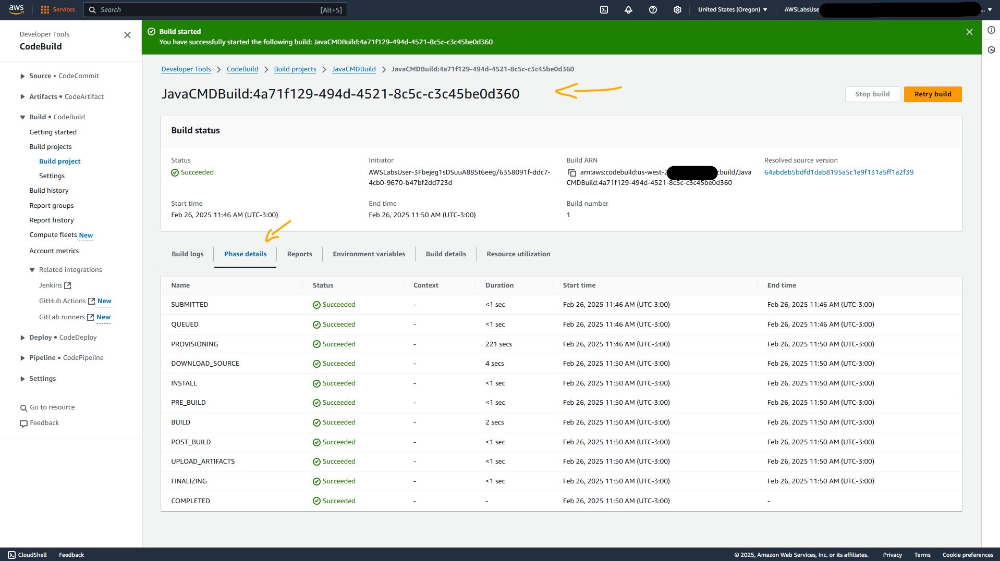
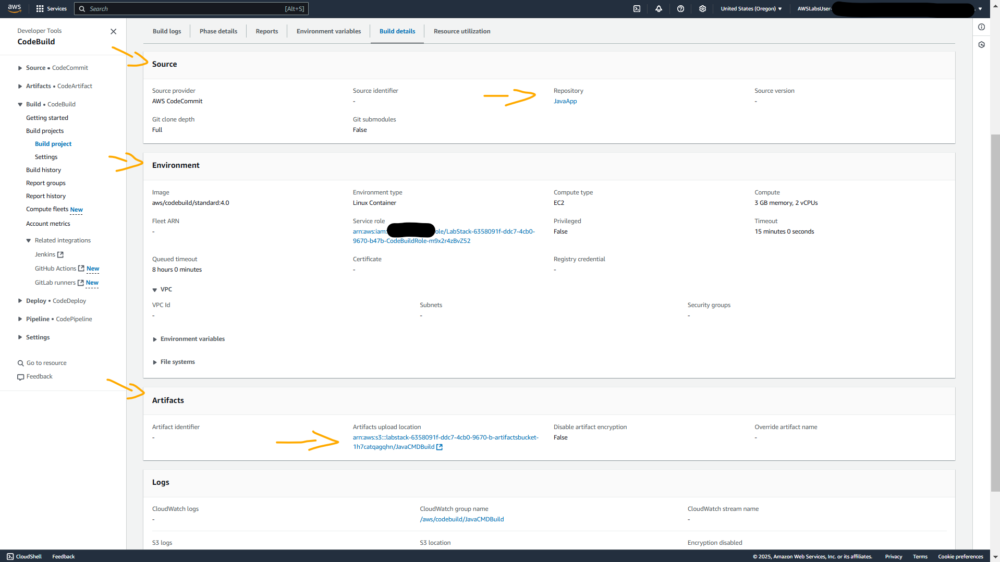

# Lab - AWS CodeBuild Hello World   

### AWS Skill Builder <a href="../../">aws_skill_builder   </a>
### Training Category: <a href="../../self_paced_lab">self_paced_lab</a>
### Software/Subject: aws   
### Course: <a href="./">curso_spl_029 (Lab - AWS CodeBuild Hello World)   </a>

#### Parceria da AWS com a Escola da Nuvem (EDN)   

---

### Theme:
- Cloud Computing

### Used Tools:
- Operating System (OS): 
  - Windows 11   
- Cloud:
  - Amazon Web Services (AWS)   
- Cloud Services:
  - Amazon CloudFront   
  - Amazon DynamoDB   
  - Amazon Elastic Compute Cloud (EC2)   
  - AWS Command Line Interface (CLI)   
  - AWS Software Development Kit (SDK) - Boto3   
  - Google Drive   
- Language:
  - HTML   
  - Java   </a>
  - Markdown   
  - Python   
- Integrated Development Environment (IDE) and Text Editor:
  - Visual Studio Code (VS Code)   
- Versioning: 
  - Git   
- Repository:
  - GitHub   
- Command Line Interpreter (CLI):
  - Bash e Sh   
- Library:
  - jQuery   

---

<a name="item0"><h3>Course Strcuture:</h3></a>
1. Lab - AWS CodeBuild Hello World<br>
1.1 <a href="#item01.1">Tarefa 1: Conecte-se ao AWS Cloud9 IDE e clone o repositório CodeCommit</a><br>
1.2 <a href="#item01.2">Tarefa 2: Compilar e executar o programa Java localmente</a><br>
1.3 <a href="#item01.3">Tarefa 3: Atualizar o aplicativo Java e enviar as alterações para o AWS CodeCommit</a><br>
1.4 <a href="#item01.4">Tarefa 4: iniciar um projeto de compilação do CodeBuild com o console do CodeBuild</a><br>
1.5 <a href="#item01.5">Tarefa 5: Copie o arquivo Hello.jar para o AWS Cloud9 IDE e execute-o localmente</a><br>

---

### Objective:
Este laboratório teve como objetivo clonar um repositório do **AWS CodeCommit** contendo um programa em **Java** para a IDE **AWS Cloud9**. Após a clonagem, o programa foi atualizado, compilado e executado localmente no Cloud9. Em seguida, a nova versão foi enviada para o mesmo repositório no CodeCommit. Posteriormente, o código atualizado foi processado pelo **AWS CodeBuild**, gerando um artefato armazenado no **Amazon S3**. Por fim, esse artefato foi utilizado para executar novamente o aplicativo no ambiente local (Cloud9).  

### Structure:
A estrutura do curso é formada por:
- Este arquivo de README.
- A pasta `0-aux`, pasta auxiliar com imagens utilizadas na construção desse arquivo de README.

### Development:
Este curso foi um laboratório prático realizado na plataforma **AWS Skill Builder**, cuja subscrição foi devida a uma parceria entre a **AWS** e a **Escola da Nuvem**. A infraestrutura de cloud utilizada foi fornecida através de um sandbox do **AWS Skill Builder** que possibilitava acesso ao console da **AWS**. Contudo foi necessário seguir estritamente as orientações determinadas no laboratório. Dessa maneira, a forma de interação com os recursos da cloud foram sempre através do console fornecido pelo sandbox, a não ser em casos em que o próprio laboratório instruiu para utilização de outras ferramentas de interação como **AWS CLI** ou **AWS SDK**.

O laboratório do **AWS Skill Builder** tem o foco em executar apenas o que é orientado no escopo, todos os recursos ou serviços que podem ser requisitados adicionalmente já vêm provisionados por padrão pelo laboratório. Ao iniciar o laboratório, o sandbox do **AWS Skill Builder** provisiona diversos recursos e serviços para o funcionamento através de uma ou mais pilhas do **AWS CloudFormation** de forma automática. 

O acesso ao console no sandbox do **AWS Skill Builder** é realizado por meio de uma identidade federada. O Skill Builder funciona como um provedor de identidade (IdP), autenticando o usuário e vinculando-o a uma role do **AWS IAM** provisionada automaticamente por uma das pilhas do CloudFormation. Essa role concede permissões temporárias e mínimas necessárias para a execução do laboratório, garantindo segurança e controle sobre os recursos utilizados. O laboratório, por padrão, determina a região a ser utilizada e ela não deve ser alterada, somente se o próprio laboratório indicar. As configurações não informadas no laboratório devem ser sempre mantidas como padrão que estão.

<a name="item01.1"><h4>Tarefa 1: Conecte-se ao AWS Cloud9 IDE e clone o repositório CodeCommit</h4></a>[Back to summary](#item0)

O **AWS Cloud9** é um IDE baseado em nuvem que pode ser utilizada para escrever, executar e depurar código com apenas um navegador. Ele inclui um editor de código, depurador e terminal. O **AWS Cloud9** vem pré-empacotado com ferramentas essenciais para linguagens de programação populares, incluindo **JavaScript**, **Python**, **PHP** e muito mais. Não é necessário instalar arquivos ou configurar a máquina de desenvolvimento para iniciar novos projetos. 

O **AWS CodeCommit** é um sistema de controle de versão totalmente gerenciado que hospeda repositórios **Git** (também conhecidos como repos) e funciona perfeitamente com as ferramentas existentes baseadas em **Git**. Ele fornece um ambiente seguro e escalável para hospedar e gerenciar código-fonte para que vários desenvolvedores possam colaborar em um projeto. Alguns dos principais recursos e características do CodeCommit são listados abaixo:
- Serviço gerenciado: 
    - O CodeCommit é um serviço gerenciado, o que significa que a **AWS** cuida do dimensionamento, backup e tempo de atividade dos repositórios. Não sendo necessário se preocupar em configurar, gerenciar ou dimensionar nenhuma infraestrutura.
- Segurança:
    - Os repositórios do CodeCommit são criptografados em repouso e em trânsito.
    - É possível controlar quem pode acessar o repositório e quais ações eles podem executar usando o **AWS Identity and Access Management (IAM)**.
    - Ele oferece suporte a políticas baseadas em recursos para definir permissões em nível de repositório.
- Colaboração:
    - Vários desenvolvedores podem colaborar no mesmo projeto sem interferir no trabalho uns dos outros.
    - O CodeCommit oferece suporte a solicitações de pull para melhorar a colaboração e as revisões de código.
- Integração com serviços **AWS**:
    - O CodeCommit pode ser integrado a outros serviços da **AWS**, como **AWS CodeBuild**, **AWS CodeDeploy** e **AWS CodePipeline**, para criar um pipeline completo de integração e entrega contínua (CI/CD).
    - Ele também se integra ao **Amazon CloudWatch** para monitoramento e ao **AWS CloudTrail** para auditoria.
- Escalabilidade e durabilidade:
    - O CodeCommit é dimensionado automaticamente para atender às crescentes necessidades do projeto.
    - Ele armazena dados de forma redundante em várias instalações e foi projetado para fornecer alta disponibilidade e durabilidade de dados.
- Notificações:
    - É possível configurar gatilhos e notificações para ser informado sobre os eventos no repositório usando o **AWS Lambda**, o **Amazon Simple Notification Service (SNS)** ou o **Amazon CloudWatch Events**.
- Custo-efetivo:
    - Com o CodeCommit, somente é pago pelo que for utilizado, sem taxas iniciais ou compromissos de longo prazo.
- Compatibilidade:
    - Ele usa o protocolo **Git** padrão para compatibilidade com as ferramentas **Git** existentes.
- Repositórios ilimitados:
    - É possível criar quantos repositórios precisar, praticamente sem restrições.

O **AWS CodeCommit** é adequado para empresas e desenvolvedores individuais que desejam um repositório **Git** escalável, seguro e gerenciado, sem a sobrecarga de gerenciar a infraestrutura e garantindo tempo de atividade e escalabilidade. Para este laboratório, o pacote de software **Git** já tinha sido instalado e configurado globalmente com o usuário definido como `Student` e o e-mail definido como `student@example.com` para suprimir mensagens sobre a configuração de um usuário e endereço de e-mail. **Python** e **JQuery** também foram instalados. A **AWS Command Line Interface (AWS CLI)** foi atualizada para a versão 2.

Na primeira tarefa, o objetivo foi conectar-se ao **AWS Cloud9**, clonar o repositório **Git** de nome `JavaApp` do **AWS CodeCommit** e revisar os arquivos **Java** para entender como funcionava a aplicação que seria utilizada. O laboratório facilitou o processo ao fornecer no parâmetro `Cloud9Environment` nas instruções, a URL completa (`https://us-west-2.console.aws.amazon.com/cloud9/ide/a895616034af4d6c931532ebbabcbfe1`) para abrir a IDE do **AWS Cloud9**. Algumas considerações sobre essa IDE:
- No meio da tela, uma única sessão de terminal era aberta no editor. Contudo, era possível abrir várias abas nessa janela para editar arquivos e executar comandos de terminal.
- O navegador de arquivos, também conhecido como árvore de arquivos, ficava no lado esquerdo da tela.
- Um ícone de engrenagem estava no lado direito da tela. Ao clicar, era aberto o painel *AWS Cloud9 Settings*.
- Observação: Cada espaço de trabalho do **AWS Cloud9** recebia automaticamente credenciais do **AWS Identity and Access Management (IAM)**. Essas credenciais forneciam ao espaço de trabalho acesso limitado (com base na sua função federada) a alguns serviços da **AWS** na conta, ou seja, à apenas o que o laboratório permita. Elas são conhecidas como credenciais temporárias gerenciadas pela **AWS**.

O código **Java** para este laboratório já tinha sido elaborado e estava armazenado no repositório `JavaApp` no **AWS CodeCommit**. Dessa forma, o comando `git clone` foi utilizado para clonar o repositório, baixando os arquivos do aplicativo **Java** para a IDE do Cloud9. A **AWS** tornava a clonagem de repositórios CodeCommit mais fácil usando *git-remote-codecommit*, um auxiliar de credencial do **Git**. O auxiliar remoto, *git-remote-codecommit*, usava o perfil da instância que estava configurado para a **AWS CLI**, não exigindo uma adição de configuração ao arquivo `gitconfig`. O auxiliar de credenciais armazenava em cache as credenciais temporárias no cache de credenciais do sistema operacional, o que tornava as credenciais obsoletas após sua expiração. O auxiliar remoto usava um padrão de URL. Se quisesse usar o perfil de instância padrão, poderia acessar os repositórios com o seguinte padrão de URL: `codecommit::{region}://{repositoryname}`. Se quisesse usar um perfil diferente, a URL segue o padrão `codecommit::{region}://{aws_cli_profile}@{repository_name}` (por exemplo, `codecommit::us-west-2://dev-user@JavaApp`), o que torna o processo de trabalhar com repositórios em várias contas mais fácil. É possível armazenar essas URLs em scripts de compilação e arquivos de configuração, e não precisa conectá-las às credenciais que usa para autenticar. Portanto, o comando executado foi `git clone codecommit://JavaApp` que clonou o repositório, conforme evidenciado na imagem 01. Em seguida, todas as pastas filhas do diretório raiz `JavaApp` foram expandidas até chegar no arquivo `Hello.java`.

<div align="Center"><figure>
    <br>
    <figcaption>Imagem 01.</figcaption>
</figure></div><br>

O arquivo `Hello.java` era composto de um programa **Java** simples que, quando compilado, criava um arquivo chamado `Hello.class`. Quando o programa era executado, ele imprimia `Hello World!` no console. O propósito principal de tal programa era demonstrar a estrutura básica de um aplicativo **Java** e confirmar que o ambiente de desenvolvimento **Java** estava configurado corretamente. O código desse arquivo era o seguinte:

```java
package sample;

public Class Hello {
    public static void main(String[] args) {
        System.out.println("Hello World!");
        }
}
```

Cada item desse código é explicado abaixo:
- `package sample;`: Declaração de pacote. Esta linha declarava o nome do pacote como `sample`. Um pacote em **Java** é usado para agrupar classes e interfaces relacionadas. Ele pode ser pensado como uma pasta em um diretório de arquivos. Um pacote ajuda a gerenciar e organizar as classes em um aplicativo grande. Quando esta classe é compilada, ela é colocada em um diretório chamado `sample`.
- `public Class Hello {}`: Declaração de classe. Esta linha declarava uma classe pública chamada `Hello`. Em outra tarefa, era feita referência a esta classe usando o pacote e o nome da classe `sample.Hello` como o ponto de entrada para o programa.
- `public static void main(String[] args) {`: Método principal. O método principal era o ponto de entrada para qualquer aplicativo **Java**. Quando é executado um programa **Java**, ele começa executando o código dentro deste método principal.
- `System.out.println("Hello World!");`: Instrução de impressão: Esta linha de código usava o método `System.out.println()` para imprimir a string `Hello World!` na saída padrão, que normalmente é o console ou terminal onde o programa **Java** é executado.
- `}}`: Chaves de fechamento. Essas chaves de fechamento significam o fim do método principal e da classe `Hello`, respectivamente.

<a name="item01.2"><h4>Tarefa 2: Compilar e executar o programa Java localmente</h4></a>[Back to summary](#item0)

Nesta tarefa, o **AWS Cloud9** IDE foi utilizado para compilar o programa **Java** localmente (no caso, na cloud **AWS**) usando o compilador **Java** (javac). Após compilação, o aplicativo **Java** foi executado no terminal desta IDE, passando a opção `-cp` para especificar o classpath para o aplicativo **Java**. O compilador **Java** faz parte do **Java Development Kit (JDK)**. Ele é usado para traduzir o código-fonte Java (escrito no formato de arquivo `.java`) em bytecode **Java** (salvo no formato de arquivo `.class`).

Portanto, com o comando `cd ~/environment/JavaApp/src` executado no terminal da Cloud9, o diretório corrente foi alterado para a pasta `src`, que era onde a pasta `sample` com o arquivo `Hello.java` estava. Na sequência, com o comando `javac sample/Hello.java`, o programa **Java** foi compilado, produzindo um arquivo de bytecode chamado `Hello.class` no diretório `~/environment/JavaApp/src/sample`. A imagem 02 mostra a execução dos comandos e a geração do arquivo compilado.

<div align="Center"><figure>
    <br>
    <figcaption>Imagem 02.</figcaption>
</figure></div><br>

`Hello.class` era a representação independente de plataforma do programa `Hello.java`. Ele estava pronto para ser executado em qualquer Java Virtual Machine (JVM). Para um mergulho mais profundo nas complexidades deste arquivo e sua aplicação, abaixo são listadas algumas considerações:
- Bytecode compilado: **Java** é uma linguagem de programação compilada, mas em vez de compilar diretamente para código de máquina executável, ele compila para uma forma binária intermediária chamada bytecode. Este bytecode é independente de plataforma, o que significa que ele pode ser executado em qualquer dispositivo ou sistema operacional com uma JVM. O arquivo `Hello.class` contém este bytecode para o arquivo de origem `Hello.java`.
- Execução pela JVM: Quando é executado um programa **Java** com um comando como `java Hello`, a JVM interpreta (ou, com compilação just-in-time, compila) o bytecode em `Hello.class` em código de máquina. O código de máquina é adequado para a arquitetura de computador específica da máquina host.
- Código binário (não legível por humanos): Se tentar abrir e visualizar o arquivo `Hello.class` com um editor de texto padrão, verá um código ininteligível. O bytecode não foi criado para ser legível por humanos, ele foi projetado para ser eficiente para a JVM interpretar (ou compilar) e executar.
- Bytecode gerado pelo compilador Java: quando é compilado `Hello.java` com o comando do compilador javac (como `javac Hello.java`), o compilador produz o arquivo `Hello.class` que contém o bytecode.
- Encapsulamento de código **Java**: O arquivo `.class` contém tudo o que a JVM precisa para executar um programa. Ele encapsula a lógica, estruturas de dados e outros recursos definidos no arquivo de origem `.java`.

Após a compilação bem-sucedida, o programa foi executado com o seguinte comando `java -cp . sample.Hello`, imprimindo no output a frase `Hello World!`, conforme imagem 03.

<div align="Center"><figure>
    <br>
    <figcaption>Imagem 03.</figcaption>
</figure></div><br>

<a name="item01.3"><h4>Tarefa 3: Atualizar o aplicativo Java e enviar as alterações para o AWS CodeCommit</h4></a>[Back to summary](#item0)

Na terceira tarefa, o objetivo consistiu em atualizar o texto de saída gerado no arquivo `Hello.java` e fazer um commit dessa atualização para o repositório `JavaApp` no **AWS CodeCommit**. Após o repositório ser atualizado com o código mais recente, na tarefa seguinte, o  **AWS CodeBuild** foi utilizado para recuperar esse arquivo mais recente do repositório do CodeCommit, executar a compilação e testar o programa **Java**.

Utilizando a IDE **AWS Cloud9**, o arquivo `Hello.java` foi aberto e texto `Hello World!` foi alterado para `Build with AWS CodeBuild!` (Crie com AWS CodeBuild!). Caso seja solicitado `Working with Java` (Trabalhar com Java) em uma janela, seria escolhido `Activate` (Ativar), e em `Extension` (Extensão), a opção `OK`. O texto alterado era de dentro da função de impressão `System.out.println(“Hello World!”)`. Após modificação, conforme imagem 04, o arquivo foi salvo e fechado.

<div align="Center"><figure>
    <br>
    <figcaption>Imagem 04.</figcaption>
</figure></div><br>

Com a alteração feita, essa nova versão do arquivo tinha que ser enviada para o repositório `JavaApp` no **AWS CodeCommit** para que o CodeBuild pudesse utilizar posteriormente. Neste momento, o terminal do Cloud9 estava aberto no diretório `~/environment/JavaApp/src` e para enviar as atualizações era necessário estar na pasta raiz do repositório, que era `JavaApp`. Dessa forma, o comando `cd ~/environment/JavaApp` foi utilizado para alterar para o diretório raiz, que também era conhecido como repositório local (nesta caso, o Cloud9 simulava o ambiente local). Com o comando `git status`, o **Git** identificava as alterações no arquivo `Hello.java` ou em qualquer outro no repositório local comparando com a última versão que ele tinha dos arquivos. Observe que o único arquivo que indicava alteração foi o que o texto do print foi alterado, o `Hello.java`. Com o comando `git add .`, qualquer arquivo que tivesse sido alterado era adicionado na área de staging, e ao executar o comando `git status` novamente, era indicado que esse arquivo já estava adicionado. Em seguida, com o comando `git commit -m "Updated the output text for the Hello.java file."`, o commit era realizado criando uma mensagem que informava do que se tratava esse commit. Ao executar novamente o `git status`, agora, nada aparecia para ser commitado, mas era indicado que o repositório local tinha um commit na frente do repositório remoto (repositório no **AWS CodeCommit**). Sendo assim, o comando `git push` foi executado para enviar os arquivos para o repositório no CodeCommit. A imagem 05 mostra o output das execuções do comando no terminal do Cloud9. Já a imagem 06 evidencia no repositório remoto (CodeCommit), que o commit tinha sido enviado, e portanto, o arquivo do aplicativo **Java** estava atualizado.

<div align="Center"><figure>
    <br>
    <figcaption>Imagem 05.</figcaption>
</figure></div><br>

<div align="Center"><figure>
    <br>
    <figcaption>Imagem 06.</figcaption>
</figure></div><br>

<a name="item01.4"><h4>Tarefa 4: iniciar um projeto de compilação do CodeBuild com o console do CodeBuild</h4></a>[Back to summary](#item0)

O **AWS CodeBuild** é um serviço de integração contínua (CI) totalmente gerenciado. Os desenvolvedores podem usar o CodeBuild para compilar código-fonte, executar testes e produzir pacotes de software prontos para implantação, sem a necessidade de provisionar, gerenciar e dimensionar seus próprios servidores. Os principais recursos e características do CodeBuild são apresentados abaixo:
- Serviço gerenciado:
    - Com o CodeBuild, não é preciso configurar, aplicar patches ou gerenciar servidores de compilação. A **AWS** cuida de todos os aspectos da infraestrutura de compilação.
- Elástico e escalável:
    - O CodeBuild escala automaticamente para atender às necessidades dos projetos de build. Não importa se tem um build ou milhares de builds simultâneos, o CodeBuild é projetado para lidar com a carga.
- Modelo de pagamento conforme o uso:
    - É pago apenas pelos recursos de computação e armazenamento que usar durante a construção, sem custos iniciais.
- Integração com outros serviços da **AWS**:
    - O **AWS CodeBuild** pode ser integrado a outros serviços da **AWS**, como **AWS CodeCommit**, **AWS CodeDeploy** e **AWS CodePipeline** para um pipeline de CI/CD completo.
- Ambientes de construção personalizáveis:
    - É possível usar imagens **Docker** pré-configuradas fornecidas pela **AWS** ou definir a própria imagem **Docker** personalizada. Essa flexibilidade significa que o ambiente de build pode ter as ferramentas exatas de que são necessárias.
- Buildspec: 
    - É definido comandos de compilação e configurações relacionadas com um arquivo de especificação de compilação (`buildspec.yml`). Este arquivo fornece instruções ao CodeBuild sobre como executar a compilação.
- Construções paralelas:
    - Com o CodeBuild, é possível executar várias compilações simultaneamente, o que significa tempos de compilação mais rápidos, especialmente para projetos com vários componentes.
- Seguro:
    - É possível usar o **AWS Identity and Access Management (IAM)** para controlar quem pode acessar os projetos de build. Os artefatos de build também podem ser armazenados com segurança no **Amazon Simple Storage Service (S3)** ou no **AWS Artifact**. Além disso, o CodeBuild foi projetado para ser compatível com os padrões do setor de servidores.
- Cache de ambiente:
    - O CodeBuild oferece suporte ao armazenamento em cache de dependências e artefatos de compilação para acelerar futuras execuções de compilação.
- Registros e monitoramento:
    - A integração com o **Amazon CloudWatch** significa que é possível monitorar eventos e logs de compilação, o que pode ajudar a solucionar falhas de compilação ou problemas de desempenho.
- Controle de fonte flexível:
    - O CodeBuild oferece suporte a vários repositórios de origem, incluindo **AWS CodeCommit**, **GitHub**, **GitHub Enterprise**, **Bitbucket** e **Amazon S3**.
- Suporte de emblema:
    - Para projetos hospedados em repositórios de código-fonte públicos, o CodeBuild pode fornecer emblemas que indicam o status da compilação. Esses emblemas podem ser incorporados em arquivos README.

Um projeto de build se refere ao processo de pegar o código-fonte de um repositório para compilar, testar e empacotá-lo com base nas instruções de um arquivo `buildspec.yml`. Este projeto de build é executado em um ambiente de build específico que é provisionado e gerenciado pelo CodeBuild. Nesta tarefa, o objeito foi revisar o arquivo `buildspec.yml`, fornecido pelo laboratório, para verificar como ele estava configurado, e utilizá-lo no CodeBuild para executar um projeto de build. Este projeto foi configurado para construir um aplicativo de linha de comando baseado em **Java** e armazenar seu artefato de construção em um bucket S3. O ambiente de construção usava um tipo de computação de propósito geral em um contêiner **Linux** padrão. Ele buscava o código-fonte do repositório `JavaApp` no **AWS CodeCommit** e aguardava sua construção em 15 minutos.

O arquivo `buildspec.yml` que seria utilizado, estava na raiz do diretório `JavaApp`, que tinha sido clonado para o **AWS Cloud9**. Este arquivo foi aberto para revisar seu código. Ao revisar o arquivo, foi possível visualizar que os comandos no arquivo `buildspec.yml` executavam os mesmos comandos que tinham sidos executados manualmente na tarefa 2. Este arquivo foi utilizado pelo CodeBuild para automatizar esses comandos. No entanto, havia uma diferença: havia um comando adicional, `jar cf Hello.jar sample/Hello.class`. Este agrupava o arquivo `Hello.class` em um arquivo **Java Archive (.jar)**. Esses arquivos são usados ​​para distribuir vários arquivos de classe **Java** e seus metadados e recursos associados em um arquivo. Abaixo é explicado cada comando do arquivo de build:
- `version: 0.2`: Especificava a versão do formato de arquivo `buildspec`. Esta versão mudava ao longo do tempo conforme atualizações eram feitas no serviço.
- `phases` (fases): continha a sequência das fases de construção e os comandos a serem executados em cada fase.
- `build`: Representava a fase principal de build. Ele continha uma série de comandos que eram executados na ordem em que aparecia.
- `javac src/sample/Hello.java`: Compilava o arquivo de origem `Hello.java`, que criava o arquivo de bytecode `Hello.class`.
- `java - cp src sample.Hello`: Executava o programa Hello. O argumento `-cp src` definia o classpath para `src` diretamente, o que significava que a JVM podia localizar a classe `sample.Hello` para executá-la.
- `cd src`: Alterava o diretório atual para `src`.
- `jar cf Hello.jar sample/Hello.class`: Empacotava o arquivo `Hello.class` em um arquivo `.jar` chamado `Hello.jar`.
- `artifacts` (artefatos): especificava as configurações do artefato de saída da compilação.
- `discard-paths:yes`: Descartava caminhos para os artefatos de saída. Assim, quando era extraído o artefato de saída, a estrutura do diretório não replicava a estrutura do ambiente de construção.
- `files` (arquivos): listava os arquivos ou diretórios incluídos como artefatos de saída da compilação.
- `src/Hello.jar`: especificava o arquivo `Hello.jar` (que era criado na fase de compilação) no diretório `src` como um artefato de saída.
- `name: $CODEBUILD_BUILD_NUMBER`: identificava o artefato de saída, que era nomeado com o número de compilação do projeto CodeBuild para esta compilação. `$CODEBUILD_BUILD_NUMBER` era uma variável de ambiente fornecida pelo **AWS CodeBuild** que continha o número de compilação.

A imagem 07 mostra o arquivo de build aberto na IDE do Cloud9.

<div align="Center"><figure>
    <br>
    <figcaption>Imagem 07.</figcaption>
</figure></div><br>

Após isso, o console do CodeBuild foi aberto e já existia um projeto criado cujo nome era `JavaCMDBuild`. Esse projeto foi o utilizado neste laboratório. Dentro dele, na seção `Configuration` (Configuração), observe que o repositório `Primary` estava definido como `JavaApp`. Este era o mesmo repositório que tinham sido enviadas alterações de código com o **Git** no **AWS CodeCommit**. Quando esse projeto CodeBuild era executado, os artefatos resultantes eram depositados em um diretório dentro do bucket S3 de artefatos. Esse diretório compartilhava seu nome com o projeto de construção, especificamente `JavaCMDBuild`. O caminho de armazenamento preciso para esses artefatos foi localizado na propriedade `Artifacts upload location` (Local de upload dos artefatos) e era possível clicar para abrir direto no bucket do **Amazon S3** correto. Contudo, como nenhum build ainda tinha sido executado de fato, esse bucket estava vazio. A imagem 08 exibe o projeto de build construído no **AWS CodeBuild** e o diretório de artefatos no bucket do S3.

<div align="Center"><figure>
    <br>
    <figcaption>Imagem 08.</figcaption>
</figure></div><br>

Nesse momento, no projeto de build, a compilação foi iniciada e ela levava cerca de 3 minutos para ser concluída. O status mudava para `Em andamento` e os logs de build eram exibidos, conforme mostrado na imagem 09. Este log era atualizado conforme o build progredia pelas suas respectivas fases.

<div align="Center"><figure>
    <br>
    <figcaption>Imagem 09.</figcaption>
</figure></div><br>

Como pode ser visto no log, cada fase foi executada e concluída com sucesso. Quando o comando `java -cp src sample.Hello` foi executado, ele exibiu `Build with AWS CodeBuild!`. Esta mensagem confirmava que o arquivo `buildspec.yml` foi processado e que foi executado com sucesso, assim como o teste local fez no **AWS Cloud9** IDE. Ao selecionar a aba `Phase details` (Detalhes da fase) foi visualizado de cada fase que foi processada: o status, a duração e os horários de início e término, conforme exibido na imagem 10.

<div align="Center"><figure>
    <br>
    <figcaption>Imagem 10.</figcaption>
</figure></div><br>

Já na aba `Build details` (Detalhes da construção), a seção `Environment` ficava ao lado da seção `Source`, que especificava qual repositório do CodeCommit era usado. Nesta seção era possível ver os recursos de ambiente e rede que foram criados para uso pelo projeto de build. A imagem 11 mostra essas informações.

<div align="Center"><figure>
    <br>
    <figcaption>Imagem 11.</figcaption>
</figure></div><br>

A seção `Artifacts` segue a seção `Environment` e informava o bucket de artefatos do S3. Este bucket do S3 armazenava o arquivo `Hello.jar` que foi criado quando o projeto de build foi executado. A imagem 12 evidencia o arquivo criado no bucket do S3.

<div align="Center"><figure>
    <br>
    <figcaption>Imagem 12.</figcaption>
</figure></div><br>

<a name="item01.5"><h4>Tarefa 5: Copie o arquivo Hello.jar para o AWS Cloud9 IDE e execute-o localmente</h4></a>[Back to summary](#item0)

Na última tarefa do lab, o arquivo de artefato `Hello.jar` enviado para o bucket do **Amazon S3** foi copiado para IDE **AWS Cloud9** para ser executado novamente. Para isso, alguns comandos **AWS CLI** foram executados no terminal do Cloud9. O primeiro deles foi `source_bucket=$(aws s3api list-buckets --query "Buckets[?contains(Name, 'artifactsbucket')].Name | [0]" --output text); echo -e "\n\nThe source_bucket value is set to: $source_bucket\n\n"`, que armazenava em uma variável o caminho de onde o arquivo de artefato estava no bucket do S3. Em seguida, com o comando `aws s3 cp s3://$source_bucket/JavaCMDBuild/Hello.jar ./Hello.jar`, esse arquivo foi copiado do S3 para a pasta aberta na IDE, que era a pasta raiz do repositório clonado do CodeCommit, cujo nome era `JavaApp`. Por fim, com o comando `java -cp Hello.jar sample.Hello`, o aplicativo **Java** foi executado, onde o novo texto era impresso no comando print, conforme evidenciado na imagem 13.

<div align="Center"><figure>
    <br>
    <figcaption>Imagem 13.</figcaption>
</figure></div><br>