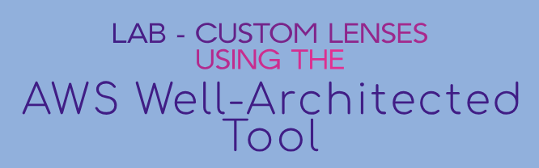

# Lab - Custom Lenses using the AWS Well-Architected Tool   

### AWS Skill Builder <a href="../../">aws_skill_builder   </a>
### Training Category: <a href="../../self_paced_lab">self_paced_lab</a>
### Software/Subject: aws   
### Course: <a href="./">curso_spl_030 (Lab - Custom Lenses using the AWS Well-Architected Tool)   </a>

#### Parceria da AWS com a Escola da Nuvem (EDN)   

---

### Theme:
- Cloud Computing

### Used Tools:
- Operating System (OS): 
  - Windows 11   
- Cloud:
  - Amazon Web Services (AWS)   
- Cloud Services:
  - AWS Well-Architected Framework (WA Framework)   
  - AWS Well-Architected Tool (WA Tool)   
  - Google Drive   
- Language:
  - HTML   
  - Markdown   
- Integrated Development Environment (IDE) and Text Editor:
  - Visual Studio Code (VS Code)   
- Versioning: 
  - Git   
- Repository:
  - GitHub   

---

<a name="item0"><h3>Course Strcuture:</h3></a>
1. Lab - Custom Lenses using the AWS Well-Architected Tool<br>
1.1 <a href="#item01.1">Tarefa 1: Baixe e edite o arquivo de modelo de lente personalizado</a><br>
1.2 <a href="#item01.2">Tarefa 2: Crie uma lente personalizada usando o arquivo json concluído</a><br>
1.3 <a href="#item01.3">Tarefa 3: Criar uma carga de trabalho usando a lente personalizada</a><br>

---

### Objective:
Este laboratório teve como objetivo criar uma lente personalizada no **AWS Well-Architected Tool (WA Tool)** para um cenário hipotético de implementação do **Amazon DynamoDB**. A lente foi definida em um arquivo JSON, contendo um pilar, uma pergunta, quatro opções de resposta e três condições de risco. Por fim, a lente personalizada foi aplicada na criação de uma carga de trabalho.

### Structure:
A estrutura do curso é formada por:
- Este arquivo de README.
- A pasta `0-aux`, pasta auxiliar com imagens utilizadas na construção desse arquivo de README.
- A pasta `resource` com os arquivos utilizados.

### Development:
Este curso foi um laboratório prático realizado na plataforma **AWS Skill Builder**, cuja subscrição foi devida a uma parceria entre a **AWS** e a **Escola da Nuvem**. A infraestrutura de cloud utilizada foi fornecida através de um sandbox do **AWS Skill Builder** que possibilitava acesso ao console da **AWS**. Contudo foi necessário seguir estritamente as orientações determinadas no laboratório. Dessa maneira, a forma de interação com os recursos da cloud foram sempre através do console fornecido pelo sandbox, a não ser em casos em que o próprio laboratório instruiu para utilização de outras ferramentas de interação como **AWS CLI** ou **AWS SDK**.

O laboratório do **AWS Skill Builder** tem o foco em executar apenas o que é orientado no escopo, todos os recursos ou serviços que podem ser requisitados adicionalmente já vêm provisionados por padrão pelo laboratório. Ao iniciar o laboratório, o sandbox do **AWS Skill Builder** provisiona diversos recursos e serviços para o funcionamento através de uma ou mais pilhas do **AWS CloudFormation** de forma automática. 

O acesso ao console no sandbox do **AWS Skill Builder** é realizado por meio de uma identidade federada. O Skill Builder funciona como um provedor de identidade (IdP), autenticando o usuário e vinculando-o a uma role do **AWS IAM** provisionada automaticamente por uma das pilhas do CloudFormation. Essa role concede permissões temporárias e mínimas necessárias para a execução do laboratório, garantindo segurança e controle sobre os recursos utilizados. O laboratório, por padrão, determina a região a ser utilizada e ela não deve ser alterada, somente se o próprio laboratório indicar. As configurações não informadas no laboratório devem ser sempre mantidas como padrão que estão.

<a name="item01.1"><h4>Tarefa 1: Baixe e edite o arquivo de modelo de lente personalizado</h4></a>[Back to summary](#item0)

Na primeira tarefa, o arquivo de modelo JSON de lente personalizada foi baixado e editado, acrescentando os pilares, perguntas e riscos/regras apropriadas para o cenário. O cenário era uma carga de trabalho hipotética de uma implementação do **Amazon DynamoDB**. Esse arquivo foi baixado dentro do console do **AWS Well-Architected Tool**, na seção `Start from template` (Iniciar a partir do modelo) ao construir uma lente personalizada (`Custom lenses`). No entanto, o arquivo era mais fácil de ler depois de ser ligeiramente modificado. Para economizar tempo, uma versão formatada do arquivo de modelo foi disponibilizado pelo laboratório com o nome [custom_lens_template_formatted.json](./resource/custom_lens_template_formatted.json), onde só foi preciso preencher as informações.

A primeira ação de edição foi editar as informações básicas sobre a lente personalizada e definir qual pilar ou pilares seriam cobertos. Dessa forma, o arquivo foi aberto em um editor de código e antes de editado de fato, ele foi revisado. Algumas considereções sobre o arquivo foram listadas abaixo:
- Seção de lentes: informações sobre as lentes descrevendo sua finalidade.
- Seção Pilares: normalmente um ou mais dos seis pilares do **AWS Well-Architected Framework**, ou um pilar personalizado com base nas necessidades do negócio ou carga de trabalho.
- Seção de perguntas: uma ou mais perguntas por pilar a serem feitas sobre a arquitetura atual para identificar oportunidades de melhoria com base nas melhores práticas.
- Seção de opções: até 15 opções para responder à pergunta fornecida.
- Seção Regras de Risco: até três condições com base nas escolhas que definem um nível de risco para a questão.

Em seguida, nas informações da lente, o nome foi alterada para `AnyCompany DynamoDB custom lens` e a descrição para `This is a custom lens addressing an AnyCompany DynamoDB deployment`. Por uma questão de tempo, este laboratório suponhava que os componentes da lente personalizada já tinham sidos determinados, e era preciso editar apenas um pequeno subconjunto das entradas possíveis. No entanto, observe que definir os pilares, perguntas e regras apropriados era a chave para criar uma lente personalizada útil. Coletar feedback das principais partes interessadas, revisar a documentação do desenvolvedor e reservar um tempo para avaliar com precisão os riscos associados a várias opções leva a uma lente personalizada mais robusta. Por exemplo, para criar uma lente personalizada útil para a implementação do AnyCompany DynamoDB, seria útil consultar todos os gerentes de banco de dados, revisar o guia do desenvolvedor do DynamoDB e coordenar os esforços com a equipe que trabalha na análise de alto nível do WA Framework.

Para este lab, foi utilizado os seguintes níveis de pilar, pergunta e risco:
- Pilar: `Confiabilidade`
- Pergunta: `Como você gerenciará os backups do banco de dados?`
- Riscos: `Altos se não forem devidamente abordados, até Nenhum risco se várias boas opções forem escolhidas`

Portanto, o pilar foi editado da seguinte maneira:
- `ID`: `AnyCompanyDDBReliability`.
- `Name` (Nome): `Reliability`.

Com o pilar editado, uma ou mais perguntas podiam ser atribuídas a ele dentro do modelo, mas neste caso, apenas uma pergunta foi criada. Uma das principais facetas de qualquer padrão de confiabilidade de banco de dados é como os backups são manipulados. A pergunta era, portanto, simples: `Como você gerenciará os backups do banco de dados?`. Sendo assim, os campos da primeira e única pergunta do pilar de Confiabilidade foi preenchido da seguinte forma:
- `ID`: `DDBREL1`
- `Title` (Título): `How will you manage database backups?` (Como você gerenciará os backups do banco de dados?)
- `Description` (Descrição): `How will you manage database backups?` (Como você gerenciará os backups do banco de dados?)

Para este laboratório, foi determinado que as seguintes opções seriam escolhas legítimas para o plano de backup do AnyCompany DynamoDB. Lembre-se de que essas escolhas podem ser derivadas de uma revisão cuidadosa da documentação do serviço e de conversas com especialistas no assunto. Observe também que, para o bem do futuro usuário, cada escolha deve ser acompanhada de um link para a documentação apropriada (o helpfulResource) e algo que descreva como a escolha pode melhorar a implementação (o improvementPlan). O mesmo link de URL pode ser utilizado para ambos. As quatro escolhas elaboradas foram as seguintes:
- `Choice 1` (Escolha 1):
    - `ID`: `DDBREL1_1`
    - `Title` (Título): `Use PITR` (Usar PITR)
    - `HelpfulResource` (Recurso útil): `Amazon DynamoDB point-in-time recovery (PITR) provides automatic backups of your DynamoDB table data.` (A recuperação de ponto no tempo (PITR) do Amazon DynamoDB fornece backups automáticos dos dados da sua tabela do DynamoDB.)
    - `URL`: `https://docs.aws.amazon.com/amazondynamodb/latest/developerguide/PointInTimeRecovery_Howitworks.html`
    - `ImprovementPlan` (Plano de melhoria): `After you enable point-in-time recovery, you can restore to any point in time within EarliestRestorableDateTime and LatestRestorableDateTime.` (Depois de habilitar a recuperação de ponto no tempo, você pode restaurar para qualquer ponto no tempo dentro de EarliestRestorableDateTime e LatestRestorableDateTime.)
- `Choice 2` (Escolha 2):
    - `ID`: `DDBREL1_2`
    - `Title` (Título): `Use On-demand backups` (Use backups sob demanda)
    - `HelpfulResource` (Recurso útil): `You can use the DynamoDB on-demand backup capability to create full backups of your tables for long-term retention, and archiving for regulatory compliance needs.` (Você pode usar o recurso de backup sob demanda do DynamoDB para criar backups completos de suas tabelas para retenção de longo prazo e arquivamento para necessidades de conformidade regulatória.)
    - `URL`: `https://docs.aws.amazon.com/amazondynamodb/latest/developerguide/BackupRestore.html`
    - `ImprovementPlan` (Plano de melhoria): `You can back up and restore your table data anytime with a single click on the AWS Management Console or with a single API call. Backup and restore actions run with no impact on table performance or availability.` (Você pode fazer backup e restaurar os dados da sua tabela a qualquer momento com um único clique no AWS Management Console ou com uma única chamada de API. As ações de backup e restauração são executadas sem impacto no desempenho ou na disponibilidade da tabela.)
- `Choice 3` (Escolha 3):
    - `ID`: `DDBREL1_3`
    - `Title` (Título): `Use AWS Backup as centralized hub` (Use o AWS Backup como um hub centralizado)
    - `HelpfulResource` (Recurso útil): `AWS Backup is a fully managed data protection service that makes it easy to centralize and automate backups across AWS services.` (O AWS Backup é um serviço de proteção de dados totalmente gerenciado que facilita a centralização e a automatização de backups em todos os serviços da AWS.)
    - `URL`: `https://docs.aws.amazon.com/amazondynamodb/latest/developerguide/backuprestore_HowItWorksAWS.html`
    - `ImprovementPlan` (Plano de melhoria): `You can create backup policies and plans, you tag them, you can use these plans to define your backup requirements.` (Você pode criar políticas e planos de backup, marcá-los e usar esses planos para definir seus requisitos de backup.)
- `Choice 4` (Escolha 4):
    - `ID`: `DDBREL1_4`
    - `Title` (Título): `Use AWS Backup Audit Manager to audit the compliance of your AWS Backup policies` (Use o AWS Backup Audit Manager para auditar a conformidade de suas políticas de backup do AWS)
    - `HelpfulResource` (Recurso útil): `You can use AWS Backup Audit Manager to audit the compliance of your AWS Backup policies against controls that you define.` (Você pode usar o AWS Backup Audit Manager para auditar a conformidade das suas políticas do AWS Backup em relação aos controles que você define.)
    - `URL`: `https://docs.aws.amazon.com/aws-backup/latest/devguide/aws-backup-audit-manager.html`
    - `ImprovementPlan` (Plano de melhoria): `You can use AWS Backup Audit Manager to find backup activity and resources that are not yet compliant with the controls that you defined.` (Você pode usar o AWS Backup Audit Manager para encontrar atividades de backup e recursos que ainda não estão em conformidade com os controles definidos.)

Por fim, a última seção do arquivo de lente personalizada era sobre os riscos e regras relacionadas às várias escolhas para as perguntas. O objetivo era mostrar quais escolhas ou combinações de escolhas geram o menor risco para a implantação. Para este laboratório, uma matriz bastante simples foi usada. Se todas as opções fossem escolhidas, o plano de backup para a implantação deveria ser o mais robusto possível e receber um nível de risco de `NO_RISK`. No mínimo, esperava-se que o recurso PITR do DynamoDB estivesse habilitado, então o único cenário de `HIGH_RISK` seria onde essa opção não fosse selecionada. Finalmente, caso a questão não seja abordada, uma condição padrão de `MEDIUM_RISK` era aplicada. Então a seção de riscos ficou da seguinte forma:

```json
"riskRules": [
    {
        "condition": "DDBREL1_1 && DDBREL1_2 && DDBREL1_3 && DDBREL1_4",
        "risk": "NO_RISK"
    },
    {
        "condition": "(!DDBREL1_1)",
        "risk": "HIGH_RISK"
    },
    {
        "condition": "default",
        "risk": "MEDIUM_RISK"
    }
]
```

O `&&` era uma verificação de condição “AND”, portanto, essa condição só seria verdadeira se todas as opções fossem selecionadas ao usar a carga de trabalho na **AWS Well-Architected Tool**. O caractere `!` simbolizava uma verificação de condição NOT, portanto, a condição só seria verdadeira se a primeira opção não fosse selecionada ao usar a carga de trabalho na **AWS Well-Architected Tool**.

Todas essas modificações forem feitas em um outro arquivo de nome [lens-CEWACL.json](./resource/lens-CEWACL.json), que era uma cópia do arquivo de modelo.

<a name="item01.2"><h4>Tarefa 2: Crie uma lente personalizada usando o arquivo json concluído</h4></a>[Back to summary](#item0)

Agora com o arquivo editado, a lente personalizada foi construída no **AWS Well-Architected Tool** e o status foi alterado para `DRAFT` (RASCUNHO). Em seguida, a lente foi publicada com o nome de versão `1.0`, modificando seu status para (PUBLICADA), conforme mostrado na imagem 01. 

<div align="Center"><figure>
    <br>
    <figcaption>Imagem 01.</figcaption>
</figure></div><br>

<a name="item01.3"><h4>Tarefa 3: Criar uma carga de trabalho usando a lente personalizada</h4></a>[Back to summary](#item0)

A terceira e última tarefa foi criar uma carga de trabalho que utilizasse a lente personalizada construída. A configuração da carga de trabalho ficou da seguinte forma:
- `Name` (Nome): `My DynamoDB workload` (Minha carga de trabalho do DynamoDB)
- `Description` (Descrição): `This is a DynamoDB workload using a custom lens` (Esta é uma carga de trabalho do DynamoDB usando uma lente personalizada)
- `Review owner` (proprietário da revisão): `AWSLabsUser` (Usuário do AWSLabs)
- `Environment` (Ambiente): `Pre-production` (Pré-produção).
- `Regions` (Regiões): `us-west-2` (Oregon).
- Na tela `Apply lenses` (Aplicar lentes): a lente personalizada `AnyCompany DynamoDB custom lens` foi escolhida para a carga de trabalho.

A imagem 02 evidencia a criação de uma carga de trabalho com essa lente personalizada construída. Já na imagem 03, a única pergunta existente para o único pilar foi respondida selecionando as quatro opções para atender a condição de `NO_RISK`. Note que no canto direito, um menu com os recursos úteis configurados eram exibidos, incluíndo a URL para a documentação.

<div align="Center"><figure>
    <br>
    <figcaption>Imagem 02.</figcaption>
</figure></div><br>

<div align="Center"><figure>
    <br>
    <figcaption>Imagem 03.</figcaption>
</figure></div><br>