# Lab - A Day in the Life of a Data Engineer   

### AWS Skill Builder <a href="../../">aws_skill_builder   </a>
### Training Category: <a href="../../self_paced_lab">self_paced_lab</a>
### Software/Subject: aws   
### Course: <a href="./">curso_spl_031 (Lab - A Day in the Life of a Data Engineer)   </a>

#### Parceria da AWS com a Escola da Nuvem (EDN)   

---

### Theme:
- Cloud Computing
- Data

### Used Tools:
- Operating System (OS): 
  - Windows 11   
- Cloud:
  - Amazon Web Services (AWS)   
- Cloud Services:
  - Amazon Athena  
  - AWS Glue   
  - Google Drive   
- Language:
  - HTML   
  - Markdown   
- Integrated Development Environment (IDE) and Text Editor:
  - Visual Studio Code (VS Code)   
- Versioning: 
  - Git   
- Repository:
  - GitHub   

---

<a name="item0"><h3>Course Strcuture:</h3></a>
1. Lab - A Day in the Life of a Data Engineer<br>
1.1 <a href="#item01.1">Tarefa 1: Criar e executar um crawler do AWS Glue</a><br>
1.2 <a href="#item01.2">Tarefa 2: Revisar políticas do IAM</a><br>
1.3 <a href="#item01.3">Tarefa 3: Visualizar a tabela no Catálogo de dados</a><br>
1.4 <a href="#item01.4">Tarefa 4: Executar um trabalho do AWS Glue Studio para transformar os dados</a><br>
1.5 <a href="#item01.5">Tarefa 5: Consultar a tabela data_parquet no Amazon Athena</a><br>

---

### Objective:
Este laboratório utilizou o conjunto de dados Global Surface Summary of Day (GSOD) da National Oceanic and Atmospheric Administration (NOAA), acessado em 5 de agosto de 2022, via `https://registry.opendata.aws/noaa-gsod`. Esse dataset contém medições meteorológicas diárias, como temperatura, velocidade do vento e pressão, coletadas por mais de nove mil estações ao redor do mundo. Os dados foram originalmente reunidos pelo National Climatic Data Center (NCDC) dos Estados Unidos. Devido às limitações de tempo do laboratório, utilizou-se um subconjunto dos anos disponíveis no dataset completo. O objetivo foi criar um crawler no **AWS Glue** filtrandos os dados, desenvolver e executar um job de ETL (Extract, Transform, Load) no *AWS Glue Studio*, verificar as permissões no **AWS Identity and Access Management (IAM)** e, por fim, consultar os dados transformados usando o **Amazon Athena** para determinar em qual data a empresa fictícia do cenário de lab deveria estocar itens de verão nas cidades para as quais estavam se expandindo.

### Structure:
A estrutura do curso é formada por:
- Este arquivo de README.
- A pasta `0-aux`, pasta auxiliar com imagens utilizadas na construção desse arquivo de README.

### Development:
Este curso foi um laboratório prático realizado na plataforma **AWS Skill Builder**, cuja subscrição foi devida a uma parceria entre a **AWS** e a **Escola da Nuvem**. A infraestrutura de cloud utilizada foi fornecida através de um sandbox do **AWS Skill Builder** que possibilitava acesso ao console da **AWS**. Contudo foi necessário seguir estritamente as orientações determinadas no laboratório. Dessa maneira, a forma de interação com os recursos da cloud foram sempre através do console fornecido pelo sandbox, a não ser em casos em que o próprio laboratório instruiu para utilização de outras ferramentas de interação como **AWS CLI** ou **AWS SDK**.

O laboratório do **AWS Skill Builder** tem o foco em executar apenas o que é orientado no escopo, todos os recursos ou serviços que podem ser requisitados adicionalmente já vêm provisionados por padrão pelo laboratório. Ao iniciar o laboratório, o sandbox do **AWS Skill Builder** provisiona diversos recursos e serviços para o funcionamento através de uma ou mais pilhas do **AWS CloudFormation** de forma automática. 

O acesso ao console no sandbox do **AWS Skill Builder** é realizado por meio de uma identidade federada. O Skill Builder funciona como um provedor de identidade (IdP), autenticando o usuário e vinculando-o a uma role do **AWS IAM** provisionada automaticamente por uma das pilhas do CloudFormation. Essa role concede permissões temporárias e mínimas necessárias para a execução do laboratório, garantindo segurança e controle sobre os recursos utilizados. O laboratório, por padrão, determina a região a ser utilizada e ela não deve ser alterada, somente se o próprio laboratório indicar. As configurações não informadas no laboratório devem ser sempre mantidas como padrão que estão.

<a name="item01.1"><h4>Tarefa 1: Criar e executar um crawler do AWS Glue</h4></a>[Back to summary](#item0)

Na primeira tarefa deste laboratório, foi provisionado um crawler do **AWS Glue** para varrer os dados no bucket do **Amazon Simple Storage Service (S3)**, inferir o esquema dos dados e filtrar dados que seriam incluídos no *AWS Glue Data Catalog* (Catálogo de dados do Glue). O **AWS Glue** é um serviço de integração de dados sem servidor, que pode ser usado para descobrir, preparar e combinar dados para análises, machine learning (ML) e desenvolvimento de aplicativos. O **AWS Glue** oferece todos os recursos necessários para a integração de dados, assim é possível começar a analisá-los e usá-los em uma questão de minutos em vez de meses. Dessa forma, o crawler foi provisionado com a seguinte configuração:
- `Crawler details` (Detalhes do crawler):
  - `Name` (Nome): `weather_crawler`.
  - `Description` (Descrição): `Crawler to read data from Amazon S3`.
- `Data source configuration` (Configuração da origem dos dados):
  - `Is your data already mapped to Glue tables?` (Seus dados já estão mapeados para as tabelas do Glue?): `Not yet` (Ainda não).
- `Data sources` (Origem dos dados):
  - `Data source` (Fonte de dados): `S3`.
  - `Network connection` (Conexão de rede): foi mantido em branco.
  - `Location of S3 data` (Localização dos dados do S3): `In a different account` (Em uma conta diferente).
  - `S3 path` (Caminho do S3): `s3://aws-tc-largeobjects/SPL-TF-200-ANGLUE-1/data/`.
  - `Subsequent crawler runs` (Execuções subsequentes do rastreador): `Crawl all sub-folders` (Rastrear todas as subpastas).
  - `Exclude files matching pattern` (Excluir arquivos que correspondam ao padrão). Pode ser que seja necessário marcar a caixa de seleção mais de uma vez para que o botão `Add new exclusion pattern` (Adicionar novo padrão de exclusão) seja exibido. Os padrões de exclusão impedem que o rastreador leia todos os dados no local de destino. Usar padrões de exclusão ajuda a acelerar o processamento quando não é preciso ingerir todos os dados no local de destino. Ele funciona como uma espécie de filtro. Neste lab, os quatro padrões abaixo foram adicionadados para que dados que contivessem esses padrões fossem ignorados:
    - `Exclude pattern` (Padrão de exclusão): `19**`.
    - `Exclude pattern` (Padrão de exclusão): `200**`.
    - `Exclude pattern` (Padrão de exclusão): `201[0-2]**`.
    - `Exclude pattern` (Padrão de exclusão): `index.html`.
- `IAM role` (Perfil do IAM), para `Existing IAM role` (Perfil do IAM existente): `gluelab`. Essa role tinha sido criada pelo laboratório através das pilhas do CloudFormation.
- `Output configuration` (Configuração de saída): `Add a database` (Adicionar um banco de dados).
  - `Database details` (Detalhes do banco de dados):
    - `Name` (Nome): `weather_data`.
    - `Create database` (Criar banco de dados). Após criar, a guia do navegador `Databases` (Bancos de dados) foi fechado para voltar ao crawler do Glue.
  - `Output configuration `(Configuração de saída), ao lado da lista suspensa `Target database` (Banco de dados de destino): foi selecionado o ícone de atualização.
    - `Target database` (Banco de dados de destino): `weather_data`.
- `Crawler schedule` (Programação do crawler): `On demand` (Sob demanda).

O `State` (Estado) do crawler muda de `Ready` (Pronto) para `Running` (Em execução) ao executá-lo. Agora, o crawler estava lendo dados do bucket do S3 para desenvolver uma tabela do Catálogo de dados. O crawler era executado por cerca de cinco minutos. A imagem 01 evidencia o crawler criado com sucesso.

<div align="Center"><figure>
    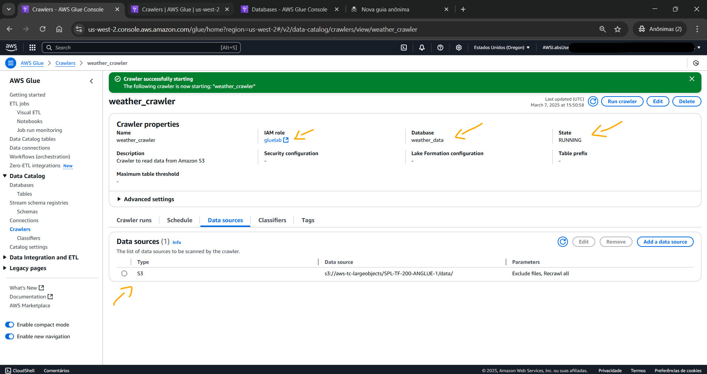<br>
    <figcaption>Imagem 01.</figcaption>
</figure></div><br>

<a name="item01.2"><h4>Tarefa 2: Revisar políticas do IAM</h4></a>[Back to summary](#item0)

Na tarefa 2, o objetivo consistiu em explorar as permissões do **AWS Identity and Access Management (IAM)** que foram usadas para executar os processos do **AWS Glue**. Enquanto aguardava a conclusão da execução do crawler, foi utilizado o console do IAM para revisar a função do `gluelab`. Trata-se da função que foi escolhida quando o crawler do **AWS Glue** foi provisionado. Esta função também foi usada posteriormente, ao executar um trabalho de transformação de dados no *AWS Glue Studio*. Portanto, a role de nome `gluelab` foi aberta, conforme imagem 02. Observe que haviam duas políticas de permissões gerenciadas pela **AWS**, cujos nomes eram: `gluePolicyRestrictS3` e `AWSGlueServiceRole`.

<div align="Center"><figure>
    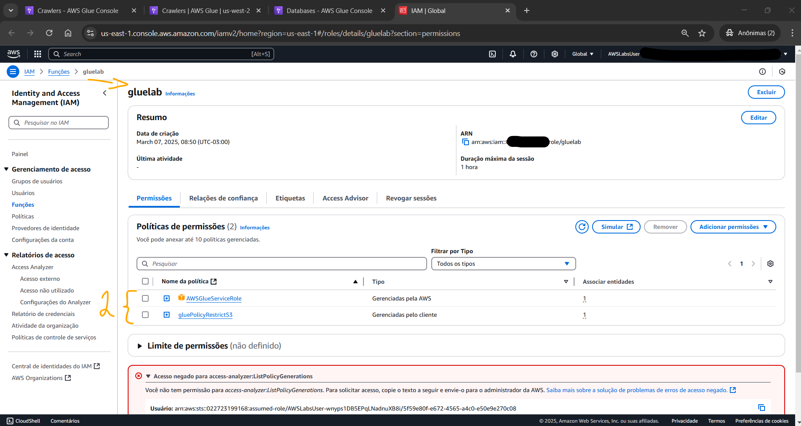<br>
    <figcaption>Imagem 02.</figcaption>
</figure></div><br>

Ao abrir a política `gluePolicyRestrictS3`, verificou-se, conforme imagem 03, que ela concedia ao **Amazon S3** acesso de leitura e gravação para os buckets do S3 do ambiente do laboratório. O crawler do **AWS Glue** construído requeria esses privilégios, pois lia e gravava informações no **Amazon S3** enquanto processa dados.

<div align="Center"><figure>
    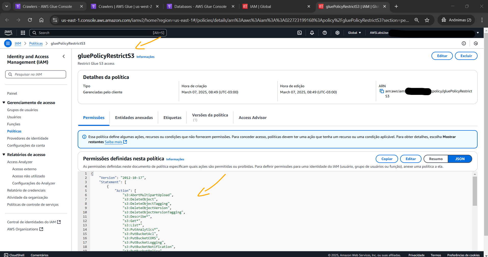<br>
    <figcaption>Imagem 03.</figcaption>
</figure></div><br>

Na sequência, a segunda política de permissões, cujo nome era `AWSGlueServiceRole`, foi aberta, conforme imagem 04. Note que essa política concedia ao **AWS Glue** acesso a serviços relacionados, como **Amazon Elastic Compute Cloud (EC2)**, **Amazon S3** e *Amazon CloudWatch Logs*. Com esses privilégios, o **AWS Glue** podia ler, gravar e processar dados. Ele também podia gravar informações no *Amazon CloudWatch Logs*. Ao observar as entidades anexadas dessa policy, foi notado que o serviço **AWS Glue** era definido. Dessa forma, o **AWS Glue** assumia a função, recebendo todos os privilégios incluídos na política.

<div align="Center"><figure>
    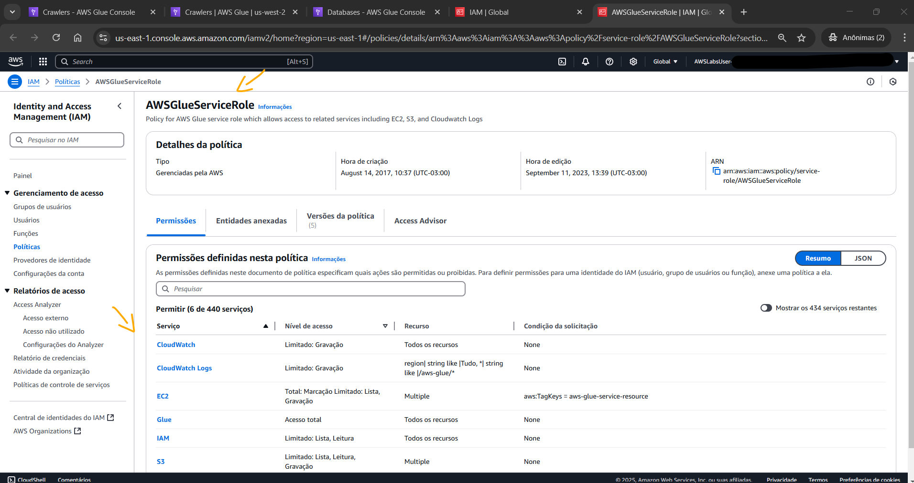<br>
    <figcaption>Imagem 04.</figcaption>
</figure></div><br>

<a name="item01.3"><h4>Tarefa 3: Visualizar a tabela no Catálogo de dados</h4></a>[Back to summary](#item0)

Com o crawler provisionado, nesta tarefa o objetivo foi visualizar a tabela no *AWS Glue Data Catalog*, o catálogo de dados do Glue, que tinha sido adicionada por esse crawler. No console do Glue, em `Data Catalog` (Catálogo de dados) foi selecionado `Tables` (Tabelas). Em `Tables`, havia uma entrada de uma tabela denominada `data` (dados). Observe que a `Classification` (Classificação) desses dados era **CSV**. Essa classificação foi inferida pelo **AWS Glue** durante a leitura dos dados por meio do bucket do S3 de origem. Dessa forma, essa tabela `data` foi acessada para verificar os detalhes dessa tabela e o seu esquema, conforme imagem 05. Essa tabela pertencia ao banco de dados de nome `weather_data` construído pelo crawler do Glue ao ser provisionado.

<div align="Center"><figure>
    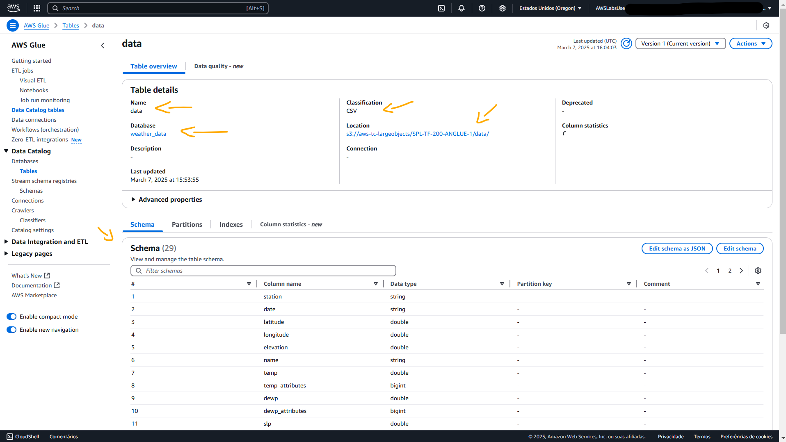<br>
    <figcaption>Imagem 05.</figcaption>
</figure></div><br>

Após verificar os detalhes e esqeuma da tabela, foi verificado também as partições na guia `Partitions` (Partições), mostrada na imagem 06. O conjunto de dados do laboratório no **Amazon S3** incluía dados de 1972 até 2022. No entanto, tinha sido aplicado um filtro ao crawler do **AWS Glue** ao utilizar o campo `Exclude files matching pattern` (Excluir arquivos que correspondam ao padrão), por isso a tabela do Glue continham apenas dados de 2013 a 2022.

<div align="Center"><figure>
    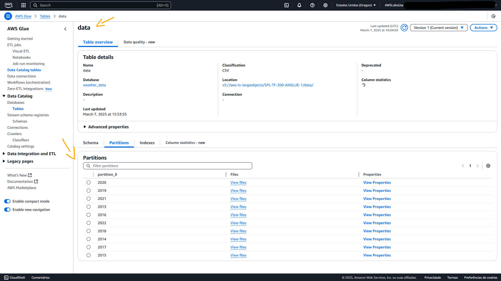<br>
    <figcaption>Imagem 06.</figcaption>
</figure></div><br>

<a name="item01.4"><h4>Tarefa 4: Executar um trabalho do AWS Glue Studio para transformar os dados</h4></a>[Back to summary](#item0)

Na quarta tarefa do lab, o objetivo consistiu em desenvolver e executar um trabalho (`job`) no *AWS Glue Studio*. Ao utilizar um crawler do **AWS Glue**, foi criado uma tabela no Catálogo de dados. No entanto, os dados ainda não estavam prontos para uso, pois um dos tipos de dados precisava ser alterado e muitas colunas do conjunto de dados estavam vazias. Sendo assim, foi necessário criar esse job para transformar os dados. No console do Glue, foi escolhida a opção `Data Integration and ETL` (Integração de dados e ETL), e selecionado `ETL jobs` (Trabalhos ETL). Imediatamente, o navegador exibia a página do *AWS Glue Studio*. No painel `Create job` (Criar trabalho) foi selecionado `Visual ETL`. Na guia `Visual ETL`, no painel `+ Add nodes` (+ Adicionar nós), foi selecionado a guia `Sources` (Fontes) e o **Amazon S3** foi escolhido. Um cartão do **Amazon S3** foi colocado na tela. Este foi selecionado e as seguintes configurações foram realizadas na guia `Data source properties - S3` (Propriedades da fonte de dados - S3):
- `Name` (Nome): `Source S3 bucket`.
- `S3 source type` (Tipo de fonte S3): `Data Catalog table` (tabela do Catálogo de dados).
- `Database` (Banco de dados): `weather_data`.
- `Table` (Tabela): `data` (dados).

A imagem 07 exibe a fonte de dados do job definida como **Amazon S3**.

<div align="Center"><figure>
    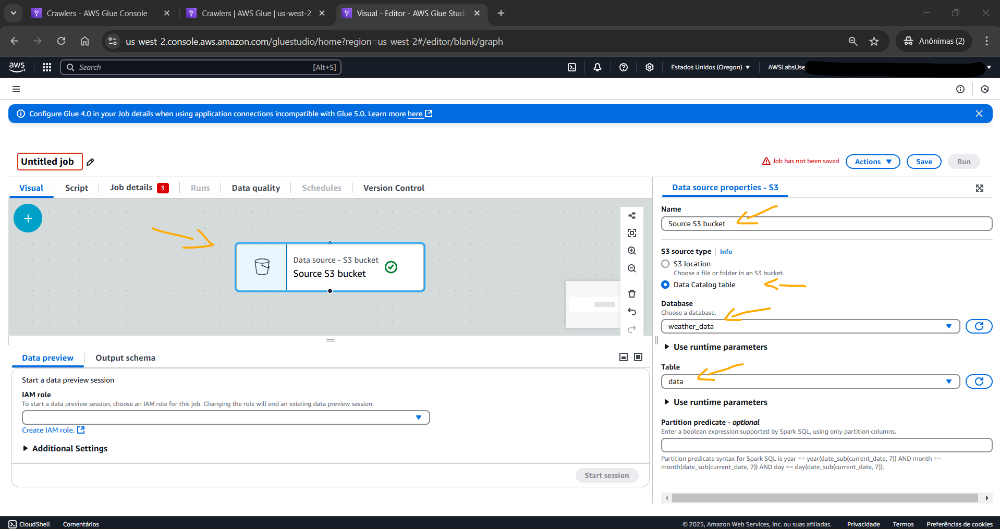<br>
    <figcaption>Imagem 07.</figcaption>
</figure></div><br>

Com a fonte de dados do trabalho definida, agora foi configurado a transformação dos dados. Para isso, o painel `+ Add nodes` (+ Adicionar nós) foi aberto. Nele, a guia `Transforms` (Transformações) foi acessada e escolhido a opção `Change Schema` (Alterar esquema). Um cartão `Change Schema` (Alterar esquema) foi colocado na tela e conectado à fonte de dados. Este cartão foi escolhido para definir as seguintes configurações na seção `Change Schema (Apply mapping)` Alterar Esquema (Aplicar mapeamento):
- Foi alterado o nome do atributo `date` (data).
  - Em `Target key` (Chave de destino): foi substituído `date` por `report_date`.
- Foi alterado o `Data type` (Tipo de dados) do atributo `date` (data):
  - Na lista suspensa `Data type` (Tipo de dados): foi selecionado `date` (data).
- Foram removidos todos os atributos contendo o tipo de dado `long` (longo).
  - Em cada coluna contendo um tipo de dado `long` (longo), em `Drop` (Descartar), foi marcado a caixa de seleção. As colunas removidas do conjunto de dados foram:
    - `temp_attributes`
    - `dewp_attributes`
    - `slp_attributes`
    - `stp_attributes`
    - `visib_attributes`
    - `wdsp_attributes`
    - `frshtt`

A imagem 08 comprovam as transformações que seriam realizadas nos dados.

<div align="Center"><figure>
    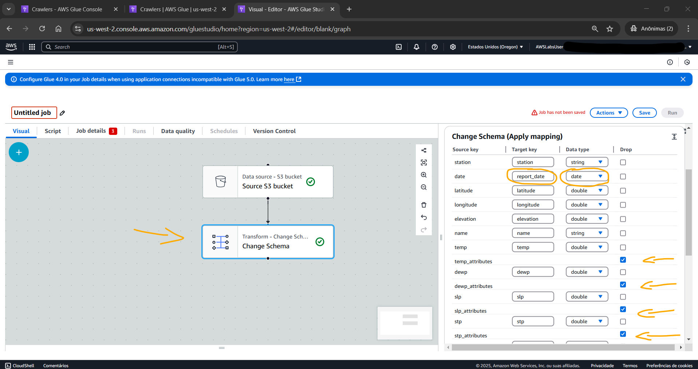<br>
    <figcaption>Imagem 08.</figcaption>
</figure></div><br>

Em seguida, o destino e os detalhes de saída do trabalho foram configurados. Novamente o painel `+ Add nodes` (+ Adicionar nós) foi acessado. A guia `Targets` (Destinos), e depois **Amazon S3** foram selecionadas. Um cartão **Amazon S3** foi colocado na tela e conectado ao cartão `Change Schema` (Alterar esquema). Este cartão foi escolhido e as seguintes configurações foram realizadas na guia `Data target properties - S3` (Propriedades de destino de dados - S3):
- `Name` (Nome): `Target S3 bucket`.
- `Format` (Formatar): `Parquet`.
- `Compression type` (Tipo de compressão): `Uncompressed` (Descompactado).
- `S3 Target Location` (Local alvo no S3), foi escolhido `Browse S3` (Navegar pelo S3), e selecionado o bucket que começava com `glue-bucket-` (`s3://glue-bucket-3969ee50`).
- `Data Catalog update options` (Opções de atualização do Catálogo de Dados): `Create a table in the Data Catalog and on subsequent runs, update the schema and add new partitions` (Crie uma tabela no Catálogo de Dados e, em execuções subsequentes, atualize o esquema e adicione novas partições)
- `Database` (Banco de dados): `weather_data`.
- `Table name` (Nome da tabela): `data_parquet`.
- `Add a partition key` (Adicionar uma chave de partição) e, em `Partition (0)` (Partição), selecione `report_date` (data_do_relatório).

A imagem 09 exibe a configuração de destino e os detalhes de saída do trabalho.

<div align="Center"><figure>
    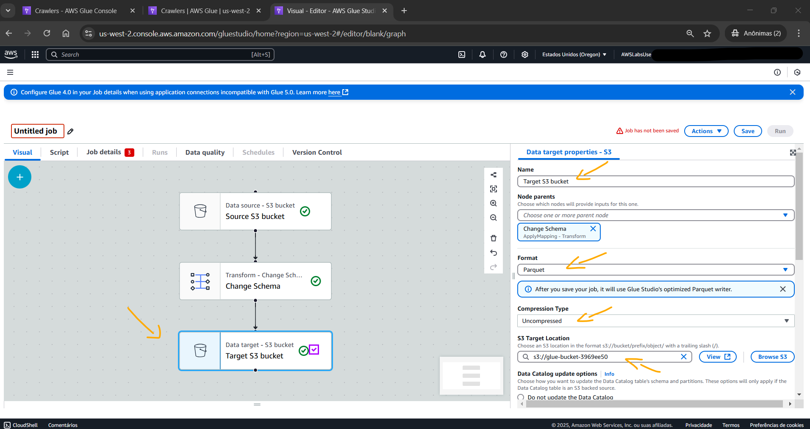<br>
    <figcaption>Imagem 09.</figcaption>
</figure></div><br>

Para finalizar a configuração do job, a guia `Job details` (Detalhes do trabalho) foi acessada e definidas estas configurações:
- `Name` (Nome): `DataPreparation`.
- O `IAM role` (Perfil do IAM): `gluelab`.
- `Advanced properties` (Propriedades avançadas):
  - `Script filename` (Nome de arquivo do script): `data_prep.py`.
  - Acima da tela foi selecionado a guia `Script` para revisar o código **Python** gerado automaticamente por meio do editor visual. Esse método para criar o trabalho fornece um início útil para a criação de código de extração, transformação e carregamento (ETL). Era possível atualizar o script **Python**, se necessário, antes de salvar e executar o trabalho ETL. Para esse trabalho, não foi necessário fazer alterações, portanto, bastava salvar o trabalho e passar para a próxima etapa. 

Após provisionar o trabalho de ETL, o mesmo foi executado. O trabalho levava de 15 a 20 minutos para ser executado. A imagem 10 evidencia que o job de ETL foi provisionado e executado com sucesso.

<div align="Center"><figure>
    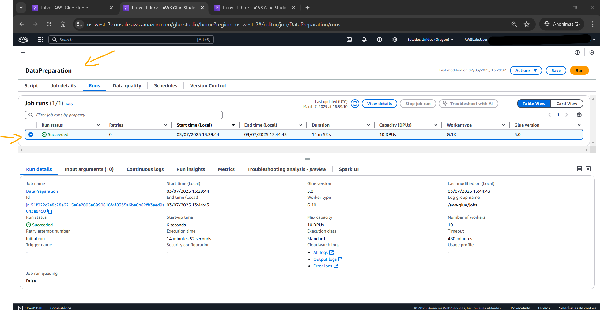<br>
    <figcaption>Imagem 10.</figcaption>
</figure></div><br>

<a name="item01.5"><h4>Tarefa 5: Consultar a tabela data_parquet no Amazon Athena</h4></a>[Back to summary](#item0)

A última tarefa teve como objetivo consultar os dados na tabela `data_parquet`, gerada pelo job de ETL do Glue, com o **Amazon Athena**. O **Amazon Athena** é um serviço de consultas interativas que permite analisar dados no **Amazon S3** usando SQL padrão. O Athena utiliza tecnologia sem servidor, portanto, não há infraestrutura para gerenciar, e somente é pago pelas consultas executadas. Ao abrir o console do Athena, o `Query editor` (Editor de consultas) e a guia `Settings` (Configurações) foram selecionados. Em seguida, a opção `Manage` (Gerenciar) foi escolhida e em `Query result location and encryption` (Localização e criptografia do resultado da consulta), foi escolhido `Browse S3` (Navegar pelo S3). O bucket que iniciva com `query-result-` (resultado-da-consulta) foi escolhido e essa configuração foi salva.

Em seguida, a guia `Editor` foi acessada e no painel `Data (Dados)`, foram definidas as seguintes configurações:
- `Data source` (Fonte de dados): `AWSDataCatalog` (CatálogoDeDadosAWS).
- `Database` (Banco de dados): `weather_data`.

Em `Tables and views` (Tabelas e visualizações), havia duas tabelas: `data` e `data_parquet`. A tabela utilizada para consulta foi `data_parquet`. Caso não encontre uma tabela denominada `data_parquet`, verifique se o trabalho do **AWS Glue** foi concluído. Se o trabalho tiver sido concluído, atualize a página do navegador para que a tabela seja exibida. Ao lado da tabela denominada `data_parquet`, foi selecionadas as reticências. Em `Run Query` (Executar consulta), foi selecionado `Preview Table` (Pré-visualizar tabela). Uma nova guia de consulta foi aberta e a consulta abaixo foi executada automaticamente:

```sql
SELECT * FROM "weather_data"."data_parquet" limit 10;
```

Essa consulta retornava todos os atributos da tabela limitada a apenas 10 linhas. Um nova guia de consulta foi aberta e passado o seguinte comando SQL. Este, selecionava apenas cinco atributos da tabela (data, latitude, longitude, temparatura e precipitação) para as linhas que o atributo `report_date` estivesse entre um intervalo de datas, ordenando por data.

```sql
SELECT report_date, latitude, longitude, temp, prcp 
FROM "weather_data"."data_parquet" 
WHERE report_date between CAST('2022-01-01' AS DATE) and CAST('2022-06-30' AS DATE)
ORDER BY report_date
```

Por fim, o último comando executado foi o abaixo. Este comando consultava as médias de temperatura e precipitação de cada `report_date` entre 1º de janeiro de 2022 e 30 de setembro de 2022. Os dados retornados se organizavam de modo a exibir primeiro o dia mais úmido do período, que no caso foi o dia 22 de Fevereiro de 2022. A imagem 11 mostra o resultado dessa consulta.

```sql
SELECT report_date, avg(temp) as "Avg Temp", avg(prcp ) as "Avg Prcp"
FROM "weather_data"."data_parquet"
WHERE report_date between CAST('2022-01-01' AS DATE) and CAST('2022-09-30' AS DATE)
Group by report_date
Order by 3 desc
```

<div align="Center"><figure>
    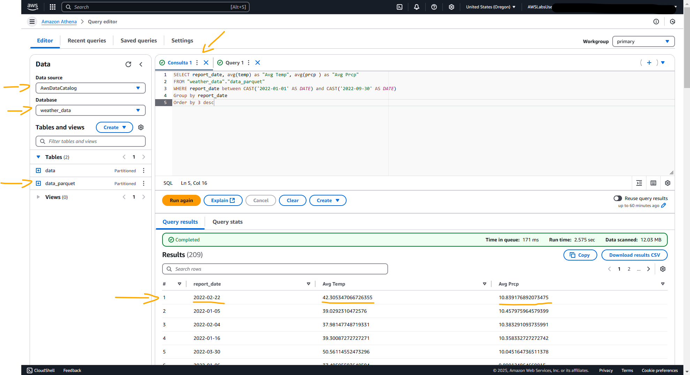<br>
    <figcaption>Imagem 11.</figcaption>
</figure></div><br>