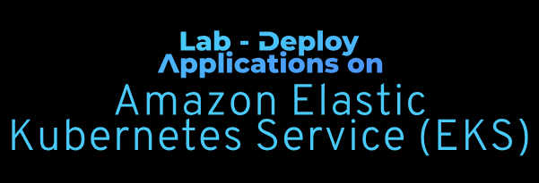

# Lab - Deploy Applications on Amazon Elastic Kubernetes Service(EKS)   . Um cluster EKS é formado por dois componentes principais: 

### AWS Skill Builder <a href="../../">aws_skill_builder   </a>
### Training Category: <a href="../../self_paced_lab">self_paced_lab</a>
### Software/Subject: aws   
### Course: <a href="./">curso_spl_032 (Lab - Deploy Applications on Amazon Elastic Kubernetes Service(EKS))   </a>

#### Parceria da AWS com a Escola da Nuvem (EDN)   

---

### Theme:
- Cloud Computing

### Used Tools:
- Operating System (OS): 
  - Windows 11   
- Cloud:
  - Amazon Web Services (AWS)   
- Cloud Services:
  - Amazon CloudFront   
  - Amazon Elastic Compute Cloud (EC2)   
  - Amazon Elastic Kubernetes Service(EKS)   . Um cluster 
  - Amazon DynamoDB   
  - Google Drive   
- Containerization: 
  - Docker   
- Cluster Management Software:
  - Kubernetes   
- Language:
  - HTML   
  - Markdown   
  - Python   
- Integrated Development Environment (IDE) and Text Editor:
  - Code-Server   
  - Visual Studio Code (VS Code)   
- Versioning: 
  - Git   
- Repository:
  - GitHub   
- Command Line Interpreter (CLI):
  - AWS Command Line Interface (CLI)   
  - Bash e Sh   
  - Docker Client   
  - Eksctl   
  - Kubectl   

---

<a name="item0"><h3>Course Strcuture:</h3></a>
1. Lab - Deploy Applications on Amazon Elastic Kubernetes Service(EKS)<br>. Um cluster EKS é formado por dois componentes principais: 
1.1 <a href="#item01.1">Tarefa 1: Configurar o ambiente de laboratório</a><br>
1.2 <a href="#item01.2">Tarefa 2: Criar um cluster Amazon EKS</a><br>
1.3 <a href="#item01.3">Tarefa 3: Implantar um aplicativo em contêiner de amostra</a><br>
1.4 <a href="#item01.4">Tarefa 4: Verificar o aplicativo implantado</a><br>

---

### Objective:
O objetivo desse laboratório foi provisionar um cluster do **Amazon Elastic Kubernetes Service(EKS)** e construir uma aplicação conteinerizada de amostra dentro dele. Esse processo . Um cluster EKS é formado por dois componentes principais: envolveu a configuração do plano de controle, nós de trabalho e rede VPC essenciais para operações do **Kubernetes**. O utilitário de linha de comando **Eksctl** foi utilizado para configurar o cluster. Já o **Kubectl**, ferramenta de linha de comando do **Kubernetes**, foi utilizada para interagir com o cluster para implantar o aplicativo. Por último, o aplicativo implantado no cluster foi visualizado ao ser acessado por meio de uma interface da web.

### Structure:
A estrutura do curso é formada por:
- Este arquivo de README.
- A pasta `0-aux`, pasta auxiliar com imagens utilizadas na construção desse arquivo de README.
- A pasta `resource` com os arquivos utilizados.

### Development:
Este curso foi um laboratório prático realizado na plataforma **AWS Skill Builder**, cuja subscrição foi devida a uma parceria entre a **AWS** e a **Escola da Nuvem**. A infraestrutura de cloud utilizada foi fornecida através de um sandbox do **AWS Skill Builder** que possibilitava acesso ao console da **AWS**. Contudo foi necessário seguir estritamente as orientações determinadas no laboratório. Dessa maneira, a forma de interação com os recursos da cloud foram sempre através do console fornecido pelo sandbox, a não ser em casos em que o próprio laboratório instruiu para utilização de outras ferramentas de interação como **AWS CLI** ou **AWS SDK**.

O laboratório do **AWS Skill Builder** tem o foco em executar apenas o que é orientado no escopo, todos os recursos ou serviços que podem ser requisitados adicionalmente já vêm provisionados por padrão pelo laboratório. Ao iniciar o laboratório, o sandbox do **AWS Skill Builder** provisiona diversos recursos e serviços para o funcionamento através de uma ou mais pilhas do **AWS CloudFormation** de forma automática. 

O acesso ao console no sandbox do **AWS Skill Builder** é realizado por meio de uma identidade federada. O Skill Builder funciona como um provedor de identidade (IdP), autenticando o usuário e vinculando-o a uma role do **AWS IAM** provisionada automaticamente por uma das pilhas do CloudFormation. Essa role concede permissões temporárias e mínimas necessárias para a execução do laboratório, garantindo segurança e controle sobre os recursos utilizados. O laboratório, por padrão, determina a região a ser utilizada e ela não deve ser alterada, somente se o próprio laboratório indicar. As configurações não informadas no laboratório devem ser sempre mantidas como padrão que estão.

<a name="item01.1"><h4>Tarefa 1: Configurar o ambiente de laboratório</h4></a>[Back to summary](#item0)

Na primeira tarefa, o objetivo consistiu em verificar todo o ambiente de trabalho. Para este laboratório foi utilizado o ambiente de desenvolvimento integrado (IDE) **Visual Studio Code (VS Code)** instalado na versão para servidor, **Code-Server**, em uma instância do **Amazon Elastic Compute Cloud (EC2)**. Na frente dessa instância, estava uma distribuição do **Amazon CloudFront** que apontava exatamente para o **Code-Server**. O parâmetro `LabWorkspaceURL` fornecido nas instruções do lab, continha um link direto para distribuição do CloudFront, que consequentemente apontava para a IDE na instância EC2, já indicando no path da URL qual pasta da instância o **Code-Server** devia abrir e utilizar como local de trabalho. Entretanto, antes de conseguir acessar o **Code-Server**, uma senha era exigida para autenticação. Essa senha era informada no parâmetro `LabWorkspacePassword` nas instruções do laboratório. Após obter acesso a IDE, caso notificações aparecessem, era só clicar no ícone de notificações no canto inferior direito (ícone de sino) para limpar as notificações. O painel inferior do **Code-Server** incluía as respectivas cinco guias: PROBLEMAS, SAÍDA, CONSOLE DE DEBUG, TERMINAL e PORTOS. Neste laboratório foi utilizado o terminal com o **Bash**. A imagem 01 comprova o acesso ao **Code-Server** por meio da distribuição do **Amazon CloudFront**.

<div align="Center"><figure>
    <br>
    <figcaption>Imagem 01.</figcaption>
</figure></div><br>

No terminal do **Code-Server** foi verificado se as ferramentas de linha de comando (CLI) já estavam instaladas na instância do **Amazon EC2**. Abaixo é explicada o que cada uma delas faz:
- **eksctl**
  - Especializado em operações de cluster do **Amazon EKS**.
  - Gerencia a infraestrutura e a configuração do cluster.
  - Lida com dimensionamento e atualizações de grupos de nós.
  - Otimiza a integração do IAM para o EKS.
  - Essa CLI é similar a **AWS CLI** para construção e configuração da infraestrutura na **AWS**, mas voltada apenas ao **Amazon EKS**.
- **kubectl**
  - Gerencia aplicativos e recursos dentro de um cluster.
  - Lida com implantações, pods e serviços.
  - Monitora a integridade e o desempenho do cluster.
  - Executa comandos em clusters do Kubernetes.
  - Essa é uma CLI para gerenciamento dos recursos **Kubernetes** no cluster que pode ser utilizada fora da cloud, se conectando ao cluster.
- **AWS Command Line Interface (CLI)**
  - CLI própria da **AWS**.
  - Utilizada para gerenciamento e configuração da infraestrutura na cloud.

Para verificar a instalação da **AWS CLI** foi utilizado o comando `aws --version`. A versão `2.x` ou superior do **AWS CLI** oferece suporte a todos os recursos do EKS. A versão 1.x tem funcionalidade limitada do EKS. Com o comando `kubectl version --output=yaml --client` foi verificado a versão do **kubectl** instalado na instância. A versão do **kubectl** deve estar dentro de uma versão secundária da versão do **Kubernetes** do cluster. Por exemplo, com um cluster executando o `Kubernetes 1.32`, a versão do kubectl pode ser `1.31`, `1.32` ou `1.33`. Já para verificar a instalação do **eksctl** foi utilizado o comando `eksctl version`. Todos esses foram executados no terminal **Bash**, já que a instância era um **Amazon Linux**. A imagem 02 evidencia todas as três ferramentas instaladas na instância do EC2.

<div align="Center"><figure>
    <br>
    <figcaption>Imagem 02.</figcaption>
</figure></div><br>

A última etapa desta tarefa foi verificar as credenciais pré-configuradas da **AWS** e configurar as variáveis ​​de ambiente necessárias para trabalhar com o **Amazon EKS**. Com o comando **AWS CLI** `aws sts get-caller-identity` as credenciais configuradas eram exibidas, ou seja, as informações do usuário que interagia com a **AWS** pela CLI. Com os comandos abaixo foram configuradas as variáveis de ambiente `AWS_REGION` e `ACCOUNT_ID`.

```bash
TOKEN=`curl -X PUT "http://169.254.169.254/latest/api/token" -H "X-aws-ec2-metadata-token-ttl-seconds: 21600"`
export AWS_REGION=$(curl -H "X-aws-ec2-metadata-token: $TOKEN" -s http://169.254.169.254/latest/dynamic/instance-identity/document | jq -r '.region')
ACCOUNT_ID=$(aws sts get-caller-identity --query 'Account' --output text)
echo "Your AWS Account ID is $ACCOUNT_ID and you are working in the $AWS_REGION region"
```

A imagem 03 mostra as credenciais e a configuração das duas variáveis de ambiente.

<div align="Center"><figure>
    <br>
    <figcaption>Imagem 03.</figcaption>
</figure></div><br>

<a name="item01.2"><h4>Tarefa 2: Criar um cluster Amazon EKS</h4></a>[Back to summary](#item0)

A segunda tarefa consistiu em provisionar um cluster no **Amazon Elastic Kubernetes Service (EKS)**. Um cluster EKS é formado por dois componentes principais: um plano de controle (control plan), que gerencia o estado geral do cluster, e os nós de trabalho (worker nodes), que executam os aplicativos. O provisionamento do cluster EKS foi realizado pela linha de comando com o software **eksctl**. 

Esse cluster foi construído com grupos de nós gerenciados. Grupos de nós gerenciados são um recurso do **Amazon EKS** que automatizam o provisionamento e o gerenciamento do ciclo de vida de instâncias do **Amazon EC2** (nós) no cluster **Kubernetes**. Uma vantagem importante dos grupos de nós gerenciados é sua integração com grupos de **Amazon EC2 Auto Scaling**, que ajustam automaticamente o número de nós com base nas demandas do aplicativo. Isso significa que o cluster pode ser dimensionado para lidar com cargas de trabalho maiores e dimensionado durante períodos de menor atividade, otimizando o desempenho e o custo. Sem grupos de nós gerenciados, seria necessário provisionar manualmente instâncias do EC2, configurá-las como nós do **Kubernetes** e gerenciar o ciclo de vida e dimensionamento, o que pode ser complexo e demorado. Ao usar grupos de nós gerenciados, as operações do cluster são simplificadas, garantindo que os aplicativos tenham a quantidade certa de recursos de computação e se beneficiem de atualizações automáticas e aplicação de patches de nós. 

Ao criar um cluster EKS com o **eksctl**, o utilitário criava também:
- Uma nova Nuvem Privada Virtual (VPC). Embora o **eksctl** crie uma nova VPC por padrão, é possível também configurá-lo para usar recursos de rede existentes.
- Três sub-redes públicas e três privadas em diferentes Zonas de Disponibilidade.
- Grupos de segurança e funções do IAM necessários.
- Plano de controle e nós de trabalho do **Amazon EKS**.

O comando a seguir foi o utilizado para provisionamento do cluster **Kubernetes** no **Amazon EKS** e cada parâmetro foi explicado logo abaixo:
- Configuração do cluster:
  - `eksctl create cluster`: Inicia o processo de criação do cluster.
  - `–name eks-lab-cluster`: Atribui um identificador exclusivo ao seu cluster.
  - `–version 1.32`: Define a versão do **Kubernetes** para o cluster.
  - `–region ${AWS_REGION}`: Determina a região onde a **AWS** cria os recursos de cluster.
- Configurações do grupo de nós:
  - `–nodegroup-name worknodes-1`: Nomeia o grupo de nós de trabalho.
  - `–node-type t3.medium`: Seleciona o tipo de instância EC2 para nós de trabalho.
  - `–managed`: Permite que a **AWS** lide com a manutenção e atualizações do grupo de nós.
- Configuração de dimensionamento automático:
   `–nodes 2`: Define o número inicial de nós de trabalho.
   `–nodes-min 1`: Define os nós mínimos durante eventos de dimensionamento.
   `–nodes-max 3`: Define o máximo de nós permitidos durante alta demanda.

```bash
eksctl create cluster --name eks-lab-cluster --nodegroup-name worknodes-1 --node-type t3.medium --nodes 2 --nodes-min 1 --nodes-max 3 --managed --version 1.32 --region ${AWS_REGION}
```

A imagem 04 evidencia o cluster **Kubernetes** provisionado no **Amazon EKS**. A criação de um cluster EKS requeria aproximadamente 10 à 15 minutos para configurar todos os componentes de infraestrutura. Para otimizar o tempo de laboratório, já existia um cluster pré-configurado para o uso. Portanto, o processo de criação do cluster foi cancelado com o atalho `Ctrl+C` e o cluster pré-construído pelo laboratório foi utilizado.

<div align="Center"><figure>
    <br>
    <figcaption>Imagem 04.</figcaption>
</figure></div><br>

Quando a criação de um cluster EKS é concluída, o **eksctl** salva um arquivo de configuração em `~/.kube/config`. Esse arquivo, conhecido como `kubeconfig`, contém credenciais de autenticação de cluster e detalhes de conexão. Para este laboratório, foi utilizado um arquivo kubeconfig pré-configurado salvo no ambiente. Para visualizar o conteúdo do arquivo `kubeconfig` e examinar as configurações de acesso ao cluster pré-configuradas, foi executado o comando `cat /home/ec2-user/environment/scripts/config`. A imagem 05 exibe todo conteúdo do arquivo de configuração do **Kubernetes**.

<div align="Center"><figure>
    <br>
    <figcaption>Imagem 05.</figcaption>
</figure></div><br>

O arquivo `kubeconfig` organizava as informações de acesso ao cluster em três seções principais:
- Informações do Cluster:
  - Versão da API para interações do **Kubernetes**.
  - Ponto de extremidade do cluster e dados do certificado.
  - Nome do cluster e detalhes da região.
- Configurações de autenticação:
  - Credenciais e contextos do usuário.
  - Detalhes da integração do **AWS IAM**.
  - Comandos de geração de tokens.
- Configuração de contexto:
  - Contexto de trabalho padrão.
  - Mapeamentos de cluster para usuário.
  - Configurações de endpoint regionais.

Os campos principais no arquivo são:
- `apiVersion`: Este campo indica a versão da API do **Kubernetes** na qual o arquivo `kubeconfig` foi escrito.
- `clusters`: Esta seção contém informações sobre os clusters do **Kubernetes** que o arquivo `kubeconfig` pode ser usado para acessar. Neste caso, há apenas um cluster, dev-cluster.us-west-2.eksctl.io .
- `certificate-authority-data`: Este campo contém os dados da autoridade de certificação para o cluster, que são usados ​​para verificar o certificado do servidor.
- `current-context`: Este campo indica o contexto atual, que é o contexto no qual os comandos serão executados por padrão.
- `users`: Esta seção contém informações sobre os usuários que podem ser usados ​​para autenticar os clusters. Neste caso, há apenas um usuário, `i-0232a90564e2ab7d0@dev-cluster.us-west-2.eksctl.io`.
- `exec`: Este campo contém um comando a ser executado para buscar credenciais do usuário. Neste caso, o comando é `aws eks get-token`, que busca um token para o cluster e a região especificados.

Para configurar o acesso ao cluster pré-criado, o arquivo `kubeconfig` foi movido para o diretório inicial executando o seguinte comando `mv /home/ec2-user/environment/scripts/config ~/.kube/config`. Em seguida, o status do cluster foi verificado com o comando `eksctl get cluster --region $AWS_REGION`, conforme imagem 06. Este comando listava todos os clusters EKS na região determinada. O campo `EKSCTL CREATED` indicava se **eksctl** criou o cluster. A saída pode mostrar tanto `eks-lab-cluster` (que foi o cluster provisionado que foi cancelado) quanto dev-cluster (o cluster pré-construído pelo lab). Para todas as etapas restantes neste laboratório, foi utilizado apenas o cluster `dev-cluster`.

<div align="Center"><figure>
    <br>
    <figcaption>Imagem 06.</figcaption>
</figure></div><br>

Com o comando `eksctl get nodegroup --cluster=dev-cluster --region $AWS_REGION` foi examinado a configuração do grupo de nós do cluster, conforme imagem 07. A saída mostrava:
- Status do grupo de nós e hora de criação.
- Configuração do grupo de dimensionamento automático.
- Tipo de instância e Amazon Machine Image (AMI) usada.
- Se o grupo de nós é gerenciado pela **AWS**.

<div align="Center"><figure>
    <br>
    <figcaption>Imagem 07.</figcaption>
</figure></div><br>

Neste caso, a saída mostrava nodegroup `dev-nodes` com uma capacidade desejada de `3` nós. Para otimizar os recursos do cluster para os requisitos deste laboratório, o comando `eksctl scale nodegroup --cluster=dev-cluster --nodes=2 --name=dev-nodes --region $AWS_REGION` reduziu o nodegroup para `2` nós, conforme apresentado na imagem 08. 

<div align="Center"><figure>
    <br>
    <figcaption>Imagem 08.</figcaption>
</figure></div><br>

Após verificar os recursos de gerenciamento de cluster do **eksctl**, a próxima etapa foi verificar como o **kubectl** se comunicava com os recursos do cluster. Para verificar a conectividade do cluster e visualizar seus principais componentes, foi executado o comando `kubectl cluster-info`, conforme imagem 09. A saída confirma:
- O plano de controle está operacional.
- O CoreDNS está em execução (lida com a resolução interna de DNS dentro do cluster).
- A configuração do **kubectl** pode se comunicar com sucesso com o cluster.

<div align="Center"><figure>
    <br>
    <figcaption>Imagem 09.</figcaption>
</figure></div><br>

Como o **kubectl** se conectou ao cluster? O **Amazon EKS** usa o IAM para fornecer autenticação ao cluster do **Kubernetes**, mas ainda depende do *Controle de Acesso Baseado em Função (RBAC)* nativo do **Kubernetes** para autorização. Isso significa que o IAM é usado apenas para autenticação de entidades válidas do IAM. Todas as permissões para interagir com a API do **Kubernetes** do cluster do **Amazon EKS** são gerenciadas por meio do sistema RBAC nativo do **Kubernetes**.

Por fim, foi verificado com o comando `kubectl get nodes` se os nós de trabalho estavam configurados corretamente e prontos para aceitar cargas de trabalho. O output, exibido pela imagem 10, mostrava:
- Dois nós de trabalho em status 'Pronto'.
- Endereço IP interno e nome do host de cada nó.
- A versão do **Kubernetes** em execução em cada nó.
- Há quanto tempo cada nó faz parte do cluster.

<div align="Center"><figure>
    <br>
    <figcaption>Imagem 10.</figcaption>
</figure></div><br>

<a name="item01.3"><h4>Tarefa 3: Implantar um aplicativo em contêiner de amostra</h4></a>[Back to summary](#item0)

Com o cluster EKS provisionado e conectado com o **kubectl**, a tarefa 3 teve como objetivo implantar um aplicativo de diretório de funcionários multicamadas no cluster. A arquitetura do aplicativo consistia em:
- Um frontend **Python** em contêiner para a interface do usuário.
- Uma API de backend **.NET** em contêiner para lógica de negócios.
- Uma tabela do **Amazon DynamoDB** para persistência de dados.

O aplicativo usava recursos nativos do **Kubernetes** para implantação e dimensionamento:
- Implantações separadas para componentes de front-end e back-end.
- ReplicaSets mantendo dois pods para cada componente.
- Serviços Kubernetes para conectividade de rede.
- Acesso externo por meio de serviços de balanceador de carga.

A imagem 11 exibe o diagrama da arquitetura.

<div align="Center"><figure>
    <br>
    <figcaption>Imagem 11.</figcaption>
</figure></div><br>

Como seria utilizado uma tabela do DynamoDB, o comando **AWS CLI** `aws dynamodb create-table --table-name Employees --attribute-definitions AttributeName=id,AttributeType=S --key-schema AttributeName=id,KeyType=HASH --provisioned-throughput ReadCapacityUnits=1,WriteCapacityUnits=1` executado no terminal do **Code-Server** provisinou a tabela, conforme imagem 12. Abaixo é detalhado cada parâmetro dessa tabela:
- Nome da tabela:
  - Comando: `aws dynamodb create-table --table-name Funcionários`.
  - Objetivo: Cria uma nova tabela chamada `Funcionários`.
- Definição de Atributo:
  - Comando: `–attribute-definitions AttributeName=id,AttributeType=S`.
  - Objetivo: Define id como um atributo String para identificação exclusiva de registro.
- Esquema de Chaves:
  - Comando: `–key-schema AttributeName=id,KeyType=HASH`.
  - Objetivo: Define id como a chave primária usando o tipo HASH para acesso ideal aos dados.
- Capacidade de transferência:
  - Comando: `–provisioned-throughput ReadCapacityUnits=1,WriteCapacityUnits=1`.
  - Objetivo: Determina o número máximo de operações de leitura e gravação que a tabela pode manipular por segundo, com uma unidade alocada para cada tipo de operação.

<div align="Center"><figure>
    <br>
    <figcaption>Imagem 12.</figcaption>
</figure></div><br>

Após o provisionamento da tabela, o estado atual do cluster **Kubernetes** do EKS foi verificado com o comando `kubectl get deployment,service,pod --all-namespaces`, conforme imagem 13. Observe que já havia vários elementos implantados. Os elementos em um cluster **Kubernetes**, bem como a estrutura de comando e outras observações são apresentadas abaixo:
- Tipos de recursos:
  - `Deployments` (Implantações): projetos de aplicativos que definem o estado desejado.
  - `Pods`: unidades individuais de contêineres de execução de computação.
  - `Services` (Serviços): pontos de extremidade de rede que roteiam tráfego para pods.
  - `Namespaces`: Limites lógicos para organizar recursos.
- Estrutura de comando:
  - Formato: `kubectl get [TIPO] [NOME] [ESPAÇO DE NOMES]`.
  - Vários tipos de recursos podem ser solicitados simultaneamente.
  - `–all-namespaces` mostra recursos em todos os limites lógicos.
- Observação: na saída, foi visualizados os principais componentes do cluster:
  - Uma implantação de proxy DNS.
  - Serviços de sistema para comunicação de pod.
  - Suporte a pods no namespace kube-system.

<div align="Center"><figure>
    <br>
    <figcaption>Imagem 13.</figcaption>
</figure></div><br>

O **Kubernetes** utiliza manifestos para definição de recursos que segue um modelo declarativo. Algumas considerações sobres os manifestados são listadas abaixo:
- Os manifestos definem o estado desejado no formato YAML ou JSON.
- O usuário especifica o que quer, não como alcançá-lo.
- O **Kubernetes** trabalha continuamente para manter esse estado desejado.
- Os recursos são criados a partir dessas definições manifestas.

Para implantar o front-end do aplicativo foi utilizado o comando `FRONTEND_S3=FRONT_END_SOURCE_CODE_URL`, passando o valor do parâmetro `FRONT_END_SOURCE_CODE_URL` das instruções desse lab. Este continha o link onde o arquivo de código da aplicação estava armazenado, que era em um bucket do **Amazon S3**. Em seguida, o arquivo de manifesto `deployment-frontend.yaml` foi elaborado com o comando abaixo. Este arquivo definia como o **Kubernetes** deveria implantar o aplicativo frontend. O manifesto especificava um contêiner que recuperava o código do aplicativo do **Amazon S3**, configurava o ambiente **Python** e executa o aplicativo.

```yaml
cat <<EOF > ~/environment/deployment-frontend.yaml
apiVersion: apps/v1
kind: Deployment
metadata:
  labels:
    app: frontend
  name: frontend
spec:
  replicas: 2
  selector:
    matchLabels:
      app: frontend
  template:
    metadata:
      labels:
        app: frontend
    spec:
      containers:
      - image: python:3.10-slim
        name: frontend
        env:
          - name: API_ENDPOINT
            value: "http://backend.default.svc.cluster.local"
          - name: FLASK_APP
            value: "application.py"
        command: ["/bin/sh","-c"]
        args: 
         - mkdir /app ; 
           cd /app ;  
           apt update ; 
           apt install wget -y curl unzip ;
           curl "https://awscli.amazonaws.com/awscli-exe-linux-x86_64.zip" -o "awscliv2.zip" ;
           unzip awscliv2.zip ;
           ./aws/install ;
           aws s3 cp $FRONTEND_S3 . ;
           unzip DirectoryFrontend.zip ;
           cd DirectoryFrontend/ ;
           pip3 install -r requirements.txt ;
           flask run --host 0.0.0.0 --port 80
EOF
```

O manifesto de implantação contém estes campos principais:
- Definição de Recurso:
  - `apiVersion: apps/v1` e `kind: Deployment`: especifica a versão da API do **Kubernetes** e o tipo de recurso.
  - `metadados`: define o nome da implantação e os rótulos para identificação.
  - `spec`: contém a configuração completa de implantação.
- Configuração de implantação:
  - `replicas: 2`: Mantém dois pods idênticos para o aplicativo.
  - `selector`: vincula a implantação aos seus pods gerenciados.
  - `template`: define o padrão de configuração do pod.
- Configurações do contêiner:
  - `containers`: lista os contêineres a serem executados em cada pod.
  - `imagem: python:3.10-slim`: Especifica a imagem base do contêiner **Python**.
  - `nome: frontend`: Atribui um nome ao contêiner.
  - `env`: Configura variáveis ​​de ambiente para:
    - Ponto de extremidade da API de backend.
    - Configurações do aplicativo `Flask`.
  - comando e argumentos: Defina a sequência de inicialização do contêiner:
    - Configuração do aplicativo.
    - Instalação de dependência.
    - Recuperação de código do S3.
    - Lançamento do aplicativo.

Com o comando `kubectl apply -f ~/environment/deployment-frontend.yaml` o manifesto definido era aplicado para implantar o aplicativo de frontend no cluster do **Amazon EKS**. Embora os pods frontend estivessem em execução, eles ainda não estavam acessíveis de fora do cluster. Para habilitar o acesso externo, era precisa criar um serviço **Kubernetes**. Dessa forma, um segundo arquivo de manifesto (`service-frontend.yaml`) foi utilizado.

```yaml
cat <<EOF > ~/environment/service-frontend.yaml
apiVersion: v1
kind: Service
metadata:
    labels:
      app: frontend
    name: frontend
spec:
    ports:
    - port: 80
      protocol: TCP
      targetPort: 80
    selector:
      app: frontend
    type: LoadBalancer
EOF
```

Este manifesto criava um serviço chamado frontend que atuava como uma interface de rede para o aplicativo:
- Identificação do serviço:
  - `apiVersion: v1` e `kind: Service`: define um recurso de serviço do **Kubernetes**.
  - `metadata.name: frontend`: Nomeia o serviço como 'frontend'.
  - `metadata.labels`: Marca o serviço para identificação e seleção.
- Roteamento de tráfego:
  - `spec.selector`: direciona o tráfego para pods rotulados como 'app: frontend'.
  - `spec.ports`: Configura a rede do serviço.
  - `porta: 80`: O serviço escuta na porta 80.
  - `targetPort: 80`: Encaminha para a porta 80 nos pods.
- Acessibilidade externa:
  - `spec.type: LoadBalancer`: Provisiona um balanceador de carga da **AWS** para acesso à Internet.

Esta configuração estabeleceu um ponto de extremidade de rede que roteava o tráfego HTTP de entrada para os pods de front-end, tornando o aplicativo acessível de fora do cluster. O comando `kubectl apply -f ~/environment/service-frontend.yaml` foi utilizado para implantar o service. Para verificar a implantação dos pods do deployment e do service, ambos do frontend, foi utilizado o comando `kubectl get deployment,service,pod`, conforme mostrado na imagem 14.

<div align="Center"><figure>
    <br>
    <figcaption>Imagem 14.</figcaption>
</figure></div><br>

Esta saída confirmava:
-  Dois pods frontend estavam em execução.
-  O serviço frontend era exposto por meio de um LoadBalancer.
-  O LoadBalancer recebeu um IP externo (nome DNS).

Se o status não for `Em execução`, verifique se foi digitado os comandos anteriores corretamente e repita-os, se necessário. Após isso, o IP externo do load balancer do service foi copiado e utilizado em uma nova aba do navegador da máquina física **Windows** para acessar a aplicação web. Certifique-se de prefixar o URL do LoadBalancer com `http://`, pois a porta mapeada era apenas a `80`, onde a aplicação rodava. O URL do LoadBalancer deve ter este formato `aa342c97ec5f6499280c38cec2c5a4b0-111111111111.us-west-2.elb.amazonaws.com`. Se a página da web não carregar, o balanceador de carga de backend poderia não estar totalmente online ainda. Neste caso, era preciso aguardar alguns minutos e atualizar a página. Assim que o aplicativo carregou, uma mensagem de erro de API no frontend do aplicativo foi exibida, conforme imagem 15. Esse erro era esperado neste estágio, pois o aplicativo de backend ainda não tinha sido implantado ou não tinha sido estabelecido a conexão com o banco de dados.

<div align="Center"><figure>
    <br>
    <figcaption>Imagem 15.</figcaption>
</figure></div><br>


<a name="item01.4"><h4>Tarefa 4: Verificar o aplicativo implantado</h4></a>[Back to summary](#item0)


