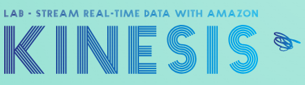

# Lab - Stream Real-Time Data with Amazon Kinesis   

### AWS Skill Builder <a href="../../">aws_skill_builder   </a>
### Training Category: <a href="../../self_paced_lab">self_paced_lab</a>
### Software/Subject: aws   
### Course: <a href="./">curso_spl_033 (Lab - Stream Real-Time Data with Amazon Kinesis)   </a>

#### Parceria da AWS com a Escola da Nuvem (EDN)   

---

### Theme:
- Cloud Computing
- Data

### Used Tools:
- Operating System (OS): 
  - Linux   
  - Windows 11   
- Linux Distribution:
  - Amazon Linux   
- Cloud:
  - Amazon Web Services (AWS)   
- Cloud Services:
  - Amazon Elastic Compute Cloud (EC2)   
  - Amazon Kinesis   
  - Amazon Kinesis Data Analytics (KDA)   
  - Amazon Kinesis Data Streams (KDS)   
  - Amazon Data Firehose; Amazon Kinesis Data Firehose (KDF)   
  - AWS Systems Manager (SSM)   
  - Google Drive   
- Build Automation:
  - Apache Maven   
- Language:
  - HTML   
  - Java   </a>
  - Markdown   
- Integrated Development Environment (IDE) and Text Editor:
  - Visual Studio Code (VS Code)   
- Versioning: 
  - Git   
- Repository:
  - GitHub   

---

<a name="item0"><h3>Course Strcuture:</h3></a>
1. Lab - Stream Real-Time Data with Amazon Kinesis 
1.1 <a href="#item01.1">Tarefa 1: Criar um Amazon Kinesis Data Stream sob demanda</a> 
1.2 <a href="#item01.2">Tarefa 2: Iniciar o produtor no EC2 para enviar dados ao KDS</a> 
1.3 <a href="#item01.3">Tarefa 3: Visualizar dados enviados ao Amazon Kinesis Data Stream com o Amazon Kinesis Data Viewer</a> 

---

### Objective:
Este laboratório teve como objetivo construir um fluxo de dados no **Amazon Kinesis Data Streams (KDS)**. Para simular a entrada de dados, foi utilizado um programa em **Java**, construído com **Apache Maven**, que utilizava a **Amazon Kinesis Producer Library (KPL)**. Os dados no fluxo foram visualizados através do *Amazon Kinesis Data Viewer*.

### Structure:
A estrutura do curso é formada por:
- Este arquivo de README.
- A pasta `0-aux`, pasta auxiliar com imagens utilizadas na construção desse arquivo de README.
- A pasta `resource` com os arquivos utilizados.

### Development:
Este curso foi um laboratório prático realizado na plataforma **AWS Skill Builder**, cuja subscrição foi devida a uma parceria entre a **AWS** e a **Escola da Nuvem**. A infraestrutura de cloud utilizada foi fornecida através de um sandbox do **AWS Skill Builder** que possibilitava acesso ao console da **AWS**. Contudo foi necessário seguir estritamente as orientações determinadas no laboratório. Dessa maneira, a forma de interação com os recursos da cloud foram sempre através do console fornecido pelo sandbox, a não ser em casos em que o próprio laboratório instruiu para utilização de outras ferramentas de interação como **AWS CLI** ou **AWS SDK**.

O laboratório do **AWS Skill Builder** tem o foco em executar apenas o que é orientado no escopo, todos os recursos ou serviços que podem ser requisitados adicionalmente já vêm provisionados por padrão pelo laboratório. Ao iniciar o laboratório, o sandbox do **AWS Skill Builder** provisiona diversos recursos e serviços para o funcionamento através de uma ou mais pilhas do **AWS CloudFormation** de forma automática. 

O acesso ao console no sandbox do **AWS Skill Builder** é realizado por meio de uma identidade federada. O Skill Builder funciona como um provedor de identidade (IdP), autenticando o usuário e vinculando-o a uma role do **AWS IAM** provisionada automaticamente por uma das pilhas do CloudFormation. Essa role concede permissões temporárias e mínimas necessárias para a execução do laboratório, garantindo segurança e controle sobre os recursos utilizados. O laboratório, por padrão, determina a região a ser utilizada e ela não deve ser alterada, somente se o próprio laboratório indicar. As configurações não informadas no laboratório devem ser sempre mantidas como padrão que estão.

<a name="item01.1"><h4>Tarefa 1: Criar um Amazon Kinesis Data Stream sob demanda</h4></a>[Back to summary](#item0)

Na primeira tarefa deste laboratório, o objetivo consistiu em provisionar um fluxo de dados (data stream) no **Amazon Kinesis Data Streams (KDS)**. O **Amazon KDS** é um serviço de streaming de dados em tempo real totalmente gerenciado que facilita a coleta, o processamento e a análise de dados de streaming em tempo real. Ele pode capturar continuamente gigabytes de dados por segundo de centenas de milhares de fontes, como clickstreams de sites, logs de aplicativos e dispositivos IoT. Os dados coletados pelo Kinesis Data Streams estão disponíveis em milissegundos para permitir análises e processamento de dados em tempo real. Um fluxo de dados do **Amazon Kinesis** é uma coleção de “shards”, que são unidades de paralelismo. Cada shard pode ingerir até 1.000 registros por segundo para gravações, até uma taxa máxima de gravação total de dados de 1 MB por segundo. É possível aumentar o número de shards posteriormente se precisar de maior rendimento. A configuração desse data stream foi definida da seguinte forma:
- `Data stream Name` (Nome do fluxo de dados): `Lab-Stream`.
- `Capacity mode` (Modo Capacidade): `Provisioned` (Provisionado).
- `Provisioned shards` (Fragmentos provisionados): `1`.

A imagem 01 mostra o fluxo de dados criado com status ativo.

<figure>
     
    <figcaption>Imagem 01.</figcaption>
</figure>
 

<a name="item01.2"><h4>Tarefa 2: Iniciar o produtor no EC2 para enviar dados ao KDS</h4></a>[Back to summary](#item0)

Com o data stream provisionado, nesta tarefa o objetivo foi iniciar um produtor no **Amazon Elastic Compute Cloud (EC2)** para gerar os dados e enviá-los para o fluxo de dados do Kinesis. Para isso, primeiro foi necessário acessar uma instância do EC2 já provisionada pelas pilhas do CloudFormation ao iniciar o lab. Esse acesso remoto foi realizado pelo recurso *Session Manager* do serviço **AWS Systems Manager (SSM)**, cujo link desse acesso foi disponibilizado no parâmetro `CommandHostSessionUrl` nas instruções do lab (`https://us-west-2.console.aws.amazon.com/systems-manager/session-manager/i-0bf7d4ebee691e6b5?region=us-west-2`). 

Dentro da sessão remota, o comando `cd /home/ssm-user` foi utilizado para acessar o diretório `ssm-user`. Em seguida, com o comando `mkdir kinesis-sample` o diretório chamado `kinesis-sample` foi criado. Com o comando `cd kinesis-sample` esse novo diretório foi acessado. Dentro dele, um arquivo `pom.xml` foi construído para o programa produtor. O produtor nada mais é que o local onde os dados são gerados, o que pode ser um programa, aplicativo, ou qualquer outra coisa que gere os dados. No caso deste lab, o produtor era um programa baseado em **Java** construído pelos arquivos [pom.xml](./resource/pom.xml) e [KinesisProducer.java](./resource/). O `pom.xml` era um arquivo de configuração do **Apache Maven** que definia as configurações do projeto **Java**, incluindo plugins, instruções de compilação e dependências, no qual uma delas era o **AWS Software Development Kit (SDK)** para **Java**, que era utilizado para interagir com serviços da **AWS**. A imagem 02 mostra o arquivo de configuração do aplicativo **Java** dentro da sua respectiva pasta na instância EC2.

<figure>
     
    <figcaption>Imagem 02.</figcaption>
</figure>
 

Para construir o arquivo de código **Java** foi necessário primeiro executar o comando `mkdir -p src/main/java` de dentro do diretório `kinesis-sample` para criar a estrutura de pastas onde ficaria o arquivo de código. Em seguida o arquivo `KinesisProducer.java` foi construído na pasta `java`, substituíndo a variável `LAB_REGION` pela região indicada no parâmetro `Region` nas instruções desse lab (`US-WEST-2`). Com o comando `cat src/main/java/KinesisProducer.java` o conteúdo do arquivo foi exibido no terminal, conforme imagem 03. Perceba que na criação dos dois arquivos o código foi criado envolta de um comando `cat << 'EOF' > pom.xml ... EOF` ou `cat << 'EOF' > src/main/java/KinesisProducer.java ... EOF`, especificando o caminho e arquivo que receberia o código. Essa forma evitava a necessidade de utilizar um editor de texto.

<figure>
     
    <figcaption>Imagem 03.</figcaption>
</figure>
 

Com os dois arquivo do projeto **Java** criados, o **Apache Maven** foi utilizado para construir o projeto de fato. Portanto, a pasta corrente foi alterada com o comando `cd /home/ssm-user/kinesis-sample` e o comando `mvn clean package` foi executado para compilar o código **Java** e empacotá-lo em um arquivo JAR. A imagem 04 ilustra o build do projeto **Java**.

<figure>
     
    <figcaption>Imagem 04.</figcaption>
</figure>
 

O código **Java** em si, tinha apenas uma classe de nome `KinesisProducer` com uma única função que produzia os dados que seriam utilizado pelo data stream do **Amazon Kinesis**. Para executar o programa e começar a produzir os dados, o comando `java -cp target/kinesis-sample-1.0-SNAPSHOT.jar KinesisProducer` foi executado. Cada elemento desse comando foi destrinchado abaixo:
- `java`: Comando para executar um programa **Java**.
- `-cp target/kinesis-sample-1.0-SNAPSHOT.jar`: Definia o classpath (`-cp` ou `--class-path`), que indicava onde o **Java** deveria procurar as classes e dependências necessárias para rodar o programa. Aqui, estava apontando para o JAR gerado pelo Maven no diretório `target/`.
- `KinesisProducer`: Nome da classe principal que continha o método `main()`, que seria executado.

A imagem 05 evidencia que o projeto **Java** foi executado e estava enviado registros de amostras para o data stream provisionado do **Amazon KDS**. Foi necessário esperar alguns minutos para que os dados fossem totalmente inseridos no fluxo de dados do Kinesis.

<figure>
     
    <figcaption>Imagem 05.</figcaption>
</figure>
 

<a name="item01.3"><h4>Tarefa 3: Visualizar dados enviados ao Amazon Kinesis Data Stream com o Amazon Kinesis Data Viewer</h4></a>[Back to summary](#item0)

A última tarefa consistiu em visualizar os dados que estavam sendo enviados pelo programa produtor executado na instância do **Amazon EC2** para o data stream do **Amazon Kinesis Data Stream (KDS)**. Para isso, foi utilizado o console do Kinesis para acessar o recurso *Amazon Kinesis Data Viewer* e configurá-lo para começar a ler a partir dos primeiros dados disponíveis no fluxo. No Data Viewer do Kinesis foi configurado o seguinte:
- `Shard`: `shardId-000000000000`.
- `Starting position` (Posição inicial): `Trim horizon` (Aparar horizonte). Aparar horizonte mostra os registros no último registro não aparado no fragmento, que é o registro de dados mais antigo no fragmento.

A imagem 06 comprova que os dados gerados pelo produtor foram visualizados no *Amazon Kinesis Data Viewer*. Os registros mostravam o horário do evento, a chave de partição e a carga útil dos dados.

<figure>
     
    <figcaption>Imagem 06.</figcaption>
</figure>
 