# Lab - Troubleshooting connectivity using EC2 Serial Console   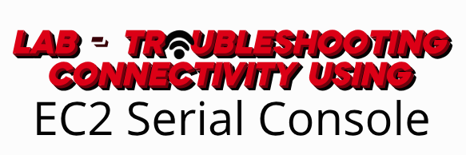

### AWS Skill Builder <a href="../../">aws_skill_builder   </a>
### Training Category: <a href="../../self_paced_lab">self_paced_lab</a>
### Software/Subject: aws   
### Course: <a href="./">curso_spl_032 (Lab - Troubleshooting connectivity using EC2 Serial Console)   </a>

#### Parceria da AWS com a Escola da Nuvem (EDN)   

---

### Theme:
- Cloud Computing

### Used Tools:
- Operating System (OS): 
  - Windows 11   
- Cloud:
  - Amazon Web Services (AWS)   
- Cloud Services:
  - Amazon Elastic Compute Cloud (EC2)   
  - AWS Systems Manager (SSM)   
  - Google Drive   
- Language:
  - HTML   
  - Markdown   
- Integrated Development Environment (IDE) and Text Editor:
  - Visual Studio Code (VS Code)   
- Versioning: 
  - Git   
- Repository:
  - GitHub   
- Server and Databases:
  - Very File Transfer Protocol Daemon (vstfpd)   
- Network:
  - Filezilla   
  - firewalld   
- Remote Desktop Software:
  - Remote Desktop Connection (RDC)   

---

<a name="item0"><h3>Course Strcuture:</h3></a>
1. Lab - Troubleshooting connectivity using EC2 Serial Console<br>
1.1 <a href="#item01.1">Tarefa 1: estabelecer conexão com o host de FTP</a><br>
1.2 <a href="#item01.2">Tarefa 2: instalação e configuração do vsftpd</a><br>
1.3 <a href="#item01.3">Tarefa 3: configuração das regras de firewall</a><br>
1.4 <a href="#item01.4">Tarefa 4: permissão de acesso ao Console serial do EC2 e acesso a instância</a><br>
1.5 <a href="#item01.5">Tarefa 5: solução de problemas do firewalld</a><br>
1.6 <a href="#item01.6">Tarefa 6: fazer upload de um arquivo no host de FTP</a><br>

---

### Objective:
Este laboratório teve como objetivo implantar um servidor FTP **Linux** com **Very File Transfer Protocol Daemon (vstfpd)** para simular um cenário em que funcionários e prestadores de serviços trocam arquivos com segurança. Para reforçar a segurança, além dos Security Groups, foi configurado um firewall interno com **firewalld** no nível do sistema operacional. Durante a configuração, problemas de rede foram identificados e resolvidos utilizando o *Amazon EC2 Serial Console*. O laboratório também abordou como ativar o acesso ao Console Serial, conceder permissões e utilizá-lo para conectar-se a uma instância.

### Structure:
A estrutura do curso é formada por:
- Este arquivo de README.
- A pasta `0-aux`, pasta auxiliar com imagens utilizadas na construção desse arquivo de README.
- A pasta `resource` com os arquivos utilizados.

### Development:
Este curso foi um laboratório prático realizado na plataforma **AWS Skill Builder**, cuja subscrição foi devida a uma parceria entre a **AWS** e a **Escola da Nuvem**. A infraestrutura de cloud utilizada foi fornecida através de um sandbox do **AWS Skill Builder** que possibilitava acesso ao console da **AWS**. Contudo foi necessário seguir estritamente as orientações determinadas no laboratório. Dessa maneira, a forma de interação com os recursos da cloud foram sempre através do console fornecido pelo sandbox, a não ser em casos em que o próprio laboratório instruiu para utilização de outras ferramentas de interação como **AWS CLI** ou **AWS SDK**.

O laboratório do **AWS Skill Builder** tem o foco em executar apenas o que é orientado no escopo, todos os recursos ou serviços que podem ser requisitados adicionalmente já vêm provisionados por padrão pelo laboratório. Ao iniciar o laboratório, o sandbox do **AWS Skill Builder** provisiona diversos recursos e serviços para o funcionamento através de uma ou mais pilhas do **AWS CloudFormation** de forma automática. 

O acesso ao console no sandbox do **AWS Skill Builder** é realizado por meio de uma identidade federada. O Skill Builder funciona como um provedor de identidade (IdP), autenticando o usuário e vinculando-o a uma role do **AWS IAM** provisionada automaticamente por uma das pilhas do CloudFormation. Essa role concede permissões temporárias e mínimas necessárias para a execução do laboratório, garantindo segurança e controle sobre os recursos utilizados. O laboratório, por padrão, determina a região a ser utilizada e ela não deve ser alterada, somente se o próprio laboratório indicar. As configurações não informadas no laboratório devem ser sempre mantidas como padrão que estão.

<a name="item01.1"><h4>Tarefa 1: estabelecer conexão com o host de FTP</h4></a>[Back to summary](#item0)

A primeira tarefa consistiu em estabelecer conexão com a instância do **Amazon EC2**, cujo o sistema operacional era **Amazon Linux** e possuía a tag de nome `ftpHost`, utilizando o recurso *Amazon EC2 Instance Connect*. Nesse tipo de conexão, apenas o nome de usuário é necessário para autenticação, que no caso era o usuário padrão deste SO, o `ec2-user`. O EC2 Instance Connect é usado para acessar instâncias que têm endereços IP públicos ou privados por SSH. Todas as chaves de SSH são gerenciadas pelo **AWS Identity and Access Management (IAM)**, então não é necessário se preocupar em compartilhá-las ou gerenciá-las. No terminal conectado na instância `ftpHost` aberto foi digitado o comando `pwd` para verificar o diretório corrente, que era o diretório do próprio usuário utilizado (`/home/ec2-user`). A imagem 01 comprova o acesso remoto realizado na instância EC2.

<div align="Center"><figure>
    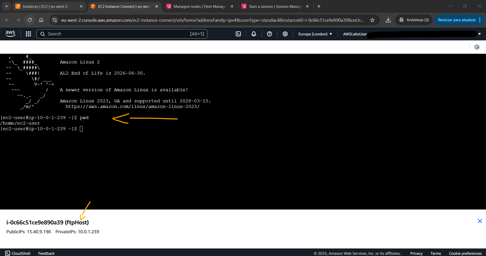<br>
    <figcaption>Imagem 01.</figcaption>
</figure></div><br>

<a name="item01.2"><h4>Tarefa 2: instalação e configuração do vsftpd</h4></a>[Back to summary](#item0)

Dentro da instância, foi instalado e configurado o software **Very File Transfer Protocol Daemon (vstfpd)**, que é um servidor FTP leve e altamente seguro. Com o comando `sudo yum update -y` executado no terminal, foi atualizado o gerenciador de pacotes **YUM**. Em seguida, com o comando `sudo yum install vsftpd -y` foi de fato instalado o **vstfpd**, conforme mostrado na imagem 02.

<div align="Center"><figure>
    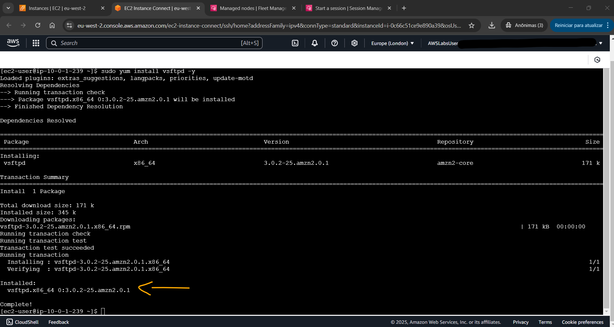<br>
    <figcaption>Imagem 02.</figcaption>
</figure></div><br>

O arquivo `vsftpd.conf` era o local onde os parâmetros que seriam usados para configurar o servidor **vsftpd** eram definidos. Para este laboratório, um arquivo `vsftpd.conf` já tinha sido elaborado e estava no diretório do usuário (`/home/ec-user`). Com o comando `less +G myvsftpd.conf`, o conteúdo do arquivo era mostrado, conforme imagem 03. Para sair do comando `less` foi utilizado a tecla `q`. O arquivo continha as seguintes configurações importantes para o laboratório:
- `chroot_list_enable=YES`: Ativava uma “cadeia de chroot”, que impedia que os usuários do FTP saíssem dos seus diretórios iniciais no servidor.
- `chroot_list_file=/etc/vsftpd.chroot_list`: Especificava, em outro arquivo, dentro do diretório `/etc`, a lista de usuários que podiam acessar o servidor.
- `pasv_enable=YES`: Permitia a transferência de dados por meio de portas temporárias.
- `pasv_min_port=40000` e `pasv_max_port=41000`: Definiam as portas temporárias usadas para a transferência de dados. No security group da instância já tinha uma regra de entrada liberando essas portas para toda a rede da VPC que essa instância fazia parte.

<div align="Center"><figure>
    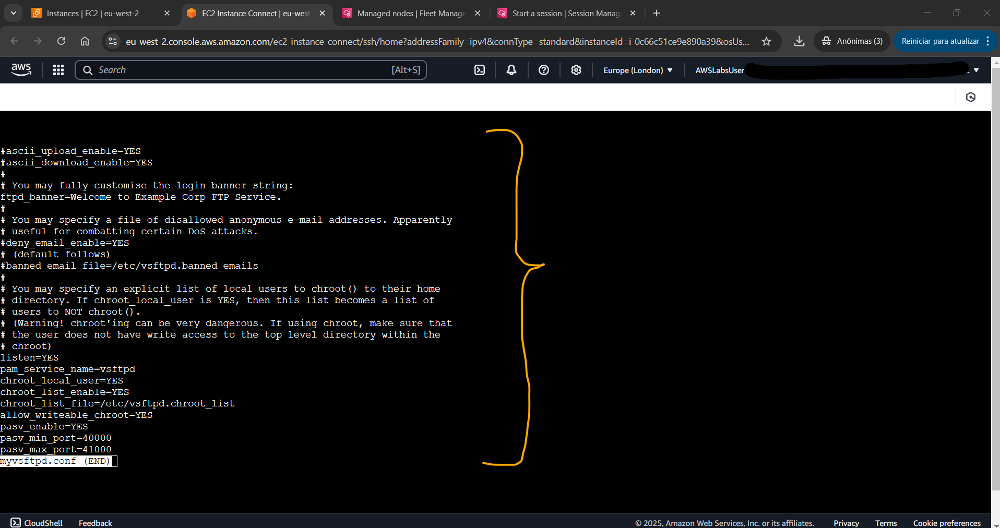<br>
    <figcaption>Imagem 03.</figcaption>
</figure></div><br>

Antes de substituir o arquivo `vsftpd.conf` existente pelo elaborado pelo laboratório foi utilizado o comando `sudo mv /etc/vsftpd/vsftpd.conf /etc/vsftpd/vsftpd.conf.bak` para enviar o arquiv original do servidor **vstfpd** para a pasta `/etc/vsftpd` como um backup. Em seguida, com o comando `sudo cp ~/myvsftpd.conf /etc/vsftpd/vsftpd.conf`, o arquivo do laboratório foi copiado e colado em cima do arquivo de configuração do servidor FTP, sobrescrevendo-o. Para confirmar se o servidor estava configurado corretamente, foi preciso criar um usuário e um diretório inicial no qual ele pudesse fazer upload de arquivos. Com o comando `sudo useradd -m ftpuser` o usuário de nome `ftpuser` foi criado. Com o comando `sudo passwd ftpuser`, uma senha era atribuída para o usuário criado. A senha utilizada foi a fornecida pelo laboratório através do parâmetro `AdministratorPassword` (`GHhNx9Q}cpXdFF6`). Após criação do usuário, um diretório FTP  foi construído com o comando `sudo mkdir /home/ftpuser/ftp` dentro da pasta do usuário `/home/ftpuser`. O proprietário e grupo desse diretório foi modificado com o comando `sudo chown nobody:nobody /home/ftpuser/ftp` e as permissões foram removidas pelo comando `sudo chmod a-w /home/ftpuser/ftp`. A imagem 04 mostra o output desses comandos executados.

<div align="Center"><figure>
    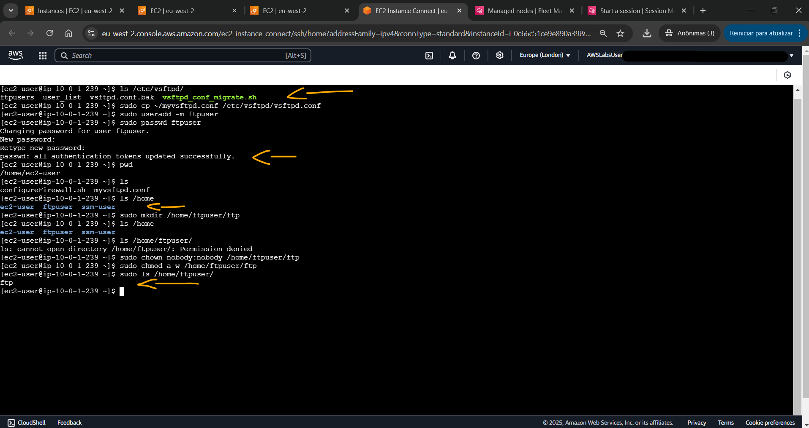<br>
    <figcaption>Imagem 04.</figcaption>
</figure></div><br>

Um subdiretório foi gerado dentro do diretório `ftp` com o comando `sudo mkdir /home/ftpuser/ftp/files` e para este o proprietário e grupo foi configurado como `ftpuser` com o comando `sudo chown ftpuser:ftpuser /home/ftpuser/ftp/files`. Esse usuário precisou ser adicionado na lista de usuários que podiam acessar o servidor **vstfpd** e isso foi feito com o comando `echo "ftpuser" > vsftpd.chroot_list`. Esse arquivo já existia na pasta do usuário `ec2-user`. O proprietário e grupo desse arquivo de lista de usuários (`vstfpd.chroot_list`) foi alterado para o usuário raíz (`root`) com o comando `sudo chown root:root vsftpd.chroot_list`. Esse arquivo precisou ser movido para a pasta `/etc/` substituído o arquivo já existente, que era o default, e isso foi executado com o comando `sudo mv vsftpd.chroot_list /etc/vsftpd.chroot_list`. Por fim, o servidor **vstfpd** foi reiniciado com o comando `sudo systemctl restart vsftpd` e com o comando `sudo systemctl status vsftpd` foi confirmado que o estado dela estava em execução, conforme evidenciado na imagem 05.

<div align="Center"><figure>
    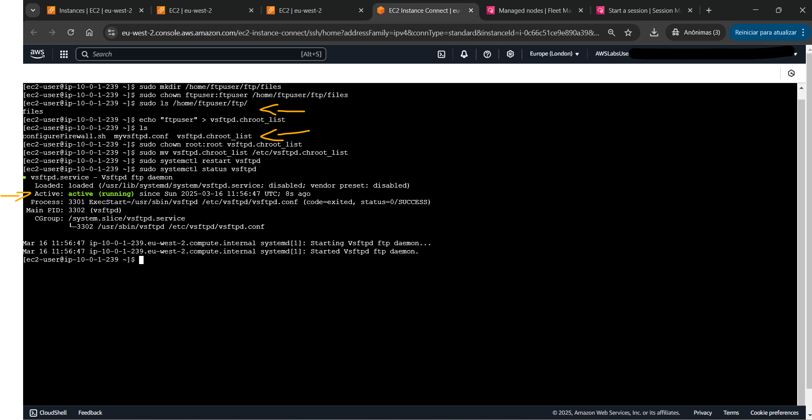<br>
    <figcaption>Imagem 05.</figcaption>
</figure></div><br>

<a name="item01.3"><h4>Tarefa 3: configuração das regras de firewall</h4></a>[Back to summary](#item0)

Neste momento, o servidor na instância `ftpHost` já estava protegido pelos grupos de segurança da própria instância. Entretanto era necessário também configurar um firewall dentro do sistema operacional, ou seja, dentro da instância. Para isso, um script foi utilizado para instalar o software **firewalld** e configurá-lo para permitir o tráfego de FTP. Com o comando `ls ~` era listado os dois arquivos existentes na pasta do usuário `/home/ec2-user`: `myvsftpd.conf`, que era o arquivo de configuração do servidor FTP, e `configureFirewall.sh`, que era o arquivo de script para instalação do software de firewall. O arquivo de lista de usuários, que estava nessa pasta anteriormente, já tinha sido movido para a pasta `/etc`.

A aplicação **firewalld** usava zonas para determinar a confiabilidade das conexões de rede. Já que o servidor de FTP seria usado por vários prestadores de serviço e consultores externos, foi necessário configurar o acesso usando zonas públicas ou não confiáveis. O script `configureFirewall.sh` automatizava esse processo. Após a instalação do **firewalld**, ele criava duas zonas públicas. A primeira permitia que os clientes se cadastrassem e autenticassem no servidor de FTP pela porta 21, e a segunda permitia a transferência de dados pelas portas 40000 a 41000. No trecho do script `configureFirewall.sh` abaixo, observe que o sinalizador `--zone=public` foi usado para criar essas zonas. O grupo de segurança dessa instância `ftpHost` já possuía duas regras de entrada liberando as portas `20` e `21`, e o intervalo `40000-41000`.

```bash
...
echo "Opening port 21 for FTP registration..."
sudo firewall-cmd --zone=public --permanent --add-port=21/tcp
echo "Opening ports 40000-41000 for data transfer..."
sudo firewall-cmd --zone=public --permanent --add-port=40000-41000/tcp
...
```

Para executar o script foi utilizado esses três comandos em conjunto: `cd ~ && sudo chmod +x configureFirewall.sh && sudo ./configureFirewall.sh`. Em seguida, foi pressionado a tecla `1` para começar a instalar e configurar o **firewalld**. Nessa execução, o script parou de funcionar depois de abrir as portas 20 e 21, e não foi possível mais executar comandos no terminal da instância `ftpHost`. A imagem 06 mostra exatamente o script travado após abrir as portas 21 e 20.

<div align="Center"><figure>
    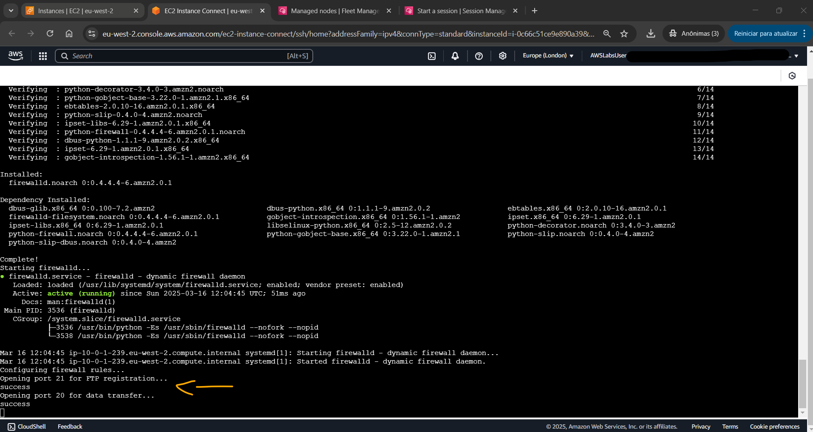<br>
    <figcaption>Imagem 06.</figcaption>
</figure></div><br>

A investigação do problema iniciou confirmando no console do EC2 se a instância ainda estava em execução. Para isso, a instância foi selecionada e a guia `Details` (Detalhes) foi aberta para confirmar se o estado da instância era `Running` (Executando). Após confirmação, uma nova conexão remota tentou ser realizada utilizando o recurso *Amazon EC2 Instance Connect*. Infelizmente, o EC2 Instance Connect abria em uma nova guia, mas não conseguía estabelecer uma nova conexão, exibindo uma mensagem de erro, conforme imagem 07.

<div align="Center"><figure>
    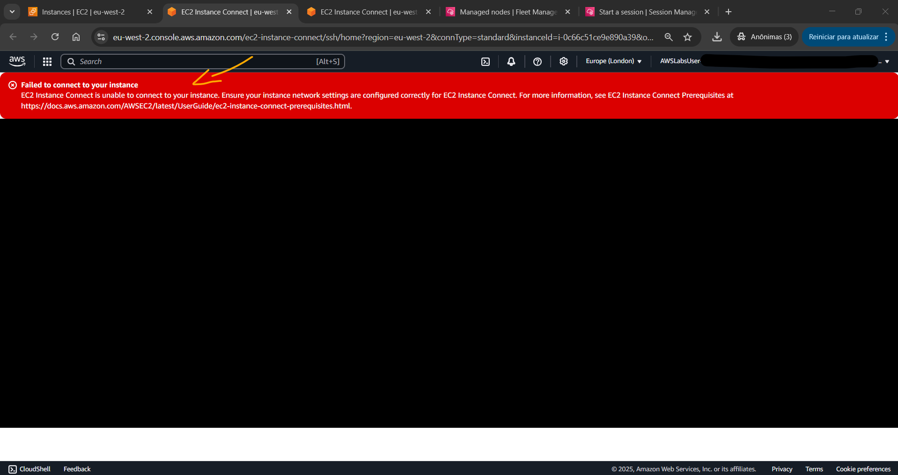<br>
    <figcaption>Imagem 07.</figcaption>
</figure></div><br>

Provavelmente, o firewall instalado estava bloqueando as conexões do protocolo SSH. Sendo assim, uma tentativa de conexão foi feita utilizando um outro recurso, o *Session Manager* do **AWS Systems Manager**. O *Session Manager* é um shell interativo usado para acessar instâncias sem precisar gerenciar chaves de SSH nem abrir portas de entrada. O *Session Manager* também não estava conseguindo estabelecer uma conexão com o host. A imagem 08 evidenciava essa tentativa de acesso remoto, informando algum problema com *SSM Agent*.

<div align="Center"><figure>
    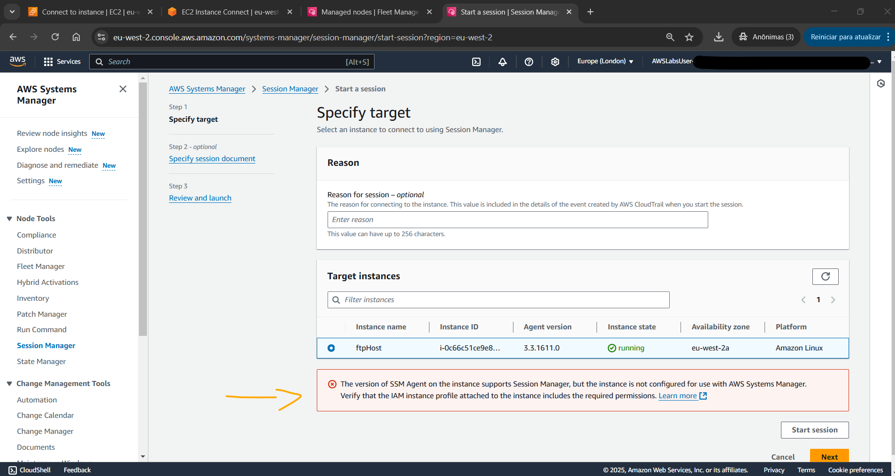<br>
    <figcaption>Imagem 08.</figcaption>
</figure></div><br>

<a name="item01.4"><h4>Tarefa 4: permissão de acesso ao Console serial do EC2 e acesso a instância</h4></a>[Back to summary](#item0)

Parece que as regras de firewall que foram adicionadas a `ftpHost` fizeram a instância ser removida da rede acidentalmente. Sem a conexão de rede, não era possível usar o *EC2 Instance Connect*, o *Session Manager* ou um cliente de SSH para acessar o shell. Felizmente, o *Amazon EC2 Serial Console* (Console serial do EC2) funciona mesmo quando a instância não tem recursos de redes. No Console Serial, a interação com a instância ocorre como se um teclado e um monitor estivessem conectados diretamente à porta serial da instância. Em cada host físico da **AWS**, um hypervisor gerencia múltiplas instâncias na mesma máquina. Esse hypervisor inclui um Console Serial, que os usuários da **AWS** podem acessar para se conectar à porta serial virtual de suas instâncias. Como esse é um método de acesso mais direto e privilegiado, geralmente ele vem desativado por padrão na conta da **AWS**. Por isso, foi necessário primeiro verificar se o recurso *Amazon EC2 Serial Console* estava habilitado na conta.

O console do EC2 foi novamente aberto e a opção `Settings` (Configurações) foi escolhida. Em seguida, a guia `EC2 Serial Console` foi aberta, a opção `Manage` (Gerenciar) foi selecionada e a caixa de `Allow` (Permitir) da opção `EC2 Serial Console access` (Acesso ao Console Serial EC2) foi selecionada. Após essa configuração, o acesso ao Console serial do EC2 estava ativado em toda a conta. Para dar acesso mais granular ao console serial, outra opção seria usar uma combinação de políticas de controle de serviço (SCP) e políticas do IAM para controlar o escopo do acesso segundo os requisitos. Para acessar instâncias usando o Console serial do EC2, o usuário do IAM precisava receber uma permissão explícita. Neste lab, felizmente, por ser administrador de rede, a entidade utilizada para acesso ao console já possuía essa permissão. Veja abaixo um exemplo de documento de política para conceder a um usuário o acesso ao Console serial do EC2. Observe que o documento inclui a ação `ec2-instance-connect:SendSerialConsoleSSHPublicKey`. Ela autorizava o usuário do IAM a enviar a chave pública ao serviço do console serial, o que iniciava uma sessão do console.

```json
{
    "Version": "2012-10-17",
    "Statement": [
        {
            "Sid": "AllowSerialConsoleAccess",
            "Effect": "Allow",
            "Action": [
                "ec2-instance-connect:SendSerialConsoleSSHPublicKey"
            ],
            "Resource": "arn:aws:ec2:region:account-id:instance/i-0598c7d356eba48d7"
        }
    ]
}
```

Dessa forma, a instância `ftpHost` foi selecionada para conexão, alternando para a guia do Console serial do EC2, que agora estava habilitada, e a opção `Connect` (Conectar) foi selecionada. Perceba que o `Serial port` (Porta serial) dessa instância era `ttyS0`. Após conectar, uma nova janela exibindo uma sessão do terminal foi aberta. O cursor foi colocado na janela e a tecla `Enter` foi pressionada. Um prompt de início de sessão apareceu na janela do terminal. Nesse prompt, foi digitado `root` e no campo senha foi utilizado o valor do parâmetro `AdministratorPassword` localizado nas instruções do lab (`GHhNx9Q}cpXdFF6`). A imagem 09 comprova que a conexão remota com a instância **Amazon EC2** foi executada utilizando o recurso *Amazon EC2 Serial Console*. Note que a senha do usuário `root` dessa instância `ftpHost` foi utilizada também como senha do usuário construído `ftpuser`.

<div align="Center"><figure>
    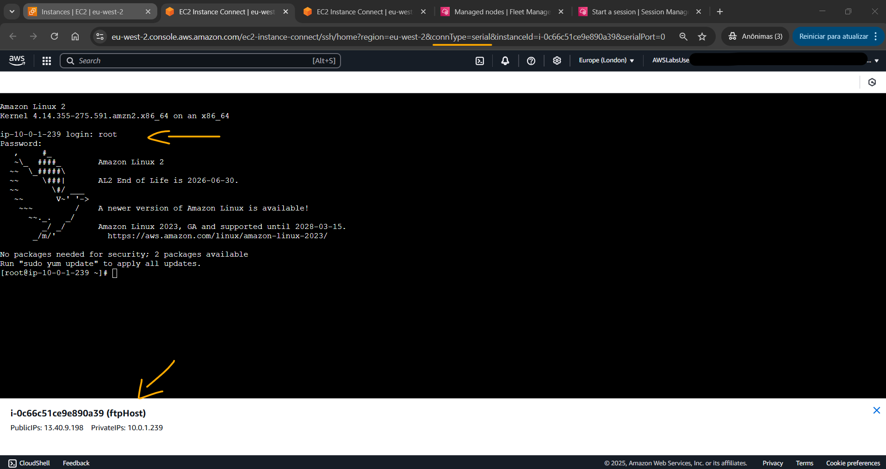<br>
    <figcaption>Imagem 09.</figcaption>
</figure></div><br>

<a name="item01.5"><h4>Tarefa 5: solução de problemas do firewalld</h4></a>[Back to summary](#item0)

De dentro da instância, nesta tarefa 5 o objetivo foi identificar e solucionar o problema na execução do **firewalld**. Primeiro foi executado o comando `systemctl status firewalld.service` para ver o status do serviço se estava em execução. Após identificar que o serviço estava em execução, foi utilizado o comando `less /var/log/firewalld` para visualizar os logs. Os logs não continham nenhuma informação útil e comando `less` foi finalizado com a tecla `q`. Em seguida, com o comando `firewall-cmd --list-ports` foram visualizadas as regras que foram aplicadas. O output desse comando não exibia nenhum serviço nem porta, mas o firewall deveria estar configurado para permitir TCP nas portas `21` e `40000 a 41000`, mas parece que ele estava bloqueando todo o tráfego. É possível que algo tenha feito o **firewalld** entrar no modo pânico. Esse modo é um estado de emergência que termina todas as conexões de rede e impede o estabelecimento de novas conexões. Com o comando `firewall-cmd --query-panic` foi verificado que o o firewall tinha entrado em modo pânico, conforme imagem 10.

<div align="Center"><figure>
    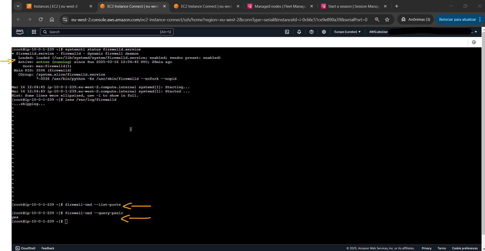<br>
    <figcaption>Imagem 10.</figcaption>
</figure></div><br>

Com o comando `firewall-cmd --panic-off`, o modo pânico foi desativado. Em seguida, com o comando `systemctl restart firewalld` o **firewalld** foi reiniciado. Foi necessário pressionar `Enter` para voltar ao prompt de comando. Com o comando `systemctl status firewalld` foi verificado que o **firewalld** estava funcionando normalmente, conforme registro da imagem 11.

<div align="Center"><figure>
    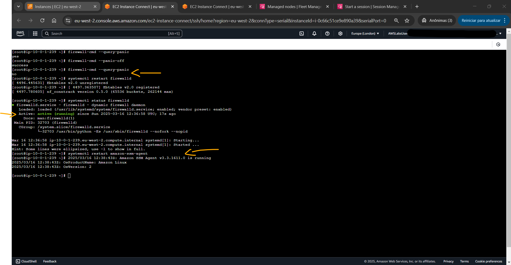<br>
    <figcaption>Imagem 11.</figcaption>
</figure></div><br>

Antes de fechar a conexão do **Amazon EC2 Serial Console**, foi reiniciado o *SSM Agent* do **AWS Systems Manager**, que estava instalado na instância, com o comando `systemctl restart amazon-ssm-agent`. Isso possibilitava que outros usuários pudessem acessar a instância pelo recurso *Session Manager*. O *SSM Agent* é executado nas instâncias do EC2 e usa documentos do Systems Manager para ativar o *Session Manager*. Para confirmar que a instância estava conecta à rede novamente, foi realizado dois novos acesso remoto com o *Amazon EC2 Instance Connect* e o *Session Manager* do SSM, conforme imagem 12.

<div align="Center"><figure>
    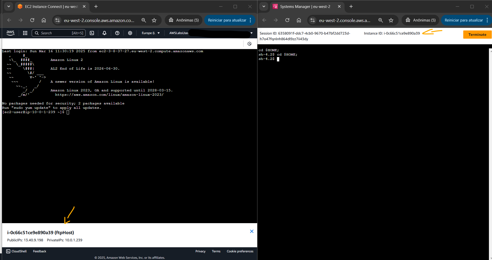<br>
    <figcaption>Imagem 12.</figcaption>
</figure></div><br>

<a name="item01.6"><h4>Tarefa 6: fazer upload de um arquivo no host de FTP</h4></a>[Back to summary](#item0)

Na última tarefa, foi utilizada uma instância EC2 **Windows Server**, cuja tag de noma era `ftpClient`, para confirmar se os usuários conseguiam fazer upload de arquivos no servidor FTP na instância **Amazon Linux**, cuja tag de nome era `ftpHost`. Para conexão remota em uma instância **Windows Server** foi utilizado o cliente de RDP existente na máquina local **Windows**, que era o software **Remote Desktop Connection (RDC)**, conhecido também como **Conexão Área de Trabalho Remota**. Neste caso, foi preciso ou baixar o arquivo de configuração da sessão remota ou preencher a configuração manualmente. Em ambos os casos, foi necessário selecionar a instância que seria conectada e ir na opção `Connect` (Conectar) e ir na guia `RDP Client` (Cliente RDP) para baixar o arquivo de configuração ou utilizar as informações para preencher a configuração que eram o hostname, ou seja, o IP ou DNS público da instância (`ec2-18-171-58-208.eu-west-2.compute.amazonaws.com`), e o nome de usuário que faria a conexão, que era o usuário padrão do **Windows Server** (`Administrator`) Em seguida, a senha para autenticação do usuário era exigida. Essa senha era informada pelo parâmetro `AdministratorPassword` nas instruções do laboratório (`GHhNx9Q}cpXdFF6`). Ao conectar-se, uma mensagem era exibida informando que o certificado não pôde ser verificado e que a conexão não era segura, mas neste caso, era só continuar. A imagem 13 exibe o acesso remoto gráfico na instância `ftpClient`.

<div align="Center"><figure>
    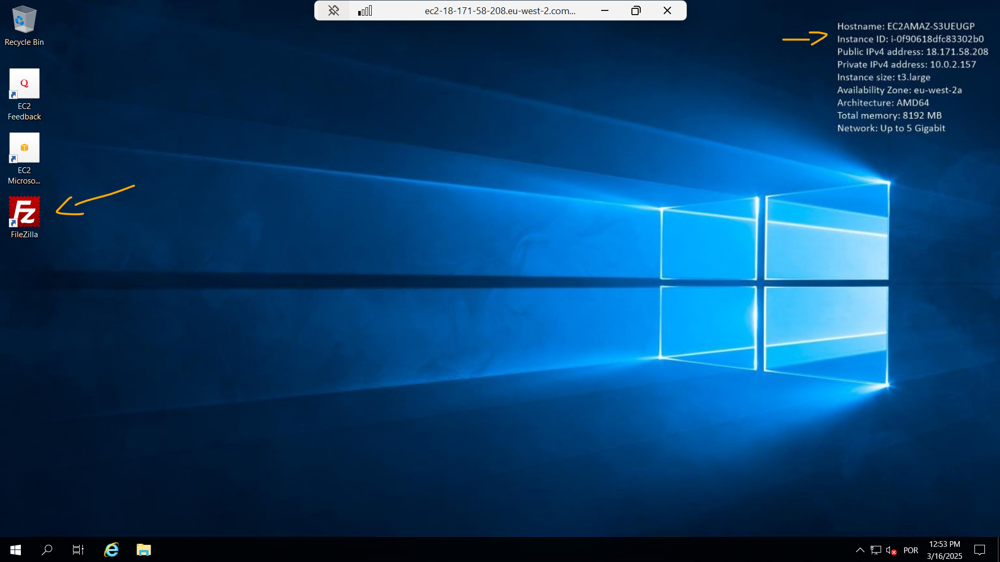<br>
    <figcaption>Imagem 13.</figcaption>
</figure></div><br>

Na área de trabalho dessa instância, já que o acesso remoto era gráfico, o software **Filezilla**, que é um cliente FTP com interface gráfica, foi utilizado para fazer upload de um arquivo no servidor FTP. Após abrir o **Filezilla** e fechar todas as janelas de pop-ups que aparecia, foi configurada uma conexão da seguinte forma:
- `Host`: foi utilizado o valor do parâmetro `FtpHostPrivateIp` nas instruções desse lab (`10.0.1.239`). Esse era o IP privado da instância do servidor FTP, cuja tag de nome era `ftpHost`.
- `Username` (Nome de Usuário): `ftpuser`. Esse usuário foi o construído lá na instância `ftpHost` e ele estava na lista de usuários permitidos para acessar o servidor FTP.
- `Password` (Senha): foi inserido o valor do parâmetro `AdministratorPassword` (`GHhNx9Q}cpXdFF6`). Essa foi a senha configurada para o usuário `ftpuser`.

Após configuração, foi clicado no botão `Quickconnect` (Conexão rápida). Uma janela de pop-up perguntando se o **Filezilla** deveria salvar as senhas foi exibida e foi escolhida a opção `Do not save passwords` (Não salvar senhas). Em seguida, outra janela de pop-up foi aberta, informando que o servidor de FTP não oferecia suporte a FTP sobre TLS e foi clicado em `OK`. No **Filezilla**, o explorador de arquivos do lado esquerdo foi utilizado para abrir a pasta `C:\Users\Administrator\Documents` da instância `ftpClient` (**Windows Server**). Do lado direito, o diretório do servidor FTP, cujo path era `/home/ftpuser/ftp/files`, já estava aberto devido a conexão estabelecida. O arquivo log, chamado `sample.log`, que já existia na pasta `Documents` do instância `ftpClient` foi selecionado para fazer upload no diretório `files` da instância `ftpHost`. A imagem 14 mostra que o arquivo foi transferido por FTP para o servidor utilizando o **Filezilla** na instância EC2 **Windows Server**. A imagem 15 evidencia que esse arquivo foi enviado para a pasta `files` visualizado por um acesso remoto na instância **Amazon Linux**.

<div align="Center"><figure>
    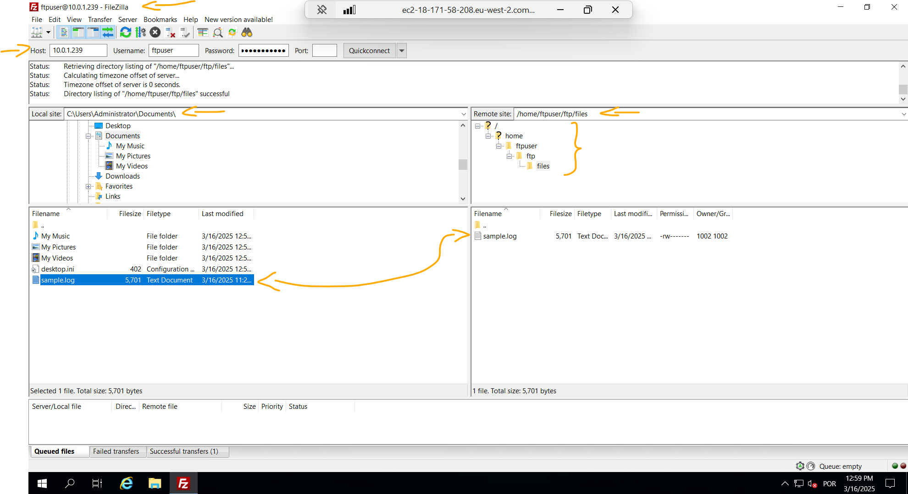<br>
    <figcaption>Imagem 14.</figcaption>
</figure></div><br>

<div align="Center"><figure>
    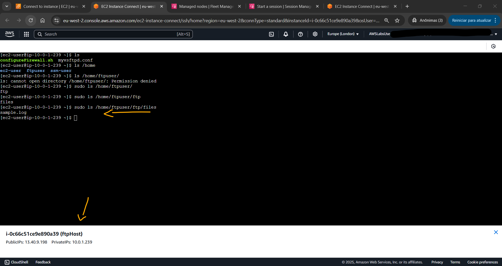<br>
    <figcaption>Imagem 15.</figcaption>
</figure></div><br>