# Lab - Introduction to AWS Database Migration Service   

### AWS Skill Builder <a href="../../">aws_skill_builder   </a>
### Training Category: <a href="../../self_paced_lab">self_paced_lab</a>
### Software/Subject: aws   
### Course: <a href="./">curso_spl_037 (Lab - Introduction to AWS Database Migration Service)   </a>

#### Parceria da AWS com a Escola da Nuvem (EDN)   

---

### Theme:
- Cloud Computing

### Used Tools:
- Operating System (OS): 
  - Windows 11   
  - Windows Server   
- Cloud:
  - Amazon Web Services (AWS)   
- Cloud Services:
  - Amazon Aurora   
  - Amazon Relational Database Service (RDS)   
  - AWS Database Migration Service (DMS)  
  - AWS Systems Manager (SSM)   
  - Google Drive   
- Language:
  - HTML   
  - Markdown   
- Integrated Development Environment (IDE) and Text Editor:
  - Visual Studio Code (VS Code)   
- Versioning: 
  - Git   
- Repository:
  - GitHub   
- Server and Databases:
  - MySQL Server   
- Database Administration Tool:
  - MySQL Workbench   

---

<a name="item0"><h3>Course Strcuture:</h3></a>
1. Lab - Introduction to AWS Database Migration Service<br>
1.1 <a href="#item01.1">Tarefa 1: conectar-se à sua instância do Amazon EC2</a><br>
1.2 <a href="#item01.2">Tarefa 2: Configurar e conectar ao seu banco de dados MySQL de origem</a><br>
1.3 <a href="#item01.3">Tarefa 3: Use o MySQL Workbench para conectar-se à sua instância do RDS</a><br>
1.4 <a href="#item01.4">Tarefa 4: migre seu banco de dados MySQL de origem para sua instância Aurora usando o AWS Database Migration Service</a><br>

---

### Objective:
O objetivo deste laboratório foi instalar, configurar e importar os dados para um banco de dados **MySQL** local, simulado em uma instância **Windows Server** do **Amazon EC2**. Em seguida, utilizar o serviço **AWS Database Migration Service (DMS)** para migrar os dados do banco local para um banco de dados **MySQL** em uma instância do **Amazon Aurora** no **Amazon RDS**.

### Structure:
A estrutura do curso é formada por:
- Este arquivo de README.
- A pasta `0-aux`, pasta auxiliar com imagens utilizadas na construção desse arquivo de README.

### Development:
Este curso foi um laboratório prático realizado na plataforma **AWS Skill Builder**, cuja subscrição foi devida a uma parceria entre a **AWS** e a **Escola da Nuvem**. A infraestrutura de cloud utilizada foi fornecida através de um sandbox do **AWS Skill Builder** que possibilitava acesso ao console da **AWS**. Contudo foi necessário seguir estritamente as orientações determinadas no laboratório. Dessa maneira, a forma de interação com os recursos da cloud foram sempre através do console fornecido pelo sandbox, a não ser em casos em que o próprio laboratório instruiu para utilização de outras ferramentas de interação como **AWS CLI** ou **AWS SDK**.

O laboratório do **AWS Skill Builder** tem o foco em executar apenas o que é orientado no escopo, todos os recursos ou serviços que podem ser requisitados adicionalmente já vêm provisionados por padrão pelo laboratório. Ao iniciar o laboratório, o sandbox do **AWS Skill Builder** provisiona diversos recursos e serviços para o funcionamento através de uma ou mais pilhas do **AWS CloudFormation** de forma automática. 

O acesso ao console no sandbox do **AWS Skill Builder** é realizado por meio de uma identidade federada. O Skill Builder funciona como um provedor de identidade (IdP), autenticando o usuário e vinculando-o a uma role do **AWS IAM** provisionada automaticamente por uma das pilhas do CloudFormation. Essa role concede permissões temporárias e mínimas necessárias para a execução do laboratório, garantindo segurança e controle sobre os recursos utilizados. O laboratório, por padrão, determina a região a ser utilizada e ela não deve ser alterada, somente se o próprio laboratório indicar. As configurações não informadas no laboratório devem ser sempre mantidas como padrão que estão.

<a name="item01.1"><h4>Tarefa 1: conectar-se à sua instância do Amazon EC2</h4></a>[Back to summary](#item0)

A primeira tarefa deste laboratório consistiu em conectar a instância **Windows Server** do **Amazon EC2** utilizando o recurso *Fleet Manager* do **AWS Systems Manager (SSM)**. Para esse tipo de conexão foi necessário baixar o arquivo de chave privada formato `.pem` do par de chaves configurado nessa instância, que era o par `AWSLabsKeyPair-xm7wTFBScFsgQqRJVW7gc2`. Esse arquivo foi utilizado na configuração de sessão remota gráfica para autenticar o usuário que desejava acessar a instância, que no caso era o usuário padrão do **Windows Server** (`Administrator`). O arquivo de chave privada foi disponibilizado no parâmetro `EC2 Key Pair PEM` nas instruções do lab. A URL para esse acesso remoto RDP também foi disponizado nas instruções no parâmetro `Ec2InstanceSessionRDP` (`https://us-east-1.console.aws.amazon.com/systems-manager/managed-instances/rdp-connect?region=us-east-1&instances=i-0b21b99b34c9b7893`). Ao conectar, autenticar e obter acesso a interface gráfica, a mensagem de rede perguntando se desejava permitir que esse PC fosse descoberto por outros PCs nesta rede foi negada em `No` (Não). A imagem 01 comprova o acesso remoto gráfico realizado com sucesso à instância do **Windows Server**, utilizando o *Fleet Manager* do SSM.

<div align="Center"><figure>
    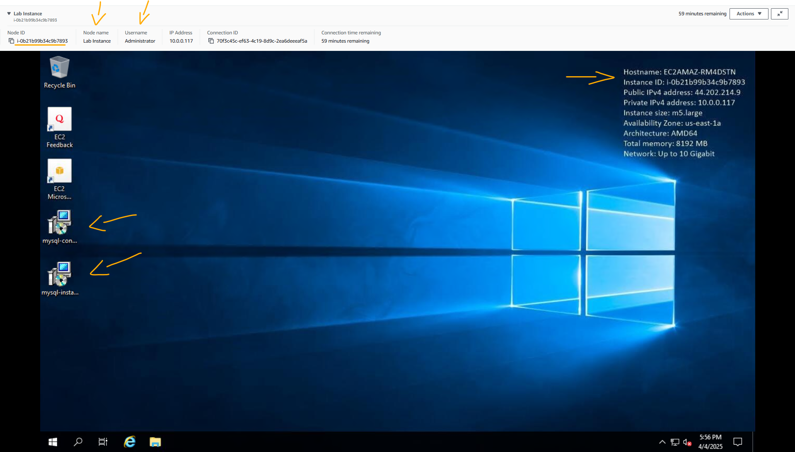<br>
    <figcaption>Imagem 01.</figcaption>
</figure></div><br>

Diferente do *Session Manager* que a comunicação é feita via *SSM Agent** instalado na instância, que utiliza a porta de saída `443` (HTTPS), no *Fleet Manager* a comunicação é feita via protocolo Remote Desktop Protocol (RDP), para instâncias **Windows**, e Secure Shell (SSH) para instâncias **Linux**. Neste caso, é necessário que haja uma regra de entrada no security group vinculado a instância, liberando essas comunicações. Felizmente, isso já tinha sido provisionado pelo laboratório ao iniciá-lo.

<a name="item01.2"><h4>Tarefa 2: Configurar e conectar ao seu banco de dados MySQL de origem</h4></a>[Back to summary](#item0)

De dentro da instância EC2, o servidor de banco de dados **MySQL** de origem, de onde os dados seriam migrados, foi configurado. Em seguida com o **MySQL Workbench** da própria instância, uma conexão com o servidor de banco de dados foi estabelecida para criar um banco e carregar os dados. Para isso, foi necessários instalar os seguintes softwares:
- **MySQL Connector**: É um driver que permite que aplicações se conectem e interajam com bancos de dados **MySQL** usando linguagens como **Python**, **Java**, **C++**, etc.. Neste caso, foi instalado conector para **.NET**. Para instalação o arquivo `mysql-connector-net-8.4.0.msi` na área de trabalho da instância foi executado e a configuração da instalação foi o padrão "next, next, install, finish".
- **MySQL Server**: É o sistema de gerenciamento de banco de dados que armazena, organiza e processa os dados em um banco **MySQL**. Foi instalado junto com o Workbench, ao executar o instalador `mysql-installer-community-8.0.37.0` na área de trabalho da instância. As únicas configurações feitas na instalação foram:
- `Installation` (Instalação):
    - Na página `Choosing a Setup Type` (Escolhendo um tipo de configuração) que foi selecionada `Custom` (Personalizado).
    - Na página `Select Products` (Selecionar Produtos): o **MySQL Server** (`MySQL Server 8.0.37 - X64`) e o **MySQL Workbench** (`MySQL Workbench 8.0.36 - X64`) foram selecionados para serem instalados. Além desses, outras ferramentas como **MySQL Shell**, **MySQL Router** podiam ser instaladas.
- `Configuration` (Configuração):
    - Na página `Accounts and Roles` (Contas e funções) foi configurado os seguintes usuários:
        - `Root user` (Usuário raiz):
            - `MySQL Root Password` (Senha Raiz do MySQL): foi inserido o valor do parâmetro `DBPassword` nas instruções desse lab (`algb9MOZC`).
            - `Repeat Password` (Repetir Senha): foi inserido o valor do parâmetro `DBPassword` nas instruções desse lab (`algb9MOZC`).
        - `Administrator user` (Usuário administrador):
            - `User Name` (Nome de usuário): `admin` (administrador). Esse usuário seria o utilizado para se conectar ao servidor de banco de dados **MySQL**.
            - `Password` (Senha): foi inserido também o valor do parâmetro `DBPassword` nas instruções desse lab (`algb9MOZC`).
            - `Repeat Password` (Repetir Senha): foi inserido também o valor do parâmetro `DBPassword` nas instruções desse lab (`algb9MOZC`).
- **MySQL Workbench**: É uma ferramenta gráfica para modelar, gerenciar e executar consultas em bancos de dados **MySQL**. Foi instaldo junto com o servidor do **MySQL**.

Após instalação dos softwares, o **MySQL Workbench** foi aberto e a conexão com o servidor **MySQL** instalado nessa instância foi realizada utilizando o usuário `root`. Para configurar a conexão foi necessário ir na conexão já criada de nome `Local instance MySQL80` (Instância local MySQL80), e no pop-up aberto passar a senha do usuário raiz que tinha sido a fornecida pelo lab através do parâmetro `DBPassword` (`algb9MOZC`) e tinha sido a definida ao instalar o servidor **MySQL**.

Com a conexão estabelecida, a query `CREATE DATABASE mydb;` foi executada para criar um banco de dados de nome `mydb` dentro do servidor instalado na instância **Amazon EC2**, conforme registrado na imagem 02. Na sequência, os dados foram configurados para serem importados da instância EC2 para esse banco, escolhendo as opções: `Server` (Servidor) e `Data Import` (Importação de Dados). Na janela de `Data Import` (Importação de Dados), a aba `Import from Disk` (Importar do Disco) foi acessada e no campo `Import from Dump Project Folder` (Importar da Pasta do Projeto Dump) dentro da opção `Import Options` (Opções de Importação), foi navegado na instância até o path `C://Users/Administrator/Documents/` e selecionada a única pasta existente, que era `dump`. Essa pasta possuía um único arquivo SQL que montava todo os esquema do banco de dados, com as respectivas tabelas e seus dados. Após selecioná-la, imediatamente na página de importação, no campo `Select Database Objects to Import` (Selecione objetos de banco de dados para importar) era listado o banco de nome `mydb` que seria importado no servidor **MySQL**. A importação foi iniciada clicando em `Start Import` (Iniciar Importação). A imagem 03 exibe o progresso da importação dos dados para o banco de dados desenvolvido no **MySQL Server**.

<div align="Center"><figure>
    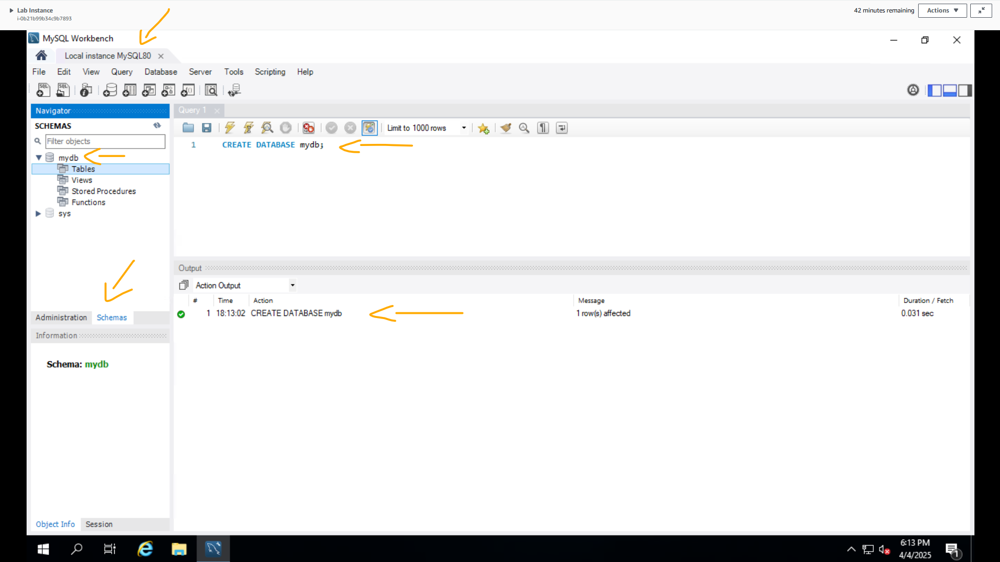<br>
    <figcaption>Imagem 02.</figcaption>
</figure></div><br>

<div align="Center"><figure>
    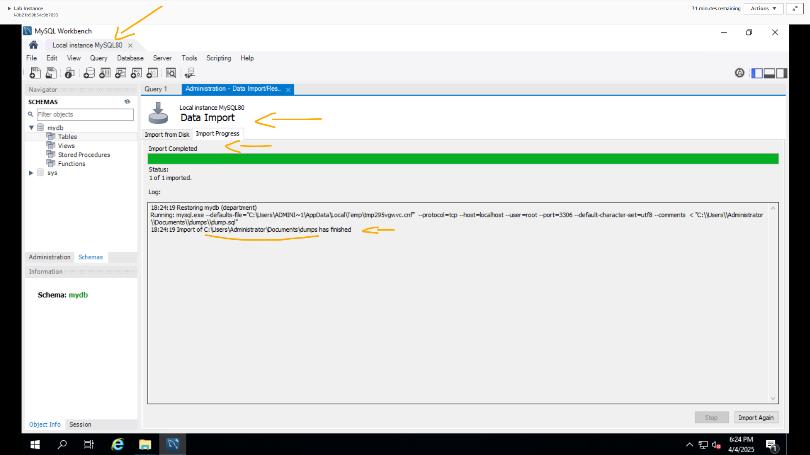<br>
    <figcaption>Imagem 03.</figcaption>
</figure></div><br>

Para confirmar que os dados tinham sidos importados com sucesso foi executada a query `Select * from mydb.employee;` para exibir todas as colunas da tabela `employee` do banco de dados `mydb`. A imagem 04 evidencia o resultado da consulta. Note que antes da importação, o banco `mydb` não possuía nenhuma tabela, ou seja, todas as tabelas, que no caso eram três, foram importadas para esse banco com seus respectivos dados.

<div align="Center"><figure>
    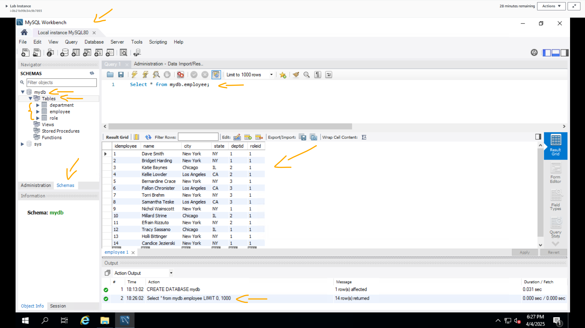<br>
    <figcaption>Imagem 04.</figcaption>
</figure></div><br>

<a name="item01.3"><h4>Tarefa 3: Use o MySQL Workbench para conectar-se à sua instância do RDS</h4></a>[Back to summary](#item0)

Após conectar-se ao servidor **MySQL** local (simulado na própria instância EC2), nesta tarefa o objetivo foi utilizar o **MySQL Workbench** para se conectar ao servidor **MySQL** na instância do **Amazon Aurora** no **Amazon RDS**. Não foi necessário provisionar a instância do Aurora, pois o laboratório adiantou esse processo, já que o foco era na utilização do serviço **AWS DMS**. Enquanto o **MySQL Server** local (instalado na instância EC2) funcionaria como origem da migração de dados, a instância do Aurora foi utilizado como destino, recebendo os dados dessa migração. 

Ao provisionar um banco de dados no **Amazon Aurora**, sempre é criado um cluster, mesmo que apenas um nó (instância) faça parte desse cluster. Neste caso, o endpoint do cluster vai sempre apontar para a única instância existente, e essa instância será sempre a primária (Gravação). Esse endpoint precisou ser copiado, pois seriam utilizado ao configurar a conexão no **MySQL Workbench**. O laboratório facilitou fornecendo o endpoint no parâmetro `ClusterEndpoint` em suas instruções (`labstack-de42019e-0e8d-465e-bfe3-d71-auroracluster-jkpgs7kuo6kd.cluster-c4ei0qsq1m4k.us-east-1.rds.amazonaws.com`).

Na sequência, um novo acesso remoto foi realizado na instância **Amazon EC2**, porém dessa vez sem interface gráfica, apenas CLI. Para isso foi utilizado o recurso *Session Manager*, também do **AWS SSM**, passado o arquivo de chave privada do par de chaves vinculado a essa instância. O laboratório facilitou esse processo ao fornecer a URL completa para esta sessão remota através do parâmetro `Ec2InstanceSessionCLI` em suas instruções (`https://us-east-1.console.aws.amazon.com/systems-manager/session-manager/i-0b21b99b34c9b7893`). No terminal aberto, os comandos abaixo foram executados, passando o endpoint copiado no segundo comando para que ele fosse salvo no arquivo de nome `ClusterEndpoint.txt`.

```bash 
cd C:\Users\Administrator\Desktop\
echo "labstack-de42019e-0e8d-465e-bfe3-d71-auroracluster-jkpgs7kuo6kd.cluster-ro-c4ei0qsq1m4k.us-east-1.rds.amazonaws.com" > ClusterEndpoint.txt
```

Essa parte poderia ser realizada no próprio acesso remoto gráfico, indo na pasta `C:\Users\Administrator\Desktop\` e criando o arquivo `ClusterEndpoint.txt` com o endpoint do cluster do Aurora. De volta a conexão remota gráfica criada pelo *Fleet Manager* do SSM, o arquivo criado com o endpoint foi aberto para copiá-lo dentro da instância EC2. O **MySQL Workbench** foi novamente utilizado, configurando uma segunda conexão com as seguintes informações, conforme registrado na imagem 05:
- `Conection Name` (Nome da Conexão): `aurora`.
- `Hostname` (Nome do host): foi excluído o localhost (`127.0.0.1`) e inserindo o endpoint do cluster do **Amazon Aurora**, que tinha sido copiado do arquivo `ClusterEndpoint.txt`.
- `Username` (Nome de usuário): `admin` (administrador).
- `Store in Vault...` (Armazenar no Vault…):
    - `Password` (Senha): foi colado o valor do parâmetro `DBPassword` listado nas instruções do lab (`algb9MOZC`). Essa senha foi utilizada tanto no Aurora como no servidor **MySQL** local (instância EC2).

A conexão após criada, foi testada e confirmada. A imagem 06 exibe que agora haviam duas conexões, uma com o **MySQL Server** instalado na própria instância EC2 e a outra com o **MySQL** utilizado no **Amazon Aurora** no RDS.

<div align="Center"><figure>
    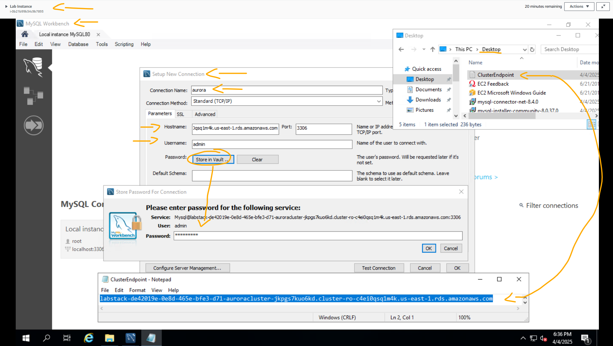<br>
    <figcaption>Imagem 05.</figcaption>
</figure></div><br>

<div align="Center"><figure>
    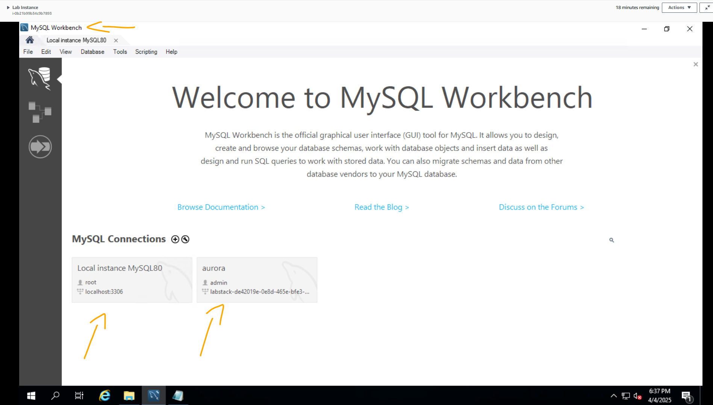<br>
    <figcaption>Imagem 06.</figcaption>
</figure></div><br>

A conexão com o Aurora foi aberta e a consulta `Select * from mydb.employee;` foi executada para mostrar que não haviam dados no Aurora. A imagem 07 confirma que o Aurora ainda não possuía o banco de dados `mydb` com as respectivas tabelas e dados.

<div align="Center"><figure>
    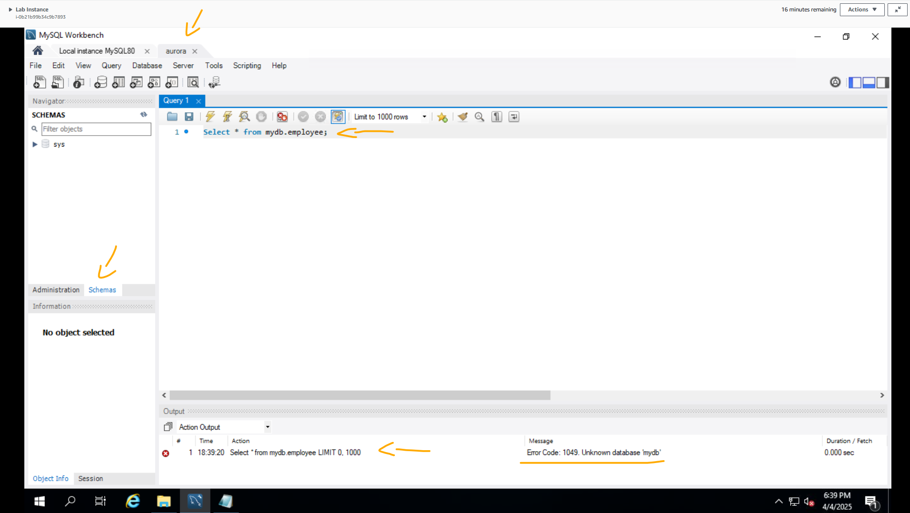<br>
    <figcaption>Imagem 07.</figcaption>
</figure></div><br>

<a name="item01.4"><h4>Tarefa 4: migre seu banco de dados MySQL de origem para sua instância Aurora usando o AWS Database Migration Service</h4></a>[Back to summary](#item0)

A última tarefa consistiu em executar a migração do banco de dados de origem, que era o **MySQL Server** na instância **Amazon EC2**, para o banco de dados de destino, que era o **MySQL** no **Amazon Aurora** no **Amazon RDS**. Essa tarefa foi sub-divida nas quatro etapas seguintes:
- Criar uma instância de replicação.
- Criar um ponto de extremidade de origem.
- Criar um ponto de extremidade de destino.
- Criar uma tarefa de migração de banco de dados.

A primeira etapa na migração de dados usando o **AWS Database Migration Service (DMS)** é criar uma instância de replicação. Uma instância de replicação (`replication instance`) do **AWS DMS** é executada em uma instância do **Amazon Elastic Compute Cloud (EC2)**. Uma replication instance fornece alta disponibilidade e suporte a failover usando uma implantação Multi-AZ. O **AWS DMS** usa uma instância de replicação que se conecta ao armazenamento de dados de origem, lê os dados de origem e formata os dados para consumo pelo armazenamento de dados de destino. Uma replication instance também carrega os dados no armazenamento de dados de destino. A maior parte desse processamento acontece na memória. No entanto, transações grandes podem exigir algum buffer no disco. Transações em cache e arquivos de log também são gravados no disco. Dessa forma, o console do DMS foi acessado e uma instância de replicação foi provisionada da seguinte forma:
- `Settings` (Configurações):
    - `Name` (Nome): `replicationInstance` (replicaçãoInstância).
    - `Description - optional` (Descrição - opcional): `replicationInstance` (replicaçãoInstância).
- `Instance configuration` (Configuração de instância):
    - `Instance class` (Classe de instância): `dms.t3.micro`.
    - `High Availability` (Alta disponibilidade): `Dev or test workload (Single-AZ)` (Carga de trabalho de desenvolvimento ou teste (Single-AZ)).
- `Connectivity and security` (Conectividade e segurança):
    - `Virtual private cloud (VPC) for IPv4` (Nuvem privada virtual (VPC) para IPv4): `Lab-VPC`.
    - `Replication subnet group` (Grupo de sub-redes de replicação): `default-vpc-0aa7fa86006c20608`. Esse grupo era provisionado junto com a instância de replicação.
    - `Public accessible` (Acessível ao público): essa opção foi desmarcada.
- `Advanced settings` (Configurações avançadas):
    - `AWS KMS Key` (Chave do AWS KMS): `Enter a key ARN` (Insira um ARN de chave). Essa passo não foi indicado pelo laboratório, mas a configuração padrão utilizava `aws/dms` que era a chave provisionada pelas pilhas do **AWS CloudFormation** ao iniciar o lab. Entretanto, ao tentar criar a instância de replicação dava erro ao informar que não encontrar a chave. Portanto, tive que passar a ARN da chave manualmente.
    - `Enter a key ARN` (Insira um ARN de chave): foi inserido a ARN da chave `aws/dms` (`arn:aws:kms:us-east-1:767503978114:key/a30a57dc-7534-4bdb-b797-9dad1fec8909`). 

A imagem 08 mostra a replication instance provisionada com sucesso. O tempo de provisionamento pode variar entre 5 a 10 minutos para ser concluído.

<div align="Center"><figure>
    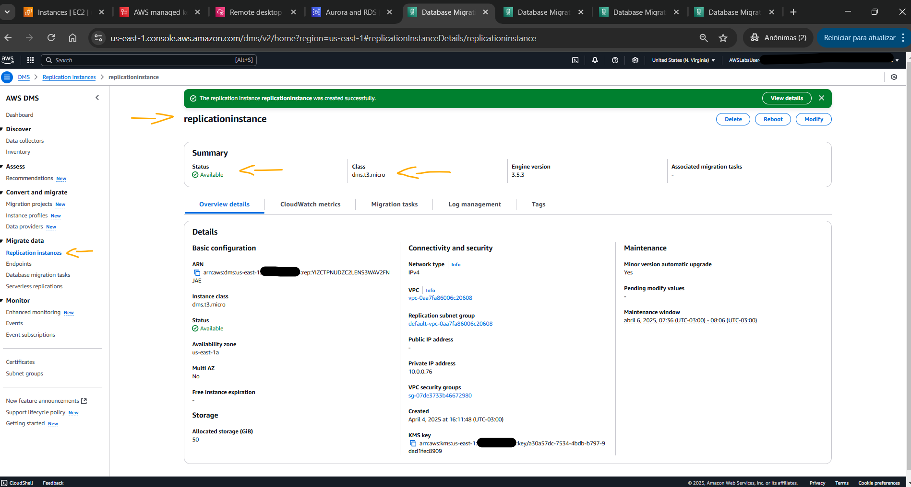<br>
    <figcaption>Imagem 08.</figcaption>
</figure></div><br>

Um endpoint fornece informações de conexão, tipo de armazenamento de dados e localização sobre o armazenamento de dados. O **AWS Database Migration Service (DMS)** usa essas informações para se conectar a um armazenamento de dados e migrar dados de um endpoint de origem para um endpoint de destino. É possível especificar atributos de conexão adicionais para um endpoint usando atributos de conexão extras. Esses atributos podem controlar o registro em log, o tamanho do arquivo e outros parâmetros. Portanto, o endpoint de origem foi configurado da seguinte forma:
- `Endpoint type` (Tipo de ponto de extremidade): `Source endpoint` (Ponto de extremidade de origem).
- `Endpoint configuration` (Configuração do ponto de extremidade):
    - `Endpoint identifier` (Identificador de ponto de extremidade): `MySQL`.
    - `Source engine` (Mecanismo de origem): `MySQL`.
    - `Access to endpoint database` (Acesso ao banco de dados de endpoint): `Provide access information manually` (Forneça informações de acesso manualmente):
        - `Server name` (Nome do servidor): foi inserido o valor do parâmetro `WindowsPrivateIP` fornecido pelo lab (`10.0.0.117`). Este era o IP privado da instância EC2 **Windows Server**, onde estava o **MySQL Server** com o banco de dados de origem.
        - `Port` (Porta): `3306`.
        - `User name` (Nome de usuário): `admin` (administrador).
        - `Password` (Senha): foi inserido o valor do parâmetro `DBPassword` fornecido pelo laboratório em suas instruções (`algb9MOZC`). Esse tinha sido a senha configurada para o usuário `admin` no servidor **MySQL** na instância do **Amazon EC2**.
- `Test endpoint connection - optional` (Teste a conexão do ponto de extremidade - opcional):
    - `Replication instance` (Instância de replicação): foi selecionada a instância de replicação provisionada cuja tag de nome era `replicationinstance`.
    - Foi selecionada a opção `Run test` (Executar teste).

Para que a execução do teste pudesse ser realizada, foi necessário aguardar a instância ficar ativa. Com o teste bem sucessido, o ponto de extremidade de origem foi provisionado, conforme imagem 09. 

<div align="Center"><figure>
    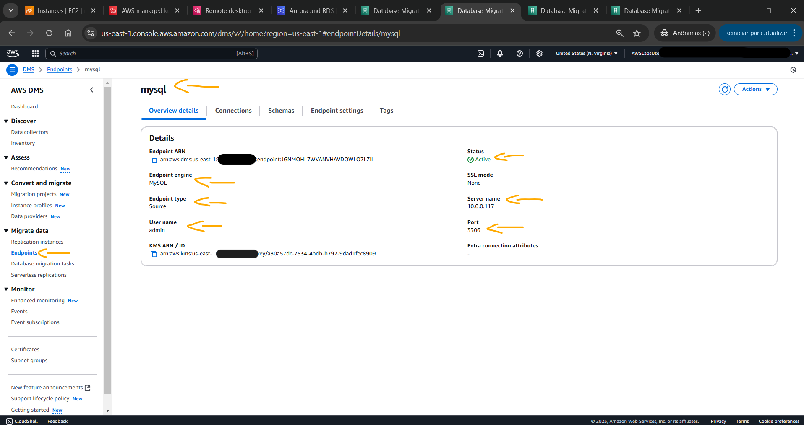<br>
    <figcaption>Imagem 09.</figcaption>
</figure></div><br>

O endpoint de destino foi definido com a seguinte configuração:
- `Endpoint type` (Tipo de ponto de extremidade): `Target endpoint` (Ponto de extremidade de destino).
    - Foi habilitada a opção `Select RDS DB instance` (Selecione a instância do RDS DB):
        - `RDS Instances` (Instância RDS): a única RDS que aparecia foi selecionada, que era justamente a instância do Aurora, cujo identificador era `labstack-de42019e-0e8d-465e-bfe3-d7-aurorainstance-hppgbcarvtud`.
- `Endpoint configuration` (Configuração do ponto de extremidade):
    - `Endpoint identifier` (Identificador de ponto de extremidade): `aurora`.
    - `Access to endpoint database` (Acesso ao banco de dados de endpoint): `Provide access information manually` (Forneça informações de acesso manualmente):
        - `User name` (Nome de usuário): `admin` (administrador).
        - `Password` (Senha): foi inserido o valor do parâmetro `DBPassword` fornecido pelo laboratório em suas instruções (`algb9MOZC`). Essa tinha sido a senha configurada para o usuário `admin` no Aurora.
- `Test endpoint connection - optional` (Teste a conexão do ponto de extremidade - opcional):
    - `Replication instance` (Instância de replicação): foi selecionada a instância de replicação provisionada cuja tag de nome era `replicationinstance`.
    - Foi selecionada a opção `Run test` (Executar teste).

A imagem 10 exibe o segundo endpoint provisionado com sucesso, no qual este, era o ponto de extremidade de destino.

<div align="Center"><figure>
    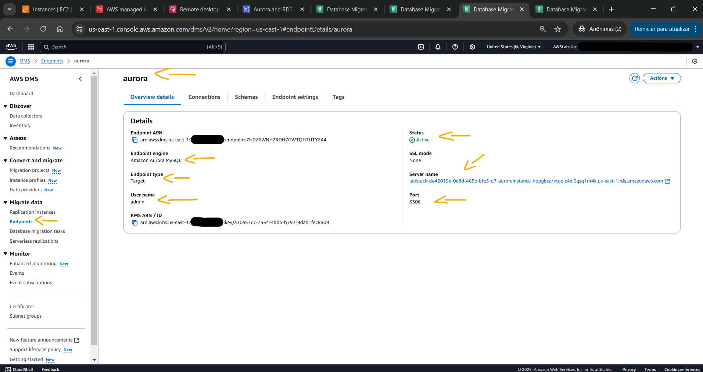<br>
    <figcaption>Imagem 10.</figcaption>
</figure></div><br>

Uma tarefa do **AWS Database Migration Service (DMS)** é onde todo o trabalho acontece. As tarefas são utilizadas para migrar dados do endpoint de origem para o endpoint de destino, e o processamento da tarefa é feito na instância de replicação. É especificado quais tabelas e esquemas usar para a migração e qualquer processamento especial, como requisitos de registro, dados da tabela de controle e tratamento de erros. A tarefa de migração de banco de dados (`Database migration task`) foi configurada da seguinte forma:
- `Task configuration` (Configuração da tarefa):
    - `Task identifier` (Identificador da tarefa): `MySQL-Aurora`.
    - `Replication instance` (Instância de replicação): foi selecionada a instância de replicação provisionada (`replicationinstance`).
    - `Source database endpoint` (Ponto de extremidade do banco de dados de origem): `mysql`.
    - `Target database endpoint` (Ponto de extremidade do banco de dados de destino): `aurora`.
    - `Migration type` (Tipo de migração): `Migrate` (Migrar).
- `Table mappings` (Mapeamentos de tabela):
    - `Selection rules` (Regras de seleção): `Add new selection rule` (Adicionar nova regra de seleção):
        - `Schema` (Esquema): `Enter a schema` (Insira um esquema).
        - `Source name` (Nome da fonte): `mydb`.
- `Premigration assessment` (Avaliação pré-migração): foi desmarcada a opção `Turn on premigration assessment` (Ativar avaliação pré-migração).

O mapeamento de tabelas usa vários tipos de regras para especificar a fonte de dados, o esquema de origem, os dados e quaisquer transformações que devem ocorrer durante a tarefa. É possível usar o mapeamento de tabelas para especificar tabelas individuais em um banco de dados para migrar e o esquema a ser usado para a migração. Além disso, filtros para especificar quais dados de uma determinada coluna de tabela deseja-se replicar podem ser utilizados e é possível usar transformações para modificar os dados gravados no banco de dados de destino.
 
Após criar a tarefa de migração, o status entra em `Running` (Execução) até `Load complete` (Carramento concluído). Com a migração concluída, a tarefa `mysql-aurora` foi acessada para visualizar a aba de `Table statistics` (Estatísticas da tabela). Isso mostrava as estatísticas da tabela para a tarefa de migração de banco de dados, conforme imagem 11. Perceba que as três tabelas existentes do banco `mydb` no servidor **MySQL** local foram carregadas para o banco de dados no Aurora. 

<div align="Center"><figure>
    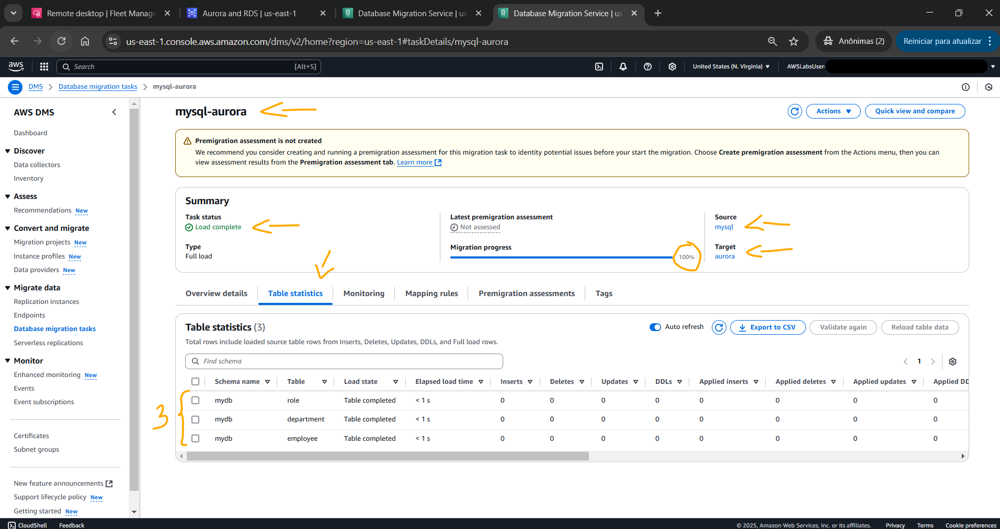<br>
    <figcaption>Imagem 11.</figcaption>
</figure></div><br>

De volta ao **MySQL Workbench** na instância EC2, a conexão com o Aurora foi novamente utilizada para executar a memsa query `Select * from mydb.employee;`. Antes esta consulta não exibia resultados, pois não haviam dados, agora que o banco de dados `mydb` foi migrado, ela retornou os registros da tabela `employee`. A imagem 12 exibe o output dessa consulta.

<div align="Center"><figure>
    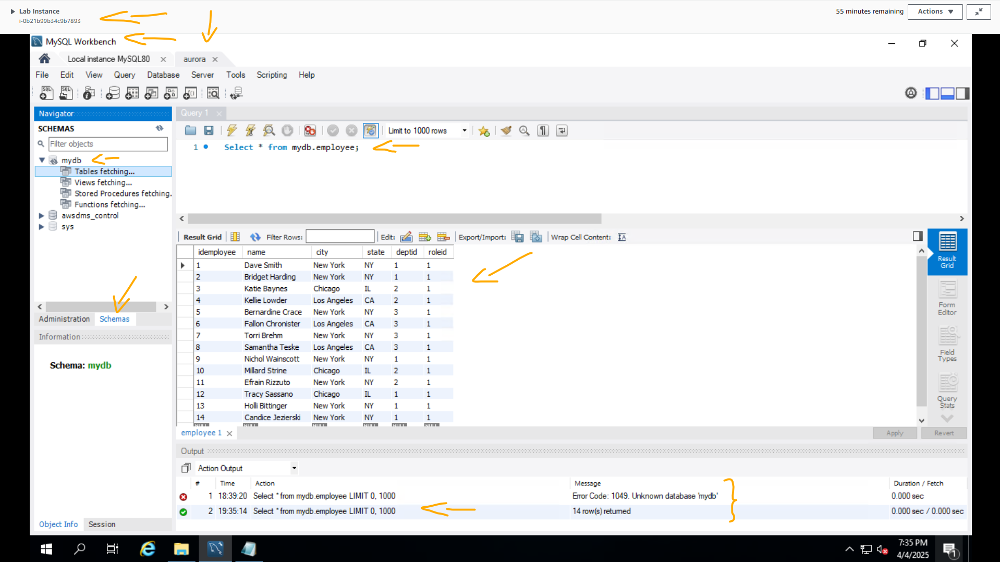<br>
    <figcaption>Imagem 12.</figcaption>
</figure></div><br>