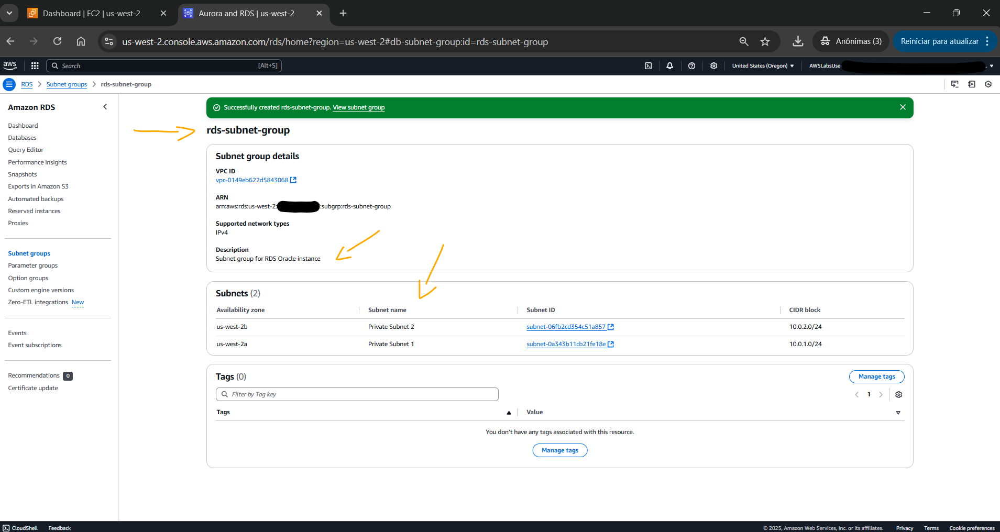
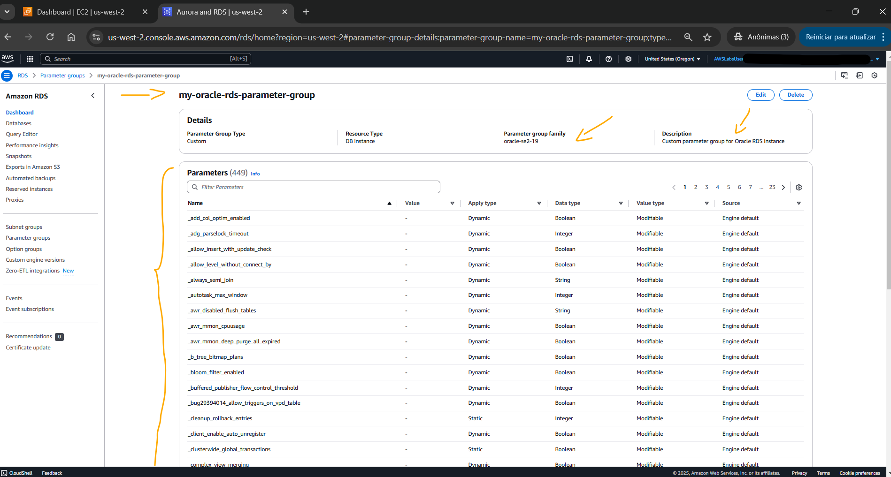
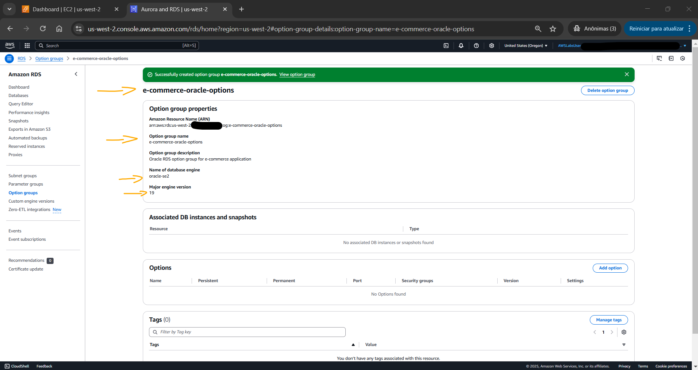
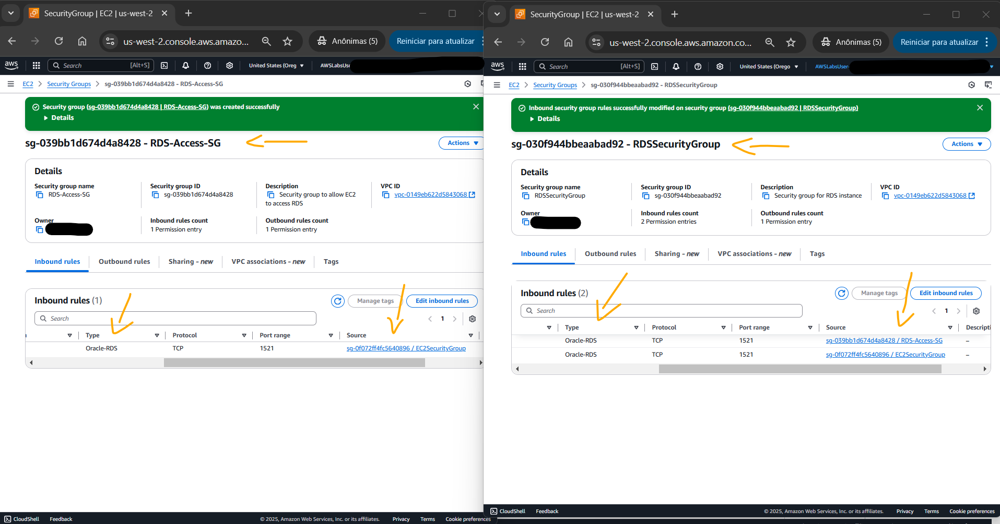
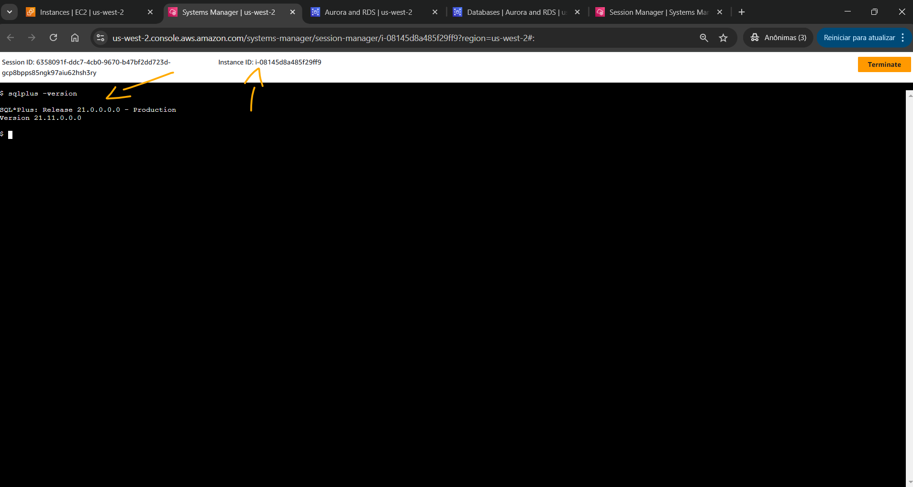

# Lab - Deploy and Manage Oracle Databases with Amazon RDS for Oracle   

### AWS Skill Builder <a href="../../">aws_skill_builder   </a>
### Training Category: <a href="../../self_paced_lab">self_paced_lab</a>
### Software/Subject: aws   
### Course: <a href="./">curso_spl_038 (Lab - Deploy and Manage Oracle Databases with Amazon RDS for Oracle)   </a>

#### Parceria da AWS com a Escola da Nuvem (EDN)   

---

### Theme:
- Cloud Computing
- Data

### Used Tools:
- Operating System (OS): 
  - Windows 11   
- Cloud:
  - Amazon Web Services (AWS)   
- Cloud Services:
  - Amazon Elastic Compute Cloud (EC2)   
  - Amazon Relational Database Service (RDS)   
  - AWS Systems Manager (SSM)   
  - Google Drive   
- Language:
  - HTML   
  - Markdown   
- Integrated Development Environment (IDE) and Text Editor:
  - Visual Studio Code (VS Code)   
- Versioning: 
  - Git   
- Repository:
  - GitHub   
- Command Line Interpreter (CLI):
  - Oracle Instant Client (Oracle IC)   
  - SQL*Plus   
- Server and Databases:
  - Oracle Database   

---

<a name="item0"><h3>Course Strcuture:</h3></a>
1. Lab - Deploy and Manage Oracle Databases with Amazon RDS for Oracle<br>
1.1 <a href="#item01.1">Tarefa 1: Configurar a instância do banco de dados Oracle RDS</a><br>
1.2 <a href="#item01.2">Tarefa 2: Conectar ao RDS Oracle Database do EC2</a><br>
1.3 <a href="#item01.3">Tarefa 3: Criar objetos de banco de dados na instância Oracle do RDS</a><br>
1.4 <a href="#item01.4">Tarefa 4: Testar failover multi-AZ</a><br>

---

### Objective:
Este laboratório teve como objetivo provisionar uma instância do **Oracle Database** no **Amazon Relational Database Service (RDS)** com implantação multi-AZ, utilizar uma instância do **Amazon EC2** como bastion host para conectar-se ao banco de dados, interagir com ele por meio da criação de tabelas e inserção de dados e, por fim, testar o failover.

### Structure:
A estrutura do curso é formada por:
- Este arquivo de README.
- A pasta `0-aux`, pasta auxiliar com imagens utilizadas na construção desse arquivo de README.

### Development:
Este curso foi um laboratório prático realizado na plataforma **AWS Skill Builder**, cuja subscrição foi devida a uma parceria entre a **AWS** e a **Escola da Nuvem**. A infraestrutura de cloud utilizada foi fornecida através de um sandbox do **AWS Skill Builder** que possibilitava acesso ao console da **AWS**. Contudo foi necessário seguir estritamente as orientações determinadas no laboratório. Dessa maneira, a forma de interação com os recursos da cloud foram sempre através do console fornecido pelo sandbox, a não ser em casos em que o próprio laboratório instruiu para utilização de outras ferramentas de interação como **AWS CLI** ou **AWS SDK**.

O laboratório do **AWS Skill Builder** tem o foco em executar apenas o que é orientado no escopo, todos os recursos ou serviços que podem ser requisitados adicionalmente já vêm provisionados por padrão pelo laboratório. Ao iniciar o laboratório, o sandbox do **AWS Skill Builder** provisiona diversos recursos e serviços para o funcionamento através de uma ou mais pilhas do **AWS CloudFormation** de forma automática. 

O acesso ao console no sandbox do **AWS Skill Builder** é realizado por meio de uma identidade federada. O Skill Builder funciona como um provedor de identidade (IdP), autenticando o usuário e vinculando-o a uma role do **AWS IAM** provisionada automaticamente por uma das pilhas do CloudFormation. Essa role concede permissões temporárias e mínimas necessárias para a execução do laboratório, garantindo segurança e controle sobre os recursos utilizados. O laboratório, por padrão, determina a região a ser utilizada e ela não deve ser alterada, somente se o próprio laboratório indicar. As configurações não informadas no laboratório devem ser sempre mantidas como padrão que estão.

<a name="item01.1"><h4>Tarefa 1: Configurar a instância do banco de dados Oracle RDS</h4></a>[Back to summary](#item0)

A primeira tarefa deste laboratório consistiu em provisionar uma instância de banco de dados **Oracle Database** no **Amazon Relational Database Service (RDS)** com implantação multi-AZ. Para execução do provisionamento, foi necessário primeiro criar os seguintes recursos: grupo de sub-redes, grupo de parâmetros e grupo de opções. A configuração de cada um deles foi descrita abaixo:
- `Subnet Group` (Grupo de sub-rede):
    - `Name` (Nome): `rds-subnet-group`.
    - `Description` (Descrição): `Subnet group for RDS Oracle instance` (Grupo de sub-rede para instância RDS Oracle).
    - `VPC`: `Lab VPC`.
    - `Availability zones` (Zonas de disponibilidade): `us-west-2a` e `us-west-2b`.
    - `Subnets` (Sub-redes): `Private Subnet 1` (Sub-rede Privada 1) e `Private Subnet 2` (Sub-rede Privada 2).

A imagem 01 ilustra a criação do grupo de sub-redes com duas sub-redes privadas, cada uma em uma zona de disponibilidade diferente. Esse grupo de sub-rede foi usado quando a instância do banco de dados Oracle RDS fosse provisionada. 

<div align="Center"><figure>
    <br>
    <figcaption>Imagem 01.</figcaption>
</figure></div><br>

- `Parameter group` (Grupo de parâmetros):
    - `Parameter group name` (Nome do grupo de parâmetros): `my-oracle-rds-parameter-group`.
    - `Description` (Descrição): `Custom parameter group for Oracle RDS instance` (Grupo de parâmetros personalizados para instância Oracle RDS).
    - `Engine type` (Tipo de engenheiro): `Orcale Standard Edition Two`.
    - `Parameter group family` (Família de grupos de parâmetros): `oracle-se2-19`.

A imagem 02 exibe o grupo de parâmetros construído para a instância **Oracle Database** no RDS. O Grupo de Parâmetros permite que sejam personalizadas as definições de configuração do banco de dados para otimizar o desempenho e atender a requisitos específicos.

<div align="Center"><figure>
    <br>
    <figcaption>Imagem 02.</figcaption>
</figure></div><br>

- `Option group` (Grupo de opções):
    - `Name` (Nome): `e-commerce-oracle-options`.
    - `Description` (Descrição): `Oracle RDS option group for e-commerce application` (Grupo de opções Oracle RDS para aplicativo de comércio eletrônico).
    - `Engine` (Motor): `oracle-se2`.
    - `Major Engine Version` (Versão Principal do Motor): `19`.

A imagem 03 comprova que o grupo de opções foi criado. Um *Option Group* no **Amazon RDS** é uma coleção de opções de mecanismo de banco de dados que pode ser aplicado às instâncias do RDS. Essas opções fornecem funcionalidades ou recursos adicionais que não fazem parte da configuração padrão do mecanismo de banco de dados. Para uma instância do RDS Oracle, um *Option Group* pode incluir recursos como **Oracle Enterprise Manager (OEM) Express**, **Oracle Transparent Data Encryption (TDE)** e **Oracle Advanced Security**. Ao criar ou modificar uma instância do RDS Oracle, é possível associá-la a um *Option Group* específico para habilitar os recursos e funcionalidades adicionais desejados, permitindo que seja personalizado o mecanismo de banco de dados para atender aos requisitos específicos. Neste caso, o *Option Group* foi criado para garantir que a instância RDS Oracle estivesse configurada para atender aos requisitos específicos do aplicativo de e-commerce.

<div align="Center"><figure>
    <br>
    <figcaption>Imagem 03.</figcaption>
</figure></div><br>

Esses três grupo construídos foram utilizado para o provisionamento da instância de banco de dados **Oracle Database** no RDS com implantação multi-AZ. Essa instância foi definida com as seguintes configurações:
- `Engine type` (Tipo de mecanismo): `Oracle`.
- `Edtion` (Edição): `Oracle Standard Edition Two`.
- `Engine version` (Versão do mecanismo): foi selecionado a versão mais recente (`Oracle 19.0.0.0.ru-2025-01.rur-2025-01.r2`).
- `Templates` (Modelos): `Dev/Teste`.
- `Settings` (Configurações):
    - `DB instance identifier` (identificador da instância do BD): `oracle-db`.
    - `Master username` (Nome de usuário mestre): foi utilizado o valor do parâmetro `DBUsername` nas instruções do lab (`admin`).
    - `Credentials management` (Gerenciamento de credenciais): `Self managed` (Autogerenciado).
        - `Master password` (Senha mestra): foi utilizado o valor do parâmetro `DBPassword` nas instruções do lab (`yv2lExx0nYLt`).
        - `Confirm Master password` (Confirmar Senha mestra): foi utilizado o valor do parâmetro `DBPassword` nas instruções do lab (`yv2lExx0nYLt`).
- `Instance configuration` (Configuração de instância): `Burstable classes (includes t classes)` (Classes Burstable (inclui classes t))
    - `DB instance classe` (Classe de instância do BD): `db.t3.small`.
- `Availability & durability` (Disponibilidade e durabilidade):
    - `Multi-AZ deployment` (Implantação Multi-AZ): `Create a standby instance (recommended for production usage)` (Criar uma instância em espera (recomendado para uso em produção)). Esta opção era necessária para criar o banco de dados na configuração Multi-AZ.
- `Connectivity` (Conectividade):
    - `Virtual private cloud (VPC)` (Nuvem privada virtual (VPC)): `Lab VPC`.
    - `DB subnet group` (Grupo de sub-rede do banco de dados): `rds-subnet-group`.
    - `Existing VPC security groups`: foi selecionado o grupo `RDSSecurityGroup` e desmarcado o grupo `default`.
- `Monitoring` (Monitoramento):
    - Foi desmarcada a opção `Enable Performance insights` (Habilitar Insights de Desempenho).
    - `Additional monitoring settings` (Configurações adicionais de monitoramento): foi desmarcada a opção `Enable Enhanced monitoring` (Habilitar monitoramento aprimorado).
- `Additional configuration` (Configuração adicional):
    - `Initial database name` (Nome inicial do banco de dados): `mydb`.
    - `DB parameter group` (Grupo de parâmetros do BD): `my-oracle-rds-parameter-group`.
    - `Option group` (Grupo de opções): `e-commerce-oracle-options`.
    - Foi desmarcada a opção `Enable encryption` (Habilitar criptografia).

A imagem 04 evidencia o provisionamento da instância de banco de dados **Oracle Database** no **Amazon RDS** com implantação multi-AZ. O processo levou aproximadamente de 10 a 15 minutos para ser concluído. 

Infelizmente a execução desse laboratório foi pausada aqui, pois a role que era utilizada para acessar o lab não tinha permissão para criar instância RDS. Todo o passo a passo de como seria execução foi escrito, porém as capturas de tela não foram tiradas. Por enquanto, fico no aguardo da correção do lab por parte do **AWS Skill Builder** para que eu possa concluí-lo.

<div align="Center"><figure>
    <br>
    <figcaption>Imagem 04.</figcaption>
</figure></div><br>

<a name="item01.2"><h4>Tarefa 2: Conectar ao RDS Oracle Database do EC2</h4></a>[Back to summary](#item0)

Com o banco de dados construído, o objetivo dessa tarefa foi conectar-se ao banco utilizando uma instância **Amazon EC2** como bastion host. Para isso, primeiro foi necessário configurar o security group para permitir a comunicação entre as máquinas. As duas instâncias, EC2 e RDS, já possuíam um grupo de segurança anexado, cujos nomes era `EC2SecurityGroup` e `EC2SecurityGroup`, respectivamente. Ao invés de liberar a comunicação nos security groups existentes de cada uma delas, um terceiro grupo de segurança foi provisionado para servir de ponte entre os dois grupos existentes, sendo configurado da seguinte forma:
- `Security group name` (Nome do grupo de segurança): `RDS-Access-SG`.
- `Description` (Descrição): `Security group to allow EC2 to access RDS` (Grupo de segurança para permitir que o EC2 acesse o RDS).
- `VPC`: `Lab VPC`.
- `Inbound rules` (Regras de entrada):
    - `Type` (Tipo): `Oracle-RDS`.
    - `Source` (Fonte): `EC2SecurityGroup`.
- `Outbound rules` (Regras de saída):
    - `Type` (Tipo): `All traffic` (Todo o tráfego).
    - `Destination` (Destino): `RDSSecurityGroup`.

Basicamente, esse grupo recebia todo tráfego vindo do security group da instância EC2 e encaminhava para o security group da instância do RDS. Contudo, ainda era preciso que o grupo de segurança da instância RDS permitisse receber esse tráfego. Dessa forma, uma nova regra de entrada foi adicionada no grupo de segurança `RDSSecurityGroup` da seguinte forma:
    - `Type` (Tipo): `Oracle-RDS`.
    - `Source` (Fonte): `RDS-Access-SG`.

A imagem 05 mostra como ficaram os grupos de segurança de ponte e da instância RDS. Nenhuma alteração foi realizada no security group da instância EC2.

<div align="Center"><figure>
    <br>
    <figcaption>Imagem 05.</figcaption>
</figure></div><br>

Com a comunicação entre as máquinas liberadas, um acesso remoto da máquina física **Windows** à instância do **Amazon EC2** foi executada para que de dentro dela fosse conectado ao banco de dados **Oracle Database** na instância RDS. Esse acesso remoto foi executado através do recurso *Session Manager* do **AWS Systems Manager (SSM)**. O laboratório facilitou o trabalho fornecendo o link da sessão remota do *Session Manager* no parâmetro `CommandHostSessionUrl` (`https://us-west-2.console.aws.amazon.com/systems-manager/session-manager/i-08145d8a485f29ff9`). No terminal da sessão, o comando `sqlplus -version` foi executado, conforme imagem 06, para verificar se o **SQL\*Plus** estava instalado na instância EC2. O **SQL\*Plus** é um software de interface de linha de comando (CLI) para interagir com sistema de banco de dados **Oracle Database**. Ele pode ser executado a partir do **Oracle Instant Client**, que é um conjunto leve de bibliotecas e ferramentas que permite que aplicativos interajam com um banco de dados **Oracle** sem precisar de uma instalação completa do **Oracle Database**.

<div align="Center"><figure>
    <br>
    <figcaption>Imagem 06.</figcaption>
</figure></div><br>

Para conectar-se a partir da instância EC2 ao banco de dados **Oracle Database** no RDS, foi necessário copiar o endpoint e a porta (`1521`) na seção de conectividade da instância RDS. Em seguida, essas informações foram inseridas na string de conexão `sqlplus <DBUsername>/<DBPassword>@//<RDSEndpoint>:1521/<DBName>`. O nome e senha do usuário utilizado foi do usuário master, e o nome do banco de dados foi `mydb`, todos definidos ao provisionar a instância. Dessa forma, o comando executado para conexão foi `sqlplus admin/yv2lExx0nYLt@//<RDSEndpoint>:1521/mydb`. Após conectar, o comando SQL `SELECT * FROM DBA_TABLES FETCH FIRST 10 ROWS ONLY;` foi executado para confirmar se o banco de dados estava funcionando corretamente. A imagem 07 evidencia a conexão entre a instância EC2 e o banco de dados **Oracle Database** no RDS, bem como o resultado da consulta, que exibia uma lista das dez primeiras tabelas do banco.

<div align="Center"><figure>
    <br>
    <figcaption>Imagem 07.</figcaption>
</figure></div><br>

<a name="item01.3"><h4>Tarefa 3: Criar objetos de banco de dados na instância Oracle do RDS</h4></a>[Back to summary](#item0)

Na tarceira tarefa, o objetivo foi interagir com o banco de dados **Oracle Database** através do **SQL\*Plus** para criar tabelas duas tabelas (`PRODUCTS` e `ORDERS`) e inserir dados nelas. Os dois comandos para criação da tabela seguem abaixo. Em seguida, com o comando `SELECT TABLE_NAME FROM USER_TABLES;` foi verificado se as duas tabelas foram criadas com sucesso, conforme exibido na imagem 08.

```sql
CREATE TABLE PRODUCTS (
  PRODUCT_ID NUMBER PRIMARY KEY,
  NAME VARCHAR2(100),
  PRICE NUMBER(10,2),
  STOCK NUMBER
);
```

```sql
CREATE TABLE ORDERS (
  ORDER_ID NUMBER PRIMARY KEY,
  ORDER_DATE DATE,
  CUSTOMER_ID NUMBER,
  TOTAL_AMOUNT NUMBER(10,2)
);
```

<div align="Center"><figure>
    <br>
    <figcaption>Imagem 08.</figcaption>
</figure></div><br>

A inserção dos dados foi executada apenas na tabela `PRODUCTS` utilizando o comando abaixo. Em seguida, com o comando `SELECT * FROM PRODUCTS;` foi confirmado se os dados tinham sido inseridos com sucesso. A imagem 09 mostra a tabela preenchida. Por fim, para salvar os dados, foi executado o comando `COMMIT;`

```sql
INSERT ALL
  INTO products (product_id, name, price, stock) VALUES (1, 'Widget A', 19.99, 100)
  INTO products (product_id, name, price, stock) VALUES (2, 'Widget B', 29.99, 150)
  INTO products (product_id, name, price, stock) VALUES (3, 'Widget C', 9.99, 200)
  INTO products (product_id, name, price, stock) VALUES (4, 'Widget D', 39.99, 120)
  INTO products (product_id, name, price, stock) VALUES (5, 'Widget E', 49.99, 110)
  INTO products (product_id, name, price, stock) VALUES (6, 'Widget F', 59.99, 100)
SELECT * FROM dual;
```

<div align="Center"><figure>
    <br>
    <figcaption>Imagem 09.</figcaption>
</figure></div><br>

<a name="item01.4"><h4>Tarefa 4: Testar failover multi-AZ</h4></a>[Back to summary](#item0)

A última tarefa consistiu em testar o failover da implantação multi-AZ da instância de banco de dados **Amazon RDS**. Dessa forma, no terminal conectado ao banco de dados **Oracle Database**, o comando `SELECT (SELECT database_role FROM v$database) as database_role,host_name,database_status FROM V$INSTANCE;` foi executado para visualizar qual era a instância RDS que estava conectada. Em seguida, o comando `EXIT;` foi executado para encerrar a conexão com o banco de dados. Como a implantação era multi-AZ, existiam duas instâncias RDS, cada uma em uma zona de disponibilidade diferente. Ambas executavam o mesmo banco de dados. Entretanto, uma era definida como primária e a outra como secundária. Até o momento, a conexão com o banco de dados tinha sido realizada apenas na instância primária, conforme mostrado na imagem 10.

<div align="Center"><figure>
    <br>
    <figcaption>Imagem 10.</figcaption>
</figure></div><br>

Para testar o failover, no console do **Amazon RDS**, a instância ativa no momento, que era a primária, foi reinicializada com failover. Assim, a instância do RDS iniciava um failover para a instância standby na outra Availability Zone, que era a instância secundária. Esse processo pode levar vários minutos para ser concluído. Durante o failover, o aplicativo, no caso, o banco de dados, poderia passar por um breve período de indisponibilidade, pois a instância primária alternava para o modo de espera. Esse tempo de inatividade é normalmente mínimo, geralmente menor que 60 segundos.

Após o processo de failover ser concluído, a instância primária agora era a instância da outra zona de disponibilidade. No terminal da instância **Amazon EC2**, novamente foi executado o comando de conexão `sqlplus admin/yv2lExx0nYLt@//<RDSEndpoint>:1521/mydb`. Após conectar ao banco de dados, o mesmo comando anterior `SELECT (SELECT database_role FROM v$database) as database_role,host_name,database_status FROM V$INSTANCE;` foi executado para verificar que agora a conexão era realizada com a outra instância. Com o comando `SELECT * FROM PRODUCTS;` foi verificado que essa instância tinha todas as informações executadas na conexão com a instância primária anterior. A imagem 11 evidencia a mudança da instância que atendia a conexão e também os dados armazenados nela.

<div align="Center"><figure>
    <br>
    <figcaption>Imagem 11.</figcaption>
</figure></div><br>