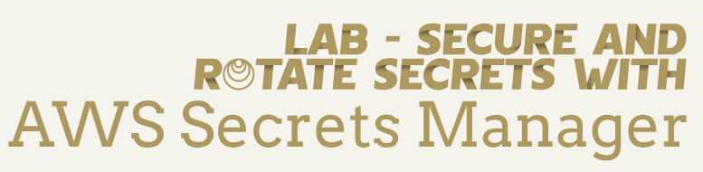
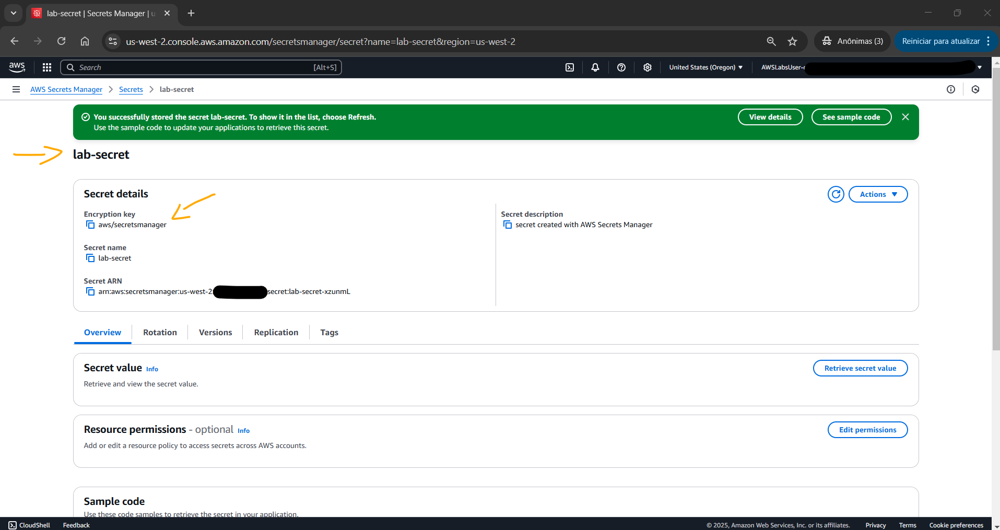
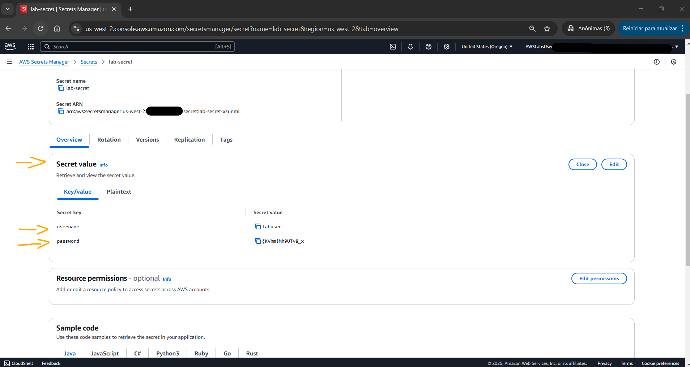
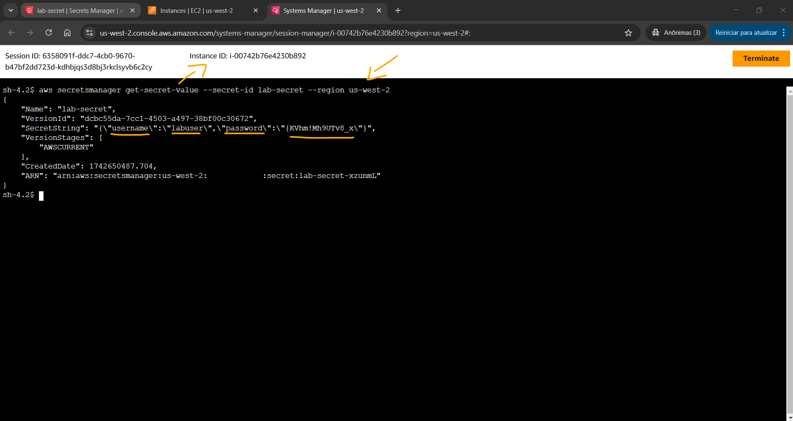
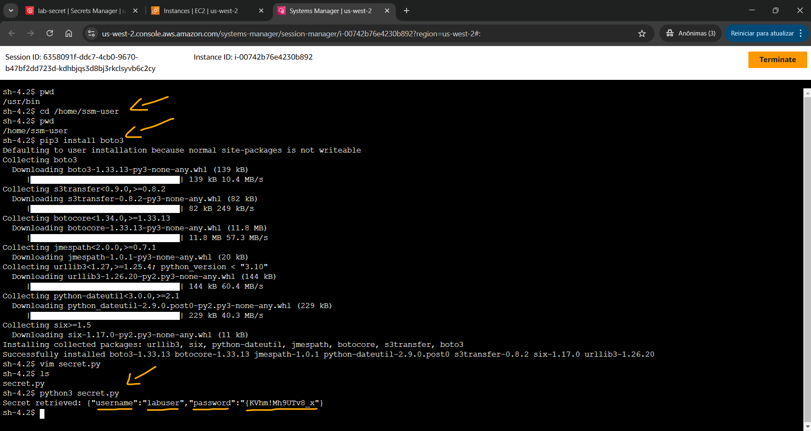
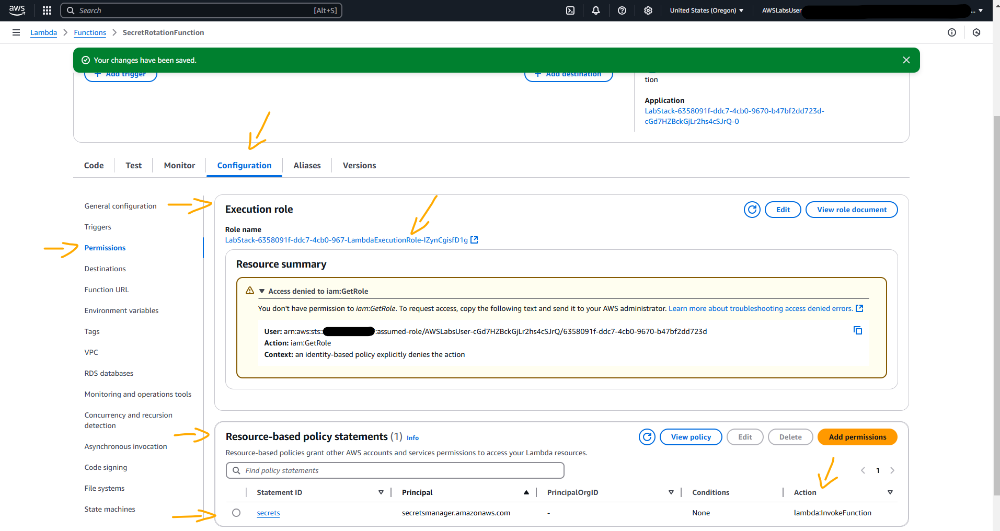
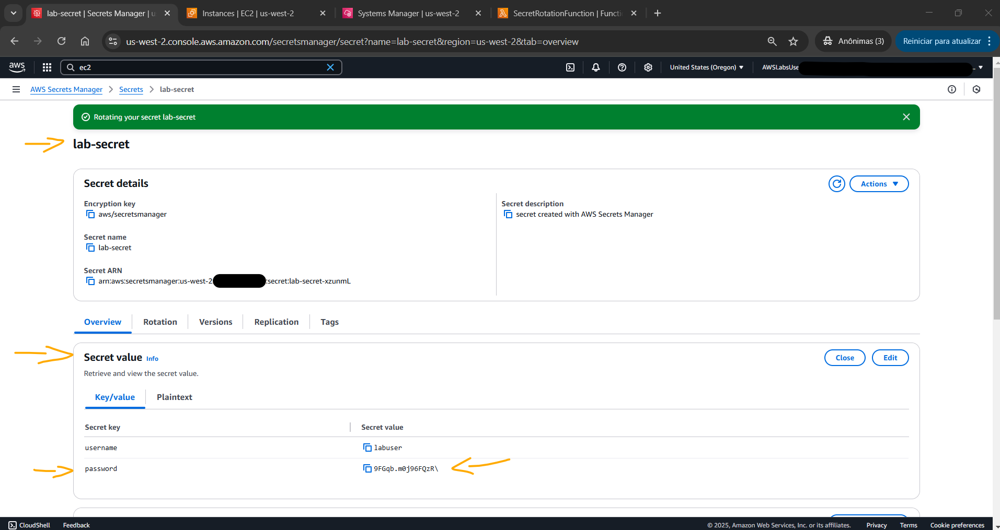
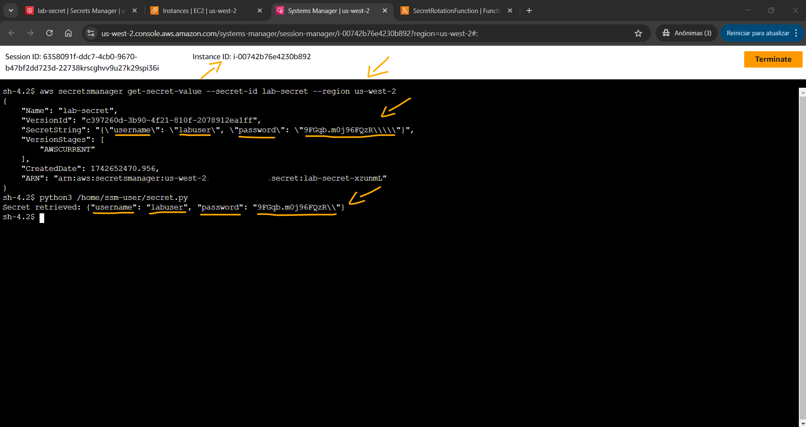
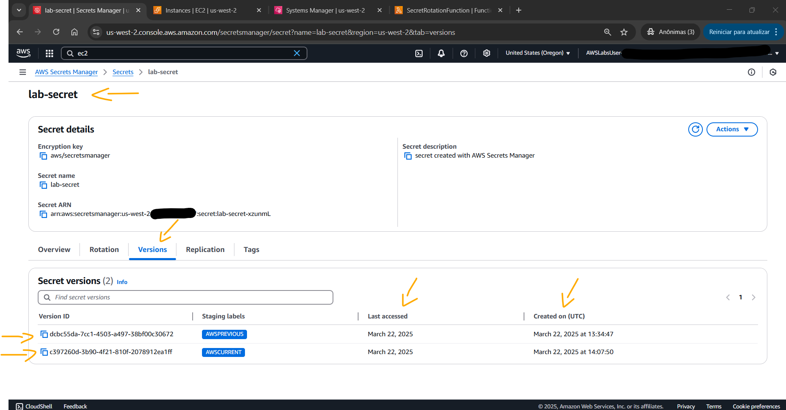
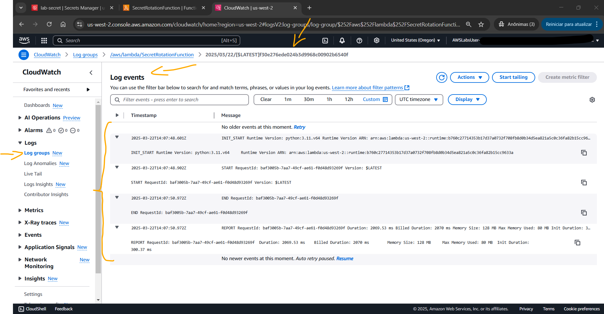

# Lab - Secure and Rotate Secrets with AWS Secrets Manager   

### AWS Skill Builder <a href="../../">aws_skill_builder   </a>
### Training Category: <a href="../../self_paced_lab">self_paced_lab</a>
### Software/Subject: aws   
### Course: <a href="./">curso_spl_039 (Lab - Secure and Rotate Secrets with AWS Secrets Manager)   </a>

#### Parceria da AWS com a Escola da Nuvem (EDN)   

---

### Theme:
- Cloud Computing

### Used Tools:
- Operating System (OS): 
  - Linux   
  - Windows 11   
- Linux Distribution:
  - Amazon Linux   
- Cloud:
  - Amazon Web Services (AWS)   
- Cloud Services:
  - Amazon CloudWatch   
  - Amazon Elastic Compute Cloud (EC2)   
  - AWS Lambda   
  - AWS Secrets Manager    
  - AWS Software Development Kit (SDK) - Boto3   
  - AWS Systems Manager (SSM)   
  - Google Drive   
- Language:
  - HTML   
  - Markdown   
  - Python   
- Integrated Development Environment (IDE) and Text Editor:
  - Visual Studio Code (VS Code)   
  - VI iMproved (Vim)   
- Versioning: 
  - Git   
- Repository:
  - GitHub   
- Command Line Interpreter (CLI):
  - AWS Command Line Interface (CLI)   
  - Bash e Sh   

---

<a name="item0"><h3>Course Strcuture:</h3></a>
1. Lab - Secure and Rotate Secrets with AWS Secrets Manager 
1.1 <a href="#item01.1">Tarefa 1: Criar um segredo no AWS Secrets Manager</a> 
1.2 <a href="#item01.2">Tarefa 2: Revise o segredo armazenado</a> 
1.3 <a href="#item01.3">Tarefa 3: Acesse programaticamente o segredo com a AWS CLI</a> 
1.4 <a href="#item01.4">Tarefa 4: Configurar permissões do Lambda com políticas baseadas em recursos</a> 
1.5 <a href="#item01.5">Tarefa 5: Configurar o Secrets Manager para rodar com o Lambda</a> 
1.6 <a href="#item01.6">Tarefa 6: monitorar e revisar logs do CloudWatch</a> 

---

### Objective:
O objetivo deste laboratório foi criar um segredo no **AWS Secrets Manager**, compreender seu processo de criptografia, armazenamento e recuperação, acessá-lo programaticamente por meio do **AWS CLI** e do **AWS SDK** para **Python** (**Boto3**), configurar uma função no **AWS Lambda** para sua rotação automática e, por fim, monitorar os logs no **Amazon CloudWatch**.

### Structure:
A estrutura do curso é formada por:
- Este arquivo de README.
- A pasta `0-aux`, pasta auxiliar com imagens utilizadas na construção desse arquivo de README.
- A pasta `resource` com os arquivos utilizados.

### Development:
Este curso foi um laboratório prático realizado na plataforma **AWS Skill Builder**, cuja subscrição foi devida a uma parceria entre a **AWS** e a **Escola da Nuvem**. A infraestrutura de cloud utilizada foi fornecida através de um sandbox do **AWS Skill Builder** que possibilitava acesso ao console da **AWS**. Contudo foi necessário seguir estritamente as orientações determinadas no laboratório. Dessa maneira, a forma de interação com os recursos da cloud foram sempre através do console fornecido pelo sandbox, a não ser em casos em que o próprio laboratório instruiu para utilização de outras ferramentas de interação como **AWS CLI** ou **AWS SDK**.

O laboratório do **AWS Skill Builder** tem o foco em executar apenas o que é orientado no escopo, todos os recursos ou serviços que podem ser requisitados adicionalmente já vêm provisionados por padrão pelo laboratório. Ao iniciar o laboratório, o sandbox do **AWS Skill Builder** provisiona diversos recursos e serviços para o funcionamento através de uma ou mais pilhas do **AWS CloudFormation** de forma automática. 

O acesso ao console no sandbox do **AWS Skill Builder** é realizado por meio de uma identidade federada. O Skill Builder funciona como um provedor de identidade (IdP), autenticando o usuário e vinculando-o a uma role do **AWS IAM** provisionada automaticamente por uma das pilhas do CloudFormation. Essa role concede permissões temporárias e mínimas necessárias para a execução do laboratório, garantindo segurança e controle sobre os recursos utilizados. O laboratório, por padrão, determina a região a ser utilizada e ela não deve ser alterada, somente se o próprio laboratório indicar. As configurações não informadas no laboratório devem ser sempre mantidas como padrão que estão.

<a name="item01.1"><h4>Tarefa 1: Criar um segredo no AWS Secrets Manager</h4></a>[Back to summary](#item0)

Na primeira tarefa deste laboratório, o objetivo foi criar um segredo no **AWS Secrets Manager**. Este segredo foi configurado da seguinte forma:
- `Secret type` (Tipo de segredo): `Other type of secret` (Outro tipo de segredo).
- `Key/value pairs` (Pares chave/valor):
    - `Key` (Chave): `username`; `Value` (Valor): foi inserido o valor do parâmetro `Username` exibido nas instruções do lab (`labuser`).
    - `Key` (Chave): `password`; `Value` (Valor): foi inserido o valor do parâmetro `AdministratorPassword` exibido nas instruções do lab (`{KVhm!Mh9UTv8_x`).
    - Obs.: O valor do segredo estava no formato JSON que incluía o nome de usuário e senha. Dessa forma, era importante inserir os dois pares de chaves corretamente, caso contrário a rotação com o **AWS Lambda** falharia.
- `Encrypt key` (Chave de criptografia): foi escolhida a chave de criptografia padrão (`aws/secretsmanager`). A chave de criptografia padrão fornecida pelo **AWS Secrets Manager** é uma chave gerenciada pelo cliente que é gerenciada pelo **AWS Key Management Service (KMS)**. Essa chave foi projetada para simplificar a criptografia e a descriptografia dos segredos do usuário, pois o Secrets Manager deve lidar automaticamente com o gerenciamento de chaves em seu nome. 
- `Secret name` (Nome secreto): `lab-secret`.
- `Description` (Descrição): `secret created with AWS Secrets Manager`.

Usar a chave de criptografia padrão tem os seguintes benefícios:
- Facilidade de uso: a chave padrão é pré-configurada e pronta para uso, o que reduz a complexidade de gerenciar as próprias chaves de criptografia personalizadas.
- Rotação de chaves gerenciada: o **AWS KMS** rotaciona automaticamente a chave de criptografia padrão em seu nome, garantindo que os segredos sejam protegidos com a criptografia mais recente.
- Custo-benefício: não há custo adicional pelo uso da chave de criptografia padrão fornecida pelo Secrets Manager.

No entanto, se tiver requisitos específicos de segurança ou conformidade, pode ser interessante considerar a criação de uma chave personalizada gerenciada pelo cliente do **AWS KMS**. Isso permite que o usuário tenha mais controle sobre o ciclo de vida da chave, políticas de acesso e auditoria. A escolha entre a chave padrão e uma chave personalizada depende das necessidades e preferências de segurança da organização.

A imagem 01 mostra o segredo criado no **AWS Secrets Manager**.

<figure>
     
    <figcaption>Imagem 01.</figcaption>
</figure>
 

<a name="item01.2"><h4>Tarefa 2: Revise o segredo armazenado</h4></a>[Back to summary](#item0)

Na tarefa 2 foi visualizado os detalhes do segredo construído para entender como **AWS Secrets Manager** criptografava, armazenava e recuperava as informações confidenciais. Na página `Secrets details` (Detalhes do segredo) do segredo `lab-secret`, as seguintes informações foram revisadas:
- `Secret name` (Nome do segredo): exibia o nome do segredo que foi criado.
- `Secret description` (Descrição do segredo): exibia a descrição que foi fornecida ao criar o segredo.
- `Secret value` (Valor do segredo): Esta seção estava oculta no momento, pois o valor do segredo era criptografado e protegido.
- `Encrypt key` (Chave de criptografia): mostrava a chave do **AWS KMS** usada para criptografar o segredo.

Na aba `Rotation` foi notado que a rotação automática estava desabilitada para este segredo. A rotação seria configurada na tarefa 5 mais adiante, utilizando uma função lambda. Na aba `Versions` (Versões) foi revisado o timestamp de quando o segredo foi modificado pela última vez e a última vez que o valor do segredo foi recuperado. O valor do segredo, como já dito na tarefa 1, era exibido no formato JSON e incluía o nome de usuário e a senha. Por fim, foi retornado para a guia `Overview` (Visão geral) e a opção `Retrieve secret value` (Recupere valor do segredo) foi selecionada para visualizar o valor do segredo como pares chave/valor, conforme exibido na imagem 02.

<figure>
     
    <figcaption>Imagem 02.</figcaption>
</figure>
 

<a name="item01.3"><h4>Tarefa 3: Acesse programaticamente o segredo com a AWS CLI</h4></a>[Back to summary](#item0)

Após verificar o segredo construído, um acesso remoto à uma instância do **Amazon EC2** foi realizado, utilizando o recurso *Session Manager* do **AWS Systems Manager (SSM)**, e dentro dela o **AWS Command Line Interface (CLI)** e **AWS Software Development Kit (SDK)** para **Python**, **Boto3**, foram usados para recuperar programaticamente o segredo armazenado no **AWS Secrets Manager**. O comando **AWS CLI** executado na instância EC2 foi `aws secretsmanager get-secret-value --secret-id lab-secret --region us-west-2`, passando o nome do segredo como ID (`lab-secret`) e a região em que ele foi criado (`us-west-2`). Essa região, além de ser visualizada no console, era indicada nas instruções do laboratório através do parâmetro `Region`. A imagem 03 comprova a visualização do segredo pela **AWS CLI**.

<figure>
     
    <figcaption>Imagem 03.</figcaption>
</figure>
 

Para capturar o segredo via **AWS SDK**, foi necessário executar os seguintes comandos antes: `cd /home/ssm-user`, `pwd` e `pip3 install boto3`. Isso instalava o **Boto3**, que é o SDK **AWS** para **Python**, sendo executado na pasta do usuário da sessão remota, que era `ssm-user`, já que o acesso remoto era pelo *Session Manager*. Em seguida, o editor **Vim** foi aberto com o comando `vim secret.py` criando um novo arquivo **Python** de nome [secret.py](./resource/secret.py). Este arquivo executava sua única função que capturava o segredo criado e imprimia no terminal. Contudo, aqui foi preciso alterar os valores das variáveis `secret_name` e `region_name` para os mesmos utilizados na **AWS CLI** (`lab-secret` e `us-west-2`). Para salvar o arquivo e fechar o editor de texto foi utilizado o comando `:wq`. Em seguida, com o comando `python3 secret.py` o arquivo foi executado. A imagem 04 mostra que o output do arquivo exibia as informações do segredo criado no **AWS Secrets Manager**.

<figure>
     
    <figcaption>Imagem 04.</figcaption>
</figure>
 

<a name="item01.4"><h4>Tarefa 4: Configurar permissões do Lambda com políticas baseadas em recursos</h4></a>[Back to summary](#item0)

Na quarta tarefa, o objetivo foi configurar permissões do **AWS Lambda** com políticas baseadas em recursos para que o Lambda pudesse rotacionar o segredo criado no **AWS Secrets Manager**. Para isso, no console do Lambda, foi utilizada a função `SecretRotationFunction`. Na aba de `Code` (Código) foi revisado o código que rotacionaria o segredo no Secrets Manager, cujo arquivo era [index.py](./resource/index.py). Na guia de `Configuration` (Configuração), a aba de `Permissions` (Permissões) foi escolhida. Há dois tipos de políticas de permissões que podem ser consideradas ao trabalhar com funções do Lambda:
- `Identity-based policy` (Política baseada em identidade): Permissões que as funções Lambda precisam para executar ações de API e acessar outros recursos da **AWS**. As funções Lambda precisam acessar outros recursos da **AWS** e executar várias operações de API nesses recursos. Por exemplo, o usuário pode ter uma função Lambda que responde a um evento atualizando entradas em um banco de dados **Amazon DynamoDB**. Nesse caso, a função precisa de permissões para acessar o banco de dados, bem como permissões para colocar ou atualizar itens nesse banco de dados. O usuário define as permissões que a função Lambda precisa em uma função especial do IAM chamada função de execução (`Execution role`).
- `Resource-based policy` (Política baseada em recurso): Permissões que outros usuários e entidades da **AWS** precisam para acessar as funções do Lambda. É possível usar políticas baseadas em recursos para dar a outras contas e serviços da **AWS** permissões para acessar os recursos do Lambda. Quando um usuário tenta acessar um recurso do Lambda, o Lambda considera as políticas baseadas em identidade do usuário e a política baseada em recursos do recurso. Na **AWS**, é uma prática recomendada conceder apenas as permissões necessárias para executar uma tarefa (permissões de privilégio mínimo).

No caso desse laboratório, era necessário ter ambos os tipos de permissões. O Secrets Manager devia invocar a função Lambda para rotacionar o segredo (Política baseada em recurso), e a função Lambda precisava de acesso ao Secrets Manager para ler e gravar o novo valor secreto (Política baseada em identidade). A função de execução (`Execution role`) já tinha sido criada ao iniciar o laboratório, sendo necessário apenas atualizar a política baseada em recursos. Dessa forma, na aba `Permissions` (Permissões) da função, uma permissão foi adicionada com a seguinte declaração de política:
- `Edit policy statement` (Editar declaração de política): `AWS service`
- `Service` (Serviço): `Secrets Manager`
- `Statement ID` (ID da declaração): `secrets`.
- `Principal` (Principal): `secretsmanager.amazonaws.com`
- `Action` (Ação): `lambda:InvokeFunction`.

A imagem 05 evidencia a adição à função lambda da política baseada em recurso que permitia o **AWS Secrets Manager** interagir com a função.

<figure>
     
    <figcaption>Imagem 05.</figcaption>
</figure>
 

<a name="item01.5"><h4>Tarefa 5: Configurar o Secrets Manager para rodar com o Lambda</h4></a>[Back to summary](#item0)

Com as permissões concedidas, o objetivo dessa quinta tarefa foi configurar o **AWS Secrets Manager** para rotacionar o segredo utilizando a função do **AWS Lambda**. Para isso, o segredo `lab-secret` foi selecionado e a aba `Rotation` (Rotação) foi aberta para editar a rotação. A configuração da rotação foi definida da seguinte forma:
- `Configure automate rotation` (Configurar rotação automática): `Automatic rotation` (Rotação automática).
- `Rotation schedule` (Cronograma de rotação): `Schedule expression builder` (Construtor de expressão de agendamento)
    - `Hours` (Horas): `23`.
- `Rotation role` (Função de rotação): `SecretRotationFunction`.

Na guia `Overview` (Visão geral), foi selecionado `Retrieve secret value` (Recuperar valor do segredo) para visualizar o valor do segredo como pares chave/valor, conforme imagem 06. Observe que o valor da chave `password` (senha) foi rotacionada automaticamente pela função lambda para o valor `9FGqb.m0j96FQzR\`.

<figure>
     
    <figcaption>Imagem 06.</figcaption>
</figure>
 

A recuperação do valor do segredo foi executada novamente de forma programática na instância do **Amazon EC2** para verificar a rotação do valor da chave `password` (senha). Com a **AWS CLI** foi executado o comando `aws secretsmanager get-secret-value --secret-id lab-secret --region us-west-2`, enquanto com o **AWS SDK** para **Python**, **Boto3**, foi executado o script com o comando `python3 /home/ssm-user/secret.py`. A imagem 07 mostra o output desses dois comandos.

<figure>
     
    <figcaption>Imagem 07.</figcaption>
</figure>
 

A última etapa dessa tarefa foi verificar como o **AWS Secrets Manager** rastreiava e retinha o histórico de versões do segredo. De volta ao console do Secrets Manager, a aba `Versions` (Versões) foi acessada para revisar as versões do segredo que foram armazenadas ao longo do tempo. A imagem 08 exibe esse histórico de versões. A versão mais recente era exibida primeiro. Sempre que é atualizado ou rotacionado um valor do segredo, o **AWS Secrets Manager** cria uma nova versão do segredo, sendo possível visualizar a data e a hora em que cada versão foi criada, o identificador da versão e se a versão está habilitada no momento.

<figure>
     
    <figcaption>Imagem 08.</figcaption>
</figure>
 

<a name="item01.6"><h4>Tarefa 6: monitorar e revisar logs do CloudWatch</h4></a>[Back to summary](#item0)

Na última tarefa, o objetivo foi revisar os logs do **Amazon CloudWatch** para a função lambda para verificar invocações com ou sem sucesso. O *CloudWatch Logs* permite que seja centralizados os logs de todos os sistemas, aplicativos e serviços da **AWS** que são utilizados. No console do lambda, a função `SecretRotationFunction` foi aberta e a guia `Monitor` (Monitor) foi acessada. Em seguida, foi escolhido `View CloudWatch logs` (Exibir logs do CloudWatch) e uma nova página foi aberta no painel do CloudWatch para o grupo de log dessa função lambda. Na página `Logs group` (Grupo de logs) foi selecionada a aba `Logs stream` (Fluxos de logs), e em seguida, o o fluxo de log com o horário do evento mais recente foi aberto (`2025/03/22/[$LATEST]f30e276ede024b3d9968c00902b6540f`), conforme imagem 09. Na página `Logs events` (Eventos de log), foi revisado os diferentes eventos listados. Um evento de log é um registro de alguma atividade registrada pelo aplicativo ou recurso que está sendo monitorado. O registro de evento de log que o CloudWatch Logs entende contém duas propriedades: o timestamp de quando o evento ocorreu e a mensagem bruta do evento.

<figure>
     
    <figcaption>Imagem 09.</figcaption>
</figure>
 