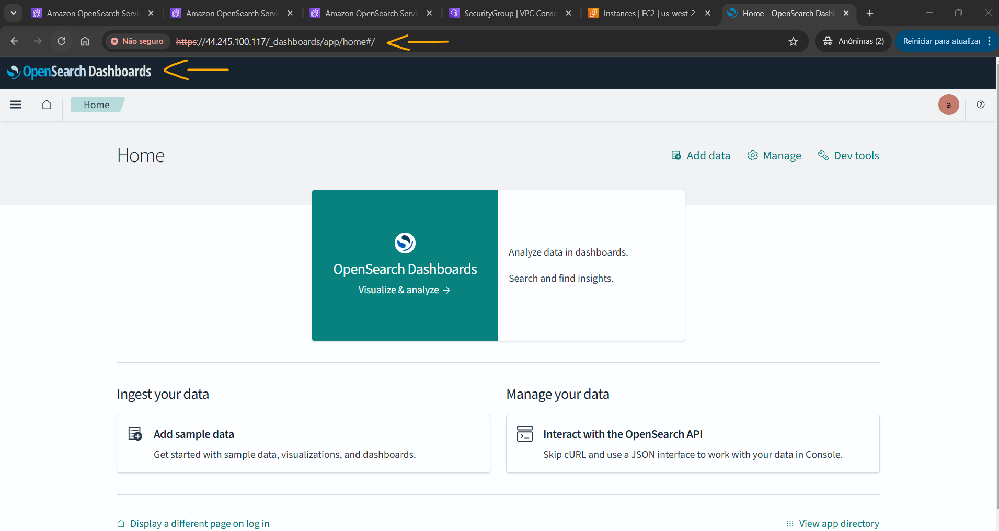
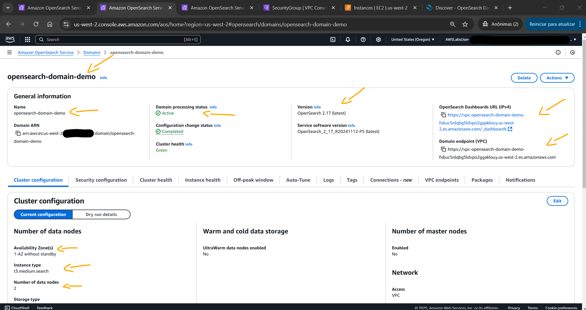

# Lab - Configure and Analyze Data with Amazon OpenSearch Service   

### AWS Skill Builder <a href="../../">aws_skill_builder   </a>
### Training Category: <a href="../../self_paced_lab">self_paced_lab</a>
### Software/Subject: aws   
### Course: <a href="./">curso_spl_040 (Lab - Configure and Analyze Data with Amazon OpenSearch Service)   </a>

#### Parceria da AWS com a Escola da Nuvem (EDN)   

---

### Theme:
- Cloud Computing

### Used Tools:
- Operating System (OS): 
  - Windows 11   
- Cloud:
  - Amazon Web Services (AWS)   
- Cloud Services:
  - Amazon OpenSearch Service (AOSS)   
  - Amazon Elastic Compute Cloud (EC2)   
  - Google Drive   
- Observability:
  - OpenSearch   
  - OpenSearch Dashboards   
- Language:
  - HTML   
  - Markdown   
- Integrated Development Environment (IDE) and Text Editor:
  - Visual Studio Code (VS Code)   
- Versioning: 
  - Git   
- Repository:
  - GitHub   

---

<a name="item0"><h3>Course Strcuture:</h3></a>
1. Lab - Configure and Analyze Data with Amazon OpenSearch Service<br>
1.1 <a href="#item01.1">Tarefa 1: Criando e configurando um domínio OpenSearch</a><br>
1.2 <a href="#item01.2">Tarefa 2: Configurando a interface do Dashboard, criando índice e preenchendo com dados</a><br>
1.3 <a href="#item01.3">Tarefa 3: Pesquisar com comandos básicos de consulta</a><br>
1.4 <a href="#item01.4">Tarefa 4: Explorando a interface do OpenSearch Dashboards</a><br>
1.5 <a href="#item01.5">Tarefa 5: Verificando a criação do domínio OpenSearch</a><br>

---

### Objective:
Este laboratório prático teve como objetivo a criação e configuração de um domínio no **Amazon OpenSearch Service (AOSS)**, um cluster gerenciado do **OpenSearch** na **AWS**. O acesso ao domínio foi realizado por meio do **OpenSearch Dashboards**, permitindo a interação com o cluster de duas formas. A primeira foi pelo **Dev Tools**, um console interativo utilizado para executar consultas e comandos diretamente na API REST do **OpenSearch**, empregando a linguagem **OpenSearch Domain-Specific Language (DSL)**. Nessa etapa, um índice foi criado, validado, preenchido com registros de filmes e consultado. A segunda forma de interação ocorreu pela interface **Discover**, voltada para exploração e visualização de dados indexados no **OpenSearch**, exigindo a criação de um padrão de índice. Nesse ambiente, foram realizadas consultas utilizando a linguagem **OpenSearch Dashboards Query Language (DQL)**.

### Structure:
A estrutura do curso é formada por:
- Este arquivo de README.
- A pasta `0-aux`, pasta auxiliar com imagens utilizadas na construção desse arquivo de README.
- A pasta `resource` com os arquivos utilizados.

### Development:
Este curso foi um laboratório prático realizado na plataforma **AWS Skill Builder**, cuja subscrição foi devida a uma parceria entre a **AWS** e a **Escola da Nuvem**. A infraestrutura de cloud utilizada foi fornecida através de um sandbox do **AWS Skill Builder** que possibilitava acesso ao console da **AWS**. Contudo foi necessário seguir estritamente as orientações determinadas no laboratório. Dessa maneira, a forma de interação com os recursos da cloud foram sempre através do console fornecido pelo sandbox, a não ser em casos em que o próprio laboratório instruiu para utilização de outras ferramentas de interação como **AWS CLI** ou **AWS SDK**.

O laboratório do **AWS Skill Builder** tem o foco em executar apenas o que é orientado no escopo, todos os recursos ou serviços que podem ser requisitados adicionalmente já vêm provisionados por padrão pelo laboratório. Ao iniciar o laboratório, o sandbox do **AWS Skill Builder** provisiona diversos recursos e serviços para o funcionamento através de uma ou mais pilhas do **AWS CloudFormation** de forma automática. 

O acesso ao console no sandbox do **AWS Skill Builder** é realizado por meio de uma identidade federada. O Skill Builder funciona como um provedor de identidade (IdP), autenticando o usuário e vinculando-o a uma role do **AWS IAM** provisionada automaticamente por uma das pilhas do CloudFormation. Essa role concede permissões temporárias e mínimas necessárias para a execução do laboratório, garantindo segurança e controle sobre os recursos utilizados. O laboratório, por padrão, determina a região a ser utilizada e ela não deve ser alterada, somente se o próprio laboratório indicar. As configurações não informadas no laboratório devem ser sempre mantidas como padrão que estão.

<a name="item01.1"><h4>Tarefa 1: Criando e configurando um domínio OpenSearch</h4></a>[Back to summary](#item0)

Na primeira tarefa do laboratório, foi provisionado um domínio do **Amazon OpenSearch Service (AOSS)** em um cluster através do **AWS Management Console**. A configuração desse domínio foi definida da seguinte forma:
- `Domain name` (Nome de domínio): `opensearch-domain-demo`.
- `Domain creation method` (Método de criação de domínio): `Standard create` (Criação padrão).
- `Templates` (Modelos): `Dev/test`.
- `Deployment option(s)` (Opções de implantação):
  - `Deployment option(s)` (Opções de implantação): `Domain without standby` (Domínio sem espera).
  - `Availability Zone(s)` (Zonas de disponibilidade): `1-AZ`.
- `Engine options` (Opções do mecanismo): 
  - `Version` (Versão): `2.17 (latest) - recommended` (2.17 (mais recente) - recomendado).
- `Number of data nodes` (Número de nós de dados): 
  - `Instance family - new` (Família de instâncias - novo): `General purpose` (Propósito geral).
  - `Instance type` (Tipo de instância): `t3.medium.search`.
  - `Number of data nodes` (Número de nós de dados): `2`.
- `Network` (Rede):
  - `Network` (Rede): `VPC access - recommended` (Acesso VPC - recomendado).
  - `IP address type - new` (Tipo de endereço IP - novo): `IPv4 only` (Somente IPv4).
  - `VPC`: foi escolhido o valor do parâmetro `VpcId` listado nas instruções do lab (`vpc-0054fc67dfa2d7df1`).
  - `Subnets` (Sub-redes): `VPC-OpenSearch Private Subnet(AZ1)`.
  - `Security groups` (Grupos de segurança): `opensearch-ingress-sg`.
  - `IAM Role` (Função do IAM): foi mantido o padrão, `AWSServiceRoleForAmazonOpenSearchService`.
- `Fine-grained access control` (Controle de acesso refinado): `Enable fine-grained access control` (Habilitar controle de acesso detalhado).
  - `Master user`: `Create master user`(Criar usuário mestre):
    - `Master username` (Nome de usuário Master): `admin`.
    - `Master password` (Senha mestra): uma senha a escolha do usuário foi utilizada (`Sen!23,}`).
    - `Confirm master password` (Confirmar senha mestra): uma senha a escolha do usuário foi utilizada (`Sen!23,}`).
- `Access policy` (Política de acesso):
  - `Domain access policy` (Política de acesso ao domínio): `Only use fine-grained access control` (Usar apenas controle de acesso refinado).

A criação do domínio levava entre 15 a 20 minutos para ser concluído. O monitoramento do progresso da criação do domínio podia ser feito em `Domain processing status` (Status de processamento do domínio) que mudava de `Creating` (Criando) para `Active` (Ativo). Entretanto, esse domínio não precisou ser criado de fato, pois o laboratório já provisionava, pelas pilhas do **AWS CloudFormation**, um domínio exatamente igual e que deveria ser o utilizado. A imagem 01 exibe o domínio criado `opensearch-domain-demo` e o domínio que foi utilizado ao longo do lab, `opensearch-lab`.

<div align="Center"><figure>
    <br>
    <figcaption>Imagem 01.</figcaption>
</figure></div><br>

<a name="item01.2"><h4>Tarefa 2: Configurando a interface do Dashboard, criando índice e preenchendo com dados</h4></a>[Back to summary](#item0)

O **OpenSearch** é um mecanismo de busca, análise e visualização de dados open-source, derivado do **Elasticsearch** após a mudança de licença deste. Ele permite indexar, pesquisar e analisar grandes volumes de dados em tempo real, sendo amplamente utilizado em casos como monitoramento de logs, observabilidade e análise de texto. O **Amazon OpenSearch Service (AOSS)** é o serviço gerenciado da **AWS** que facilita a implantação, operação e escalabilidade de clusters **OpenSearch** e **Elasticsearch** na nuvem. Ele é projetado para busca, análise e visualização de grandes volumes de dados em tempo real, como logs, métricas e dados de aplicativos. Antes da mudança de licença do **Elasticsearch**, o serviço gerenciado da **AWS** era conhecido como **Amazon Elasticsearch Service (AES)**. O **OpenSearch Dashboard** é a interface gráfica de usuário (GUI) para visualização e análise de dados no **OpenSearch**, permitindo aos usuários criar dashboards interativos e visualizações personalizadas de dados armazenados no **OpenSearch**. Ele é o sucessor do **Kibana** no ecossistema **OpenSearch** e oferece funcionalidades semelhantes para explorar, visualizar e monitorar dados. O **OpenSearch Dashboard** também é compatível com o **AOSS**, assim como o **Kibana** era com o **AES**.

Dada essa explicação sobre o ecossistema **OpenSearch**, a segunda tarefa foi composta por configurar a interface do **OpenSearch Dashboard**, criar um índice, validar a criação do índice e preencher esse index do domínio do **OpenSearch** com dados. Para acessar o **OpenSearch Dashboard** era necessário pegar a URL no **AOSS** provisionado (`https://vpc-opensearch-lab-kwjcj5f7ixpzep4rajxftnbkpi.us-west-2.es.amazonaws.com/_dashboards`) e abrir em uma nova guia do navegador. Entretanto, como o cluster estava em uma sub-rede privada, apenas entidades dentro dessa rede conseguiriam acessá-lo. Exatamente por isso que o laboratório provisionou a instância do **Amazon EC2** `ProxyInstance`, para ela funcionar como proxy. Essa instância estava na mesma rede e permitia acesso público através do seu IP público ou DNS. Ao acessar a instância, pela URL fornecida no parâmetro `AOSDashboardsURL` nas instruções do lab (`https://44.245.100.117/_dashboards`), a requisição era direcionada até o servidor proxy na instância que encaminhava a requisição para o cluster pela sub-rede privada. Ao acessar essa URL em uma outra aba do navegador da máquina física **Windows**, um aviso de segurança foi exibido informando que a página não era segura devido a implementação de um certificado autoassinado, mas como esse era um ambiente de laboratório controlado foi possível ignorar e avançar. Contudo, nunca deve ser ignorado esses avisos de segurança em sites de produção do mundo real, somente se tiver certeza que o site é seguro e confiável.

A homepage do site solicitava que o login no **OpenSearch Dashboard** fosse feito, conforme imagem 02. Para isso, foram utilizados os valores dos parâmetros `AOSDomainUserName` e `AOSDomainPassword` nas instruções do laboratório (`aosadmin` e `i$l64HcZaG`). Ao efetuar o login, uma mensagem de boas vindas era exibida. Para `Start by adding your data` (Começar adicionando os dados), foi escolhida a opção `Explore on my own` (Explorar por conta própria). Na caixa de diálogo `Introducing new OpenSearch Dashboards look & feel` (Apresentando a nova aparência dos painéis do OpenSearch), foi selecionado `Dismiss` (Descartar). Para `Select your tenant` (Selecionar seu locatário), foi escolhido `Private` (Privado) e depois `Confirm` (Confirmar), a página foi direcionada página inicial do **OpenSearch Dashboard** e já era possível interagir com o domínio do **Amazon OpenSearch Service (AOSS)** provisionado, conforme mostrado na imagem 03.

<div align="Center"><figure>
    <br>
    <figcaption>Imagem 02.</figcaption>
</figure></div><br>

<div align="Center"><figure>
    <br>
    <figcaption>Imagem 03.</figcaption>
</figure></div><br>

Um `Index` (Índice) é um contêiner para os registros (ou documentos) que é armazenado. Ele pode ser pensado como sendo análogo a uma combinação de um banco de dados + tabela em um sistema de banco de dados relacional tradicional. Nessa etapa, para criar um índice, o link de `Dev tools` (Ferramentas de desenvolvimento) foi selecionado. Na caixa de diálogo `Welcome to console` (Bem-vindo ao Console), foi selecionado `Dismiss` (Descartar). O console do Dev Tools tinha uma interface de tela dividida com dois painéis principais: um editor de solicitações à esquerda, onde os comandos eram colados, e um painel de resposta à direita, que exibia os resultados. O `Request editor` (editor de requisição), painel esquerdo, era onde eram colados e executados todos os comandos neste laboratório. Cada comando podia ser executado escolhendo o pequeno ícone de play na primeira linha do comando. Para criar um índice chamado `my-movie-index` com 3 fragmentos e 1 réplica, foi colado o seguinte comando no `Request editor` e selecionado o ícone de play que aparecia na primeira linha para executar o comando. A imagem 04 evidencia o output do comando que mostrava uma criação bem-sucedida do index chamado `my-movie-index` com dois sinalizadores de confirmação. O sinalizador `acknoledged` (reconhecido) confirmava que o índice foi criado, enquanto `shards_acknowledged` indicava que os 3 shards primários solicitados e as réplicas foram alocados com sucesso nos nós do cluster **OpenSearch** no **AOSS**.

```json
PUT /my-movie-index
{
    "settings": {
      "index": {
        "number_of_shards": 3,
        "number_of_replicas": 1
      }
    }
}
```

<div align="Center"><figure>
    <br>
    <figcaption>Imagem 04.</figcaption>
</figure></div><br>

Cada comando no `Dev Tools` deve ser executado de forma independente. Sempre limpe os comandos anteriores ou inicie uma nova linha para evitar confusão e erros. Neste caso, no `Request editor`, foi removido qualquer comando existente e o comando `GET /my-movie-index` foi inserido para validar a criação do índice. A imagem 05 mostra a saída do comando que retornava as informações de configuração do index construído. Note que os valores das chaves `number_of_shards` e `number_of_replicas` especificavam o numéro de fragmentos e o número de réplicas, que eram `3` e `1` respectivamente.

<div align="Center"><figure>
    <br>
    <figcaption>Imagem 05.</figcaption>
</figure></div><br>

Com o índice elaborado, a última etapa dessa tarefa consistiu em preencher o index com dados utilizando inserção em massa. Para isso, foi utilizado o arquivo [imdb-data-for-indexing.txt](./resource/imdb-data-for-indexing.txt) com 1.499 registros de filmes. Este arquivo começava com uma solicitação `POST` para o endpoint da API _bulk. A API _bulk processa eficientemente grandes conjuntos de dados usando o formato NDJSON (JSON delimitado por nova linha). Cada registro consistia em duas linhas:
- Primeira linha: Especificava o índice de destino (`my-movie-index`).
- Segunda linha: continha a carga útil de dados real.

Ao copiar esse arquivo, colar no `Request editor` e executar, a inserção em massa era realizada. A imagem 06 exibe o output do comando comprovando a inserção dos registros no índice.

<div align="Center"><figure>
    <br>
    <figcaption>Imagem 06.</figcaption>
</figure></div><br>

<a name="item01.3"><h4>Tarefa 3: Pesquisar com comandos básicos de consulta</h4></a>[Back to summary](#item0)

Com o índice populado, na tarefa 3, duas consultas foram realizadas para pesquisar, recuperar e filtrar dados do index no **OpenSearch**, utilizando operações básicas de pesquisa e consultas baseadas em URL. Para executar uma consulta de pesquisa simples para recuperar todos os documentos foi utilizado o comando `GET /my-movie-index/_search` que retornava todos os registros armazenados no índice, conforme mostrado na imagem 07. O **OpenSearch** oferece suporte a uma sintaxe de consulta simples baseada em URL, bem como a uma interface JSON mais complexa baseada em REST.

<div align="Center"><figure>
    <br>
    <figcaption>Imagem 07.</figcaption>
</figure></div><br>

Em seguida, o comando `GET /my-movie-index/_search?q=franco` foi executado para realizar uma consulta baseada em URL utilizando parâmetros. Essa consulta pesquisava por `franco` em todos os campos, retornando 13 documentos correspondentes, onde fornecia uma pontuação de relevância para cada documento e mostrava métricas operacionais e detalhes de cobertura da pesquisa. A imagem 08 exibe o resultado desse comando.

<div align="Center"><figure>
    <br>
    <figcaption>Imagem 08.</figcaption>
</figure></div><br>

<a name="item01.4"><h4>Tarefa 4: Explorando a interface do OpenSearch Dashboards</h4></a>[Back to summary](#item0)

Até o momento a interação com o **OpenSearch** da **AWS** foi utilizando a API através do console `Dev tools`. Nesta quarta tarefa, as mesmas consultas foram realizadas por meio do `Discover Dashboard` (Painel de descoberta) do **OpenSearch Dashboards**. Enquanto o `Dev Tools` fornece uma interface poderosa para desenvolvedores escreverem e testarem consultas complexas, o `Discover Dashboard` oferece um ambiente mais amigável para usuários empresariais e analistas explorarem dados sem escrever código (no-code). A interface Discover é particularmente útil para exploração interativa de dados, filtragem rápida e compartilhamento de resultados de pesquisa com membros não técnicos da equipe.

Para utilizá-la, primeiramente, foi necessário configurar um padrão de índice. Os `Index patterns` (Padrões de índice) ajudam o **OpenSearch Dashboards** a organizar, localizar e exibir os índices (contêineres de dados). Isso pode ser pensado como criar uma visualização dos dados que o Dashboards pode entender e exibir. Dessa forma, o ícone de três retas horizontais no canto superior esquerdo foi selecionado para revelá-lo. No painel de navegação, em `Management` (Gerenciamento), foi escolhido `Dashboards Management` (Gerenciamento de painéis). Ao abrir, a guia `Index patterns` (Padrões de índice) foi acessada e um padrão de índice foi construído da seguinte forma:
- `Create index pattern` (Criar padrão de índice):
  - `Step 1 of 2: Define an index pattern` (Etapa 1 de 2: Definir um padrão de índice):
    - `Index pattern name` (Nome do padrão de índice): `my-movie*`. Conforme era digitado, foi visto `my-movie-index` aparecer no menu suspenso de preenchimento automático.
  - `Step 2 of 2: Configure settings` (Etapa 2 de 2: Configurar configurações): Essa etapa descobria automaticamente todos os campos de registro de data e hora e fornecia uma opção para selecionar um campo de hora global.
    - `Hour` (Hora): `release_date`.

Após criar o padrão de index, a tela mostrava os detalhes dos campos indexados, incluindo campos pesquisáveis ​​e agregáveis ​​e seus tipos de dados, conforme imagem 09. Agora já era possível acessar o `Discover Dashboard` (Painel de descoberta). Novamente o ícone de três linhas horizontais foi selecionado. No painel de navegação, em `OpenSearch Dashboards` (Painéis do OpenSearch) foi escolhido `Discover` (Descobrir) para ser direcionado para esse painel. O **OpenSearch Dashboards** tem um seletor de tempo que controla o tempo para todas as visualizações e painéis. Esse seletor foi localizado no canto superior direito. Por padrão, o seletor de tempo é definido como `Last 15 minutes` (Últimos 15 minutos). Como o conjunto de dados era bem antigo, isso foi alterado para mostrar os últimos 20 anos (`20 Years ago`). Ao atualizar, o histograma era exibido mostrando os dados dos filmes distribuídos cronologicamente, conforme ilustrado na imagem 10.

<div align="Center"><figure>
    <br>
    <figcaption>Imagem 09.</figcaption>
</figure></div><br>

<div align="Center"><figure>
    <br>
    <figcaption>Imagem 10.</figcaption>
</figure></div><br>

Com visualização do painel `Discover` (Descoberta), agora era possível explorar alguns exemplos dos tipos de consultas. Por padrão, as consultas são executadas com a linguagem de consulta **OpenSearch Dashboards Query Language (DQL)**. As consultas realizadas foram listadas abaixo:
- Foi digitado `franco` no campo (Pesquisar) e atualizado. Isso pesquisava todos os campos e retornava 13 resultados, semelhante à consulta de API anterior. Imagem 11.
- Foi digitado `directors: franco` no campo (Pesquisar) e atualizado. Desta vez, foi pesquisado apenas no campo diretores pelo valor `franco` e a pesquisa resultou em 1 resultado. Imagem 12.
- Foi digitado `NOT genres: [drama, action, comedy]` no campo (Pesquisar) e atualizado. Agora era retornado 137 resultados, no qual eram todos os filmes excluíndo os gêneros drama, ação e comédia. Imagem 13.

<div align="Center"><figure>
    <br>
    <figcaption>Imagem 11.</figcaption>
</figure></div><br>

<div align="Center"><figure>
    <br>
    <figcaption>Imagem 12.</figcaption>
</figure></div><br>

<div align="Center"><figure>
    <br>
    <figcaption>Imagem 13.</figcaption>
</figure></div><br>

A visualização dos resultados também podia ser personalizada. Depois que o conjunto de resultados foi atualizado, o mouse foi passado sobre os itens de gênero e título na lista `Available fields` (Campos disponíveis) no painel esquerdo e o botão ao lado deles foi selecionado. Isso exibia somente esses campos no conjunto de resultados, tornando-o mais legível. Observe que os valores drama, action e comedy foram removidos do campo `genres`, conforme mostrado na imagem 14.

<div align="Center"><figure>
    <br>
    <figcaption>Imagem 14.</figcaption>
</figure></div><br>

Por fim, foi examinado uma consulta DSL. Quando uma consulta é digitada na caixa de pesquisa do painel `Discover`, a linguagem utilizada é o **OpenSearch Dashboards Query Language (DQL)**. Entretanto, o Dashboards traduz a consulta de texto para **OpenSearch Domain-Specific Language (DSL)**. O **OpenSearch DSL** é a linguagem de consulta usada para interagir com o **OpenSearch** e realizar buscas, filtragens e agregações de dados. Ele é baseado no formato JSON e oferece uma estrutura flexível para realizar consultas complexas. Para visualizar a consulta DSL do **OpenSearch**, no canto superior direito, foi selecionado `Inspect` (Inspecionar). Uma caixa de diálogo era exibida e a opção `Request` (Solicitar) foi selecionada para visualizar a consulta traduzida, conforme evidenciado na imagem 15.

<div align="Center"><figure>
    <br>
    <figcaption>Imagem 15.</figcaption>
</figure></div><br>

<a name="item01.5"><h4>Tarefa 5: Verificando a criação do domínio OpenSearch</h4></a>[Back to summary](#item0)

A útlima tarefa consistiu em verificar a criação do domínio **OpenSearch** no **Amazon OpenSearch Service (AOSS)**, onde ele foi provisionado. A imagem 16 exibe o domínio criado no **AOSS**. Perceba que o `Domain processing status` (Status de processamento do domínio) mostrava como `Active` (Ativo). Quando o status está ativo indica que o domínio está pronto para uso. Observe que esse foi o domínio provisionado, cujo nome era `opensearch-domain-demo` e não o domínio utilizado que foi `opensearch-lab`.

<div align="Center"><figure>
    <br>
    <figcaption>Imagem 16.</figcaption>
</figure></div><br>