# Lab - Create Topics and Subscriptions using Amazon Simple Notification Service (Amazon SNS)   

### AWS Skill Builder <a href="../../">aws_skill_builder   </a>
### Training Category: <a href="../../self_paced_lab">self_paced_lab</a>
### Software/Subject: aws   
### Course: <a href="./">curso_spl_041 (Lab - Create Topics and Subscriptions using Amazon Simple Notification Service (Amazon SNS))   </a>

#### Parceria da AWS com a Escola da Nuvem (EDN)   

---

### Theme:
- Cloud Computing

### Used Tools:
- Operating System (OS): 
  - Windows 11   
- Cloud:
  - Amazon Web Services (AWS)   
- Cloud Services:
  - Amazon CloudWatch   
  - Amazon Simple Notification Service (SNS)   
  - Google Drive   
- Language:
  - HTML   
  - Markdown   
- Integrated Development Environment (IDE) and Text Editor:
  - Visual Studio Code (VS Code)   
- Versioning: 
  - Git   
- Repository:
  - GitHub   
- Network:
  - Proton Mail    

---

<a name="item0"><h3>Course Strcuture:</h3></a>
1. Lab - Create Topics and Subscriptions using Amazon Simple Notification Service (Amazon SNS) 
1.1 <a href="#item01.1">Tarefa 1: Fundamentos do SNS</a> 
1.2 <a href="#item01.2">Tarefa 2: Criar um tópico e uma assinatura SNS</a> 
1.3 <a href="#item01.3">Tarefa 3: Publicar uma mensagem</a> 

---

### Objective:
O objetivo deste laboratório foi verificar a configuração de um tópico existente do **Amazon Simple Notification Service (SNS)**, criar um novo tópico e assiná-lo com um email, simulando um cenário de e-commerce no qual clientes recebem notificações sobre o status de seus pedidos.

### Structure:
A estrutura do curso é formada por:
- Este arquivo de README.
- A pasta `0-aux`, pasta auxiliar com imagens utilizadas na construção desse arquivo de README.

### Development:
Este curso foi um laboratório prático realizado na plataforma **AWS Skill Builder**, cuja subscrição foi devida a uma parceria entre a **AWS** e a **Escola da Nuvem**. A infraestrutura de cloud utilizada foi fornecida através de um sandbox do **AWS Skill Builder** que possibilitava acesso ao console da **AWS**. Contudo foi necessário seguir estritamente as orientações determinadas no laboratório. Dessa maneira, a forma de interação com os recursos da cloud foram sempre através do console fornecido pelo sandbox, a não ser em casos em que o próprio laboratório instruiu para utilização de outras ferramentas de interação como **AWS CLI** ou **AWS SDK**.

O laboratório do **AWS Skill Builder** tem o foco em executar apenas o que é orientado no escopo, todos os recursos ou serviços que podem ser requisitados adicionalmente já vêm provisionados por padrão pelo laboratório. Ao iniciar o laboratório, o sandbox do **AWS Skill Builder** provisiona diversos recursos e serviços para o funcionamento através de uma ou mais pilhas do **AWS CloudFormation** de forma automática. 

O acesso ao console no sandbox do **AWS Skill Builder** é realizado por meio de uma identidade federada. O Skill Builder funciona como um provedor de identidade (IdP), autenticando o usuário e vinculando-o a uma role do **AWS IAM** provisionada automaticamente por uma das pilhas do CloudFormation. Essa role concede permissões temporárias e mínimas necessárias para a execução do laboratório, garantindo segurança e controle sobre os recursos utilizados. O laboratório, por padrão, determina a região a ser utilizada e ela não deve ser alterada, somente se o próprio laboratório indicar. As configurações não informadas no laboratório devem ser sempre mantidas como padrão que estão.

<a name="item01.1"><h4>Tarefa 1: Fundamentos do SNS</h4></a>[Back to summary](#item0)

Na primeira tarefa do laboratório, foi verificado um tópico do **Amazon Simple Notification Service (SNS)** existente para analisar sua funcionalidade e entender sobre sua configuração. Um tópico do **Amazon SNS** é um canal de comunicação lógico que atua como um ponto de acesso para enviar e receber notificações. Ele serve como um hub centralizado onde os publicadores podem enviar mensagens, e os assinantes podem receber essas mensagens. Para receber notificações de um tópico, é necessário se inscrever nele usando um protocolo compatível, como email.

O tópico existente de nome `DemoTopic` foi selecionado e nos detalhes de configuração foi observado que o `Type` (Tipo) estava definido como `Standard` (Padrão), conforme imagem 01. Um tópico **Amazon SNS** Standard é como um quadro de avisos onde é possível postar mensagens que serão entregues a todos que estão inscritos para recebê-las. Embora as mensagens sejam entregues rapidamente, elas podem chegar em uma ordem diferente da que foram enviadas, semelhante a como várias cartas enviadas pelo correio podem às vezes chegar fora de sequência. Se for preciso que as mensagens cheguem na ordem exata em que foram enviadas, tem que ser utilizado um tópico FIFO (First-In-First-Out). 

<figure>
    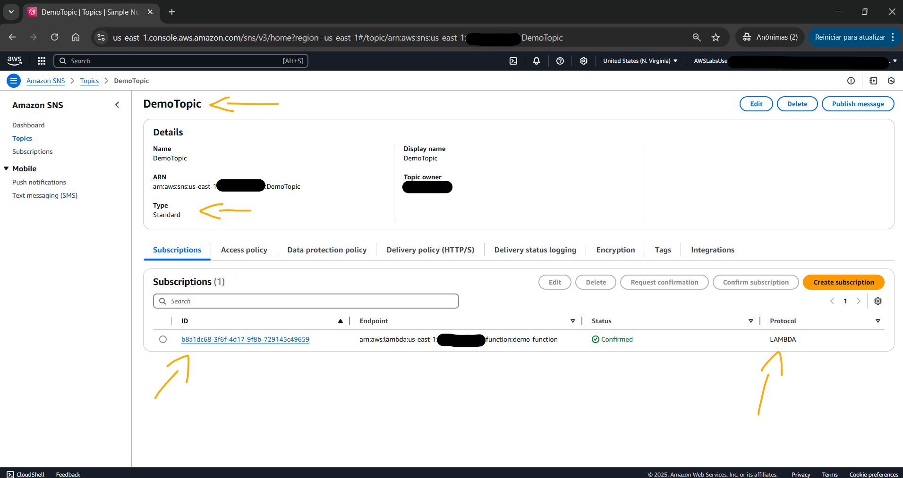 
    <figcaption>Imagem 01.</figcaption>
</figure>
 

Na aba de `Subscriptions` (Assinaturas) havia apenas uma única assinatura, esta utilizava o protocolo `LAMBDA`, conforme mostrado na imagem 02. Uma assinatura é forma que é informado ao **Amazon SNS** quem ou o que deve receber as mensagens que são postadas em um tópico. Isso pode ser pensado como o usuário estivesse se inscrevendo para um boletim informativo por email, quando ele se inscreve em um tópico, ele está dizendo "Quero receber essas mensagens". Neste caso, havia uma assinatura configurada que enviava mensagens para uma função Lambda. A assinatura mostrava:
- O protocolo era LAMBDA, o que significava que as mensagens eram enviadas para uma função **AWS Lambda**.
- O Endpoint era para onde as mensagens eram enviadas, neste caso, para a função Lambda `demo-function`.
- O status era Confirmado, o que significava que a assinatura estava ativa.

<figure>
    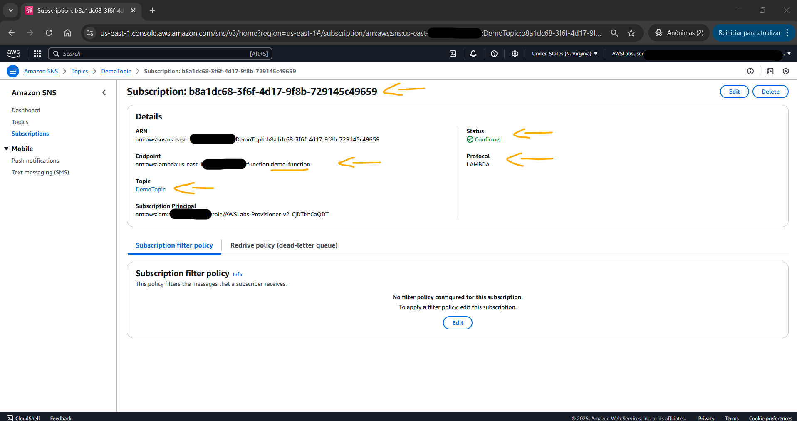 
    <figcaption>Imagem 02.</figcaption>
</figure>
 

É possível criar várias assinaturas para um único tópico, e cada assinatura pode usar diferentes protocolos como email, SMS (mensagens de texto) ou outros serviços da **AWS**. Isso permite que seja enviada a mesma mensagem para vários destinos de uma só vez.

Na sequência, a aba `Access policy` (Política de acesso) foi aberta, conforme imagem 03. A política de acesso controlava quem podia interagir com este tópico do SNS. Pense nisso como uma lista que determinava quem podia enviar mensagens (Publish) para este tópico e quem podia se inscrever para receber mensagens (Subscribe). Nesta política, somente os principais da conta **AWS** tinham permissão para publicar mensagens no tópico ou criar novas assinaturas. Esta era uma medida de segurança para garantir que somente usuários autorizados da conta **AWS** pudessem trabalhar com este tópico. A política era escrita em um formato estruturado que é comumente usado no gerenciamento de identidade da **AWS**. As partes principais incluíam:
- A política permitia que os usuários usassem as ações `sns:Publish` (envie mensagens) e `sns:Subscribe` (receba mensagens).
- A política restringia o acesso à conta da **AWS**.

<figure>
    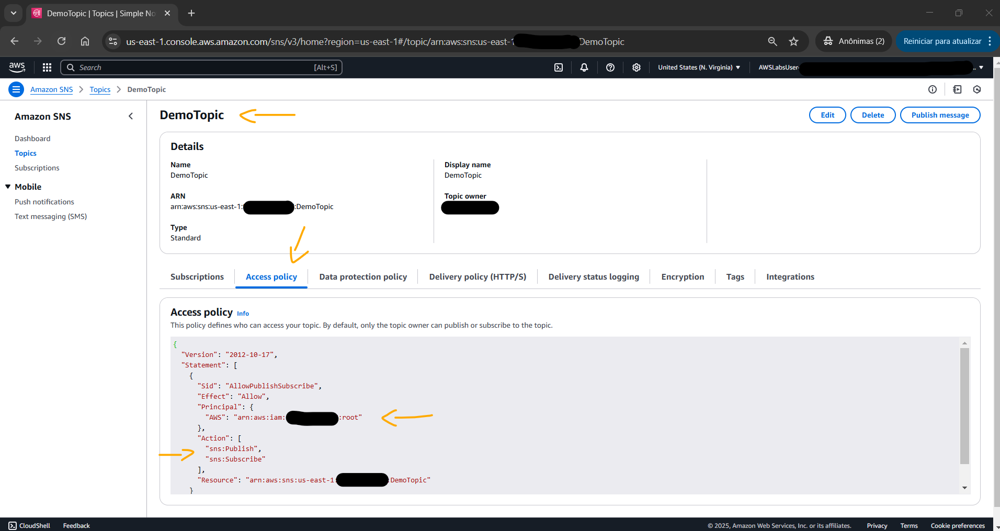 
    <figcaption>Imagem 03.</figcaption>
</figure>
 

Após conferir a política de acesso, a aba `Delivery policy (HTTP/S)` (Política de entrega (HTTP/S)) foi aberta, conforme exibido na imagem 04. Quando o **Amazon SNS** tenta entregar uma mensagem a um endpoint HTTP/S (por exemplo, um servidor web), às vezes a entrega pode falhar. A política de entrega define como o SNS deve lidar com essas falhas e tentar entregar novamente a mensagem. Nesta política, as seguintes configurações tinham sido definidas:
- Se uma entrega falhar, o SNS tentava novamente até 3 vezes (`numRetries: 3`).
- Entre cada nova tentativa, o SNS aguardava 20 segundos (`minDelayTarget e maxDelayTarget: 20`).
- O tempo de repetição seguia um padrão linear (`backoffFunction: “linear”`), o que significava que cada tentativa de repetição acontecia em um intervalo consistente.

<figure>
    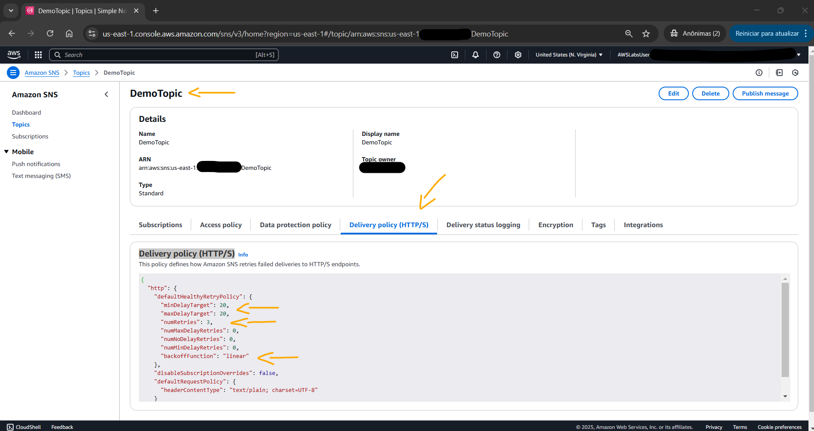 
    <figcaption>Imagem 04.</figcaption>
</figure>
 

Pense nisso como tentar entregar um pacote: se ninguém atender a porta, o entregador tentará novamente mais 3 vezes, esperando 20 segundos entre cada tentativa, antes de desistir.

A próxima aba verificada foi a de `Encryption` (Criptografia), conforme imagem 05. Este tópico era configurado para criptografar todas as mensagens usando o **AWS Key Management Service (KMS)**. A criptografia é manipulada por uma chave KMS específica que pertence à conta **AWS**. Isso adicionava uma camada extra de segurança para garantir que, mesmo que alguém interceptasse as mensagens, não conseguiria lê-las sem acesso a essa chave de criptografia.

<figure>
    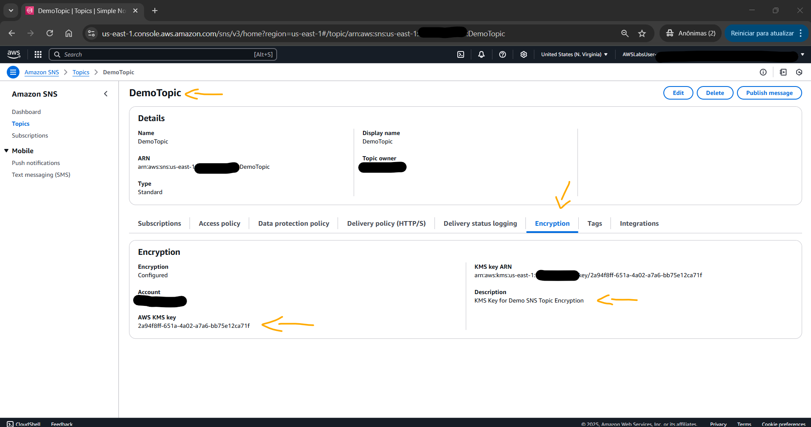 
    <figcaption>Imagem 05.</figcaption>
</figure>
 

Por fim, a última aba visualizada foi `Delivery status logging` (Registro de status de entrega), conforme ilustrado na imagem 06. O **Amazon SNS** pode monitorar se as mensagens são entregues com sucesso ou se não chegam ao destino. Nesta configuração eram definidas as seguintes ações:
- O SNS registrava tentativas de entrega de mensagens enviadas para funções do Lambda.
- Todas as entregas bem-sucedidas eram registradas (é isso que o “100” significa - 100% das entregas bem-sucedidas).
- Todas as entregas com falha eram registradas automaticamente.
- Os logs eram gravados no CloudWatch Logs usando uma única função do IAM.

<figure>
    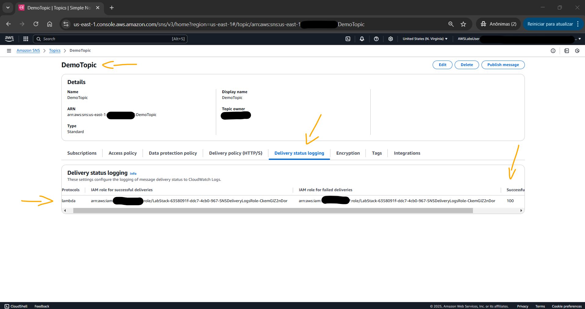 
    <figcaption>Imagem 06.</figcaption>
</figure>
 

Esses registros são valiosos para solucionar problemas quando as mensagens não estão sendo entregues conforme o esperado, semelhante a verificar um número de rastreamento para ver onde um pacote ficou preso no trânsito. 

Para confirmar se as mensagens SNS desse tópico estavam sendo entregues, o *Amazon CloudWatch Logs* foi acessado no **Amazon CloudWatch**. Como dito anteriormente, esse tópico foi configurado para registrar tentativas de entrega bem-sucedidas e com falha no CloudWatch Logs. Dentro do console do CloudWatch, foi selecionado `All alarms` (Todos os alarmes) e o alarme de nome `SNSDeliveryFailureAlarm` foi acessado. Este alarme monitorava os registros de status de entrega do SNS e era acionado sempre que havia pelo menos uma falha na entrega de mensagem em um período de um minuto, ajudando a identificar rapidamente quando as mensagens não estavam chegando aos destinos pretendidos. A imagem 07 exibe que o `SNSDeliveryFailureAlarm` estava em um estado `ALARM`, indicando que havia problemas com a entrega de mensagens no tópico SNS.

<figure>
    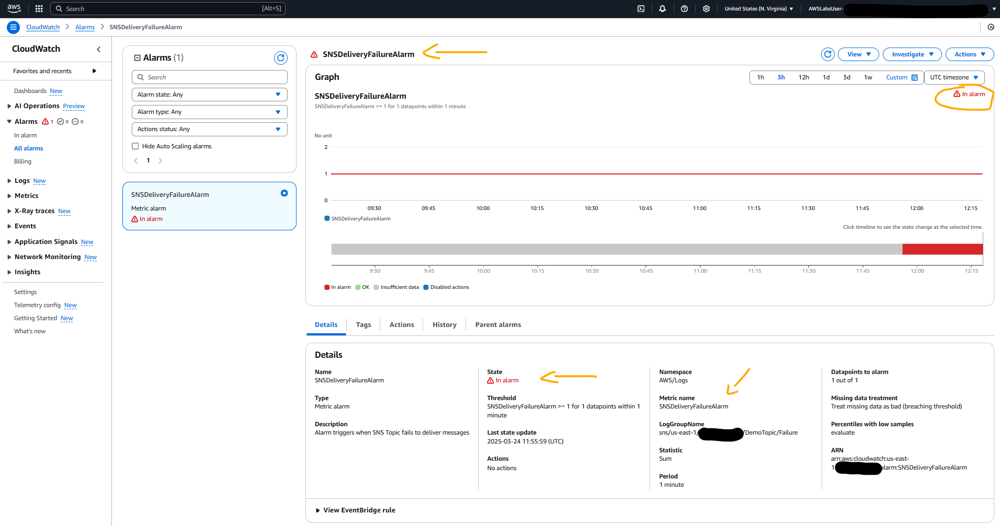 
    <figcaption>Imagem 07.</figcaption>
</figure>
 

<a name="item01.2"><h4>Tarefa 2: Criar um tópico e uma assinatura SNS</h4></a>[Back to summary](#item0)

Ao invés de solucionar o problema do tópico e da assinatura existentes, nesta tarefa 2 foi provisionado um novo tópico com uma assinatura do tipo email. O tópico foi configurado da seguinte forma:
- `Details` (Detalhes):
    - `Type` (Tipo): `Standard` (Padrão).
    - `Name` (Nome): `OrderNotification` (Notificação de pedido).

A imagem 08 evidencia o novo tópico criado. Vale lembrar que o **Amazon SNS** oferece os dois seguintes tipos de tópicos:
- `Standard` (Padrão): Os tópicos padrão são projetados para entrega de mensagens de alto rendimento e melhor esforço, permitindo mensagens ocasionais fora de ordem e possíveis duplicatas, ao mesmo tempo em que oferecem suporte a uma ampla variedade de protocolos de assinatura, incluindo email, SMS e terminais HTTP/S.
- `FIFO (First-In-First-Out)`: Os tópicos FIFO, por outro lado, garantem uma ordenação estrita de mensagens e processamento exatamente único, mas são limitados às filas FIFO do SQS como assinantes e não oferecem suporte a email ou outros protocolos, o que os torna ideais para aplicativos que exigem sequenciamento estrito e desduplicação de mensagens.

<figure>
    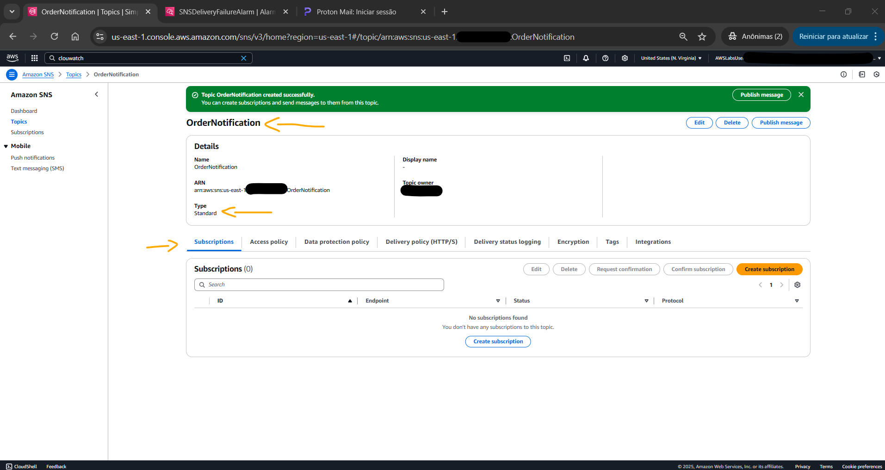 
    <figcaption>Imagem 08.</figcaption>
</figure>
 

Após provisionar o tópico SNS, foi adicionado um assinante de email ao tópico. Isso permitia que notificações publicadas no tópico fossem entregues diretamente na caixa de entrada de email cadastrado. A assinatura foi definida da seguinte forma:
- `Details` (Detalhes):
    - `Topic ARN` (ARN do tópico): este campo foi mantido inalterado, pois ele era preenchido previamente com o ARN do tópico que foi criado. Um *Amazon Resource Name (ARN)* é um identificador exclusivo para um recurso da **AWS**, como um tópico do SNS. Ele fornece uma maneira padronizada de referenciar e interagir com esse recurso em vários serviços e APIs da **AWS**.
    - `Protocol` (Protocolo): `Email`.
    - `Endpoint` (Ponto final): foi inserido meu endereço de email do **Proton Mail**, que era (`phcstudy@proton.me`).

O **Amazon SNS** oferece suporte a vários tipos de notificações além de email, incluindo:
- Notificações push para dispositivos móveis.
- Acionando funções do **AWS Lambda**.
- Entregando mensagens para filas do **Amazon SQS**.
- Enviando mensagens de texto SMS.

Após a criação da assinatura para o tópico `OrderNotification`, um email de confirmação foi enviado para o endereço fornecido. O email de confirmação é necessário para garantir que o endereço de email fornecido para a assinatura seja válido e que o destinatário tenha autorizado a assinatura. Esse processo de duas etapas ajuda a impedir que partes não autorizadas assinem tópicos e recebam notificações. Se o email de confirmação não for recebido ou a assinatura não for confirmada, o endereço de email não seria inscrito ativamente no tópico. Como resultado, nenhuma mensagem publicada no tópico seria entregue a esse endereço de email. A etapa de confirmação é uma medida de segurança para proteger a integridade do processo de assinatura e garantir que as notificações sejam entregues apenas aos destinatários pretendidos.

Portanto, foi necessário acessar o email no **Proton Mail** para confirmar a assinatura do tópico clicando no link informado no email. O email de confirmação foi enviado pelo serviço de notificações da **AWS** e tinha uma linha de assunto semelhante a “Notificação da AWS - Confirmação de assinatura”, conforme evidenciado na imagem 09. A imagem 10 comprova que o assinante foi adicionado ao tópico e estava ativo.

<figure>
    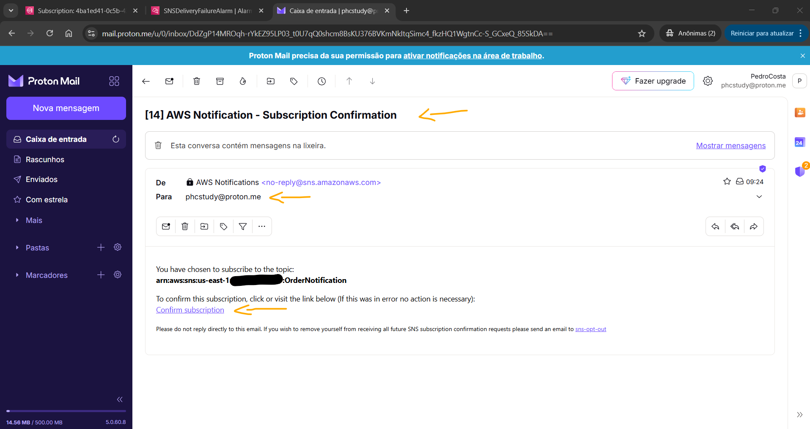 
    <figcaption>Imagem 09.</figcaption>
</figure>
 

<figure>
    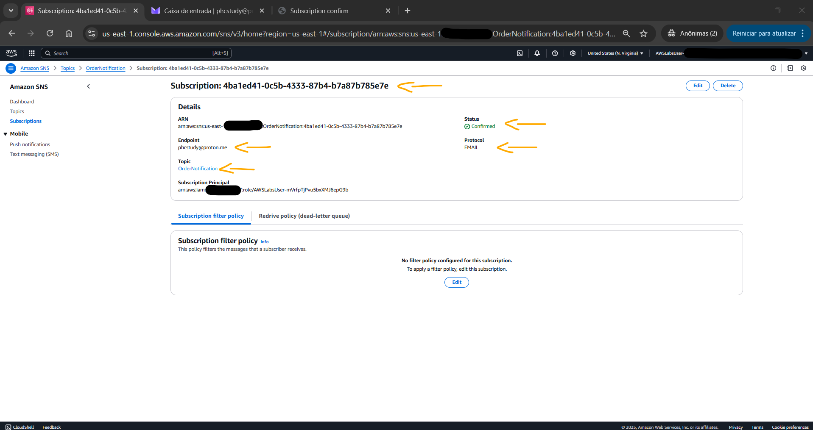 
    <figcaption>Imagem 10.</figcaption>
</figure>
 

<a name="item01.3"><h4>Tarefa 3: Publicar uma mensagem</h4></a>[Back to summary](#item0)

A tarefa final consistiu em publicar uma mensagem de teste no tópico provisionado para visualizar a notificação chegando para o email registrado como assinate do tópico. Essa mensagem de teste seria uma simulação de uma confirmação de pedido ou atualização de status que seria enviada em um aplicativo real de e-commerce. No tópico `OrderNotification`, uma mensagem foi publicada com as seguintes informações:
- `Subject - optional` (Assunto - opcional): `Test order notification` (Notificação de ordem de teste).
- `Message structure` (Estrutura da mensagem): `Identical payload for all delivery protocols.` (Carga útil idêntica para todos os protocolos de entrega).
- `Message body to send to the endpoint` (Corpo da mensagem a ser enviada ao ponto de extremidade): `This is a test notification from Amazon SNS` (Esta é uma notificação de teste do Amazon SNS) ou outra mensagem que deveria ser enviada.

A imagem 11 mostra que a publicação foi criada no console do **Amazon SNS** para o tópico em questão. Enquanto a imagem 12 comprova o recebimento da notificação, com a mensagem em questão, no email cadastrado.

<figure>
    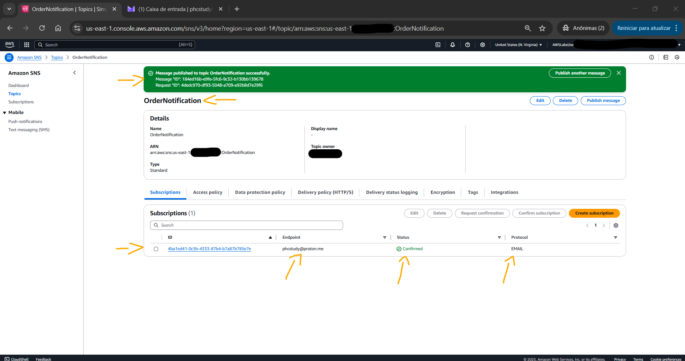 
    <figcaption>Imagem 11.</figcaption>
</figure>
 

<figure>
    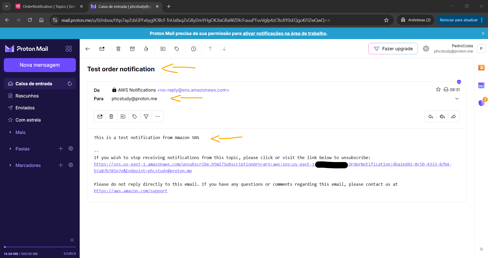 
    <figcaption>Imagem 12.</figcaption>
</figure>
 