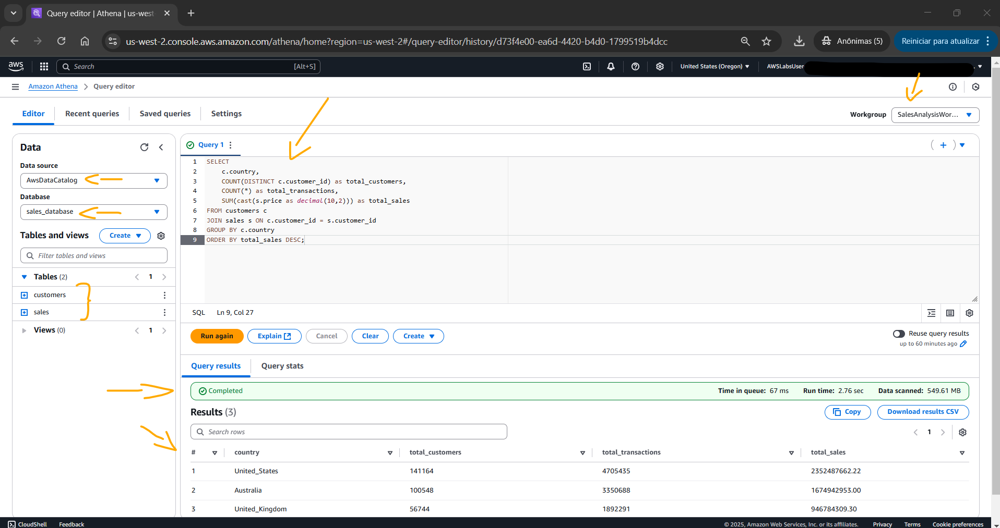
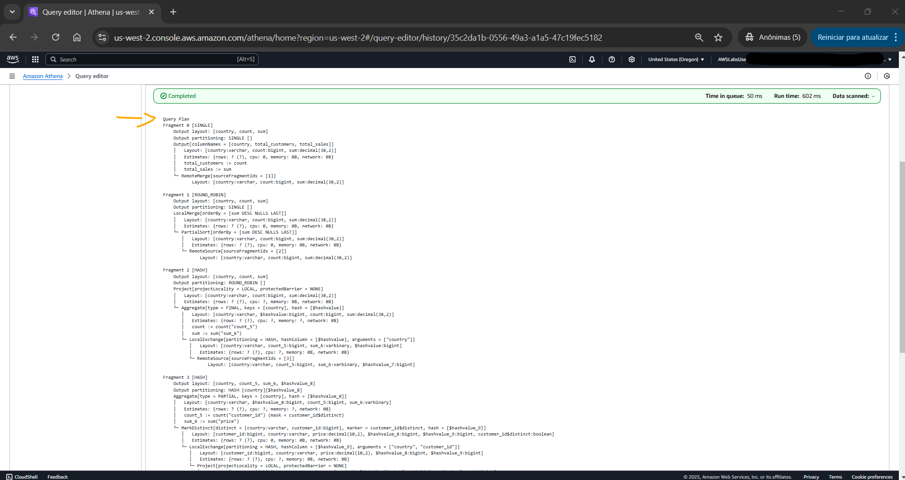

# Lab - Query Data with Amazon Athena   

### AWS Skill Builder <a href="../../">aws_skill_builder   </a>
### Training Category: <a href="../../self_paced_lab">self_paced_lab</a>
### Software/Subject: aws   
### Course: <a href="./">curso_spl_042 (Lab - Query Data with Amazon Athena)   </a>

#### Parceria da AWS com a Escola da Nuvem (EDN)   

---

### Theme:
- Cloud Computing

### Used Tools:
- Operating System (OS): 
  - Windows 11   
- Cloud:
  - Amazon Web Services (AWS)   
- Cloud Services:
  - Amazon Athena  
  - AWS Glue   
  - Google Drive   
- Language:
  - Apache Hive Query Language (Apache HiveQL)   
  - HTML   
  - Markdown   
  - Trino   
- Integrated Development Environment (IDE) and Text Editor:
  - Visual Studio Code (VS Code)   
- Versioning: 
  - Git   
- Repository:
  - GitHub   

---

<a name="item0"><h3>Course Strcuture:</h3></a>
1. Lab - Query Data with Amazon Athena<br>
1.1 <a href="#item01.1">Tarefa 1: Configurar e configurar o Amazon Athena</a><br>
1.2 <a href="#item01.2">Tarefa 2: Carregar dados de vendas para o S3</a><br>
1.3 <a href="#item01.3">Tarefa 3: Criar e configurar um rastreador AWS Glue</a><br>
1.4 <a href="#item01.4">Tarefa 4: Criar tabelas de banco de dados usando Athena e Glue Crawler</a><br>
1.5 <a href="#item01.5">Tarefa 5: Escrever e executar consultas SQL</a><br>
1.6 <a href="#item01.6">Tarefa 6: Explorar recursos do editor de consultas</a><br>

---

### Objective:
O objetivo deste laboratório foi criar um workgroup no **Amazon Athena** para consultar e analisar dados de vendas armazenados no **Amazon Simple Storage Service (S3)**. O banco de dados utilizado foi provisionado no *AWS Glue Data Catalog*. As tabelas desse banco foram criadas de duas formas: manualmente, através do Athena, e automaticamente, utilizando um *crawler* do **AWS Glue**. Os esquemas dessas tabelas foram comparados para avaliar a semelhança entre ambos os métodos. A análise dos dados foi realizada no editor de consultas do Athena, por meio da execução de consultas SQL. Por fim, alguns recursos do editor de consultas foram explorados para entender como ele processava as consultas e como as consultas podiam ser salvas.

### Structure:
A estrutura do curso é formada por:
- Este arquivo de README.
- A pasta `0-aux`, pasta auxiliar com imagens utilizadas na construção desse arquivo de README.

### Development:
Este curso foi um laboratório prático realizado na plataforma **AWS Skill Builder**, cuja subscrição foi devida a uma parceria entre a **AWS** e a **Escola da Nuvem**. A infraestrutura de cloud utilizada foi fornecida através de um sandbox do **AWS Skill Builder** que possibilitava acesso ao console da **AWS**. Contudo foi necessário seguir estritamente as orientações determinadas no laboratório. Dessa maneira, a forma de interação com os recursos da cloud foram sempre através do console fornecido pelo sandbox, a não ser em casos em que o próprio laboratório instruiu para utilização de outras ferramentas de interação como **AWS CLI** ou **AWS SDK**.

O laboratório do **AWS Skill Builder** tem o foco em executar apenas o que é orientado no escopo, todos os recursos ou serviços que podem ser requisitados adicionalmente já vêm provisionados por padrão pelo laboratório. Ao iniciar o laboratório, o sandbox do **AWS Skill Builder** provisiona diversos recursos e serviços para o funcionamento através de uma ou mais pilhas do **AWS CloudFormation** de forma automática. 

O acesso ao console no sandbox do **AWS Skill Builder** é realizado por meio de uma identidade federada. O Skill Builder funciona como um provedor de identidade (IdP), autenticando o usuário e vinculando-o a uma role do **AWS IAM** provisionada automaticamente por uma das pilhas do CloudFormation. Essa role concede permissões temporárias e mínimas necessárias para a execução do laboratório, garantindo segurança e controle sobre os recursos utilizados. O laboratório, por padrão, determina a região a ser utilizada e ela não deve ser alterada, somente se o próprio laboratório indicar. As configurações não informadas no laboratório devem ser sempre mantidas como padrão que estão.

<a name="item01.1"><h4>Tarefa 1: Configurar e configurar o Amazon Athena</h4></a>[Back to summary](#item0)

A primeira tarefa do laboratório consistiu em provisionar e configurar um workgroup (grupo de trabalho) do **Amazon Athena** para acessar os resultados da consulta de dados de vendas no **Amazon Simple Storage Service (S3)**. Os grupos de trabalho do Athena fornecem uma maneira de gerenciar o acesso, configurar definições e controlar custos para as consultas do Athena. O workgroup foi criado da seguinte maneira:
- `Workgroup name` (Nome do grupo de trabalho): `SalesAnalysisWorkgroup` (Grupo de trabalho de análise de vendas).
- `Description` (Descrição): `Workgroup for analyzing sales data` (Grupo de trabalho para análise de dados de vendas).
- `Query result configuration - optional` (Configuração do resultado da consulta - opcional):
    - `Location of query result - optional` (Local do resultado da consulta - opcional): foi colado o valor do parâmetro `AthenaResultsLocation` listado nas instruções do lab (`s3://athena-results-321181683/results/`). Este era um bucket que foi provisionado pelas pilhas do **AWS CloudFormation** ao iniciar o laboratório. Este bucket armazenaria os resultados da consulta do Athena.
    - Foi marcada a checkbox `Encrypt query results` (Criptografar resultados da consulta):
    - `Encryption type` (Tipo de criptografia): `SSE-S3`.

A imagem 01 exibe o grupo de trabalho de nome `SalesAnalysisWorkgroup` provisionado no **Amazon Athena**.

<div align="Center"><figure>
    <br>
    <figcaption>Imagem 01.</figcaption>
</figure></div><br>

<a name="item01.2"><h4>Tarefa 2: Carregar dados de vendas para o S3</h4></a>[Back to summary](#item0)

Na tarefa 2, foi realizado o carregamento de dados de vendas para um outro bucket do **Amazon S3**, a partir de arquivos CSV. Para baixar os arquivos para máquina física **Windows**, o valor do parâmetro `S3ObjectsLink` nas instruções do lab foi copiado e aberto em outro navegador da máquina física (`https://us-west-2-tcprod.s3.us-west-2.amazonaws.com/courses/SPL-TF-100-DBATHE/v1.0.1.prod-bdd44cdf/scripts/files.zip`). Ao abrir no navegador, o arquivo compactado .zip era baixado de outro bucket S3. Em seguida, o arquivo, cujo nome era `files`, foi descompactado para acessar os arquivos de amostra, que eram os dois abaixo:
- `customers` (clientes): Um conjunto de registros de clientes sintéticos (~ 96.000).
- `sales` (vendas): Um conjunto de registros de vendas sintéticos vinculados a um cliente (~287.000).

Na sequência, o console do **Amazon S3** foi acessado e o bucket chamado `data-bucket-321181683` foi aberto. O nome exato do bucket do S3 foi fornecido no parâmetro `LabDataBucket` nas instruções do laboratório. Dentro do bucket, foram criados dois prefixos (pastas) de nomes `customers` e `sales` respectivamente. Em cada prefixo desse foi carregado seu respectivo conjunto de dados. A imagem 02 mostra o bucket do **Amazon S3** com os dois prefixos contendo seus respectivos arquivos CSV com seu conjunto de dados.

<div align="Center"><figure>
    <br>
    <figcaption>Imagem 02.</figcaption>
</figure></div><br>

<a name="item01.3"><h4>Tarefa 3: Criar e configurar um rastreador AWS Glue</h4></a>[Back to summary](#item0)

A terceira tarefa teve como objetivo configurar um crawler (rastreador) do **AWS Glue** para catalogar automaticamente os dados para o uso com o **Amazon Athena**. O *AWS Glue Crawler* gerava automaticamente os esquemas de tabela necessários para os dados de vendas armazenados no bucket do S3. Ao criar e executar o Glue Crawler, era possível garantir que os dados estivessem adequadamente catalogados e prontos para consulta no Athena, sem precisar definir manualmente a estrutura da tabela. Isso simplificava o processo de análise dos dados de vendas e permitia que fosse concentrado na exploração dos dados usando consultas SQL nas próximas tarefas. O crawler foi criado da seguinte forma:
- `Crawler details` (Detalhes do rastreador):
    - `Name` (Nome): `sales_crawler`.
    - `Description` (Descrição): `Crawler to read data from Amazon S3` (Crawler para ler dados do Amazon S3).
- `Choose data sources and classifiers` (Escolha fontes de dados e classificadores):
    - `Data source configuration` (Configuração da fonte de dados):
        - `Is your data already mapped to Glue tables?` (Seus dados já estão mapeados para tabelas do Glue?): `Not yet` (Ainda não).
    - `Data sources` (Fontes de dados): `Add a data source` (Adicionar uma fonte de dados S3):
        - `Data source` (Fonte de dados): `S3`
        - `Network connection - optional` (Conexão de rede - opcional): foi mantida em branco. A mensagem de `Error fetching connections` (Erro ao buscar conexões) que aparecia podia ser ignorada que não afetava o lab.
        - `Location of S3 data` (Localização dos dados S3): `In this account` (Nesta conta).
        - `S3 path`: aqui o bucket S3 podia ser escolhido pelo `Browse S3` (Navegar S3), ou inserido o path do bucket no formato correto (`s3://data-bucket-321181683`). O bucket utilizado foi o que já tinha vindo provisionado pelo laboratório, cujo nome foi disponibilizado no parâmetro `LabDataBucket` nas instruções do lab (`data-bucket-321181683`). Foi preciso acrescentar o `/` no final do path para garantir que todos os objetos desse bucket fossem rastreados pelo **AWS Glue**.
- `Configure security settings` (Definir configurações de segurança):
    - `IAM role` (Função do IAM):
        - `Existing IAM role` (Função do IAM existente): foi selecionada a role que continha `AthenaRole` (`LabStack-6358091f-ddc7-4cb0-9670-b47bf2d-AthenaRole-42f37EgGWvUK`). Essa role também tinha sido provisionada pelas pilhas do CloudFormation ao iniciar o lab.
- `Set output and scheduling` (Definir saída e agendamento):
    - `Output configuration` (Configuração de saída): `Target database` (Adicionar banco de dados), e uma outra página era aberta no recurso de Databases do Glue que fica dentro do recurso *AWS Glue Data Catalog*. É nesse lugar que os bancos de dados provisionados ao criar o crawler são armazenados.
        - `Create a database` (Crie um banco de dados):
            - `Database details` (Detalhes do banco de dados):
                - `Name` (Nome): `sales_database` (banco_de_dados_de_vendas). Pode ser que não haja permissões para criar o database a partir do crawler. Neste caso, é necessário ir no recurso de Databases do *AWS Data Catalog* e provisionar o banco de dados lá. Em seguida, utilizá-lo no crawler em criação.
                - `Description` (Descrição): foi mantida em branco.
    - `Crawler schedule` (Programação do Crawler): `On demand` (Sob demanda).

A imagem 03 evidencia o provisionamento do crwaler no **AWS Glue**. Infelizmente, não foi possível provisionar o crawler no Glue, porque a role utilizada para acessar o console da **AWS** não tinha permissão de adicionar uma role ao crawler, e a função que seria adicionada era `AthenaRole`, que permitiria que os serviços **Amazon Athena** e **AWS Glue** se comunicassem, e pudessem se comunicar com o **Amazon S3**. Toda parte que envolveu o **AWS Glue** foi comprometida, já que o crawler não pôde ser criado. Entretanto, ainda foi possível seguir sem o crawler, criando as tabelas, inserindo os dados e consultando pelo **Amazon Athena**. Isso só foi possível, pois consegui uma forma de criar o banco de dados no Glue, por fora do crawler. Esse foi o banco utilizado pelo **Amazon Athena**. Além disso, um das roles do laboratório permitiu que o Athena consultasse os dados no bucket do **Amazon S3**.

<div align="Center"><figure>
    <br>
    <figcaption>Imagem 03.</figcaption>
</figure></div><br>

<a name="item01.4"><h4>Tarefa 4: Criar tabelas de banco de dados usando Athena e Glue Crawler</h4></a>[Back to summary](#item0)

Na tarefa anterior, ao criar o *AWS Glue Crawler* indicando como fonte de dados os arquivos CSV no bucket do **Amazon S3**, ele rastreava todos os dados desses dois arquivos e montava todo esquema de tabelas dentro do banco de dados provisionado ao criar o rastreador. Aqui na tarefa 4, as tabelas também foram construídas no **Amazon Athena**, porém de forma manual. Ao fim da criação, as tabelas criadas manualmente no Athena foram comparadas com as geradas automaticamente pelo crawler do Glue.

Para criar tabelas manualmente no **Amazon Athena** foi necessário acessar o editor de consultas. Ao abrir o console do Athena, a janela pop-up de configurações primárias do grupo de trabalho foi cancelada, pois o workgroup utilizado era o criado na tarefa 1 (`SalesAnalysisWorkgroup`). Dentro do editor de consultas, no painel de dados foi configurado a origem dos dados:
- `Data source` (Fonte de dados): `AwsDataCatalog`.
- `Database` (Banco de dados): `sales_database`. As tabelas e os dados eram armazenados no banco de dados criado no **AWS Glue**, mais especificamente no recurso *AWS Glue Data Catalog*. O Glue Data Catalog é um repositório centralizado de metadados que armazena informações sobre os dados, como tabelas e esquemas, em diversos serviços da **AWS** (como S3, RDS, etc.), facilitando a descoberta, o gerenciamento e a organização dos dados.
- No canto superior direito: foi escolhido `SalesAnalysisWorkgroup` no menu suspenso.

No editor de consultas foi colado o comando **HiveQL** abaixo. O **Amazon Athena** utiliza como linguagem SQL, o **Trino** (antigo **PrestoSQL**), mas com suporte ao SQL padrão. No entanto, Athena suporta comandos inspirados no **HiveQL** quando se trata de criação de tabelas externas, pois usa o *AWS Glue Data Catalog*, que é compatível com o **Apache Hive Metastore (HMS)**. No trecho `s3://data-bucket-321181683/customers/` desse comando, foi necessário inserir o nome do bucket do S3 onde o arquivo de conjunto de dados estava. O nome era informado no parâmetro `LabDataBucket` nas instruções desse lab.

```hiveql
CREATE EXTERNAL TABLE customers (
    card_id bigint,
    customer_id bigint,
    lastname string,
    firstname string,
    email string,
    address string,
    birthday string,
    country string
)
ROW FORMAT SERDE 
  'org.apache.hadoop.hive.serde2.lazy.LazySimpleSerDe'
WITH SERDEPROPERTIES (
  'field.delim'=',',
  'serialization.format'=','
)
STORED AS INPUTFORMAT 
  'org.apache.hadoop.mapred.TextInputFormat' 
OUTPUTFORMAT 
  'org.apache.hadoop.hive.ql.io.HiveIgnoreKeyTextOutputFormat'
LOCATION
  's3://data-bucket-321181683/customers/'
TBLPROPERTIES (
  'has_encrypted_data'='false',
  'skip.header.line.count'='1'
);
```

Este comando não só criava a tabela `customers` como também carregava os dados do prefixo `customers` do bucket do S3 para essa tabela. Com o comando `SELECT * FROM customers LIMIT 5;`, as cinco primeiras linhas dessa tabela eram exibidas, conforme mostrado na imagem 04.

<div align="Center"><figure>
    <br>
    <figcaption>Imagem 04.</figcaption>
</figure></div><br>

O mesmo processo foi realizado para a tabela `sales`, cujos dados eram carregados do prefixo `sales` do mesmo bucket. Logo, aqui também foi necessário informar o nome do bucket correto, onde o conjunto de dados `sales` estava, que era o bucket `data-bucket-321181683`. Com o comando `SELECT * FROM sales LIMIT 5;`, as cinco primeiras linhas foram consultas. A imagem 05 exibe o resultado da consulta.

```hiveql
CREATE EXTERNAL TABLE sales (
    card_id bigint,
    customer_id bigint,
    price decimal(10,2),
    product_id string,
    timestamp timestamp
)
ROW FORMAT DELIMITED
FIELDS TERMINATED BY ','
LINES TERMINATED BY '\n'
LOCATION 's3://data-bucket-321181683/sales/'
TBLPROPERTIES (
    'skip.header.line.count'='1'
);
```

<div align="Center"><figure>
    <br>
    <figcaption>Imagem 05.</figcaption>
</figure></div><br>

Após realizar a criação das tabelas e inserção dos dados manualmente pelo **Amazon Athena**, o mesmo foi feito pelo **AWS Glue**, só que de forma automática, utilizando o rastreador do Glue. Dessa forma, o crawler criado na tarefa 3, cujo nome era `sales_crawler`, foi executado. Em `Crawler runs` (Execuções do rastreador), foi observado a execução do crawler até que o status mudou para `Completed` (Completo). Levou alguns minutos para a execução do crawler ser concluída. O crawler criou tabelas no banco de dados `sales_database`, provisionado no *AWS Glue Data Catalog*, com base na estrutura dos arquivos CSV. Essas tabelas estavam disponíveis para consulta no Athena.

Para visualizar as tabelas, o banco de dados `sales_database` foi selecionado. Dentro dele, haviam quatro tabelas, conforme exibido na imagem 06, sendo duas criadas pelo **Amazon Athena** de forma manual, e duas construídas pelo crawler de forma automática. Todas elas construídas a partir dos mesmos dois arquivos no bucket do **Amazon S3**. Aqui, foi necessário identiciar quais tabelas tinham sido criadas pelo rastreador do Glue. Os nomes começavam por `sales` e `customers`, mas era seguido por uma combinação de caracteres aleatória. Infelizmente, como dito na tarefa 3, o crawler não foi provisionado por erros do laboratório. Sendo assim, toda essa última etapa da tarefa 4 não foi executada. O laboratório seguiu apenas com as tabelas criadas pelo **Amazon Athena**.

<div align="Center"><figure>
    <br>
    <figcaption>Imagem 06.</figcaption>
</figure></div><br>

Com os nomes em posse, o console do Athena foi novamente acessado. No editor de consultas, apareciam agora quatro tabelas, todas elas armazenadas no mesmo banco de dados (`sales_database`), no *AWS Glue Data Catalog*. As duas tabelas de clientes foram utilizadas para exibir seu esquema e comparar a construção pelo Athena e a construção pelo crawler. Os comandos executados foram respectivamente: `DESCRIBE customers` e `DESCRIBE <crawler_table_name>`. A imagem 07 evidencia que o esquema da tabela era o mesmo, independente da forma de criação. Isso mostrava que o rastreador do **AWS Glue** conseguia indentificar corretamente os dados no arquivo CSV.

<div align="Center"><figure>
    <br>
    <figcaption>Imagem 07.</figcaption>
</figure></div><br>

<a name="item01.5"><h4>Tarefa 5: Escrever e executar consultas SQL</h4></a>[Back to summary](#item0)

A tarefa cinco consistiu em explorar os dados da tabelas de vendas escrevendo consultas SQL. O primeiro comando executado no editor de consultas do **Amazon Athena** foi `SHOW TABLES IN sales_database;`. Este comando listava todas as tabelas no banco de dados `sales_database`, que era o banco de dados criado no *AWS Glue Data Catalog*. Em seguida, com o comando abaixo, foi analisado o total de vendas, transações e clientes por país. A imagem 08 exibe o resultado dessa consulta. Observe que as tabelas utilizadas foram `customers` e `sales`, criadas no próprio Athena.

```sql
SELECT 
    c.country,
    COUNT(DISTINCT c.customer_id) as total_customers,
    COUNT(*) as total_transactions,
    SUM(cast(s.price as decimal(10,2))) as total_sales
FROM customers c
JOIN sales s ON c.customer_id = s.customer_id
GROUP BY c.country
ORDER BY total_sales DESC;
```

<div align="Center"><figure>
    <br>
    <figcaption>Imagem 08.</figcaption>
</figure></div><br>

Para criar uma analise de vendas abrangente, foi executada a consulta abaixo. Nesta consulta, as informações do cliente eram combinadas com dados de vendas, e as transações eram listadas em ordem descrevente, exibindo as de transações de maior preço. A imagem 09 exibe o resultado dessa consulta.

```sql
SELECT 
    c.country,
    c.firstname,
    c.lastname,
    s.product_id,
    cast(s.price as decimal(10,2)) as price,
    s.timestamp
FROM customers c
JOIN sales s ON c.customer_id = s.customer_id
ORDER BY cast(s.price as decimal(10,2)) DESC
LIMIT 10;
```

<div align="Center"><figure>
    <br>
    <figcaption>Imagem 09.</figcaption>
</figure></div><br>

A última consulta realizada foi com o comando abaixo, que mostrava os clientes que mais gastaram e a quantidade de compras que eles realizaram. A imagem 10 mostra o resultado da consulta.

```sql
SELECT 
    c.firstname,
    c.lastname,
    c.country,
    COUNT(*) as purchase_count,
    SUM(cast(s.price as decimal(10,2))) as total_spent
FROM customers c
JOIN sales s ON c.customer_id = s.customer_id
GROUP BY c.firstname, c.lastname, c.country
HAVING COUNT(*) > 1
ORDER BY total_spent DESC
LIMIT 10;
```

<div align="Center"><figure>
    <br>
    <figcaption>Imagem 10.</figcaption>
</figure></div><br>

<a name="item01.6"><h4>Tarefa 6: Explorar recursos do editor de consultas</h4></a>[Back to summary](#item0)

A última tarefa teve como objetivo a exploração dos recursos do editor de consultas do **Amazon Athena** para entender como as consultas eram processadas e otimizadas. Portanto, foram analisandos os planos de execução de consultas, revisadas as explicações do plano lógico, e por fim, as consultas foram salvas para uso futuro. No console do Athena, no editor de consultas, para entender como o Athena processava as consultas, foi utilizado o prefixo `EXPLAIN` na consulta complexa abaixo. A imagem 11 mostra uma visão detalhada do plano de execução da consulta. Este plano descrevia como a consulta era dividida em várias fragmentos (partes de execução), e como os dados eram processados e movidos ao longo dessas partes.

```sql
EXPLAIN
SELECT 
    c.country,
    COUNT(DISTINCT c.customer_id) as total_customers,
    SUM(cast(s.price as decimal(10,2))) as total_sales
FROM customers c
JOIN sales s ON c.customer_id = s.customer_id
GROUP BY c.country
ORDER BY total_sales DESC;
```

<div align="Center"><figure>
    <br>
    <figcaption>Imagem 11.</figcaption>
</figure></div><br>

Para revisão da explicação do plano lógico, foi executado o comando abaixo. No resultado do comando foi selecionado a opção `Explain` (Explicar). Assim, a página `Explain` da janela do editor de consultas do Athena foi aberta em uma nova guia do navegador e mostrava um plano distribuído e um plano lógico para a consulta. O plano lógico foi selecionado, e o seu gráfico foi exibido, conforme evidenciado na imagem 12.

```sql
SELECT 
    c.firstname,
    c.lastname,
    c.country,
    COUNT(*) as purchase_count,
    SUM(cast(s.price as decimal(10,2))) as total_spent
FROM customers c
JOIN sales s ON c.customer_id = s.customer_id
GROUP BY c.firstname, c.lastname, c.country
HAVING COUNT(*) > 1
ORDER BY total_spent DESC;
```

<div align="Center"><figure>
    <br>
    <figcaption>Imagem 12.</figcaption>
</figure></div><br>

Por fim, a última etapa foi salvar consultas para uso futuro. De volta ao editor de consultas do **Amazon Athena**, a consulta anterior foi salva, selecionando as reticências e indo na opção `Save as` (Salvar como) e configurando da seguinte forma:
- `Query name` (Nome da consulta): `Sales analysis`.
- `Query Description - optional` (Descrição da consulta - opcional): `Comprehensive analysis of sales metrics` (Análise abrangente de métricas de vendas).

Após salvar, na janela do editor de consultas, era possível visualizar as consultas salvas e selecioná-las, conforme mostrado na imagem 13. A consulta salva `Sales analysis` foi selecionada e aberta novamente.

<div align="Center"><figure>
    <br>
    <figcaption>Imagem 13.</figcaption>
</figure></div><br>